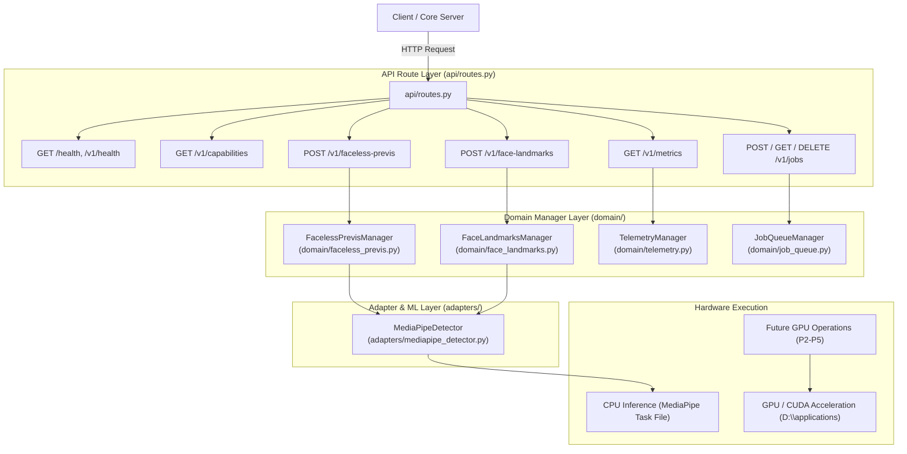

# Momelo Post-Processing Microservice Specification & Architecture Guide

เอกสารกำกับสถาปัตยกรรม แผนผังระบบ และคู่มือการระบุตำแหน่งไฟล์ (Diagnostic & File Mapping Guide) สำหรับ **Post-Processing Microservice** (พัฒนาด้วย **Python 3.10+ FastAPI + Uvicorn** รันบน `http://127.0.0.1:6501` คืนค่าข้อมูลในรูปแบบ **JSON Format 100%**)

---

## 1. ขอบเขตงานและโรดแมปตาม Requirement (021-PPS Master Scope)

โครงสร้างบริการถูกออกแบบให้รองรับ 6 ระยะหลัก (Phase P0 - P5) ตามข้อกำหนดใน [`requirements/021-post-processing-service/000-master.md`](file:///d:/development/ModelPromptForge/requirements/021-post-processing-service/000-master.md):

| Phase | ฟีเจอร์ / ความสามารถ | ฮาร์ดแวร์ประมวลผล | สถานะ | ไฟล์ที่รับผิดชอบหลัก (Owning Files) |
| :--- | :--- | :--- | :--- | :--- |
| **P0** | **Faceless Previs & Face Landmarks** | CPU Bounded | **Implemented** | [`domain/faceless_previs.py`](file:///d:/development/ModelPromptForge/post-processing-service/domain/faceless_previs.py), [`domain/face_landmarks.py`](file:///d:/development/ModelPromptForge/post-processing-service/domain/face_landmarks.py), [`adapters/mediapipe_detector.py`](file:///d:/development/ModelPromptForge/post-processing-service/adapters/mediapipe_detector.py) |
| **P1** | **Platform Readiness & Async Jobs Protocol** | CPU Bounded | **Implemented** | [`domain/job_queue.py`](file:///d:/development/ModelPromptForge/post-processing-service/domain/job_queue.py), [`domain/resilience_manager.py`](file:///d:/development/ModelPromptForge/post-processing-service/domain/resilience_manager.py), [`api/routes.py`](file:///d:/development/ModelPromptForge/post-processing-service/api/routes.py), [`config/service_config.py`](file:///d:/development/ModelPromptForge/post-processing-service/config/service_config.py) |
| **P2** | **Image Enhancement & Upscale** | **GPU Accelerated / PIL Lanczos Fallback** | **Implemented** | [`domain/image_enhancement_manager.py`](file:///d:/development/ModelPromptForge/post-processing-service/domain/image_enhancement_manager.py), [`adapters/image_enhancement_adapter.py`](file:///d:/development/ModelPromptForge/post-processing-service/adapters/image_enhancement_adapter.py) |
| **P3** | **Basic Video Processing & Interpolation** | **GPU Required** (PyTorch / FFmpeg CUDA / OpenCV) | **Implemented** | [`domain/video_processing_manager.py`](file:///d:/development/ModelPromptForge/post-processing-service/domain/video_processing_manager.py), [`adapters/video_processing_adapter.py`](file:///d:/development/ModelPromptForge/post-processing-service/adapters/video_processing_adapter.py) |
| **P4** | **Audio Analysis & Speaker Diarization** | CPU / GPU (Whisper ASR / Signal Diarizer) | **Implemented** *(ยังไม่ได้ทดสอบจริง - Untested / Pending Live Qualification)* | [`domain/audio_analysis_manager.py`](file:///d:/development/ModelPromptForge/post-processing-service/domain/audio_analysis_manager.py), [`adapters/audio_analysis_adapter.py`](file:///d:/development/ModelPromptForge/post-processing-service/adapters/audio_analysis_adapter.py) |
| **P5** | **Expressive TTS & Voice Synthesis** | **PyTorch CUDA / Formant Audio Engine** | **Implemented** *(Thonburian-TTS: Partial - Voice Clone OK, Text-to-Speech Pending)* | [`domain/expressive_tts_manager.py`](file:///d:/development/ModelPromptForge/post-processing-service/domain/expressive_tts_manager.py), [`adapters/thonburian_tts_adapter.py`](file:///d:/development/ModelPromptForge/post-processing-service/adapters/thonburian_tts_adapter.py), [`/tts-playground`](http://127.0.0.1:6501/tts-playground) |

---

## 2. ตาราง API Routes, GPU Requirement และไฟล์รับผิดชอบ (Diagnostic Route Map)

ตารางด้านล่างนี้ใช้เป็น **Diagnostic Map** เมื่อเกิดข้อผิดพลาด สามารถชี้จุดแก้ไขไปยังไฟล์และคลาสที่รับผิดชอบได้ทันที:



### รายละเอียดเจาะลึกแต่ละ Route และไฟล์ที่รับผิดชอบ:

#### 1. Liveness & Health Probes (`GET /health`, `GET /v1/health`)
- **คำอธิบาย**: ตรวจสอบสถานะว่ากระบวนการ (Process) เปิดทำงานอยู่หรือไม่
- **ต้องใช้ GPU หรือไม่**: ❌ **ไม่ต้องใช้** (CPU Only)
- **ไฟล์ที่รับผิดชอบ**: [`api/routes.py`](file:///d:/development/ModelPromptForge/post-processing-service/api/routes.py#L14-L18)
- **จุดตรวจสอบเมื่อเกิดปัญหา**: เช็กว่า Uvicorn Server เปิดรันที่พอร์ต 6501 หรือไม่

#### 2. Service Capabilities (`GET /v1/capabilities`)
- **คำอธิบาย**: คืนค่ารายการฟีเจอร์ที่พร้อมรัน ขอบเขตจำกัดภาพ และ Model SHA-256 Hash
- **ต้องใช้ GPU หรือไม่**: ❌ **ไม่ต้องใช้** (CPU Only)
- **ไฟล์ที่รับผิดชอบ**: [`api/routes.py`](file:///d:/development/ModelPromptForge/post-processing-service/api/routes.py#L20-L56) และ [`config/service_config.py`](file:///d:/development/ModelPromptForge/post-processing-service/config/service_config.py#L62-L74)
- **จุดตรวจสอบเมื่อเกิดปัญหา**: หากคืนค่า `available: false` ให้ตรวจสอบไฟล์โมเดลที่ `D:\applications\momelo-post-processing\models\face_landmarker.task`

#### 3. Telemetry & Metrics (`GET /v1/metrics`)
- **คำอธิบาย**: ดึงสถิติ Uptime, Latency เฉลี่ย, ปริมาณการใช้งาน Memory (RSS/VMS) และ Request Counts
- **ต้องใช้ GPU หรือไม่**: ❌ **ไม่ต้องใช้** (CPU Only)
- **ไฟล์ที่รับผิดชอบ**: [`domain/telemetry.py`](file:///d:/development/ModelPromptForge/post-processing-service/domain/telemetry.py#L5-L75) (`TelemetryManager`)
- **จุดตรวจสอบเมื่อเกิดปัญหา**: ตรวจสอบตัวแปร `telemetry_manager` ในกรณีที่ Latency หรือ Memory สูงผิดปกติ

#### 4. Faceless Previs Masking (`POST /v1/faceless-previs`)
- **คำอธิบาย**: ประมวลผลสร้างภาพตัวอย่างหน้าขาว (White-Mask Oval Overlay & Guide Crosshair)
- **ต้องใช้ GPU หรือไม่**: ❌ **ไม่ต้องใช้** (CPU Bounded ในเฟส P0)
- **ไฟล์ที่รับผิดชอบ**:
  - Route: [`api/routes.py`](file:///d:/development/ModelPromptForge/post-processing-service/api/routes.py#L67-L139)
  - Logic/Transform: [`domain/faceless_previs.py`](file:///d:/development/ModelPromptForge/post-processing-service/domain/faceless_previs.py#L5-L106) (`FacelessPrevisManager`)
  - ML Face Detection: [`adapters/mediapipe_detector.py`](file:///d:/development/ModelPromptForge/post-processing-service/adapters/mediapipe_detector.py#L8-L75) (`MediaPipeDetector`)
- **จุดตรวจสอบเมื่อเกิดปัญหา**:
  - `413 Entity Too Large`: ภาพเกินขนาดใน [`config/policy.json`](file:///d:/development/ModelPromptForge/post-processing-service/config/policy.json#L5) (`maxInputBytes`)
  - `422 Mismatch`: จำนวนใบหน้าที่ตรวจพบไม่ตรงกับ `x-expected-faces` (ลองเปลี่ยนภาพหรือปรับความสว่าง)

#### 5. Face Landmarks Detection (`POST /v1/face-landmarks`)
- **คำอธิบาย**: ตรวจจับและส่งคืนพิกัดโครงหน้าแบบ Normalized Coordinates (JSON format)
- **ต้องใช้ GPU หรือไม่**: ❌ **ไม่ต้องใช้** (CPU Bounded ในเฟส P0)
- **ไฟล์ที่รับผิดชอบ**:
  - Route: [`api/routes.py`](file:///d:/development/ModelPromptForge/post-processing-service/api/routes.py#L141-L205)
  - Logic/Extract: [`domain/face_landmarks.py`](file:///d:/development/ModelPromptForge/post-processing-service/domain/face_landmarks.py#L7-L66) (`FaceLandmarksManager`)
  - ML Detection: [`adapters/mediapipe_detector.py`](file:///d:/development/ModelPromptForge/post-processing-service/adapters/mediapipe_detector.py) (`MediaPipeDetector`)
- **จุดตรวจสอบเมื่อเกิดปัญหา**: เช็กพิกัด `faces` ที่ส่งกลับใน JSON Response

#### 6. Async Job Protocol (`POST /v1/jobs`, `GET /v1/jobs/{id}`, `GET /v1/jobs/{id}/result`, `DELETE /v1/jobs/{id}`)
- **คำอธิบาย**: ระบบจัดคิวงาน Async, ติดตามสถานะ (Progress/Stage), Idempotency และกู้คืนข้อมูลบนดิสก์
- **ต้องใช้ GPU หรือไม่**: ❌ **ไม่ต้องใช้** (CPU Queue Worker)
- **ไฟล์ที่รับผิดชอบ**:
  - Route: [`api/routes.py`](file:///d:/development/ModelPromptForge/post-processing-service/api/routes.py#L208-L315)
  - State Machine & Worker: [`domain/job_queue.py`](file:///d:/development/ModelPromptForge/post-processing-service/domain/job_queue.py#L14-L242) (`JobQueueManager`)
  - Storage Location: `D:\applications\momelo-post-processing\data\jobs.json`
- **จุดตรวจสอบเมื่อเกิดปัญหา**:
  - งานค้างที่สถานะ `processing`: ตรวจสอบ `jobTimeoutMs` (30s) ใน [`config/policy.json`](file:///d:/development/ModelPromptForge/post-processing-service/config/policy.json#L35)
  - งานหายหลังเซิร์ฟเวอร์ดับ: ตรวจสอบการสิทธิ์การเขียนไฟล์ที่ `D:\applications\momelo-post-processing\data\jobs.json`

#### 7. Expressive Text-to-Speech & Web Playground (`POST /v1/expressive-tts`, `POST /v1/thonburian-tts`, `GET /tts-playground`)
- **คำอธิบาย**: ระบบสังเคราะห์เสียงใส่อารมณ์ และ Zero-Shot Voice Cloning (Thonburian-TTS / F5-TTS Engine) รองรับภาษาไทย แท็กอารมณ์/จังหวะพูด (`[laughter]`, `[uv_break]`), Voice Seed, ความเร็วพูด และ Temperature พร้อมสตรีมไฟล์เสียงกลับมาเล่นบนหน้าเว็บได้ทันที

> [!WARNING]
> **สถานะ Thonburian-TTS (F5-TTS Engine)**: Thonburian-TTS ยังไม่สามารถใช้งานได้สมบูรณ์ในปัจจุบัน สามารถทำ Zero-Shot Voice Cloning เลียนแบบน้ำเสียงจากไฟล์เสียงอ้างอิงได้ แต่ยังไม่สามารถสังเคราะห์ออกเสียงคำอ่านภาษาไทยจากข้อความ (Text) ได้อย่างถูกต้องสมบูรณ์

- **ต้องใช้ GPU หรือไม่**: ⚖️ **CPU หรือ GPU (PyTorch CUDA)**
- **ไฟล์ที่รับผิดชอบ**:
  - Route & UI: [`api/routes.py`](file:///d:/development/ModelPromptForge/post-processing-service/api/routes.py) (`post_expressive_tts`, `get_tts_playground`)
  - Logic & Validation: [`domain/expressive_tts_manager.py`](file:///d:/development/ModelPromptForge/post-processing-service/domain/expressive_tts_manager.py) (`ExpressiveTtsManager`)
  - ML & Audio Adapter: [`adapters/expressive_tts_adapter.py`](file:///d:/development/ModelPromptForge/post-processing-service/adapters/expressive_tts_adapter.py) (`ExpressiveTtsAdapter`)
  - Policy Config: [`config/policy.json`](file:///d:/development/ModelPromptForge/post-processing-service/config/policy.json#L66-L82) (`expressiveTts`)
- **วิธีเปิดทดสอบบนบราวเซอร์ (Web Playground)**:
  1. เริ่มรันบริการด้วย `post-processing-service\scripts\start-service.bat`
  2. เปิดบราวเซอร์ไปที่: **`http://127.0.0.1:6501/tts-playground`**
  3. พิมพ์ข้อความภาษาไทย หรือใส่แท็กอารมณ์ เช่น `สวัสดีครับ [laughter] ยินดีต้อนรับครับ [uv_break]`
  4. เลือกอารมณ์ (`Happy`, `Neutral`, `Sad`, `Excited`), ปรับ Voice Seed (รหัสเสียง) และ Speed
  5. กดปุ่ม **✨ Generate Expressive Speech** เพื่อฟังเสียงสังเคราะห์บน HTML5 Audio Player สดๆ ได้ทันที
- **คำสั่ง cURL สำหรับยิง API**:
  ```bash
  curl -X POST http://127.0.0.1:6501/v1/expressive-tts \
    -H "X-Post-Processing-Token: dev-internal-token-change-in-production-32bytes" \
    -H "Content-Type: application/json" \
    -d '{
      "text": "สวัสดีครับ [laughter] ทดสอบการสังเคราะห์เสียงใส่อารมณ์",
      "voiceSeed": 42,
      "emotion": "happy",
      "speed": 1.0,
      "temperature": 0.3,
      "outputFormat": "WAV"
    }'
  ```

---

## 3. แผนงานฟีเจอร์ในอนาคต (Planned Operations: P2 - P5)

ฟีเจอร์ที่จะเพิ่มเข้ามาในระยะถัดไป จะปฏิบัติตาม Reusable Component Pattern (`<ProcessName>Manager`) เดียวกัน:

#### Phase P2: Image Enhancement & Upscale
- **Endpoint (วางแผน)**: `POST /v1/jobs` (operation: `image.upscale`, `image.enhance`)
- **ต้องใช้ GPU หรือไม่**: ⚡ **จำเป็นต้องใช้ GPU (PyTorch / CUDA)**
- **ไฟล์เป้าหมายที่จะสร้าง**:
  - Logic: `domain/image_enhancement.py` (`ImageEnhancementManager`)
  - Adapter: `adapters/upscale_adapter.py` (Real-ESRGAN / SwinIR Model)
  - Virtualenv & PyTorch Path: `D:\applications\momelo-post-processing\venv`

#### Phase P3: Video Processing & Frame Interpolation
- **Endpoint (วางแผน)**: `POST /v1/jobs` (operation: `video.interpolate`, `video.enhance`)
- **ต้องใช้ GPU หรือไม่**: ⚡ **จำเป็นต้องใช้ GPU (PyTorch CUDA + FFmpeg Hardware Acceleration)**
- **ไฟล์เป้าหมายที่จะสร้าง**:
  - Logic: `domain/video_processing.py` (`VideoProcessingManager`)
  - Adapter: `adapters/video_adapter.py` (RIFE / FILM Interpolation Model)

#### Phase P4: Audio Analysis & Diarization
- **Endpoint**: `POST /v1/audio/transcribe`, `POST /v1/audio/diarize`
- **ต้องใช้ GPU หรือไม่**: ⚖️ **CPU หรือ GPU** (Whisper ASR / Signal Diarization Model)
- **ไฟล์ที่รับผิดชอบ**:
  - Logic: [`domain/audio_analysis_manager.py`](file:///d:/development/ModelPromptForge/post-processing-service/domain/audio_analysis_manager.py) (`AudioAnalysisManager`)
  - Adapter: [`adapters/audio_analysis_adapter.py`](file:///d:/development/ModelPromptForge/post-processing-service/adapters/audio_analysis_adapter.py) (`AudioAnalysisAdapter`)

> [!WARNING]
> **สถานะ Phase P4 (Audio Analysis & Diarization)**: โมดูลและ API Endpoints สังเคราะห์ถอดความและแยกแยะผู้พูดได้รับการพัฒนาและทดสอบระดับ Unit/Mock API เรียบร้อยแล้ว แต่ **ยังไม่ได้ทดสอบจริง** กับไฟล์เสียงสนทนาการผลิตจริง (Untested / Pending Live Qualification)

#### Phase P5: Voice Repair & Lip-Sync
- **Endpoint (วางแผน)**: `POST /v1/jobs` (operation: `voice.lipsync`, `voice.repair`)
- **ต้องใช้ GPU หรือไม่**: ⚡ **จำเป็นต้องใช้ GPU (PyTorch CUDA)**
- **ไฟล์เป้าหมายที่จะสร้าง**:
  - Logic: `domain/lipsync_processing.py` (`LipSyncManager`)
  - Adapter: `adapters/lipsync_adapter.py` (Wav2Lip / SyncTalk Model)

---

## 4. คู่มือการแก้ไขปัญหาและวิเคราะห์ข้อผิดพลาด (Troubleshooting & Diagnostics Guide)

เมื่อระบบเกิดข้อผิดพลาด สามารถดู Error Code ใน JSON Response เพื่อชี้จุดแก้ไขได้ทันที:

| HTTP Status | Error Code | สาเหตุและการแก้ไข (Root Cause & Fix) | ไฟล์และตำแหน่งที่ต้องตรวจสอบ |
| :--- | :--- | :--- | :--- |
| `401 Unauthorized` | `unauthorized` | Header `x-post-processing-token` ไม่ถูกต้องหรือไม่ได้แนบมา | [`api/routes.py`](file:///d:/development/ModelPromptForge/post-processing-service/api/routes.py#L317-L322) (`verify_internal_token`) |
| `400 Bad Request` | `input_hash_mismatch` | ค่า `x-input-sha256` ไม่ตรงกับ SHA-256 ของรูปภาพที่ส่ง | [`api/routes.py`](file:///d:/development/ModelPromptForge/post-processing-service/api/routes.py#L101-L105) |
| `400 Bad Request` | `faceless_image_invalid` | ไฟล์รูปภาพเสียหาย ไม่สามารถ Decode เป็น PNG/JPEG/WebP ได้ | [`domain/faceless_previs.py`](file:///d:/development/ModelPromptForge/post-processing-service/domain/faceless_previs.py#L31-L35) |
| `413 Payload Too Large`| `faceless_input_size_invalid`| ไฟล์รูปภาพมีขนาดเกินขีดจำกัด `maxInputBytes` (25 MiB) | [`config/policy.json`](file:///d:/development/ModelPromptForge/post-processing-service/config/policy.json#L5) |
| `422 Unprocessable` | `faceless_face_count_mismatch`| ไม่พบบุคคลบนภาพ หรือจำนวนใบหน้าที่ตรวจพบไม่ตรงกับ `x-expected-faces` | [`domain/faceless_previs.py`](file:///d:/development/ModelPromptForge/post-processing-service/domain/faceless_previs.py#L55-L57) |
| `503 Service Unavailable`| `face_model_unavailable` | โมเดล ML `face_landmarker.task` ขาดหายไป หรือย้ายที่ | [`config/service_config.py`](file:///d:/development/ModelPromptForge/post-processing-service/config/service_config.py#L117-L129) |
| `500 Internal Error` | `job_execution_timeout` | การประมวลผล Job ใช้เวลานานเกินกำหนด 30 วินาที | [`domain/job_queue.py`](file:///d:/development/ModelPromptForge/post-processing-service/domain/job_queue.py#L155-L162) |

---

## 5. การรันและทดสอบระบบ (Execution & Validation)

### คำสั่งรันเซิร์ฟเวอร์ (Start Microservice)
```cmd
post-processing-service\scripts\start-service.bat
```

### คำสั่งทดสอบระบบอัตโนมัติ (Automated Test Suite)
```bash
# 1. ทดสอบระบบจัดคิวงาน Async & Resilience
D:\applications\momelo-post-processing\venv\Scripts\python.exe post-processing-service\scripts\test_async_jobs.py

# 2. ทดสอบระบบขยายภาพ AI Super-Resolution (Real-ESRGAN) & Anti-Aliasing
D:\applications\momelo-post-processing\venv\Scripts\python.exe post-processing-service\scripts\test_image_enhancement.py

# 3. ทดสอบระบบประมวลผลวิดีโอ (Video Frame Interpolation & Enhancement)
D:\applications\momelo-post-processing\venv\Scripts\python.exe post-processing-service\scripts\test_video_processing.py

# 4. ทดสอบระบบวิเคราะห์เสียง (Audio Transcription & Speaker Diarization)
D:\applications\momelo-post-processing\venv\Scripts\python.exe post-processing-service\scripts\test_audio_analysis.py

# 5. ทดสอบระบบสังเคราะห์เสียงใส่อารมณ์ Expressive TTS & Web Playground
D:\applications\momelo-post-processing\venv\Scripts\python.exe post-processing-service\scripts\test_expressive_tts.py
```

### Interactive Swagger UI
เปิดเบราว์เซอร์ไปที่ `http://127.0.0.1:6501/docs` เพื่อทดสอบยิง Request และดู API Schema แบบโต้ตอบได้ทันที
