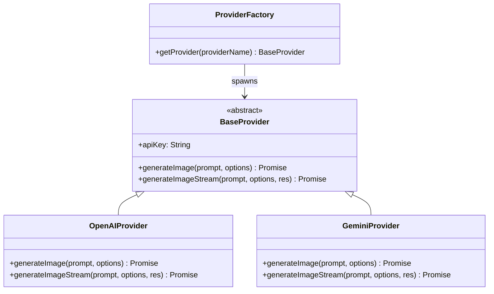

# Upgrade Step 5: Modular Providers & SSE Image Streaming
**ID**: 005-modular-generation-providers
**Target**: `ModelPromptForge`

This document specifies the requirements and design specifications for modularizing the image generation engine on the backend and adding progressive Server-Sent Events (SSE) streaming support for OpenAI's `gpt-image` models.

---

## 1. Modular Provider Engine (Strategy Pattern)

To scale the backend to support multiple image generation engines (OpenAI, Google Gemini, and future systems like Gemini Nanobanana), we will rewrite the generation router `/api/generate` to delegate requests to specialized provider classes.



### 1.1 Class Definitions
- **`BaseProvider`**: Abstract class defining the required contract for generating images synchronously or via stream.
- **`OpenAIProvider`**: Handles standard requests to `https://api.openai.com/v1/images/generations` using OpenAI submodels (`gpt-image-2`, `gpt-image-1.5`, `gpt-image-1`, `gpt-image-1-mini`, `dall-e-3`, `dall-e-2`).
- **`GeminiProvider`**: Handles Google Gemini/Imagen integrations (designed to accommodate upcoming Gemini models).

### 1.2 UI Default Selector Rules
To minimize default user costs and prevent high credit utilization on first load, the UI selectors must implement the following default selection patterns:
- **Default Category / Provider**: Default to **Google Gemini** (as it provides the lowest entry cost).
- **Default OpenAI Model**: When OpenAI is active, the submodel selection must default to the cheapest model, **GPT-Image 1 Mini** (`gpt-image-1-mini`).
- **Default Gemini Model**: When Google Gemini is active, the submodel selection must default to the cheapest model, **Nano Banana 2 Lite** (`gemini-3.1-flash-lite-image`).
- **Auto-Reset Selection**: Changing the Category must automatically refresh the Submodel list and set the selected item to the cheapest default model of that selected category.

---

## 2. OpenAI Image Generation Specification

We will support both Standard (Synchronous) and Streaming (Server-Sent Events) API configurations for OpenAI's image endpoint.

### 2.1 Standard Mode (Synchronous)
- **Endpoint**: `https://api.openai.com/v1/images/generations`
- **Request Body**:
  ```json
  {
    "model": "gpt-image-1.5",
    "prompt": "<compiled_prompt>",
    "n": 1,
    "size": "1024x1024"
  }
  ```
- **Response Handling**: Reads `data[0].b64_json` and returns the balance info alongside token usage metrics (`usage` containing total, input, and output tokens).

### 2.2 Streaming Mode (Progressive Loading)
- **Endpoint**: `https://api.openai.com/v1/images/generations`
- **Request Body**:
  ```json
  {
    "model": "gpt-image-1.5",
    "prompt": "<compiled_prompt>",
    "n": 1,
    "size": "1024x1024",
    "stream": true
  }
  ```
- **Stream Output Mapping**:
  - The backend proxies the streaming chunks using the Server-Sent Events (SSE) standard `text/event-stream`.
  - **Partial Event**: `image_generation.partial_image` -> passes dynamic base64 chunks directly to the client for progressive image painting.
  - **Completion Event**: `image_generation.completed` -> passes final completed image base64, deducts user credit, and returns token usage metadata.

---

## 3. Google Gemini (Nano Banana) Image Generation Specification

Gemini's native image generation capabilities, known as **Nano Banana**, utilize the Google GenAI Interactions API. We will support this via standard HTTP REST requests.

### 3.1 Endpoint and Headers
- **Endpoint**: `POST https://generativelanguage.googleapis.com/v1beta/interactions`
- **Headers**:
  ```http
  x-goog-api-key: <GEMINI_API_KEY>
  Content-Type: application/json
  ```

### 3.2 Supported Submodels
- `gemini-3.1-flash-lite-image` (Nano Banana 2 Lite): Optimized for velocity and cost. Supports 1K resolution only.
- `gemini-3.1-flash-image` (Nano Banana 2): Versatile generalist. Supports multiple reference image inputs and 0.5K, 1K, 2K, 4K resolution.
- `gemini-3-pro-image` (Nano Banana Pro): Premium model for complex tasks. Supports style references, consistency, and 1K, 2K, 4K resolution.
- `gemini-2.5-flash-image` (Nano Banana): Legacy model.

### 3.3 Request Payload
```json
{
  "model": "gemini-3.1-flash-image",
  "input": [
    {
      "type": "text",
      "text": "<compiled_prompt>"
    }
  ],
  "response_format": {
    "type": "image",
    "mime_type": "image/png",
    "aspect_ratio": "3:4",
    "image_size": "1K"
  }
}
```
*Note on Reference Images*:
- **Character Sheet Mode / Style Match**: If reference images are enabled, they are read as Base64 on the client, passed to the backend, and appended to the `input` array as `{ "type": "image", "mime_type": "image/png", "data": "<base64_data>" }` to serve as visual style guides.
- **Face Match (Identity Lock)**: If "Face Match" is activated, the user must upload a face reference image file. This image is sent to the backend as `faceReference` and appended to the Gemini interactions `input` array as a separate image object: `{ "type": "image", "mime_type": "image/png", "data": "<base64_face_data>" }`. This provides a physical face template for the Nano Banana model's consistency logic.

### 3.4 Aspect Ratio Mapping
- `1:1` -> `"1:1"`
- `16:9` -> `"16:9"`
- `9:16` -> `"9:16"`
- `6:8` -> `"3:4"` (Gemini supports native `3:4` aspect ratio)
- `4:5` -> `"4:5"`

### 3.5 Response Parsing
The response contains an array of `steps`. We will locate the step with `"type": "model_output"` and extract the Base64 image payload from the content block of type `"image"`:
```json
{
  "steps": [
    {
      "type": "model_output",
      "content": [
        {
          "type": "image",
          "mime_type": "image/png",
          "data": "<BASE64_IMAGE_DATA>"
        }
      ]
    }
  ]
}
```

---

## 4. Credit Deduction & Token Analytics

- **Standard Billing**: Deduct 1 credit per generation.
- **Advanced Billing (Configuration option)**: 
  - **OpenAI**: Read the `usage.total_tokens` field from the response and deduct credits dynamically (e.g. `1 credit = 100 tokens`).
  - **Gemini**: Thinking tokens and generation are billed according to model pricing. We will track if thought steps were generated and log them for analytics.
- **Telemetry Display**: Render `usage.input_tokens` / `usage.output_tokens` (for OpenAI) or step latency (for Gemini) directly inside the telemetry footer on the frontend.

---

## 5. Verification Plan

1. Verify that the backend strategy factory correctly resolves and instantiates the chosen provider.
2. Select **OpenAI** -> **gpt-image-1.5** -> Toggle **Stream Mode** -> Verify that images render progressively in the viewport as partial base64 packets arrive.
3. Select **Gemini** -> **gemini-3.1-flash-image** -> Click **Generate** -> Verify that the backend calls the interactions endpoint and returns the base64 output image.
4. Check the console and database log to confirm that credits are deducted upon generation completion.
