# Step 10: Secure Attribute Aggregation & Caching API

## 1. Goal Description
The objective is to secure the application's visual attributes configurations (preventing direct scraping of individual JSON files) and optimize page initialization performance by replacing multiple parallel client-side static file fetches with a single, server-aggregated, memory-cached API endpoint.

---

## 2. Architectural Design & Workflow

```mermaid
sequenceDiagram
    participant Client as Client Browser
    participant Server as Express Backend
    participant Disk as Attributes Directory

    rect rgb(20, 20, 30)
    Note over Server,Disk: Server Startup (Warm cache)
    Server->>Disk: Read all attribute specs & JSON files
    Disk->>Server: Return JSON objects
    Server->>Server: Merge & cache bundle in Memory
    end

    Client->>Server: GET /api/attributes/bundle (Single Request)
    alt Cache is Warmed
        Server->>Client: Send cached bundle payload (JSON)
    else Cache is Empty / Dev Mode
        Server->>Disk: Load & Merge
        Server->>Client: Send bundle payload (JSON)
    end
    Note over Client: Client parses bundle & dynamically renders forms
```



---

## 3. Step-by-Step Implementation Plan

### Part 3.1: Backend Bundle Endpoint & Restricting Direct Access
1. **Remove Static Direct Directory Exposure**:
   - Modify [**server/server.js**](file:///d:/development/ModelPromptForge/server/server.js) to remove or restrict the static route:
     ```javascript
     // DELETE or restrict:
     app.use('/attributes', express.static(pathModule.join(__dirname, '../attributes')));
     ```
     This blocks browsers from typing `http://localhost:6500/attributes/001-character.json` to scrape options.
2. **Implement Bundle Aggregator Route**:
   - Create a new API route `/api/attributes/bundle` inside the Express backend.
   - This route will:
     - Read the core config files: `ui-schema.json`, `prompt-templates.json`, `prompt-order.json`.
     - Read the list of individual files defined in `ATTRIBUTE_FILES` from the `attributes/` directory on disk.
     - Compile everything into a single structured object:
       ```json
       {
         "schema": [...],
         "templates": {...},
         "order": [...],
         "library": [...]
       }
       ```

### Part 3.2: In-Memory Caching (Zero-Disk-I/O after Startup)
1. Declare a global variable `let cachedAttributesBundle = null;` on the server.
2. On server start (and/or on first request), load all files, merge them, and save to `cachedAttributesBundle`.
3. Subsequent requests to `/api/attributes/bundle` immediately return the `cachedAttributesBundle` from memory (takes `< 5ms`).

### Part 3.3: Client Integration
1. Refactor the `initApp()` function inside [**client/app.js**](file:///d:/development/ModelPromptForge/client/app.js):
   - Replace the separate fetches with a single fetch call:
     ```javascript
     const res = await fetch("/api/attributes/bundle");
     const bundle = await res.json();
     ```
   - Instantly map:
     ```javascript
     state.schema = bundle.schema;
     state.templates = bundle.templates;
     state.order = bundle.order;
     state.library = bundle.library;
     ```
2. Trigger the form builder rendering seamlessly using the cached state.

---

## 4. Security Enhancements (Hooks for Future Phase)
If extra protection or bandwidth saving is required, the following hooks are supported by this design:
*   **Compression (Brotli/Gzip)**: Express automatically compresses the single response payload using standard compression middleware, reducing network size by up to 80%.
*   **Encryption/Obfuscation**:
    *   *Server side*: Before sending the bundle, encrypt it with a lightweight XOR cipher or standard AES-GCM (using a client-side shared dynamic key or simple obfuscation).
    *   *Client side*: Before passing the payload to `renderForm()`, run `decryptBundle(data)` to recover the readable JSON object in browser memory.
