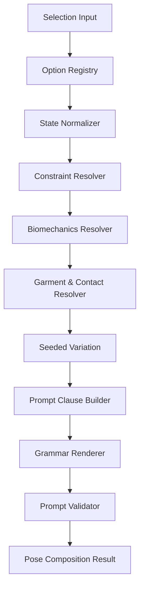

# Pose Composer — Software Design & Implementation Instruction

> **Document type:** Implementation specification  
> **Target module:** Deterministic Pose Composer (No AI/LLM at runtime)  
> **Primary use case:** สร้าง natural-language prompt สำหรับภาพแฟชั่นและภาพขายสินค้า จากตัวเลือกใน UI  
> **Reference input:** `011-pose.json`, garment attributes, optional environment attributes  
> **Status:** Ready for implementation

---

## 1. วัตถุประสงค์

ปรับโครงสร้าง Pose Composer จากระบบที่นำ `prompt_value` ของตัวเลือกหลายรายการมาต่อกันโดยตรง ให้เป็น **deterministic semantic compiler** ซึ่งสามารถ:

1. รับตัวเลือกที่ผู้ใช้เข้าใจง่าย เช่น Pose Intent, Hand Position และ Gaze
2. แปลงตัวเลือกเป็นสถานะทางความหมายของร่างกาย (`PoseState`)
3. เติมรายละเอียดด้านการรับน้ำหนัก แนวข้อต่อ ความไม่สมมาตร และการสัมผัสวัตถุอย่างมีเหตุผล
4. ตรวจและแก้ความขัดแย้งระหว่างตัวเลือกด้วยกฎตายตัว
5. ปกป้องรายละเอียดสำคัญของสินค้าไม่ให้มือ แขน หรือทิศลำตัวบัง
6. สร้าง prompt ที่อ่านเป็นคำกำกับการถ่ายแฟชั่นอย่างต่อเนื่อง ไม่ใช่รายการ keyword ที่แยกขาดจากกัน
7. ให้ผลลัพธ์ทำซ้ำได้เมื่อ input และ seed เหมือนกัน
8. รองรับการปรับแต่ง option และ rule โดยแก้ data/config โดยไม่ต้องแก้ compiler core

ระบบนี้ **ห้ามเรียก LLM, vision model หรือ generative AI ใด ๆ ใน runtime ของ Pose Composer** การอนุมานทั้งหมดต้องเกิดจาก schema, rule, template และ seeded variation ที่กำหนดไว้ล่วงหน้า

---

## 2. ปัญหาของโครงสร้างเดิม

โครงสร้างเดิมมีแนวโน้มทำงานดังนี้:

```text
selected options
→ read prompt.default / prompt.gpt-image
→ concatenate strings
→ send to image provider
```

ตัวอย่างผลลัพธ์:

```text
front-facing fashion product pose,
indicating fabric naturally,
soft camera connection,
relaxed posture,
professional fashion photography
```

ปัญหา:

- ไม่ระบุขารับน้ำหนักและขาที่ผ่อน
- ไม่รู้ว่า gesture ต้องสัมผัสผ้าบริเวณใด
- ไม่รู้ว่าส่วนใดของสินค้าห้ามบัง
- แต่ละ option อาจออกคำสั่งทับซ้อนหรือขัดกัน
- adjective เช่น `natural`, `relaxed`, `professional` ไม่ได้อธิบายหลักฐานที่มองเห็นได้
- ท่านั่งอาจได้รับ positive prompt ของท่ายืน
- hand และ gaze ซึ่งเป็น modifier ถูกปฏิบัติเหมือน base pose
- prompt ไม่มีความสัมพันธ์กับเสื้อผ้า props พื้นผิว และ environment

Pose Composer ใหม่ต้องถือว่า option เป็น **semantic instruction** ไม่ใช่ข้อความ prompt สำเร็จรูป

---

## 3. ขอบเขต

### 3.1 In scope

- Standing, Sitting, Reclining และ Walking base poses
- Hand gesture และ object interaction
- Gaze, head direction และ facial tension ระดับพื้นฐาน
- Product-display intent เช่น front view, back detail, silhouette, movement และ fabric detail
- การรับข้อมูลชนิดเสื้อผ้าและตำแหน่งสำคัญของสินค้า
- Interaction hook สำหรับ stool, wall, floor, table, stairs และ handheld props
- Provider-specific wording โดยใช้ template/profile ที่กำหนดไว้ล่วงหน้า
- Seeded variation
- Validation, warning, fallback และ debug trace

### 3.2 Out of scope

- วิเคราะห์รูปสินค้าด้วย computer vision
- ใช้ LLM เขียนหรือแก้ prompt
- สร้าง skeleton, OpenPose map หรือ ControlNet input
- รับประกันความถูกต้องของ anatomy จาก image provider
- ควบคุมองศาของทุกข้อต่อแบบ 3D rig
- สร้าง environment prompt เต็มระบบ; Pose Composer รองรับเพียง interaction contract

หากระบบมี Garment Analyzer หรือ Environment Composer แยกอยู่แล้ว ให้ส่งผลลัพธ์ในรูป structured data ตาม interface ของเอกสารนี้

---

## 4. หลักการออกแบบบังคับ

### 4.1 Semantic first

Option ทุกตัวต้องอธิบายความหมายในรูป field ที่เครื่องอ่านได้ เช่น:

```json
{
  "bodyOrientation": "front",
  "movementEnergy": "low",
  "garmentVisibility": "front_priority"
}
```

ห้ามใช้ `prompt_value` เป็น source of truth สำหรับ biomechanics

### 4.2 One owner per body domain

แต่ละ domain มีเจ้าของเพียงหนึ่งกลุ่ม:

| Domain | Primary owner |
|---|---|
| Body orientation, support, locomotion | Pose Intent / Base Pose |
| Shoulder, elbow, wrist, fingers | Hand Gesture |
| Head, eye line, eyelids | Gaze |
| Mouth, brow, cheek tension | Expression |
| Protected visual area, fabric behavior | Garment Context |
| Contact surface and available props | Environment Context |
| Lens wording and framing | Camera Profile |

Modifier ขอเปลี่ยน field ที่ไม่ได้เป็นเจ้าของได้เฉพาะผ่าน rule ที่ประกาศชัดเจน

### 4.3 Observable evidence over adjectives

Compiler ควรสร้างข้อความที่กล้องมองเห็นได้ เช่น:

```text
the opposite knee relaxes slightly
softly separated fingertips rest near the side seam
the fabric compresses subtly at the contact point
```

หลีกเลี่ยงการใช้คำกว้างเป็นแกนหลัก เช่น:

```text
perfect anatomy, natural pose, masterpiece, 8K, professional pose
```

### 4.4 Restrained asymmetry

ค่า default ต้องไม่สร้างร่างกายสมมาตรทั้งสองข้าง ยกเว้น pose ที่มีวัตถุประสงค์ทางเทคนิค เช่น passport/reference view

### 4.5 Commercial intent has precedence

ถ้าเป็นภาพขายสินค้า กฎรักษาการมองเห็นสินค้าอยู่เหนือความสวยเชิง editorial เช่น ห้าม gesture บังลายหน้าอก แม้ gesture นั้นจะดูน่าสนใจกว่า

### 4.6 Deterministic and explainable

ทุกการเลือก fallback, variation หรือ conflict resolution ต้องตรวจสอบย้อนหลังได้ผ่าน `debugTrace`

---

## 5. สถาปัตยกรรมโมดูล



### 5.1 Component responsibilities

| Component | Responsibility |
|---|---|
| `OptionRegistry` | โหลดและ validate definitions ของ option |
| `StateNormalizer` | รวม selection เป็น normalized `PoseState` |
| `ConstraintResolver` | ตรวจ conflict, exclusions, requirements และ precedence |
| `BiomechanicsResolver` | เติม support leg, free leg, pelvis, torso, shoulders และ movement phase |
| `GarmentContactResolver` | เลือก safe contact zone และป้องกัน hero zones |
| `VariationResolver` | เลือกความต่างเล็กน้อยด้วย seeded PRNG |
| `PromptClauseBuilder` | สร้าง clause ตาม domain โดยยังไม่จัดรูปประโยค |
| `GrammarRenderer` | เรียง clause และ render เป็นภาษาธรรมชาติ |
| `PromptValidator` | ตรวจความครบถ้วน ความขัดแย้ง และคำต้องห้าม |
| `ProviderAdapter` | ปรับศัพท์และความยาวตาม provider โดยไม่เปลี่ยน semantic state |

---

## 6. โครงสร้างไฟล์ที่แนะนำ

```text
pose-composer/
├─ src/
│  ├─ index.ts
│  ├─ types.ts
│  ├─ option-registry.ts
│  ├─ state-normalizer.ts
│  ├─ constraint-resolver.ts
│  ├─ biomechanics-resolver.ts
│  ├─ garment-contact-resolver.ts
│  ├─ variation-resolver.ts
│  ├─ clause-builder.ts
│  ├─ grammar-renderer.ts
│  ├─ prompt-validator.ts
│  ├─ provider-adapters/
│  │  ├─ generic.ts
│  │  ├─ gpt-image.ts
│  │  ├─ gemini-image.ts
│  │  └─ seedream.ts
│  └─ utils/
│     ├─ seeded-random.ts
│     ├─ weighted-choice.ts
│     └─ stable-sort.ts
├─ config/
│  ├─ base-poses.json
│  ├─ pose-intents.json
│  ├─ hand-gestures.json
│  ├─ gazes.json
│  ├─ expressions.json
│  ├─ garment-zones.json
│  ├─ interaction-rules.json
│  ├─ conflict-rules.json
│  ├─ biomechanics-profiles.json
│  └─ prompt-grammar.json
├─ schemas/
│  ├─ pose-option.schema.json
│  ├─ pose-input.schema.json
│  └─ pose-output.schema.json
└─ tests/
   ├─ fixtures/
   ├─ unit/
   ├─ integration/
   └─ snapshots/
```

ชื่อไฟล์ปรับตาม framework ของโครงการได้ แต่ต้องคง separation of concerns ตามตารางในหัวข้อ 5

---

## 7. Core Type Definitions

ตัวอย่างต่อไปนี้ใช้ TypeScript แต่สามารถแปลงเป็นภาษาอื่นได้

```ts
export type Side = 'left' | 'right';
export type AutoSide = Side | 'auto';

export type PoseFamily =
  | 'standing'
  | 'sitting'
  | 'reclining'
  | 'walking';

export type BodyOrientation =
  | 'front'
  | 'front_three_quarter'
  | 'profile'
  | 'back_three_quarter'
  | 'back';

export type MovementEnergy = 'still' | 'low' | 'medium' | 'high';

export type ContactStrength =
  | 'none'
  | 'near'
  | 'light_touch'
  | 'supported'
  | 'weight_bearing';

export interface PoseSelectionInput {
  basePoseId?: string;
  poseIntentId: string;
  handGestureId?: string;
  gazeId?: string;
  expressionId?: string;
  garment?: GarmentContext;
  environment?: EnvironmentInteractionContext;
  camera?: CameraContext;
  provider?: string;
  seed?: string | number;
  strictness?: 'product' | 'balanced' | 'editorial';
  outputDetail?: 'compact' | 'standard' | 'detailed';
}

export interface GarmentContext {
  category?:
    | 'top'
    | 'shirt'
    | 'jacket'
    | 'dress'
    | 'skirt'
    | 'pants'
    | 'full_outfit'
    | 'accessory'
    | 'unknown';
  heroZones?: GarmentZone[];
  safeContactZones?: GarmentZone[];
  visibilityPriority?:
    | 'front'
    | 'back'
    | 'side'
    | 'silhouette'
    | 'fabric_detail';
  fabricBehavior?:
    | 'structured'
    | 'soft_woven'
    | 'stretch'
    | 'fluid'
    | 'sheer_layered'
    | 'heavy'
    | 'unknown';
  avoidDistortion?: boolean;
}

export type GarmentZone =
  | 'center_chest'
  | 'front_placket'
  | 'neckline'
  | 'left_sleeve'
  | 'right_sleeve'
  | 'left_cuff'
  | 'right_cuff'
  | 'waist_front'
  | 'left_side_seam'
  | 'right_side_seam'
  | 'left_outer_hip'
  | 'right_outer_hip'
  | 'lower_hem'
  | 'skirt_outer_fold'
  | 'back_panel';

export interface EnvironmentInteractionContext {
  supportSurface?:
    | 'floor'
    | 'wall'
    | 'chair'
    | 'stool'
    | 'table'
    | 'stairs'
    | 'rug'
    | 'bed'
    | 'unknown';
  surfaceMaterial?: string;
  availableProps?: string[];
  weatherEffect?: 'none' | 'wind' | 'rain' | 'snow';
  windDirection?: 'camera_left' | 'camera_right' | 'toward_camera' | 'away_camera';
  windStrength?: 'light' | 'moderate' | 'strong';
}

export interface CameraContext {
  framing?: 'full_body' | 'three_quarter' | 'half_body' | 'close_up';
  cameraAngle?: 'eye_level' | 'low' | 'high';
  viewDirection?: BodyOrientation;
}
```

---

## 8. Option Definition Schema

Option ต้องไม่เก็บเพียง label และ prompt string แต่ต้องมี semantic contribution, constraints, variation และ prompt tokens

```ts
export interface PoseOptionDefinition {
  id: string;
  kind: 'base_pose' | 'intent' | 'hand' | 'gaze' | 'expression';
  label: Record<string, string>;
  enabled: boolean;
  semantic: Partial<PoseState>;
  constraints?: PoseConstraint[];
  requirements?: PoseRequirement[];
  compatibility?: CompatibilityDefinition;
  variations?: VariationDefinition[];
  renderHints?: RenderHints;
  legacy?: {
    sourceId?: string;
    tags?: string[];
  };
}
```

### 8.1 ตัวอย่าง Pose Intent

```json
{
  "id": "pose.intent.front_product_view",
  "kind": "intent",
  "label": {
    "en": "Front Product View",
    "th": "โชว์สินค้าด้านหน้า"
  },
  "enabled": true,
  "semantic": {
    "family": "standing",
    "bodyOrientation": "front",
    "movementEnergy": "low",
    "garmentVisibility": "front_priority",
    "torsoRotation": "minimal",
    "pelvisRotation": "minimal",
    "asymmetry": "subtle"
  },
  "constraints": [
    { "type": "protect_garment_front" },
    { "type": "max_body_rotation", "value": "mild" },
    { "type": "avoid_crossed_arms" },
    { "type": "avoid_symmetric_hands" }
  ],
  "variations": [
    {
      "field": "supportSide",
      "choices": ["left", "right"],
      "weights": [1, 1]
    }
  ]
}
```

### 8.2 ตัวอย่าง Hand Gesture

```json
{
  "id": "pose.hand.indicate_fabric_naturally",
  "kind": "hand",
  "label": {
    "en": "Indicate Fabric Naturally",
    "th": "แตะเนื้อผ้าอย่างเป็นธรรมชาติ"
  },
  "enabled": true,
  "semantic": {
    "handIntent": "draw_attention_to_garment",
    "primaryHandSide": "auto",
    "handContactStrength": "light_touch",
    "wristState": "relaxed",
    "fingerState": "softly_separated",
    "elbowState": "slightly_bent",
    "secondaryHandBehavior": "relaxed_at_side"
  },
  "constraints": [
    { "type": "avoid_flat_palm" },
    { "type": "avoid_hero_zones" },
    { "type": "avoid_fabric_distortion" }
  ],
  "requirements": [
    { "type": "requires_safe_contact_zone" }
  ]
}
```

### 8.3 ตัวอย่าง Gaze

```json
{
  "id": "pose.gaze.soft_camera_connection",
  "kind": "gaze",
  "label": {
    "en": "Soft Camera Connection",
    "th": "สบตากล้องอย่างนุ่มนวล"
  },
  "enabled": true,
  "semantic": {
    "eyeTarget": "camera_lens",
    "headRelationToCamera": "near_axis",
    "eyelidTension": "relaxed",
    "browTension": "low",
    "mouthTension": "relaxed",
    "gazeIntensity": "soft"
  },
  "constraints": [
    { "type": "avoid_excessive_head_tilt" },
    { "type": "avoid_intense_stare" }
  ]
}
```

---

## 9. Normalized Pose State

หลังรวม option แล้ว ระบบต้องสร้าง state กลางหนึ่งชุด ห้าม render prompt จาก option โดยตรง

```ts
export interface PoseState {
  family: PoseFamily;
  intent: string;
  bodyOrientation: BodyOrientation;
  movementEnergy: MovementEnergy;

  supportSide: AutoSide;
  supportType: 'bilateral' | 'dominant_leg' | 'seated' | 'reclined' | 'moving';
  freeLegState?: 'relaxed' | 'slightly_forward' | 'slightly_outward' | 'swinging';
  freeKneeState?: 'straight' | 'soft' | 'bent';
  footContact?: 'full' | 'heel_light' | 'toe_light' | 'step_transition';

  pelvisAlignment: 'level' | 'subtle_shift' | 'counter_shift' | 'moving';
  pelvisRotation: 'minimal' | 'mild' | 'moderate';
  torsoRotation: 'minimal' | 'mild' | 'moderate';
  torsoLean: 'none' | 'slight_forward' | 'slight_backward' | 'toward_support';
  shoulderRelation: 'level' | 'subtle_opposition' | 'movement_counter_rotation';
  spineAction: 'neutral' | 'elongated' | 'gentle_extension' | 'gentle_curve';

  primaryHandSide?: AutoSide;
  handIntent?: string;
  handContactZone?: GarmentZone | string;
  handContactStrength?: ContactStrength;
  wristState?: 'neutral' | 'relaxed' | 'gently_flexed';
  fingerState?: 'relaxed_curve' | 'softly_separated' | 'light_grip';
  elbowState?: 'relaxed' | 'slightly_bent' | 'supported';
  secondaryHandBehavior?: string;

  headDirection?: string;
  headTilt?: 'none' | 'very_slight_left' | 'very_slight_right';
  eyeTarget?: string;
  gazeIntensity?: 'soft' | 'neutral' | 'focused';
  eyelidTension?: 'relaxed' | 'neutral';
  browTension?: 'low' | 'neutral' | 'focused';
  mouthTension?: 'relaxed' | 'neutral' | 'slight_smile';

  garmentVisibility?: string;
  protectedZones: GarmentZone[];
  safeContactZones: GarmentZone[];
  fabricBehavior?: string;

  interaction?: ResolvedInteraction;
  constraints: PoseConstraint[];
  warnings: PoseWarning[];
}
```

---

## 10. Merge และ Precedence Rules

### 10.1 Priority

เมื่อ option ตั้งค่า field เดียวกัน ให้ใช้ priority ดังนี้:

```text
Safety / impossible-state guard
> explicit user lock
> commercial garment protection
> base pose mechanics
> environment contact requirement
> hand/object interaction
> pose intent styling
> gaze and expression modifier
> seeded variation
> generic default
```

### 10.2 Field merge behavior

| Field type | Merge strategy |
|---|---|
| Single enum | ค่าที่ priority สูงกว่าชนะ |
| Protected zones | union |
| Safe zones | intersection ก่อน; หากว่างให้ fallback |
| Constraints | union + stable sort by priority |
| Warnings | append และ deduplicate ตาม code |
| Variations | ใช้เฉพาะ field ที่ยังไม่ได้ lock |

### 10.3 Conflict outcomes

Rule แต่ละตัวต้องกำหนด action หนึ่งแบบ:

```ts
type ConflictAction =
  | 'reject'
  | 'replace'
  | 'downgrade'
  | 'remove_modifier'
  | 'use_fallback'
  | 'warn_only';
```

- `reject`: ใช้เฉพาะ input ที่ไม่สามารถสร้างผลลัพธ์สมเหตุผลได้
- `replace`: เปลี่ยน option เป็นตัวที่เข้ากันได้และแจ้ง UI
- `downgrade`: ลดระดับ เช่น strong twist → mild twist
- `remove_modifier`: ตัด modifier ที่ priority ต่ำกว่า
- `use_fallback`: เลือก safe default
- `warn_only`: ใช้ต่อได้แต่รายงานข้อจำกัด

---

## 11. Biomechanics Rule Set

กฎต่อไปนี้เป็น baseline สำหรับ prompt composition ไม่ใช่คำแนะนำทางการแพทย์หรือการวัด motion capture

### 11.1 Standing

ค่า default สำหรับแฟชั่นที่ไม่ใช่ technical reference:

```text
supportType = dominant_leg
supportSide = seeded left/right
freeKneeState = soft
pelvisAlignment = subtle_shift
shoulderRelation = subtle_opposition
spineAction = elongated
movementEnergy = low
```

กฎ:

1. ถ้าขาหนึ่งรับน้ำหนัก อีกเข่าต้องไม่ถูกบรรยายว่า locked
2. ถ้า pelvis shift ไปด้าน support ไหล่ต้องไม่เอียงตามในระดับเท่ากันทั้งหมด
3. Front product view อนุญาตเพียง mild asymmetry และ minimal rotation
4. Editorial contrapposto อนุญาต asymmetry สูงกว่า แต่ห้ามทำลาย garment visibility lock
5. แขนสองข้างห้ามมี gesture เดียวกันโดย default

### 11.2 Sitting

ต้องมี:

- support surface
- จุดรับน้ำหนักของสะโพก/ที่นั่ง
- สถานะเท้าหรือขาที่ห้อย
- ความสัมพันธ์ของ torso กับพนักหรือการพยุงตัว

กฎ:

1. หากเป็น stool อย่างน้อยหนึ่งเท้าควรมีจุดรองรับ เช่น rung หรือพื้น
2. ถ้า torso เอนไปหลัง ต้องมีมือ พนัก หรือพื้นรองรับ
3. ถ้าไขว้ขา ต้องระบุว่าไขว้ที่เข่าหรือข้อเท้าเพียงแบบเดียว
4. ห้าม render คำว่า `standing pose`

### 11.3 Reclining

ต้องแยกจาก Sitting อย่างชัดเจน

กฎ:

1. ต้องระบุด้านของ shoulder/hip ที่รับพื้น
2. หากช่วงอกยกขึ้น ต้องมี elbow, forearm หรือ hand support
3. ขาบนควรเหลื่อมจากขาล่างเล็กน้อยเพื่อป้องกัน silhouette ซ้อนทับแข็ง
4. ห้ามใช้คำว่า `seated pose`

### 11.4 Walking

เลือก movement phase เพียงหนึ่งเฟสต่อ prompt:

```ts
type WalkingPhase =
  | 'heel_strike'
  | 'mid_stance'
  | 'toe_off'
  | 'mid_swing';
```

กฎ:

1. ระบุขา stance และขา swing ให้สอดคล้องกัน
2. แขนต้องแกว่งสวนกับขาด้านหน้า เว้นแต่กำลังถือ prop
3. ถ้ามือหนึ่งถือกระเป๋าหรือสายกระเป๋า ให้ลด arm swing ฝั่งนั้น
4. ผม ชายเสื้อ และเครื่องประดับต้องเคลื่อนไปตามทิศทางเดียวกัน
5. Walking down stairs ต้องมีขั้นบน ขั้นล่าง เท้านำ และการมองขั้นถัดไป

### 11.5 Hand and wrist

1. Hand-near-face ต้องระบุ `near` หรือ `light_touch` ห้ามปล่อยกำกวม
2. Light touch ใช้ fingertips ไม่ใช่ฝ่ามือแปะราบ เว้นแต่ option ระบุ
3. Wrist default เป็น `relaxed` หรือ `neutral`; หลีกเลี่ยง extreme flexion
4. Object grip ต้องระบุจุดจับและแรงที่เหมาะกับน้ำหนักวัตถุ
5. มือที่สัมผัสผ้าต้องสร้างผลต่อผ้าเพียงระดับที่ intent อนุญาต
6. ห้ามใช้คำเกี่ยวกับรูปร่างนิ้ว เช่น `perfect slender fingers` แทน mechanics

### 11.6 Head and gaze

1. Eye target และ head direction เป็นคนละ field
2. Soft camera connection: ศีรษะใกล้แกนกล้อง ดวงตามองเลนส์ ความตึงต่ำ
3. Looking away ต้องมี target เช่น `off-frame at eye level`
4. Looking down ให้ตาลดลงก่อนและคางก้มเพียงเล็กน้อย
5. Over-shoulder gaze ต้องกระจาย rotation ผ่าน pelvis/torso/shoulder/head ไม่บิดเฉพาะคอ

---

## 12. Garment-Aware Contact Resolution

### 12.1 Input priority

1. ใช้ `garment.safeContactZones` ถ้ามี
2. ลบทุก zone ที่อยู่ใน `heroZones`
3. กรองด้วย pose orientation และ framing
4. กรองด้วย reachability ของมือ
5. เลือก zone ด้วย seeded weighted choice
6. ถ้าไม่เหลือ zone ให้เปลี่ยน gesture เป็น `relaxed_at_side` และออก warning

### 12.2 Default garment zones

| Garment category | Default hero zones | Default safe contact zones |
|---|---|---|
| Shirt/blouse | center chest, placket, neckline | side seam, outer hip, lower hem |
| Jacket | front closure, lapels | lower front edge, side seam, cuff when not featured |
| Dress | front bodice, waist detail | side seam, outer skirt fold, lower hem |
| Skirt | waist front, central print | outer hip, outer fold, lower hem |
| Pants | waist front, front crease | pocket edge, outer hip, side seam |
| Full outfit | supplied hero zones | side seam/outer silhouette zones only |

### 12.3 Fabric behavior wording

| Fabric behavior | Allowed response |
|---|---|
| Structured | minor compression, clean edge retention |
| Soft woven | small natural fold near touch point |
| Stretch | minimal indentation, avoid pulling out of shape |
| Fluid | gentle drape displacement, delayed movement |
| Heavy | restrained movement, clear weight in folds |
| Sheer/layered | avoid gripping; light edge contact only |

### 12.4 Resolver pseudocode

```ts
function resolveGarmentContact(
  state: PoseState,
  garment: GarmentContext,
  rng: SeededRandom
): PoseState {
  if (state.handIntent !== 'draw_attention_to_garment') return state;

  const safe = resolveDefaultSafeZones(garment);
  const protectedSet = new Set(resolveProtectedZones(garment));

  const candidates = safe
    .filter(zone => !protectedSet.has(zone))
    .filter(zone => isVisible(zone, state.bodyOrientation))
    .filter(zone => isReachable(zone, state.primaryHandSide, state.family));

  if (candidates.length === 0) {
    return applyFallback(state, {
      secondaryHandBehavior: 'relaxed_at_side',
      warning: {
        code: 'NO_SAFE_GARMENT_CONTACT',
        message: 'Fabric gesture replaced to preserve product visibility.'
      }
    });
  }

  return {
    ...state,
    handContactZone: rng.weightedChoice(candidates),
    handContactStrength: 'light_touch'
  };
}
```

---

## 13. Environment Interaction Contract

Pose Composer ไม่ควรสร้าง location เต็มรูปแบบ แต่ต้องรับข้อมูลที่มีผลต่อท่าทาง

### 13.1 Supported interactions

```ts
export interface ResolvedInteraction {
  type:
    | 'none'
    | 'lean_against'
    | 'sit_on'
    | 'support_on'
    | 'step_on'
    | 'hold_prop'
    | 'weather_response';
  target?: string;
  bodyContactPoints?: string[];
  contactStrength?: ContactStrength;
  visibleEffects?: string[];
}
```

### 13.2 Interaction rules

| Interaction | Required physical evidence |
|---|---|
| Leaning on wall | จุดสัมผัส, body support, fabric compression, contact shadow |
| Sitting on chair/stool | seat support, foot/rung relationship, garment folds at hip |
| Hand on table | elbow/hand support, slight shoulder response, contact shadow |
| Walking on wet ground | shorter controlled step, foot contact, optional small splash |
| Wind | hair, loose garment and accessory move coherently |
| Holding prop | grip type, object weight response, reduced arm swing if walking |

หาก environment ไม่ได้ส่งข้อมูล interaction ให้ระบบไม่ควรสร้าง wall, chair หรือ prop ขึ้นมาเอง

---

## 14. Seeded Natural Variation

Variation มีไว้ลดความซ้ำ ไม่ใช่เปลี่ยน pose intent

### 14.1 Requirements

- PRNG ต้อง deterministic ข้าม request ใน runtime เดียวกัน
- Input และ seed เดิมต้องได้ `PoseState` และ prompt เดิม
- Variation ทำงานหลัง conflict resolution
- ห้ามเปลี่ยน field ที่ถูก user lock หรือ constraint lock
- ทุก choice ต้องมี stable ordering ก่อนสุ่ม

### 14.2 Allowed variation fields

- support side
- free-foot offset
- very slight head tilt
- primary hand side เมื่อ safe zones รองรับ
- safe garment contact zone
- secondary hand resting behavior
- walking phase ภายใน intent ที่รองรับ

### 14.3 Forbidden variation fields

- front view เป็น back view
- standing เป็น sitting
- hand gesture ที่บัง hero zone
- soft gaze เป็น intense gaze
- low movement เป็น jumping/running
- เปลี่ยน prop หรือ environment ที่ผู้ใช้ไม่ได้เลือก

### 14.4 Stable selection

```ts
const candidates = [...choices].sort((a, b) => a.id.localeCompare(b.id));
const selected = rng.weightedChoice(candidates);
```

ห้ามพึ่งลำดับ object key หรือ filesystem load order

---

## 15. Prompt Clause Model

ห้ามสร้าง final prompt ระหว่าง resolve state ให้สร้าง clause object ก่อน

```ts
export interface PromptClause {
  id: string;
  domain:
    | 'intent'
    | 'support'
    | 'body_alignment'
    | 'hand'
    | 'gaze'
    | 'garment_response'
    | 'interaction'
    | 'guardrail';
  priority: number;
  subject: string;
  predicate: string;
  optional?: boolean;
  providerTags?: string[];
}
```

ตัวอย่าง:

```json
{
  "id": "support.dominant_leg.right",
  "domain": "support",
  "priority": 900,
  "subject": "Her weight",
  "predicate": "settles naturally into her right leg while the opposite knee remains softly relaxed"
}
```

---

## 16. Prompt Grammar และลำดับประโยค

### 16.1 Standard order

```text
1. Commercial intent and body orientation
2. Weight support and lower body
3. Pelvis, torso and shoulder relationship
4. Primary and secondary hand behavior
5. Garment/contact response
6. Head direction, gaze and facial tension
7. Environment interaction evidence
8. Compact guardrail sentence when required
```

ลำดับนี้ทำให้ทุกประโยคอ้างอิงสถานะที่ถูกสร้างก่อนหน้า เช่น hand clause จะรู้ body orientation และ garment zone แล้ว

### 16.2 Sentence templates

```json
{
  "intent.front_product": [
    "The model stands mostly front-facing so {garmentFrontDescription} remains clearly visible.",
    "She maintains a predominantly front-facing presentation, preserving a clear view of {garmentFrontDescription}."
  ],
  "support.dominant_leg": [
    "Her weight settles naturally into her {supportSide} leg while the opposite knee relaxes slightly.",
    "Most of her support rests through the {supportSide} leg, leaving the other knee softly released."
  ],
  "alignment.subtle_opposition": [
    "Her pelvis stays nearly square to the camera while one shoulder rests fractionally lower, preventing a rigid symmetrical stance."
  ],
  "hand.fabric_light_touch": [
    "Her {primaryHand} hand lightly draws attention to {contactZone} with softly separated fingertips, a relaxed wrist and a naturally bent elbow."
  ],
  "gaze.soft_camera": [
    "Her head remains close to the camera axis as she looks into the lens with relaxed eyelids and a calm, approachable expression."
  ]
}
```

### 16.3 Grammar requirements

- ใช้ pronoun และ subject ให้สม่ำเสมอ
- หลีกเลี่ยงคำซ้ำ เช่น `natural`, `relaxed`, `soft` เกินค่าที่กำหนด
- ทุก sentence ต้องเพิ่มข้อมูลใหม่
- ห้ามสร้าง comma list ยาวเกิน provider profile
- ไม่กล่าวถึงค่า internal เช่น enum, lock, constraint หรือ seed
- ไม่ใช้ตัวเลของศาใน prompt มาตรฐาน เว้นแต่ provider profile ระบุว่ารองรับ
- `camera-left` และ `her left` ต้องไม่สลับความหมายกัน

### 16.4 Lexical repetition guard

กำหนด default maximum ต่อ standard prompt:

```json
{
  "natural": 2,
  "relaxed": 3,
  "soft": 3,
  "elegant": 1,
  "professional": 1
}
```

หากเกิน ให้ renderer ใช้ synonym ที่กำหนดไว้ล่วงหน้าหรือตัดคำที่ไม่จำเป็น ห้ามสร้าง synonym ด้วย AI

---

## 17. Output Detail Profiles

### Compact

- 45–80 คำภาษาอังกฤษ
- เหมาะกับการประกอบเข้ากับ character/environment prompt ขนาดใหญ่
- ต้องมี intent, support, hand และ gaze

### Standard

- 90–160 คำ
- เป็นค่า default
- มี lower body, alignment, hand, gaze และ garment response

### Detailed

- 160–260 คำ
- เพิ่ม contact evidence และ movement response
- ห้ามเพิ่มข้อมูล environment ที่ไม่ได้รับจาก input

การตัดความยาวต้องตัด clause ตาม `priority` ไม่ใช่ตัด string ท้ายข้อความ

---

## 18. Provider Adapter

Provider adapter มีหน้าที่ปรับรูปแบบภาษาเท่านั้น ห้ามแก้ `PoseState`

```ts
export interface ProviderPromptProfile {
  id: string;
  preferredStyle: 'prose' | 'compact_phrases' | 'hybrid';
  maxPoseWords: number;
  supportsNegativePrompt: boolean;
  sideTerminology: 'subject_side' | 'camera_side';
  repetitionTolerance: 'low' | 'medium';
  guardrailPlacement: 'inline' | 'negative' | 'omit_if_redundant';
}
```

ข้อบังคับ:

- semantic result เดียวกันต้องรักษาความหมายข้าม provider
- ห้ามสร้าง biomechanics คนละท่าสำหรับ provider ต่างกัน
- provider adapter เพิ่มหรือลดเพียง wording และ verbosity

---

## 19. Prompt Validation

### 19.1 Error conditions

- ไม่มี base family หลัง normalization
- walking ไม่มี stance/swing relationship
- reclining ไม่มี support point
- leaning ไม่มี target surface
- hand contact zone อยู่ใน protected zone
- hand gesture ต้องการ prop แต่ไม่มี prop
- front product view ถูก body orientation แบบ back override
- prompt มีคำ `standing` และ `seated/reclining` พร้อมกันโดยไม่มีเหตุผล

### 19.2 Warning conditions

- ไม่มี garment context จึงใช้ generic safe zone
- ไม่มี environment surface สำหรับ pose ที่ควรมี interaction
- framing อาจตัดมือหรือเท้าที่ pose ต้องการแสดง
- conflict ถูก downgrade หรือ fallback
- provider word limit ทำให้ clause รองถูกตัด

### 19.3 Semantic validation ก่อน string validation

ตรวจ `PoseState` ก่อน render แล้วตรวจ final string ซ้ำอีกชั้น ห้ามใช้ regex ตรวจ prompt เป็นกลไกหลักในการแก้ conflict

---

## 20. Public API

```ts
export interface PoseCompositionResult {
  prompt: string;
  negativePrompt?: string;
  state: PoseState;
  appliedOptionIds: string[];
  substitutions: Array<{
    from: string;
    to: string;
    ruleId: string;
    reason: string;
  }>;
  warnings: PoseWarning[];
  debugTrace?: DebugTraceEntry[];
  version: string;
}

export interface PoseComposer {
  compose(input: PoseSelectionInput): PoseCompositionResult;
  validateInput(input: PoseSelectionInput): ValidationResult;
  explain(result: PoseCompositionResult): PoseExplanation;
}
```

ตัวอย่างการเรียก:

```ts
const result = poseComposer.compose({
  poseIntentId: 'pose.intent.front_product_view',
  handGestureId: 'pose.hand.indicate_fabric_naturally',
  gazeId: 'pose.gaze.soft_camera_connection',
  garment: {
    category: 'shirt',
    heroZones: ['center_chest', 'front_placket'],
    safeContactZones: ['left_side_seam', 'right_side_seam', 'lower_hem'],
    visibilityPriority: 'front',
    fabricBehavior: 'soft_woven',
    avoidDistortion: true
  },
  camera: {
    framing: 'full_body',
    cameraAngle: 'eye_level',
    viewDirection: 'front'
  },
  strictness: 'product',
  outputDetail: 'standard',
  provider: 'gpt-image',
  seed: 'product-001-look-01'
});
```

---

## 21. Expected Output Example

```text
The model stands mostly front-facing so the garment’s front construction,
fit and overall silhouette remain clearly visible. Her weight settles into
her right leg while the opposite knee relaxes slightly, adding restrained
asymmetry without rotating the garment away from the camera. Her pelvis
remains nearly square to the lens, with one shoulder resting fractionally
lower to avoid a rigid stance.

Her left hand lightly draws attention to the lower side seam using softly
separated fingertips, without covering the chest design or front placket.
The wrist remains easy and the elbow bends naturally away from the torso,
while the other arm rests loosely at her side. The touch creates only a small
local fold in the soft woven fabric without pulling it out of shape. Her head
stays close to the camera axis as she looks into the lens with relaxed eyelids
and a calm, approachable expression.
```

สิ่งที่ต้องคงไว้:

- front garment visibility
- restrained asymmetry
- support/free-leg relationship
- safe hand contact
- fabric response
- gaze ที่สอดคล้องกับ head direction

---

## 22. Conflict Rule Examples

### 22.1 Front product + crossed arms

```json
{
  "id": "conflict.front_product.crossed_arms",
  "priority": 1000,
  "when": {
    "poseIntentId": "pose.intent.front_product_view",
    "handGestureId": "pose.hand.crossed_arms"
  },
  "action": "replace",
  "replacement": "pose.hand.relaxed_at_side",
  "reason": "Crossed arms obscure the garment front."
}
```

### 22.2 Walking + both hands on hips

```json
{
  "id": "conflict.walking.double_hand_hip",
  "priority": 900,
  "when": {
    "family": "walking",
    "handGestureId": "pose.hand.both_hands_on_hips"
  },
  "action": "replace",
  "replacement": "pose.hand.single_hand_near_hip",
  "reason": "Preserve counter-swing and locomotion coherence."
}
```

### 22.3 Reclining + missing surface

```json
{
  "id": "requirement.reclining.surface",
  "priority": 1000,
  "when": {
    "family": "reclining",
    "environment.supportSurface": null
  },
  "action": "use_fallback",
  "fallback": {
    "supportSurface": "floor"
  },
  "warning": "A neutral floor support was assumed for the reclining pose."
}
```

---

## 23. Migration Plan จาก `011-pose.json`

### 23.1 Reclassify

| Existing group | New kind |
|---|---|
| Standing | `base_pose` |
| Sitting | `base_pose`; ย้าย lying เป็น `reclining` |
| Walking | `base_pose` |
| Hand Position | `hand` modifier |
| Eye Contact | `gaze` modifier |

### 23.2 Immediate corrections

- `pose.sitting_02` เปลี่ยน label จาก `Laying Down Side View` เป็น `Lying on Side` หรือ `Side Reclining`
- ย้าย `pose.sitting_02` ไป family `reclining`
- ลบ `comfortable seated pose` ออกจาก reclining option
- เปลี่ยน `editorial standing pose` ใน `pose.sitting_01` เป็น seated wording
- แยก photography/style terms ออกจาก pose definitions
- เก็บ legacy prompt ไว้ใน `legacy` ชั่วคราวเพื่อ regression comparison เท่านั้น

### 23.3 Migration stages

1. เพิ่ม schema ใหม่โดยยังไม่ลบไฟล์เดิม
2. สร้าง mapping จาก legacy ID ไป option ใหม่
3. เขียน fixture สำหรับทั้ง 25 legacy IDs
4. เปิดใช้ new compiler หลัง feature flag
5. log substitutions และ warnings ในช่วง pilot
6. เปรียบเทียบ prompt และภาพตัวอย่างแบบ manual QA
7. ปิด direct concatenation
8. ลบ legacy prompt field เมื่อไม่มี consumer เหลือ

---

## 24. Test Strategy

### 24.1 Unit tests

- option schema validation
- merge precedence
- safe-zone intersection
- protected-zone removal
- seeded weighted choice
- side consistency
- walking phase consistency
- clause ordering
- lexical repetition guard
- provider word-limit trimming

### 24.2 Determinism test

```ts
expect(compose(inputWithSeedA)).toEqual(compose(inputWithSeedA));
expect(compose(inputWithSeedA).state).not.toEqual(compose(inputWithSeedB).state);
```

ข้อยกเว้น: seed ต่างกันอาจได้ state เหมือนกันได้ตามจำนวน candidate ดังนั้น production test ควรทดสอบหลาย seed แทนการบังคับทุกคู่ให้ต่างกัน

### 24.3 Snapshot tests

ต้องมี snapshot อย่างน้อย:

1. Front product + fabric indication + soft gaze
2. Contrapposto + hand on hip + direct gaze
3. Stool sitting + hand near face + looking away
4. Side reclining + supported elbow
5. Mid-stride walking + handheld bag
6. Walking downstairs
7. Leaning against wall
8. Front product + protected chest design
9. No safe contact zone fallback
10. Provider compact/standard/detailed rendering

### 24.4 Invariant tests

ทดสอบหลายร้อย combinations ด้วย property-based testing:

```text
If family=walking, exactly one walking phase exists.
If handContactZone exists, it is not in protectedZones.
If intent=front_product_view, orientation is not back.
If family=reclining, support interaction exists.
If seed and input are equal, serialized result is equal.
No prompt contains both “standing pose” and “seated pose”.
```

### 24.5 Manual visual QA

Prompt validation ไม่สามารถรับประกันคุณภาพภาพจาก provider ได้ ต้องมีชุด QA ภาพคงที่:

- character reference เดิม
- garment เดิม
- environment เดิม
- aspect ratio เดิม
- เปลี่ยนเฉพาะ pose selection และ seed

ให้ผู้ประเมินตรวจ:

- จุดรับน้ำหนักอ่านออกหรือไม่
- มือบังสินค้าหรือไม่
- ข้อมือ/นิ้วผิดธรรมชาติหรือไม่
- garment silhouette ยังตรง intent หรือไม่
- ร่างกายสัมพันธ์กับพื้นหรือ prop หรือไม่
- gaze และทิศศีรษะสอดคล้องกันหรือไม่

---

## 25. Acceptance Criteria

โมดูลถือว่าผ่านเมื่อ:

1. Runtime ไม่มีการเรียก AI/LLM หรือ external prompt service
2. Input + config version + seed เดิม ให้ output เดิม
3. ทุก result มี normalized `PoseState`
4. Hand และ gaze ไม่สามารถสร้าง base pose ได้เอง
5. ระบบตรวจ conflict ก่อน render string
6. Front Product View ไม่ถูกมือหรือแขนบัง hero zones ตามข้อมูลที่ได้รับ
7. Standing non-technical pose มี restrained asymmetry โดย default
8. Sitting/Reclining/Walking มี support mechanics ครบตาม family
9. Prompt standard อ่านเป็น prose ต่อเนื่องและไม่มี contradictory pose terms
10. สามารถเพิ่ม option ใหม่ผ่าน config โดยไม่แก้ compiler core หากไม่ต้องใช้ rule type ใหม่
11. Result ส่ง warnings และ substitutions กลับ UI ได้
12. มี test coverage สำหรับ resolver และ invariant สำคัญ
13. Provider adapter ไม่แก้ semantic state
14. Prompt ไม่ใช้ adjective กว้างแทนรายละเอียด biomechanics
15. ระบบ fallback อย่างปลอดภัยเมื่อ garment/environment context ไม่ครบ

---

## 26. Definition of Done สำหรับ AI Coding Agent

AI Coding Agent ที่นำเอกสารนี้ไปพัฒนาต้องส่งมอบ:

- module source ตาม architecture
- JSON Schema หรือ runtime validator สำหรับ config/input/output
- config ชุดแรกที่ migrate ครบ 25 รายการจาก `011-pose.json`
- conflict rules ขั้นต่ำตามตัวอย่าง
- seeded PRNG ที่มี test
- standard grammar renderer ภาษาอังกฤษ
- generic provider adapter และ adapter สำหรับ provider ที่ระบบใช้อยู่จริง
- API `compose`, `validateInput`, `explain`
- unit tests, snapshot tests และ invariant tests
- migration compatibility layer สำหรับ legacy IDs
- README อธิบายวิธีเพิ่ม pose option และ rule ใหม่
- ตัวอย่าง output อย่างน้อย 10 combinations

ห้ามถือว่างานเสร็จหากเพียงเปลี่ยน prompt strings ใน JSON ให้ยาวขึ้น โดยไม่ได้สร้าง semantic state, resolver และ validation pipeline

---

## 27. Implementation Notes

### 27.1 Configuration versioning

ทุก output ควรเก็บ:

```json
{
  "composerVersion": "1.0.0",
  "configVersion": "2026-07-20",
  "providerProfileVersion": "1.0.0"
}
```

เพื่อให้ reproduce prompt เดิมได้แม้ config เปลี่ยนในอนาคต

### 27.2 Logging

Production log ไม่ควรเก็บข้อมูลรูปหรือข้อมูลส่วนบุคคลโดยไม่จำเป็น ควรเก็บเพียง:

- option IDs
- config versions
- rule IDs ที่ทำงาน
- warning codes
- seed hash ถ้าต้องการตรวจซ้ำโดยไม่เปิดเผย seed จริง
- prompt hash

### 27.3 Performance

เนื่องจากเป็น rule/template engine เป้าหมายเบื้องต้นควรอยู่ในระดับ millisecond ต่อ composition และสามารถ cache registry/config ที่ผ่าน validation แล้ว

### 27.4 Extensibility

อย่าฝังข้อความ prompt ไว้ใน conditional code เช่น:

```ts
if (pose === 'front') return 'standing front-facing...';
```

Compiler core ควรทำงานกับ semantic fields ส่วนข้อความอยู่ใน grammar config เพื่อให้ทีมแก้ wording ได้โดยไม่แตะ logic

---

## 28. References

เอกสารอ้างอิงเหล่านี้ใช้รองรับหลักการด้าน gait, weight transfer, depth perception และความสัมพันธ์ของแสงกับ environment โดยไม่ได้ใช้เป็นมาตรฐานทางการแพทย์สำหรับการวินิจฉัย:

1. National Center for Biotechnology Information — *Hip Anatomy and Biomechanics Relevant to Hip Replacement*: การเคลื่อนของสะโพกและเชิงกรานในหลายระนาบระหว่าง gait  
   https://www.ncbi.nlm.nih.gov/books/NBK565771/

2. National Center for Biotechnology Information — *Gait Disturbances*: ความสัมพันธ์ระหว่าง stance phase และ swing phase  
   https://www.ncbi.nlm.nih.gov/books/NBK560610/

3. National Center for Biotechnology Information — *Arches of the Foot*: gait cycle และสัดส่วนโดยประมาณของ stance/swing phase  
   https://www.ncbi.nlm.nih.gov/books/NBK587361/

4. New York University, Department of Psychology — *Perception Lecture Notes: Depth, Size, and Shape*: depth cues เช่น occlusion, relative size, cast shadow, linear perspective และ texture perspective  
   https://www.cns.nyu.edu/~david/courses/perception/lecturenotes/depth/depth-size.html

5. Adobe — *Create realistic reflections and ambient lighting in a 3D scene*: ความสอดคล้องของ environment lighting, reflection และ shadow  
   https://helpx.adobe.com/ie/after-effects/desktop/work-with-3d-composition/create-realistic-reflections-and-ambient-lighting/image-based-lighting.html

---

## Appendix A — Minimal End-to-End Pseudocode

```ts
export function composePose(input: PoseSelectionInput): PoseCompositionResult {
  const registry = optionRegistry.getValidatedSnapshot();
  const profile = providerProfiles.resolve(input.provider ?? 'generic');
  const rng = createSeededRandom(normalizeSeed(input.seed));

  const definitions = registry.resolveSelections(input);
  const initialState = stateNormalizer.normalize(input, definitions);

  const constrained = constraintResolver.resolve({
    state: initialState,
    input,
    definitions
  });

  const biomechanical = biomechanicsResolver.resolve(constrained.state, rng);
  const withContact = garmentContactResolver.resolve(
    biomechanical,
    input.garment,
    rng
  );
  const withInteraction = interactionResolver.resolve(
    withContact,
    input.environment,
    rng
  );
  const varied = variationResolver.apply(withInteraction, definitions, rng);

  const stateValidation = promptValidator.validateState(varied);
  if (!stateValidation.valid) {
    throw new PoseCompositionError(stateValidation.errors);
  }

  const clauses = clauseBuilder.build(varied, input.outputDetail ?? 'standard');
  const adaptedClauses = providerAdapter.adaptClauses(clauses, profile);
  const prompt = grammarRenderer.render(adaptedClauses, profile);
  const stringValidation = promptValidator.validatePrompt(prompt, varied);

  return {
    prompt,
    negativePrompt: providerAdapter.renderNegative(varied, profile),
    state: varied,
    appliedOptionIds: definitions.map(item => item.id),
    substitutions: constrained.substitutions,
    warnings: deduplicateWarnings([
      ...constrained.warnings,
      ...stateValidation.warnings,
      ...stringValidation.warnings
    ]),
    debugTrace: input.debug ? buildDebugTrace() : undefined,
    version: COMPOSER_VERSION
  };
}
```

---

## Appendix B — Non-negotiable Prompt Quality Checklist

ก่อนคืน prompt ให้ตรวจว่า:

- [ ] มี base pose family เพียงหนึ่งประเภท
- [ ] จุดรับน้ำหนักหรือ support surface ชัดเจน
- [ ] pelvis, torso และ shoulder ไม่ขัดกัน
- [ ] แขนและมือมีตำแหน่งที่เกิดขึ้นได้จริง
- [ ] จุดสัมผัสไม่อยู่บน hero zone
- [ ] gesture มีผลต่อผ้าหรือวัตถุอย่างเหมาะสม
- [ ] มือสองข้างไม่สมมาตรโดยไม่จำเป็น
- [ ] gaze มี target และสัมพันธ์กับทิศศีรษะ
- [ ] movement มี phase เดียวที่ชัดเจน
- [ ] environment interaction ไม่ถูกแต่งขึ้นเอง
- [ ] ไม่มีคำ pose family ที่ขัดกัน
- [ ] prompt ทุกประโยคเพิ่มข้อมูลใหม่
- [ ] ไม่มี adjective คุณภาพซ้ำเพื่อทดแทนรายละเอียดจริง
- [ ] output ผ่าน provider word limit ด้วย clause trimming
- [ ] result มี warning/substitution ที่ UI สามารถแสดงได้

