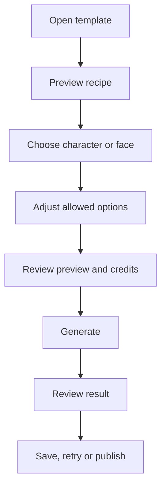

# Momelo Template Gallery — UX/UI Specification

เอกสารสำหรับ: UX Designer, UI Designer, Product Designer, Frontend Developer, Backend Developer และ QA  
สถานะ: Draft สำหรับวางโครงสร้าง MVP  
อ้างอิงภาพ: Momelo Template Gallery Mockup เวอร์ชันล่าสุด  
ภาษา UI ในตัวอย่าง: English โดยสามารถทำระบบแปลภาษาไทยภายหลังได้

---

## 1. เป้าหมายของหน้า

หน้า `Template Gallery` เป็นพื้นที่ค้นหา เลือก และเริ่มใช้งาน “สูตรภาพสำเร็จรูป” ของ Momelo โดย Template หนึ่งรายการอาจกำหนดองค์ประกอบต่อไปนี้:

- ท่าทางและทิศทางของร่างกาย
- ตำแหน่งมือ ขา ศีรษะ และสายตา
- มุมกล้อง ระยะภาพ และการจัดวางตัวแบบ
- Scene, Background และ Props
- Lighting, Mood และ Color Style
- Prompt และค่าตั้งต้นที่ระบบอนุญาตให้เผยแพร่
- ช่องที่ผู้ใช้สามารถเปลี่ยนได้ เช่น Character, Face, Outfit หรือ Product

ผู้ใช้ต้องเข้าใจภายในช่วงแรกของหน้าว่า:

> Template ไม่ใช่ภาพตัวอย่างสำหรับดูอย่างเดียว แต่เป็นรูปแบบที่เลือกแล้วเปลี่ยนตัวละครหรือใบหน้าเพื่อสร้างภาพของตัวเองได้

### เป้าหมายทางธุรกิจ

1. เพิ่มจำนวนผู้ใช้ที่เริ่มสร้างภาพจาก Template
2. ลดความยากของการเขียน Prompt และจัดองค์ประกอบเอง
3. ทำให้ Template Creator ได้รับการค้นพบ ติดตาม และมีโอกาสสร้างรายได้ในอนาคต
4. สร้างวงจร Community: สร้าง Template → มีผู้ใช้ → มีผลงานใหม่ → Template ได้รับความนิยม → Creator สร้างเพิ่ม

### Primary success metric

- `Template Start Rate` = จำนวนครั้งที่กด Use template ÷ จำนวน Template Detail Views

### Secondary metrics

- Template preview rate
- Generate completion rate
- Save/Bookmark rate
- Repeat template usage
- Creator profile follow rate
- Tutorial completion/click-through rate

---

## 2. เส้นทางเข้าหน้า

ผู้ใช้สามารถเข้าหน้านี้ได้จาก:

- Landing Page → Template Section → `View all templates`
- Landing Page → Featured Template → Template Detail
- Left Sidebar → Explore → `Templates`
- Search Result
- Creator Profile → Templates
- Shared Template URL
- Character Profile → Recommended Templates
- My Library → Saved Templates หรือ My Templates

เมื่อเข้าจาก Sidebar ให้แสดงสถานะ `Templates` เป็น Active และคงตำแหน่งเมนูไว้ตาม Navigation ของ Momelo

---

## 3. Page hierarchy

ลำดับส่วนประกอบจากบนลงล่าง:

1. Breadcrumb และ Page Hero
2. Template of the Week
3. How Templates Work — 3 Steps
4. Search, Category และ Filters
5. Trending Templates
6. Top Template Creators
7. Learn & Create Tutorials
8. Creator Economy Banner
9. Load More / Pagination

เหตุผลของลำดับนี้คือ เริ่มจากอธิบายคุณค่า → แสดงตัวอย่างจริง → สอนวิธีใช้อย่างย่อ → เปิดให้ค้นหา → สร้างความน่าเชื่อถือผ่าน Community → ช่วยเรียนรู้ → ชวนเป็น Creator

---

## 4. Global layout

### Desktop

- Breakpoint หลัก: `≥ 1280 px`
- ใช้ Left Sidebar เดิมของ Momelo
- Content container แนะนำ: `max-width 1440 px`
- ระยะห่างขอบ Content: `32–40 px`
- Main content เริ่มหลัง Sidebar โดยไม่ซ้อนกับ Collapse control
- Trending grid: 2 คอลัมน์ในช่วง `1280–1599 px` และ 3 คอลัมน์ได้เมื่อพื้นที่ `≥ 1600 px`

### Tablet

- Breakpoint: `768–1279 px`
- Sidebar เปลี่ยนเป็น Collapsed rail หรือ Drawer
- Featured Template เปลี่ยนจากสองคอลัมน์เป็นแนวตั้ง
- Template grid: 2 คอลัมน์
- Filter ขั้นสูงเปิดผ่าน Bottom sheet หรือ Side sheet

### Mobile

- Breakpoint: `< 768 px`
- ใช้ Bottom navigation หรือ Hamburger ตาม Global Navigation ของระบบ
- Template grid: 1 คอลัมน์
- Category chips เลื่อนแนวนอนได้
- Primary CTA ของ Template Detail ควร Sticky ด้านล่าง
- ไม่ใช้ Hover เป็นวิธีเดียวในการเปิดข้อมูลหรือ Action

> ภาพ Mockup 9:16 เป็นภาพนำเสนอ Page Flow ไม่ใช่ข้อกำหนด Aspect Ratio ของ Browser จริง

---

## 5. Section specification

## 5.1 Breadcrumb และ Page Hero

### หน้าที่

บอกตำแหน่งของผู้ใช้และอธิบายประโยชน์ของ Template ภายใน 3–5 วินาทีแรก

### Content

- Breadcrumb: `Explore / Templates`
- Eyebrow: `MOMELO TEMPLATE MARKET`
- Heading: `Find a look. Make it yours.`
- Supporting text: `Choose a pose and visual style, add your character or face, then generate.`
- Primary CTA: `Create from template`
- Secondary CTA: `How it works`

### Interaction

- `Create from template` เลื่อนลงไปยังส่วน Discover หรือเปิด Template onboarding เมื่อเป็นผู้ใช้ครั้งแรก
- `How it works` เลื่อนลงไปที่ 3 Steps หรือเปิดวิดีโอ Intro ความยาวไม่เกินประมาณ 60–90 วินาที
- หากผู้ใช้ยังไม่ Login สามารถ Browse ได้ แต่เมื่อเริ่มใช้ Template ให้เข้าสู่ Login/Signup flow แล้วกลับมาที่ Template เดิม

### UX rules

- Hero ต้องไม่ใช้พื้นที่เกินประมาณ 30–35% ของ viewport แรกบน Desktop
- อย่าใช้ข้อความการตลาดยาว เพราะหน้าที่หลักคือพาเข้าสู่ Template discovery
- Primary CTA ต้องเด่นกว่าปุ่มอื่นด้วยสี Accent หลักเพียงจุดเดียว

---

## 5.2 Template of the Week

### หน้าที่

แสดงตัวอย่างที่พิสูจน์แนวคิดว่า Template เดียวสามารถสร้างผลลัพธ์ด้วย Character หรือ Face ต่างกันได้

### Layout

- ฝั่งข้อมูล: Template name, description, creator, rating, uses, credits และ CTA
- ฝั่งภาพ: ผลลัพธ์ 2–3 ภาพจาก Template เดียวกัน
- Label: `Same template • Different character`
- Badge: `Template of the week`

### Required data

- Template cover และ result previews อย่างน้อย 2 ภาพ
- Template title และ short description
- Owner avatar, display name, verification state
- Rating average และ rating count
- Usage count
- Estimated generation credits
- Supported replacement types เช่น Character / Face / Product
- Published status และ moderation status

### Actions

- `Preview recipe`: เปิด Template Detail Drawer/Page โดยยังไม่ใช้เครดิต
- `Use template`: เริ่ม Use Template Flow
- Creator name/avatar: ไป Creator Profile
- Carousel controls: เปลี่ยนภาพตัวอย่างโดยไม่เปลี่ยน Template

### Selection rule

- เลือกจาก Trending score ของสัปดาห์ แต่ต้องผ่าน Quality และ Moderation
- ห้ามเลือกจาก Usage สูงสุดอย่างเดียว เพราะจะทำให้ Creator รายเดิมครองพื้นที่ตลอด
- Admin/Editorial team ต้องสามารถ Pin หรือ Exclude ได้
- เก็บ `featured_reason` เพื่อแสดงเหตุผล เช่น Weekly #1, Editor’s pick หรือ Fast rising

---

## 5.3 How Templates Work — 3 Steps

### หน้าที่

อธิบาย Mental Model โดยไม่บังคับผู้ใช้เปิด Tutorial

### Steps

1. `Choose a look` — เลือกท่า องค์ประกอบ และ Style
2. `Add character or face` — เลือก Momelo Character หรือใส่ใบหน้าของผู้ใช้
3. `Generate your version` — ตรวจราคา Preview และเริ่มสร้าง

### UI behavior

- แต่ละ Step ใช้ Icon ที่ต่างกันและข้อความไม่เกิน 2 บรรทัด
- Desktop แสดงแนวนอน; Mobile แสดงแนวตั้งหรือ Carousel
- Step สามารถกดเพื่อเปิดคำอธิบายเพิ่มเติมได้ แต่ไม่จำเป็นใน MVP

---

## 5.4 Search, Categories และ Filters

### Search

Placeholder: `Search pose, style or creator`

ค้นหาได้จาก:

- Template title
- Tags
- Pose type
- Style
- Scene
- Creator display name
- Use case เช่น Fashion, Product, Cinematic

### Search behavior

- Debounce ประมาณ `300–500 ms`
- แสดง Clear button เมื่อมีข้อความ
- Enter ต้องทำงานได้
- เก็บข้อความค้นหาและ Filters ไว้ใน URL เพื่อ Share หรือ Back ได้
- Search ไม่พบผลลัพธ์ให้เสนอการล้าง Filter และหมวดที่ใกล้เคียง

### Category chips

หมวดเริ่มต้นที่เสนอ:

- For you
- Fashion pose
- Product holding
- Lifestyle
- Cinematic
- Couple
- Studio
- Social post

`For you` ควรแสดงเมื่อมีข้อมูลพฤติกรรมเพียงพอ หากยังไม่มี Personalization ให้ใช้ `Featured` หรือ `Popular` แทนเพื่อไม่ทำให้ผู้ใช้เข้าใจผิด

### Filters

- Orientation: Portrait / Landscape / Square
- Number of subjects: 1 / 2 / Group
- Replacement: Character / Face / Outfit / Product
- Style: Photorealistic / Editorial / Lifestyle / Cinematic / Illustration
- Credits range
- Rating
- Supported output: Image / Video / Both
- License: Personal / Commercial
- Creator: Following / Verified

### Sort

- Recommended
- Trending
- Most used
- Top rated
- Newest
- Lowest credits

### Filter behavior

- แสดงจำนวน Active filters
- มี `Clear all`
- เมื่อเปลี่ยน Filter ให้แสดง Skeleton เฉพาะ Result grid ไม่ Reload ทั้งหน้า
- Desktop ใช้ Popover/Dropdown; Mobile ใช้ Bottom sheet

---

## 5.5 Trending Templates

### หน้าที่

เป็นพื้นที่หลักในการค้นหาและเลือก Template

### Time range tabs

- This week
- This month
- All time

ให้เก็บค่าใน URL เช่น `?period=week` และจำค่าล่าสุดภายใน Session ได้

### Ranking recommendation

MVP สามารถใช้ Weighted score แบบง่าย:

```text
Trending Score =
  35% Completed Uses
+ 25% Usage Growth
+ 20% Rating Confidence
+ 10% Save Rate
+ 10% Generate Completion Rate
```

กฎเพิ่มเติม:

- ใช้ Time decay เพื่อให้ผลงานใหม่มีโอกาสแข่งขัน
- กรองการใช้งานซ้ำผิดปกติจากบัญชีเดียวกัน
- Rating ต้องมีจำนวนขั้นต่ำก่อนใช้เป็นสัญญาณหลัก
- ห้ามแสดงรายได้ Creator ต่อสาธารณะ เว้นแต่ Owner เลือกเปิดเผย

---

## 5.6 Template Card

Template Card ต้องดูแตกต่างจาก Work Card หรือภาพ Gallery อย่างชัดเจน

### Visual anatomy

1. Main result preview
2. Template blueprint inset — ภาพย่อโครงท่า/องค์ประกอบ
3. Ranking badge เช่น Weekly #1, Fast rising หรือ Editor’s pick
4. Template title
5. Style/use-case tags ไม่เกิน 3 รายการ
6. Creator avatar และชื่อ
7. Rating พร้อมจำนวน Review
8. Usage count
9. Credit estimate
10. Bookmark
11. Primary CTA: `Use template`

### Card actions

- คลิกภาพหรือชื่อ → Template Detail
- คลิก Creator → Creator Profile
- Bookmark → Save to Saved Templates หรือให้เลือก Collection
- Use template → Template Setup
- Overflow menu → Share / Report / Hide creator

### Hover/Focus

- Desktop Hover: เพิ่ม Border/Shadow เล็กน้อยและเปิด Quick preview control
- Keyboard Focus: ใช้ Focus ring ที่ชัดเจน
- ไม่ซ่อน Rating, Credit หรือ CTA ไว้เฉพาะ Hover

### Credit display

- ถ้าราคาแน่นอน: `12 credits`
- ถ้าเปลี่ยนตาม Provider/Quality: `From 12 credits`
- Tooltip อธิบายว่าเป็น Estimated generation cost หรือรวมค่า Template แล้ว
- ในอนาคตหากมี Creator fee ให้แยก `Template fee` กับ `Generation cost` ใน Template Detail ไม่จำเป็นต้องยัดทั้งหมดบน Card

### Image rules

- แนะนำ Aspect ratio ของ Preview: `4:5` หรือ `3:4`
- ใช้ `object-fit: cover` ใน Card แต่ Template Detail ต้องดูภาพเต็มได้
- Lazy load ภาพนอก viewport
- มี Blur placeholder หรือ Skeleton ป้องกัน Layout shift
- กำหนด Safe area สำหรับ Badge และ CTA overlay

---

## 5.7 Top Template Creators

### หน้าที่

สร้างการค้นพบและความน่าเชื่อถือให้ Creator พร้อมปูทาง Creator Economy

### Content ต่อ Creator

- Rank
- Avatar
- Display name
- Verification/Trusted creator badge ตามสิทธิ์จริง
- Total template uses ในช่วงเวลาที่เลือก
- Average rating
- จำนวน Published templates หรือ Best-known category
- Follow/Following button

### Interaction

- Creator card → Creator Profile แท็บ Templates
- Follow ต้อง Optimistic update และ Rollback เมื่อ API ล้มเหลว
- `View all creators` → Creator ranking/listing page ในอนาคต

### Privacy rule

- ไม่แสดงรายได้ Creator ต่อผู้ชมทั่วไป
- Dashboard รายได้เป็นข้อมูลส่วนตัวของ Owner เท่านั้น

---

## 5.8 Learn & Create Tutorials

### หน้าที่

ช่วยให้ผู้ใช้เริ่มใช้งานได้ และสอน Creator สร้าง Template ที่มีคุณภาพ

### Content types

- Embedded video
- External video เช่น YouTube
- Momelo Help article
- Creator tutorial ที่ผ่านการตรวจสอบ

### Metadata

- Thumbnail
- Title
- Duration หรือ Read time
- Difficulty: Beginner / Intermediate / Advanced
- Author/Channel
- Content type
- External-link indicator

### Initial tutorials

- `How to use a template`
- `Replace the model with your character`
- `Use your own face safely`
- `Build a template people reuse`
- `Pose and composition basics`
- `Template publishing guidelines`

### Interaction

- วิดีโอภายในเปิด Modal/Player โดยไม่พาผู้ใช้ออกจากหน้า
- External link เปิด Tab ใหม่และแสดงสัญลักษณ์ให้รู้ก่อนคลิก
- เก็บ Tutorial click และ completion event เมื่อระบบ Player รองรับ

---

## 5.9 Creator Economy Banner

### หน้าที่

สื่อว่า Community มีโอกาสสร้างรายได้ แต่ไม่แย่งความสนใจจากการเลือก Template

### Content

- Heading: `Turn your visual ideas into income`
- Body: อธิบายสั้น ๆ ว่า Creator สามารถ Publish Template และรับส่วนแบ่งเมื่อ Community นำไปใช้
- Primary CTA: `Become a creator`
- Secondary CTA: `Creator guide`

### MVP handling

- หากระบบรายได้ยังไม่เปิดจริง ห้ามใช้ถ้อยคำที่รับรองว่าจะได้รับเงินแน่นอน
- เปลี่ยน CTA เป็น `Join creator waitlist` หรือ `Learn about creator program`
- แสดง Terms, Eligibility, Revenue calculation และ Payout schedule ก่อนเปิดรับเงินจริง

---

## 5.10 Load More / Pagination

### Recommendation

MVP ใช้ `Load more templates` เหมาะกว่า Infinite scroll เพราะ:

- ผู้ใช้ควบคุมการโหลดข้อมูลได้
- Footer และส่วนท้ายยังเข้าถึงได้
- กลับจาก Template Detail แล้วรักษาตำแหน่งได้ง่ายกว่า

### Behavior

- แสดงจำนวน เช่น `Showing 24 of 180 templates`
- เมื่อ Load more ให้เพิ่ม Result ต่อท้าย ไม่เลื่อนกลับด้านบน
- จำ Scroll position เมื่อผู้ใช้เปิด Detail แล้วกด Back
- หากหมดข้อมูล เปลี่ยนข้อความเป็น `You’ve reached the end`

---

## 6. Template Detail / Quick Preview ที่ Gallery ต้องเชื่อมต่อ

แม้เป็นอีกหน้าหนึ่ง แต่ UX ของ Gallery ต้องเตรียมทางเชื่อมต่อไว้

### Minimum detail

- Result gallery
- Template blueprint
- What this template controls
- What you can replace
- Character/Face/Product compatibility
- Required inputs
- Supported aspect ratios
- Supported AI Provider/Model หากจำเป็น
- Estimated credits
- Owner และ License
- Ratings/Reviews
- Community results generated from this Template
- Tutorial link
- Report action
- `Use template` CTA

### Preview before charge

ผู้ใช้ต้องเห็นอย่างน้อย:

- ภาพตัวอย่าง
- Input ที่ต้องเตรียม
- ค่าใช้จ่ายโดยประมาณ
- สิ่งที่จะถูกแทนที่
- สิทธิ์การใช้งาน

ก่อนเข้าสู่ขั้น Generate ที่ตัดเครดิต

---

## 7. Use Template flow



### Important rule

Template Owner กำหนดได้ว่า Option ใดถูกล็อกและ Option ใดให้ผู้ใช้เปลี่ยน แต่ระบบต้องแสดงสถานะนี้อย่างโปร่งใส ไม่ควรปล่อยให้ผู้ใช้เปลี่ยนจนผลลัพธ์ไม่เหลือเอกลักษณ์ของ Template แล้วกลับไปให้คะแนน Template ต่ำ

---

## 8. Page states

## 8.1 Loading

- ใช้ Skeleton ที่มีขนาดเท่ากับ Featured card และ Template cards จริง
- Header, Search และ Filters ยังใช้งานได้หากโหลด Result แยกกัน
- ไม่ใช้ Spinner เต็มหน้าหากมีโครงสร้างหน้าแสดงได้ก่อน

## 8.2 Empty — ไม่มี Template ในระบบ

- Heading: `Templates are coming soon`
- อธิบายสั้น ๆ
- CTA: Explore community works หรือ Create first template เฉพาะผู้มีสิทธิ์

## 8.3 No search results

- แสดงคำค้นหาและ Active filters
- CTA: Clear filters
- แนะนำหมวดที่ใกล้เคียง
- ไม่แสดงหน้าว่างเปล่าโดยไม่มีแนวทางต่อ

## 8.4 Error

- Error เฉพาะ Section ไม่ควรทำให้ทั้งหน้าพัง
- CTA: Retry
- เก็บ Error code ใน Logging แต่แสดงข้อความภาษาคนแก่ผู้ใช้

## 8.5 Restricted/Moderated Template

- ถ้า Template ถูกปิดหลังผู้ใช้ Save แล้ว ให้แสดง `This template is no longer available`
- ไม่แสดงภาพหรือ Prompt ที่ละเมิดหลังถูก Moderated
- Owner เห็นเหตุผลและช่องทาง Appeal ตาม Policy

## 8.6 Logged-out

- Browse, Search และเปิด Detail ได้
- Actions ที่เปลี่ยนข้อมูล เช่น Save, Follow, Use ให้ Login ก่อน
- หลัง Login ต้องกลับมายัง Template และ Action เดิม

---

## 9. Suggested data model

```ts
interface TemplateSummary {
  id: string;
  slug: string;
  title: string;
  shortDescription: string;
  coverImageUrl: string;
  blueprintImageUrl?: string;
  previewImages: Array<{
    id: string;
    imageUrl: string;
    characterId?: string;
    altText: string;
  }>;
  owner: {
    id: string;
    displayName: string;
    avatarUrl?: string;
    verified: boolean;
  };
  tags: string[];
  category: string;
  replacementTypes: Array<'character' | 'face' | 'outfit' | 'product'>;
  outputTypes: Array<'image' | 'video'>;
  aspectRatios: string[];
  ratingAverage: number | null;
  ratingCount: number;
  usageCount: number;
  saveCount?: number;
  estimatedCreditsFrom: number;
  templateFeeCredits?: number;
  commercialUseAllowed: boolean;
  badges: Array<'weekly_no_1' | 'fast_rising' | 'editors_pick'>;
  publishedAt: string;
  moderationStatus: 'approved' | 'pending' | 'restricted';
  isSaved: boolean;
}
```

### API response considerations

- ส่ง Pagination cursor หรือ page metadata
- ส่ง `available_actions` ตามสิทธิ์ผู้ใช้ แทนการให้ Frontend เดา
- Rating ที่ไม่มีข้อมูลใช้ `null` ไม่ใช้ `0.0`
- Credit ต้องส่งหน่วยและชนิดราคาอย่างชัดเจน
- Image ควรมี width, height และ alt text เพื่อป้องกัน Layout shift และรองรับ Accessibility

---

## 10. Suggested frontend components

```text
TemplateGalleryPage
├── PageBreadcrumb
├── TemplateHero
├── FeaturedTemplateCarousel
├── TemplateHowItWorks
├── TemplateDiscoveryToolbar
│   ├── TemplateSearch
│   ├── CategoryChips
│   ├── FilterButton
│   └── SortMenu
├── TrendingTemplateSection
│   ├── PeriodTabs
│   ├── TemplateGrid
│   └── TemplateCard
├── TopCreatorSection
│   └── CreatorRankCard
├── TutorialSection
│   └── TutorialCard
├── CreatorProgramBanner
└── LoadMoreControl
```

Component ที่ใช้ซ้ำควรแยกออกจาก Page แต่ไม่ควรสร้าง Generic card หนึ่งตัวที่รองรับทั้ง Work, Template, Character และ Comparison เพราะแต่ละประเภทมีข้อมูลและ Primary Action ต่างกัน

---

## 11. Analytics events

| Event | Trigger | Properties สำคัญ |
|---|---|---|
| `template_gallery_viewed` | เปิดหน้า | source, user_state |
| `template_search_submitted` | ค้นหา | query_length, result_count |
| `template_filter_changed` | เปลี่ยน Filter | filter_name, filter_value |
| `template_period_changed` | Week/Month/All time | period |
| `template_card_opened` | เปิด Detail | template_id, position, section |
| `template_preview_opened` | Preview recipe | template_id |
| `template_use_started` | กด Use template | template_id, source_section |
| `template_saved` | Bookmark | template_id, collection_id |
| `creator_followed` | Follow | creator_id, source_section |
| `tutorial_opened` | เปิด Tutorial | tutorial_id, type |
| `creator_program_clicked` | เปิด Creator program | user_state |

### Privacy

- หลีกเลี่ยงส่ง Prompt, รูปใบหน้า หรือข้อมูลระบุตัวบุคคลเข้า Analytics โดยตรง
- ใช้ Internal IDs และ Category metadata เท่าที่จำเป็น

---

## 12. Accessibility requirements

- Text contrast ทั่วไปอย่างน้อย `4.5:1`; ข้อความขนาดใหญ่ขั้นต่ำ `3:1`
- Controls และ Focus indicator ต้องมองเห็นชัดบนพื้นหลังมืด
- ทุกภาพมี Alt text ที่บอกสาระ เช่น ชนิดท่าและองค์ประกอบ ไม่เขียนเพียง `template image`
- Carousel ใช้ Keyboard ได้ มี Previous/Next label และไม่ Auto-play โดยไม่มี Pause
- Tab, Chip และ Filter ใช้ Semantic controls และบอก Selected state แก่ Screen reader
- Touch target แนะนำไม่น้อยกว่า `44 × 44 px`
- ไม่ใช้สีเพียงอย่างเดียวในการบอก Weekly #1, Error หรือ Selected state
- Animation ต้องรองรับ `prefers-reduced-motion`

---

## 13. Visual system guidance

### Color

- Background: Near-black/navy
- Surface: Dark blue-gray แยกจาก Background อย่างพอดี
- Primary accent: Cyan
- Secondary accent: Violet ใช้เฉพาะ Gradient หรือสถานะรอง
- Success: Green
- Warning/ranking: Warm amber
- Error: Red ที่มี Contrast ผ่านเกณฑ์

### Typography

- Page title: 36–48 px Desktop, 28–32 px Mobile
- Section title: 24–30 px Desktop, 20–24 px Mobile
- Card title: 16–18 px
- Body: 14–16 px
- Metadata ห้ามต่ำกว่า 12 px และต้องอ่านได้บนพื้นหลังเข้ม

### Spacing

- ใช้ระบบ 4/8 px
- Section gap: 48–72 px Desktop, 32–48 px Mobile
- Card padding: 16–24 px
- ระหว่าง Label กับ Value: 4–8 px

### Effects

- Neon glow ใช้เฉพาะ Primary CTA, Selected state และ Featured edge
- หลีกเลี่ยง Glow รอบ Card ทุกใบ
- Border 1 px ช่วยแบ่ง Surface บน Dark theme
- Motion duration ประมาณ 150–250 ms สำหรับ Hover/Popover และต้องไม่รบกวนการใช้งาน

---

## 14. MVP scope

### ทำใน MVP

- Browse/Search/Filter/Sort Template
- Featured weekly template แบบ Admin-curated หรือใช้กฎง่าย
- Template Card และ Template Detail
- Use Template ด้วย Character หรือ Face ตามความสามารถจริงของระบบ
- Rating summary หากระบบมี Review จริง
- Usage count
- Save Template
- Creator attribution
- Tutorial link แบบ External หรือ Help article
- Basic moderation/reporting
- Credit estimate ก่อน Generate

### ทำภายหลัง

- Automated creator payout
- Revenue sharing dashboard
- Advanced creator leaderboard
- Personalized `For you`
- Template A/B performance analytics
- Creator tutorial publishing
- Video Template marketplace
- Affiliate/referral program
- Revenue badge หรือ earning milestone
- Automated trending fraud detection ขั้นสูง

---

## 15. Acceptance criteria สำหรับ UX/UI handoff

1. ผู้ทดสอบใหม่อธิบายได้ว่า Template ใช้ทำอะไรหลังเห็นช่วงบนของหน้า
2. แยก Template Card ออกจาก Work Card ได้โดยไม่ต้องอ่านชื่อ Section
3. ผู้ใช้เห็นค่าใช้จ่ายโดยประมาณก่อนเริ่ม Generate
4. ผู้ใช้รู้ว่าใครเป็นเจ้าของ Template
5. ผู้ใช้ทราบว่าอะไรถูกล็อกและอะไรเปลี่ยนได้ก่อนใช้ Template
6. Search, Category, Filter และ Sort ทำงานร่วมกันโดยไม่ทำให้ค่าหาย
7. Back จาก Detail แล้วกลับตำแหน่งและ Filter เดิม
8. Keyboard สามารถเข้าถึง Search, Tabs, Cards, Bookmark และ CTA ได้
9. Mobile ไม่มีข้อมูลสำคัญที่เปิดได้ด้วย Hover อย่างเดียว
10. Loading, Empty, No result, Error และ Logged-out state มี Design ครบ
11. Component และ Token อยู่ใน Design System พร้อมชื่อเดียวกับ Frontend
12. CTA `Use template` มี Visual priority สูงที่สุดในพื้นที่ Template

---

## 16. สิ่งที่ UX/UI Designer ควรส่งมอบต่อ

- Desktop frame: 1440 px และ Wide desktop หากระบบรองรับ
- Tablet frame: 1024 หรือ 768 px
- Mobile frame: 390 px
- Component variants: Default, Hover, Focus, Selected, Loading, Disabled, Error
- Template Card ทุก Variant และ Responsive behavior
- Filter open/closed state
- Featured carousel state
- Empty/No result/Error screens
- Quick Preview หรือ Template Detail ที่เชื่อมจาก Card
- Use Template entry state
- Prototype เส้นทาง Browse → Preview → Use → Review credits
- Design tokens หรือ mapping เข้ากับ Momelo Theme เดิม
- Handoff annotations สำหรับ spacing, truncation, image ratio และ interaction

---

## 17. References

- W3C, WCAG 2.2 — Contrast Minimum: https://www.w3.org/WAI/WCAG22/Understanding/contrast-minimum.html
- W3C, WCAG 2.2 — Target Size Minimum: https://www.w3.org/WAI/WCAG22/Understanding/target-size-minimum.html
- WAI-ARIA Authoring Practices — Carousel Pattern: https://www.w3.org/WAI/ARIA/apg/patterns/carousel/
- WAI-ARIA Authoring Practices — Tabs Pattern: https://www.w3.org/WAI/ARIA/apg/patterns/tabs/
- Nielsen Norman Group — Progressive Disclosure: https://www.nngroup.com/articles/progressive-disclosure/
- Nielsen Norman Group — Recognition Rather Than Recall: https://www.nngroup.com/articles/recognition-and-recall/
- Carbon Design System — Search: https://carbondesignsystem.com/components/search/usage/
- Carbon Design System — Loading: https://carbondesignsystem.com/patterns/loading-pattern/

