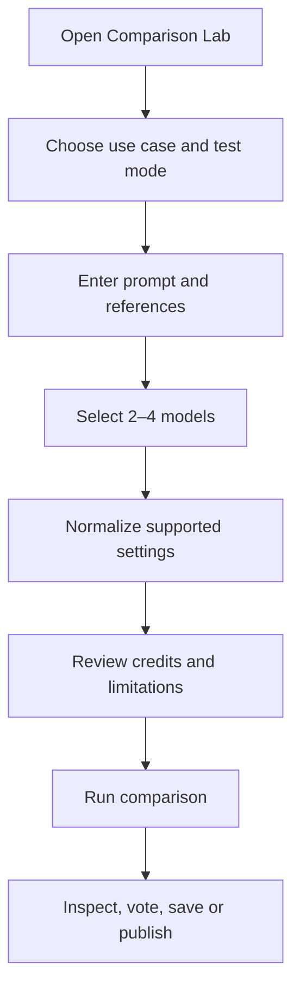

# Momelo Comparison Gallery & Model Lab — UX/UI Specification

เอกสารสำหรับ: Product Owner, UX/UI Designer, Frontend Developer, Backend Developer, Data/Analytics และ QA  
สถานะ: Draft สำหรับวางโครงสร้าง MVP  
อ้างอิงภาพ: Momelo Comparison Discovery Mockup เวอร์ชันล่าสุด  
ขอบเขต: หน้า `Explore > Comparisons`, Comparison Detail, Ranking, Model Review และการเชื่อมต่อ Playground

---

## 1. คำจำกัดความของหน้า

ชื่อที่ผู้ใช้เห็น: `Comparisons`  
ชื่อเชิงผลิตภัณฑ์: `Momelo Model Lab`  
Route ที่เสนอ: `/comparisons`

หน้า Comparison ใช้สำหรับเปรียบเทียบผลลัพธ์จาก AI Image Model หลายตัว โดยใช้ Prompt และเงื่อนไขที่กำหนดอย่างโปร่งใส เพื่อช่วยตอบคำถามว่า:

- แต่ละ Model สร้างผลลัพธ์ต่างกันอย่างไร
- Model ใดเหมาะกับงานประเภทใด
- Model ใดให้คุณภาพ ความเร็ว และความคุ้มค่าตรงกับความต้องการ
- ผลจาก Community, Editorial review และข้อมูลที่ระบบวัดจริงเป็นอย่างไร
- Model หรือ Model version ใดเพิ่งถูกเพิ่มเข้ามาใน Momelo
- จะนำ Model และ Setting ที่เลือกไปทดลองต่อใน Playground ได้อย่างไร

หน้านี้ไม่ควรเป็นเพียง Image Gallery ที่มีชื่อ Provider ใต้ภาพ เพราะผู้ใช้ต้องสามารถเข้าใจเงื่อนไขการทดสอบ ตรวจรายละเอียด และนำผลไปใช้ตัดสินใจได้

---

## 2. Terminology ที่ต้องใช้ให้สม่ำเสมอ

| คำ | ความหมาย |
|---|---|
| Provider | ผู้ให้บริการ API หรือระบบที่ Momelo เชื่อมต่อ |
| Model | ชื่อโมเดลที่ใช้สร้างหรือแก้ไขภาพ |
| Model version | Version หรือ Snapshot ที่สร้างผลลัพธ์จริง |
| Comparison | ชุดการเปรียบเทียบหนึ่งหัวข้อ |
| Comparison run | การ Execute หนึ่งครั้งภายใต้เงื่อนไขที่บันทึกไว้ |
| Result | ภาพและ Metadata ของ Model หนึ่งตัวภายใน Run |
| Test mode | วิธีควบคุม Prompt และ Setting เช่น Strict หรือ Optimized |
| Community rating | คะแนนหรือ Vote จากผู้ใช้ Momelo |
| Editorial review | ความเห็นจากทีมงานหรือ Reviewer ที่เปิดเผยชื่อ |
| Measured metric | ค่าที่ระบบบันทึกจาก Job เช่นเวลาและเครดิต |

### Naming rule

แสดง `Provider / Model / Version` เป็นคนละ Field เสมอ ตัวอย่าง:

```text
Provider: Example Provider
Model: Example Image Model
Version: 2026-08-15
```

ห้ามใช้ Provider name แทน Model name หรือรวม Version ที่ต่างกันเป็นคะแนนเดียวโดยไม่บอกผู้ใช้

---

## 3. Product goals

### User goals

- เห็นความแตกต่างของภาพได้จริง ไม่ต้องสลับหลายหน้า
- เลือก Model ที่เหมาะกับงานและงบประมาณ
- เข้าใจว่าการเปรียบเทียบยุติธรรมเพียงใด
- ดู Prompt, Input และ Setting ที่ได้รับอนุญาตให้เปิดเผย
- ทดลองซ้ำหรือส่ง Model ไป Playground ได้ง่าย
- อ่าน Review ที่สรุปเป็นภาษาคน ไม่ต้องรู้ศัพท์ AI มาก

### Business goals

- เพิ่มการทดลอง Provider/Model หลายตัวอย่างมีเหตุผล
- ลดการ Generate แบบลองผิดลองถูกที่สิ้นเปลืองเครดิต
- เพิ่ม Playground starts จาก Comparison
- สร้างฐานข้อมูลความเหมาะสมของ Model ตาม Use case
- สร้าง Community content ที่มีคุณค่ากว่าภาพเดี่ยว

### Primary metrics

- `Comparison Detail CTR` = Comparison opens ÷ Comparison card impressions
- `Comparison-to-Playground Rate` = Playground starts ÷ Comparison detail views

### Secondary metrics

- Comparison completion rate
- Blind vote participation
- Sync zoom usage
- Model review open rate
- Model release trial rate
- Repeat comparison creation
- Search success rate

---

## 4. Entry points และ routes

### Entry points

- Landing Page → Featured Comparison
- Landing Page → Compare Models CTA
- Left Sidebar → Explore → Comparisons
- Playground result → Compare with another model
- Work detail → Compare this prompt
- Shared Comparison URL
- Creator Profile → Comparisons tab
- Search results

### Suggested routes

| Purpose | Route ตัวอย่าง |
|---|---|
| Comparison discovery | `/comparisons` |
| Comparison detail | `/comparisons/:slug` |
| New comparison | `/comparisons/new` |
| Comparison run | `/comparisons/:id/runs/:runId` |
| Playground handoff | `/playground?setup=:setupId` |
| Model review | `/models/:provider/:model/reviews/:slug` |
| Model directory | `/models` |

หาก Prompt หรือ Reference มีข้อมูลส่วนตัว ไม่ควรส่งข้อความหรือ URL รูปลง Query string ให้ใช้ `setupId` หรือ Session state ที่มีสิทธิ์เข้าถึงแทน

---

## 5. Page hierarchy

1. Breadcrumb และ Model Lab Hero
2. Featured Comparison
3. Comparison inspection controls
4. Search, Category, Filter และ Test mode
5. Trending Comparisons
6. Model Leaderboard
7. Latest Model Releases
8. Choose by Use Case
9. Model Reviews
10. Fair Comparison Tutorials
11. Open Comparison Lab CTA
12. Load More

ลำดับนี้เริ่มจากการสาธิตสิ่งที่หน้า Comparison ทำได้จริง ก่อนพาผู้ใช้ไปสำรวจอันดับ ข่าว Model ใหม่ และคำแนะนำตามประเภทงาน

---

## 6. Global layout

### Desktop

- Breakpoint หลัก: `≥ 1280 px`
- ใช้ Left Sidebar เดิมและแสดง Comparisons เป็น Active
- Content container แนะนำ `max-width: 1440 px`
- Horizontal padding `32–40 px`
- Featured comparison รองรับภาพ 2–4 Models โดย Default 3
- Trending grid 2 คอลัมน์ในจอทั่วไป

### Tablet

- Breakpoint `768–1279 px`
- Sidebar เป็น Rail/Drawer
- Featured outputs ใช้ Horizontal scroll หรือ 2-column wrap
- Metric summary อยู่ใต้ภาพ
- Filters เปิด Side sheet/Bottom sheet

### Mobile

- Breakpoint `< 768 px`
- แสดงภาพเปรียบเทียบทีละ 1–2 ภาพด้วย Swipe และตัวเลือก Model ที่ชัดเจน
- มี `A/B` mode และ Before/After slider สำหรับสอง Model
- Category chips เลื่อนแนวนอนได้
- Leaderboard เปลี่ยนเป็น Card list
- CTA สำคัญต้องไม่พึ่ง Hover

> Mockup 9:16 เป็นภาพนำเสนอ Page Flow ไม่ใช่ข้อกำหนดสัดส่วน Browser จริง

---

## 7. Section specifications

## 7.1 Breadcrumb และ Model Lab Hero

### Content

- Breadcrumb: `Explore / Comparisons`
- Eyebrow: `MOMELO MODEL LAB`
- Heading: `Compare before you create.`
- Supporting text: `One prompt. Multiple models. See the difference in quality, speed and cost.`
- Primary CTA: `Start a comparison`
- Secondary CTA: `How scoring works`

### Actions

- `Start a comparison` → New Comparison flow
- `How scoring works` → Methodology Drawer/Page

### UX rules

- Hero ต้องอธิบายความต่างจาก Gallery ภายในช่วงแรก
- ถ้าแสดงภาพโมเดลหลายใบ ต้องใช้ Subject/Prompt เดียวกัน
- ข้อมูลใน Design mockup ต้องติดป้าย Sample ไม่ทำให้เข้าใจว่าเป็นผลจัดอันดับจริง

---

## 7.2 Featured Comparison

### หน้าที่

สาธิตวิธีเปรียบเทียบที่ครบทั้งภาพ เงื่อนไข ผลโหวต และข้อมูล Job

### Required content

- Comparison title
- Prompt excerpt
- Prompt visibility state: Public / Partial / Private
- Test mode
- Reference/input disclosure
- Aspect ratio และ Output size
- Capture date/time
- Model results 2–4 รายการ
- Creator/Reviewer attribution
- Community voting status
- Scoring source และ Sample size

### Result panel ต่อ Model

- Provider
- Model
- Version/snapshot
- Output image
- Community preference
- Captured generation time
- Estimated/actual credits
- Result badges เช่น Best detail, Fastest หรือ Best value
- Failure/retry indicator หากมี

### Actions

- Sync zoom
- Blind mode
- View settings
- Open full comparison
- Remix comparison
- Vote เมื่อผู้ใช้มีสิทธิ์
- Open result full-screen

### Image layout

- 2 Models: Split view หรือ Slider
- 3 Models: 3-column บน Desktop
- 4 Models: 4-column เมื่อกว้างพอ มิฉะนั้น 2 × 2
- ทุกภาพใช้ Viewport และ Crop เริ่มต้นเดียวกัน
- รองรับ Fit/Actual size โดยไม่บิดสัดส่วน

---

## 7.3 Fairness strip

### Fields

- Same prompt
- Same reference input
- Same aspect ratio/output target
- Same test mode
- Number of samples per model
- Captured date

### Important limitation

`Same seed` ไม่ควรเป็นเงื่อนไขบังคับระหว่าง Provider เพราะ Seed space และ Sampling implementation อาจไม่เทียบเท่ากัน ให้แสดง Seed เฉพาะเมื่อ Model รองรับ และห้ามใช้เพื่ออ้างว่าการทดสอบข้าม Provider ยุติธรรมสมบูรณ์

หาก Setting ใดไม่มี Equivalent ในอีก Model ให้แสดง `Not equivalent` หรือ `Provider default` แทนการซ่อน

---

## 7.4 Test modes

### Strict same prompt

ใช้เมื่อผู้ใช้ต้องการดูพฤติกรรมของ Model ต่อ Input เดียวกัน:

- Prompt text เหมือนกันทุกอักขระ
- Negative prompt เหมือนกันเมื่อทุก Model รองรับ
- Reference inputs ชุดเดียวกัน
- Aspect ratio/output target เดียวกันเท่าที่ API รองรับ
- ไม่แอบ Rewrite Prompt ต่อ Model
- บันทึก Provider defaults ที่แตกต่าง

### Optimized per model

ใช้เมื่อผู้ใช้ต้องการดู Output ที่ดีที่สุดที่ทำได้จากแต่ละ Model:

- อนุญาต Prompt adaptation
- อนุญาต Model-specific parameters
- ต้องแสดง Prompt/Settings แยกต่อ Result
- ห้ามใช้คะแนนรวมกับ Strict mode โดยไม่มี Filter/Label

### UI rules

- Test mode ต้องเห็นใน Listing card และ Detail
- เปลี่ยน Test mode ไม่ควรแก้ Comparison เดิม ให้สร้าง Run ใหม่
- Leaderboard ต้อง Filter หรือแยกคะแนนตาม Test mode

---

## 7.5 Inspection tools

### Sync zoom

- ซูมและ Pan ทุก Result ไปยังตำแหน่งเดียวกัน
- แสดงสถานะ On/Off
- หาก Dimension ต่างกันให้ Normalize ตามสัดส่วน ไม่ใช้ Pixel coordinate ตรง ๆ

### Blind mode

- ซ่อน Provider, Model, Badge และคะแนนก่อน Vote
- Randomize ตำแหน่ง Result ต่อ Session
- เปิดเผยชื่อหลัง Submit Vote หรือเมื่อผู้ใช้กด Reveal
- ป้องกัน Vote ซ้ำตามกติกาบัญชี/Session

### Focus regions

Future feature สำหรับเลือกบริเวณตรวจ:

- Face/skin
- Hands
- Text
- Product edge
- Fabric/detail
- Background consistency

### View settings

เปิด Drawer ที่แสดง:

- Full prompt ตามสิทธิ์
- Negative prompt
- Reference inputs
- Provider/Model/version
- Output dimensions
- Quality/steps/guidance หากรองรับ
- Safety/rewrite flags ที่เปิดเผยได้
- Retry count
- Timing และ Credit source

---

## 7.6 Discovery toolbar

### Search

Placeholder: `Search prompt, model or use case`

ค้นหาได้จาก:

- Comparison title
- Prompt tags/summary
- Provider
- Model/version
- Use case
- Creator/reviewer

### Search behavior

- Debounce `300–500 ms`
- Enter และ Clear ทำงานได้
- เก็บ Query และ Filters ใน URL
- Back/Forward ไม่ทำให้สถานะหาย

### Category chips

- For you หรือ Featured
- Portrait
- Fashion
- Product
- Text in image
- Editing
- Character consistency
- Cinematic

### Filters

- Providers
- Models/versions
- Test mode
- Use case
- Number of models
- Reference image used/not used
- Image generation/editing
- Aspect ratio
- Community/Editorial/Momelo test source
- Date range
- Minimum votes/sample size

### Sort

- Recommended
- Trending
- Most voted
- Most viewed
- Newest
- Closest result
- Most debated

### Behavior

- แสดง Active filter count และ Clear all
- Desktop ใช้ Popover; Mobile ใช้ Bottom sheet
- Loading เฉพาะ Results ไม่ Reload Page shell

---

## 7.7 Trending Comparisons

### Period tabs

- This week
- This month
- All time

### Trending score ตัวอย่างสำหรับ MVP

```text
Trending Score =
  30% Unique detail views
+ 25% Valid votes
+ 20% Save/share rate
+ 15% Discussion or review engagement
+ 10% Recent growth
```

### Rules

- ใช้ Time decay
- กรอง Bot และ Duplicate vote
- ไม่ใช้ Controversy อย่างเดียวเพื่อดันอันดับ
- Public listing ต้องผ่าน Moderation และมี Rights ของ Input/Output
- ระบุ Test mode และ Models compared บน Card

---

## 7.8 Comparison Card

### Visual anatomy

1. Split/3-way result preview
2. Comparison badge เช่น Most debated, Clear winner, New models, Editor’s test
3. Title
4. Prompt summary
5. Provider/Model list
6. Test mode
7. Creator/reviewer attribution
8. Votes
9. Views
10. Save
11. CTA: `Compare details`

### Distinction from other cards

- ไม่มี Pose blueprint แบบ Template
- ไม่มี Character identity/follower growth
- ใช้ Split panel, Model labels และ Score delta เป็นภาษาภาพหลัก
- Primary action คือ Inspect/Compare ไม่ใช่ Generate ทันที

### Card interaction

- Card/image/title → Comparison Detail
- Model label → Model detail/review
- Creator → Profile
- Save → Saved Comparisons/Collection
- Overflow → Share / Report

---

## 7.9 Model Leaderboard

### หน้าที่

สรุปแนวโน้มจาก Comparisons จำนวนมาก แต่ต้องรักษาบริบท ไม่ประกาศ Winner เดียวสำหรับทุกงาน

### Required controls

- Period: Week / Month / All time
- Use case
- Test mode
- Rating source
- Model/Provider view

### Columns/metrics

- Rank
- Provider / Model / Version
- Best for
- Community score
- Quality
- Speed
- Value
- Number of comparisons
- Confidence/sample sufficiency

### Provider rating vs Model rating

- Model leaderboard ผูกกับ Model version
- Provider leaderboard เป็น Aggregate แยกต่างหาก เช่น Reliability, API success rate, Support coverage หรือ Value
- ห้ามนำคะแนน Provider ไปแสดงเป็นคุณภาพภาพของทุก Model ใน Provider นั้น

### Versioning rules

- Model version ใหม่เริ่มคะแนนใหม่หรือแสดง Combined score พร้อม Breakdown
- Version ที่ไม่มี Identifier ใช้ `Captured date` และ Provider-reported alias
- เก็บ Historical leaderboard เพื่อให้ผู้ใช้ย้อนดูได้

### Methodology link

`See ranking methodology` ต้องเปิดคำอธิบาย:

- Data window
- Sample size
- Rating sources
- Weighting
- Inclusion/exclusion rules
- Fraud filtering
- Model version handling

---

## 7.10 Scoring dimensions

| Dimension | ความหมาย | แหล่งข้อมูลที่เป็นไปได้ |
|---|---|---|
| Prompt adherence | ทำตาม Subject, Action, Composition และ Constraint | Community rubric / Editorial / Evaluator |
| Visual quality | Detail, artifacts, composition, coherence | Community / Editorial |
| Realism | ความเป็นธรรมชาติเมื่อโจทย์ต้องการภาพจริง | Community / Editorial |
| Identity consistency | รักษา Character/Reference identity | Controlled test / Community |
| Text fidelity | ความถูกต้องของข้อความในภาพ | OCR + Human review |
| Editing fidelity | แก้เฉพาะส่วนและรักษาส่วนเดิม | Image difference + Human review |
| Speed | Generation duration ที่นิยามชัด | Measured job timing |
| Value | คุณภาพเทียบ Credit/Cost | Calculated |
| Reliability | Success/error/retry rate | Measured system data |

### Score presentation

- ใช้ Scale เดียว เช่น 0–10
- แสดง Source: Community / Editorial / Measured
- แสดง Sample size
- หาก Sample ไม่พอใช้ `Not enough data`
- ไม่เติม 0 แทน Missing data
- แยก Overall score ตาม Use case

---

## 7.11 Latest Model Releases

### หน้าที่

แสดง Model หรือ Version ใหม่ที่ Momelo รองรับ และพาไปทดลองจริง

### Card content

- Provider
- Model
- Version
- Status: New / Updated / Beta
- วันที่ `Added to Momelo`
- Provider release date เฉพาะเมื่อยืนยันได้
- Strength summary
- Supported features
- Availability/region/account requirement
- Credit estimate range
- CTA: `Try in Playground`
- Secondary CTA: `Compare`

### Date rule

หากไม่ยืนยันวันที่เปิดตัวจาก Provider ได้ ให้ใช้ข้อความ `Added to Momelo` แทน `Released` เพื่อไม่สร้างข้อมูลผิด

### Dynamic configuration

รายชื่อ Model และข้อความ Strength ต้องมาจาก Model registry/CMS ไม่ Hard-code ใน Frontend

### Availability states

- Available
- Limited access
- Beta
- Temporarily unavailable
- Deprecated

CTA ต้อง Disabled พร้อมเหตุผลเมื่อผู้ใช้ยังไม่มีสิทธิ์หรือ Model ปิดให้บริการ

---

## 7.12 Choose by Use Case

### หน้าที่

แปลข้อมูล Model ให้เป็นคำแนะนำเชิงงานสำหรับผู้ใช้ที่ไม่ต้องการอ่านคะแนนละเอียด

### Initial use cases

- Fashion & portrait
- E-commerce product
- Text & poster
- Character consistency
- Image editing/inpainting
- Fast social drafts
- Cinematic storyboard

### Recommendation card

- Use case
- Recommended Model/version
- Why it fits
- Quality/Speed/Cost emphasis
- Known limitation
- Evidence window/sample size
- CTA: `View review`
- CTA: `Try in Playground`

### Rules

- คำแนะนำต้องมี Last updated
- ใช้ข้อมูลจาก Test mode ที่เหมาะสมกับ Use case
- ห้ามใช้คำว่า Best โดยไม่ระบุขอบเขตและช่วงเวลา
- หากเป็น Editorial recommendation ต้องระบุผู้เขียน/ทีม

---

## 7.13 Model Reviews

### Content types

- Editorial review
- Community guide
- Controlled benchmark report
- Provider release analysis

### Review card content

- Title
- Summary
- Author/reviewer
- Review type
- Models/versions covered
- Use case
- Published/updated date
- Read time
- Disclosure/conflict note เมื่อเกี่ยวข้อง

### Suggested review structure

1. เหมาะกับใคร
2. จุดเด่น
3. ข้อจำกัด
4. Quality vs Speed vs Cost
5. ตัวอย่าง Comparison
6. Recommended settings
7. Version/date tested
8. Final recommendation ตาม Use case

---

## 7.14 Learn Fair Comparisons

### Initial tutorials

- How to compare AI models fairly
- Strict prompt vs optimized prompt
- How to inspect face, hands and text
- Why the same seed is not always comparable
- Understanding cost and generation time
- How to run a blind community vote

### Content metadata

- Video/article type
- Thumbnail
- Duration/read time
- Difficulty
- Author
- Last updated
- External-link indicator

Internal video เปิด Modal; External link เปิด Tab ใหม่และแจ้งให้ผู้ใช้ทราบก่อน

---

## 7.15 Comparison Lab CTA

### Content

- Heading: `Run your own model test`
- Supporting text: `Choose up to four models, lock the conditions and compare the outputs.`
- Primary: `Open Comparison Lab`
- Secondary: `Go to Playground`

### New comparison flow



---

## 8. Comparison Detail

Route: `/comparisons/:slug`

### Required sections

- Title, creator และ visibility
- Prompt/Input disclosure
- Test mode and fairness summary
- Result viewer 2–4 Models
- Sync zoom/Blind mode/Full-screen
- Model/version settings
- Category scores
- Community vote
- Measured time/credits/reliability
- Reviewer notes
- Remix/Open in Playground
- Related comparisons
- Report action

### Visibility

- Public: ทุกคนเปิดได้
- Unlisted: เปิดผ่าน Link
- Private: Owner/authorized users เท่านั้น
- Partial prompt: เปิดเฉพาะ Summary/Tags

Reference image ต้องตรวจสิทธิ์ก่อน Publish และไม่ควรถูกเปิดเผยเพียงเพราะ Comparison เปิดเป็น Public

---

## 9. Playground handoff

### Try in Playground

เมื่อกดจาก Model release, Use-case card หรือ Result ให้ส่ง:

- Provider ID
- Model ID/version
- Task type
- Prompt ตามสิทธิ์
- Negative prompt ตามสิทธิ์
- Reference asset IDs ที่ผู้ใช้เข้าถึงได้
- Aspect ratio/output target
- Model-specific settings
- Source comparison/run ID

### UX behavior

- เปิด Playground พร้อม Model ถูกเลือก
- แสดง Banner `Loaded from comparison`
- หาก Model unavailable ให้เสนอ Compatible alternatives
- แสดง Estimated credits ก่อน Generate
- การแก้ Prompt ใน Playground ไม่เปลี่ยน Comparison ต้นฉบับ
- หากต้องการบันทึกกลับ ให้ใช้ `Create new comparison from this run`

---

## 10. Fair comparison methodology

### Minimum reproducibility fields

- Prompt hash และ Prompt visibility
- Input asset IDs/hash ตาม Policy
- Provider/Model/version
- Test mode
- Output size/aspect ratio
- Settings ที่ส่งจริง
- Provider defaults ที่ทราบ
- Request timestamp
- Duration definition
- Credit/cost source
- Retry/failure count
- Safety/rewrite status ที่เปิดเผยได้

### Sampling

- เปรียบเทียบอย่างน้อยจำนวน Sample เท่ากันต่อ Model
- หากคัด Best-of-N ต้องใช้ N เท่ากันและเปิดเผยวิธีคัด
- ห้ามซ่อน Failed samples เพื่อให้ Model หนึ่งดูดีกว่า
- Single run ต้องติดป้ายว่าเป็นตัวอย่าง ไม่ใช่ผลสรุปทั่วไป

### Timing

แยกคำให้ชัด:

- `Captured job time` — เวลาของ Job ที่เห็น
- `Median observed time` — ค่ากลางจากหลาย Job
- `Queue time` — เวลารอระบบ
- `Generation time` — เวลาที่ Provider ประมวลผล
- `Total user wait` — เวลาที่ผู้ใช้รอทั้งหมด

### Cost/Credits

- ระบุ Actual หรือ Estimated
- ระบุ Quality/Resolution ที่ใช้
- Version ค่า Credit ตามช่วงเวลา
- หาก Provider billing ยังไม่ Final ให้แสดง Pending/Estimated
- Value score ต้องใช้สูตรและช่วงเวลาที่เปิดเผย

---

## 11. Rating and voting

### Rating sources

- `Community preference`
- `Community rubric score`
- `Editorial score`
- `Measured metric`
- `Automated evaluator` หากมี ต้องติดป้ายและอธิบายข้อจำกัด

### Blind preference vote

- ซ่อน Model/provider ก่อน Vote
- Randomize output order
- หนึ่งบัญชีหนึ่ง Vote ต่อ Run ตาม Policy
- เปิดเผยชื่อหลัง Vote
- ให้ Report artifact/invalid comparison ได้

### Vote prompts

หลีกเลี่ยงคำถามกว้างว่า “ภาพไหนดีที่สุด” เพียงอย่างเดียว ให้เลือก Rubric:

- Which follows the prompt best?
- Which looks most natural?
- Which preserves the reference identity best?
- Which renders text most accurately?
- Which would you use for this task?

### Confidence

- แสดงจำนวน Votes/Comparisons
- คะแนนน้อยกว่า Threshold ใช้ `Early result`
- ไม่จัด Rank ด้วยคะแนน 100% จาก Vote 1–2 คน

---

## 12. Page states

### Loading

- Skeleton ตาม Featured panel, Cards และ Leaderboard rows
- Toolbar ใช้งานได้หาก Results โหลดแยก
- Sync zoom แสดง Disabled จน Images พร้อม

### No comparisons

- Heading: `No comparisons yet`
- CTA: `Run the first comparison`
- อธิบายประโยชน์และ Credit ก่อนเริ่ม

### No search results

- แสดง Query/Active filters
- Clear filters
- แนะนำ Use case ใกล้เคียง

### Partial failure

- Result ที่สำเร็จยังแสดงได้
- Failed Model panel แสดง Error category และ Retry
- การ Retry ต้องบันทึกว่าเป็น Run ใหม่หรือ Replacement ตาม Methodology

### Model unavailable

- ห้ามลบ Historical result
- ติดป้าย Deprecated/Unavailable
- Disable Try in Playground
- เสนอ Version ใหม่หรือ Compatible model

### Logged-out

- Browse, inspect และอ่าน Review ได้
- Vote, Save, Run และ Playground generation ต้อง Login
- หลัง Login กลับ Action เดิม

### Moderated/private input

- ซ่อน Input/Output ตามสิทธิ์
- ไม่ให้ Remix เมื่อไม่มีสิทธิ์
- แสดงข้อความทั่วไป ไม่เปิดเผยเหตุผลส่วนตัวของ Owner

---

## 13. Suggested data model

```ts
type RatingSource =
  | 'community_preference'
  | 'community_rubric'
  | 'editorial'
  | 'measured'
  | 'automated_evaluator';

interface ModelRef {
  providerId: string;
  providerName: string;
  modelId: string;
  modelName: string;
  versionId?: string;
  versionLabel?: string;
}

interface ComparisonSummary {
  id: string;
  slug: string;
  title: string;
  promptSummary: string;
  promptVisibility: 'public' | 'partial' | 'private';
  coverResults: Array<{
    resultId: string;
    thumbnailUrl: string;
    model: ModelRef;
    altText: string;
  }>;
  testMode: 'strict_same_prompt' | 'optimized_per_model';
  useCases: string[];
  creator: {
    id: string;
    displayName: string;
    avatarUrl?: string;
  };
  stats: {
    uniqueViews: number;
    validVotes: number;
    saves: number;
  };
  badges: Array<
    'most_debated' |
    'clear_winner' |
    'new_models' |
    'editors_test'
  >;
  modelCount: number;
  capturedAt: string;
  publishedAt: string;
  isSaved: boolean;
  moderationStatus: 'approved' | 'pending' | 'restricted';
}
```

```ts
interface ComparisonRun {
  id: string;
  comparisonId: string;
  testMode: 'strict_same_prompt' | 'optimized_per_model';
  prompt: {
    text?: string;
    hash: string;
    visibility: 'public' | 'partial' | 'private';
  };
  inputAssets: Array<{
    assetId: string;
    type: 'image' | 'mask';
    visibility: 'public' | 'private';
  }>;
  outputTarget: {
    aspectRatio: string;
    width?: number;
    height?: number;
    samplesPerModel: number;
  };
  results: ComparisonResult[];
  capturedAt: string;
}

interface ComparisonResult {
  id: string;
  model: ModelRef;
  imageUrl?: string;
  status: 'queued' | 'running' | 'succeeded' | 'failed';
  settings: Record<string, string | number | boolean | null>;
  providerDefaults?: Record<string, unknown>;
  metrics: {
    queueMs?: number;
    generationMs?: number;
    totalMs?: number;
    actualCredits?: number;
    estimatedCredits?: number;
    retryCount: number;
  };
  scores: Array<{
    dimension: string;
    value: number;
    scaleMax: number;
    source: RatingSource;
    sampleSize?: number;
  }>;
  preferencePercentage?: number;
  badges: string[];
  errorCategory?: string;
}
```

### Model registry

```ts
interface ModelRegistryItem {
  model: ModelRef;
  status: 'available' | 'limited' | 'beta' | 'unavailable' | 'deprecated';
  addedToMomeloAt: string;
  providerReleasedAt?: string;
  supportedTasks: string[];
  supportedFeatures: string[];
  strengthsSummary?: string;
  limitationsSummary?: string;
  estimatedCredits?: {
    min: number;
    max?: number;
  };
  playgroundEnabled: boolean;
}
```

---

## 14. Suggested frontend components

```text
ComparisonsGalleryPage
├── PageBreadcrumb
├── ModelLabHero
├── FeaturedComparisonSection
│   ├── PromptSummaryPanel
│   ├── FairnessStrip
│   ├── ComparisonResultGrid
│   │   └── ModelResultPanel
│   ├── InspectionToolbar
│   └── ScoreSummary
├── ComparisonDiscoveryToolbar
│   ├── ComparisonSearch
│   ├── CategoryChips
│   ├── TestModeToggle
│   ├── FilterButton
│   └── SortMenu
├── TrendingComparisonsSection
│   ├── PeriodTabs
│   ├── ComparisonGrid
│   └── ComparisonCard
├── ModelLeaderboardSection
│   ├── LeaderboardFilters
│   └── ModelLeaderboardTable
├── LatestModelReleasesSection
│   └── ModelReleaseCard
├── ModelUseCaseSection
│   └── UseCaseRecommendationCard
├── ModelReviewsSection
│   └── ModelReviewCard
├── ComparisonTutorialSection
│   └── TutorialCard
├── ComparisonLabBanner
└── LoadMoreControl
```

แชร์ Primitive กับหน้าอื่นได้ เช่น Button, Badge, Avatar, Tabs, Search และ Surface แต่ `ComparisonCard` และ `ModelResultPanel` ต้องเป็น Component เฉพาะ ไม่ใช้ Generic Work/Template card

---

## 15. Analytics events

| Event | Trigger | Properties สำคัญ |
|---|---|---|
| `comparisons_gallery_viewed` | เปิดหน้า | source, auth_state |
| `comparison_search_submitted` | Search | query_length, result_count |
| `comparison_filter_changed` | Filter | name, value |
| `comparison_period_changed` | Week/Month/All | period |
| `comparison_card_impression` | Card เข้า viewport | comparison_id, position, section |
| `comparison_detail_opened` | เปิด Detail | comparison_id, source |
| `comparison_sync_zoom_toggled` | เปิด/ปิด | comparison_id, state |
| `comparison_blind_mode_toggled` | เปิด/ปิด | comparison_id, state |
| `comparison_vote_submitted` | Vote | comparison_id, run_id, rubric, result_id |
| `comparison_settings_opened` | เปิด Settings | comparison_id, result_id |
| `comparison_remix_started` | Remix | comparison_id, model_count |
| `model_playground_opened` | Try in Playground | model_id, version_id, source |
| `model_review_opened` | เปิด Review | review_id, model_id |
| `comparison_tutorial_opened` | เปิด Tutorial | tutorial_id, type |

### Privacy

- ไม่ส่ง Prompt text, Reference URL หรือภาพเข้า Analytics
- ใช้ Hash/Internal IDs
- ไม่ส่ง Private comparison metadata ไป Public analytics

---

## 16. Accessibility requirements

- Text contrast ปกติอย่างน้อย `4.5:1`; Large text `3:1`
- Focus indicator ชัดบนพื้นหลังมืด
- Touch target แนะนำไม่น้อยกว่า `44 × 44 px`
- Tabs, Toggles, Slider และ Blind mode มี Accessible name/state
- Result images มี Alt text ที่ไม่เปิดเผย Provider ใน Blind mode
- Sync zoom ใช้งานผ่าน Keyboard ได้
- Score bars มีค่าตัวเลขและ Label ไม่ใช้สีอย่างเดียว
- Comparison slider ต้องรองรับ Keyboard และ Screen reader
- Table มี Column headers และ Mobile alternative
- Animation รองรับ `prefers-reduced-motion`

---

## 17. Visual system guidance

### Character ของหน้า

หน้าต้องรู้สึกเหมือน Visual testing lab:

- Split frames และ Result panels เป็นภาษาภาพหลัก
- Model labels และ Methodology badges ชัด
- Metric bars ใช้เฉพาะข้อมูลที่ช่วยตัดสินใจ
- Prompt box เป็นข้อมูลประกอบ ไม่กินพื้นที่มากกว่าภาพ
- Cyan ใช้กับ Controls/Analysis
- Violet ใช้กับ Winner/Model accent
- Amber ใช้กับ Ranking/Featured

### Typography

- Page title: 36–48 px Desktop, 28–32 px Mobile
- Section title: 24–30 px Desktop, 20–24 px Mobile
- Comparison title: 18–24 px
- Card title: 16–18 px
- Body: 14–16 px
- Metadata ไม่ต่ำกว่า 12 px

### Spacing/effects

- ระบบ 4/8 px
- Section gap 48–72 px Desktop
- Card padding 16–24 px
- Glow เฉพาะ Active tool, Winner และ Primary CTA
- ไม่ใช้ Gradient รอบทุก Card
- Transition 150–250 ms

---

## 18. MVP scope

### ทำใน MVP

- Comparison discovery/listing
- Comparison Detail 2–3 Models
- Strict same prompt mode
- Prompt/Setting summary
- Provider/Model/version separation
- Full-screen view และ Basic zoom
- Community preference vote
- Week/Month/All-time Trending
- Model leaderboard แบบ Simple + Methodology
- Latest models จาก Model registry
- Try in Playground
- Use-case recommendation แบบ Editorial
- Model review/tutorial links
- Partial failure state
- Save/share/report

### ทำภายหลัง

- Optimized per model mode
- Sync zoom ขั้นสูงและ Focus regions
- Automated visual metrics
- Advanced confidence intervals
- Provider reliability leaderboard
- Cost normalization หลาย Currency
- Public benchmark datasets
- Team/private comparison workspace
- Scheduled recurring benchmark
- Model change alerts
- Detailed discussion/comments
- Video model comparison
- Side-by-side temporal video inspection

---

## 19. Acceptance criteria

1. ผู้ใช้ใหม่อธิบายได้ว่าหน้านี้ใช้ Prompt เดียวเปรียบเทียบหลาย Model
2. Provider, Model และ Version แสดงเป็นคนละ Field
3. ทุก Comparison แสดง Test mode
4. Strict และ Optimized ไม่ถูกรวมคะแนนโดยไม่บอกผู้ใช้
5. ผู้ใช้เห็น Prompt/Input/Aspect ratio/Sample count ตามสิทธิ์
6. Same seed ไม่ถูกใช้เป็นคำรับรองความยุติธรรมข้าม Provider
7. Result images ซูมและดูเต็มได้
8. Blind vote ซ่อน Model และสุ่มลำดับก่อน Vote
9. Rating แสดง Source และ Sample size
10. Missing data แสดง N/A/Not enough data ไม่ใช้ 0
11. Leaderboard ผูก Model version, Use case และช่วงเวลา
12. Latest release แยก `Released` กับ `Added to Momelo`
13. Try in Playground preload Model และ Setting ที่มีสิทธิ์
14. กลับจาก Detail แล้วรักษา Search/Filter/Scroll
15. Loading, Empty, Partial failure, Unavailable และ Logged-out มี Design
16. Mobile ไม่ต้องใช้ Hover และสามารถเปรียบเทียบ A/B ได้
17. Keyboard เข้าถึง Tabs, Toggles, Zoom, Slider, Vote และ CTA
18. ตัวเลขเวลาและ Credit ระบุ Actual/Estimated/Median ตามจริง

---

## 20. UX/UI handoff deliverables

- Desktop 1440 px และ Wide desktop
- Tablet 1024/768 px
- Mobile 390 px
- Featured comparison 2/3/4 Models
- Strict/Optimized mode states
- Sync zoom/Blind mode states
- Full-screen result viewer
- Comparison card variants
- Leaderboard desktop table/mobile cards
- Model release states
- Use-case recommendation card
- Playground handoff confirmation/unavailable state
- Loading/Empty/No result/Partial failure/Private states
- Prototype: Browse → Detail → Inspect → Vote
- Prototype: Latest model → Playground
- Prototype: Start comparison → Run → Save/Publish
- Design tokens และ Handoff annotations

---

## 21. References

- W3C, WCAG 2.2 — Contrast Minimum: https://www.w3.org/WAI/WCAG22/Understanding/contrast-minimum.html
- W3C, WCAG 2.2 — Target Size Minimum: https://www.w3.org/WAI/WCAG22/Understanding/target-size-minimum.html
- WAI-ARIA Authoring Practices — Slider Pattern: https://www.w3.org/WAI/ARIA/apg/patterns/slider/
- WAI-ARIA Authoring Practices — Tabs Pattern: https://www.w3.org/WAI/ARIA/apg/patterns/tabs/
- Nielsen Norman Group — Comparison Tables for Products, Services, and Features: https://www.nngroup.com/articles/comparison-tables/
- NIST — Artificial Intelligence Risk Management Framework: https://www.nist.gov/itl/ai-risk-management-framework
- NIST — Artificial Intelligence Risk Management Framework: Generative AI Profile: https://www.nist.gov/publications/artificial-intelligence-risk-management-framework-generative-artificial-intelligence
- MLCommons — AI Safety Benchmark: https://mlcommons.org/benchmarks/ai-safety/
- Carbon Design System — Data Table Usage: https://carbondesignsystem.com/components/data-table/usage/

