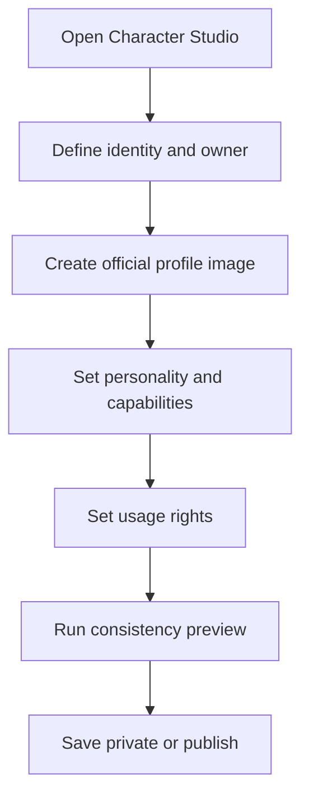
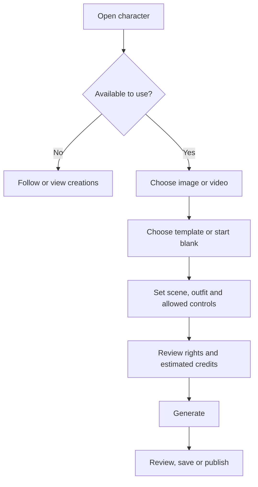

# Momelo Characters Gallery & AI Influencer Discovery — UX/UI Specification

เอกสารสำหรับ: Product Designer, UX/UI Designer, Frontend Developer, Backend Developer, Data/Analytics และ QA  
สถานะ: Draft สำหรับวางโครงสร้าง MVP  
อ้างอิงภาพ: Momelo Characters Discovery Mockup และ Character Profile Mockup เวอร์ชันล่าสุด  
ขอบเขตหลัก: หน้าเมนู `Explore > Characters` และจุดเชื่อมต่อไปยัง Character Profile กับ Character Studio

---

## 1. คำจำกัดความของหน้า

ชื่อที่ผู้ใช้เห็นในเมนู: `Characters`  
ชื่อเชิงผลิตภัณฑ์: `Character Gallery` หรือ `AI Character Universe`  
Route ที่เสนอ: `/characters`

หน้าจอนี้เป็นพื้นที่ค้นพบ AI Character, AI Model, AI Actor และ Virtual Influencer ที่สร้างขึ้นใน Momelo หรือถูกเผยแพร่ให้ใช้งานใน Momelo โดยตัวละครแต่ละคนต้องมี:

- Identity ที่แยกจากผู้ใช้และ Owner ชัดเจน
- Official profile image หนึ่งภาพสำหรับใช้เป็นภาพประจำตัวใน MVP
- ชื่อ Handle Bio และบุคลิก
- Owner หรือ Studio ผู้สร้าง
- สิทธิ์และสถานะการนำไปใช้งาน
- ความสามารถ Image/Video ตามที่ระบบรองรับจริง
- Community creations ที่แสดงการเติบโตของตัวละคร
- Followers, Usage และ Engagement ภายใน Momelo

หน้าจอนี้ไม่ใช่:

- แค็ตตาล็อก Stock photo
- หน้าค้นหาบุคคลจริง
- ระบบ Dating
- หน้ารวม Template
- Character Profile ของตัวละครรายบุคคล

> หมายเหตุเรื่องชื่อ: ความต้องการเรื่อง “Character ยอดนิยมประจำสัปดาห์/เดือน” เป็นลักษณะของหน้ารวม Characters ส่วน Character Profile เป็นหน้ารายบุคคลที่เปิดจากการ์ดในหน้านี้

---

## 2. Product vision

เป้าหมายระยะยาวคือทำให้ AI Character มีความต่อเนื่องและตัวตนที่เติบโตได้ ไม่ใช่ไฟล์ใบหน้าที่ถูกเลือกใช้เพียงครั้งเดียว ผู้ใช้ควรสามารถ:

1. ค้นพบ Character จากบุคลิก บทบาท และผลงาน
2. Follow เพื่อติดตามผลงานหรือพัฒนาการ
3. นำ Character ไปสร้างภาพหรือวิดีโอภายใต้สิทธิ์ที่ Owner อนุญาต
4. ดู Community creations ที่สร้างด้วย Character คนเดิม
5. เห็น Owner/Studio ผู้สร้างและเงื่อนไขการใช้งาน
6. สร้าง Character ของตนเองผ่าน Studio
7. ในอนาคต รองรับรายได้จาก License, Usage หรือ Brand collaboration ตามกติกาของแพลตฟอร์ม

### Product principle

Character ต้องถูกนำเสนอในฐานะ “AI-created identity” อย่างโปร่งใส ไม่ทำให้ผู้ใช้เข้าใจผิดว่าเป็นบุคคลจริง และไม่ควรใช้ระบบ Rating เพื่อให้คะแนนความสวยหรือรูปลักษณ์ของตัวละคร

---

## 3. Goals และ success metrics

### User goals

- หาตัวละครที่เหมาะกับงานได้รวดเร็ว
- รู้ว่าตัวละครมีบุคลิกและภาพลักษณ์แบบใด
- รู้ว่าสร้างภาพหรือวิดีโอได้หรือไม่
- รู้ว่าใครเป็น Owner และใช้ในเชิงพาณิชย์ได้หรือไม่
- เปิด Profile หรือเริ่มสร้างกับ Character ได้โดยไม่สับสน

### Business goals

- เพิ่ม Character Profile views
- เพิ่ม `Create with character` starts
- เพิ่ม Follow และ Repeat usage
- ทำให้ Owner/Creator ถูกค้นพบ
- ปูทาง Character economy และ AI influencer ecosystem

### Primary metrics

- `Character Create Start Rate` = Create-with clicks ÷ Character Profile views
- `Character Discovery CTR` = Character card opens ÷ Character listing impressions

### Secondary metrics

- Follow conversion rate
- Repeat character usage
- Community creation publication rate
- Character Studio start/completion rate
- Tutorial click/completion rate
- Search success rate
- Save/bookmark rate

---

## 4. Entry points และ routes

### Entry points

- Landing Page → Featured Characters
- Landing Page → Character of the Week
- Left Sidebar → Explore → Characters
- Search result
- Community Work → Character attribution
- Template Detail → Compatible Characters
- Creator Profile → Characters tab
- Shared Character URL
- My Library → My Characters

### Suggested routes

| Purpose | Route ตัวอย่าง |
|---|---|
| Character discovery | `/characters` |
| Character detail | `/characters/:slug` |
| Create with character | `/studio?character=:id` |
| Create new character | `/studio/character-sheet/new` |
| Edit owned character | `/studio/character-sheet/:id/edit` |
| My characters | `/me/characters` |

เมื่อเข้าจาก Sidebar ให้เมนู `Characters` เป็น Active ส่วนปุ่ม `Create a character` ให้พาไป `Studio > Character Sheet` โดยตรง ไม่ควรเปิด Playground เปล่า ๆ

---

## 5. Page hierarchy

ลำดับจากบนลงล่าง:

1. Breadcrumb และ Character Universe Hero
2. Character of the Week
3. Character mental model — Discover / Follow or Create / Grow
4. Search, Categories และ Filters
5. Popular Characters พร้อมช่วงเวลา
6. Rising Stars
7. Top Character Creators — Owners & Studios
8. Learn & Create Tutorials
9. Open Character Studio CTA
10. Load More / Result count

ลำดับนี้เริ่มจากสร้างภาพจำของผลิตภัณฑ์ → แสดงตัวอย่าง Character ที่มีชีวิตและผลงาน → สอนการใช้งาน → เปิดให้ค้นหา → ชู Community growth → ชวนสร้าง Character ของตนเอง

---

## 6. Global layout

### Desktop

- Breakpoint หลัก: `≥ 1280 px`
- ใช้ Left Sidebar ของ Momelo และสถานะเมนู Characters เป็น Active
- Content container แนะนำ `max-width: 1440 px`
- Horizontal padding: `32–40 px`
- Character grid: 2 คอลัมน์ใน `1280–1599 px`; เพิ่มเป็น 3 คอลัมน์เมื่อ Card ยังอ่านได้ในจอที่กว้างกว่า
- Featured Character ใช้ Grid 5/7 หรือ 1/1 ระหว่าง Identity กับ Latest moments

### Tablet

- Breakpoint: `768–1279 px`
- Sidebar เปลี่ยนเป็น Collapsed rail หรือ Drawer
- Featured card เรียง Identity ด้านบนและ Latest moments ด้านล่าง
- Character grid: 2 คอลัมน์
- Filters เปิด Side sheet หรือ Bottom sheet

### Mobile

- Breakpoint: `< 768 px`
- Character grid: 1 คอลัมน์
- Category chips เลื่อนแนวนอนได้
- Featured moments ใช้ Horizontal carousel
- Stats ลดเหลือ 2–3 ค่าที่สำคัญ แล้วให้ดูทั้งหมดใน Profile
- CTA `Create with` ต้องมองเห็นได้โดยไม่ใช้ Hover
- Filters ใช้ Bottom sheet

> Mockup แนวตั้ง 9:16 ใช้สื่อ Page Flow เท่านั้น ไม่ใช่สัดส่วนบังคับของหน้าเว็บจริง

---

## 7. Section specifications

## 7.1 Breadcrumb และ Character Universe Hero

### หน้าที่

ทำให้ผู้ใช้เข้าใจว่า Momelo มีจักรวาลของ AI Character ที่ค้นพบ ติดตาม และนำไปสร้างงานได้

### Content

- Breadcrumb: `Explore / Characters`
- Eyebrow: `MOMELO CHARACTER UNIVERSE`
- Heading: `Meet the faces of tomorrow.`
- Supporting text: `Discover AI personalities, follow their journey, or create with them.`
- Primary CTA: `Create a character`
- CTA annotation: `Opens Studio`
- Secondary CTA: `How characters work`
- Avatar preview row แสดง Character ที่กำลังเติบโต 4–6 คน

### Interaction

- `Create a character` → Character Studio/Character Sheet creation flow
- `How characters work` → เลื่อนไปยัง 3 Steps หรือเปิด Intro tutorial
- Avatar preview → เปิด Character Profile
- ผู้ใช้ที่ยังไม่ Login Browse ได้; เมื่อสร้าง Character ให้ Login แล้วกลับเข้าสู่ Flow เดิม

### UX rules

- Avatar preview ใช้เพื่อสื่อว่ามีหลาย Identity ไม่ใช่ Story feature แบบ Social media โดยตรง
- ห้ามใช้คำว่า Real influencer หากเป็น AI Character
- CTA สร้าง Character ต้องแยกจาก CTA ใช้ Character ให้ชัด

---

## 7.2 Character of the Week

### หน้าที่

แสดง Character หนึ่งคนในฐานะ Highlight ที่มีทั้ง Identity, Owner, Community activity และการเติบโต ไม่ใช่เพียงภาพ Portrait สวย ๆ

### Required content

- Badge: `Character of the week`
- Official profile image หนึ่งภาพ
- Character display name และ handle
- AI/verified indicator ตามกติกาที่กำหนด
- Short bio
- Personality tags ไม่เกิน 3–4 รายการ
- Owner avatar, name และ Owner profile link
- Followers
- Likes/Engagement
- Completed uses
- Published community creations
- Growth ในช่วงเวลาที่เลือก
- Image ready / Video ready
- Latest moments 2–3 ภาพ

### Actions

- `View profile`
- `Follow` / `Following`
- Primary: `Create with [Name]`
- `View all moments`
- Owner name/avatar → Creator Profile

### Selection logic

Character of the Week ต้อง:

- Public และ Available to use
- ผ่าน Moderation
- มี Owner และ Usage rights สมบูรณ์
- มี Official profile image ที่ผ่าน Quality gate
- มีการใช้งานจากผู้ใช้หลายบัญชี ไม่ใช่ Owner คนเดียวสร้างซ้ำ
- มี Growth หรือ Community activity ที่มีคุณภาพ

Admin/Editorial team ควร Pin, Replace หรือ Exclude ได้ และระบบต้องเก็บเหตุผลการคัดเลือก เช่น Weekly #1, Editorial feature หรือ Breakout character

---

## 7.3 Latest moments

### หน้าที่

ทำให้ Character รู้สึกว่ามีเรื่องราวและผลงานเติบโต โดยแสดง Community creations ล่าสุดหรือที่ถูกคัดเลือก

### Content ต่อ Moment

- Creation thumbnail
- Creation title หรือ Context สั้น ๆ
- Community creator attribution
- Like/engagement count
- Image/Video indicator

### Rules

- ต้องเป็นผลงานที่ใช้ Character คนเดียวกับ Featured identity จริง
- Owner’s work และ Community work ต้องระบุผู้สร้างภาพให้ชัด
- กดแล้วเปิด Work detail ไม่ใช่ Character Profile ซ้ำ
- หากยังมี Community work ไม่พอ ใช้ `Official looks` ที่ Owner สร้างและติดป้ายตามจริง

---

## 7.4 Character mental model — 3 Steps

### Steps

1. `Discover a personality` — เลือกจากตัวตน บุคลิก และผลงาน
2. `Follow or create` — ติดตามหรือนำ Character ไปสร้างภาพและวิดีโอ
3. `Watch their story grow` — ดูผลงานใหม่ Engagement และพัฒนาการของ Character

### UI behavior

- Desktop แสดงแนวนอน; Mobile แสดงแนวตั้งหรือ Carousel
- ใช้ Identity, Follow และ Growth icons
- ข้อความ Step ไม่เกิน 2 บรรทัด
- ไม่ใช้คำอธิบายทางเทคนิคเกี่ยวกับ Model checkpoint หรือ Embedding ใน Section นี้

---

## 7.5 Discover toolbar

### Search

Placeholder: `Search name, personality or creator`

ค้นหาได้จาก:

- Character name
- Handle
- Personality tags
- Role/archetype
- Style/category
- Owner/Studio name
- Supported use case

### Search behavior

- Debounce `300–500 ms`
- กด Enter ได้
- Clear control เมื่อมีข้อความ
- เก็บ Query และ Filters ใน URL
- รองรับ Back/Forward โดยไม่สูญเสียสถานะ
- ไม่พบผลลัพธ์ให้เสนอ Clear filters และ Category ใกล้เคียง

### Category chips

- For you
- Fashion
- Lifestyle
- Commercial
- Cinematic
- Fantasy
- Virtual influencer

หากยังไม่มีระบบ Personalization ให้เปลี่ยน `For you` เป็น `Featured` หรือ `Popular` เพื่อไม่สื่อว่ามีการแนะนำเฉพาะบุคคลทั้งที่ยังไม่มีข้อมูลรองรับ

### Quick capability filters

- Image ready
- Video ready
- Available to use

Capability badge ต้องอิงสถานะจริงจากระบบ ไม่แสดง Video ready เพียงเพราะ Owner เลือก Tag เอง

### Advanced filters

- Role: Model / Actor / Presenter / Lifestyle creator / Fantasy persona
- Presentation/style
- Personality
- Image/Video capability
- Availability: Public / Available to use
- Commercial usage allowed
- Owner followed/verified
- Language/voice เมื่อระบบมี Voice identity
- New / Rising / Established

### Sort

- Recommended
- Popular
- Fastest growing
- Most followed
- Most used
- Top rated
- Newest

### Behavior

- แสดงจำนวน Active filters
- มี `Clear all`
- Desktop ใช้ Popover; Mobile ใช้ Bottom sheet
- เปลี่ยน Filter แล้ว Skeleton เฉพาะ Result grid

---

## 7.6 Popular Characters

### หน้าที่

เป็นพื้นที่หลักสำหรับเลือก Character ที่กำลังได้รับความนิยม

### Period tabs

- This week
- This month
- All time

เก็บค่าใน URL เช่น `?period=week` และให้ Filter/Sort ทำงานร่วมกัน

### Recommended ranking model

MVP สามารถใช้ Weighted score แบบอธิบายได้:

```text
Popularity Score =
  25% Unique completed uses
+ 20% Follower growth
+ 20% Community creation engagement
+ 15% Repeat usage
+ 10% Character quality/consistency rating
+ 10% Profile and rights completeness
```

### Ranking rules

- ใช้ Time decay ให้ Character ใหม่มีโอกาสขึ้นอันดับ
- Unique completed uses สำคัญกว่าจำนวนกด Generate ที่ล้มเหลว
- กรอง Owner self-usage และพฤติกรรมซ้ำผิดปกติ
- Growth แสดงเป็นช่วงเวลาเดียวกับ Period tab
- Character ที่ไม่ Available to use อาจติดอันดับ Influencer ได้ แต่ต้องแสดงสถานะชัด และ CTA เปลี่ยนเป็น Follow/View profile
- Admin สามารถ Exclude เนื้อหาที่อยู่ระหว่างตรวจสอบ

### Rating definition

Rating ของ Character ต้องหมายถึงประสบการณ์ใช้งาน เช่น:

- Identity consistency
- ผลลัพธ์ตรงกับ Character profile
- ความเหมาะสมกับ Use case ที่ระบุ
- คุณภาพของ Output หลัง Generate

ห้ามใช้คำถามหรือ Copy ที่ชวนให้ให้คะแนนความสวย ความหล่อ เชื้อชาติ รูปร่าง หรือคุณค่าของบุคคล

---

## 7.7 Character Card

Character Card ต้องสื่อ Identity และ Growth ต่างจาก Template Card ซึ่งสื่อ Recipe และ Credits

### Card anatomy

1. Official profile image เพียงหนึ่งภาพ
2. Ranking badge เช่น Weekly #1, Fast rising, Most followed, Editor’s pick
3. Character name และ handle
4. AI/verification indicator ตาม Policy
5. Short bio หรือ archetype หนึ่งบรรทัด
6. Personality/style tags ไม่เกิน 3 รายการ
7. `Created by` หรือ `by [Owner]`
8. Rating ด้าน consistency/usefulness
9. Followers
10. Completed uses
11. Growth percentage ใน Period ปัจจุบัน
12. Image ready / Video ready
13. Bookmark
14. `View profile`
15. Primary CTA: `Create with`

### Card actions

- ภาพ/ชื่อ → Character Profile
- Owner → Creator Profile
- Bookmark → Saved Characters หรือ Collection
- Follow อาจอยู่บน Card หรือ Profile แต่ไม่ควรมี Primary actions มากเกิน 2 จุด
- Create with → Studio พร้อม preload `character_id`
- Overflow → Share / Report / Hide creator

### Availability behavior

| State | Card CTA |
|---|---|
| Available | `Create with` |
| Temporarily unavailable | Disabled พร้อม Tooltip |
| Follow-only influencer | `Follow` หรือ `View profile` |
| Private/Unlisted | ไม่แสดงใน Discovery |
| Moderated | ไม่แสดงภาพและไม่อนุญาตใช้งาน |

### Image behavior

- ใช้กรอบ Official portrait สม่ำเสมอ เช่น `4:5`
- Card ใช้ `object-fit: cover`; Profile เปิดดูภาพเต็มได้
- Lazy loading และ Blur/Skeleton placeholder
- Alt text อธิบาย Character และการแต่งกายอย่างเป็นกลาง
- ห้ามใช้ Community creation เป็น Official profile image โดยอัตโนมัติ

---

## 7.8 Rising Stars

### หน้าที่

เปิดพื้นที่ให้ Character ใหม่ที่กำลังเติบโต ไม่ปล่อยให้หน้า Popular ถูกครองโดยตัวเดิมตลอด

### Eligibility

- Published มาแล้วตามช่วงขั้นต่ำที่ Product กำหนด
- Profile และ Rights completeness ผ่านเกณฑ์
- มี Unique followers/uses ขั้นต่ำ
- Growth สูงกว่าค่าฐาน แต่ไม่ใช่ Spike จากบัญชีเดียว

### Content

- Circular/portrait identity image
- Name
- One-line persona
- Growth เช่น `+42% this month`
- Follow button
- View all

### Interaction

- Card → Character Profile
- Follow ใช้ Optimistic update พร้อม Rollback เมื่อ API ล้มเหลว
- Tooltip อธิบาย Growth period เพื่อป้องกันความเข้าใจผิด

---

## 7.9 Top Character Creators — Owners & Studios

### หน้าที่

ให้เครดิตและสร้างเส้นทางค้นพบผู้สร้าง Character โดยไม่ทำให้ Owner กับ Character เป็นคนเดียวกันในสายตาผู้ใช้

### Owner card content

- Owner/Studio avatar หรือ logo
- Display name
- Owner verification state
- จำนวน Public characters
- Total completed character uses
- Followers ของ Creator profile
- Specialty เช่น Fashion identities หรือ Cinematic actors
- CTA: `View creator`

### Visual distinction

- ใช้ Card ขนาดเล็กกว่า Character Card
- ไม่ใช้ Official Character styling หรือ Character handle
- แสดง label `Owner` หรือ `Studio`
- Owner verification ต้องเป็นคนละความหมายกับ Character identity verification

### Privacy

- ไม่แสดงรายได้ Payout หรือข้อมูลส่วนตัวต่อสาธารณะ
- Revenue dashboard อยู่ใน Owner dashboard เท่านั้น

---

## 7.10 Learn & Create Tutorials

### หน้าที่

รองรับทั้งผู้ที่ต้องการใช้ Character และผู้ที่ต้องการสร้าง AI Model/Actor/Influencer ของตนเอง

### Content types

- Embedded video
- YouTube หรือ External video
- Momelo Help article
- Guided tutorial ภายใน Studio
- Creator academy content ในอนาคต

### Tutorial metadata

- Thumbnail
- Title
- Duration/Read time
- Difficulty
- Author/Channel
- Content type
- External-link indicator
- Last updated

### Initial tutorial set

- `How to use a Momelo Character`
- `Create a consistent AI character`
- `Build a Character Sheet in Studio`
- `Write a character personality and bio`
- `Prepare image and video-ready looks`
- `Publish and manage usage rights`
- `Grow an AI influencer responsibly`

### Behavior

- Internal video เปิด Modal/Player
- External video เปิด Tab ใหม่และแสดง External indicator
- เก็บ Click, Start, 50%, Complete events เมื่อ Player รองรับ
- Tutorial ที่ล้าสมัยต้อง Unpublish หรือแสดง Last updated

---

## 7.11 Character Studio CTA

### Content

- Heading: `Bring your own AI personality to life`
- Supporting text: `Build identity, look and usage rights in Character Studio.`
- Primary CTA: `Open Character Studio`
- Secondary CTA: `Character guidelines`

### Destination

CTA เปิด `Studio > Character Sheet` ใน Create mode พร้อม onboarding สำหรับผู้ใช้ครั้งแรก

### Suggested creation flow



### Minimum creation fields

- Character name และ handle
- Owner
- AI-generated disclosure
- Official profile image
- Short bio
- Personality tags
- Intended roles/use cases
- Image/Video capability
- Availability
- Usage rights
- Commercial-use setting
- Moderation consent/acknowledgement

---

## 7.12 Load More

### Recommendation

MVP ใช้ `Load more characters` แทน Infinite scroll

### Behavior

- แสดง `Showing 12 of 248 characters`
- โหลดข้อมูลต่อท้ายโดยไม่ Jump
- กลับจาก Profile แล้วรักษา Scroll, Query และ Filters
- หมดข้อมูลแสดง `You’ve reached the end`
- Error ระหว่าง Load more ให้ Retry ในตำแหน่งเดิม

---

## 8. Character Profile connection

Route: `/characters/:slug`

หน้า Profile รายบุคคลควรประกอบด้วย:

- Official profile image หนึ่งภาพใน MVP
- Name, handle, AI label และ availability
- Bio และ personality
- Followers, uses, creations และ engagement
- Create with Character
- Follow, Save, Share
- Owner/Studio attribution แยกเป็น Section
- Usage rights และ commercial status
- Image/Video readiness
- Tabs: Overview / Creations / Details
- Community creations พร้อม Community creator attribution
- Report action

### Identity vs ownership rule

```text
Character = ตัวตนที่ Community มองเห็นและติดตาม
Owner = บัญชีหรือ Studio ที่สร้างและบริหาร Character
Creation author = ผู้ใช้ที่สร้างผลงานหนึ่งชิ้นด้วย Character
```

ทั้งสาม Entity อาจเป็นคนละบัญชีและต้องไม่ใช้ชื่อหรือ Avatar ปะปนกัน

---

## 9. Create-with flow



### Preflight before credit charge

- Character availability
- Capability match: Image/Video
- Usage rights
- Required attribution
- Compatible Provider/Model
- Estimated credits
- Reference/provenance availability
- Moderation status

ถ้า Preflight ไม่ผ่าน ให้บอกเหตุผลและทางเลือก เช่นเปลี่ยนเป็น Image, เลือก Character อื่น หรือบันทึกไว้ก่อน

---

## 10. Page states

## 10.1 Loading

- Skeleton ตามขนาด Featured card, Character card และ Creator row จริง
- โหลด Hero กับ Toolbar ก่อน Results ได้
- ไม่ใช้ Full-page spinner หาก Page shell แสดงได้

## 10.2 No Characters

- Heading: `New personalities are coming soon`
- CTA สำหรับ Owner ที่มีสิทธิ์: `Create the first character`
- CTA สำหรับผู้ใช้ทั่วไป: Explore Community works

## 10.3 No search results

- แสดง Query และ Active filters
- `Clear filters`
- เสนอ Category ใกล้เคียง
- ไม่สร้าง Character ปลอมหรือผลลัพธ์ที่ไม่ตรง Query เพื่อเติมหน้า

## 10.4 Error

- Error แยกตาม Section
- Retry ใน Section เดิม
- เก็บ Error code ใน Logging แต่แสดงข้อความภาษาคนแก่ผู้ใช้

## 10.5 Logged-out

- Browse, Search และเปิด Profile ได้
- Follow, Save, Create และ Publish ต้อง Login
- หลัง Login กลับไป Character และ Action เดิม

## 10.6 Unavailable

- Profile ยังดูได้หากไม่ได้ถูก Moderated
- แสดงเหตุผลทั่วไป เช่น `Temporarily unavailable for creation`
- CTA เปลี่ยนเป็น Follow หรือ Save

## 10.7 Moderated/Suspended

- ถ้าถูกถอดจาก Public discovery ให้ไม่แสดงใน Listing
- Saved link แสดงสถานะ unavailable โดยไม่เปิดเนื้อหาที่ละเมิด
- Owner เห็นเหตุผลและ Appeal path ตาม Policy

## 10.8 Deleted

- Shared URL แสดง Not found/No longer available
- Community works เดิมต้องจัดการ Attribution ตาม Policy และ License ที่มีตอนสร้าง

---

## 11. Character identity, rights และ trust

### Required trust signals

- ระบุว่าเป็น AI Character
- ระบุ Owner
- ระบุ Available to use หรือ Follow only
- ระบุ Commercial use allowed/not allowed
- ระบุ Image/Video readiness ตามสถานะจริง
- แสดง Last updated ใน Detail

### Verification meanings

อย่าใช้ Check badge เดียวกันทุกความหมาย ควรแยกอย่างน้อย:

- `Owner verified` — ยืนยันบัญชีผู้สร้างตามกระบวนการของแพลตฟอร์ม
- `Character identity verified` — โปรไฟล์ Official และ Owner ควบคุมอยู่
- `Capability verified` — ผ่านการทดสอบ Image/Video consistency

ใช้ Tooltip หรือ Details อธิบายความหมาย ไม่ควรให้ผู้ใช้ตีความเองว่า Check badge หมายถึงบุคคลจริง

### Likeness safety

- Character ที่อ้างอิงบุคคลจริงต้องผ่าน Consent/rights workflow ที่แยกจาก AI-native Character
- ห้าม Owner เลือกป้าย AI-native เพื่อหลบกระบวนการตรวจบุคคลจริง
- MVP อาจเปิด Public marketplace เฉพาะ AI-native fictional adult characters เพื่อลดความซับซ้อน
- ควรเก็บ provenance และข้อมูลต้นทางภายในระบบตามความจำเป็น โดยไม่เปิดข้อมูลส่วนตัวต่อสาธารณะ

---

## 12. Suggested data model

```ts
interface CharacterSummary {
  id: string;
  slug: string;
  displayName: string;
  handle: string;
  shortBio: string;
  officialProfileImage: {
    url: string;
    width: number;
    height: number;
    altText: string;
  };
  characterType: 'ai_native' | 'licensed_likeness';
  aiDisclosureLabel: string;
  owner: {
    id: string;
    type: 'individual' | 'studio' | 'brand';
    displayName: string;
    avatarUrl?: string;
    verificationStatus: 'none' | 'pending' | 'verified';
  };
  personalityTags: string[];
  roles: string[];
  categories: string[];
  capabilities: {
    imageReady: boolean;
    videoReady: boolean;
    voiceReady?: boolean;
    consistencyStatus: 'untested' | 'testing' | 'verified';
  };
  availability: 'available' | 'follow_only' | 'temporarily_unavailable';
  usageRights: {
    publicUseAllowed: boolean;
    commercialUseAllowed: boolean;
    attributionRequired: boolean;
    licenseLabel: string;
  };
  stats: {
    followers: number;
    likes: number;
    completedUses: number;
    publishedCreations: number;
    repeatUseRate?: number;
  };
  growth: {
    period: 'week' | 'month' | 'all_time';
    percentage: number | null;
  };
  qualityRating: {
    average: number | null;
    count: number;
    dimension: 'consistency_and_usefulness';
  };
  badges: Array<
    'weekly_no_1' |
    'fast_rising' |
    'most_followed' |
    'editors_pick'
  >;
  isFollowed: boolean;
  isSaved: boolean;
  moderationStatus: 'approved' | 'pending' | 'restricted';
  publishedAt: string;
  updatedAt: string;
}
```

### Latest moment model

```ts
interface CharacterMoment {
  id: string;
  characterId: string;
  mediaType: 'image' | 'video';
  thumbnailUrl: string;
  title?: string;
  author: {
    userId: string;
    displayName: string;
    avatarUrl?: string;
  };
  likeCount: number;
  createdAt: string;
  source: 'owner' | 'community';
}
```

### API considerations

- ส่ง `available_actions` ตาม Permission และ Availability
- ใช้ `null` สำหรับ Rating/Growth ที่ยังไม่มีข้อมูล ไม่ใช้ 0
- Stats ควรส่งทั้ง Raw value และ Display value เมื่อมี Compact formatting
- Capabilities ต้องมาจากระบบตรวจสอบ ไม่เชื่อ Client input
- Image response มี Dimensions และ Alt text
- Pagination ใช้ Cursor หรือ Page metadata อย่างสม่ำเสมอ
- Query, Period, Sort และ Filters ต้องสามารถ Serialize ลง URL ได้

---

## 13. Suggested frontend components

```text
CharactersGalleryPage
├── PageBreadcrumb
├── CharacterUniverseHero
│   └── CharacterPreviewRow
├── FeaturedCharacterSection
│   ├── CharacterIdentityPanel
│   ├── OwnerAttribution
│   └── CharacterMomentsGrid
├── CharacterHowItWorks
├── CharacterDiscoveryToolbar
│   ├── CharacterSearch
│   ├── CategoryChips
│   ├── CapabilityFilters
│   ├── FilterButton
│   └── SortMenu
├── PopularCharactersSection
│   ├── PeriodTabs
│   ├── CharacterGrid
│   └── CharacterCard
├── RisingStarsSection
│   └── RisingCharacterCard
├── TopCharacterCreatorsSection
│   └── CharacterOwnerCard
├── CharacterTutorialSection
│   └── TutorialCard
├── CharacterStudioBanner
└── LoadMoreControl
```

ไม่ควรใช้ Generic card ตัวเดียวครอบ Character, Template, Work และ Comparison เพราะข้อมูลหลักและ CTA แตกต่างกัน ให้แชร์เฉพาะ Primitive เช่น Avatar, Badge, Stat, Button, Surface และ Media frame

---

## 14. Analytics events

| Event | Trigger | Properties สำคัญ |
|---|---|---|
| `characters_gallery_viewed` | เปิดหน้า | source, auth_state |
| `character_search_submitted` | Search | query_length, result_count |
| `character_filter_changed` | เปลี่ยน Filter | name, value |
| `character_period_changed` | Week/Month/All time | period |
| `character_card_impression` | Card เข้า viewport | character_id, position, section |
| `character_profile_opened` | เปิด Profile | character_id, source_section |
| `character_followed` | Follow สำเร็จ | character_id, source_section |
| `character_saved` | Save | character_id, collection_id |
| `character_create_started` | กด Create with | character_id, capability, source |
| `character_owner_opened` | เปิด Owner | owner_id, character_id |
| `character_moment_opened` | เปิด Work | work_id, character_id |
| `character_tutorial_opened` | เปิด Tutorial | tutorial_id, type |
| `character_studio_opened` | เปิด Studio | source_section |

### Privacy

- ไม่ส่งใบหน้า, Prompt, Reference URL หรือข้อมูลระบุตัวบุคคลเข้า Analytics โดยตรง
- ใช้ Internal IDs และ Aggregated properties เท่าที่จำเป็น
- แยก Product analytics จากไฟล์ต้นฉบับและข้อมูลสิทธิ์

---

## 15. Accessibility requirements

- Text contrast ทั่วไปอย่างน้อย `4.5:1`; Large text อย่างน้อย `3:1`
- Focus indicator มองเห็นชัดบนพื้นหลังมืด
- Touch target แนะนำไม่น้อยกว่า `44 × 44 px`
- Tabs, Chips, Follow และ Save ต้องประกาศ State ต่อ Screen reader
- Character cards ใช้ Heading hierarchy ที่ถูกต้อง
- Alt text อธิบายตัวละครอย่างเป็นกลาง ไม่ใช้การตัดสินรูปลักษณ์
- Growth ต้องมีทั้งสี ไอคอน และข้อความ ไม่พึ่งสีเขียว/แดงอย่างเดียว
- Carousel ใช้ Keyboard ได้ มี Previous/Next label และ Pause หาก Auto-play
- Animation รองรับ `prefers-reduced-motion`
- Tooltip ต้องเข้าถึงได้ทั้ง Hover, Focus และ Touch

---

## 16. Visual system guidance

### Visual identity

หน้าต้องรู้สึกเหมือน Talent universe และ Creator ecosystem:

- Portrait เป็น Hero visual
- Identity name/handle เด่นกว่า Technical metadata
- Growth และ Community activity เป็น Social proof
- Owner attribution ชัดแต่ไม่แย่งตัวตน Character
- ใช้ Editorial layout มากกว่า E-commerce card grid

### Color

- Background: Near-black/navy
- Surface: Dark blue-gray
- Primary accent: Cyan
- Secondary accent: Violet สำหรับ AI/Video capability หรือ Selected state บางประเภท
- Growth: Green พร้อมข้อความ/ไอคอน
- Ranking: Amber
- Error: Red ที่ผ่าน Contrast

### Typography

- Page title: 36–48 px Desktop, 28–32 px Mobile
- Featured Character name: 32–42 px
- Section title: 24–30 px Desktop, 20–24 px Mobile
- Card title/name: 18–20 px
- Body: 14–16 px
- Metadata ไม่ต่ำกว่า 12 px และต้องอ่านได้จริงบน Dark background

### Spacing

- ใช้ระบบ 4/8 px
- Section gap: 48–72 px Desktop, 32–48 px Mobile
- Card padding: 16–24 px
- Avatar-to-text gap: 8–12 px

### Effects

- Glow ใช้เฉพาะ Primary CTA, Selected tab และ Story/rising ring
- ห้ามใช้ Glow รอบทุก Card
- Border 1 px แบ่ง Surface
- Transition ประมาณ 150–250 ms

---

## 17. Creator economy roadmap

### ความสามารถด้านรายได้ในอนาคต

- Revenue share ต่อ Completed paid use
- Character commercial license
- Brand campaign booking
- Sponsored appearance/content
- Premium Character access
- Character bundle/subscription
- Owner analytics: uses, retention, audience, revenue

### UX prerequisites ก่อนเปิดรายได้

- Terms และ Eligibility
- วิธีคำนวณรายได้ที่ตรวจสอบได้
- Payout schedule และ Minimum threshold
- Refund/failed generation handling
- Fraud/self-usage policy
- Tax/identity verification ตามตลาดที่ให้บริการ
- Commercial license และ dispute process
- Sponsored content disclosure

ใน MVP หากระบบยังไม่พร้อม ให้ใช้ `Creator program coming soon` หรือ Waitlist ห้ามสื่อว่ามีรายได้แน่นอน

---

## 18. MVP scope

### ทำใน MVP

- Character discovery page
- Featured character แบบ Admin-curated
- Popular: Week/Month/All time ด้วยกฎง่าย
- Search, Category และ Capability filters
- Character Card
- Character Profile
- Official profile image หนึ่งภาพ
- Owner attribution
- Image ready/Video ready ตามความสามารถจริง
- Follow และ Save
- Create with Character
- Community creations
- External/Internal tutorial links
- Character Studio CTA
- Basic usage rights และ Moderation/reporting

### ทำภายหลัง

- Revenue payout
- Brand collaboration marketplace
- Advanced AI influencer analytics
- Voice identity
- Social network integration
- Automated personalized For you
- Advanced fraud detection
- Public creator revenue milestones
- Multi-agent character groups
- Story timeline และ episodic content
- Live/interactive Character sessions

---

## 19. Acceptance criteria

1. ผู้ใช้ใหม่อธิบายได้ว่าหน้านี้รวม AI Character ที่ติดตามและนำไปสร้างงานได้
2. ผู้ใช้แยก Character, Owner และ Community creation author ได้
3. Character Card ต่างจาก Template Card โดยไม่ต้องอ่านชื่อ Section
4. ทุก Character มี Official profile image หนึ่งภาพใน MVP
5. ผู้ใช้เห็น Availability และ Image/Video readiness ก่อนกด Create
6. Rating ถูกอธิบายว่าเป็น Consistency/Usefulness ไม่ใช่ความสวย
7. Week/Month/All time ทำงานร่วมกับ Search/Filter และเก็บใน URL
8. Back จาก Character Profile แล้วรักษา Scroll/Filter เดิม
9. CTA `Create a character` เปิด Character Sheet ใน Studio
10. CTA `Create with` preload Character ที่เลือก
11. Logged-out flow กลับมายัง Action เดิมหลัง Login
12. Loading, Empty, No result, Error, Unavailable และ Moderated state มี Design
13. Mobile ไม่พึ่ง Hover และ Primary action ยังมองเห็นได้
14. Keyboard เข้าถึง Search, Tabs, Cards, Follow, Save และ CTA ได้
15. Badge Verified ทุกประเภทมีความหมายและ Tooltip ที่ชัด

---

## 20. UX/UI handoff deliverables

- Desktop frame: 1440 px และ Wide desktop ถ้ารองรับ
- Tablet frame: 1024/768 px
- Mobile frame: 390 px
- Character Card variants และ Responsive states
- Featured Character พร้อม Latest moments
- Period tabs และ Filters open/closed
- Rising Star card
- Owner/Studio card
- Tutorial internal/external variants
- Loading/Empty/Error/Unavailable/Logged-out states
- Character Profile connection
- Create-with entry state
- Character Studio entry/onboarding
- Prototype: Browse → Profile → Follow/Create with
- Prototype: Create a character → Character Studio
- Design tokens mapping กับ Momelo Theme
- Handoff annotations: spacing, truncation, image ratio, capability/verification meanings

---

## 21. References

- W3C, WCAG 2.2 — Contrast Minimum: https://www.w3.org/WAI/WCAG22/Understanding/contrast-minimum.html
- W3C, WCAG 2.2 — Target Size Minimum: https://www.w3.org/WAI/WCAG22/Understanding/target-size-minimum.html
- WAI-ARIA Authoring Practices — Carousel Pattern: https://www.w3.org/WAI/ARIA/apg/patterns/carousel/
- WAI-ARIA Authoring Practices — Tabs Pattern: https://www.w3.org/WAI/ARIA/apg/patterns/tabs/
- Nielsen Norman Group — Recognition Rather Than Recall: https://www.nngroup.com/articles/recognition-and-recall/
- Nielsen Norman Group — Progressive Disclosure: https://www.nngroup.com/articles/progressive-disclosure/
- C2PA — Content Provenance and Authenticity Standard: https://c2pa.org/specifications/specifications/2.2/index.html
- NIST — Artificial Intelligence Risk Management Framework: https://www.nist.gov/itl/ai-risk-management-framework
