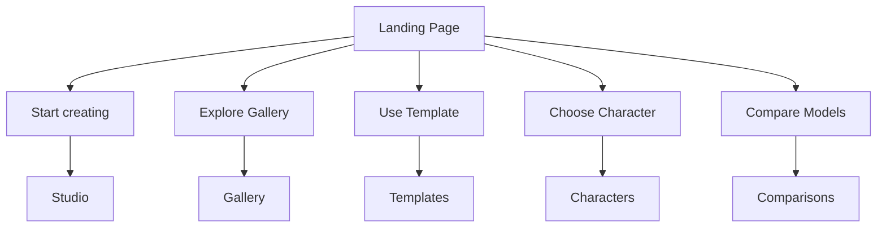

# Momelo Landing Page — UX/UI Developer Specification

> Version: MVP Simplified 1.0  
> Audience: UX/UI Designer, Frontend Developer, AI Coding Agent, Product Owner  
> Page type: Public marketing landing page  
> Related routes: Gallery, Templates, Characters, Comparisons, Studio, Pricing

---

## 1. Purpose

Landing Page นี้ต้องทำให้ผู้เข้าชมใหม่เข้าใจ Momelo ภายในช่วงแรกของหน้า ว่าเป็นพื้นที่สำหรับ:

1. สร้างภาพด้วย AI
2. เริ่มจาก Template ที่มี Style และองค์ประกอบพร้อมใช้
3. เลือก AI Character เพื่อนำไปสร้างภาพหรือวิดีโอ
4. เปรียบเทียบผลลัพธ์จากหลาย AI Model ด้วย Prompt เดียวกัน
5. เผยแพร่และค้นพบผลงานจาก Community

หน้า Landing ต้องเน้นภาพและจุดเริ่มต้นที่ชัดเจน ไม่ทำหน้าที่เป็น Dashboard และไม่แสดงข้อมูลทุกอย่างของแต่ละ Feature

---

## 2. Product Message

### Primary message

**Create worlds. Build characters. Share what you imagine.**

### Supporting message

Create with AI, start from reusable templates, work with expressive characters, compare models, and share your results with the community.

### Communication priority

1. เห็นผลงานแล้วอยากลองสร้าง
2. เข้าใจว่ามีหลายวิธีในการเริ่มต้น
3. เลือกเส้นทางที่เหมาะกับตัวเองได้ทันที
4. เห็นว่า Momelo มี Community รองรับหลังจากสร้างผลงาน

---

## 3. Primary Users

### Visitor

- ยังไม่เคยใช้ Momelo
- ต้องเข้าใจ Product โดยไม่ต้องอ่านคำอธิบายยาว
- ต้องการเห็นคุณภาพและความหลากหลายของผลลัพธ์
- อาจเข้ามาจาก Search, Social Media หรือผลงานที่ถูกแชร์

### Creator

- ต้องการสร้างภาพหรือวิดีโออย่างรวดเร็ว
- ต้องการเริ่มจาก Template หรือ Character แทนการเขียน Prompt ตั้งแต่ต้น
- สนใจเผยแพร่ผลงานและเติบโตใน Community

### Professional user

- ต้องการเลือก AI Model ให้เหมาะกับงาน
- สนใจความสม่ำเสมอ คุณภาพ และ Workflow ที่นำกลับมาใช้ซ้ำได้

---

## 4. Scope for MVP

Landing Page เวอร์ชัน MVP มี 8 Sections เท่านั้น:

1. Compact Header
2. Hero
3. Choose How to Start
4. Created with Momelo
5. More Than a Prompt
6. Model Comparison Preview
7. How Momelo Works + Creator Utility Strip
8. Final CTA + Compact Footer

### Out of scope for MVP

- Feed แบบ Infinite Scroll
- Dashboard ของสมาชิก
- ตารางคะแนนหลายชุดใน Landing Page
- Pricing table แบบเต็ม
- Creator payout dashboard
- Tutorial library แบบเต็ม
- Review หรือ Testimonial ที่ยังไม่มีข้อมูลจริง
- ตัวเลขผู้ใช้งาน ยอดสร้าง หรือรายได้ที่ยังตรวจสอบไม่ได้
- Video background แบบ Autoplay

---

## 5. Information Architecture



Landing Page ต้องทำหน้าที่เป็น Navigation Hub แบบมองเห็นภาพ ไม่ควรจำลองรายละเอียดของปลายทางทั้งหมดไว้ในหน้าเดียว

---

## 6. Global Layout

### Desktop

- Content max width: `1200–1280px`
- Page gutter: `32px` ขั้นต่ำ
- Section vertical spacing: `96–128px`
- Card gap: `20–24px`
- Hero อยู่เหนือ fold ให้มากที่สุดเมื่อ viewport สูง `800–900px`

### Tablet

- Content gutter: `24px`
- Section vertical spacing: `72–96px`
- Grid ลดจาก 4 เป็น 2 Columns

### Mobile

- Content gutter: `16–20px`
- Section vertical spacing: `56–72px`
- ใช้ 1 Column เป็นหลัก
- CTA หลักควรกว้างเต็มพื้นที่เมื่อเหมาะสม
- หลีกเลี่ยง Carousel ที่ซ่อนเนื้อหาหลักโดยไม่จำเป็น

### Important note

Mockup แนวตั้งเป็นเพียงภาพนำเสนอ Page Structure ไม่ได้หมายความว่า Desktop Website ต้องล็อกอัตราส่วน 9:16

---

## 7. Visual Direction

### Theme

- Background หลัก: Dark navy / near black
- Surface: Dark blue-gray ที่แยกจาก Background อย่างชัดเจน
- Primary accent: Cyan
- Secondary accent: Magenta/Purple
- Gradient ใช้เฉพาะ CTA สำคัญและจุดเน้น
- Glow ต้องเบาและไม่ลดความชัดเจนของข้อความ

### Visual hierarchy

- ภาพผลงานเป็นจุดเด่นอันดับหนึ่ง
- Headline และ CTA เป็นอันดับสอง
- Metadata และ Decorative UI เป็นอันดับรอง
- ห้ามใช้กรอบเรืองแสงกับทุก Card

### Suggested tokens

```css
:root {
  --color-bg: #070a12;
  --color-surface: #0d1220;
  --color-surface-raised: #12192a;
  --color-border: #263047;
  --color-text-primary: #f4f7ff;
  --color-text-secondary: #aab3c7;
  --color-primary: #20d9ff;
  --color-secondary: #cf4cff;
  --color-success: #42d392;
  --radius-card: 20px;
  --radius-control: 12px;
  --shadow-soft: 0 16px 48px rgb(0 0 0 / 28%);
}
```

ค่าจริงให้ปรับจาก Design System ของโครงการ และต้องตรวจ Contrast ก่อนใช้งานจริง

---

## 8. Section Specifications

## 8.1 Compact Header

### Purpose

ให้ผู้ใช้เข้าถึงหน้าหลักได้ทันที โดยไม่แย่งความสนใจจาก Hero

### Content

- Momelo logo
- Gallery
- Templates
- Characters
- Comparisons
- Pricing
- Sign in
- Primary CTA: `Start creating`

### Behavior

- Desktop: แสดง Navigation Links ครบ
- Mobile: Logo + Sign in หรือ Account + Menu button
- Header อาจ Sticky ได้ แต่ต้องลดความสูงเมื่อ Scroll
- Active state ใช้เฉพาะเมื่อ Landing ถูกใช้เป็นส่วนหนึ่งของ App shell
- CTA ต้องพาไป Studio; ถ้ายังไม่ Login ให้เข้าสู่ Auth แล้ว Redirect กลับไป Studio

### UI constraints

- ความสูงแนะนำ: `64–72px`
- ไม่ใส่ Search, Notifications, Credits หรือ Profile tools สำหรับ Logged-out Landing
- ไม่ใช้ Sidebar บน Public Landing Page

---

## 8.2 Hero

### Purpose

ตอบ 3 คำถามในช่วงแรกของหน้า:

1. Momelo คืออะไร
2. สร้างอะไรได้
3. เริ่มจากตรงไหน

### Content

- Eyebrow optional: `AI CREATIVE COMMUNITY`
- H1: `Create worlds. Build characters. Share what you imagine.`
- Supporting text ไม่เกิน 2–3 บรรทัดบน Desktop
- Primary CTA: `Start creating`
- Secondary CTA: `Explore community`
- Visual composition: ภาพสร้างสรรค์ 3 ภาพ + Mini creation panel 1 ชิ้น

### Visual guidance

- ใช้ภาพต่างประเภทกัน เช่น Fashion, Character และ Conceptual art
- ภาพต้องดูเป็นชุดเดียวกันแต่ไม่ซ้ำ Subject กันทั้งหมด
- Mini creation panel เป็นเพียง Preview ของ Workflow ไม่ต้องจำลอง Studio เต็มรูปแบบ
- ภาพหลักต้องมีพื้นที่ชัด ไม่ซ้อนข้อความมากเกินไป

### Interaction

- `Start creating` → `/studio`
- `Explore community` → `/gallery`
- Visual cards อาจมี Parallax เล็กน้อยบนอุปกรณ์ที่รองรับ
- ต้องปิด Motion เมื่อ `prefers-reduced-motion: reduce`

### Do not include

- ตัวเลขสถิติที่ยังไม่ยืนยัน
- Badge จำนวนมาก
- Model selector ที่ใช้งานจริงไม่ได้
- Autoplay video พร้อมเสียง

---

## 8.3 Choose How to Start

### Purpose

ช่วยให้ผู้ใช้เลือก Entry Point ตามเป้าหมาย โดยไม่ต้องเข้าใจศัพท์เทคนิคก่อน

### Layout

- Desktop: 4 Cards ในแถวเดียว
- Tablet: 2 × 2
- Mobile: 1 Column หรือ Horizontal scroll ที่มี Peek ชัดเจน

### Cards

| Card | Short description | Route | CTA label |
|---|---|---|---|
| Create | Start from your own idea or prompt | `/studio` | Start creating |
| Templates | Reuse a visual style, pose and composition | `/templates` | Browse templates |
| Characters | Create with an existing AI personality | `/characters` | Explore characters |
| Compare models | See how different models answer the same prompt | `/comparisons` | Compare results |

### UI anatomy

- Icon หรือ Visual thumbnail 1 จุด
- Heading 1 บรรทัด
- Description ไม่เกิน 2 บรรทัด
- Text link หรือ Arrow
- ทั้ง Card กดได้ แต่ต้องมี Focus state

### Content rule

ใช้คำที่บอกผลลัพธ์ หลีกเลี่ยงศัพท์ระบบ เช่น Pipeline, Provider Routing หรือ Generation Node

---

## 8.4 Created with Momelo

### Purpose

แสดงคุณภาพและความหลากหลายของ Community โดยไม่เปลี่ยน Landing ให้เป็น Feed

### Layout

- Desktop: 1 Featured work ขนาดใหญ่ + 2 Supporting works
- Mobile: Featured work 1 ชิ้น และ Supporting works เรียงต่อกัน
- จำนวนสูงสุดใน MVP: 3 ผลงาน

### Work card anatomy

- Generated image
- Title optional
- Creator avatar + display name
- Category หรือ Style tag สูงสุด 1 Tag
- Like count แสดงเมื่อเป็นข้อมูลจริง
- Hover action: `View work`

### Content selection

- Editorially selected หรืออิง Weekly quality signal
- กระจายประเภทภาพ ไม่ใช้ Portrait ใกล้เคียงกันทั้งหมด
- ต้องมี Moderation state ผ่านก่อนนำขึ้น Landing
- ต้องมี Fallback curated content หาก API โหลดไม่ได้

### CTA

`Explore Gallery` → `/gallery`

---

## 8.5 More Than a Prompt

### Purpose

ชูจุดต่างสำคัญของ Momelo ด้วย Feature Cards เพียง 2 ใบ

### Card A: Reusable Templates

สื่อว่า Template ไม่ใช่เพียง Prompt แต่เก็บ:

- Pose
- Composition
- Visual style
- Recommended inputs
- Generation settings ที่จำเป็น

CTA: `Explore templates` → `/templates`

### Card B: AI Characters

สื่อว่า Character มี Identity และสามารถเติบโตเป็น AI Influencer ได้:

- Character identity
- Owner/creator attribution
- Public creations
- Reusable in image or video workflows เมื่อรองรับจริง

CTA: `Meet characters` → `/characters`

### Layout

- Desktop: 2 Cards ขนาดเท่ากัน
- Mobile: Stack โดย Templates มาก่อน Characters
- ใช้ Visual ขนาดใหญ่กว่าข้อความ
- แต่ละ Card มี Headline, คำอธิบายสั้น และ CTA เดียว

### Future communication

ระบบรายได้ของ Template Creator สามารถกล่าวถึงได้เฉพาะเมื่อเปิดใช้งานหรือมี Waitlist จริง ห้ามสื่อว่าเริ่มสร้างรายได้ได้แล้วหากระบบยังไม่พร้อม

---

## 8.6 Model Comparison Preview

### Purpose

แสดงความสามารถ Comparison แบบเข้าใจได้ภายในไม่กี่วินาที

### Content

- Section title: `One prompt. Different possibilities.`
- Prompt excerpt 1 บรรทัด
- Output 3 ภาพ
- Model label ใต้แต่ละภาพ
- CTA: `Compare models`

### Layout

- Desktop: Prompt summary ด้านซ้าย + Images 3 ใบด้านขวา
- Tablet/Mobile: Prompt อยู่บน Images
- Images ต้องมี Aspect ratio เดียวกัน
- แสดง Provider และ Model เท่าที่มีข้อมูลจริง

### Interaction

- กดภาพ → Comparison detail
- CTA → `/comparisons`
- หากต้องสร้าง Comparison ใหม่ ให้ใช้ CTA รองในหน้าปลายทาง ไม่เพิ่มบน Landing

### Data integrity

- ทั้ง 3 ผลลัพธ์ต้องมาจาก Prompt เดียวกันจริง
- หาก Settings ต่างกัน ต้องเปิดเผยในหน้ารายละเอียด
- ห้ามใช้คะแนนจำลองหรือประกาศผู้ชนะใน Landing

---

## 8.7 How Momelo Works

### Purpose

ลดความไม่แน่ใจของผู้ใช้ใหม่ด้วย Workflow 3 ขั้นตอน

### Steps

1. `Choose` — Start from an idea, template or character
2. `Create` — Generate and refine your result
3. `Publish or download` — Share with the community or keep it for your work

### Layout

- Desktop: 3 Steps ในแถวเดียว
- Mobile: เรียงแนวตั้ง
- ใช้ตัวเลขหรือไอคอนเรียบง่าย
- แต่ละ Step มีคำอธิบายไม่เกิน 2 บรรทัด

### Built for Creators utility strip

วางใต้ Workflow เป็นแถบเดียว ไม่แยกเป็นหลาย Section:

- Short message: `Built for creators, teams and growing communities.`
- CTA: `View pricing` → `/pricing`
- Secondary status/link: `Creator Program — Coming soon`

หากมี Waitlist จริง ให้ Secondary action เปิดแบบฟอร์ม Waitlist แทนข้อความสถานะ

---

## 8.8 Final CTA and Footer

### Final CTA

- Headline: `Ready to create something unforgettable?`
- Supporting line สั้น 1 บรรทัด
- Primary CTA: `Start creating`
- Optional secondary CTA: `Explore Gallery`

### Footer groups

- Product: Gallery, Templates, Characters, Comparisons, Studio
- Resources: Tutorials, Help, Community guidelines
- Company: About, Contact, Creator Program
- Legal: Terms, Privacy, Copyright policy
- Social links เฉพาะช่องทางที่เปิดใช้งานจริง

### Footer constraints

- Footer ต้องกระชับ
- ไม่แสดง API Engine, Job Queue หรือระบบภายใน
- ไม่ใช้ Link ที่ยังไม่มีปลายทาง; ถ้ายังไม่พร้อมให้ซ่อนหรือระบุ Coming soon อย่างชัดเจน

---

## 9. CTA Routing and Authentication

| UI action | Anonymous user | Signed-in user |
|---|---|---|
| Start creating | Auth → `/studio` | `/studio` |
| Explore community | `/gallery` | `/gallery` |
| Browse templates | `/templates` | `/templates` |
| Use a template | Auth → template workflow | Template workflow |
| Explore characters | `/characters` | `/characters` |
| Create with character | Auth → Studio with character selected | Studio with character selected |
| Compare models | `/comparisons` | `/comparisons` |
| View pricing | `/pricing` | `/pricing` |
| Sign in | Auth with return URL | Hidden or replaced by avatar |

### Return URL rule

เมื่อ User ถูกส่งไป Sign in จาก CTA ใด ต้องกลับไปยัง Intent เดิมหลัง Login สำเร็จ ไม่ควรส่งกลับ Landing ทุกครั้ง

---

## 10. Component Tree

```text
LandingPage
├── PublicHeader
│   ├── BrandLogo
│   ├── PrimaryNavigation
│   └── AuthActions
├── HeroSection
│   ├── HeroCopy
│   ├── HeroActions
│   └── HeroVisual
├── StartPathSection
│   └── StartPathCard × 4
├── CommunityShowcaseSection
│   ├── FeaturedWorkCard
│   └── WorkCard × 2
├── ProductDifferentiatorsSection
│   ├── TemplateFeatureCard
│   └── CharacterFeatureCard
├── ComparisonPreviewSection
│   ├── PromptSummary
│   └── ModelOutputCard × 3
├── WorkflowSection
│   ├── WorkflowStep × 3
│   └── CreatorUtilityStrip
├── FinalCTASection
└── PublicFooter
```

### Component design rules

- Section component รับข้อมูลผ่าน Props หรือ CMS payload
- Card ไม่ควรผูก Fetch logic ของตัวเอง
- Image component ต้องรองรับ Responsive source, placeholder และ error fallback
- Link และ Button ต้องแยก Semantic element ถูกต้อง
- ใช้ Shared tokens กับหน้าปลายทาง แต่ไม่จำเป็นต้องใช้ Card component เดียวกันทุกประเภท

---

## 11. Suggested Data Contract

```ts
type LandingPagePayload = {
  hero: {
    title: string;
    description: string;
    visuals: Array<MediaAsset>;
  };
  featuredWorks: LandingWork[];
  featuredTemplate?: LandingTemplate;
  featuredCharacter?: LandingCharacter;
  comparison?: LandingComparison;
  creatorProgram: {
    status: 'hidden' | 'coming_soon' | 'waitlist' | 'active';
    url?: string;
  };
};

type MediaAsset = {
  id: string;
  src: string;
  width: number;
  height: number;
  alt: string;
  blurDataURL?: string;
};

type LandingWork = {
  id: string;
  slug: string;
  title?: string;
  image: MediaAsset;
  creator: {
    id: string;
    displayName: string;
    avatar?: MediaAsset;
  };
  category?: string;
  likeCount?: number;
  moderationStatus: 'approved';
};

type LandingTemplate = {
  id: string;
  slug: string;
  title: string;
  preview: MediaAsset;
  ownerName: string;
  supportedInputs: string[];
};

type LandingCharacter = {
  id: string;
  slug: string;
  name: string;
  profileImage: MediaAsset;
  ownerName: string;
  shortPersonality?: string;
  capabilities: Array<'image' | 'video'>;
};

type LandingComparison = {
  id: string;
  slug: string;
  promptExcerpt: string;
  outputs: Array<{
    image: MediaAsset;
    provider: string;
    model: string;
  }>;
};
```

### Data source

- แนะนำ Endpoint รวม: `GET /api/landing`
- Payload ควร Cache ได้และใช้ CDN
- Content ที่ทีมเลือกควรแก้ผ่าน Admin/CMS โดยไม่ต้อง Deploy Frontend ใหม่
- Landing ต้องไม่เรียก API แยกจำนวนมากจากทุก Feature page

---

## 12. Loading, Empty and Error States

### Loading

- Hero copy และ CTA แสดงได้ทันที
- Hero visual ใช้ dominant-color หรือ blur placeholder
- Below-the-fold sections ใช้ Skeleton เฉพาะตำแหน่งที่จำเป็น
- หลีกเลี่ยง Full-page spinner

### Empty content

- Featured works ว่าง: ใช้ Curated starter content ที่ผ่านการอนุมัติ
- Comparison ว่าง: ซ่อน Section ทั้งชุด ไม่แสดง Card เปล่า
- Featured template/character ว่าง: ใช้ข้อความ Product benefit และ Illustration ที่เตรียมไว้

### API error

- Landing ต้องยังแสดง Hero, Navigation, Start paths และ Final CTA ได้
- Log error โดยไม่แสดง Technical message ต่อผู้ใช้
- มี Retry เฉพาะ Section หากเหมาะสม

### Image error

- ใช้ Branded placeholder ที่รักษา Aspect ratio
- Alt text ยังต้องอยู่
- ห้ามปล่อย Broken image icon

---

## 13. Responsive Behavior

| Element | Desktop | Tablet | Mobile |
|---|---|---|---|
| Header nav | Full links | Reduced links | Menu sheet |
| Hero | 2 Columns | 2 Columns compact | Copy then visual |
| Hero visual | 3 images + mini UI | 2–3 images | 1–2 images; remove decorative panel if needed |
| Start paths | 4 Columns | 2 × 2 | 1 Column |
| Community works | 1 large + 2 small | Balanced grid | Stack |
| Feature pair | 2 Columns | 2 Columns | Stack |
| Comparison | Prompt + 3 outputs | Prompt over grid | Horizontal output strip or stack |
| Workflow | 3 Columns | 3 compact | Vertical |
| Footer | 4 groups | 2 × 2 | Accordion or stacked groups |

### Breakpoints

Breakpoints ใช้ตามระบบเดิมของ Project หากยังไม่มี แนะนำเริ่มต้น:

```css
--bp-sm: 640px;
--bp-md: 768px;
--bp-lg: 1024px;
--bp-xl: 1280px;
```

---

## 14. Accessibility Requirements

- ใช้ Heading hierarchy เดียว: `h1` หนึ่งครั้ง และ `h2` สำหรับแต่ละ Section
- Text ปกติต้องมี Contrast อย่างน้อย `4.5:1`
- Text ขนาดใหญ่ต้องมี Contrast อย่างน้อย `3:1`
- Interactive controls ต้องใช้งานด้วย Keyboard ได้ครบ
- แสดง Focus indicator ที่มองเห็นชัด
- Touch target แนะนำอย่างน้อย `44 × 44px`
- ภาพผลงานใช้ Alt text ที่อธิบายสาระของภาพ ไม่ใส่คำว่า “image of” ซ้ำ
- Decorative visual ใช้ `alt=""`
- ไม่ใช้สีเพียงอย่างเดียวในการบอก State
- Motion ต้องรองรับ `prefers-reduced-motion`
- Mobile menu ต้อง Trap focus และคืน Focus ไปยัง Trigger เมื่อปิด
- Icon-only button ต้องมี Accessible name

---

## 15. Performance Requirements

### Hero / LCP

- ระบุขนาดภาพชัดเจนเพื่อป้องกัน Layout shift
- Preload หรือ Priority load เฉพาะภาพ LCP
- ส่งภาพ WebP/AVIF เมื่อ Browser รองรับ
- ใช้ `srcset` และ `sizes`
- ห้าม Lazy-load ภาพ LCP

### Below the fold

- Lazy-load Images และ Feature code ที่ไม่จำเป็นต่อ First paint
- จำกัดจำนวนภาพบน Landing ตาม Scope
- ไม่โหลด Video player หรือ YouTube iframe จนกว่าจะกดเปิด Tutorial
- จำกัด Font family และ Font weights

### Suggested targets

- LCP: `≤ 2.5s` ที่ 75th percentile
- INP: `≤ 200ms` ที่ 75th percentile
- CLS: `≤ 0.1` ที่ 75th percentile
- Initial JavaScript ควรเล็กที่สุดเท่าที่ Framework และระบบปัจจุบันทำได้

---

## 16. SEO and Social Sharing

### Required metadata

- Unique page title
- Meta description ที่บอก Create, Templates, Characters และ Community อย่างเป็นธรรมชาติ
- Canonical URL
- Open Graph title, description และ image
- Twitter/X card metadata หากมีช่องทางใช้งาน
- Favicon และ Web app icons

### Suggested title

`Momelo — Create, Explore and Share AI Visuals`

### Suggested description

`Create AI images, start from reusable templates, work with AI characters, compare models, and share your work with the Momelo community.`

### Technical SEO

- Navigation หลักต้องเป็น Crawlable links
- Server-render หรือ Pre-render เนื้อหาหลักเมื่อ Stack รองรับ
- ใช้ Structured data เฉพาะข้อมูลที่มีอยู่จริง
- Gallery images ต้องมี Detail URL ที่แชร์ได้
- หลีกเลี่ยงข้อความสำคัญที่ Render อยู่ใน Canvas หรือภาพเพียงอย่างเดียว

---

## 17. Analytics Events

| Event | Trigger | Suggested properties |
|---|---|---|
| `landing_viewed` | Page ready | locale, auth_state, referrer_group |
| `hero_primary_clicked` | Start creating | auth_state, source_section |
| `hero_secondary_clicked` | Explore community | source_section |
| `start_path_clicked` | Click one of 4 paths | path_type, auth_state |
| `featured_work_opened` | Open work | work_id, position |
| `gallery_cta_clicked` | Explore Gallery | source_section |
| `template_feature_clicked` | Open Templates | template_id optional |
| `character_feature_clicked` | Open Characters | character_id optional |
| `comparison_clicked` | Open comparison | comparison_id |
| `pricing_clicked` | View pricing | source_section |
| `creator_program_clicked` | Open program/waitlist | program_status |
| `final_cta_clicked` | Final Start creating | auth_state |

### Privacy rule

- ห้ามส่ง Prompt เต็ม, ชื่อไฟล์ผู้ใช้ หรือข้อมูลส่วนตัวเข้า Analytics โดยอัตโนมัติ
- ใช้ Internal IDs แทนข้อความส่วนบุคคล

---

## 18. Content Rules

- Headline ต่อ Section ไม่เกิน 8–10 คำเมื่อเป็นภาษาอังกฤษ
- Supporting copy ไม่เกิน 2–3 บรรทัด
- แต่ละ Section มี Primary CTA ไม่เกิน 1 จุด
- หลีกเลี่ยงคำโฆษณาที่พิสูจน์ไม่ได้ เช่น “ดีที่สุด” หรือ “อันดับหนึ่ง”
- ไม่แสดง Fake testimonials, Fake ratings หรือ Fake creator income
- ใช้คำว่า `Character` สำหรับตัวตนเสมือน และ `AI model` สำหรับระบบสร้างภาพ
- Template ต้องอธิบายว่าเป็น Style, Pose และ Composition ที่นำกลับมาใช้ได้ ไม่ใช่เพียงภาพตัวอย่าง
- หาก Feature ยังไม่เปิด ให้ใช้ `Coming soon` หรือ Waitlist ที่ใช้งานได้จริง

---

## 19. MVP vs Future Enhancements

| Feature | MVP | Future |
|---|---|---|
| Hero | Static curated visual | Personalized creative showcase |
| Start paths | 4 fixed entry points | Personalized ordering |
| Gallery preview | 3 curated works | Dynamic trending selection |
| Templates | One feature card | Weekly/monthly template highlights |
| Characters | One feature card | Trending AI influencers |
| Comparisons | One curated comparison | Live trending model rankings |
| Tutorials | Footer/resource link | Embedded learning hub |
| Creator Program | Coming soon or waitlist | Revenue and payout program |
| Landing personalization | None | Recent work and recommendations for members |

Future features ต้องเพิ่มหลังจากวัดว่าผู้ใช้เข้าใจ 4 เส้นทางหลักแล้ว ไม่ควรนำกลับมาใส่พร้อมกันใน MVP

---

## 20. Acceptance Criteria

### Functional

- [ ] Navigation และ CTA ทุกจุดมีปลายทางจริง
- [ ] Anonymous user ถูก Redirect กลับ Intent เดิมหลัง Login
- [ ] Landing ยังใช้งานเส้นทางหลักได้เมื่อ Dynamic content API ล้มเหลว
- [ ] Featured content แสดงเฉพาะรายการที่ผ่าน Moderation
- [ ] Comparison preview ใช้ Prompt เดียวกันจริง
- [ ] Mobile menu ใช้งานด้วย Keyboard และ Screen reader ได้

### Visual

- [ ] หน้าใช้ 8 Sections ตาม Scope และไม่เพิ่ม Dashboard widgets
- [ ] Hero เป็นจุดเด่นที่สุดของหน้า
- [ ] ภาพผลงานมี Aspect ratio และ Crop ที่สม่ำเสมอ
- [ ] Gradient/Glow ไม่ถูกใช้กับทุก Card
- [ ] Landing ไม่มี Sidebar
- [ ] Footer กระชับและไม่มีสถานะระบบภายใน

### Responsive

- [ ] ไม่มี Horizontal overflow ที่ `320px`
- [ ] CTA อ่านง่ายและกดได้สะดวกบน Mobile
- [ ] Layout ใช้งานได้ที่ `768px`, `1024px`, `1280px` และ `1440px`
- [ ] Hero visual ลดความซับซ้อนบน Mobile โดยไม่ซ่อนข้อความหลัก

### Accessibility

- [ ] Contrast ผ่าน WCAG 2.2 AA
- [ ] Keyboard navigation ครบทุก Interactive element
- [ ] Focus state มองเห็นได้
- [ ] Heading structure ถูกต้อง
- [ ] Images มี Alt text หรือถูกระบุเป็น Decorative
- [ ] Reduced motion preference ทำงาน

### Performance and SEO

- [ ] LCP image ถูก Optimize และไม่ Lazy-load
- [ ] Images ทุกใบมี Width/Height หรือ Aspect ratio
- [ ] Below-the-fold media Lazy-load
- [ ] Title, description, canonical และ Open Graph พร้อมใช้งาน
- [ ] Core content อ่านได้โดยไม่ต้องรอ Client-side API ทั้งหมด

---

## 21. Recommended Implementation Order

1. สร้าง Route, Global layout และ Design tokens
2. ทำ Header, Hero และ CTA routing
3. ทำ Start path cards
4. ทำ Static sections: Feature pair, Workflow, Final CTA และ Footer
5. เชื่อม Landing content API สำหรับ Works, Template, Character และ Comparison
6. ทำ Loading, Empty และ Error states
7. ทำ Responsive QA
8. ทำ Accessibility QA
9. ทำ Image optimization, SEO และ Analytics
10. ตรวจ Acceptance Criteria ก่อน Release

---

## 22. Developer Handoff Notes

- Mockup เป็น Visual direction ไม่ใช่ Pixel-perfect implementation หากมี Conflict ให้ยึด Content hierarchy และ Responsive behavior ในเอกสารนี้
- อย่าจำลองข้อมูลความนิยม รายได้ หรือ Rating เพื่อเติมพื้นที่
- หากข้อมูล Dynamic ยังไม่พร้อม ให้ใช้ Curated content ที่ทีมอนุมัติและระบุ Source ใน CMS
- เก็บ Section configuration แยกจาก Component logic เพื่อรองรับการทดลอง Content ในอนาคต
- หน้า Logged-in Home อาจพัฒนาแยกภายหลัง ไม่ควรเพิ่ม Recent jobs, Credits หรือ Notifications ลง Public Landing
- Tutorial สามารถใช้ YouTube หรือ External guide ได้ในอนาคต แต่ควรเปิดผ่าน Link/Modal ตามความเหมาะสม และไม่โหลด Player ตั้งแต่ Page load

---

## 23. References

- [W3C — WCAG 2.2: Contrast Minimum](https://www.w3.org/WAI/WCAG22/Understanding/contrast-minimum.html)
- [W3C — WCAG 2.2: Target Size Minimum](https://www.w3.org/WAI/WCAG22/Understanding/target-size-minimum.html)
- [web.dev — Optimize Largest Contentful Paint](https://web.dev/articles/optimize-lcp)
- [web.dev — Core Web Vitals](https://web.dev/articles/vitals)
- [Google Search Central — SEO Starter Guide](https://developers.google.com/search/docs/fundamentals/seo-starter-guide)
- [Nielsen Norman Group — Top 10 Guidelines for Homepage Usability](https://www.nngroup.com/articles/top-ten-guidelines-for-homepage-usability/)

