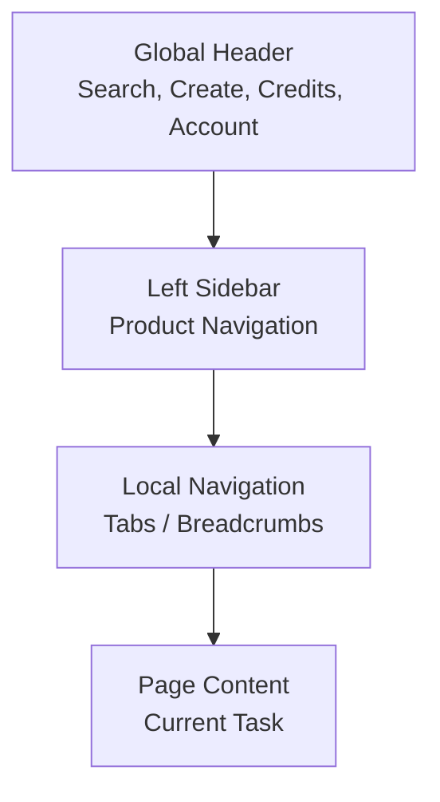
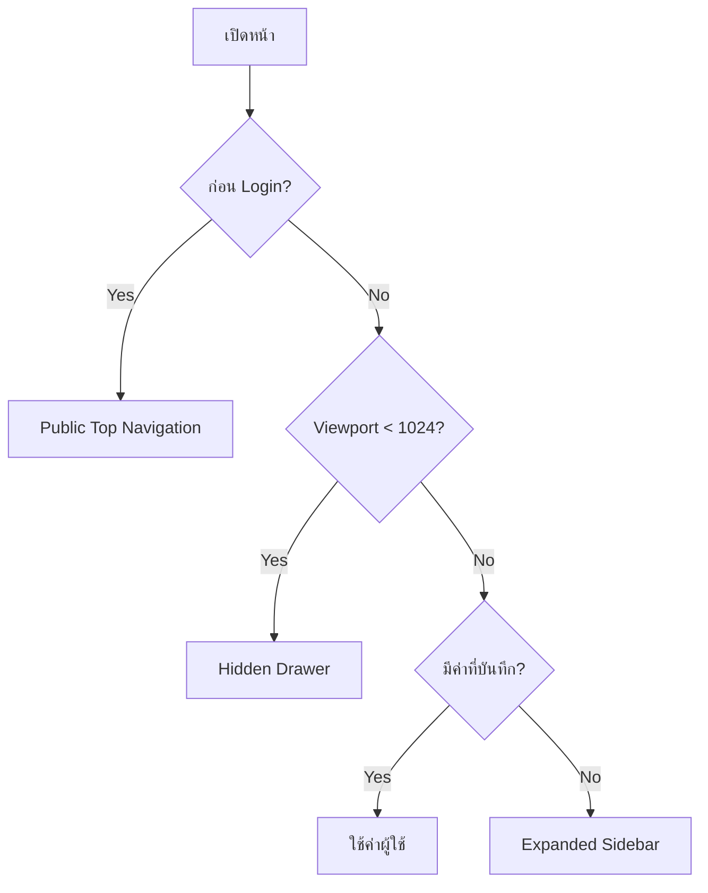

# Momelo Navigation Redesign Specification

> เอกสารอธิบายการปรับปรุง Navigation จาก Top Navigation แบบเดิม  
> ไปเป็น Hybrid App Navigation: Global Header + Left Sidebar + Local Navigation

**สถานะเอกสาร:** Design Specification  
**กลุ่มผู้อ่าน:** Product Owner, Business Analyst, UX/UI Designer, Software Engineer, QA  
**ผลิตภัณฑ์:** Momelo  
**หน้าตัวอย่าง:** Logged-in Community / Landing Experience  
**วันที่จัดทำ:** 27 กรกฎาคม 2026

**Normative visual reference:**  
[`requirements/008-implement-adjusment-ui/001-landing-page_rewamp.png`](./001-landing-page_rewamp.png)

ภาพนี้เป็น reference หลักสำหรับลำดับชั้นของ Global Header, Left Sidebar,
content reflow, active navigation และความสัมพันธ์ระหว่าง Navigation กับหน้า
Home/Community การ Implement ต้องรักษา concept และ information hierarchy
จากภาพ แต่ไม่จำเป็นต้องคัดลอกข้อความ ข้อมูลตัวอย่าง หรือ pixel value ทุกจุด
เมื่อขัดกับ accessibility, responsive behavior หรือ component contract
ในเอกสารนี้ ให้ยึดข้อกำหนดเชิงพฤติกรรมในเอกสารเป็นหลัก

---

## 1. วัตถุประสงค์

Navigation เดิมของ Momelo วาง Feature หลักทั้งหมดไว้ในแถบแนวนอนด้านบน ได้แก่:

- สตูดิโอ / สร้างภาพ
- Playground
- Community
- ประวัติรูปภาพ
- เปรียบเทียบ AI

โครงสร้างนี้ยังใช้งานได้เมื่อระบบมีประมาณ 4–5 เมนู แต่จะเริ่มมีปัญหาเมื่อ Momelo เพิ่ม:

- Fashion Studio
- Character Builder
- Scene Builder
- Templates
- Creators
- Collections
- Saved
- Drafts
- Marketplace
- Credits
- Settings
- Admin

วัตถุประสงค์ของการออกแบบใหม่คือ:

1. รองรับ Feature ที่เพิ่มขึ้นโดยไม่ทำให้ Header แน่นหรือข้อความเล็กลง
2. ทำให้ผู้ใช้ non-tech เข้าใจระบบจากชื่อกลุ่มงาน
3. แยก Global Action ออกจาก Product Navigation
4. ทำให้ปุ่มสร้างภาพเข้าถึงได้จากทุกหน้า
5. รองรับ Desktop, Laptop, Tablet และ Mobile
6. ใช้โครงสร้างเดียวกันทุกหน้าหลัง Login
7. รองรับ Permission และเมนูเฉพาะเจ้าของหรือ Admin ในอนาคต
8. ลดการสร้าง Navigation เฉพาะหน้า ซึ่งทำให้ประสบการณ์ใช้งานแตกต่างกัน

---

## 2. เอกสารและภาพอ้างอิง

### ภาพก่อนปรับ

โครงสร้าง Navigation ปัจจุบันในแอปพลิเคชัน

ลักษณะสำคัญ:

- Momelo Logo และ Account Control อยู่ใน Header แถวแรก
- Feature Navigation อยู่ในแถวที่สอง
- แต่ละเมนูใช้ Icon และข้อความสองบรรทัด
- เมนูทั้งหมดมีความสำคัญในระดับเดียวกัน
- Community แสดง Active State ด้วยกรอบ Cyan

### ภาพหลังปรับ

[`001-landing-page_rewamp.png`](./001-landing-page_rewamp.png)

ลักษณะสำคัญ:

- Header เหลือเฉพาะ Global Control
- Feature Navigation ย้ายมา Left Sidebar
- Sidebar แบ่งเป็นกลุ่ม `สร้าง`, `สำรวจ`, `คลังของฉัน`
- Community เป็น Active Page
- มีปุ่มพับ Sidebar
- Main Content ปรับพื้นที่ตาม Sidebar

---

## 3. สรุปการเปลี่ยนแปลง

| ประเด็น | รูปแบบเดิม | รูปแบบใหม่ |
|---|---|---|
| Navigation หลัก | แถบแนวนอนด้านบน | Left Sidebar |
| Header | Logo, User และ Feature Menu | Logo, Search, Create, Credits, Notifications, Profile |
| Feature grouping | ไม่มีการจัดกลุ่มชัดเจน | สร้าง / สำรวจ / คลังของฉัน |
| จำนวนเมนูที่รองรับ | ประมาณ 4–5 รายการ | รองรับหลายรายการและ Submenu |
| ชื่อเมนู | Icon + ข้อความสองบรรทัด | Icon + ข้อความหนึ่งบรรทัด |
| Active State | กรอบรอบ Menu Card | พื้นหลัง, เส้นด้านซ้าย และสี Icon/Text |
| การย่อ Navigation | ไม่รองรับ | Expanded / Collapsed / Drawer |
| Global Search | อยู่ภายใน Content | อยู่ใน Header และใช้ได้ทุกหน้า |
| Create Action | อยู่ตามหน้า | ปุ่ม `+ สร้างภาพ` คงที่ใน Header |
| Account Menu | Control ขนาดเล็กด้านขวา | Avatar Dropdown ที่รวม Profile, Credits, Settings |
| Responsive | เมนูอาจล้นหรือย่อข้อความ | Sidebar เปลี่ยนเป็น Rail หรือ Drawer |
| Local Navigation | ปะปนกับ Navigation หลัก | ใช้ Tabs ภายในหน้า |

---

## 4. ปัญหาของ Navigation เดิม

### 4.1 ไม่รองรับจำนวน Feature ที่เพิ่มขึ้น

พื้นที่แนวนอนมีข้อจำกัด หากเพิ่มเมนูใหม่จะเกิดอย่างใดอย่างหนึ่ง:

- เมนูมีขนาดแคบลง
- Font เล็กลง
- ข้อความตัดบรรทัดเพิ่ม
- ต้องซ่อนเมนูไว้ใน `More`
- ความสำคัญของทุกเมนูดูเท่ากัน
- ภาษาที่มีคำยาว เช่น ภาษาไทย อาจล้นพื้นที่

### 4.2 ใช้พื้นที่แนวตั้งสองแถว

Header เดิมใช้:

1. แถว Logo และ Account
2. แถว Feature Navigation

ทำให้พื้นที่ Content เริ่มต่ำลง โดยเฉพาะหน้าที่ต้องการ Canvas ขนาดใหญ่ เช่น:

- Generate Image
- Compare Models
- Character Sheet
- Scene Builder

### 4.3 ผู้ใช้ไม่เห็นโครงสร้างของระบบ

เมนูเดิมวาง Studio, Community, History และ Compare ไว้ระดับเดียวกัน แต่ในเชิง Information Architecture เมนูเหล่านี้มีหน้าที่ต่างกัน:

- Studio และ Compare เป็นเครื่องมือสร้าง
- Community เป็นพื้นที่สำรวจ
- History เป็นทรัพย์สินของผู้ใช้

การไม่จัดกลุ่มทำให้ผู้ใช้ต้องจดจำชื่อ Feature แทนการคิดตามงานที่ต้องการทำ

### 4.4 คำอธิบายสองบรรทัดเพิ่มภาระในการสแกน

รูปแบบเดิม เช่น:

```text
สตูดิโอ
สร้างภาพ
```

ทำให้ผู้ใช้ต้องอ่านทั้งชื่อ Feature และคำอธิบายทุกครั้ง การออกแบบใหม่ใช้ชื่อที่สื่อหน้าที่ในบรรทัดเดียว และจัด Context ด้วย Section Label

### 4.5 Global Action และ Navigation ปะปนกัน

ปุ่มสร้างภาพ, เครดิต, Profile, Search และ Feature Navigation มีหน้าที่ต่างกัน:

- Global Action ต้องใช้ได้จากทุกหน้า
- Navigation ใช้เปลี่ยนตำแหน่งภายในผลิตภัณฑ์
- Local Action ใช้จัดการเนื้อหาในหน้าปัจจุบัน

รูปแบบใหม่แยกแต่ละระดับอย่างชัดเจน

---

## 5. แนวคิด Navigation ใหม่

รูปแบบใหม่ใช้ Navigation 3 ระดับ:



### ระดับที่ 1: Global Header

แสดง Control ที่ต้องใช้ได้จากทุกหน้า

### ระดับที่ 2: Left Sidebar

ใช้เปลี่ยน Module หรือ Section หลักของผลิตภัณฑ์

### ระดับที่ 3: Local Navigation

ใช้เปลี่ยนมุมมองภายใน Resource เดียวกัน เช่น:

- Creator Profile Tabs
- Character Profile Tabs
- Gallery Filters
- Studio Steps

---

## 6. Global Header Specification

### 6.1 หน้าที่

Global Header ทำหน้าที่:

- ยืนยัน Brand
- ค้นหาข้อมูลทั้งระบบ
- เริ่มสร้างภาพ
- แสดงเครดิต
- แจ้งเตือน
- เข้าถึง Account Control

Header ไม่ควรใช้แสดง Feature Navigation จำนวนมาก

### 6.2 โครงสร้าง

```text
[ Momelo ] [ Global Search........................ ]
                     [+ สร้างภาพ] [31 เครดิต] [🔔] [TH] [Avatar ▾]
```

### 6.3 Element Definition

| Element | หน้าที่ | Behavior |
|---|---|---|
| Momelo Logo | กลับหน้าแรก | คลิกแล้วไป canonical Home route `/community` |
| Global Search | ค้นหา Community, Template, Character, Creator | เปิด Search Result หรือ Command Search |
| `+ สร้างภาพ` | Primary Global CTA | เปิด Create Menu |
| Credits | แสดงยอดคงเหลือ | คลิกไปหน้า Credits/Packages |
| Notification | แจ้งเตือนงานและ Community | เปิด Right Panel หรือ Dropdown |
| Language | เปลี่ยนภาษา | TH / EN |
| Avatar | Account Control | เปิด Profile Dropdown |

### 6.4 Create Menu

เมื่อกด `+ สร้างภาพ`:

```text
สร้างแบบง่าย
Fashion Studio
Character Builder
Scene Builder
Advanced / Playground
```

ข้อแนะนำ:

- แสดงคำอธิบายสั้นเฉพาะใน Dropdown ได้
- `สร้างแบบง่าย` ควรเป็นรายการแรก
- ไม่ควรแสดง Provider หรือ Model ในระดับ Global Menu

### 6.5 Account Dropdown

```text
ดูโปรไฟล์
คลังของฉัน
เครดิตและแพ็กเกจ
การตั้งค่า
────────────────
Admin                 เฉพาะผู้มีสิทธิ์
Switch Mock User      Development เท่านั้น
ออกจากระบบ
```

---

## 7. Left Sidebar Specification

### 7.1 หน้าที่

Left Sidebar เป็น Product Navigation หลัง Login และควร:

- แสดงอยู่ทุกหน้าหลัก
- ใช้โครงสร้างเดียวกันทั้งระบบ
- แสดง Icon และ Label
- รองรับ Expanded และ Collapsed
- จำค่าที่ผู้ใช้เลือก
- แสดง Active Page ชัดเจน

### 7.2 ขนาด

| State | ความกว้างแนะนำ |
|---|---:|
| Expanded | 240–256 px |
| Collapsed / Icon Rail | 64–72 px |
| Mobile Drawer | 280–320 px |

### 7.3 Row Size

| Property | ค่าแนะนำ |
|---|---:|
| Menu row height | 40–44 px |
| Icon size | 18–20 px |
| Label font size | 14 px |
| Section label | 11–12 px |
| Horizontal padding | 12–16 px |
| Indent ของ submenu | 16–24 px |

### 7.4 Information Architecture

```text
Home                       route `/community`

สร้าง
  สร้างแบบง่าย
  Fashion Studio
  Character Builder
  Scene Builder
  Playground
  เปรียบเทียบ AI

สำรวจ
  Templates
  Characters
  Creators
  Collections

คลังของฉัน
  รูปภาพของฉัน
  Characters ของฉัน
  Templates ของฉัน
  Saved
  Drafts

การตั้งค่า
ช่วยเหลือ

พับเมนู
```

### 7.5 เหตุผลของการจัดกลุ่ม

#### สร้าง

รวมเครื่องมือที่เริ่มหรือประมวลผลงาน:

- สร้างแบบง่าย
- Fashion Studio
- Character Builder
- Scene Builder
- Playground
- Compare AI

#### สำรวจ

รวมเนื้อหาสาธารณะและทรัพยากรจาก Community:

- Templates
- Characters
- Creators
- Collections

Community feed หลักอยู่ที่ `Home` แล้ว จึงห้ามมีรายการ `Community` ซ้ำในกลุ่มนี้

#### คลังของฉัน

รวมทรัพย์สินและงานส่วนตัวของผู้ใช้:

- Generated Images
- Owned Characters
- Owned Templates
- Saved Items
- Drafts

ผู้ใช้จึงคิดตาม Task ได้ว่า:

```text
ต้องการสร้าง       → สร้าง
ต้องการหาไอเดีย    → สำรวจ
ต้องการหางานเดิม   → คลังของฉัน
```

---

## 8. Menu Mapping จากเดิมไปใหม่

| เมนูเดิม | ตำแหน่งใหม่ | หมายเหตุ |
|---|---|---|
| สตูดิโอ / สร้างภาพ | สร้าง > สร้างแบบง่าย | เปลี่ยนชื่อให้เข้าใจง่าย |
| Playground | สร้าง > Playground | อยู่ในกลุ่มเครื่องมือสร้าง |
| Community | Home | ใช้ `/community` เป็น canonical Home route และไม่สร้างเมนูซ้ำ |
| ประวัติรูปภาพ | คลังของฉัน > รูปภาพของฉัน | ใช้ชื่อที่ไม่เป็นศัพท์ระบบ |
| เปรียบเทียบ AI | สร้าง > เปรียบเทียบ AI | เป็นเครื่องมือประเมิน Output |
| My Characters | คลังของฉัน > Characters ของฉัน | ไม่ต้องมีปุ่มแยกบน Header |
| Credit Balance | Global Header | ใช้ได้ทุกหน้า |
| Active Mock User | Avatar Dropdown | แสดงเฉพาะ Development |
| Language | Global Header | คงเป็น Global Control |

---

## 9. Navigation State

### 9.1 Expanded

ใช้เป็น Default สำหรับ:

- ผู้ใช้ใหม่
- Desktop จอกว้าง
- หน้า Community
- หน้า Library
- หน้า Profile
- หน้า Settings

แสดง:

- Icon
- Text Label
- Section Label
- Count Badge
- Collapse Control

### 9.2 Collapsed / Icon Rail

ใช้สำหรับ:

- Generate Image
- Compare Models
- Character Sheet Viewer
- Scene Builder
- หน้าที่ต้องการ Canvas กว้าง

แสดง:

- Icon
- Active State
- Count Badge แบบย่อ
- Tooltip เมื่อ Hover/Focus
- Expand Control

ห้ามใช้ Icon Rail เป็นค่าเริ่มต้นสำหรับผู้ใช้ใหม่ เพราะผู้ใช้ต้องจำความหมายของ Icon

### 9.3 Mobile Drawer

เมื่อหน้าจอแคบ:

- ซ่อน Sidebar
- แสดง Hamburger ใน Header
- เปิด Sidebar เป็น Overlay
- Dim Background Content
- ปิดด้วยปุ่ม X, คลิกนอก Drawer หรือกด `Esc`
- หลังเลือกเมนู ให้ปิด Drawer อัตโนมัติ

---

## 10. Responsive Behavior

| Breakpoint | Navigation State | Behavior |
|---|---|---|
| ≥ 1366 px | Expanded Sidebar | ผู้ใช้พับได้ |
| 1024–1365 px | Collapsed Rail หรือค่าที่ผู้ใช้บันทึก | ขยายเป็น Overlay หรือ Pinned ได้ |
| < 1024 px | Hidden Drawer | เปิดด้วย Hamburger |
| Landing ก่อน Login | No Sidebar | ใช้ Public Top Navigation |

### 10.1 การจำค่าผู้ใช้

```json
{
  "sidebarPreference": "expanded",
  "lastOpenGroup": "explore"
}
```

ค่าที่เป็นไปได้:

```text
expanded
collapsed
auto
```

ลำดับการตัดสินใจ:



---

## 11. Active, Hover และ Focus State

### 11.1 Active State

Active Menu ควรมีมากกว่าการเปลี่ยนสีอย่างเดียว:

- พื้นหลัง Cyan tint
- เส้นด้านซ้าย 3–4 px
- Icon สี Cyan
- Label สีขาวหรือ Cyan
- Magenta Accent เล็กน้อย
- `aria-current="page"`

ตัวอย่าง:

```text
▌ ◎ Community
```

### 11.2 Hover State

- พื้นหลังสว่างขึ้นเล็กน้อย
- Icon เปลี่ยนเป็น Cyan
- Cursor เป็น pointer
- ไม่ควรใช้ Glow มากจนคล้าย Active

### 11.3 Keyboard Focus

- มี Focus Ring ที่มองเห็นได้
- ไม่ใช้สีเพียงอย่างเดียว
- กด `Enter` เพื่อเปิดหน้า
- กด `Space` หรือ `Enter` เพื่อขยาย Section
- กด `Esc` เพื่อปิด Dropdown หรือ Drawer

---

## 12. Sidebar Group Behavior

แต่ละกลุ่มสามารถขยายหรือยุบได้:

```text
สร้าง           ˅
สำรวจ           ˅
คลังของฉัน      >
```

ข้อกำหนด:

- ใช้ `button` สำหรับ Group Toggle
- ใช้ `aria-expanded="true|false"`
- เปิดกลุ่มที่มี Active Page โดยอัตโนมัติ
- ไม่ควรมี Navigation ลึกเกิน 2 ระดับ
- หากข้อมูลลึกกว่านั้น ให้ใช้ Tabs ในหน้า
- การยุบกลุ่มต้องไม่เปลี่ยน Route

---

## 13. Local Navigation

Local Navigation ไม่ควรถูกใส่ใน Sidebar ทุกกรณี

### Creator Profile

```text
ภาพรวม | แกลเลอรี | Characters | Templates | Comparisons | Collections
```

### Character Profile

```text
ข้อมูล | ผลงานที่สร้าง | Templates | ประวัติการใช้งาน
```

### Community

```text
ทั้งหมด | Fashion | Fantasy | Products | Movies | Beauty
```

### Generate Image

```text
Template → Character → Scene & Outfit → Prompt → Generate
```

หลักการ:

- Sidebar เปลี่ยน Module
- Tabs เปลี่ยน View ภายใน Module
- Stepper เปลี่ยนขั้นตอนใน Workflow
- Filter Chips กรองข้อมูล ไม่ใช่ Navigation หลัก

---

## 14. Public Landing vs Logged-in App

### Public Landing

ไม่ควรแสดง Left Sidebar

```text
[ Momelo ]  สำรวจผลงาน  Templates  Characters  ราคา
                               [เข้าสู่ระบบ] [เริ่มสร้างฟรี]
```

เหตุผล:

- ลดความซับซ้อนก่อนผู้ใช้เข้าใจผลิตภัณฑ์
- เน้น Conversion
- ไม่แสดง Saved, Drafts, Library หรือ Settings ที่ยังใช้ไม่ได้

### Logged-in App

แสดง:

- Global Header
- Left Sidebar
- Page Content
- Local Navigation ตามหน้าปัจจุบัน

---

## 15. Permission-aware Navigation

Navigation ต้องสร้างจาก Permission ไม่ใช่เขียนเงื่อนไขกระจายในแต่ละหน้า

| Menu | Visitor | Member | Creator | Admin |
|---|---:|---:|---:|---:|
| Community | ✓ | ✓ | ✓ | ✓ |
| Templates | ✓ | ✓ | ✓ | ✓ |
| สร้างภาพ | – | ✓ | ✓ | ✓ |
| คลังของฉัน | – | ✓ | ✓ | ✓ |
| Creator Dashboard | – | – | ✓ | ✓ |
| Admin | – | – | – | ✓ |
| Switch Mock User | – | Dev only | Dev only | Dev only |

เมนูที่ไม่มีสิทธิ์ควร:

- ไม่แสดง หากเป็น Feature ที่ผู้ใช้ไม่ควรเห็น
- แสดง Disabled พร้อมคำอธิบาย หากต้องการใช้เพื่อ Upsell
- ไม่พึ่ง Frontend เพียงอย่างเดียวในการป้องกัน Route

---

## 16. Route Mapping ที่แนะนำ

```text
/home

/create
/create/simple
/create/fashion
/create/characters
/create/scenes
/create/playground
/compare

/community
/templates
/characters
/creators
/collections

/library/images
/library/characters
/library/templates
/library/collections
/library/saved
/library/drafts

/creators/:handle
/creators/:handle/gallery
/creators/:handle/characters
/creators/:handle/templates

/characters/:characterId

/credits
/settings
/help
```

---

## 17. Suggested Component Structure

```text
AppShell
├── GlobalHeader
│   ├── BrandLogo
│   ├── GlobalSearch
│   ├── CreateMenu
│   ├── CreditIndicator
│   ├── NotificationMenu
│   ├── LanguageMenu
│   └── ProfileMenu
├── SideNavigation
│   ├── SideNavHomeItem
│   ├── SideNavGroup
│   │   └── SideNavItem
│   ├── SideNavUtilityItems
│   └── SideNavCollapseButton
├── MainContent
│   ├── Breadcrumbs
│   ├── LocalTabs
│   └── PageOutlet
└── MobileNavigationDrawer
```

### Component Responsibilities

| Component | Responsibility |
|---|---|
| `AppShell` | วาง Header, Sidebar และ Content |
| `GlobalHeader` | Global actions และ account controls |
| `SideNavigation` | Product routes และ state |
| `SideNavGroup` | Expand/collapse submenu |
| `SideNavItem` | Route, active state, badge, permission |
| `ProfileMenu` | Profile, Credits, Settings, Logout |
| `LocalTabs` | Navigation ภายใน Resource |
| `MobileNavigationDrawer` | Responsive overlay navigation |

---

## 18. Navigation Configuration Example

Navigation ควรถูกสร้างจาก Config:

```json
[
  {
    "id": "create",
    "label": "สร้าง",
    "items": [
      {
        "id": "simple-create",
        "label": "สร้างแบบง่าย",
        "icon": "sparkles",
        "route": "/create/simple",
        "roles": ["member", "creator", "admin"]
      },
      {
        "id": "fashion-studio",
        "label": "Fashion Studio",
        "icon": "fashion",
        "route": "/create/fashion",
        "roles": ["member", "creator", "admin"]
      }
    ]
  },
  {
    "id": "explore",
    "label": "สำรวจ",
    "items": [
      {
        "id": "community",
        "label": "Community",
        "icon": "community",
        "route": "/community",
        "roles": ["visitor", "member", "creator", "admin"]
      }
    ]
  }
]
```

ประโยชน์:

- เพิ่มเมนูได้จากจุดเดียว
- รองรับ Feature Flag
- รองรับ Role/Permission
- รองรับ Localization
- ใช้ Config เดียวกับ Mobile Drawer
- ลดความไม่ตรงกันของ Navigation แต่ละหน้า

---

## 19. State Management

State ขั้นต่ำ:

```ts
type SidebarState = {
  mode: 'expanded' | 'collapsed' | 'drawer';
  isDrawerOpen: boolean;
  expandedGroups: string[];
  activeItemId: string;
  userPreference: 'expanded' | 'collapsed' | 'auto';
};
```

### Persistence

สามารถเก็บ:

- Local Storage สำหรับ Device Preference
- User Preference ใน Database หากต้องการ Sync หลาย Device

ตัวอย่าง Key:

```text
momelo.navigation.sidebarPreference
momelo.navigation.expandedGroups
```

---

## 20. Accessibility Requirements

### Semantic Structure

```html
<header>
  <!-- Global controls -->
</header>

<nav aria-label="เมนูหลัก">
  <!-- Sidebar -->
</nav>

<main id="main-content">
  <!-- Page content -->
</main>
```

### Required Behavior

- ใช้ `<nav>` และ `aria-label`
- ใช้ `<a>` สำหรับ Route
- ใช้ `<button>` สำหรับ Expand/Collapse
- Active Route ใช้ `aria-current="page"`
- Expandable Group ใช้ `aria-expanded`
- Tooltip ต้องเปิดด้วย Keyboard Focus ได้
- Drawer ปิดด้วย `Esc`
- เมื่อ Drawer เปิด ให้ควบคุม Focus ภายใน Drawer
- เมื่อ Drawer ปิด ให้คืน Focus ไปที่ Hamburger Button
- เพิ่ม Skip Link ไป `#main-content`
- ไม่ใช้สีเพียงอย่างเดียวในการบอก Active State
- Touch target บน Mobile ควรมีขนาดเพียงพอ

W3C แนะนำ Disclosure Pattern สำหรับ Navigation ทั่วไปมากกว่าการใช้ ARIA `menubar` ซึ่งต้องจัดการ Keyboard Interaction ที่ซับซ้อนกว่า

---

## 21. Visual Design Rules

### Color

| State | Treatment |
|---|---|
| Default | Slate text + muted icon |
| Hover | Dark elevated background + cyan icon |
| Active | Cyan tint + left indicator + white/cyan text |
| Disabled | Low contrast + lock/premium indicator |
| Badge | Neutral gray; Magenta เมื่อเร่งด่วน |

### Icon

- ใช้ Duotone Line Icon ชุดเดียวกัน
- ขนาดและ Stroke Weight สม่ำเสมอ
- ห้ามใช้ Emoji
- ห้ามใช้ Icon อย่างเดียวใน Expanded Mode
- Icon ต้องไม่เป็นตัวอักษรย่อ เช่น `ST`, `PG`, `CO`

### Typography

- Menu label ใช้ Sentence Case
- Thai label ควรเป็นคำสั้นและเน้น Task
- หลีกเลี่ยงคำอธิบายสองบรรทัดใน Sidebar
- Technical term ให้แสดงในหน้ารายละเอียด ไม่ใช่ Main Navigation

---

## 22. Content Reflow เมื่อเปิด Sidebar

Sidebar ไม่ควรวางทับ Content บน Desktop

```text
contentWidth = viewportWidth - sidebarWidth
```

เมื่อ Sidebar เปิด:

- Hero ลดจำนวน Card ที่แสดงพร้อมกันได้
- Gallery ลดจาก 6 เป็น 4–5 Columns
- Search และ Sort ต้อง Wrap อย่างมีระบบ
- Content ต้องมี Gutter อย่างน้อย 20–24 px
- ไม่ควร Scale ทั้งหน้าให้เล็กลง

เมื่อ Sidebar พับ:

- Main Content ขยายตามพื้นที่
- Canvas หรือ Gallery สามารถเพิ่ม Column
- Transition ต้องไม่ทำให้ Content กระโดดรุนแรง

---

## 23. Suggested Animation

| Action | Duration แนะนำ |
|---|---:|
| Expand/collapse Sidebar | 180–240 ms |
| Hover background | 100–150 ms |
| Group disclosure | 160–220 ms |
| Mobile Drawer | 200–280 ms |

หลักการ:

- ใช้ Ease-out เมื่อเปิด
- ใช้ Ease-in เมื่อปิด
- รองรับ `prefers-reduced-motion`
- ไม่ animate ขนาด Font หรือข้อความ

---

## 24. Analytics Events

ควรเก็บ Event เพื่อประเมิน Navigation:

```text
navigation_item_clicked
navigation_group_toggled
sidebar_expanded
sidebar_collapsed
mobile_drawer_opened
global_search_used
global_create_clicked
profile_menu_opened
navigation_route_not_found
```

ตัวอย่าง Payload:

```json
{
  "event": "navigation_item_clicked",
  "itemId": "community",
  "groupId": "explore",
  "sidebarMode": "expanded",
  "sourceRoute": "/home",
  "destinationRoute": "/community",
  "viewport": "desktop"
}
```

---

## 25. Migration Plan

### Phase 1: Foundation

1. สร้าง `AppShell`
2. แยก Global Header จาก Feature Navigation
3. สร้าง Navigation Config
4. สร้าง Left Sidebar แบบ Expanded
5. ย้าย Route เดิมเข้ากลุ่มใหม่

### Phase 2: Responsive

1. เพิ่ม Collapsed Rail
2. เพิ่ม Mobile Drawer
3. บันทึก User Preference
4. ปรับ Content Grid
5. ตรวจทุกหน้าที่ใช้ Canvas

### Phase 3: Permission

1. ผูก Menu กับ Role/Permission
2. เพิ่ม Feature Flag
3. เพิ่ม Admin Menu
4. ซ่อน Development Menu ใน Production

### Phase 4: Accessibility and Analytics

1. Keyboard Navigation
2. Focus Management
3. Screen Reader Labels
4. Reduced Motion
5. Analytics Events
6. Usability Test

---

## 26. Acceptance Criteria

### Desktop

- [ ] Sidebar เปิดเป็นค่าเริ่มต้นสำหรับผู้ใช้ใหม่
- [ ] Sidebar กว้าง 240–256 px
- [ ] ผู้ใช้พับ Sidebar ได้
- [ ] ระบบจำค่าการพับ/เปิด
- [ ] Main Content ไม่ถูก Sidebar ทับ
- [ ] Active Page มองเห็นชัดเจน
- [ ] Global Create Button ใช้ได้ทุกหน้า
- [ ] Profile Menu รวม Profile, Credits และ Settings

### Responsive

- [ ] Tablet และ Mobile ใช้ Drawer
- [ ] Drawer ปิดด้วย `Esc`
- [ ] Drawer ปิดหลังเลือก Route
- [ ] Focus กลับสู่ปุ่มเปิด Drawer
- [ ] Content ไม่เกิด Horizontal Scroll จาก Sidebar

### Navigation

- [ ] ไม่มี Feature Navigation แถวที่สองใน Header
- [ ] เมนูถูกแบ่งเป็น `สร้าง`, `สำรวจ`, `คลังของฉัน`
- [ ] Label เป็นหนึ่งบรรทัด
- [ ] Expanded Mode แสดง Icon + Label
- [ ] Collapsed Mode มี Tooltip
- [ ] Navigation ลึกไม่เกิน 2 ระดับ

### Accessibility

- [ ] Sidebar ใช้ `<nav>`
- [ ] Active Page ใช้ `aria-current="page"`
- [ ] Group Toggle ใช้ `aria-expanded`
- [ ] ทุกเมนูใช้งานด้วย Keyboard ได้
- [ ] มี Focus Indicator
- [ ] มี Skip Link
- [ ] รองรับ Reduced Motion

### Permission

- [ ] เมนูแสดงตาม Role
- [ ] Development Menu ไม่ปรากฏใน Production
- [ ] Admin Route ตรวจ Permission ฝั่ง Server
- [ ] Owner-only Menu ไม่ปรากฏต่อ Visitor

---

## 27. Usability Test Scenarios

ให้ผู้ทดสอบทำงานต่อไปนี้โดยไม่บอกตำแหน่ง:

1. สร้างภาพแฟชั่นแบบง่าย
2. สร้าง Character ใหม่
3. เปิด Community
4. ค้นหา Template
5. เปิดรูปภาพที่เคยสร้าง
6. เปิด Character ของตัวเอง
7. ดู Drafts
8. เติมเครดิต
9. เปิดโปรไฟล์สาธารณะ
10. พับ Sidebar เพื่อเพิ่มพื้นที่ Studio

ตัวชี้วัด:

- Task Completion Rate
- Time to First Click
- Wrong Menu Selection
- Backtracking Rate
- Create Button Discovery
- Sidebar Collapse Discovery
- Mobile Drawer Completion

---

## 28. Decision Summary

Momelo ควรใช้ Navigation ดังนี้:

```text
ก่อน Login
  Public Top Navigation

หลัง Login บน Desktop
  Global Header
  + Expanded Left Sidebar
  + Local Tabs ตามหน้า

หน้าที่ต้องการพื้นที่ทำงาน
  Global Header
  + Collapsed Icon Rail

Mobile
  Global Header
  + Hamburger Drawer
```

ข้อสรุปสำคัญ:

- ไม่ควรเพิ่ม Feature ใหม่เข้า Top Navigation เดิม
- Left Sidebar ควรเปิดเป็นค่าเริ่มต้นสำหรับผู้ใช้ใหม่
- ผู้ใช้ควรพับ Sidebar ได้และระบบต้องจำค่า
- Header ควรเก็บเฉพาะ Global Action
- Profile, Credits และ Settings ควรอยู่ใน Avatar Dropdown
- Local Tabs ไม่ควรถูกย้ายทั้งหมดเข้า Sidebar
- Navigation ต้องสร้างจาก Config และ Permission
- Design ต้องใช้ Icon + Label สำหรับผู้ใช้ non-tech

---

## 29. References

1. Carbon Design System — UI Shell Left Panel  
   https://v10.carbondesignsystem.com/components/UI-shell-left-panel/usage/

2. Carbon Design System — UI Shell Header  
   https://v10.carbondesignsystem.com/components/UI-shell-header/usage/

3. Carbon Design System — Left Panel Accessibility  
   https://preview.carbondesignsystem.com/building-blocks/core/components/ui-shell-left-panel/accessibility

4. W3C WAI-ARIA Authoring Practices — Disclosure Navigation  
   https://www.w3.org/WAI/ARIA/apg/patterns/disclosure/examples/disclosure-navigation/

5. W3C WAI — Fly-out Menus  
   https://www.w3.org/WAI/tutorials/menus/flyout/

6. GOV.UK Design System — Header  
   https://design-system.service.gov.uk/components/header/

7. GOV.UK Design System — Skip Link  
   https://design-system.service.gov.uk/components/skip-link/

---

## 30. Final Product Decisions

หัวข้อนี้เป็นข้อสรุปที่ใช้ในการ Implement และมีลำดับความสำคัญเหนือข้อความ
ที่ยังเป็นคำแนะนำหรือทางเลือกในหัวข้อก่อนหน้า

### 30.1 Home และ Community เป็นหน้าเดียวกัน

- `/community` เป็น canonical Home route ใน MVP
- `/` และ `/home` ต้อง redirect หรือ replace route ไป `/community`
- Logo, เมนู `Home` และ fallback ของ route ที่ไม่รู้จักต้องพาไป `/community`
- ห้ามแสดง `Home` และ `Community` เป็นสองเมนูที่ทำงานซ้ำกัน
- Sidebar ใช้ label `Home` แต่ route ยังคงเป็น `/community` เพื่อลด migration
  และรักษา deep link เดิม
- Community category, Characters, Templates, Comparisons และ Collections
  เป็น section, tab หรือ filter ภายใน Home ตาม availability ของ feature
- การรวม Home กับ Community ห้ามทำให้ public visibility policy,
  actor-scoped content หรือ permission ของ owner-only action เปลี่ยนแปลง

### 30.2 Create เป็นกลุ่มงาน ไม่ใช่หน้า implementation ซ้ำ

ทางเข้าสร้างภาพต้องชัดเจนสำหรับผู้ใช้ non-tech:

```text
Create
  Headshot Grid
  Fashion Studio       Featured shortcut
  Character Builder
  Scene Builder
  Playground
  Compare AI
```

- `Fashion Studio` ต้องรองรับสถานะ `featured` เพื่อให้เด่นใน Sidebar และ
  Global Create Menu
- Create shortcut แต่ละรายการเปิด workflow intent ที่ต่างกัน แต่ต้อง reuse
  Studio, generation controls, state และ generation pipeline เดิม
- ห้าม copy Studio page เพื่อสร้างหน้าใหม่ที่มี form หรือ generation logic ซ้ำ
- Route alias ต้องแปลงเป็น `{ moduleId, workflowId, mode, initialStep }`
  ก่อนส่งให้ module ที่เป็นเจ้าของ
- Provider และ model ห้ามแสดงใน Global Create Menu
- Feature ที่ยังไม่พร้อมใช้งานต้องไม่ render ใน navigation

### 30.3 Navigation แสดงเฉพาะ Feature ที่มีจริง

- Feature ที่ไม่มี route, page controller หรือ implementation ห้ามแสดง
- ไม่ต้องสร้าง placeholder page เพียงเพื่อให้มีเมนูครบตาม mockup
- การเพิ่ม feature ภายหลังต้องทำผ่าน navigation config และ route registry
- `enabled: false` หรือ feature flag ที่ปิดต้องทำให้เมนูหายจาก Sidebar,
  Mobile Drawer และ Create Menu พร้อมกัน
- Disabled menu ใช้เฉพาะกรณีตั้งใจทำ entitlement upsell และต้องมีคำอธิบาย
  ที่เข้าถึงได้ ไม่ใช้แทน feature ที่ยังไม่ได้พัฒนา

---

## 31. Business Requirements

### BR-NAV-001 Consistent application shell

ทุกหน้าหลังเข้าสู่ระบบต้องใช้ Application Shell เดียวกัน:

```text
Global Header
Left Sidebar หรือ Mobile Drawer
Contextual Breadcrumb
Local Navigation
Page Content
```

หน้า feature ห้ามสร้าง top-level navigation หรือ account controls ของตนเอง

### BR-NAV-002 Predictable return journey

เมื่อผู้ใช้เปิด resource จากหน้าใด ปุ่ม Back และ breadcrumb ต้องพากลับไปยัง
หน้าต้นทางนั้น ไม่ใช่พากลับ canonical parent แบบตายตัวเสมอ

ตัวอย่าง:

```text
User Profile -> Post -> Back = User Profile
Community Home -> Post -> Back = Community Home
Collection Detail -> Post -> Back = Collection Detail
My Images -> Post -> Back = My Images
```

### BR-NAV-003 Direct-link fallback

เมื่อเปิด detail URL โดยตรง, refresh หน้า, bookmark หรือเข้าจาก external link
โดยไม่มี navigation context ระบบต้องใช้ canonical parent ที่ปลอดภัยและเข้าได้
ตาม permission

### BR-NAV-004 Task-oriented labels

- Label ต้องสื่อถึงงานที่ผู้ใช้ต้องการทำ
- Expanded Sidebar ใช้ icon และข้อความหนึ่งบรรทัด
- คำอธิบายเพิ่มเติมอยู่ใน tooltip, Create Menu หรือหน้าปลายทาง
- ทุกข้อความต้องใช้ i18n catalog

### BR-NAV-005 Extensible configuration

รายการเมนู ลำดับ กลุ่ม route feature flag และ permission ต้องมาจาก config
กลาง เพื่อให้เพิ่มหรือนำ feature ออกโดยไม่แก้ renderer หลายจุด

---

## 32. Navigation Configuration Contract

### 32.1 Canonical source

เพิ่ม declarative catalog:

```text
client/shell/navigation.config.json
```

JSON เป็น source สำหรับข้อมูลที่ serialize ได้ ส่วน behavior และ validation
ยังเป็นหน้าที่ของ `client/shell/navigationRegistry.js`

ตัวอย่าง:

```json
{
  "version": 1,
  "homeRoute": "/community",
  "groups": [
    {
      "id": "create",
      "labelKey": "navigation.groups.create",
      "order": 10
    }
  ],
  "items": [
    {
      "id": "fashion-studio",
      "groupId": "create",
      "labelKey": "navigation.items.fashionStudio",
      "descriptionKey": "navigation.descriptions.fashionStudio",
      "route": "/create/fashion",
      "icon": "shirt",
      "order": 20,
      "enabled": true,
      "featured": true,
      "roles": ["user", "creator", "admin"],
      "featureFlag": "fashionStudio",
      "workflowIntent": {
        "moduleId": "studio",
        "workflowId": "fashion",
        "mode": "guided"
      }
    }
  ]
}
```

### 32.2 Required fields

| Field | Requirement |
|---|---|
| `id` | Stable unique key; ห้ามใช้ translated label เป็น ID |
| `groupId` | กลุ่ม Sidebar หรือ `null` สำหรับ Home/utility |
| `labelKey` | i18n key |
| `route` | Internal route ที่ registry อนุญาต |
| `icon` | Key ที่ map กับ icon library ที่อนุมัติ |
| `order` | ลำดับ deterministic |
| `enabled` | ปิด feature โดยไม่ลบ config |
| `roles` | Role ที่มองเห็นรายการ |
| `featureFlag` | Optional runtime availability |
| `featured` | แสดงเป็นทางลัดเด่นใน Create Menu |
| `workflowIntent` | Optional intent สำหรับ route ที่ reuse module เดิม |

### 32.3 Registry validation

`navigationRegistry.js` ต้อง:

1. โหลดและ cache config หนึ่งครั้ง
2. validate version, duplicate ID, duplicate conflicting route และ unknown group
3. ตัดรายการที่ disabled, ไม่มีสิทธิ์ หรือ feature flag ปิด
4. ตรวจว่า route มี route definition รองรับ
5. คืน view model เดียวให้ Sidebar, Drawer และ Create Menu
6. log stable diagnostic code ใน development เมื่อ config ไม่ถูกต้อง
7. ไม่ render รายการผิดพลาดแทนการทำให้ทั้ง shell initialization ล้ม

ห้าม fetch config ใหม่ทุกครั้งที่เปลี่ยน route

---

## 33. Route and Workflow Intent Contract

### 33.1 Recommended route aliases

```text
/community             Home and Community
/home                  Redirect to /community

/create/simple         Headshot Grid -> Studio guided intent
/create/fashion        Fashion Studio intent
/create/characters     Character Builder intent
/create/scenes         Scene Builder intent
/create/playground     Redirect/alias to /playground
/compare               Redirect/alias to /comparisons

/library/images        My Images -> existing History capability
/library/characters    Owned Character profiles
/library/templates     Owned templates, only when implemented
/library/saved         Saved items, only when implemented
/library/drafts        Drafts, only when implemented
```

Compatibility routes `/studio`, `/playground`, `/history` และ `/comparisons`
ยังใช้ได้ใน migration phase และต้อง map ไป module เดียวกับ route alias

### 33.2 Workflow intent

Router ส่ง normalized route resolution:

```js
{
  pathname: "/create/fashion",
  moduleId: "studio",
  workflowIntent: {
    workflowId: "fashion",
    mode: "guided",
    initialStep: "template"
  }
}
```

Feature controller เป็นผู้ apply intent กับ state ของตนเอง Router ห้ามแก้
Studio state, prompt หรือ generation settings โดยตรง

### 33.3 Route registration gate

รายการ navigation จะแสดงได้เมื่อ:

```text
config enabled
AND feature flag enabled
AND actor role allowed
AND route registered
AND owning page/controller available
```

---

## 34. Breadcrumb and Navigation Context Contract

### 34.1 Breadcrumb model

Breadcrumb ต้องสร้างจาก route metadata ไม่ hard-code ในแต่ละหน้า:

```js
{
  items: [
    { labelKey: "navigation.home", route: "/community" },
    { label: "Mint Studio", route: "/creators/mint-studio" },
    { label: "Beige Minimal Campaign", current: true }
  ]
}
```

- item สุดท้ายใช้ `aria-current="page"` และไม่ต้องเป็น link
- dynamic label มาจาก resource ที่โหลดสำเร็จ เช่น creator display name หรือ
  post title
- ระหว่าง loading ใช้ localized generic label ไม่แสดง raw ID
- Breadcrumb ที่ยาวบน mobile ยุบ intermediate item ได้ แต่ต้องเก็บ Home,
  parent และ current item

### 34.2 Navigation context

เมื่อเปิด detail resource จาก list/card ให้ส่ง context:

```js
{
  navigationContext: {
    version: 1,
    sourceRoute: "/creators/mint-studio/gallery",
    sourceLabel: "Mint Studio",
    sourceModuleId: "community",
    sourceViewId: "creator-gallery",
    sourceScrollY: 1240,
    sourceSearch: "?category=fashion&page=2",
    sourceState: {
      activeTab: "gallery",
      selectedCategory: "fashion"
    }
  }
}
```

ข้อกำหนด:

- Context ต้องเก็บเฉพาะข้อมูล UI ขนาดเล็ก ห้ามเก็บ image Base64, prompt,
  private snapshot หรือ server entity ทั้งก้อน
- `sourceRoute` ต้องเป็น same-origin route ที่ registry อนุญาต
- ห้ามเชื่อ route จาก query string โดยไม่ validate
- Context ต้องไม่ข้าม actor scope เมื่อสลับ mock user
- Resource ID และ permission ต้องตรวจใหม่ที่หน้าปลายทางเสมอ

### 34.3 Back resolution priority

ปุ่ม Back กลางใช้ลำดับ:

1. valid `navigationContext.sourceRoute`
2. valid browser history entry ที่แอปเป็นผู้สร้างและอยู่ actor scope เดียวกัน
3. canonical parent จาก route metadata
4. `/community`

ห้ามใช้ `history.back()` อย่างเดียว เพราะอาจย้อนออกนอกแอปหรือกลับ actor/context
ที่ไม่ถูกต้อง

### 34.4 Contextual examples

| Current resource | Opened from | Back target | Breadcrumb |
|---|---|---|---|
| Community Post | Creator Profile | Creator Profile และ tab เดิม | Home / Creator / Post |
| Community Post | Home feed | Home พร้อม filter/scroll เดิม | Home / Post |
| Community Post | Collection | Collection detail | Home / Collection / Post |
| Character Profile | Character directory | Character directory | Home / Characters / Character |
| Character Profile | Creator Profile | Creator Profile Characters tab | Home / Creator / Character |
| Comparison Detail | My comparisons | My comparisons | Home / My Images / Comparison |
| Comparison Detail | Community | Home | Home / Comparison |
| Direct-linked Post | None | Home | Home / Post |

### 34.5 Scroll and local state restoration

- ก่อนออกจาก list page ให้ capture scroll และ lightweight local view state
- ตอนย้อนกลับให้ render data/filter ก่อน restore scroll
- ใช้ `requestAnimationFrame` หลัง layout พร้อม ไม่ใช้ fixed timeout เป็นหลัก
- หาก item เดิมถูกลบ ให้ restore ใกล้ตำแหน่งเดิมและแสดง non-blocking notice
- Back/forward ของ browser ต้องใช้ contract เดียวกับปุ่ม Back ใน UI

---

## 35. Shared Shell Coverage

ทุก route หลัง login ต้องใช้ `AppShell` เดียวกัน:

| Page family | Global Header | Sidebar/Drawer | Breadcrumb | Local navigation |
|---|---:|---:|---:|---:|
| Home/Community | Yes | Yes | Optional `Home` only, hide when redundant | Category/filter tabs |
| Community Post | Yes | Yes | Yes | Post actions |
| Creator Profile | Yes | Yes | Yes | Profile tabs |
| Character Directory | Yes | Yes | Yes | Filters |
| Character Profile | Yes | Yes | Yes | Profile tabs/actions |
| Studio/Headshot Grid | Yes | Collapsed allowed | Yes | Workflow stepper |
| Fashion Studio | Yes | Collapsed allowed | Yes | Fashion workflow steps |
| Scene Builder | Yes | Collapsed allowed | Yes | Scene workflow steps |
| Playground | Yes | Collapsed allowed | Yes | Prompt/generation sections |
| Comparisons | Yes | Collapsed allowed | Yes | Personal/community context |
| My Images/History | Yes | Yes | Yes | Filters/collections |
| Admin | Yes | Yes, permission gated | Yes | Admin local tabs |

Feature pagesต้อง mount เฉพาะ content ลง Page Outlet และห้าม:

- สร้าง Logo/Header ซ้ำ
- สร้าง language, credits หรือ actor switcher ซ้ำ
- hard-code global back destination
- เปลี่ยน body layout โดยข้าม AppShell contract
- render global product navigation ภายใน feature content

Public unauthenticated landing page เป็นข้อยกเว้นและใช้ Public Header

---

## 36. Software Component Design

### 36.1 Owning capability

ไฟล์ทั้งหมดอยู่ภายใต้ `client/shell/` เพราะเป็น application navigation:

```text
client/shell/
  applicationShell.js            Shell orchestration and page outlet
  navigation.config.json         Declarative menu catalog
  navigationConfigService.js     Load, cache and validate config
  navigationRegistry.js          Route/menu resolution
  router.js                      History and normalized route events
  navigationContext.js           Context creation, validation and back resolution
  breadcrumbService.js           Route hierarchy and dynamic crumbs
  globalHeader.js                Header controls and Create Menu
  sideNavigation.js              Expanded/collapsed navigation
  mobileNavigationDrawer.js      Mobile rendering and focus management
```

หาก module ปัจจุบันรับผิดชอบ behavior เดียวกันอยู่แล้ว ให้ refactor/extend ไฟล์เดิม
ไม่สร้างไฟล์ใหม่เพียงเพื่อให้ตรงรายการตัวอย่าง

### 36.2 Shared APIs

```js
window.ModelPromptForgeRouter.navigate(route, {
  state,
  navigationContext
});

window.ModelPromptForgeRouter.navigateToResource(route, {
  sourceElement,
  sourceViewId,
  sourceState
});

window.ModelPromptForgeNavigationContext.back({
  canonicalParent
});

window.ModelPromptForgeBreadcrumbs.setResource({
  type,
  id,
  label
});
```

### 36.3 Dependency direction

```text
navigation.config.json
        |
navigationConfigService
        |
navigationRegistry
        |
router + navigationContext + breadcrumbService
        |
applicationShell
        |
feature page controllers
```

Feature controllers ใช้ public shell API แต่ shell ห้าม import หรือรู้ business
logic ภายใน Community, Character, Studio หรือ Comparison

### 36.4 HTML and script ordering

`client/index.html` ต้องมี shell mount เพียงชุดเดียว:

```html
<header id="global-header"></header>
<nav id="side-navigation" aria-label="Primary navigation"></nav>
<main id="main-content">
  <nav id="application-breadcrumbs" aria-label="Breadcrumb"></nav>
  <div id="page-outlet"></div>
</main>
```

Browser-native script order:

```text
i18n and actor context
navigation config service
navigation registry
navigation context
router
breadcrumb service
header/sidebar/drawer
application shell
feature controllers
app bootstrap
```

---

## 37. Feature Integration Requirements

ทุก feature ที่เปิด detail page ต้องเปลี่ยนจาก:

```js
router.navigate("/community/post-id");
```

เป็น navigation helper ที่แนบ source context โดยไม่ให้แต่ละ featureสร้าง schema เอง

จุดที่ต้อง audit อย่างน้อย:

```text
client/community/communityFeed.js
client/community/creatorPortfolioGrid.js
client/community/communityPostDetail.js
client/community/communityCharacterSection.js
client/community/communityCharacterDirectory.js
client/community/creatorProfilePage.js
client/community/creatorProfileController.js
client/character-profiles/characterProfilePage.js
client/character-profiles/characterProfileEditor.js
client/comparisons/
client/core/lightboxService.js
client/app.js
```

`communityPostDetail.js` ต้องเลิก hard-code `Back to Community` และใช้ shared
contextual back component

---

## 38. Implementation Plan

### Studio navigation hierarchy decision

The `Studio` navigation item is the parent workspace entry. The following
implemented workflows are rendered beneath it in the Sidebar:

```text
Studio
  Headshot Grid
  Character Builder
  Scene Builder
```

The hierarchy is declared with `parentId: "studio"` in
`client/shell/navigation.config.json`. Existing workflow routes remain
canonical and directly accessible. The global Create menu continues to expose
the leaf workflows as shortcuts and does not duplicate the Studio parent.
Playground and Compare AI remain Studio siblings because they are independent
workspaces.

### Phase 1: Contracts and compatibility

1. เพิ่ม navigation config schema และ config service
2. ย้าย module metadata จาก `navigationRegistry.js` ไป config
3. เพิ่ม route metadata, aliases และ canonical parent
4. เพิ่ม navigation context validator และ contextual back resolver
5. คง compatibility route เดิมทั้งหมด
6. เพิ่ม unit tests โดยยังไม่เปลี่ยน visual shell

### Phase 2: Shared shell

1. แยก Global Header ออกจาก feature navigation
2. สร้าง Sidebar จาก config
3. ให้ Create Menu ใช้ visible featured items จาก config ชุดเดียวกัน
4. เพิ่ม content reflow และ collapsed rail
5. ให้ทุก page mount ผ่าน Page Outlet
6. ลบ top-level navigation ที่ซ้ำจากแต่ละหน้า

### Phase 3: Breadcrumb and detail journeys

1. เพิ่ม shared breadcrumb renderer
2. เปลี่ยน card/list links ให้ใช้ `navigateToResource`
3. เปลี่ยน detail Back button ให้ใช้ resolver
4. เพิ่ม dynamic resource labels
5. restore tab/filter/scroll เมื่อย้อนกลับ
6. ตรวจ direct link, refresh, browser back/forward และ actor switch

### Phase 4: Responsive and permissions

1. เพิ่ม Mobile Drawer โดย reuse config/view model
2. เพิ่ม focus trap, Escape และ focus restore
3. ผูก role, feature flag และ route availability
4. ซ่อน feature ที่ไม่มี implementation
5. แสดง admin/development action ตาม environment และ actor context

### Phase 5: Cleanup

1. ลบเมนูแนวนอนแถวเดิม
2. ลบ inline language maps ของ navigation
3. ลบ hard-coded global back destinations
4. ลบ duplicate shell controls
5. อัปเดต architecture documentation หาก file ownership เปลี่ยน

---

## 39. Impact and Migration Concerns

- Existing deep links ต้องยังเปิดได้ระหว่าง migration
- เปลี่ยน route ต้องไม่ reset Studio, Playground หรือ Scene Builder state
- Actor switch ต้องล้าง invalid navigation context และ rerender permission menu
- i18n catalog ต้องเพิ่ม key parity ทุก locale ที่เปิดใช้งาน
- JSON config fetch failure ต้องมี minimal safe navigation fallback:
  `Home`, available `Create`, และ account access
- Sidebar reflow ต้องไม่ทำให้ comparison canvas, lightbox หรือ generation result
  ถูก clip
- Page-specific modal ต้องอยู่เหนือ Drawer ตาม z-index contract
- Analytics ต้องไม่บันทึก prompt, private resource data หรือ raw navigation state
- Browser history state ต้องมี version เพื่อรองรับ migration

---

## 40. Testing Specification

### 40.1 Automated tests

เพิ่มหรือปรับ test:

```text
test/navigationConfig.test.js
test/navigationRegistry.test.js
test/navigationContext.test.js
test/breadcrumbService.test.js
test/applicationShellRoutes.test.js
```

กรณีสำคัญ:

1. config ตัด disabled/unauthorized/unregistered item
2. Sidebar, Drawer และ Create Menu ได้รายการจาก view model เดียวกัน
3. `/`, `/home` และ unknown safe fallback ไป `/community`
4. compatibility route resolve module เดียวกับ alias ใหม่
5. contextual back กลับ source route
6. direct-linked detail กลับ canonical parent
7. invalid/external return route ถูกปฏิเสธ
8. actor switch ไม่ reuse context ของ actor เดิม
9. breadcrumb dynamic label escape content อย่างปลอดภัย
10. browser back/forward ไม่สร้าง history loop

### 40.2 Manual desktop scenarios

1. เปิด Home และยืนยันว่าไม่มีเมนู Community ซ้ำ
2. เปิด Fashion Studio จาก Sidebar และ Global Create Menu
3. เปิด Post จาก Home แล้วย้อนกลับ พร้อมตำแหน่ง scroll เดิม
4. เปิด Post จาก Creator Profile แล้วย้อนกลับ profile และ tab เดิม
5. เปิด Character จาก Creator Profile แล้วย้อนกลับจุดเดิม
6. เปิด detail URL ใน tab ใหม่และตรวจ canonical breadcrumb/back
7. พับ Sidebar ใน Studio และตรวจว่า canvas ไม่ถูกทับ
8. สลับ actor และตรวจเมนู/permission/context

### 40.3 Manual mobile scenarios

1. เปิด/ปิด Drawer ด้วย button, outside click และ Escape
2. เลือก route แล้ว Drawer ปิด
3. Focus กลับปุ่มเปิด Drawer
4. Breadcrumb ไม่ดัน content ล้นแนวนอน
5. Create Menu ใช้งานได้โดย touch และ keyboard

### 40.4 Final acceptance criteria

- ทุกหน้าหลัง login ใช้ shell ชุดเดียว
- Home และ Community ไม่ปรากฏเป็นเมนูซ้ำ
- Feature ที่ยังไม่ implement ไม่แสดง
- Fashion Studio มี featured shortcut
- Sidebar, Drawer และ Create Menu ใช้ config เดียวกัน
- Post ที่เปิดจาก User Profile กลับ User Profile
- Direct-linked Post มี safe canonical back
- ไม่มี feature detail page hard-code global parent
- Navigation ใช้งานได้ด้วย keyboard และ mobile
- ไม่มี actor data หรือ navigation state รั่วข้ามผู้ใช้

---

## 41. React Visual Identity Restoration Addendum

This addendum is cumulative. It does not replace or remove any requirement
above. The React application must restore the approved Momelo visual identity
and information hierarchy instead of treating functional route parity as
visual acceptance.

### 41.1 Normative references

The following files are required implementation references:

- [`001-landing-page_rewamp.png`](./001-landing-page_rewamp.png) defines the
  logged-in Home/Community composition, header, sidebar, content density,
  active states, and cyan-magenta brand treatment.
- [`001-logo-and-icon.png`](./001-logo-and-icon.png) defines the Momelo mark,
  wordmark proportions, dark-surface usage, and compact application icon.

Existing working product behavior, API contracts, permissions, actor scoping,
and responsive routes remain authoritative. The visual references must not be
used to invent unavailable features or fake metrics.

### 41.2 Product naming decision

`Studio` is a collapsible parent navigation item. Its three implemented child
workflows are:

| Menu | Thai | Canonical destination |
|---|---|---|
| Face Creator | สร้างใบหน้า | `/studio` |
| Character Sheet | สร้าง Character | `/studio?mode=character-sheet` |
| Scene Builder | สร้าง Scene | `/studio/scene` |

Selecting the Studio parent expands or collapses the children without changing
route. A direct link to any child automatically expands Studio and highlights
only the matching child. The last expanded state may be stored as non-sensitive
shell preference data.

### 41.3 Brand and typography

- English UI uses bundled `Poppins` at weight 500 as the primary family.
- Thai UI uses bundled `Noto Sans Thai` at weight 500.
- Fonts must be shipped with the web workspace and must not depend on a remote
  CDN at runtime.
- The Momelo logo is a reusable brand component with full and compact variants.
- The mark must follow `001-logo-and-icon.png`: cyan-to-violet-to-magenta
  outline, white sparkle, and white lowercase wordmark on the dark shell.
- Do not use the composite reference PNG directly as a runtime logo because it
  includes multiple examples and a background.

### 41.4 Home and Community composition

`/community` is both Home and Community. It must contain:

1. a compact editorial hero with a literal Community value proposition;
2. primary `Create` and secondary `Explore templates` actions;
3. a visual collage built only from public Community media returned by the
   existing API;
4. a Community discovery header with search/filter controls;
5. the existing paginated Community feed;
6. actual post, template, creator, and engagement data where available.

If there is insufficient public media, the collage reduces its item count and
must not show broken placeholders or fabricated artwork. Existing pagination,
search, post type, ranking period, ownership, and detail navigation behavior
must remain operational.

### 41.5 Application shell layout

Desktop:

- fixed global header, approximately 64 pixels high;
- fixed/sticky expanded sidebar, approximately 244 pixels wide;
- sidebar groups: Home, Create, Explore, My Library, and role-aware Operations;
- one-line menu labels with Lucide icons;
- cyan active icon/text plus restrained cyan-magenta edge treatment;
- content reflows when the sidebar is collapsed.

Mobile:

- the sidebar becomes a modal drawer opened from a familiar menu icon;
- selecting a destination closes the drawer;
- Escape and backdrop click close the drawer;
- focus returns to the trigger;
- the desktop wordmark may collapse to the compact Momelo mark.

The global header retains only working controls: Momelo brand, search, Create,
credits, language, and actor/account controls. Controls without implemented
behavior must not be displayed merely because they appear in the prototype.

### 41.6 CSS ownership

React CSS must be organized by responsibility:

```text
web/src/styles/tokens.css          shared color, spacing, typography and sizing tokens
web/src/styles/globals.css         reset and global element behavior
web/src/styles/shell.css           header, sidebar, drawer and shell reflow
web/src/styles/community-home.css  Home/Community hero, filters and feed composition
```

Feature-specific selectors must be scoped beneath a feature root class. Avoid
copying legacy global selectors or accumulating route-specific styles inside
`globals.css`.

### 41.7 Software implementation plan

Modify:

```text
web/src/components/layout/AppShell.tsx
web/src/app/routeRegistry/routes.ts
web/src/features/community/routes/CommunityHomeRoute.tsx
web/src/components/media/MediaCard.tsx
web/src/styles/tokens.css
web/src/styles/globals.css
client/i18n/locales/en/shell.json
client/i18n/locales/th/shell.json
client/i18n/locales/en/community.json
client/i18n/locales/th/community.json
```

Create under existing owners:

```text
web/src/assets/brand/momelo-mark.svg
web/src/components/brand/MomeloBrand.tsx
web/src/components/layout/SidebarNavigation.tsx
web/src/features/community/components/CommunityHero.tsx
web/src/styles/shell.css
web/src/styles/community-home.css
```

Implementation order:

1. add bundled fonts, brand asset, and typography tokens;
2. extend navigation metadata with groups and Studio children;
3. build the reusable Sidebar/Drawer from that metadata;
4. rebuild the global header around working controls;
5. add the data-driven Community hero while preserving the existing query;
6. style the feed and media cards to match the approved density;
7. verify all deep links, actor/locale controls, filters, pagination, and
   contextual navigation.

### 41.8 Acceptance and regression gates

- The first desktop viewport is recognizably the Momelo prototype, not a generic
  dashboard.
- Studio visibly contains Face Creator, Character Sheet, and Scene Builder.
- The correct Studio child remains highlighted for query-string and nested
  routes.
- English and Thai use their required bundled font families at weight 500.
- Community media, filters, pagination, and detail links still use canonical
  API data.
- No broken media is introduced when fewer than four public posts exist.
- Desktop at 1440x900 and mobile at 390x844 have no overlapping, clipped, or
  unreachable navigation controls.
- Keyboard focus, drawer dismissal, active route semantics, and reduced-motion
  behavior are verified.

## 42. Shared Surface, Navigation Emphasis, and Footer Addendum

### 42.1 Business Requirement

The Momelo application shell must make generated media the strongest visual
signal. Navigation and discovery controls must remain easy to find without
competing with images, while every route must feel like one coherent product.

The shell therefore requires:

1. compact discovery filter controls;
2. slightly rounded, separated page sections with restrained borders;
3. dimmed inactive navigation items and a clearly emphasized active item;
4. a reusable system-status footer; and
5. a reusable professional site footer containing product information,
   support links, legal placeholders, copyright, and the application version.

### 42.2 Visual Contract

- Repeated page sections use a low-contrast raised surface, a one-pixel border,
  `8px` maximum corner radius, and visible spacing from adjacent sections.
- A section must not become a decorative nested card. Cards remain reserved for
  repeated media/items while section surfaces organize page hierarchy.
- Inactive navigation rows use reduced contrast. Hover and keyboard focus raise
  their contrast; only the route-active row uses the Cyan accent and full
  opacity.
- Community type and period controls use a compact `32px` control height,
  smaller horizontal padding, and `11px` label text.
- Footer links that have no implemented destination are rendered visibly
  disabled and must not navigate to a fake or broken route.
- The version displayed in the footer is injected from the root
  `package.json`; source components must not hard-code a release version.

### 42.3 Reusable Component Ownership

```text
web/src/components/layout/SystemStatusFooter.tsx
  API connectivity and service-availability summary

web/src/components/layout/SiteFooter.tsx
  Contact, Knowledge, Blog, legal placeholders, copyright and version

web/src/components/layout/AppFooter.tsx
  Composition boundary for both footer tiers

web/src/styles/shell.css
  Footer layout, navigation emphasis and shell-level responsive rules

web/src/styles/community-home.css
  Community section layout and compact discovery controls only

web/src/styles/tokens.css
  Shared surface, border, radius, spacing and typography tokens
```

`AppShell.tsx` mounts `AppFooter` once after routed content. Feature routes must
not create their own copies.

### 42.4 System Status Semantics

The MVP status footer checks `GET /api/health` through the canonical React API
client and a Zod boundary.

- A successful response marks the API gateway operational.
- Queue and History labels describe availability through that gateway; they do
  not claim deep subsystem telemetry.
- A failed or timed-out check renders all dependent services unavailable
  without hiding the footer or blocking page use.
- Status text must not rely on color alone.

Deep queue metrics, provider latency, and incident history remain deferred
until a dedicated operational-health contract exists.

### 42.5 Documentation Source of Truth

All frontend agents must read:

`requirements/Knowledge/ui-design-system-and-visual-language.md`

before creating or substantially changing a user-visible React component.
`AGENTS.md` links to this document so the visual contract is discoverable
independently of the feature requirement.

### 42.6 Acceptance Criteria

1. Community discovery controls are visibly one density level smaller.
2. Main Community sections have consistent spacing, restrained borders, and
   small corner radii at desktop and mobile widths.
3. Inactive sidebar items are dimmer than the selected route but remain readable
   and keyboard accessible.
4. Every React route receives the same two-tier footer from `AppShell`.
5. API status changes between operational and unavailable based on
   `/api/health`.
6. Footer version equals the root `package.json` version.
7. No placeholder footer link produces a 404 route.
## Studio Child Navigation Scroll Contract

The Studio sidebar children (`Face Creation`, `Character Sheet`, and
`Scene Builder`) target `#studio-configurator-title`, the visible
`Studio Creative Configurator` heading. Selecting a child must:

1. navigate to or retain the correct Studio mode;
2. smoothly scroll the `Studio Creative Configurator` heading into view;
3. work when selecting the already-active child after the user has scrolled
   farther down the configurator;
4. reserve the sticky application-header offset through `scroll-margin-top`.

The reusable hash-scroll helper belongs under `web/src/lib/navigation/`; route
components own the target element and loading-aware retry after their content is
ready.

## Shell Spacing and Navigation State Refinement

### Shell hierarchy

- The fixed Global Header remains full width.
- Desktop workspace starts `16px` below the header and keeps `16px` outer
  screen padding.
- Sidebar and routed page column have a `16px` panel gap.
- The page canvas uses `--mpf-page-canvas` and must be darker than foreground
  feature panels.
- Desktop Sidebar is a bordered foreground panel with a `4px` radius.
- Mobile returns to an edge-attached drawer without desktop panel gaps or
  rounded outer corners.

### Navigation states

Navigation uses a deliberate `4px` radius exception so it reads more strongly
than the default `10px` form/button language.

- Root and standalone items have a `42px` minimum height.
- Child items have a `36px` minimum height with `4px` vertical padding.
- Hover uses a restrained Cyan border/background without replacing the current
  active route.
- A standalone or child active route uses a three-pixel inset Cyan marker,
  stronger Cyan border, and Cyan-to-subtle-yellow background.
- When a child route is active, its parent `Studio` receives only a quiet Cyan
  contextual background and no active inset marker.
- Studio children are connected by a low-contrast vertical hierarchy rail.
- Inactive items remain dimmed but readable and keyboard focus remains visible.

### Acceptance criteria

1. Hovering `Face Creation` while `Scene Builder` is active highlights the
   hovered row while preserving Scene Builder's active treatment.
2. Studio remains subtly highlighted whenever any of its three children is
   active.
3. Active standalone items use the same strong treatment as an active child.
4. Sidebar, main content, and viewport edge preserve the desktop panel gap and
   screen padding at supported widths.
