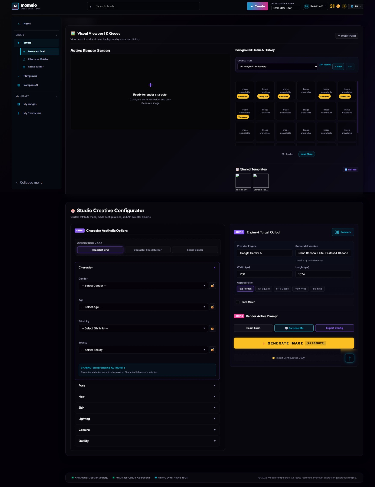

# UI-005 Studio Screen Rewamp and Visual Character Builder Parity

**Status:** Ready for validation - original Studio parity restoration  
**Phase:** React visual parity restoration  
**Primary route:** `/studio`  
**Related route:** `/studio?mode=character-sheet`  
**Runtime owner:** React application under `web/src/`

Engine CTA, role-sensitive prompt visibility, the React result viewer, and the
working Collection workflow continue in
`006-studio-engine-result-viewer-and-working-collection-parity.md`.

## 1. Purpose

Restore the complete guided Studio experience after the React migration. The
screen must recover the visual option images, guided attribute behavior,
reference handling, prompt preview, generation settings, credits, queue/history
context, comparison workflow, and result handoff that existed before migration,
while using the current React architecture and canonical server APIs.

This is not permission to revive the legacy Vanilla browser runtime. Legacy
files are parity evidence only.

## 2. Visual Reference

The primary and authoritative layout reference is:



`005-studio-screen-rewamp.png` is retained as design history only. Its
three-column builder and `Character / Style / Output` stage navigation are not
the target for this requirement.

Also apply:

- `requirements/Knowledge/ui-design-system-and-visual-language.md`
- `requirements/008-implement-adjusment-ui/001-logo-and-icon.png`
- `requirements/008-implement-adjusment-ui/001-reference-momelo-navigation-redesign-spec.md`

The original-screen reference and retained legacy markup/CSS define the
interaction model and information hierarchy. Current React APIs, security,
ownership, credit, localization, and accessibility contracts take precedence
over legacy implementation details.

## 3. Current Gap

The current React Studio:

- renders textual option cards rather than the existing illustrated assets;
- does not load the Headshot and Character Sheet manifest indexes;
- does not preserve the visual control types from the previous builder;
- replaced the proven two-band Studio composition with a nested three-column
  composition;
- has no compact recent-generation, queue, or shared-template context;
- limits visible visual choices and introduces a stage navigation layer that
  hides otherwise compatible categories;
- does not yet reach visual and functional parity with the pre-migration Studio.

The canonical generation, reference, comparison, credits, actor, and API
pipelines already exist in React and must be reused.

## 4. Business Requirement

### 4.1 User Goal

A non-technical user must be able to create a face or full Character by:

1. choosing a Studio mode;
2. selecting illustrated attributes without needing prompt knowledge;
3. reviewing the resulting prompt and reference inputs;
4. choosing an available provider/model/output configuration;
5. seeing the current credit estimate before generation;
6. generating or comparing models;
7. reviewing the output and continuing to Character Sheet or Scene Builder.

### 4.2 Product Outcome

- Visual selection must be faster to understand than dropdown-only authoring.
- Generated media remains the strongest element in the workspace.
- The same Studio selections must drive preview, estimate, and generation.
- Headshot output can continue to Character Sheet without losing compatible
  Face, Hair, Skin, or reference data.
- Character Sheet output can continue to Character Profile or Scene Builder.

## 5. Canonical Terminology and Routes

| UI label | Stable internal mode | Route |
|---|---|---|
| Face Creator | `headshot` | `/studio` |
| Character Sheet | `character-sheet` | `/studio?mode=character-sheet` |
| Scene Builder | `scene` | `/studio/scene` |

The mockup text `Headshot Grid` is not a requirement to rename the canonical
navigation label. `Face Creator` is the approved customer-facing label while
`headshot` remains the stable API mode.

## 6. Original Studio Layout Contract

### 6.1 Desktop

At wide desktop widths, restore the two vertically ordered workspace bands
shown in `005-original-screen.jpeg`.

1. **Visual Viewport & Queue**
   - one collapsible full-width section;
   - active render/result surface on the left;
   - actor-owned background queue and History on the right;
   - six recent image cells fit in one desktop row before pagination or
     overflow is needed;
   - compatible shared templates may appear beneath the queue/history list;
   - generation automatically scrolls this section into view.

2. **Studio Creative Configurator**
   - one full-width section beneath the viewport;
   - two-column pipeline on desktop;
   - Step 1 on the left contains Generation Mode, mode-specific controls, and
     all compatible guided attribute accordions;
   - Step 2 and Step 3 share the right column and contain Engine & Target
     Output, references, Live Prompt Preview, estimate, and Generate/Compare;
   - visual option rows expose six compact option cards when six or more
     options exist and desktop width is available;
   - full-body and outfit controls use the shared wrapping visual grid with a
     larger card-size variant.

The main page owns vertical scrolling. Nested scrolling is limited to
bounded queue/history lists; visual option fields wrap without horizontal
scrolling.

### 6.2 Intermediate Width

Between approximately `900px` and `1279px`, both bands remain full width.
Their internal two-column grids may stack when either the render or controls
would become difficult to inspect.

### 6.3 Mobile

- Render one column.
- Generation Mode remains immediately reachable.
- Accordions and wrapping visual grids remain keyboard/touch operable.
- Generation estimate and action remain near each other.
- Do not use independent fixed-height panel scrolling on mobile.
- No horizontal page scrolling is allowed.

### 6.4 Desktop Scrolling

The configurator columns must not become independently scrolling desktop
panels. Selecting an option must not move the user to another hidden stage.

## 7. Guided Workflow

### 7.1 Generation Mode Navigation

The Studio configurator uses one segmented Generation Mode control:

- **Face Creation** -> `/studio`
- **Character Sheet** -> `/studio?mode=character-sheet`
- **Scene Builder** -> `/studio/scene`

Do not render a second `Character / Style / Output` stage navigation. All
compatible categories for the active mode remain available in the Step 1
accordion list.

Changing Generation Mode updates the URL, active side-navigation child,
breadcrumb, category policy, references, prompt behavior, output actions, and
visual manifest source together.

### 7.2 Mode Switching

Switching modes must:

- preserve mode-compatible selections;
- remove incompatible selections from prompt, estimate, and payload;
- preserve a valid Headshot-to-Character handoff reference;
- reset mode-specific transient result/estimate state when required;
- never leak one actor's draft after actor switching.

### 7.3 Accordion Behavior

- Only one or a small intentional set of groups should be expanded at once on
  desktop to control vertical noise.
- The selected count is derived from the canonical selection map.
- A field containing visual assets renders a visual control.
- A field without visual assets renders its compatible text/select/custom
  control and must not disappear.

## 8. Visual Character Builder Asset Contract

### 8.1 Existing Runtime Sources

Headshot manifest index:

`client/assets/visual-character-builder/headshot-v1/manifest.index.json`

Character Sheet manifest index:

`client/assets/visual-character-builder/character-sheet-v1/manifest.index.json`

Individual manifests and image assets beneath those folders remain canonical
runtime visual assets.

### 8.2 Supported Visual Families

The first parity release must support:

**Face**

- Face Shape
- Eyes
- Eyebrows
- Nose
- Lips
- Expression

**Hair**

- Length
- Cut / Style
- Texture
- Parting / Fringe
- Color swatches

**Skin**

- Tone swatches
- Skin Texture swatches
- Makeup swatches
- Freckles swatches

**Character Sheet**

- gender-compatible Body Silhouette manifests;
- gender-compatible Outfit Base manifests;
- large wrapping-grid treatment for full-body/outfit assets.

Fields such as Smile, Finish, Camera, Lighting, Quality, and attributes without
manifest artwork remain available through compact non-image controls.

### 8.3 Manifest Runtime Schema

Create a Zod boundary for:

```text
VisualManifestIndex
- schemaVersion
- visualStyleVersion
- manifests[]
  - fieldId
  - manifestId
  - url

VisualManifest
- schemaVersion
- manifestId
- fieldId
- visualStyleVersion
- items[]
  - assetId
  - optionId
  - attributeId?
  - slug
  - focalPoint?
  - alt
  - swatch?
  - assets
    - thumb?
    - preview?
    - master?
```

Unknown optional metadata is tolerated. Missing required identity fields or
unsafe asset URLs reject only that manifest and fall back to a nonvisual field.

### 8.4 Attribute Resolution

The server `/api/attributes/bundle` remains canonical for selectable attribute
meaning and prompt text.

Manifest items resolve in this order:

1. explicit `attributeId`;
2. React visual registry mapping from `optionId` to attribute library ID;
3. exact matching `optionId` when the library uses that ID;
4. unresolved fallback, which is hidden and logged as a contract warning.

The mapping currently encoded in
`client/visual-controls/visualOptionControls.js` must be ported once into the
React-owned registry. React must not import that legacy IIFE or use
`window.ModelPromptForge*`.

After parity is validated, the React registry becomes the only browser runtime
mapping. The legacy file remains temporary migration evidence until its removal
gate.

### 8.5 Image Selection Behavior

- Every field retains one canonical compact dropdown containing all compatible
  options plus `Custom (Write-in)`. Visual cards are synchronized shortcuts,
  not the only way to reach an option.
- Options without artwork remain reachable through the dropdown and must not be
  rendered as an unbounded clipped chip row.
- Compact and large visual controls use the same shared wrapping-grid
  component. Body/outfit cards use a larger sizing variant but must remain
  visible without horizontal scrolling.
- Use `thumb` in compact cards and `preview` in large body/outfit cards.
- Apply manifest `focalPoint` through `object-position`.
- Preserve image aspect ratio without stretching.
- Selected cards show a Cyan border, check state, and readable label.
- A broken image falls back to the label without collapsing the control.
- Alt text uses active locale with English fallback.
- Cards are keyboard operable with correct selected semantics.

### 8.5.1 Custom Write-in and Field Lock

- Selecting `Custom (Write-in)` reveals a compact one-line input one control
  size below the main dropdown.
- Each field has a lock icon beside its dropdown.
- Locking a field preserves its current selection during `Surprise Me`.
- Locking does not prevent the user from manually changing that field.
- Lock state is actor-scoped, persisted with the Studio draft, and removed when
  Reset Form is used.
- Randomization preserves locked selections and randomizes only unlocked,
  mode-compatible fields.

### 8.6 Swatches

Color/texture swatches use manifest/registry color data, not generated images.
The selected swatch updates the same `AttributeSelection` contract used by
image cards and text controls.

## 9. Mode-Specific Rules

### 9.1 Face Creator

Visible groups:

- Character
- Face
- Hair
- Skin
- Lighting
- Camera
- Quality

Comparison is allowed when provider capabilities and credit estimation permit.
Completed output offers `Build Character`.

### 9.2 Character Sheet: Reusable Model

- Clothing and Outfit Reference controls are hidden.
- Clothing selections/references are removed from state, prompt, estimate, and
  generation payload.
- The canonical modest opaque fitted white casting outfit policy remains
  enforced by the prompt/server contract.
- Body Silhouette uses the active gender manifest variant.
- Completed output offers Character Profile creation and Scene Builder handoff.

### 9.3 Character Sheet: Styled Character

- Clothing controls are visible.
- Outfit Reference Front is allowed.
- Outfit Reference Back is optional and valid only with Front.
- When outfit references are active, only compatible customizations remain
  visible according to:
  - `010-005-clothing-reference-upload-and-ownership.md`
  - `010-005-001-outfit-reference-ui-and-customization-flow.md`
- Outfit references must reach estimate and generation through the canonical
  lightweight reference asset contract, never durable Base64 state.

## 10. Creative Workspace

### 10.1 Empty State

Before generation, show a stable canvas with:

- mode-appropriate silhouette/placeholder;
- concise `Ready to create` state;
- current aspect ratio;
- no fake generated result.

### 10.2 Prompt Preview

- Prompt preview is read-only in guided mode.
- It updates from canonical selections.
- Negative prompt is progressively disclosed.
- Preview text is secondary to the canvas but remains inspectable and copyable.
- Prompt cleanup and ordering remain owned by canonical compiler contracts.

### 10.3 Results

Reuse `GenerationResultSurface` behavior:

- queued/processing/completed/failed states;
- generated media;
- fullscreen/detail/download actions where permitted;
- comparison result ownership;
- cross-mode action buttons;
- scroll to active render after Generate.

### 10.4 Recent Generations

Load actor-scoped recent history through the existing History API.

- Show a compact horizontal strip, initially up to four items.
- Selecting an item opens its canonical History detail route or approved result
  viewer.
- `View all` goes to `/history`.
- Do not duplicate history persistence or leak another actor's images.

## 11. Generation Context

### 11.1 Shared Generation Pipeline

Do not create a second Studio generation pipeline.

Refactor the existing `GenerationExperience` only as needed into:

- one reusable generation controller/hook owning provider, references,
  comparison, estimates, submit, polling, and result state;
- composable presentational sections used by Studio and Playground;
- the existing canonical generation API functions.

Estimate and submission must use the same draft snapshot.

### 11.2 Engine and Output

Reuse `EngineTargetPanel` behavior:

- provider/model from public provider catalog;
- resolution only when supported;
- model-supported aspect ratios and reference capacity;
- comparison slots and enabled-slot credit total;
- no client-side pricing table.

Comparison keeps the established Studio card treatment and progressive-add
interaction:

- opening Comparison starts with one base model card;
- an adjacent dashed `+ Add model` card adds one model at a time;
- the user may add three cards after the base card, for four total;
- generation and comparison credit estimation remain disabled until at least
  two valid model cards exist;
- each added card has its own provider/model controls and can be removed;
- the last remaining base card cannot be removed;
- provider/model controls for normal generation are replaced by the comparison
  cards while Comparison is active, so the same engine is not shown twice;
- Studio and Playground consume the same `EngineTargetPanel` implementation.

### 11.3 References

Reuse `ReferenceSlotGrid` and canonical reference roles.

- Unsupported roles are hidden.
- Face Reference is not silently treated as Character Reference.
- Character Sheet mode includes outfit front/back rules.
- Existing reference ownership and upload asset contracts remain enforced.

### 11.4 Credit Estimate and Generate

- Current estimate appears before Generate.
- Estimate loading, stale, unavailable, insufficient, and ready states are
  explicit.
- Generate is disabled until the estimate matches the current provider, model,
  resolution, references, output count, and prompt.
- Comparison uses only enabled slot totals.

### 11.5 Queue and History Context

MVP right-column context may show:

- active actor-owned generation jobs already known to the React session;
- recent actor-owned completed/failed jobs from History;
- a link to full History.

Do not invent a global queue endpoint or expose jobs from another actor. Deep
queue observability is deferred.

### 11.6 Shared Templates

Show Shared Templates only when:

- the relevant feature exposure policy is enabled;
- a canonical Scene/Community template endpoint provides compatible data.

Otherwise hide the section. Do not render fabricated template cards merely to
match the mockup.

## 12. State and Persistence

Use a versioned, actor-scoped Studio draft:

```text
StudioDraftV2
- schemaVersion: 2
- actorId
- mode
- characterType
- expandedGroups[]
- selections
- references
- engineSelection
- comparisonEnabled
- comparisonSlots
- updatedAt
```

Rules:

- TanStack Query owns server state and manifest caching.
- Route/local React state owns transient UI state.
- Actor-scoped persistence owns restorable drafts.
- Large Base64 images are forbidden.
- Actor switching clears active result, estimate, references, selections, and
  incompatible Query cache before rendering the next actor.
- Migration from a compatible existing React draft is explicit and tested;
  legacy `window.state` is not read.

## 13. Reusable Component Design

Create or extend reusable components rather than placing the complete screen in
`StudioRoute.tsx` or duplicating it in `SceneBuilderRoute.tsx`.

Face Creation, Character Sheet, and Scene Builder render through the same
workspace composition component. Mode configuration supplies visible
attributes, authoring controls, reference roles, handoff actions, and manifest
source. The shared component owns the two-band layout only and must not fork the
generation or credit pipeline.

Suggested ownership:

```text
web/src/features/studio/
  api/
    visualManifestApi.ts
  schemas/
    visualManifestSchemas.ts
  visual-options/
    visualOptionRegistry.ts
    visualOptionResolver.ts
  hooks/
    useStudioDraft.ts
    useStudioVisualManifests.ts
  components/
    StudioModeSelector.tsx
    StudioConfiguratorActions.tsx
    StudioAttributePanel.tsx
    StudioRecentGenerations.tsx
  studioModePolicy.ts
  studioConfigFile.ts
  routes/
    StudioRoute.tsx

web/src/components/visual-options/
  VisualOptionPicker.tsx
  VisualImagePicker.tsx
  VisualSwatchPicker.tsx
  VisualOptionCarousel.tsx

web/src/components/generation/
  existing shared generation components
  StudioGenerationWorkspace.tsx
  extracted controller/composition modules only where required

web/src/styles/
  studio.css
```

Do not create a second Button, media viewer, engine panel, reference uploader,
comparison workspace, queue poller, or credit estimator.

## 14. Input, Process, Output

### Input

- attribute bundle;
- visual manifest indexes and manifests;
- actor context;
- actor-scoped draft;
- provider catalog;
- reference assets;
- history and optional compatible templates.

### Process

1. Validate attribute and manifest boundaries.
2. Resolve manifest options to canonical attributes.
3. Render mode-compatible controls.
4. Update one canonical selection map.
5. Compile preview from compatible selections.
6. Build one generation draft.
7. Request and display the matching estimate.
8. Submit through canonical generation/comparison API.
9. Poll and render result.
10. Invalidate actor History/Credits and expose cross-mode actions.

### Output

- canonical `GenerationRequestDraft`;
- matching locked credit estimate;
- generation job or comparison set;
- actor-owned History result;
- optional Headshot-to-Character or Character-to-Scene handoff.

## 15. Impact Analysis

### Expected Changes

- Studio route composition;
- visual option components;
- manifest loading and schemas;
- generation component composition;
- Studio-specific CSS and localization;
- actor-scoped Studio persistence;
- focused unit/component/E2E tests.

### Must Not Change

- provider adapters;
- server pricing policy;
- generation ownership rules;
- final server-side authorization;
- History ownership;
- Character Profile approval policy;
- public visual asset paths;
- Community behavior unrelated to Studio.

### Main Risks

1. Manifest option IDs resolving to the wrong attribute.
2. Preview and payload using different selection snapshots.
3. Duplicate estimate/generation state after component extraction.
4. Clothing references leaking into Reusable Model output.
5. stale actor draft or history crossing users.
6. nested layout changes reducing six visible choices to only three.
7. broken manifest image leaving an unusable field.

Each risk requires an automated contract test or explicit E2E scenario.

## 16. Implementation Plan

### Step 1: Freeze Parity Contracts

- inventory legacy visual field mappings;
- inventory current React generation/reference/credit contracts;
- add fixtures for Headshot and Character Sheet manifests;
- add expected option-to-attribute mappings for representative fields.

### Step 2: Manifest Foundation

- create Zod schemas and loader;
- load indexes and required manifests with TanStack Query;
- implement locale alt fallback and safe asset URL validation;
- add resilient per-manifest fallback.

### Step 3: Visual Option Components

- split image, swatch, and text renderers over one shared wrapping-grid
  primitive;
- preserve one `AttributeSelection` output contract;
- implement selected, disabled, loading, broken-image, and keyboard states.

### Step 4: Studio Draft and Mode Policy

- add actor-scoped `StudioDraftV2`;
- implement mode compatibility and stage derivation;
- enforce Reusable/Styled clothing and reference policy;
- verify actor-switch reset.

### Step 5: Generation Composition

- extract reusable controller logic from `GenerationExperience` only where
  necessary;
- preserve estimate/submit/polling behavior;
- expose composable Result, Prompt, Reference, Engine, Estimate, and Action
  regions;
- keep Playground behavior unchanged.

### Step 6: Original Screen Composition

- implement the responsive two-band Studio from `005-original-screen.jpeg`;
- remove the runtime stage filter and expose all compatible accordions;
- use one `StudioGenerationWorkspace` for all three Studio modes;
- add active render, six-item recent History/queue context, prompt preview,
  generation context, and supported shared templates;
- apply Momelo visual language.

### Step 7: Handoffs and Regression

- verify Build Character and Build Scene actions;
- verify Character Profile creation;
- verify Comparison and History detail navigation;
- verify reference and selection carry-over.

### Step 8: Observation and Legacy Removal Gate

- compare representative payloads against pre-migration behavior;
- observe at desktop/mobile and Thai/English;
- only then mark legacy visual IIFE/config as removable evidence.

## 17. Testing

### 17.1 Unit Tests

- manifest/index schema acceptance and rejection;
- option ID to attribute ID resolution;
- gender manifest variant selection;
- localized alt fallback;
- broken image/manifest fallback;
- stage completion derivation;
- mode-compatible selection filtering;
- Reusable Model clothing/reference stripping;
- Styled Character outfit front/back rules;
- draft migration and actor scoping.

### 17.2 Component Tests

- visual card selection and deselection;
- swatch selection;
- custom text fallback;
- accordion selected counts;
- mode switching;
- engine capability visibility;
- estimate and Generate disabled states;
- recent History actor isolation.

### 17.3 E2E Cases

1. Create a Face using illustrated Face Shape, Eyes, Lips, Hair, and Skin.
2. Confirm preview, estimate, and submitted payload contain those selections.
3. Complete generation and choose Build Character.
4. Confirm compatible attributes and reference arrive in Character Sheet.
5. Select Styled Character, Body Silhouette, Outfit Base, and outfit references.
6. Confirm outfit references reach the submitted generation payload.
7. Switch to Reusable Model and confirm all clothing controls/data disappear.
8. Run Comparison and confirm enabled-slot credit total and result workspace.
9. Switch actor and confirm draft, history strip, queue context, and references
   do not leak.
10. Verify desktop `1440x900`, intermediate tablet, and mobile `390x844`.

### 17.4 Visual Acceptance

- The screen is recognizably aligned with `005-original-screen.jpeg`.
- The desktop viewport/history row and compact visual option rows can expose
  six items without reducing them to three oversized cards.
- Face Creation, Character Sheet, and Scene Builder share the same two-band
  component and change side navigation and breadcrumb with the route.
- Illustrated attributes are visible and readable.
- The canvas/result remains the dominant area.
- No panel, label, option card, prompt, or action overlaps.
- Long Thai and English labels fit.
- Selected and inactive controls are distinguishable without color alone.
- Comparison active state restores the established yellow border and restrained
  glow shown in `005-original-screen.jpeg`.
- Step badges render resolved numbers such as `STEP 1`; interpolation tokens
  such as `{{number}}` must never appear in the UI.

## 18. Required Validation Commands

The implementing agent must ask the user to run:

```bat
npm run typecheck:web
npm run lint:web
npm run test:web
npm run build:web
npm run test:web:e2e
```

The requirement is not complete until functional parity, payload parity, actor
isolation, credit matching, and responsive visual checks pass.
