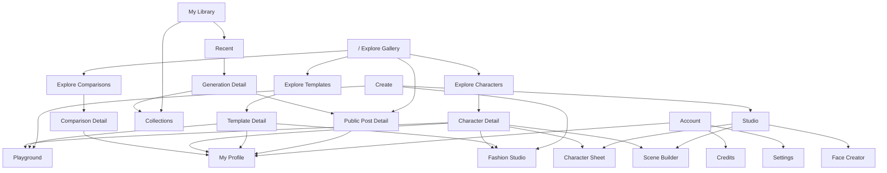

# UI-014 Global Route Inventory And Target Information Architecture

**Status:** Approved for route audit and design documentation  
**Depends on:** `001-reference-momelo-navigation-redesign-spec.md`  
**Required reading:** `../Knowledge/ui-design-system-and-visual-language.md`

## 1. Purpose

Momelo currently has working routes added by Community, Studio, Profile,
Template, Comparison, History, Collection and Fashion features at different
times. The application must present those capabilities through one predictable
mental model before more commercial routes are added.

This requirement owns the complete React route inventory and the target
information architecture. It does not move routes or change UI behavior; those
changes are sequenced in UI-015 through UI-019.

Do not infer the current route map from old requirements. Read the current React
router, route registry, navigation metadata, redirects, route-level links and
E2E tests.

## 2. Approved Product Model

```text
Explore     Find public work and reusable resources
Create      Start or continue an authoring workflow
My Library  Inspect and organize private actor-owned work
My Profile  Present published identity and manage it when owner
```

The root route `/` is Explore and renders the public Gallery. There is no
separate Home page and no duplicate Community landing route.

### 2.1 Primary menu

```text
Explore
  Gallery
  Comparisons
  Templates
  Characters

Create
  Playground
  Studio
    Face Creator
    Character Sheet
    Scene Builder
  Fashion Studio

My Library
  Recent
  Collections

Account
  My Profile
  Credits
  Settings
  Admin when authorized
```

Decisions:

- `Fashion Studio` is a direct Create destination because it is the featured
  beginner workflow, not another Studio configurator mode.
- `Comparisons` under Explore means published Comparison discovery and voting.
  Creating a Comparison begins from Playground or Studio comparison mode.
- Public Collections are discoverable from Gallery and Profile; they do not add
  another primary Explore menu item for MVP.
- `Recent` replaces the customer-facing name `My Images` while retaining the
  complete generation history capability.
- Use the correct product label `Characters`; do not introduce `Charactor` in
  routes, keys or visible copy.

## 3. Target Route Families

The audit may refine parameter names, but the target ownership is:

```text
Explore
  /
  /explore/comparisons
  /explore/templates
  /explore/characters

Create
  /create/playground
  /create/studio/face
  /create/studio/character
  /create/studio/scene
  /create/fashion

My Library
  /library/recent
  /library/recent/:generationId
  /library/collections
  /library/collections/:collectionId

Public resources
  /posts/:postId
  /templates/:templateId
  /characters/:characterId
  /comparisons/:comparisonId

Profile
  /me
  /profiles/:profileId
  /profiles/:profileId/works
  /profiles/:profileId/templates
  /profiles/:profileId/characters
  /profiles/:profileId/comparisons
  /profiles/:profileId/collections
```

`/me` resolves the active actor and redirects to the stable owner Profile route.
Profile identity uses an immutable ID as the canonical key. A mutable public
handle may be an alias later, but must not become authorization or durable
ownership identity.

## 4. Target Navigation Diagram



## 5. Required Current-State Inventory

Before implementation, produce a table with one row for every mounted React
route and redirect:

```text
current path
route owner/component
navigation source
actor/public/admin scope
resource type
incoming links
outgoing actions
current back behavior
target canonical path
redirect required
known inconsistency
```

Also search for hard-coded route strings outside the route registry. Classify
each as canonical link, contextual link, redirect, test fixture or stale path.

The inventory must include lazy routes, parameterized detail routes, fallback
routes, index routes, admin routes and routes reachable only from dialogs.

## 6. Flow Ownership

### 6.1 Public discovery

```text
Explore list
-> public detail
-> creator Profile or reusable action
-> destination authoring workflow
```

### 6.2 Private creation

```text
Create workflow
-> quote/generate
-> Recent
-> inspect/use/collect
-> optionally publish
-> Explore and Profile
```

### 6.3 Reuse

```text
Template or Character detail
-> validate permission and compatibility
-> choose or infer destination
-> create an actor-owned handoff
-> destination workflow
-> generated output with source lineage
```

### 6.4 Profile

```text
Public visitor -> published content and follow/share actions
Owner -> same presentation plus permission-aware management actions
Private drafts/history -> My Library, never leaked into Profile
```

## 7. Deliverables

1. Current React Route Mermaid diagram generated from inspected code.
2. Current route inventory table.
3. Target route Mermaid diagram updated with confirmed current resource IDs.
4. Current-to-target redirect matrix.
5. List of mismatched links, back behavior and duplicated route ownership.
6. Confirmed implementation order for UI-015 through UI-019.

## 8. Acceptance Criteria

- Every mounted React route and redirect appears in the inventory.
- `/` is the only canonical Explore/Gallery root.
- Public discovery, private work, creation and Profile have distinct ownership.
- No feature requires a user to understand internal names such as generation
  mode, template use session or comparison set.
- The target map preserves all working capabilities through canonical routes or
  explicit redirects.
- No source file is modified as part of the inventory-only step.

