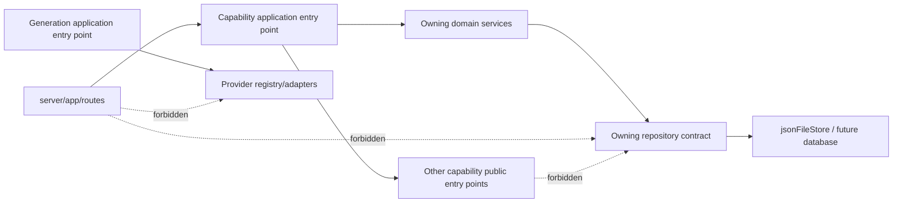
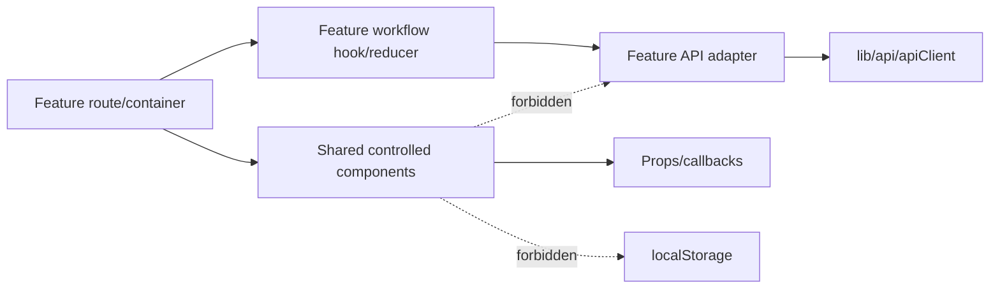

# Capability Ownership and Single Workflow Entry Points

**Status:** Active; high-risk Generation/Credit consolidation implemented,
incremental adoption continues  
**Scope:** React client, Express application, domain services, repositories,
providers, runtime data and cross-capability workflows  
**Purpose:** Keep ModelPromptForge understandable as commercial workflows grow

Performance ownership, budgets, cache/polling rules and the staged tuning plan
are defined separately in
`017-performance-ownership-observability-and-tuning.md`. Capability refactoring
must preserve those constraints.

## 1. Problem Statement

ModelPromptForge now contains generation, comparisons, references, reusable
Templates, Characters, Fashion Blueprint, Community, Collections, Credits and
support workflows. The project already groups much of its code by capability,
but several business operations are assembled independently by routes or
feature modules.

The primary risk is not identical copied functions. It is **workflow
duplication**: multiple callers perform similar sequences using shared services
in slightly different orders. Examples include estimate, reserve, compile,
enqueue, capture/refund and history persistence. This makes one workflow correct
while another silently omits a policy, lineage field or recovery step.

This requirement establishes two rules:

1. Every business capability has one documented owner.
2. Every material business workflow has one canonical application entry point.

One entry point does not mean one giant service. A capability may contain
multiple cohesive domain services and repositories. It means external callers
enter through one stable facade/use-case contract instead of assembling the
workflow or mutating its storage themselves.

## 2. Architecture Vocabulary

### 2.1 Capability owner

The capability owner contains the business rules for one bounded concern, such
as Credits, Generation or Character Profiles. It owns its invariants, mutation
ordering, error codes and persistence contracts.

### 2.2 Application entry point

An application entry point coordinates one complete use case. It may call
multiple services inside its capability and may invoke public entry points of
other capabilities. Routes and React features depend on this contract.

Recommended naming:

```text
<Capability>ApplicationService.js     server use-case facade
<Capability>Service.js                cohesive domain behavior
<Capability>Repository.js             persistence adapter
<capability>Api.ts                    React transport adapter
use<Workflow>.ts                      reusable React workflow orchestration
```

Existing names do not need mechanical renaming. The documented owner and public
contract matter more than the suffix.

### 2.3 Internal service

An internal service implements a part of a capability and is called through its
application entry point. Other capabilities must not import it merely to bypass
the owning workflow.

### 2.4 Shared infrastructure

Infrastructure such as the API client, JSON file store, actor-scoped storage,
provider registry and telemetry transports business data but does not own
business policy.

## 3. Dependency Direction

### 3.1 Server



Rules:

- Routes translate HTTP input/output and call an application entry point.
- Cross-capability calls use the target capability's public facade or contract.
- Only the owning capability mutates its repository.
- Providers are reachable only through the Generation-owned dispatch path,
  except provider catalog/configuration reads owned by the Provider Registry.
- Shared infrastructure must not acquire business rules to avoid circular
  ownership.

### 3.2 Client



Rules:

- Routes compose workflows; shared components render state and emit callbacks.
- Feature API modules own endpoint calls and Zod response parsing.
- `apiClient.ts` owns transport, actor header and common error translation, not
  feature policy.
- Server state uses TanStack Query with actor-scoped keys.
- Persisted user work uses `actorScopedStorage`; direct `localStorage` is
  permitted only for non-sensitive device UI preferences documented by owner.
- The same workflow reused by two routes moves to a feature hook/controller,
  not into a presentational component.

## 4. Current and Target Capability Map

| Capability | Current canonical paths | Canonical public entry point target | Current concern |
|---|---|---|---|
| Identity and Account | `server/middleware/actorContextMiddleware.js`, `server/domain/identity/`, `server/repositories/identity/`, `web/src/lib/auth/` | `IdentityApplicationService` or equivalent actor/account facade | Mock actor, account identity and Creator Profile responsibilities are related but not yet represented by one durable account contract. |
| Credits and Billing | `server/domain/credits/`, `server/repositories/credits/`, `web/src/features/credits/` | `CreditApplicationService` delegating to pricing/reservation/adjustment services | High-risk mutation callers now enter through the facade; broader read projections and future billing integration remain incremental. |
| Generation | `server/domain/generation/`, `server/repositories/generation/`, `server/providers/`, `web/src/features/generation/`, `web/src/components/generation/` | `GenerationApplicationService` with preview, submit, prepared-operation, status and lifecycle use cases | Standard, Comparison, Fashion and Pose Proxy now share submission/dispatch entry points; explicit cancel and durable recovery contracts remain future work. |
| Reference Processing | `server/domain/reference-processing/`, `server/config/reference-processing-policy.json`, `web/src/components/generation/` | `ReferenceProcessingService.processContext/preview` through a documented facade | Canonical processing exists; callers must not create parallel role ordering or authority rules. |
| Assets and Media | `server/domain/assets/`, `server/repositories/assets/`, `server/domain/generation/thumbnailService.js`, `web/src/components/media/` | `AssetApplicationService` / `ImagePresentationService` | Upload ownership, generated outputs, previews and thumbnails are split by lifecycle; contracts need one documented projection boundary. |
| Templates | `server/domain/templates/`, `server/repositories/templates/`, `web/src/features/templates/`, `web/src/components/templates/` | `TemplateCoreService` as canonical Template facade | Community publication and Scene Template compatibility must not create separate version/use-session rules. |
| Template Pose Proxy | `server/domain/template-pose-proxy/`, matching repository/data paths | `TemplatePoseProxyService` | Correctly separated as an internal artifact workflow; dispatch and Credits should enter through Generation/Credit facades. |
| Character Profiles | `server/domain/character-profiles/`, matching repository/data paths, `web/src/features/profiles/` | `CharacterProfileApplicationService` coordinating lifecycle, sharing and usage | Profile lifecycle, sharing, casting and usage are separate services; route callers need one use-case boundary. |
| Creator Profiles | `server/domain/community/CreatorProfileService.js`, `CreatorProfilePageService.js`, Community repositories, `web/src/features/profiles/` | `CreatorProfileApplicationService` or explicitly documented Community facade | Durable user/account settings and public Creator projection can be confused; ownership must remain explicit. |
| Community | `server/domain/community/`, `server/repositories/community/`, `web/src/features/community/` | Capability-specific Community facade(s) behind route registration | Many cohesive services are valid, but share/publication/access/moderation must expose named public use cases instead of direct repository calls. |
| Comparisons | `server/domain/comparisons/`, matching repository, `web/src/features/comparisons/`, `web/src/components/comparisons/` | `ComparisonApplicationService` / existing orchestrator after contract tightening | Comparison owns selection and result grouping, but Generation and Credit lifecycle should be delegated rather than duplicated. |
| Fashion Blueprint | `server/domain/fashion-blueprint/`, matching repository/data, `web/src/features/fashion-blueprint/` | `FashionBlueprintApplicationService` coordinating plan, quote, proof and run | Planning is correctly isolated; run execution currently assembles Generation and Credit sub-workflows itself. |
| Collections | `server/domain/collections/`, matching repository, `web/src/features/collections/` | `CollectionManager` after repository access is fully encapsulated | Keep membership/default-collection mutations behind one owner. |
| Prompt Composition | `server/domain/prompt-composer/`, generation prompt compiler, `web/src/features/prompt-composer/` | Prompt Composer proposes input; Generation compiler owns final prompt | Prevent Prompt Composer, Template and feature UIs from creating alternate final prompt pipelines. |
| Admin and Support | `server/domain/admin/`, `server/domain/audit/`, future observability domain, `web/src/features/admin/` | Role-gated Admin/Support application facade | Support Credit recovery and job repair must call owning capability APIs and record audit events. |

## 5. Canonical Business Workflow Entry Points

### 5.1 Standard generation

Target path:

```text
web/src/components/generation/GenerationExperience.tsx
  -> web/src/features/generation/application/useGenerationWorkflow.ts
  -> web/src/features/generation/api/generationApi.ts
  -> server/app/routes/generationRoutes.js
  -> server/domain/generation/GenerationApplicationService.js
       -> ReferenceProcessingService
       -> CreditApplicationService.validateAndReserveForRequest
       -> prompt compiler
       -> QueueManager.enqueue
```

`GenerationExperience` remains a reusable UI coordinator until the workflow
hook is extracted. It must not become a second server policy implementation.

### 5.2 Comparison generation

```text
Comparison route/component
  -> comparisonApi.ts
  -> comparisonRoutes.js
  -> ComparisonApplicationService
       -> ComparisonValidator
       -> GenerationApplicationService.submitPreparedOperation per slot
       -> CreditApplicationService.validateAndReserveForRequest
```

Comparison owns slot validation, grouping, synchronized review and winner state.
It does not own provider dispatch, Credit capture/refund or output persistence.

### 5.3 Fashion Blueprint

```text
FashionBlueprintRoute
  -> fashionBlueprintApi.ts
  -> fashionBlueprintRoutes.js
  -> FashionBlueprintApplicationService
       -> FashionBlueprintService.resolvePlan
       -> FashionQuoteService
       -> FashionRunService
       -> GenerationApplicationService.enqueueReservedOperation
       -> CreditApplicationService.reservePlan
```

Fashion owns product/batch semantics, proof flow, Template/Character selection,
model qualification and provider-specific Fashion prompt strategy. Generation
owns queue lifecycle and provider execution. Credits owns financial state.

### 5.4 Template Pose Proxy preparation

```text
Template management UI
  -> templatePoseProxyApi.ts
  -> templateRoutes.js
  -> TemplatePoseProxyService
       -> CreditApplicationService
       -> GenerationApplicationService.enqueueReservedOperation
       -> TemplatePoseProxyRepository
```

The internal artifact remains owner-only and must not appear in Recent,
Collections or public projections.

### 5.5 Credit lifecycle

```text
Estimate
  -> CreditApplicationService.estimate
Reserve
  -> CreditApplicationService.validateAndReserveForRequest/reservePlan
Provider completion
  -> CreditApplicationService.captureForJob
Failure/cancel/recovery
  -> CreditApplicationService.refundForJob/reconcileStartupOrphanReservations
Admin adjustment
  -> CreditApplicationService.adjust with audit
```

Target ownership paths:

```text
server/domain/credits/CreditApplicationService.js
server/domain/credits/CreditPricingPolicyService.js
server/domain/credits/CreditReservationService.js
server/domain/credits/CreditAdjustmentService.js
server/repositories/credits/
```

No route or foreign capability may call `CreditAccountRepository` mutations
directly. Read projections may be exposed by the facade without leaking storage
shape.

### 5.6 Identity and profile

```text
Actor middleware
  -> Identity application contract
  -> durable user/account identity
  -> permission projection

Creator public profile
  -> Creator Profile capability
  -> public projection only

Character profile
  -> Character Profile capability
  -> character lifecycle/usage permissions
```

User Account, Creator Profile and Character Profile are distinct concepts. They
may share identity references but must not persist conflicting copies of roles,
ownership or account status.

### 5.7 Community publication

```text
Share dialog
  -> community share API
  -> Community publication facade
       -> source capability authorization/projection
       -> immutable public snapshot
       -> CommunityPostRepository
```

Community never treats client-supplied source metadata as authoritative. It asks
the owning Template, Character, Comparison or Generation capability for an
authorized public projection.

## 6. Public Contract and Import Rules

Each capability must document a small public surface. Until package-level
exports are introduced, the application service itself is the public surface.

Allowed:

```js
import { creditApplicationService } from '../credits/CreditApplicationService.js';
```

Not allowed outside the Credit capability:

```js
import { creditAccountRepo } from '../../repositories/credits/CreditAccountRepository.js';
```

Additional rules:

- A repository import from another capability requires an explicit migration
  exception in this requirement with an owner and removal checkpoint.
- A provider adapter must not import Fashion, Template, Community or UI policy.
- Provider-specific prompt projection belongs to the owning generation product
  domain before transport dispatch.
- Shared React components must not import feature API modules.
- Feature routes must not reproduce pricing, permission, reference-authority or
  provider capability tables.
- A new workflow must extend an existing entry point before creating another
  manager/service with overlapping verbs.

## 7. Known Consolidation Candidates

The following are audit findings, not instructions for an immediate destructive
refactor:

1. `CreditManager`, `CreditReservationService`, `CreditAdjustmentService` and
   direct route/repository access need one application facade while preserving
   their focused internal responsibilities.
2. Standard Generation, Comparison, Fashion and Pose Proxy need a shared
   submission lifecycle for compile/enqueue/capture/refund/recovery.
3. `FashionBlueprintRoute.tsx` and `GenerationExperience.tsx` contain substantial
   workflow orchestration that should move incrementally into typed hooks and
   reducers.
4. Query keys are partly centralized in `web/src/lib/api/queryKeys.ts` and partly
   declared inline. Actor-owned server state should move to the central factory.
5. Browser persistence is partly actor-scoped and partly direct. Direct storage
   calls require classification as device preference or migration to
   `web/src/lib/persistence/`.
6. History, Recent Generations and reference pickers should consume one history
   projection and shared library component variants rather than separate data
   interpretations.
7. Account identity, public Creator Profile and Character Profile need explicit
   IDs and projection boundaries before production authentication is added.

## 8. Incremental Refactoring Plan

### Phase A: Inventory and enforcement

- Record every route-to-service and cross-capability import.
- Mark current public entry points without moving files.
- Add architecture tests or lint rules for forbidden repository/provider
  imports where practical.
- Add characterization tests around existing workflows before consolidation.

### Phase B: Credits

- Introduce `CreditApplicationService` as a facade over existing services.
- Move route and foreign-domain mutations behind it.
- Preserve estimate/reservation IDs, ledger format and idempotency behavior.
- Delete legacy facade methods only after all callers migrate.

### Phase C: Generation submission

- Introduce a typed prepared-generation/operation-plan contract.
- Centralize enqueue, routing snapshot, reservation linkage, terminal capture,
  refund and history lineage.
- Migrate Standard Generation first, then Comparison, Pose Proxy and Fashion.
- Keep product-specific prompt strategy in its owning capability.

### Phase D: Identity and profiles

- Define durable Account and Actor contracts independent of mock usernames.
- Keep Creator public projection and Character lifecycle separate.
- Move preference ownership and permission projection to documented APIs.

### Phase E: Client orchestration

- Extract feature workflow hooks/reducers from large route/components.
- Consolidate query-key factories and actor-switch invalidation.
- Reuse controlled UI components without embedding server mutations in them.

### Phase F: Remove alternate paths

- Search for direct repository, queue and provider calls outside owners.
- Remove compatibility methods only after callers and tests migrate.
- Update `requirements/099-technical-dept/000-master.md` when canonical paths
  change.

## 9. Change Gate for Future Work

Before implementing any feature, the agent/developer must answer:

1. Which capability owns this behavior?
2. What is its existing canonical application entry point?
3. Does another route or feature already perform the same workflow?
4. Is this a new business rule, transport adapter, persistence concern or UI
   presentation concern?
5. Does the change call a repository, queue or provider outside its owner?
6. Can the existing contract be extended without creating a parallel path?
7. Which characterization/regression test proves all callers retain behavior?

If ownership or entry point is unclear, update this requirement and the
technical-debt master before adding production code.

## 10. Acceptance Criteria

- Every server route maps to a documented capability owner.
- Every material mutation workflow has one documented application entry point.
- Foreign capabilities do not mutate another capability's repository.
- Provider execution has one Generation-owned dispatch path.
- Credit estimate/reserve/capture/refund rules have one Credit-owned facade.
- React shared components contain no hidden API, provider or persistence path.
- Actor-owned query and browser state cannot leak across users.
- Alternate migration paths have an owner, reason and deletion checkpoint.
- Architecture documentation changes in the same commit as any new capability
  or canonical path.

## 11. Manual Review Checklist

Use these paths when studying or reviewing architecture:

```text
AGENTS.md
requirements/099-technical-dept/000-master.md
requirements/009-migration-to-react/016-capability-ownership-and-single-workflow-entry-points.md
server/app/createApp.js
server/app/routes/
server/domain/
server/repositories/
server/providers/
web/src/app/
web/src/features/
web/src/components/
web/src/lib/
```

Useful read-only searches:

```powershell
rg -n "queueManager\.enqueue|generateImage\(" server
rg -n "CreditAccountRepository|creditAccountRepo" server
rg -n "repositories/" server/domain server/app/routes
rg -n "apiClient|useMutation|useQuery" web/src/features web/src/components
rg -n "localStorage|sessionStorage" web/src
```

These searches identify candidates for review; they do not prove a violation by
themselves. Tests, dependency injection and migration adapters may legitimately
reference lower-level contracts inside the owning capability.

## 12. Implementation Checkpoint - 2026-08-04

Implemented:

- introduced `CreditApplicationService` as the Credit capability facade;
- introduced `GenerationApplicationService` as the canonical preview,
  submission and prepared-operation entry point;
- migrated Standard Generation, Comparison, Fashion and Template Pose Proxy
  away from direct Queue submission and foreign Credit reservation imports;
- retained terminal Credit capture/refund in the Generation-owned Queue;
- centralized actor-aware query keys for Generation jobs, Comparisons, Fashion
  runs, Credit ledger and Template preparation;
- added architecture characterization tests and the inventory at
  `inventory/capability-boundaries/2026-08-04-entry-point-inventory.md`.

Deferred phases remain listed in that inventory. This checkpoint does not mark
Identity, Character Profiles, Community publication or all client orchestration
as consolidated.
