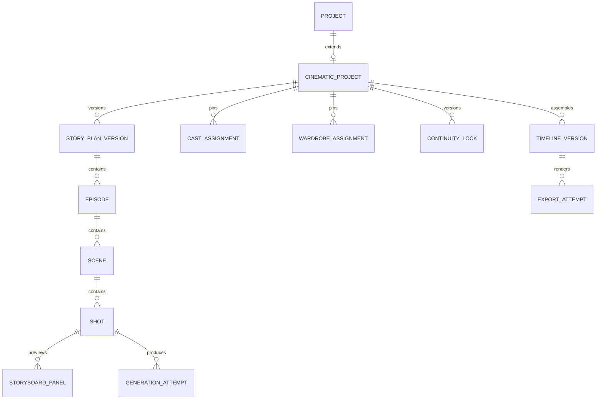

# Cinematic Project, Story, Shot And Continuity Contract

**Owner:** Cinematic Studio domain
**Primary role:** Cinematic Experience Director
**Reviewer:** Backend Platform Architect
**Skills:** `design-cinematic-experience`, `review-generative-media-pipeline`

## 1. Canonical Entry Point

Future implementation shall expose one `CinematicApplicationService` (name may
follow the final local convention) for project commands and queries. Routes are
thin; repositories persist Cinematic aggregates only. Character, Asset,
Reference, Generation, Credit and Support operations go through their public
facades.

## 2. Aggregate Hierarchy



Core identifiers remain stable opaque strings and are never array positions.

## 3. Minimum Records

### CinematicProject

- `id`, `projectId`, `ownerUserId`, `schemaVersion`, `version`;
- title, format, platform targets, aspect ratio, duration target;
- active stage and lifecycle status;
- active Story Plan/Continuity/Timeline version IDs;
- feature flags, created/updated timestamps and archived timestamp.

### CastAssignment

- project, Character Profile and pinned Character Version IDs;
- role, display label and story importance;
- canonical face/identity-pack readiness snapshot;
- reuse authorization evidence at assignment time;
- active/inactive state. It does not copy private reference bytes.

### WardrobeAssignment

- Character assignment and scene scope;
- mode: Character default, wardrobe preset or uploaded outfit;
- Asset/reference IDs and authority ordering;
- intentional change reason and lock state.

### StoryPlanVersion

- immutable version number and source brief;
- structured beats, episode/scene order and emotional arc;
- generation provenance and user edits;
- status: draft, proposed, approved, superseded.

### Scene

- story purpose, location, time, cast, wardrobe and emotional start/end;
- target duration, shot order and transition intent;
- environment/prop continuity state.

### Shot

- shot purpose and target duration;
- framing, camera angle/movement and lens intent;
- subject blocking, performance and gaze;
- lighting, environment, prop and audio intent;
- Character/wardrobe/reference bindings;
- dependency and transition from previous shot;
- approval and stale reason.

### ContinuityLock

- pinned Story Plan and Character/Wardrobe versions;
- per-scene location, time, weather, prop and screen-direction ledger;
- intentional exceptions;
- version and approval actor/time.

### GenerationAttempt

- operation, shot, attempt number and parent attempt;
- Generation Group/Job, quote/reservation and output Asset IDs;
- provider/model snapshot, structured prompt version and reference plan ID;
- status, error/support reference and review decision.

## 4. Project State Machine

```text
draft -> planning -> planned -> storyboard_ready -> production_ready
production_ready -> producing -> review -> finalizing -> completed
any non-terminal -> failed_recoverable | archived
```

- `failed_recoverable` is not a deletion state.
- Completed projects can create a new Timeline/Export version without changing
  approved source attempts.
- Upstream edits mark only dependent downstream records stale.

## 5. Shot State Machine

```text
draft -> storyboard_pending -> storyboard_ready -> locked
locked -> quoted -> queued -> processing
processing -> needs_review | failed | cancelled
needs_review -> approved | rejected
rejected -> quoted (new attempt)
```

An attempt is immutable after terminal settlement. A Shot points to the latest
attempt and separately to the approved attempt.

## 6. Continuity Rules

For each Shot, authority is resolved in this order:

1. explicit intentional per-shot override;
2. Scene continuity assignment;
3. project Character/Wardrobe/Series Bible baseline;
4. provider-safe inference for unspecified non-authoritative detail.

The continuity ledger must cover:

- Character identity, apparent age, body, hairstyle and visible condition;
- wardrobe item/version, damage/wetness and accessories;
- prop ownership, position and state;
- location, time, weather and lighting direction;
- screen direction, subject position and action carry-over;
- dialogue/performance emotion and audio ambience.

Missing optional detail may be inferred. Conflicting authoritative detail is a
blocking validation error, never silently averaged.

## 7. Story Planning Contract

The text planner returns validated structured data:

```text
project objective
logline
beats[]
scenes[]
characters per scene
continuity seeds
estimated duration and shot count
warnings
```

Planner output is untrusted provider data and must pass schema validation,
duration bounds, Character authorization and content policy. Invalid output may
be repaired once, then returns a stable planning error.

## 8. Series-lite

Series-lite adds a `SeriesBibleVersion` with premise, recurring cast, stable
wardrobe/locations, episode summaries and unresolved continuity facts. Every
episode is still a Cinematic Project production unit. No cross-episode media is
silently reused without Asset and rights validation.

## 9. Persistence And Performance

- Repository contracts support actor-scoped cursor pagination.
- Project summary queries do not load all prompts, attempts or media metadata.
- Storyboard and shot lists are paged or scene-bounded.
- Polling uses the canonical Generation group policy and terminal condition.
- Autosave is debounced and version-checked; conflicting writes return a
  recoverable version conflict.
- No Base64 media is persisted in project JSON/client state.

## 10. Contract Acceptance

- Every generated clip can be traced to Story Plan, Shot, Character Version,
  wardrobe source, reference plan, Generation Job and Credit reservation.
- Reordering shots does not change attempt identity.
- Replacing wardrobe marks only affected storyboard/attempts stale.
- Replay of the same command and idempotency key does not create duplicates.
- Cross-actor project, Character or media access is denied server-side.
