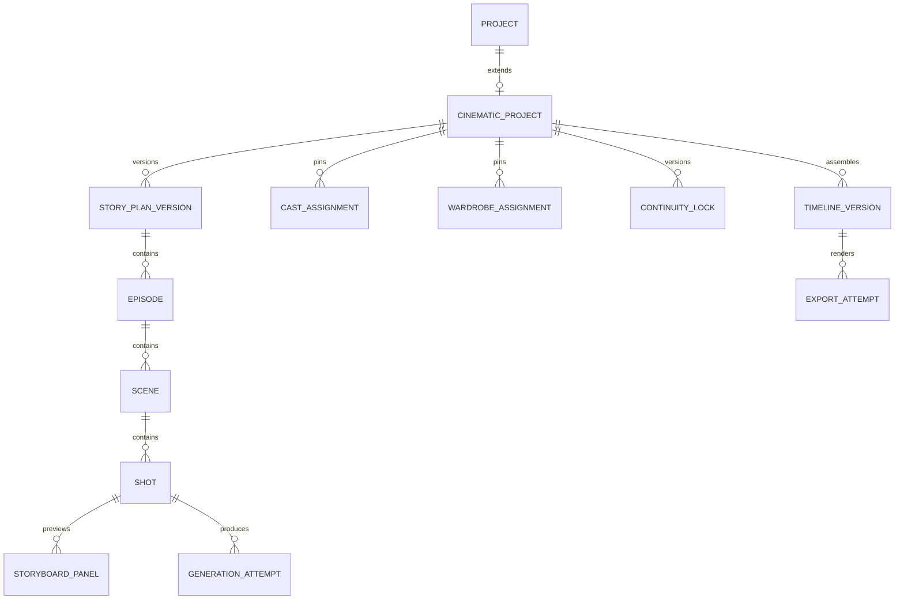

# Cinematic Project, Story, Shot And Continuity Contract

**Status:** MVP aggregate, owner-scoped repository, immutable Story sources,
pinned Cast, Character-owned Wardrobe Looks, versioned Scene/Shot/Storyboard
sources and Timeline foundation implemented on 2026-08-17. Series-lite remains
deferred behind the single-film launch gate.
**Owner:** Cinematic Studio domain
**Primary role:** Cinematic Experience Director
**Reviewer:** Backend Platform Architect
**Skills:** `design-cinematic-experience`, `review-generative-media-pipeline`

## 1. Canonical Entry Point

The implementation exposes one `CinematicApplicationService` for Project,
Cast, Wardrobe Look, Story, Scene, Shot, Storyboard source and Timeline commands
and queries. Routes are
thin; repositories persist Cinematic aggregates only. Character, Asset,
Reference, Generation, Credit and Support operations go through their public
facades.

## 2. Aggregate Hierarchy



Core identifiers remain stable opaque strings and are never array positions.

## 3. Minimum Records

### CinematicProject

- `id`, `projectId`, `ownerUserId`, `schemaVersion`, `version`;
- title, format, platform targets, aspect ratio, duration target;
- active stage and lifecycle status;
- active Story Plan/Continuity/Timeline version IDs;
- feature flags, created/updated timestamps and archived timestamp.

### CastAssignment

Setup stores `castPlanningMode` and zero to four `storyRoleSlots`. A role slot
contains stable ID, label, required/optional importance, dramatic function and
relationship hint. It never stores a Character Profile ID. `CastAssignment`
is the separate Project-owned binding through stable `storyRoleSlotId` between one slot and one pinned approved
Character Profile Version, preserving a clean distinction between story design
and casting.

- project, Character Profile and pinned Character Version IDs;
- role, display label and story importance;
- project-local dossier version with dramatic function, objective, motivation,
  pressure/fear, personality traits, emotional baseline, relationships,
  dialogue/voice behavior and physical performance notes;
- canonical face/identity-pack readiness snapshot;
- reuse authorization evidence at assignment time;
- active/inactive state. It does not copy private reference bytes.

### WardrobeAssignment

- Character assignment, reusable Character Look ID, immutable Look Version ID
  and Scene scope; an outfit cannot exist as an unassigned Project wardrobe
  record;
- mode/source summary projected from the authorized Character Look Version;
- binding-time authorization evidence, continuity lock, intentional change
  reason and stale-dependency state;
- no copied private garment bytes or mutable latest-Look pointer.

The Character Look aggregate, its three-view Assets, approval, rights and
version lifecycle are owned by Character Profiles under Requirement 013.
Cinematic owns only the binding and downstream continuity effects.

### CharacterDossierVersion

- project and Cast Assignment IDs, immutable dossier version and status;
- display name and story role separate from reusable Profile metadata;
- objective, motivation, pressure/fear, personality traits and emotional state;
- relationship edges to other Cast Assignments;
- dialogue/voice and physical-performance direction;
- pinned Character Version, apparent-age range and identity readiness snapshot;
- active Look IDs, Scene commitments and continuity warnings;
- source: manual, generated proposal or accepted revision, with provenance.

AI proposals never mutate the reusable Character Profile or become active until
the creator applies them. Story/Scene/Shot versions pin the dossier version they
consumed so later edits can mark only dependent work stale.

### StoryPlanVersion

- immutable version number and source brief;
- structured beats, episode/scene order and emotional arc;
- generation provenance and user edits;
- status: draft, proposed, approved, superseded.

### StorySourceVersion

- original Story Brief and optional Creative Direction;
- optional enhanced premise, conflict, emotional arc, ending and candidate
  Scene structure;
- recommended role slots and provider/model provenance when enhancement
  proposed the Cast structure;
- source operation/quote/Job identifiers when AI enhancement was used;
- explicit applied/discarded status and parent source version;
- immutable fingerprint consumed by the Story Plan version.

### Scene

- story purpose, location, time, cast, wardrobe and emotional start/end;
- target duration, shot order and transition intent;
- derived Scene duration in milliseconds, equal to the sum of non-removed Shot
  target durations; it is read-model data and is never independently edited;
- environment/prop continuity state.

### Shot

- shot purpose and target duration;
- target duration is stored in milliseconds, displayed in seconds with one
  decimal when needed, and remains a cost-bearing input for video generation;
- framing, camera angle/movement and lens intent;
- subject blocking, performance and gaze;
- lighting, environment, prop and audio intent;
- Character/wardrobe/reference bindings;
- dependency and transition from previous shot;
- approved Storyboard Asset ID, immutable Storyboard Asset Version ID,
  Storyboard attempt ID and source fingerprint; these fields are absent until a
  specific result is approved and never point at a mutable latest thumbnail;
- approval and stale reason.

### ContinuityLock

- pinned Story Plan and Character/Wardrobe versions;
- per-scene location, time, weather, prop and screen-direction ledger;
- intentional exceptions;
- version and approval actor/time.

### GenerationAttempt

- operation, shot, attempt number and parent attempt;
- Generation Group/Job, quote/reservation and output Asset IDs;
- provider/model snapshot, structured prompt version and reference plan ID;
- for video operations, the exact approved Storyboard Asset Version ID and
  source fingerprint consumed as the image-to-video or first-frame authority;
- status, error/support reference and review decision.

### DownstreamSourceStatus

Video attempts and timeline/export entries that depend on a Storyboard source
expose one derived status:

```text
current | source_changed | source_unavailable
```

- `current` means the consumed Storyboard Asset Version still equals the Shot's
  approved source.
- `source_changed` means another Storyboard Asset Version is now approved.
- `source_unavailable` means authorization or durable Asset validation fails;
  it is a blocking integrity state and never falls back to another image.

## 4. Project State Machine

```text
draft -> planning -> planned -> storyboard_ready -> production_ready
production_ready -> producing -> review -> finalizing -> completed
completed -> series_proposed (optional, without reopening the completed film)
any non-terminal -> failed_recoverable | archived
```

- `failed_recoverable` is not a deletion state.
- Completed projects can create a new Timeline/Export version without changing
  approved source attempts.
- Completing creates a final Project cost-statement reference and prevents new
  generation. It does not delete source versions, attempts or Assets.
- Upstream edits mark only dependent downstream records stale.

## 5. Shot State Machine

```text
draft -> storyboard_pending -> storyboard_ready -> locked
locked -> quoted -> queued -> processing
processing -> needs_review | failed | cancelled
needs_review -> approved | rejected
rejected -> quoted (new attempt)
```

An attempt is immutable after terminal settlement. A Shot points to the latest
attempt and separately to the approved attempt.

Approving a replacement Storyboard Asset Version is a versioned Shot command.
It does not mutate or delete a terminal video attempt. It clears the Shot's
current approved-video pointer when that pointer consumed the previous source,
marks affected video attempts and timeline/export dependencies
`source_changed`, invalidates outstanding quotes for those dependencies and
requires explicit regeneration/reapproval. Unrelated Shots remain unchanged.

### Storyboard source command contract

The Cinematic application facade owns these use cases:

```text
approveStoryboardSource(
  projectId,
  shotId,
  storyboardAttemptId,
  assetVersionId,
  expectedShotVersion,
  idempotencyKey
)

getProduceShotContext(projectId, sceneId, shotId)
```

`approveStoryboardSource` atomically verifies actor ownership, Project state,
Shot membership, terminal successful Storyboard attempt, Asset/version
provenance and optimistic Shot version. It then pins the source, derives stale
downstream records, clears an incompatible current-video pointer and emits one
auditable source-change event. Replaying the idempotency key returns the same
result. A conflict returns current source/version data for safe refresh; it does
not silently overwrite another tab's approval.

`getProduceShotContext` returns the approved source DTO, current/stale video
attempt summaries, timeline dependency status, generation eligibility and
stable recovery reason. It exposes authorized media presentation only and does
not include raw private prompt or provider payload data.

## 6. Continuity Rules

For each Shot, authority is resolved in this order:

1. explicit intentional per-shot override;
2. Scene continuity assignment;
3. project Character/Wardrobe/Series Bible baseline;
4. provider-safe inference for unspecified non-authoritative detail.

The continuity ledger must cover:

- Character identity, apparent age, body, hairstyle and visible condition;
- wardrobe item/version, damage/wetness and accessories;
- prop ownership, position and state;
- location, time, weather and lighting direction;
- screen direction, subject position and action carry-over;
- dialogue/performance emotion and audio ambience.

Missing optional detail may be inferred. Conflicting authoritative detail is a
blocking validation error, never silently averaged.

## 7. Story Planning Contract

The accepted `StorySourceVersion` is the only planning input. AI enhancement is
optional and cannot silently replace the owner's original brief. Applying an
enhancement creates a new source version; discard leaves the current source
unchanged.

The text planner returns validated structured data:

```text
project objective
logline
beats[]
scenes[]
characters per scene
continuity seeds
estimated duration and shot count
warnings
```

Planner output is untrusted provider data and must pass schema validation,
duration bounds, Character authorization and content policy. Invalid output may
be repaired once, then returns a stable planning error.

## 8. Series-lite

Series-lite adds a `SeriesBibleVersion` with premise, recurring cast, stable
wardrobe/locations, episode summaries and unresolved continuity facts. Every
episode is still a Cinematic Project production unit. No cross-episode media is
silently reused without Asset and rights validation.

`Continue as Series` is offered only after a completed Project has an approved
Story Plan and continuity baseline. It creates a reviewable proposal, not a
Series automatically. The proposal cites exact source Project, Character,
wardrobe, visual-language and continuity versions. It has no Credit side effect
until a separately quoted AI planning operation is confirmed.

## 9. Persistence And Performance

- Repository contracts support actor-scoped cursor pagination.
- Project summary queries do not load all prompts, attempts or media metadata.
- Storyboard and shot lists are paged or scene-bounded.
- Reordering a Shot changes stable order keys, never Shot IDs, attempts, Assets
  or ledger history. Scene and Project duration projections reconcile after
  every ordering or duration mutation.
- Polling uses the canonical Generation group policy and terminal condition.
- Autosave is debounced and version-checked; conflicting writes return a
  recoverable version conflict.
- No Base64 media is persisted in project JSON/client state.

## 10. Contract Acceptance

- Every generated clip can be traced to Story Plan, Shot, Character Version,
  wardrobe source, approved Storyboard Asset Version, reference plan,
  Generation Job and Credit reservation.
- Produce rejects generation when the submitted Storyboard source is missing,
  unapproved or differs from the immutable source in the accepted quote.
- Replacing an approved Storyboard source preserves historical clips and
  settlement while preventing stale clips from entering a new export.
- Reordering shots does not change attempt identity.
- Replacing wardrobe marks only affected storyboard/attempts stale.
- Reassigning an outfit to another Character is a new Look/version operation;
  it must not silently move the existing authority binding.
- Replay of the same command and idempotency key does not create duplicates.
- Cross-actor project, Character or media access is denied server-side.
