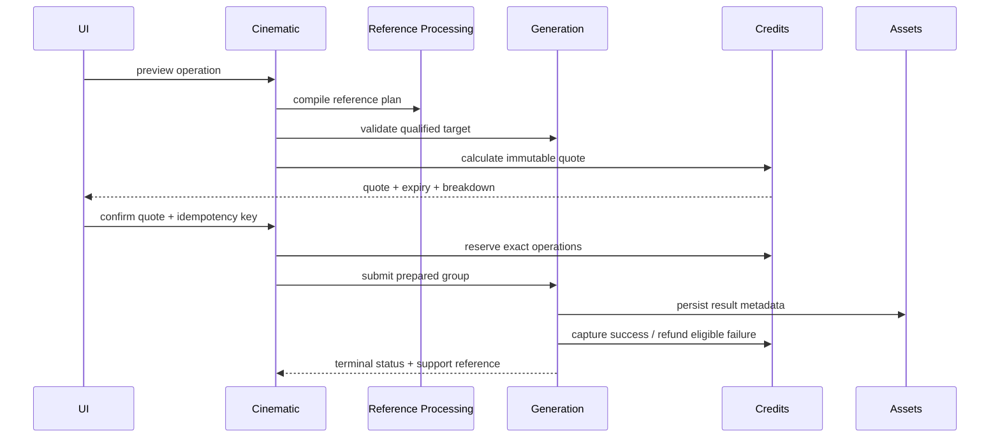

# Cinematic Generation, Credit And Media Contract

**Status:** Provider-neutral capability validation, research task lifecycle,
durable Storyboard/video Asset adoption and pricing calculation foundations are
implemented. Customer-paid quote/reserve/capture/refund orchestration and live
video dispatch remain launch-blocked pending qualification and Credits-owner
integration.
**Owners:** Cinematic Studio orchestration, Generation, Credits, Assets
**Primary role:** Backend Platform Architect
**Reviewers:** Commercial Financial Integrity, QA And Release Engineer
**Skills:** `implement-generation-workflow`, `review-commercial-integrity`

Provider-specific rate cards, parameterized video Credit formulas and adapter
constraints are owned by:

- `../020-generation-providers/video/001-video-provider-pricing-and-credit-model.md`;
- `../020-generation-providers/video/002-video-generation-provider-contract.md`;
- `../020-generation-providers/video/003-gemini-omni-flash-interactions-provider.md`.

When those documents are more specific about video billing or provider
capability, they extend this provider-independent contract without changing its
ownership boundaries.

## 1. Operations

Provider-independent operation names:

- `cinematic_story_enhancement` - optional structured Story source proposal;
- `cinematic_story_plan` - structured text plan;
- `cinematic_scene_direction` - expand or rewrite one director-ready Scene;
- `cinematic_wardrobe_suggestion` - optional wardrobe proposal;
- `cinematic_wardrobe_analysis` - optional uploaded-reference analysis;
- `cinematic_storyboard_still` - one or more still panels;
- `cinematic_motion_preview` - optional low-cost preview;
- `cinematic_draft_clip` - review-quality video;
- `cinematic_final_clip` - final shot video;
- `cinematic_audio` - optional music/voice operation;
- `cinematic_final_assembly` - timeline render/export.

The provider catalog qualifies models per operation, reference capability,
duration, aspect ratio, audio support and quality tier. The UI never maintains a
parallel model table.

## 2. Submission Flow



Cinematic does not call a provider, mutate Queue state, calculate model price or
write a Credit ledger directly.

The current development qualification path may execute
`cinematic_story_enhancement` through Generation's text-provider boundary with
`billingStatus=qualification_no_charge`. It must be separately env-gated and
must not display, reserve or capture a made-up Credit amount. Paid launch still
requires the canonical Credits text-operation quote and durable settlement
flow described below.

The implementation extends `CreditApplicationService` and its existing pricing
policy/version contracts with video operation metrics. It must not create a
`CinematicCreditService`, client-side formula or Cinematic balance store.

## 3. Quote Contract

Every quote snapshots:

- project, Story Plan/Shot/Timeline version;
- operation and output count;
- provider/model/routing mode and quality;
- duration, resolution/aspect ratio and audio setting;
- for Produce, the approved Storyboard Asset Version ID and source fingerprint;
- reference count/plan fingerprint;
- per-operation Credits, total Credits, policy version and expiry;
- creator/template usage amounts if introduced later.

Draft and final clips are separate operations. Previously spent Credits are
shown as history and never included again in the next charge.

The React estimate/confirmation presentation is shared with existing
Generation consumers. If extraction is required, create one typed quote-summary
component under the shared Credit/Generation UI owner and adapt image, Fashion
and Cinematic DTOs without changing their calculation contracts. Cinematic may
add Shot/project grouping, but not duplicate insufficient-Credit, expiry,
refresh or confirmation behavior.

### 3.1 Stage-specific presentation

One financial lifecycle is presented through operation-specific configuration:

| Stage | Billable operation | Not billable |
|---|---|---|
| Setup | Story enhancement | writing, editing, compare, apply/discard |
| Cast | AI wardrobe suggestion/analysis/concept generation and three-view Character Look attempts | browse, filter, upload, existing-asset assignment and Look approval |
| Story Plan | generate plan, expand/rewrite one Scene | manual edit, reorder, split/merge, approve |
| Storyboard | still generation/regeneration by Shot or selected batch | prompt editing, reset default, compare, approve |
| Produce | motion preview, draft/final video attempt | playback, compare, approve/reject |
| Finish | server assembly/export when processing is required | browser arrangement and trim |

Every billable action uses the same sequence:

```text
estimate -> exact quote -> explicit consent -> reserve -> dispatch
-> durable terminal result -> capture or eligible refund -> reconciliation
```

The UI must not show the video `Engine & Target Output` during Setup or ordinary
Cast editing. It uses a contextual operation dock describing the actual text,
analysis, image, video or export operation. Provider/model controls appear only
when the operation permits user selection; otherwise routing policy and quality
tier are summarized without exposing unsupported controls.

### 3.2 Project cost read model

Credits owns an authorized Project cost projection derived from immutable quote
and ledger records. The compact summary exposes:

- captured/spent Credits;
- active reserved/processing Credits;
- current next-action estimate, excluded from spend;
- refunded Credits and net captured total;
- grouped drill-down by Stage, Scene, Shot, attempt and operation;
- safe quote, Job, settlement and support references.

This is a read model, never a Cinematic-maintained running total. Refresh,
restart, retry and actor switching must reconstruct the same result. Completing
a Project records a final statement snapshot that remains reconcilable against
the ledger; continuing as a Series starts a separate Project/Series cost scope.

## 4. Reservation And Settlement

- Reserve one allocation per Shot/operation so partial batches settle safely.
- `Generate eligible set` first creates one immutable aggregate quote whose
  children preserve a per-Shot price/input fingerprint. Confirmation displays
  both the aggregate total and inspectable child breakdown; the aggregate is
  never calculated by summing mutable client values.
- Batch scope is snapshotted at quote time. Newly eligible Shots, approved
  Shots, already-active Shots and changed prompts cannot silently enter the
  accepted batch.
- Text/Scene/Wardrobe operations without a Shot reserve one allocation per
  immutable source version and operation key.
- Character Look generation is quoted against the exact Character Version,
  wardrobe-source fingerprint, provider/model, output set and effective
  reference plan. Approval creates a Character-owned Look Version and does not
  charge again. See Requirement 013.
- Capture only when the operation reaches the defined successful terminal
  boundary and durable result metadata exists.
- Refund an unconsumed reservation on provider failure, cancellation before
  dispatch or enqueue failure.
- A rejected but technically successful clip is not automatically refunded;
  product compensation policy is separate and audited.
- Retrying with the same idempotency key returns the same group/settlement.
- Reconciliation detects reserved jobs with no active/durable operation.

## 5. Reference Plan

Each operation declares named authorities rather than relying on image order:

- Character identity/canonical face;
- body and temporal appearance;
- wardrobe/product;
- scene/environment;
- pose/blocking or previous-frame continuity;
- optional previous approved shot frame.

Reference Processing resolves provider ordering and limits. Unsupported
authority combinations block before Credit reservation.

## 6. Media And Attempt Rules

- Outputs are Asset records linked to owner, Generation Job, mime type,
  dimensions/duration, checksum and storage key.
- Storyboard images, drafts, finals and exports have distinct media roles.
- A video Generation request resolves its source through the Shot's approved
  Storyboard Asset Version. It must not resolve from the latest Storyboard Job,
  thumbnail URL, client-selected image URL or an unapproved attempt.
- The accepted video quote, prepared reference plan, Generation Job and output
  Asset provenance all retain the same Storyboard source version/fingerprint.
- The project stores identifiers, not signed URLs; URLs are resolved at access
  time.
- Private input references never become public through export metadata.
- Thumbnails/posters are derived Assets with provenance and bounded cache rules.
- Failed/abandoned temporary provider files follow retention policy.

## 7. Queue And Recovery

- A multi-shot request creates a Generation Group with stable child Jobs.
- Group progress derives from child states and stops at terminal completion,
  failure, cancellation or partial completion.
- Process restart must recover accepted Jobs from durable orchestration before
  production launch; process-local Queue is not sufficient.
- Failed operations expose stable code, retry eligibility and support reference.
- Support recovery uses the canonical diagnostic/recovery command contract and
  never edits project, Job or Credit storage manually.

## 8. Prompt And Provider Contract

- Cinematic compiles structured story/shot/continuity input into a provider-
  independent execution request.
- Provider adapters translate that request without changing authority.
- Gemini Omni follow-up editing creates a new immutable Shot attempt. Its
  `previous_interaction_id` is provider metadata and never replaces the
  approved Storyboard Asset Version, Shot attempt chain or continuity version
  as Cinematic authority.
- Raw private prompts are excluded from standard logs.
- Prompt/schema/reference-policy versions and safe fingerprints are retained for
  diagnosis.
- Provider qualification uses identity, wardrobe, scene, motion, temporal
  continuity, anatomy, commercial quality, error rate, latency and cost.

## 9. Financial And Abuse Cases

- quote expires after model price or Shot inputs change;
- quote expires when source Story/Scene/prompt, provider, output count or any
  other cost-bearing operation input changes;
- a Produce quote expires immediately when its approved Storyboard Asset
  Version changes, even when provider/model/duration remain identical;
- two browser tabs cannot reserve the same operation twice;
- insufficient Credits opens the shared top-up flow and preserves the draft;
- partial batch settles successful children and refunds eligible failed ones;
- an all-set retry defaults to failed/retryable children and never charges
  completed children again;
- actor cannot submit a quote belonging to another actor/project;
- Support adjustment requires case, reason, evidence, authorization and
  idempotency;
- final export retry does not charge twice when the first result exists.

## 10. Acceptance

- Displayed quote and submitted request fingerprints match.
- Every terminal child has exactly one financial terminal outcome.
- Result media is owner-authorized and traceable after restart.
- Unsupported models/references fail before reservation.
- Missing, unauthorized, unapproved or stale Storyboard source versions fail
  before Credit reservation with a stable recovery code.
- Partial completion is visible and usable.
- Reconciliation can explain project spend as the sum of immutable ledger
  entries by operation and Shot.
- Project cost summary equals the ledger projection and never includes an
  unconfirmed estimate in captured spend.

### Stable Storyboard source errors

```text
cinematic_storyboard_source_required
cinematic_storyboard_source_not_approved
cinematic_storyboard_source_changed
cinematic_storyboard_source_unavailable
```

- `required` and `not_approved` route the user to the same Shot in Storyboard.
- `changed` refreshes Produce context and requires a new quote; it never retries
  the stale request automatically.
- `unavailable` blocks dispatch and exposes a sanitized Support reference.
- None of these errors captures Credits. Any earlier active reservation follows
  the canonical release/reconciliation policy rather than a Cinematic-local
  refund mutation.
- Existing image and Fashion estimates remain unchanged after video rate
  metrics are introduced.
- The same server quote drives displayed Credits, reservation and settlement;
  no Cinematic client formula participates in consent.
