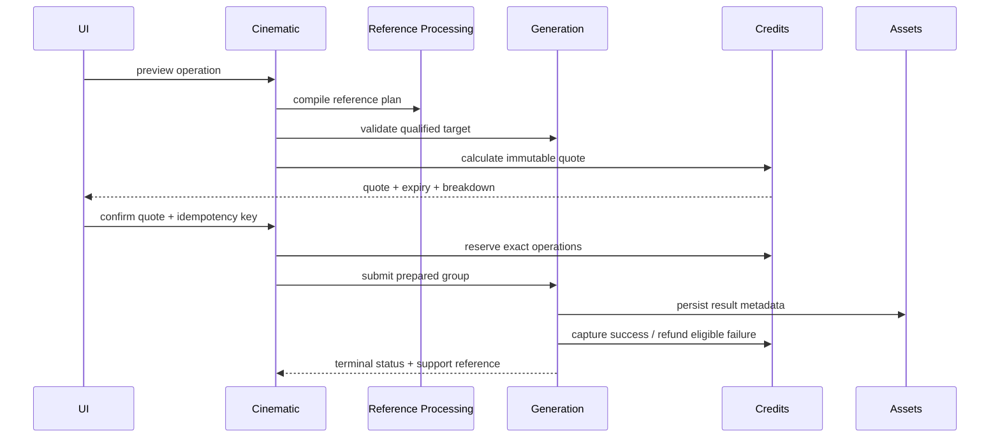

# Cinematic Generation, Credit And Media Contract

**Owners:** Cinematic Studio orchestration, Generation, Credits, Assets
**Primary role:** Backend Platform Architect
**Reviewers:** Commercial Financial Integrity, QA And Release Engineer
**Skills:** `implement-generation-workflow`, `review-commercial-integrity`

Provider-specific rate cards, parameterized video Credit formulas and adapter
constraints are owned by:

- `005-video-provider-pricing-and-credit-model.md`;
- `006-video-generation-provider-contract.md`.

When those documents are more specific about video billing or provider
capability, they extend this provider-independent contract without changing its
ownership boundaries.

## 1. Operations

Provider-independent operation names:

- `cinematic_story_plan` - structured text plan;
- `cinematic_storyboard_still` - one or more still panels;
- `cinematic_motion_preview` - optional low-cost preview;
- `cinematic_draft_clip` - review-quality video;
- `cinematic_final_clip` - final shot video;
- `cinematic_audio` - optional music/voice operation;
- `cinematic_final_assembly` - timeline render/export.

The provider catalog qualifies models per operation, reference capability,
duration, aspect ratio, audio support and quality tier. The UI never maintains a
parallel model table.

## 2. Submission Flow

Cinematic does not call a provider, mutate Queue state, calculate model price or
write a Credit ledger directly.

The implementation extends `CreditApplicationService` and its existing pricing
policy/version contracts with video operation metrics. It must not create a
`CinematicCreditService`, client-side formula or Cinematic balance store.

## 3. Quote Contract

Every quote snapshots:

- project, Story Plan/Shot/Timeline version;
- operation and output count;
- provider/model/routing mode and quality;
- duration, resolution/aspect ratio and audio setting;
- reference count/plan fingerprint;
- per-operation Credits, total Credits, policy version and expiry;
- creator/template usage amounts if introduced later.

Draft and final clips are separate operations. Previously spent Credits are
shown as history and never included again in the next charge.

The React estimate/confirmation presentation is shared with existing
Generation consumers. If extraction is required, create one typed quote-summary
component under the shared Credit/Generation UI owner and adapt image, Fashion
and Cinematic DTOs without changing their calculation contracts. Cinematic may
add Shot/project grouping, but not duplicate insufficient-Credit, expiry,
refresh or confirmation behavior.

## 4. Reservation And Settlement

- Reserve one allocation per Shot/operation so partial batches settle safely.
- Capture only when the operation reaches the defined successful terminal
  boundary and durable result metadata exists.
- Refund an unconsumed reservation on provider failure, cancellation before
  dispatch or enqueue failure.
- A rejected but technically successful clip is not automatically refunded;
  product compensation policy is separate and audited.
- Retrying with the same idempotency key returns the same group/settlement.
- Reconciliation detects reserved jobs with no active/durable operation.

## 5. Reference Plan

Each operation declares named authorities rather than relying on image order:

- Character identity/canonical face;
- body and temporal appearance;
- wardrobe/product;
- scene/environment;
- pose/blocking or previous-frame continuity;
- optional previous approved shot frame.

Reference Processing resolves provider ordering and limits. Unsupported
authority combinations block before Credit reservation.

## 6. Media And Attempt Rules

- Outputs are Asset records linked to owner, Generation Job, mime type,
  dimensions/duration, checksum and storage key.
- Storyboard images, drafts, finals and exports have distinct media roles.
- The project stores identifiers, not signed URLs; URLs are resolved at access
  time.
- Private input references never become public through export metadata.
- Thumbnails/posters are derived Assets with provenance and bounded cache rules.
- Failed/abandoned temporary provider files follow retention policy.

## 7. Queue And Recovery

- A multi-shot request creates a Generation Group with stable child Jobs.
- Group progress derives from child states and stops at terminal completion,
  failure, cancellation or partial completion.
- Process restart must recover accepted Jobs from durable orchestration before
  production launch; process-local Queue is not sufficient.
- Failed operations expose stable code, retry eligibility and support reference.
- Support recovery uses the canonical diagnostic/recovery command contract and
  never edits project, Job or Credit storage manually.

## 8. Prompt And Provider Contract

- Cinematic compiles structured story/shot/continuity input into a provider-
  independent execution request.
- Provider adapters translate that request without changing authority.
- Raw private prompts are excluded from standard logs.
- Prompt/schema/reference-policy versions and safe fingerprints are retained for
  diagnosis.
- Provider qualification uses identity, wardrobe, scene, motion, temporal
  continuity, anatomy, commercial quality, error rate, latency and cost.

## 9. Financial And Abuse Cases

- quote expires after model price or Shot inputs change;
- two browser tabs cannot reserve the same operation twice;
- insufficient Credits opens the shared top-up flow and preserves the draft;
- partial batch settles successful children and refunds eligible failed ones;
- actor cannot submit a quote belonging to another actor/project;
- Support adjustment requires case, reason, evidence, authorization and
  idempotency;
- final export retry does not charge twice when the first result exists.

## 10. Acceptance

- Displayed quote and submitted request fingerprints match.
- Every terminal child has exactly one financial terminal outcome.
- Result media is owner-authorized and traceable after restart.
- Unsupported models/references fail before reservation.
- Partial completion is visible and usable.
- Reconciliation can explain project spend as the sum of immutable ledger
  entries by operation and Shot.
- Existing image and Fashion estimates remain unchanged after video rate
  metrics are introduced.
- The same server quote drives displayed Credits, reservation and settlement;
  no Cinematic client formula participates in consent.
