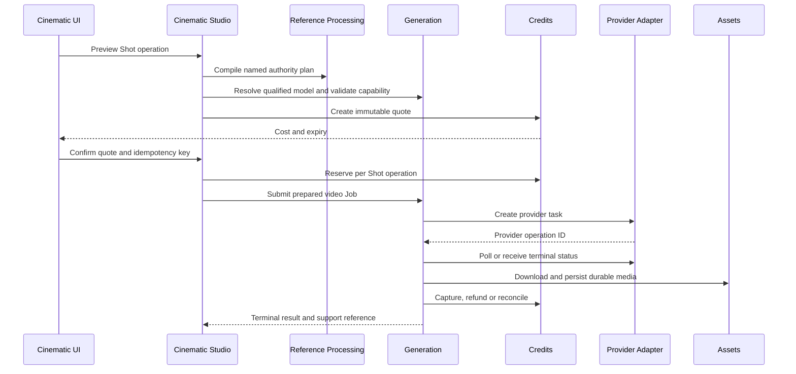

# Video Generation Provider Contract

**Status:** Provider-neutral lifecycle plus Veo Lite and Seedance internal
qualification adapters implemented; live Seedance submission is exposed only
to internal testing and remains subject to ModelArk account entitlement; public
paid routing remains blocked
**Owner:** Generation provider integration with Cinematic Studio orchestration
**Primary role:** Backend Platform Architect
**Reviewers:** Cinematic Experience Director, QA And Release Engineer
**Skills:** `design-cinematic-experience`, `review-generative-media-pipeline`,
`implement-generation-workflow`, `verify-release-regressions`
**Source review date:** 2026-08-18
**Implementation in this change:** disabled-by-qualification capability
catalog, research sandbox adapter, official Google Gen AI SDK Veo adapter,
ModelArk Seedance asynchronous adapter, provider adapter registry, durable
provider-task repository, idempotent submission, terminal polling, Credit
settlement and durable video Asset copy. Veo Lite may be exercised from
Playground as explicitly labelled internal candidates. Seedance is visible for
controlled live qualification, while every model still requires successful
payload, status, usage and account-entitlement evidence before promotion. No
live Veo/Seedance adapter is promoted to general paid routing.

### 0.1 BytePlus live contract reconciliation (2026-08-18)

- Official create-task endpoint: `POST
  https://ark.ap-southeast.bytepluses.com/api/v3/contents/generations/tasks`.
- The adapter sends the documented top-level `model`, `content`, `ratio`,
  `resolution`, `duration`, `generate_audio`, `camera_fixed`, `watermark`,
  `seed` and `return_last_frame` fields. Text and image items remain inside the
  ordered `content` array.
- A BytePlus `ModelNotOpen` response is an account/API-key model-entitlement or
  region configuration failure. It is non-retryable and non-billable; it is not
  translated into a generic gateway failure and never triggers silent model
  fallback.
- Submission creates and persists a durable task before provider dispatch. If
  the provider rejects that task immediately, the submit endpoint returns the
  terminal task with HTTP `200`; accepted non-terminal work returns `202`.
  The client must display the stable provider error code through safe localized
  guidance, retain the support reference and refresh the refunded Credit state.
- Provider and model selectors are relational: the model selector contains
  only models owned by the currently selected provider. A Gemini Veo model must
  never appear inside the BytePlus Seedance model list.

## 1. Outcome

Momelo shall support Google Veo and BytePlus Seedance through one
provider-independent video operation contract while preserving each provider's
real capability, asynchronous lifecycle, reference restrictions and billing
evidence. Cinematic Studio chooses a quality tier and creative intent; the
Generation capability resolves a qualified provider/model and owns dispatch.

Neither the React feature nor Cinematic domain code may call Google or BytePlus
directly.

## 2. Scope

### Included

- text-to-video and image-to-video;
- first-frame and supported first/last-frame generation;
- Character, wardrobe, environment and continuity references where the model
  supports them;
- portrait 9:16 short clips;
- optional native audio when the model supports a choice;
- asynchronous create, poll, download, persist and settle lifecycle;
- draft and final operations;
- provider/model qualification and controlled promotion.

### Deferred

- exposing raw provider controls as the default UX;
- provider-specific conversational video editing;
- arbitrary multi-video reasoning;
- automatic provider failover after dispatch;
- voice cloning and unverified real-person likeness workflows;
- claiming cross-Shot continuity without repeated qualification evidence.

## 3. Canonical Workflow Ownership



The canonical boundaries are:

- Cinematic Studio owns Project/Scene/Shot intent and continuity versions;
- Reference Processing owns authority selection, preprocessing and provider
  ordering;
- Generation owns provider qualification, dispatch, durable Job lifecycle and
  provider-task recovery;
- Credits owns quotes, reservations, capture, refund and reconciliation;
- Assets owns durable video/poster/last-frame metadata and access;
- provider adapters translate requests and responses only.

## 4. Provider-Independent Request

Generation accepts one normalized request:

```text
VideoGenerationRequest
  operation
  projectId / sceneId / shotId / generationAttemptId
  promptPlanVersion / continuityLockVersion
  structuredDirection
    subjectAction
    performance
    camera
    lighting
    environment
    wardrobe
    audioIntent
    negativeConstraints
  output
    aspectRatio
    resolution
    width / height
    fps
    durationSeconds
    outputCount
    audioMode
  authorities
    characterIdentity
    canonicalFace
    bodyAndAge
    wardrobe
    environment
    firstFrame
    lastFrame
    previousApprovedShotFrame
    sourceVideo
    audioReference
  routing
    mode
    qualityTier
    requestedProviderId / requestedModelId
  pricingFingerprint
  idempotencyKey
  correlationId
```

Authority slots contain approved Asset/Version identifiers, never unrestricted
client URLs or durable Base64. `outputCount` is `1` for the initial provider
set because both Veo 3.1 and Seedance tasks produce one target video per task.

## 5. Capability Registry

The public provider catalog must describe video capability from server-owned
versioned data. Minimum fields:

```text
operations
inputModalities
outputModalities
aspectRatios
resolutions
durations
fps
audioMode
referenceImageLimit
referenceVideoLimit
referenceAudioLimit
supportsFirstFrame
supportsLastFrame
supportsVideoExtension
supportsReturnLastFrame
supportsDraftMode
supportsServiceTier
personGenerationPolicy
providerRetention
pricingStatus
qualificationStatus / qualificationVersion
```

The UI hides unsupported controls. The server validates the same contract again
before Credit reservation and before dispatch.

## 6. Google Veo 3.1 Adapter

Official sources:

- [Veo generation guide](https://ai.google.dev/gemini-api/docs/veo)
- [Veo 3.1 pricing](https://ai.google.dev/gemini-api/docs/pricing#veo-3.1)

### 6.1 Model candidates

| Model | Candidate purpose | Key capability |
|---|---|---|
| `veo-3.1-lite-generate-preview` | Low-cost I2V candidate | 720p/1080p, text or first-frame image, native audio; no multi-reference or extension |
| `veo-3.1-fast-generate-preview` | Creator/draft-final candidate | 720p/1080p/4K, up to three reference images, first/last frame and extension |
| `veo-3.1-generate-preview` | Premium final candidate | Highest-cost candidate with the same advanced control surface |

These are Preview models and are disabled from paid routing until qualification.

### 6.2 Hard rules

- output aspect ratio is `9:16` or `16:9`;
- output duration is 4, 6 or 8 seconds;
- 1080p, 4K, extension and reference-image generation require 8 seconds as
  documented for the applicable model;
- output is one video at 24 fps;
- native audio is always enabled;
- Veo Standard/Fast may use up to three reference images; Lite must not receive
  `referenceImages`;
- video extension is 720p only and is unavailable on Lite;
- image/reference-based people generation uses adult-authorized behavior and
  must pass Momelo rights validation;
- English is the canonical adapter prompt language until another language is
  qualified;
- provider result media must be downloaded immediately after success because
  Google retains generated video for only two days;
- persisted metadata records SynthID/watermark provenance;
- provider audio/safety blocks reported as non-billable must refund the
  reservation after reconciliation.
- JavaScript adapters use the current SDK `source: { prompt, image, video }`
  contract. They must not use deprecated top-level `prompt`, `image` or
  `video` arguments.
- The Gemini Developer API adapter omits Enterprise Agent Platform-only request
  fields, including `generateAudio` and `personGeneration`. Veo 3.1 native
  audio remains represented by Momelo's locked `audioMode: generated`
  contract, but no explicit audio-enable field is sent to Google. Adult-person
  authorization remains a Momelo rights and safety precondition rather than an
  unsupported Developer API request field.
- Durable polling reconstructs a real `GenerateVideosOperation` from the
  persisted operation name before calling `getVideosOperation`; a plain object
  without the SDK response transformer is not a valid recovery contract.

### 6.2.1 Development diagnostics

`VIDEO_PROVIDER_DEBUG=true` enables sanitized lifecycle diagnostics for every
Video adapter. `GEMINI_VIDEO_DEBUG` and `MODEL_ARK_VIDEO_DEBUG` remain optional
provider-specific aliases. Debug output covers request shape, provider/model,
operation, dimensions, duration, audio, reference count, prompt length and
fingerprint, provider operation/request ID, status, latency, provider error
code/message, filtered-media evidence and durable download byte count.

Debug output never contains credentials, raw prompt text, reference URLs,
Base64 media or downloaded bytes. The task's public error remains sanitized;
full safe diagnostics stay in the development console and Support trace.
Transport failures include sanitized nested cause diagnostics (`causeCode`,
`causeErrno`, `causeSyscall`, `causeAddress`, `causePort`, and `causeMessage`)
when Node `fetch` exposes them. A submit transport failure must not be retried
automatically because the provider may have accepted the request before the
response connection failed; retry remains an explicit user or Support action.

### 6.3 Reference strategy

For a Character-led Shot:

1. Use the exact approved immutable Storyboard Asset Version as `image` when
   first-frame motion is sufficient. The adapter receives a resolved authorized
   Asset, version and fingerprint from the prepared Generation request; it must
   not choose the latest Storyboard attempt or resolve a client URL itself.
2. Use named `referenceImages` only on qualified Standard/Fast routes and map no
   more than three authorities, typically Character identity, wardrobe and
   environment/style.
3. Use first/last frame interpolation when ending composition is a stronger
   requirement than independent references.
4. Never silently drop an authority to fit the provider limit. Reference
   Processing must choose a qualified compiled keyframe or block the operation.

At dispatch, Generation revalidates that the prepared Storyboard source
fingerprint still matches the accepted quote and current approved Shot source.
A mismatch fails before provider submission and Credit capture; provider
adapters never substitute another image.

## 7. BytePlus Seedance Adapter

Official sources:

- [ModelArk pricing](https://docs.byteplus.com/en/docs/ModelArk/1544106)
- [Seedance 2.5 pricing examples](https://docs.byteplus.com/en/docs/ModelArk/1544106#sd25_price)
- [ModelArk video model list](https://docs.byteplus.com/en/docs/ModelArk/1330310#7571da3f)
- [Create video generation task](https://docs.byteplus.com/en/docs/modelark/1520757)
- [Seedance 1.5 Pro prompt guide](https://docs.byteplus.com/en/docs/ModelArk/2168087)

### 7.1 Model candidates

**Account entitlement evidence (2026-08-18):** the configured BytePlus account
shows enabled scope access for Dreamina Seedance 2.5, 2.0 Mini, 2.0 Fast, 2.0,
ByteDance Seedance 1.5 Pro, 1.0 Pro Fast and 1.0 Pro. Video uses the existing
`MODEL_ARK_API-KEY` credential and regional ModelArk base URL already used by
Seedream. This evidence clears credential and model-entitlement discovery only;
it does not clear request-shape, usage, visual-quality or paid-routing gates.

| Model | Candidate purpose | Key capability |
|---|---|---|
| `dreamina-seedance-2-5-260628` | Premium long-shot multimodal/edit candidate | 4-30s, first/last-frame and multimodal reference/edit/extension modes; model list currently declares 480p/720p and `.mp4`/`.mov` |
| `seedance-1-0-pro-250528` | Standard silent motion candidate | 2-12s, 480p/720p/1080p, text-to-video and first-frame image-to-video |
| `seedance-1-0-pro-fast-251015` | Cheapest motion draft candidate | 2-12s, 480p/720p/1080p, first-frame I2V, silent |
| `seedance-1-5-pro-251215` | Creator candidate | 4-12s, optional native audio, first/last frame, draft support at qualified modes |
| `dreamina-seedance-2-0-mini-260615` | Low-cost multimodal candidate | 4-15s, up to nine image references, video/audio reference support, no 1080p/4K |
| `dreamina-seedance-2-0-fast-260128` | Creator multimodal candidate | 4-15s, broader multimodal control, no 1080p/4K |
| `dreamina-seedance-2-0-260128` | Premium multimodal/edit candidate | 4-15s and resolution-dependent pricing through 4K |

All remain disabled from paid routing until the fixed-input qualification matrix
passes.

### 7.2 Hard rules

- use `POST /api/v3/contents/generations/tasks` through the ModelArk adapter;
- persist the returned provider task ID before polling;
- use explicit request fields for resolution, ratio, duration, seed,
  `camera_fixed`, audio and watermark rather than hiding controls in prompt
  suffixes;
- supported portrait ratio includes `9:16`;
- first-frame and first/last-frame modes are separate from multimodal-reference
  mode and cannot be mixed in one request;
- Seedance 2.0 reference mode supports 1-9 images, 0-3 videos and 0-3 audio
  inputs within provider limits;
- Seedance 2.5 input-video pricing supports 2-30 second source videos and uses
  a provider minimum-token floor determined by resolution, aspect ratio and
  output duration; the adapter must not estimate it as a simple unconstrained
  linear token total;
- the Seedance 2.5 pricing page publishes a 1080p rate while the reviewed model
  list declares only 480p and 720p output. Momelo must treat 1080p as
  `qualification_blocked`, verify the live account/API capability, and record
  the evidence before exposing it; a price row alone is not a capability;
- Seedance provider discounts are effective-dated pricing records and cannot
  be hard-coded into capability metadata or retained after expiry;
- returned `usage.completion_tokens` is retained for settlement;
- `return_last_frame` is enabled when the Shot plan needs a continuity handoff;
- only successfully generated provider tasks are normally billable, but timeout
  and unknown states require provider reconciliation;
- input aspect ratio must be normalized to the target output to prevent abrupt
  stretching or center-crop surprises.

### 7.3 Real-person and Character restriction

Seedance 2.0 does not accept arbitrary direct uploads containing real human
faces. It supports provider-trusted outputs, preset digital Characters and
authorized real-person assets under provider rules. Therefore:

- a general Momelo Character Asset must not automatically be sent to Seedance
  2.0 merely because the user owns it;
- the Asset record must carry a provider-compatible authorization/trust record,
  source provider/task and expiry where applicable;
- trusted provider outputs have time-bounded eligibility and must be checked at
  quote time and dispatch time;
- if eligibility is absent, routing must use a different qualified model,
  create an approved provider-specific asset workflow, or block with a recovery
  action;
- no adapter may weaken moderation or mislabel an asset to bypass this rule.

### 7.4 Adapter compatibility and activation gate

The Seedance video adapter must reuse the ModelArk deployment contract already
used by Seedream:

- credentials resolve from `MODEL_ARK_API-KEY`, then `MODEL_ARK_API`, then
  `ARK_API_KEY`;
- the base URL resolves from `MODEL_ARK_BASE_URL` and defaults to the same
  regional `/api/v3` endpoint used by Seedream;
- timeout and sanitized provider-error behavior follow the existing ModelArk
  adapter conventions;
- the adapter is selected by the Generation-owned video adapter registry using
  `providerId`; routes, Playground and Cinematic Studio never instantiate it;
- Veo and Seedance share `VideoProviderTaskService`, durable task persistence,
  polling, media copy, actor isolation, Credit capture/refund and Support
  correlation. Seedance must not introduce a second queue or settlement path;
- constructor injection of one adapter remains supported for deterministic
  tests and migration compatibility, but runtime dispatch resolves the adapter
  recorded on each task.

The first implementation encodes the reviewed ModelArk content-task contract
behind pure request/response mapping functions. Console scope evidence permits
Seedance catalog rows to use `testingRoutingEnabled: true` for non-production
Prompt-only qualification while `paidRoutingEnabled` remains `false`. A live
`ModelNotOpen` response means the API key/account/region entitlement remains
unconfirmed for that exact model even when the console selection appears
enabled; this discrepancy blocks promotion and must not trigger model fallback.
Image/Character operations remain hidden for Seedance until provider person and
private-reference policy is represented by deterministic preflight checks.
Sanitized live fixtures must still confirm all of the following:

1. account entitlement and exact model IDs;
2. create-task payloads for text, first-frame, first/last-frame and multimodal
   modes;
3. task lookup endpoint, status vocabulary and terminal error shape;
4. output URL, MIME type, audio metadata and provider retention behavior;
5. authoritative `usage.completion_tokens` placement;
6. generated-audio support per model;
7. real-person and Character eligibility behavior; and
8. Seedance 2.5 duration, input-video minimum-token floor and the unresolved
   1080p capability conflict.

Unknown provider states or missing successful usage never become `completed`:
they stop at `reconciliation_required`. Live qualification changes capability,
pricing and qualification policy versions; it does not require replacing the
adapter lifecycle.

### 7.5 Sanitized live debug logging

- `MODEL_ARK_VIDEO_DEBUG=false` is the default. Set it to the exact value
  `true` and restart the server to enable Seedance adapter diagnostics.
- A submit or poll logs one structured `request` event and one `response` event
  under the `[ModelArkSeedance][Debug]` prefix. Transport failures use
  `transport_error`.
- Request diagnostics include operation, endpoint, HTTP method, timeout, exact
  model ID, ratio, resolution, duration, audio/camera/watermark/last-frame
  controls, content types, reference roles and reference count.
- Response diagnostics include latency, HTTP status, success flag, provider
  code, provider request ID, provider task ID and provider status.
- Logs must never contain the API key, Authorization header, prompt text,
  reference URLs, Base64 media or raw provider payload. The toggle changes
  observability only and cannot alter routing, pricing, retries or settlement.
- QA must prove that debug-off emits no adapter diagnostics and debug-on emits
  the safe fields while redacting a sentinel prompt and credential.

## 8. Normalized Async Lifecycle

```text
accepted
-> provider_submitting
-> provider_queued
-> provider_processing
-> provider_succeeded
-> media_copying
-> completed
```

Terminal alternatives are `failed`, `cancelled`, `expired` and
`reconciliation_required`.

Required behavior:

- provider task ID, submitted fingerprint and submit timestamp are durable;
- polling uses server-owned bounded backoff and stops at terminal state;
- process restart resumes accepted non-terminal operations;
- duplicate submit with the same idempotency key returns the existing attempt;
- success is not exposed until video and poster metadata are durable;
- temporary provider URLs are never the project's source of truth;
- terminal error stops all UI spinners and exposes a stable support reference;
- provider raw responses are sanitized before logs and client errors.

## 9. Adapter Response And Usage Evidence

Each adapter returns a normalized result:

```text
providerOperationId
providerStatus
createdAt / completedAt
output
  temporaryProviderUrl or file handle
  mimeType
  width / height
  durationSeconds
  fps
  hasAudio
  watermark/provenance
  optionalLastFrame
usage
  billingMetric
  outputSeconds
  completionTokens
  inputVideoSeconds
  providerRateVersion
providerError
  code
  category
  retryable
  providerBillableState
```

Missing usage on an otherwise successful token-billed response triggers
reconciliation and rate telemetry; it must not be silently replaced with zero.

## 10. Routing Policy

Simple mode presents product tiers, not provider names:

- `Motion Preview` prioritizes low cost and composition/motion validation;
- `Creator Draft` balances Character/wardrobe continuity, motion and cost;
- `Final` prioritizes continuity and commercial quality;
- `Premium Cinematic` is shown only after evidence supports its price.

Advanced mode may expose only qualified provider/model combinations. Routing
must consider operation, references, face-asset eligibility, duration,
resolution, audio, cost ceiling, latency and current provider health.

There is no automatic cross-provider failover after a billable task was
accepted. A replacement attempt requires known settlement state and a new or
reused quote according to Credit policy.

## 11. Qualification Matrix

Every model is tested with the same locked Project fixtures:

1. one-Character first-frame fashion motion;
2. one Character plus distinct wardrobe;
3. two Characters with clear blocking;
4. camera movement and static-camera control;
5. first/last-frame transition;
6. continuity handoff from the previous approved Shot;
7. dialogue/audio when supported;
8. portrait 9:16 at every candidate resolution;
9. safety rejection, timeout, provider error and retry;
10. restart recovery and durable media download.

Record per round:

```text
Project / Scene / Shot / Attempt IDs
Generation Job and provider task IDs
Provider / model / rate version
Operation / resolution / duration / audio
Reference authority plan and count
Quote / reservation / settlement IDs
Estimated and actual usage/cost
Queue wait / provider latency / total latency
Identity / age / body / wardrobe fidelity
Scene / camera / motion / temporal continuity
Anatomy / audio / commercial quality
Unexpected elements / visible reference artifacts
Error and retry outcome
Pass / conditional pass / fail
```

At least three repeated visual rounds are required. Automated contract tests do
not replace human motion and continuity review.

## 12. Automated QA

Minimum deterministic suites cover:

- capability filtering and unsupported parameter rejection;
- Veo duration/reference/resolution combinations;
- Seedance duration/audio/service-tier/token formula combinations;
- Seedance 2.5 4-30 second duration, input-video minimum-token floors and
  480p/720p capability filtering;
- effective-dated provider discounts immediately before and after expiry,
  including settlement of a quote accepted before expiry;
- Seedance 2.5 1080p remains blocked until live capability evidence resolves
  the pricing-page/model-list discrepancy;
- named authority mapping and provider reference limits;
- approved Storyboard Asset Version parity across quote, prepared request,
  provider payload and durable output provenance, including source replacement
  immediately before dispatch;
- real-person asset eligibility and expiry;
- immutable quote fingerprint parity;
- provider task persistence before polling;
- restart recovery, polling backoff and terminal stop;
- duplicate submit and idempotent settlement;
- partial Generation Group completion;
- successful media copy before capture;
- non-billable failure refund and ambiguous billing reconciliation;
- actor isolation and private Asset authorization;
- sanitized errors and support correlation IDs.

## 13. Acceptance

- The same Cinematic Shot contract can target a qualified Veo or Seedance model
  without changing story or continuity meaning.
- Unsupported reference, duration, resolution, audio or person policy fails
  before Credit reservation.
- Every accepted task survives process restart and remains traceable by provider
  task ID.
- Every successful result is copied into Momelo-owned durable storage before
  provider retention expires.
- Every terminal task has one financial terminal outcome.
- Returned usage can be reconciled to the accepted rate-card version.
- A model cannot enter Simple or Advanced paid routing without repeated visual,
  error-rate, latency and cost qualification.

## 14. First Implementation Gate

1. Add provider-neutral video capability schema and fixtures with all candidates
   disabled for paid use.
2. Extend Credit pricing with output-second and completion-token metrics.
3. Implement one adapter sandbox path without customer charging.
4. Persist provider task lifecycle and durable output copy, then pass restart,
   terminal polling and reconciliation tests for that adapter.
5. Execute the fixed qualification matrix for the first adapter.
6. Add a second provider only through the same normalized contract and repeat
   capability, cost, error and visual qualification; do not build two lifecycle
   implementations in parallel.
7. Promote the smallest sufficient tier set through a new provider catalog,
   qualification and pricing policy version.

This gate is executed at Checkpoints C1 and C4 in Requirement 004. Shared UI,
state and code placement follow Requirement 007; operational controls and trace
visibility follow Requirement 008.
