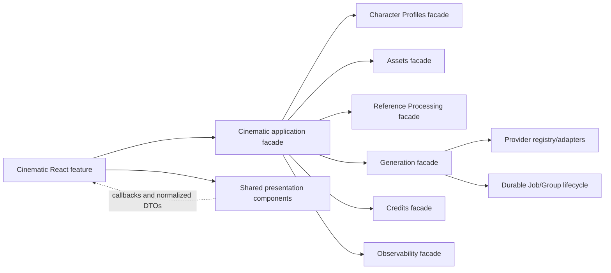

# Cinematic Shared Component, State And Project Structure

**Status:** Architecture gate and shared Cinematic foundation implemented;
shared paid Generation integration remains gated
**Owner:** Cinematic Studio with shared UI owners
**Primary role:** Backend Platform Architect
**Reviewers:** UX/UI Product Designer, QA And Release Engineer
**Skills:** `implement-generation-workflow`, `review-product-ux`,
`verify-release-regressions`

## 1. Outcome

Cinematic Studio shall be implemented as a focused orchestration capability
that reuses Momelo's existing Generation, Credit, Character, Asset, Reference,
media, theme and async-state contracts. This requirement prevents a parallel
video application from emerging inside the existing application.

Success means a developer can locate each rule from the structure below, a user
recognizes the same Generation interaction used by image Studio, and existing
image/Fashion workflows remain unchanged unless an explicitly shared contract
is improved for every consumer.

## 2. Capability Dependency Direction



- Cinematic owns Project story structure, Scene, Shot, continuity, attempt
  association and timeline intent.
- Generation owns dispatch, provider task lifecycle, polling truth and result
  status.
- Credits owns estimate, quote, reservation, capture, refund and reconciliation.
- Assets owns durable input/output media and authorized delivery.
- Shared React components own presentation only.
- No layer accesses another capability's repository directly.

## 3. Canonical Project Structure

Create folders only when implementation begins and only for files required by
the active checkpoint:

```text
web/src/features/cinematic/
  api/                 API functions through apiClient
  schemas/             Zod response/request boundaries
  routes/              list, create, workspace and focused Shot routes
  components/          Cinematic-only stage, story, Shot and timeline UI
  hooks/               feature orchestration and query/mutation adapters
  state/               pure draft reducers/selectors and persistence schema

web/src/components/generation/
  existing shared Engine, Queue, Stage, result and command presentation
  new shared media/quote presentation only when two consumers use it

web/src/components/media/
  authenticated image/video presentation and viewer controls

web/src/features/credits/
  shared Credit API, exhausted state and reusable quote presentation

server/app/routes/
  cinematicRoutes.js

server/domain/cinematic/
  CinematicApplicationService.js
  focused story, continuity, stale-dependency and command policy modules

server/repositories/cinematic/
  repository interface-compatible local adapter

server/data/cinematic/
  projects.json
  story-plan-versions.json
  continuity-locks.json
  timeline-versions.json

server/providers/
  video-capable adapters remain provider-owned; no Cinematic provider client

client/i18n/locales/<locale>/cinematic.json
test/fixtures/cinematic/
```

Jobs, Groups, Assets, Credit ledger entries, provider tasks and traces remain in
their current owners and must not be copied into `server/data/cinematic/`.
Cinematic records store stable foreign IDs and immutable fingerprints.

When these folders are created, update
`requirements/099-technical-dept/000-master.md` in the same implementation
change.

## 4. Shared Component Reuse Map

### 4.1 Extend or adapt first

| Contract | Current owner | Cinematic rule |
|---|---|---|
| Engine/provider controls | `EngineTargetPanel` | Add typed media-operation configuration; image defaults and tests remain intact |
| Submission composition | Generation command-region/experience contracts | Reuse ordering, estimate, Generate action and blocked-state semantics; keep Cinematic orchestration in its feature hook |
| Loading and terminal presentation | `GenerationStageState`, `Surface`, shared loader treatment | Same dimensions, animation and terminal-stop behavior for video |
| Queue | `GenerationQueueStatus`, `useGenerationJob`, `useGenerationGroup`, polling policy | Adapt Project/Shot labels; do not add feature-local polling |
| Results | Generation result presentation plus media adapter | Normalize status/actions; video transport stays in media component |
| Viewer | authenticated media stage/viewer | Add video poster/playback variant without duplicating authorization |
| Async/status | `AsyncState`, `StatusNotice`, `ToastViewport` | Reuse severity, focus and notification behavior |
| Character/outfit | current Character cards and reference pickers | Add project-local `CharacterDossierCard` and Character-owned `WardrobeLookEditor`; never add an unassigned Project upload store |
| Credits | current estimate flow and `CreditExhaustedDialog` | Add shared quote summary if extraction is necessary; server remains calculator |
| Contextual operation | shared Generation command/quote/progress primitives | Compose text, analysis, image, video and export docks through typed operation adapters |
| Project spend | Credits-owned ledger projection | Shared compact `ProjectCostSummary`; no client running total |
| Theme | current `ThemeProvider` and semantic tokens | Consume resolved theme; no Cinematic theme preference |

### 4.2 Extraction rule

Before extraction, add characterization tests for the current image consumer.
Extract the smallest presentation contract, keep the old consumer as an
adapter, then add Cinematic. A shared component must accept normalized state and
callbacks and must not import a feature API, provider or repository.

Do not force storyboards or timelines into `GenerationExperience`. They are
Cinematic concepts. Reuse the Generation command/result building blocks inside
the Cinematic production stage instead.

## 5. Contextual Operation And Video Panel Contract

The permanent workspace element is the compact `ProjectCostSummary`, not an
Engine panel. It shows captured, reserved, next-estimate, refunded and net
Project Credits and opens an authorized grouped breakdown.

An operation dock is mounted only where a billable action exists:

```text
operation intent and output
-> source/version summary
-> routing or provider/model controls when supported
-> exact Credit quote and balance state
-> explicit confirm action
-> Queue/progress/error/refund
-> result or proposal review
```

Text enhancement, wardrobe analysis and Story planning reuse quote/progress
primitives but do not present video-specific duration/resolution controls. The
yellow shared Generation shell is reserved for media-generation operations or
another action-dominant surface approved by UX; it is absent from passive Setup
and browsing states.

### 5.1 Video Generation panel

The panel follows the existing image Generation mental model:

```text
Engine & Target Output
-> provider/model or quality tier
-> aspect ratio, resolution, duration and audio capability
-> exact Credit estimate and balance state
-> Generate video
-> Queue/progress
-> result surface and viewer
```

- Simple mode shows qualified quality tiers and recommended defaults.
- Advanced mode exposes only provider-supported controls.
- Unsupported controls are hidden with capability-derived explanations where a
  previous selection becomes unavailable.
- Changing a cost-bearing field invalidates the quote and disables submission
  until the estimate refreshes.

For Storyboard and Produce, the operation dock is the sticky right command
group rather than a detached price card. It composes scope, supported provider
controls, exact quote and the primary action, then targets the selected result
in the center editor. Prompt authoring remains in the center lane beside its
media and direction context. Reuse `GenerationStageState` for the Momelo empty
state and shared amber loading treatment; reuse the current result grid/viewer
or a typed video adapter instead of creating Cinematic-only loaders.

The Storyboard board, Scene navigator and focused Shot editor are Cinematic
feature components. Their stable component contract accepts Scene totals,
ordered Shot summaries, selected Shot ID and move/select callbacks. Do not put
generation, Credit or repository behavior inside visual board cards.

The board and focused editor share a feature-owned navigation contract rather
than querying DOM selectors ad hoc. It exposes stable Scene/Shot anchor IDs,
`focusSelectedShotEditor`, `focusStoryboardCard` and a bounded scroll-return
record. The contract performs focus after navigation, respects reduced motion
and remains independent from generation and persistence commands.

Produce receives an authorized approved-Storyboard source DTO containing Shot
ID, Asset ID, immutable Asset Version ID, approval state, thumbnail/media
presentation and source status. The UI never reconstructs source authority from
URLs or latest-attempt ordering. `Edit storyboard source` routes with Scene and
Shot IDs plus a return target; source replacement and stale propagation remain
server-owned Cinematic commands.

The feature owns only selection and presentation state for `Selected Shot` and
`All eligible Shots`. Generation owns the group/child lifecycle and Credits
owns aggregate and per-child quote truth. Accepted submission triggers
`scrollIntoView` and moves programmatic focus to the result status heading;
client validation and quote failures retain focus in the command group.
- The primary action, loader, Queue and result state use the same placement,
  theme tokens and terminology as image Studio.
- Multi-Shot submission presents one Project total and inspectable child Shot
  costs without hiding partial settlement.
- Provider/model preference inherits Project default, then optional Scene
  override, then optional Shot override. Capability reconciliation removes an
  invalid inherited selection and requires a fresh quote.

### 5.2 Shared presentation ownership

Preferred reusable contracts:

- `OperationQuotePanel`: normalized intent, inputs, breakdown, expiry, consent;
- `OperationProgressPanel`: queued/processing/terminal/recovery state;
- `ProjectCostSummary`: Credits-owned Project projection and drill-down;
- Cinematic `SceneDirectorDialog`, `ShotWorkspace`, `AttemptHistory` and
  timeline remain feature-owned compositions around shared primitives.

These names are design contracts, not permission to create files before
searching current owners. Implementation may extend an existing equivalent
instead of adding another component.

## 6. Client State Ownership

| State | Owner | Browser persistence |
|---|---|---|
| Current Project/Story/Shot committed data | server + TanStack Query | No canonical local copy |
| Uncommitted Setup/story/inspector draft | Cinematic route state | Versioned actor-scoped local draft |
| Expanded panels, selected Shot/filter, scroll-return target | Cinematic UI | Actor-scoped local preference, bounded |
| Approved Storyboard source and downstream stale status | Cinematic server | Query cache only; IDs/fingerprints retained in committed records |
| Provider/model/quality preference | existing Generation preference owner or Cinematic operation preference | Actor-scoped; capability-reconciled on read |
| Accepted quote, reservation, balance | Credits server | Never authoritative in local storage |
| Project cost summary | Credits server projection | Query cache only; no browser accumulator |
| Job/Group/provider task status | Generation server | Never authoritative in local storage |
| Media | Assets | IDs only; no Base64 or signed URL retention |

Use `writeActorScopedDraft`/`readActorScopedDraft` with a schema version and an
explicit migration function. Cap payload size, debounce writes and remove a
draft after safe server commit when no uncommitted fields remain. Actor switch,
logout, malformed payload, unsupported schema and storage quota failure must
fall back safely without blocking the server project.

## 7. Theme, Responsive And Accessibility

- Resolve theme through the existing application provider.
- Use semantic tokens for surfaces, text, focus, status and primary actions.
- Verify Momelo Neon, Pearl Editorial and Electric Studio; the same actor sees
  one theme across Playground, Studio, Fashion and Cinematic.
- Desktop uses stage rail + workspace + inspector. Mobile uses one column and a
  drawer/sheet inspector without hiding the primary action.
- Focus moves after explicit stage/Shot navigation, not every state refresh.
- Storyboard/editor anchors and cross-stage source correction move focus to a
  semantic heading, restore the selected Shot and provide an equivalent normal-
  flow layout on mobile; sticky panels never obscure the anchor target.
- Queue/progress announcements use `aria-live`; reduced motion suppresses
  decorative animation without hiding status.

## 8. Performance And Bounds

- Project lists and Shot histories use cursor pagination.
- Storyboard queries are Scene-bounded; do not load every attempt or prompt.
- One canonical query polls a Job/Group and stops at terminal status.
- Poster/thumbnail payloads are bounded and full media loads on intent.
- Local drafts have documented size limits and never retain media bytes.
- Instrument stage load, autosave, quote, Queue wait, reference processing,
  provider duration, media copy and settlement separately.

Any new cache must name owner, key, maximum entries/bytes, TTL or terminal
condition and invalidation events.

## 9. Protected Behavior Inventory

Before shared-component edits, tests must freeze:

- Playground and Studio Engine defaults, aspect ratios and output count;
- Character Sheet fixed-format behavior;
- image/Fashion estimate and insufficient-Credit behavior;
- Queue partial/terminal states and stopped spinners;
- image result grids, authenticated viewer and action callbacks;
- actor-scoped preference isolation;
- all three themes and existing responsive layouts.

## 10. Acceptance

- No provider or Credit formula is introduced in the Cinematic React feature.
- No duplicate Job poller, media authorization path, theme system or local
  balance exists.
- The video panel is recognizable as the same Generation workflow used for
  images while exposing valid video controls.
- Refresh restores safe draft/UI state and server truth restores accepted work.
- Existing Studio, Playground and Fashion protected suites remain green after
  every shared extraction.
- Every new file follows the structure and dependency direction in this
  requirement.
