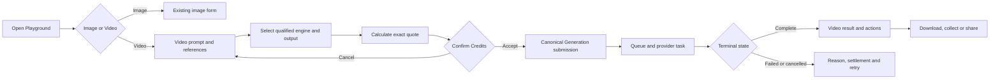

# Playground Unified Image And Video Generation

**Status:** Requirement ready; implementation not started  
**Owner:** Generation capability with Playground presentation  
**Primary role:** Product And Requirement Architect  
**Reviewers:** UX/UI Product Designer, Generative Cinematic Production Director  
**Skills:** `review-product-ux`, `direct-generative-cinematic-production`,
`implement-generation-workflow` during implementation  
**Implementation in this change:** Requirement only

## 1. Outcome

Playground shall offer image and single-clip video generation in one familiar
workspace. A creator can switch media mode, write a prompt, optionally attach
an authorized image or reusable Character, select only provider-supported
controls, inspect the exact Credit quote and generate without learning the
multi-stage Cinematic Studio workflow.

This is a new media mode inside the existing Playground workflow, not a second
Generation queue, Credit calculator, provider registry, reference pipeline or
media library.

## 2. Product Boundary

### 2.1 In scope

- One `Image | Video` segmented mode control on `/create/playground`.
- Text-to-video from a prompt without references.
- Image-to-video from an authorized uploaded image, owned Generation Asset or
  Community Asset whose reuse policy permits reference use.
- Character-to-video from a pinned reusable Character Profile Version and its
  canonical identity pack.
- Character plus image input when the selected provider supports both and the
  authority order is explicit.
- Capability-driven duration, aspect ratio, resolution, audio and reference
  controls.
- Quote, reservation, asynchronous generation, terminal result, download,
  collection and Community share handoff through existing owners.
- Actor-scoped independent drafts for image and video modes.

### 2.2 Not in scope

- Story, Scene, Shot, continuity, storyboard, timeline or multi-clip assembly;
  those remain in Cinematic Studio.
- Unqualified providers or arbitrary provider parameters.
- Uploading an input video for video-to-video in the first release.
- Voice cloning, lip sync, dialogue editing or audio post-production.
- Public remix rights inferred from public visibility.
- A provider call from React or a Playground-owned queue.

### 2.3 MVP decision gates

The first enabled release defaults to one requested video output and no
multi-output batch. Native audio is shown only when the selected provider model
exposes a supported audio mode and the active published rate card can quote it.
First/last-frame controls remain hidden until a qualified provider contract and
reference-processing policy support them. These gates may be relaxed by a
versioned requirement update; client-only enablement is forbidden.

## 3. User Flow



1. Opening Playground restores the last actor-scoped media mode and that
   mode's recoverable draft.
2. Switching mode never submits work. Image and video drafts remain separate.
3. Video mode presents the shortest valid path first: prompt, optional source,
   Engine & Target Output, quote and Generate.
4. Selecting a Character or source image immediately reconciles provider
   eligibility and visible controls without erasing unrelated prompt text.
5. Generate is enabled only after server validation and a non-stale quote.
6. Acceptance submits the exact quoted contract with an idempotency key.
7. Processing uses the shared result surface and terminal polling policy.
8. Completion scrolls/focuses to the result once, without stealing focus during
   subsequent polling.

## 4. Unified Playground UX Contract

### 4.1 Shared shell

The existing Playground route, prompt surface, reference affordances, Engine &
Target Output visual language, Credit confirmation, loading treatment, media
viewer and result actions shall be extended through typed media contracts.
Image behavior and tests are protected behavior.

Do not create a separate `/create/video` route for MVP. A direct URL may encode
`?media=video`, but canonical navigation remains `/create/playground` and the
query parameter must be reconciled into actor-scoped state.

### 4.2 Mode switch

- Use an accessible segmented control labelled Image and Video.
- Preserve one versioned draft per actor and media mode.
- Unsupported stale fields are marked and omitted from the submitted contract;
  they are not silently translated to another meaning.
- Switching back restores the previous mode's prompt, references and supported
  output selections.
- Actor switching clears in-memory query data and loads only the new actor's
  drafts.

### 4.3 Video form sections

1. **Prompt:** required text with bounded length and no provider syntax in
   Simple mode.
2. **Source:** None, Image or Character. A combined Character + Image plan is
   offered only when supported.
3. **Direction:** optional motion/camera intent using provider-neutral values.
4. **Engine & Target Output:** qualified quality tier in Simple mode; qualified
   provider/model in Advanced mode; duration, aspect, resolution and audio.
5. **Quote and Generate:** exact parameter summary, Credit total, expiration
   state and one primary Generate action.

Provider/model and Generate belong in the same operation panel. The panel uses
the same semantic amber emphasis as image generation and must remain readable
under every supported theme.

### 4.4 Result surface

The shared result surface accepts a typed media result:

```ts
type GeneratedMediaResult =
  | { mediaType: 'image'; assetId: string; imageUrl: string }
  | {
      mediaType: 'video';
      assetId: string;
      videoUrl: string;
      posterUrl?: string;
      durationMs?: number;
    };
```

Video completion displays an accessible player with play/pause, seek, mute,
volume, duration, fullscreen and download. It must not autoplay with sound.
Poster and metadata loading failures do not conceal a playable video. Opening
detail uses the shared media viewer contract rather than a route-local modal.

The empty and processing states reuse the shared Momelo placeholder and amber
loader effect. Failed, cancelled and refunded terminal states stop animation
and expose a stable reason plus valid next action.

## 5. Reference Authority And Rights

### 5.1 Source authority

| Source | Authority | Required record |
|---|---|---|
| Character | recognizable identity, age range, body proportions and canonical face | pinned Character Profile ID and Version ID |
| Source image | first-frame composition, appearance or environment according to selected use | durable Asset ID and declared role |
| Prompt | action, camera, motion, environment and exclusions not owned by a stronger reference | compiled structured direction |

When Character and image are combined, the request must state whether the image
is a first frame, composition reference or style/environment reference. The
system must never let the person in an uploaded image silently override the
selected Character.

### 5.2 Authorization

- Owned private Assets are usable only by their owner.
- Another creator's Community Asset is usable only when its published reuse
  policy explicitly allows the selected reference purpose.
- Public visibility alone does not grant download, remix or reference rights.
- Character authorization is checked at quote and submission time.
- Private source URLs, canonical face Assets and raw prompt internals are not
  copied into public post payloads.
- Browser drafts store stable IDs and bounded metadata, never durable Base64.

## 6. Capability And Provider Contract

The public provider catalog is authoritative for:

```text
operations: text_to_video, image_to_video, character_to_video
durationsSeconds
aspectRatios
resolutions
audioModes
maxImageReferences
supportsCharacterIdentityPack
supportsFirstFrame
supportsLastFrame
qualificationStatus
```

Video controls are the intersection of provider capability, qualification,
published commercial configuration and selected reference plan. React must not
duplicate this matrix. A model is selectable only when qualified for the exact
operation, not merely because it can generate some kind of video.

Provider adaptation follows Requirements 016-005 and 016-006. The Playground
submits a provider-neutral execution packet to Generation; provider-specific
payload translation remains in `server/providers/`.

## 7. Canonical Workflow And API Contract

### 7.1 Ownership

| Concern | Owner |
|---|---|
| Playground form and handoff | Playground feature |
| Generation request, Job, provider task and terminal state | Generation |
| References and normalized derivatives | Reference Processing / Assets |
| Quote, reservation, capture and refund | Credits |
| Character identity pack | Character Profiles |
| Durable media | Assets |
| Community publication | Community |

The canonical Generation application facade is the only submission entry
point. Playground must not call Veo, Seedance or another provider directly.

### 7.2 Request snapshot

The accepted request records at minimum:

```text
generationId / groupId / jobId
actorUserId
surface = playground
mediaType = video
operation
providerId / modelId / qualificationVersion
capabilitySnapshotVersion
rateCardVersion / quoteId
promptFingerprint and structured execution packet version
characterProfileId / characterProfileVersionId when present
reference Asset IDs, declared roles and reference-plan fingerprint
duration / aspectRatio / resolution / audioMode / outputCount
idempotencyKey / correlationId
```

The submitted values and displayed quote must match. A mismatch returns a
stable stale-quote error and no provider side effect.

### 7.3 Async lifecycle

```text
draft -> quoted -> accepted -> queued -> provider_processing
provider_processing -> completed | failed | cancelled | reconciliation_required
```

Provider task IDs and polling state must survive process restart before video
is enabled for customers. Unknown provider outcomes enter reconciliation; they
are never blindly resubmitted. Polling has one owner, bounded backoff and a
terminal stop condition.

## 8. Credits And Commercial Integrity

- Quote input includes exact provider/model, operation, duration, resolution,
  audio, reference plan, output count and active rate-card version.
- The server calculates all prices. The client displays but never supplies an
  authoritative price.
- Quote acceptance creates an immutable consent snapshot and reservation.
- Successful billable usage is captured from the provider's authoritative
  usage unit under Requirement 016-005.
- Definitive non-billable failure releases/refunds the reservation exactly
  once. Unknown outcome remains held only under a bounded policy and enters
  reconciliation.
- Retry creates a new attempt and quote unless the owner workflow explicitly
  declares a non-billable technical retry.
- Admin configuration follows Requirement 017-010; draft changes do not affect
  quotes until their revision is active.

## 9. State, Validation And Notifications

Required visible states:

```text
loading capabilities
empty valid draft
invalid prompt or source
source authorization failed
no qualified model
quote calculating / ready / stale / failed
insufficient Credits
queued / processing / delayed
completed / failed / cancelled / reconciliation required
share preparing / published / failed
```

Field errors appear near their controls and a summary focuses the first invalid
field on submit. Toasts confirm accepted background work, completion, download
readiness and publication; a Toast never replaces durable status. Stable error
codes map to localized user-safe messages.

## 10. Persistence, Performance And Accessibility

- Draft key: actor ID + Playground + media mode + schema version.
- Draft references use stable server IDs; expired references reconcile visibly.
- Provider catalog and active commercial snapshot have a bounded server-owned
  cache with version-based invalidation.
- History and reference pickers are cursor-paginated and media-type filterable.
- Video metadata is loaded before bytes; players preload `metadata`, not entire
  videos, in grids.
- Every control is keyboard reachable with visible focus.
- Mode, quote and Job status changes are announced without repeated polling
  chatter.
- Desktop and mobile maintain prompt -> operation -> result reading order.
- All visible copy uses existing i18n namespaces or a declared new namespace
  with locale parity.

## 11. Implementation Sequence

1. Characterize and protect existing image Playground behavior and tests.
2. Add typed media/provider capability schemas without changing image output.
3. Extend shared result/media viewer contracts for video.
4. Add actor-scoped independent mode drafts and reconciliation tests.
5. Implement video form using server capability intersections.
6. Integrate canonical Generation and Credits behind disabled feature exposure.
7. Add reference authorization and Character identity-pack paths.
8. Qualify one provider/operation and enable an internal cohort.
9. Integrate share handoff from Requirement 016-010.
10. Run commercial, restart, responsive and release gates before public launch.

## 12. Acceptance And Regression Gates

- `PGV-01`: Image mode behavior and existing automated tests remain unchanged.
- `PGV-02`: Video mode supports valid prompt-only generation without any
  reference.
- `PGV-03`: Image and Character sources are authorized at quote and submit.
- `PGV-04`: Character + image requests preserve explicit authority and cannot
  silently blend identities.
- `PGV-05`: Unsupported controls are absent and cannot enter the request.
- `PGV-06`: Displayed quote and submitted contract are identical and versioned.
- `PGV-07`: duplicate submit/retry cannot duplicate provider task or charge.
- `PGV-08`: restart resumes provider polling and terminal settlement.
- `PGV-09`: terminal failure stops every loader and exposes recovery.
- `PGV-10`: completed video opens, plays, downloads and hands off to Community.
- `PGV-11`: actor switch exposes no prior actor draft, reference or Job.
- `PGV-12`: desktop/mobile, keyboard, theme and locale evidence pass.

## 13. Launch Blockers

Public enablement remains blocked until:

- at least one exact Playground video operation passes Requirement 016-006;
- active rate cards are approved through Requirement 017-010;
- durable provider-task recovery survives restart;
- Credit reserve/capture/refund/reconciliation evidence passes;
- image Playground regression, authorization and privacy gates pass;
- manual generated-video quality evidence confirms usable output.

