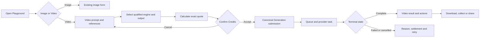

# Playground Unified Image And Video Generation

**Status:** Playground-first internal qualification slice implemented on
2026-08-18; public customer-paid promotion remains qualification-blocked
**Owner:** Generation capability with Playground presentation  
**Primary role:** Product And Requirement Architect  
**Reviewers:** UX/UI Product Designer, Generative Cinematic Production Director  
**Skills:** `review-product-ux`, `direct-generative-cinematic-production`,
`implement-generation-workflow` during implementation  
**UX/UI design checkpoint:** Added protected-baseline screen blueprint and
two-slot Video Comparison contract on 2026-08-18
**Implementation checkpoint:** The existing Image Playground remains the
default protected workflow. Video mode now provides prompt-only, authorized
uploaded Image and approved Character sources; a server-owned Veo Lite internal
qualification route; immutable Video Credit quote/reserve/capture/refund;
durable provider-task polling and media persistence; and a shared playable
result. Desktop composition is Render result above Prompt/Source on the left;
the sticky right column now places Engine & Target Output with quote/Generate
before collapsible Recent Video outputs. Completed clips open in the shared
Video detail viewer with task timing, provider/model, request settings, Credit
and Character attribution metadata when those values exist.

Veo Lite is exposed only outside production when
`VIDEO_PLAYGROUND_TESTING_ENABLED` is not explicitly false and is labelled
`internal_testing`. This does not set
`paidRoutingEnabled` and must not be treated as public production
qualification. Video Comparison remains blocked until exactly two comparable
models pass qualification. Community share/result actions and production
promotion remain launch gates.

### 2026-08-18 protected behavior checklist

- Image mode route, GenerationExperience, quote and result behavior remain
  unchanged.
- Video quote and submission carry identical provider, model, operation,
  duration, resolution, aspect, audio and reference count.
- Character selection pins Profile and Version IDs and is re-authorized by the
  Character domain before reference bytes are resolved.
- Credits reserve before provider submit, capture only after durable output,
  refund confirmed non-billable failures and retain uncertain failures for
  reconciliation.
- Actor switching changes draft/query ownership; raw private reference bytes
  are not persisted in browser drafts or provider-task snapshots.
- The shared amber loader and `VideoMediaPlayer` are reused; no Playground-local
  provider call or media player is introduced.
- The latest actor-owned Video task ID is persisted with the Video draft so a
  browser refresh resumes polling the same durable task without a second Credit
  reservation or provider submission.
- Provider downloads are copied into durable Momelo output storage and their
  temporary local files are removed after successful persistence or a
  reconciliation outcome.
- Video submission focuses the result once; terminal polling never repeatedly
  steals focus. Portrait Recent previews use `contain`, and the existing Image
  Playground retains its original Recent placement through an opt-in workspace
  layout variant.

## 1. Outcome

Playground shall offer image and single-clip video generation in one familiar
workspace. A creator can switch media mode, write a prompt, optionally attach
an authorized image or reusable Character, select only provider-supported
controls, inspect the exact Credit quote and generate without learning the
multi-stage Cinematic Studio workflow.

This is a new media mode inside the existing Playground workflow, not a second
Generation queue, Credit calculator, provider registry, reference pipeline or
media library.

## 2. Product Boundary

### 2.1 In scope

- One `Image | Video` segmented mode control on `/create/playground`.
- Text-to-video from a prompt without references.
- Image-to-video from an authorized uploaded image, owned Generation Asset or
  Community Asset whose reuse policy permits reference use.
- Character-to-video from a pinned reusable Character Profile Version and its
  canonical identity pack.
- Character plus image input when the selected provider supports both and the
  authority order is explicit.
- Capability-driven duration, aspect ratio, resolution, audio and reference
  controls.
- Quote, reservation, asynchronous generation, terminal result, download,
  collection and Community share handoff through existing owners.
- Video Comparison using exactly two qualified provider/model slots.
- Actor-scoped independent drafts for image and video modes.

### 2.2 Not in scope

- Story, Scene, Shot, continuity, storyboard, timeline or multi-clip assembly;
  those remain in Cinematic Studio.
- Unqualified providers or arbitrary provider parameters.
- Uploading an input video for video-to-video in the first release.
- Voice cloning, lip sync, dialogue editing or audio post-production.
- Public remix rights inferred from public visibility.
- A provider call from React or a Playground-owned queue.
- Three- or four-slot Video Comparison. Existing Image Comparison remains
  unchanged at two through four slots.

### 2.3 MVP decision gates

The first enabled release defaults to one requested video output and no
multi-output batch. Native audio is shown only when the selected provider model
exposes a supported audio mode and the active published rate card can quote it.
First/last-frame controls remain hidden until a qualified provider contract and
reference-processing policy support them. These gates may be relaxed by a
versioned requirement update; client-only enablement is forbidden.

## 3. User Flow



1. Opening Playground restores the last actor-scoped media mode and that
   mode's recoverable draft.
2. Switching mode never submits work. Image and video drafts remain separate.
3. Video mode presents the shortest valid path in the established Playground
   workspace: result and Video direction in the left authoring column; Recent
   Video outputs and Engine & Target Output in the right operation column.
4. Selecting a Character or source image immediately reconciles provider
   eligibility and visible controls without erasing unrelated prompt text.
5. Generate is enabled only after server validation and a non-stale quote.
6. Acceptance submits the exact quoted contract with an idempotency key.
7. Processing uses the shared result surface and terminal polling policy.
8. Completion scrolls/focuses to the result once, without stealing focus during
   subsequent polling.

## 4. Unified Playground UX Contract

### 4.1 Shared shell

The existing Playground route, prompt surface, reference affordances, Engine &
Target Output visual language, Credit confirmation, loading treatment, media
viewer and result actions shall be extended through typed media contracts.
Image behavior and tests are protected behavior.

### 4.1.1 Protected baseline rule

The implementation shall begin from the current rendered Image Playground, not
from a replacement mockup. Existing Image mode structure, controls, Comparison
slot count, quote placement, result actions, Recent section, keyboard order,
responsive behavior, i18n keys and theme behavior remain protected.

The allowed visual changes are limited to:

1. an `Image | Video` media-mode control;
2. Video-only fields within existing form/panel boundaries;
3. video player/result states in shared media surfaces;
4. a Video Comparison variant constrained to two slots;
5. video-specific copy, validation and status presentation.

No existing Image control may move, disappear or change default because Video
mode is added. Shared component changes require image characterization tests
before implementation and image regression tests after every phase.

Do not create a separate `/create/video` route for MVP. A direct URL may encode
`?media=video`, but canonical navigation remains `/create/playground` and the
query parameter must be reconciled into actor-scoped state.

### 4.2 Mode switch

- Use an accessible segmented control labelled Image and Video.
- Preserve one versioned draft per actor and media mode.
- Unsupported stale fields are marked and omitted from the submitted contract;
  they are not silently translated to another meaning.
- Switching back restores the previous mode's prompt, references and supported
  output selections.
- Actor switching clears in-memory query data and loads only the new actor's
  drafts.

### 4.3 Video form sections

1. **Prompt:** required text with bounded length and no provider syntax in
   Simple mode.
2. **Source:** None, Image or Character. A combined Character + Image plan is
   offered only when supported.
3. **Direction:** optional motion/camera intent using provider-neutral values.
4. **Engine & Target Output:** qualified quality tier in Simple mode; qualified
   provider/model in Advanced mode; duration, aspect, resolution and audio.
5. **Quote and Generate:** exact parameter summary, Credit total, expiration
   state and one primary Generate action.

Provider/model and Generate belong in the same operation panel. The panel uses
the same semantic amber emphasis as image generation and must remain readable
under every supported theme.

### 4.4 Result surface

The shared result surface accepts a typed media result:

```ts
type GeneratedMediaResult =
  | { mediaType: 'image'; assetId: string; imageUrl: string }
  | {
      mediaType: 'video';
      assetId: string;
      videoUrl: string;
      posterUrl?: string;
      durationMs?: number;
    };
```

Video completion displays an accessible player with play/pause, seek, mute,
volume, duration, fullscreen and download. It must not autoplay with sound.
Poster and metadata loading failures do not conceal a playable video. Opening
detail uses the shared media viewer contract rather than a route-local modal.

The empty and processing states reuse the shared Momelo placeholder and amber
loader effect. Failed, cancelled and refunded terminal states stop animation
and expose a stable reason plus valid next action.

### 4.5 UX/UI screen blueprint

The UX/UI owner shall extend the current Playground composition as follows.

#### Existing Image mode

Render the current screen without structural redesign. The media-mode control
may appear in the Playground heading/action region, but selecting Image must
produce the same principal DOM regions and behavior as before this feature.

#### Video normal mode - desktop

```text
Playground heading                         [ Image | Video ]

Current Playground workspace
  Left authoring column
    Momelo empty/loading surface or completed video player
    Video direction
      Prompt
      Source: None | Image | Character

  Right sticky operation column
    Engine & Target Output
      provider/model, duration, ratio, resolution, audio
      exact Credit quote + Generate video
    Recent Video outputs (collapsible, below the operation panel)
```

Use `PlaygroundGenerationWorkspace` and its current grid, sticky controls,
collapse, fade and breakpoint contracts. Do not introduce a third desktop rail
or a Video-only form design. Engine, quote and Generate remain one operation
group. The result region keeps a stable placeholder before completion.

Recent Video outputs are read from actor-owned durable Video tasks. They never
mix another actor's work, expose raw prompts or depend only on localStorage.
Selecting a recent completed item restores it into the result player without
submitting work or moving Credits.

Video mode deliberately places Recent Video outputs below Engine & Target
Output so provider, model, quote and Generate remain the first uninterrupted
operation. Image mode keeps its existing ordering unless a separate approved
requirement changes it. Recent previews use a stable inspection frame with a
black matte and `object-fit: contain`; portrait clips must never be cropped to
look landscape.

Submitting a valid Video request scrolls and moves programmatic focus to the
Video result region immediately. Completion updates that same region but does
not steal focus or force another scroll after the user has continued working.

Every completed main result and completed Recent item can open the shared Video
detail viewer. The viewer preserves the complete frame and exposes only task
metadata actually persisted by Generation:

- Job ID, status, provider, model, operation and creation time;
- requested clip duration, aspect ratio, resolution and audio mode;
- elapsed processing time derived from task creation and completion times;
- estimated/captured Credit value when available;
- attributed Character Profile with an authorized route back to that profile;
- download action and keyboard previous/next navigation across completed clips.

The detail viewer must not invent a Character name, provider duration, captured
price or raw prompt when the task projection does not contain it. Prompt
visibility remains subject to the owning privacy/publication contract.

The shared Character picker must render the authorized Character thumbnail,
face thumbnail, featured display image or canonical image in that precedence
order through authenticated media loading. The icon placeholder is used only
when every authorized media source is absent or fails.

### 4.5.1 Image-to-Video presentation mapping and CSS optimization

Video mode shall consume the established Image Playground presentation
contracts instead of approximating them with a parallel set of route-local
styles. This convergence must not alter Image mode markup, defaults, behavior
or rendered CSS.

| Video concern | Canonical Image/Shared contract | Video-only extension allowed |
|---|---|---|
| Result heading and empty/loading surface | `#generation-results`, shared heading hierarchy, `Surface`, `generation-result__media-surface`, `GenerationStageState` | Video player sizing only |
| Video direction prompt | `PromptEditor` with `variant="playground"` and `playground-prompt-editor*` classes | Optional primary footer containing Source selection |
| Engine header | `EngineTargetPanelFrame`, `studio-step-badge`, and `engine-comparison-toggle` | Video capability copy and two-slot availability |
| Engine controls | `engine-target-panel__controls`, model/output grids, aspect buttons and shared form controls | Duration and Audio selects; qualification/quote rows |
| Generate command | `studio-generation-action` and `studio-generate-button` | Video label and exact Video Credit estimate |
| Workspace and Recent | `PlaygroundGenerationWorkspace` and `playground-recent-panel*` | Actor-owned Video task cards |

Implementation order:

1. Extend shared component contracts only through optional props whose defaults
   preserve the existing Image DOM and behavior.
2. Replace Video-only structural wrappers with the shared components/classes.
3. Keep Video CSS only for video-player dimensions, source controls, recent
   video thumbnails and data rows that have no Image equivalent.
4. Remove duplicated Video typography, field, panel, heading and action styles.
5. Run Image characterization tests, Video tests, typecheck, theme/i18n checks
   and desktop/mobile screenshots before closure.

Regression guard: a Video visual correction must not edit Image route state,
Image Generation contracts, Image control ordering or Image-specific CSS
values. Shared selector additions are permitted only when the new selector
matches no existing Image element.

#### Video normal mode - mobile

Reading order is Prompt -> Source -> Direction -> Engine & Target Output ->
Quote/Generate -> Result -> Recent. The operation action may become sticky only
when it does not cover validation, browser controls or the video player. Focus
moves to the first invalid field on failure and to the result heading once on
successful completion.

#### Loading and terminal states

- Before submission: shared Momelo empty placeholder.
- Quote calculation: inline operation-panel progress; do not replace the form.
- Queued/processing: shared amber loader treatment and durable status.
- Completed: accessible player and result actions.
- Failed/cancelled/reconciliation: loader stops; stable message and valid retry
  or Support reference appears.

### 4.6 Video Comparison UX contract

Video Comparison extends the existing shared Comparison experience through a
media-specific policy; it is not a second comparison implementation.

#### Slot policy

- Image Comparison remains **2-4 slots** with existing behavior.
- Video Comparison requires **exactly 2 active slots**.
- Video mode shows two fixed cards labelled A and B. There is no Add slot action
  and no third/fourth placeholder.
- Each slot chooses one qualified provider/model for the same video operation.
- Shared prompt, source authority, duration, aspect ratio, resolution and audio
  intent are displayed once. A slot-specific difference is allowed only when
  the capability resolver proves semantic parity or explains the normalized
  provider value before quote acceptance.
- A model cannot occupy both slots when the purpose is provider/model
  comparison, unless a future explicit attempt-variation mode is approved.

#### Configuration layout

The existing Compare action switches the operation panel into comparison mode:

```text
Video Comparison                         2 / 2
Shared operation summary

[ Slot A: provider / model / capability ]
[ Slot B: provider / model / capability ]

Per-slot estimate       Combined locked estimate
                         [ Generate comparison ]
```

Single-model provider controls are hidden while Comparison is active, matching
the current protected behavior. Closing Comparison restores the prior normal
Video selection without affecting the Image draft.

#### Comparison result - desktop

- Two equal stable player regions appear side by side in the existing full-width
  Comparison result workspace.
- Each player shows provider/model, status, duration and charged/settled Credit
  summary.
- Shared Play/Pause and normalized seek are offered when both videos are ready
  and durations are compatible.
- Both videos begin muted. Enabling audio on one automatically mutes the other
  to avoid overlapping sound.
- Independent Play, fullscreen, download and retry remain available.
- Winner selection remains explicit and cannot occur before one playable result
  exists.

#### Comparison result - mobile

Players stack vertically in A/B order or use an accessible A/B segmented
viewer when viewport height makes two players unusable. Provider/model and
status remain visible with each player. Synchronized playback is optional on
mobile; it must be hidden rather than presented as broken when unsupported.

#### Partial and failed results

One completed and one failed slot remains a valid inspectable Comparison run.
The completed result can play and download; the failed slot displays settlement
and retry. Retry affects only that slot and must preserve the original
comparison/run lineage. It cannot charge or regenerate the completed slot.

### 4.7 Shared component reuse map

| Existing owner | Required extension | Protected behavior |
|---|---|---|
| `EngineTargetPanel` | media policy and fixed Video slot limit | Image fields and 2-4 slot behavior |
| `ComparisonConfigurator` | render exactly two Video slot cards | Image add/remove/reorder behavior |
| `ComparisonWorkspace` | typed Video players and optional sync controls | Image zoom/pan/winner behavior |
| `GenerationResultSurface` | typed video/comparison states | existing image/group/comparison states |
| `GenerationQueueStatus` | two Video child statuses | current Job/Group/Image Comparison links |
| shared media viewer | video player presentation | image viewer actions and focus trap |

Presentational components receive typed state/callbacks. They do not estimate,
submit, poll providers or settle Credits.

## 5. Reference Authority And Rights

### 5.1 Source authority

| Source | Authority | Required record |
|---|---|---|
| Character | recognizable identity, age range, body proportions and canonical face | pinned Character Profile ID and Version ID |
| Source image | first-frame composition, appearance or environment according to selected use | durable Asset ID and declared role |
| Prompt | action, camera, motion, environment and exclusions not owned by a stronger reference | compiled structured direction |

When Character and image are combined, the request must state whether the image
is a first frame, composition reference or style/environment reference. The
system must never let the person in an uploaded image silently override the
selected Character.

### 5.2 Authorization

- Owned private Assets are usable only by their owner.
- Another creator's Community Asset is usable only when its published reuse
  policy explicitly allows the selected reference purpose.
- Public visibility alone does not grant download, remix or reference rights.
- Character authorization is checked at quote and submission time.
- Private source URLs, canonical face Assets and raw prompt internals are not
  copied into public post payloads.
- Browser drafts store stable IDs and bounded metadata, never durable Base64.

## 6. Capability And Provider Contract

The public provider catalog is authoritative for:

```text
operations: text_to_video, image_to_video, character_to_video
durationsSeconds
aspectRatios
resolutions
audioModes
maxImageReferences
supportsCharacterIdentityPack
supportsFirstFrame
supportsLastFrame
qualificationStatus
```

Video controls are the intersection of provider capability, qualification,
published commercial configuration and selected reference plan. React must not
duplicate this matrix. A model is selectable only when qualified for the exact
operation, not merely because it can generate some kind of video.

Provider discovery must not become ambiguous when the selected source mode
filters the model list. The Provider control reads provider names from the full
server catalog, labels ModelArk explicitly as `BytePlus ModelArk (Seedance)`,
and keeps a provider visible but disabled when it has no model for the active
operation. In the initial qualification gate, Seedance is selectable for
Prompt only and appears as unavailable for uploaded-image or Character modes
until deterministic person/reference eligibility checks exist.

Provider adaptation follows Requirements 016-005 and 016-006. The Playground
submits a provider-neutral execution packet to Generation; provider-specific
payload translation remains in `server/providers/`.

## 7. Canonical Workflow And API Contract

### 7.1 Ownership

| Concern | Owner |
|---|---|
| Playground form and handoff | Playground feature |
| Generation request, Job, provider task and terminal state | Generation |
| References and normalized derivatives | Reference Processing / Assets |
| Quote, reservation, capture and refund | Credits |
| Character identity pack | Character Profiles |
| Durable media | Assets |
| Community publication | Community |

The canonical Generation application facade is the only submission entry
point. Playground must not call Veo, Seedance or another provider directly.

### 7.1.1 Comparison ownership

The existing Comparisons capability remains the set/run/slot owner. Its request
and persisted contracts gain `mediaType` and media-specific slot policy:

```text
mediaType=image -> minimum 2, maximum 4
mediaType=video -> minimum 2, maximum 2
```

Validation occurs on the server. Client limits are presentation only. Each
Video slot delegates its child request to canonical Generation and records the
same reference-plan fingerprint plus its own provider/model, quote allocation,
Job and provider task IDs.

### 7.2 Request snapshot

The accepted request records at minimum:

```text
generationId / groupId / jobId
actorUserId
surface = playground
mediaType = video
operation
providerId / modelId / qualificationVersion
capabilitySnapshotVersion
rateCardVersion / quoteId
promptFingerprint and structured execution packet version
characterProfileId / characterProfileVersionId when present
reference Asset IDs, declared roles and reference-plan fingerprint
duration / aspectRatio / resolution / audioMode / outputCount
idempotencyKey / correlationId
```

The submitted values and displayed quote must match. A mismatch returns a
stable stale-quote error and no provider side effect.

### 7.3 Async lifecycle

```text
draft -> quoted -> accepted -> queued -> provider_processing
provider_processing -> completed | failed | cancelled | reconciliation_required
```

Provider task IDs and polling state must survive process restart before video
is enabled for customers. Unknown provider outcomes enter reconciliation; they
are never blindly resubmitted. Polling has one owner, bounded backoff and a
terminal stop condition.

## 8. Credits And Commercial Integrity

- Quote input includes exact provider/model, operation, duration, resolution,
  audio, reference plan, output count and active rate-card version.
- The server calculates all prices. The client displays but never supplies an
  authoritative price.
- Quote acceptance creates an immutable consent snapshot and reservation.
- Successful billable usage is captured from the provider's authoritative
  usage unit under Requirement 016-005.
- Definitive non-billable failure releases/refunds the reservation exactly
  once. Unknown outcome remains held only under a bounded policy and enters
  reconciliation.
- Retry creates a new attempt and quote unless the owner workflow explicitly
  declares a non-billable technical retry.
- Admin configuration follows Requirement 018-010; draft changes do not affect
  quotes until their revision is active.
- A Video Comparison estimate is the sum of exactly two server estimates plus
  only explicitly published comparison adjustments. Each slot records its own
  rate-card version and reservation allocation.
- Submission obtains one immutable comparison consent snapshot and idempotency
  scope, then creates at most one billable child operation per slot.
- Completion/failure settles each slot independently. One failed slot cannot
  refund the successful slot or cause it to run again.

## 9. State, Validation And Notifications

Required visible states:

```text
loading capabilities
empty valid draft
invalid prompt or source
source authorization failed
no qualified model
quote calculating / ready / stale / failed
insufficient Credits
queued / processing / delayed
completed / failed / cancelled / reconciliation required
share preparing / published / failed
```

Field errors appear near their controls and a summary focuses the first invalid
field on submit. Toasts confirm accepted background work, completion, download
readiness and publication; a Toast never replaces durable status. Stable error
codes map to localized user-safe messages.

## 10. Persistence, Performance And Accessibility

- Video capability discovery is server-owned and may change after internal
  qualification or Admin publication. Entering Video mode must refetch the
  catalog rather than retain an earlier in-memory provider/model list.
- Capability reads use no-store semantics. Actor-scoped prompt and control
  drafts remain independent from catalog freshness.

- Draft key: actor ID + Playground + media mode + schema version.
- Draft references use stable server IDs; expired references reconcile visibly.
- Provider catalog and active commercial snapshot have a bounded server-owned
  cache with version-based invalidation.
- History and reference pickers are cursor-paginated and media-type filterable.
- Video metadata is loaded before bytes; players preload `metadata`, not entire
  videos, in grids.
- Every control is keyboard reachable with visible focus.
- Mode, quote and Job status changes are announced without repeated polling
  chatter.
- Desktop and mobile maintain prompt -> operation -> result reading order.
- All visible copy uses existing i18n namespaces or a declared new namespace
  with locale parity.

### 10.1 Environment-owned Video runtime policy

Operational timing values that may need tuning between local development,
qualification and production must not remain scattered as React literals.
They are read once by a canonical server configuration module at
`server/config/video-runtime-policy.js`, validated and bounded, then exposed as
a sanitized `clientPolicy` object in the Video capability response. React uses
that response as the single runtime source of truth; it must not introduce a
second set of `VITE_*` values for the same policy.

Proposed environment contract:

| Environment variable | Default | Valid range | Purpose |
|---|---:|---:|---|
| `VIDEO_CAPABILITY_CLIENT_CACHE_ENABLED` | `false` | Boolean | Enables a bounded in-memory freshness window for the capability query. `false` means every Video-mode mount treats the catalog as stale. |
| `VIDEO_CAPABILITY_CLIENT_STALE_MS` | `0` | `0-300000` | React Query freshness duration when capability caching is enabled. A value of `0` always refetches on mount. |
| `VIDEO_CAPABILITY_REFETCH_ON_FOCUS` | `true` | Boolean | Refetches provider/model qualification when the browser returns to the foreground. |
| `VIDEO_TASK_POLL_INTERVAL_MS` | `5000` | `2000-30000` | Initial polling interval for a non-terminal Video task. |
| `VIDEO_TASK_POLL_MAX_INTERVAL_MS` | `15000` | initial value through `60000` | Upper bound when bounded polling backoff is introduced. |
| `VIDEO_RECENT_OUTPUT_STALE_MS` | `15000` | `0-300000` | Freshness duration for actor-scoped recent Video outputs. |
| `VIDEO_QUOTE_STALE_MS` | `30000` | `0-120000` | Client query freshness only. It never extends the server estimate expiry or authorizes submission. |
| `VIDEO_PLAYGROUND_TESTING_ENABLED` | non-production `true` | Boolean | Existing internal qualification exposure gate. It must not enable customer-paid routing. |

The public response contains normalized values only:

```text
clientPolicy.capabilityCacheEnabled
clientPolicy.capabilityStaleMs
clientPolicy.refetchOnWindowFocus
clientPolicy.taskPollIntervalMs
clientPolicy.taskPollMaxIntervalMs
clientPolicy.recentOutputStaleMs
clientPolicy.quoteStaleMs
```

The following are invariants and must **not** become ordinary `.env` toggles:

- actor isolation and actor-relative query keys;
- `Cache-Control: private, no-store` for capability and task HTTP responses;
- terminal-state polling stop conditions;
- quote expiry, reservation, capture, refund and stale-estimate validation;
- authorization for uploaded images and Character references;
- provider/model operation support and paid qualification status;
- catalog/version invalidation after an Admin publication.

Changing an environment value requires process restart in the JSON-backed MVP.
Invalid, negative or excessive values fail startup with a sanitized
configuration error rather than silently accepting an unsafe duration. The
server logs the resolved policy once without secrets. Support diagnostics may
show the normalized public values and catalog version, never raw environment
content.

### 10.2 Other configuration extraction candidates

The following existing literals should be reconciled through their owning
capabilities rather than copied into the Video policy:

- provider transport timeout remains provider-owned through
  `MODEL_ARK_API_TIMEOUT_MS` and the equivalent Veo adapter setting;
- Generation concurrency remains Generation-owned through
  `MAX_CONCURRENT_GENERATIONS`;
- Credit estimate expiry remains Credits-owned and is returned by each quote;
- Community share-draft expiry remains Community-owned;
- handoff expiry remains the owning Handoff/Reference Processing policy;
- output limits, durations, resolutions, audio modes and reference limits
  remain versioned capability-catalog data, not environment variables;
- user-facing layout dimensions, result-grid composition and theme tokens
  remain design-system configuration, not environment variables.

This separation prevents `.env` from becoming a second business catalog while
still making operational cache and polling behavior tunable.

## 11. Implementation Sequence

1. Characterize and protect existing image Playground behavior and tests.
2. Add typed media/provider capability schemas without changing image output.
3. Extend shared result/media viewer contracts for video.
4. Add actor-scoped independent mode drafts and reconciliation tests.
5. Add the validated server-owned Video runtime policy and consume its public
   `clientPolicy` values before implementing further Video query literals.
6. Implement video form using server capability intersections.
7. Extend Comparison schemas/validator with media-specific slot policy while
   preserving Image 2-4 behavior.
8. Extend the shared configurator/workspace with exactly two Video slots and
   typed players.
9. Integrate canonical Generation and Credits behind disabled feature exposure.
10. Add reference authorization and Character identity-pack paths.
11. Qualify at least two comparable provider/model operations for internal
   Video Comparison.
12. Integrate share handoff from Requirement 016-010.
13. Run commercial, restart, responsive and release gates before public launch.

## 12. Acceptance And Regression Gates

- `PGV-01`: Image mode behavior and existing automated tests remain unchanged.
- `PGV-02`: Video mode supports valid prompt-only generation without any
  reference.
- `PGV-03`: Image and Character sources are authorized at quote and submit.
- `PGV-04`: Character + image requests preserve explicit authority and cannot
  silently blend identities.
- `PGV-05`: Unsupported controls are absent and cannot enter the request.
- `PGV-06`: Displayed quote and submitted contract are identical and versioned.
- `PGV-07`: duplicate submit/retry cannot duplicate provider task or charge.
- `PGV-08`: restart resumes provider polling and terminal settlement.
- `PGV-09`: terminal failure stops every loader and exposes recovery.
- `PGV-10`: completed video opens, plays, downloads and hands off to Community.
- `PGV-11`: actor switch exposes no prior actor draft, reference or Job.
- `PGV-12`: desktop/mobile, keyboard, theme and locale evidence pass.
- `PGV-13`: Video Comparison accepts exactly two slots while Image Comparison
  continues accepting two through four.
- `PGV-14`: Video Comparison displays two stable players, one-audio-at-a-time
  behavior and independent terminal states.
- `PGV-15`: Comparison quote, reservation and settlement contain exactly two
  independently auditable child allocations.
- `PGV-16`: adding Video mode does not move, remove or change the default of an
  existing Image Playground control.
- `PGV-17`: cache disabled produces a capability request on every Video-mode
  mount; cache enabled honors the bounded server policy and catalog-version
  invalidation.
- `PGV-18`: invalid runtime-policy environment values fail validation, while
  no environment setting can disable actor isolation, HTTP no-store, terminal
  polling stops or Credit stale-estimate enforcement.
- `PGV-19`: Video mode orders Engine before Recent without changing the Image
  workspace baseline, and portrait Recent previews remain fully visible.
- `PGV-20`: Generate focuses the result once on submission; terminal polling
  does not repeatedly steal scroll or focus.
- `PGV-21`: completed Video results open an accessible detail viewer whose
  provider/model, timing, Character attribution, request settings, Job ID and
  Credit metadata match the actor-owned task projection.
- `PGV-22`: result focus is scheduled after the submitted-state layout has
  committed, uses the Video result scroll margin, and runs only for the direct
  Generate action. Polling and terminal transitions never move the viewport.
- `PGV-23`: internal Playground exposure lists only exact operations whose
  model has `testingRoutingEnabled=true`. Veo Fast and Standard remain absent
  while unqualified, even though they exist in the research catalog; UI code
  must never broaden this server-owned qualification to offer a costly model.

## 13. Launch Blockers

Public enablement remains blocked until:

- at least one exact Playground video operation passes Requirement 016-006;
- at least two semantically comparable qualified video operations exist before
  Video Comparison is enabled;
- active rate cards are approved through Requirement 018-010;
- durable provider-task recovery survives restart;
- Credit reserve/capture/refund/reconciliation evidence passes;
- image Playground regression, authorization and privacy gates pass;
- manual generated-video quality evidence confirms usable output.
