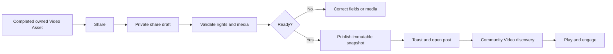

# Community Video Publishing And Discovery

**Status:** Requirement ready; implementation not started  
**Owner:** Community capability with Asset delivery  
**Primary role:** Product And Requirement Architect  
**Reviewers:** UX/UI Product Designer, QA And Release Engineer  
**Skills:** `review-product-ux`, `verify-release-regressions` during implementation  
**Implementation in this change:** Requirement only

## 1. Outcome

Creators shall publish completed Momelo videos to Community intentionally and
viewers shall discover, play and engage with them without exposing private
references, hidden prompts or reuse rights that were never granted.

Community owns publication and public snapshots. Generation owns how the video
was made, Assets owns durable media delivery, and Credits owns billing. This
requirement extends the current post contract with typed video media; it does
not create a separate video social platform.

## 2. Scope

### In scope

- Share a completed, actor-owned Playground or Cinematic video Asset.
- Save a private share draft before publication.
- Video title, description, tags, prompt visibility and explicit reuse policy.
- Community Gallery filter/tab for `All | Images | Videos` on the canonical
  Explore route.
- Existing `/posts/:postId` detail route rendering image or video by media type.
- Poster, duration, aspect ratio, provider display and generation provenance
  that is safe for public display.
- Like, view, comment, report, creator profile and collection behavior through
  existing Community owners.
- Owner unpublish/retire and Admin moderation handoff.

### Deferred

- Video remix generation from another creator's clip.
- Download granted merely because a post is public.
- Social-network syndication, live streaming, playlists and advertising.
- Public access to source Character identity packs or private reference Assets.

## 3. Publication Flow



1. Share is offered only for a completed durable Asset, never a provider URL,
   queued task or browser blob.
2. Opening Share creates or resumes an actor-owned draft.
3. The user explicitly chooses prompt visibility and reuse rights; defaults are
   private prompt and view-only media.
4. Publish revalidates ownership, media readiness, moderation prerequisites and
   current policy.
5. Success shows a localized Toast and navigates to the canonical post detail.
6. Failure retains the draft and provides a stable recovery action.

## 4. Public Media Contract

Community post media becomes a discriminated union:

```ts
type CommunityMedia =
  | {
      mediaType: 'image';
      assetId: string;
      imageUrl: string;
      thumbnailUrl?: string;
    }
  | {
      mediaType: 'video';
      assetId: string;
      videoUrl: string;
      posterUrl: string;
      durationMs: number;
      width?: number;
      height?: number;
    };
```

The public snapshot records a Community-owned placement/derivative, not a raw
private source URL. A video post requires a playable derivative and poster.
If poster processing fails, the post remains draft/processing and does not
publish as a broken public card.

## 5. Rights And Privacy

- Publication proves the actor owns or is authorized to publish the output.
- Public visibility grants viewing only.
- `allowReferenceUse`, `allowRemix`, and `allowDownload` are separate explicit
  rights and default false for video MVP.
- Prompt visibility defaults private and may be changed only by the owner.
- Public metadata excludes private prompt fragments, input Asset URLs,
  canonical face Assets, Character identity packs, provider payloads and
  secrets.
- Character attribution is included only under the Character's approved public
  policy; private Character IDs are not leaked.
- Retiring a post revokes Community delivery placement without deleting the
  owner's source Asset or immutable audit evidence.
- Report/quarantine/restore follows Requirement 017 content moderation through
  owner commands, not direct repository edits.

## 6. Discovery And Routes

The existing `/` Explore Gallery remains canonical. Add a media-type filter
instead of a second top-level navigation item for MVP:

```text
All | Images | Videos
```

The filter is represented in URL search state so refresh and sharing preserve
it. A future `/explore/videos` alias may redirect to the canonical filtered
Gallery, but must not own a second feed implementation.

Feed APIs accept `mediaType=image|video|all`, cursor and bounded limit. Sort,
search, category and period filters compose with media type and use stable
cursor ordering. Creator profile Works and Collections use the same typed media
card contracts.

## 7. Video Presentation

- Feed cards use poster images and duration badges; they do not preload video
  bytes.
- Hover may show a muted bounded preview only after explicit performance and
  accessibility approval; it is not required for MVP.
- Post detail uses an accessible responsive player with play/pause, seek,
  mute/volume, elapsed/total duration, fullscreen and captions when present.
- No autoplay with sound. Reduced-motion and data-saving preferences are
  respected.
- Poster and player maintain stable aspect ratio and never shift card layout.
- Loading, unavailable, processing, quarantined and failed media states have
  clear localized presentation.
- Theme, keyboard focus and mobile controls follow the existing Community
  visual language.

## 8. Domain And API Ownership

Community extends its current application workflow and schemas; no new
`VideoCommunityService` is allowed.

Required operations:

```text
create/update Community share draft from owned Asset
validate publishability and public snapshot policy
publish video post idempotently
list typed posts by mediaType and cursor
read typed post detail
record bounded engagement through existing endpoints
owner retire/unpublish
Admin moderation owner command
```

Every mutation uses `req.actorContext`, expected version and idempotency where
retryable. Asset delivery rechecks public placement authorization. The client
uses the existing API client and Zod boundary.

## 9. State And Notifications

Publication states:

```text
draft -> validating -> processing_derivatives -> ready -> publishing
publishing -> published | failed
published -> retired | quarantined
quarantined -> published | retired
```

The UI exposes field validation, derivative progress, retryable failure,
unauthorized, policy-changed and removed states. Closing a modal does not erase
accepted work. Toasts announce saved draft, published, retired and failed
actions, while durable state remains visible on the post or owner library.

## 10. Performance And Retention

- Feed requests are cursor-paginated and return metadata/posters before video.
- Public video delivery uses authorized range requests or equivalent streaming
  delivery; Express must not buffer whole files in memory.
- Poster/derivative cache keys include Asset/placement version and invalidate on
  replace, retire or quarantine.
- Feed/player polling has a bounded terminal condition.
- Retention of source, public derivative and retired placement is governed by
  Asset/Community policy, not component lifecycle.

## 11. Implementation Sequence

1. Characterize existing image post/share/feed/detail behavior.
2. Add discriminated media schemas server and client with image compatibility.
3. Add Asset video delivery and poster authorization contract.
4. Extend share drafts and publication snapshots for video.
5. Add Gallery media filter and typed cards.
6. Add video post detail/player and shared viewer integration.
7. Add owner retire, report and Admin moderation integration.
8. Run privacy, actor isolation, responsive, performance and image regression
   gates before enablement.

## 12. Acceptance And Regression Gates

- `COMV-01`: existing image posts, templates and comparisons remain valid.
- `COMV-02`: only completed actor-owned/authorized video Assets can be shared.
- `COMV-03`: default publication exposes neither prompt nor reuse/download
  rights.
- `COMV-04`: publish retry creates one post and one public placement.
- `COMV-05`: Videos filter is URL-restorable and composes with other filters.
- `COMV-06`: feed cards load poster metadata without preloading video bytes.
- `COMV-07`: detail player is responsive, keyboard operable and never autoplays
  with sound.
- `COMV-08`: private references and Character identity packs never appear in a
  public response.
- `COMV-09`: retire/quarantine revokes delivery while preserving audit/source.
- `COMV-10`: actor switch cannot edit another creator's draft or post.
- `COMV-11`: failure retains recoverable draft and shows a stable reason.
- `COMV-12`: image Community regression suite and mobile/theme evidence pass.

## 13. Launch Blockers

- Playground/Cinematic produces durable, authorized video Assets.
- Asset video delivery and poster derivatives are restart-safe.
- Community moderation can contain the original and every public derivative.
- Public snapshot privacy tests and range-delivery performance pass.
- Product approves video rights defaults and retention policy.

