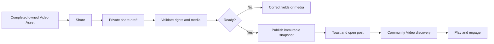

# Community Video Publishing And Discovery

**Status:** Guarded publication/discovery foundation implemented on 2026-08-18;
rating projection and public launch remain blocked
**Owner:** Community capability with Asset delivery  
**Primary role:** Product And Requirement Architect  
**Reviewers:** UX/UI Product Designer, QA And Release Engineer  
**Skills:** `review-product-ux`, `verify-release-regressions` during implementation  
**UX/UI design checkpoint:** Added typed Video and two-result Video Comparison
presentation blueprint on 2026-08-18
**Implementation checkpoint:** Community now supports a typed `video` post in
the existing post repository, Videos discovery filtering, poster-first cards,
the shared video player, authorized video/poster delivery, owner-scoped video
share drafts, idempotent publication and server-verified Character attribution.
Eligible attributed videos appear through the existing Character `Appears in`
works contract. Video Comparison rendering accepts exactly two typed players
without altering Image Comparison's two-to-four contract.

Not yet launch-complete: a user-facing share action from a completed Video
result, durable poster extraction during provider media persistence, Video
Comparison publication/qualification, versioned Character rating read-model,
moderation-driven attribution/rating rebuild and the responsive/manual privacy
matrix. Private Character provenance is retained server-side and omitted from
public projections.

## 1. Outcome

Creators shall publish completed Momelo videos to Community intentionally and
viewers shall discover, play and engage with them without exposing private
references, hidden prompts or reuse rights that were never granted.

Community owns publication and public snapshots. Generation owns how the video
was made, Assets owns durable media delivery, and Credits owns billing. This
requirement extends the current post contract with typed video media; it does
not create a separate video social platform.

## 2. Scope

### In scope

- Share a completed, actor-owned Playground or Cinematic video Asset.
- Save a private share draft before publication.
- Video title, description, tags, prompt visibility and explicit reuse policy.
- Community Gallery filter/tab for `All | Images | Videos` on the canonical
  Explore route.
- Existing `/posts/:postId` detail route rendering image or video by media type.
- Poster, duration, aspect ratio, provider display and generation provenance
  that is safe for public display.
- Like, view, comment, report, creator profile and collection behavior through
  existing Community owners.
- Publish and display a completed two-slot Video Comparison through the existing
  Comparison post workflow.
- Verified Character attribution from the originating Playground Generation or
  Cinematic cast, with reverse links from each eligible Character to the videos
  and stories in which that Character appears.
- Versioned Character community-rating contribution from eligible attributed
  video engagement.
- Owner unpublish/retire and Admin moderation handoff.

### Deferred

- Video remix generation from another creator's clip.
- Video Comparison with more than two result slots.
- Download granted merely because a post is public.
- Social-network syndication, live streaming, playlists and advertising.
- Public access to source Character identity packs or private reference Assets.

## 3. Publication Flow



1. Share is offered only for a completed durable Asset, never a provider URL,
   queued task or browser blob.
2. Opening Share creates or resumes an actor-owned draft.
3. The user explicitly chooses prompt visibility and reuse rights; defaults are
   private prompt and view-only media.
4. Publish revalidates ownership, media readiness, moderation prerequisites and
   current policy.
5. Success shows a localized Toast and navigates to the canonical post detail.
6. Failure retains the draft and provides a stable recovery action.
7. When the source contains Character provenance, Share shows the verified cast
   attribution before publication and explains which links will be public.

## 4. Public Media Contract

Community post media becomes a discriminated union:

```ts
type CommunityMedia =
  | {
      mediaType: 'image';
      assetId: string;
      imageUrl: string;
      thumbnailUrl?: string;
    }
  | {
      mediaType: 'video';
      assetId: string;
      videoUrl: string;
      posterUrl: string;
      durationMs: number;
      width?: number;
      height?: number;
    };
```

The public snapshot records a Community-owned placement/derivative, not a raw
private source URL. A video post requires a playable derivative and poster.
If poster processing fails, the post remains draft/processing and does not
publish as a broken public card.

A Video Comparison post preserves the existing `postType='comparison'` and
contains exactly two completed/inspectable video result snapshots. Do not add a
parallel `video_comparison` repository or post service. The snapshot records
`mediaType='video'`, the two public video placements/posters, safe model labels,
duration and slot IDs used by existing comparison voting.

## 5. Rights And Privacy

- Publication proves the actor owns or is authorized to publish the output.
- Public visibility grants viewing only.
- `allowReferenceUse`, `allowRemix`, and `allowDownload` are separate explicit
  rights and default false for video MVP.
- Prompt visibility defaults private and may be changed only by the owner.
- Public metadata excludes private prompt fragments, input Asset URLs,
  canonical face Assets, Character identity packs, provider payloads and
  secrets.
- Character attribution is included only under the Character's approved public
  policy; private Character IDs are not leaked.
- The publisher cannot type an arbitrary Character ID or claim an unrelated
  Character. Public attribution must resolve from canonical Generation
  reference provenance, a pinned Cinematic cast/Shot record or another
  server-verified Character usage event.
- Character reuse authorization and public attribution are separate decisions.
  Permission to use a Character does not expose its private identity pack, and
  public video visibility does not override a private Character Profile.
- When a verified source Character remains private, the system retains
  owner/support-only provenance but omits the public Character link and rating
  contribution.
- Retiring a post revokes Community delivery placement without deleting the
  owner's source Asset or immutable audit evidence.
- Report/quarantine/restore follows Requirement 017 content moderation through
  owner commands, not direct repository edits.

## 6. Discovery And Routes

The existing `/` Explore Gallery remains canonical. Add a media-type filter
instead of a second top-level navigation item for MVP:

```text
All | Images | Videos
```

The filter is represented in URL search state so refresh and sharing preserve
it. A future `/explore/videos` alias may redirect to the canonical filtered
Gallery, but must not own a second feed implementation.

Feed APIs accept `mediaType=image|video|all`, cursor and bounded limit. Sort,
search, category and period filters compose with media type and use stable
cursor ordering. Creator profile Works and Collections use the same typed media
card contracts.

## 7. Video Presentation

- Feed cards use poster images and duration badges; they do not preload video
  bytes.
- Hover may show a muted bounded preview only after explicit performance and
  accessibility approval; it is not required for MVP.
- Post detail uses an accessible responsive player with play/pause, seek,
  mute/volume, elapsed/total duration, fullscreen and captions when present.
- No autoplay with sound. Reduced-motion and data-saving preferences are
  respected.
- Poster and player maintain stable aspect ratio and never shift card layout.
- Loading, unavailable, processing, quarantined and failed media states have
  clear localized presentation.
- Theme, keyboard focus and mobile controls follow the existing Community
  visual language.

### 7.1 Protected Community baseline

Existing Image, Template and Image Comparison cards, routes, post actions,
filters, engagement and profile sections remain structurally unchanged. Video
adds typed branches inside current Community components. It must not replace
the Gallery feed, create a second creator profile implementation or alter image
defaults.

### 7.2 UX/UI screen blueprint

#### Explore Gallery

Add `All | Images | Videos` to the existing filter region. Image cards retain
their current dimensions and actions. Video cards reuse the media-card frame,
show a poster and duration badge, and open the existing post route. Comparison
cards show a restrained two-poster A/B composition and a Comparison label;
they do not autoplay in the feed.

#### Single Video post detail

Keep the existing media-column/information-column structure. Replace only the
media stage with the typed video player. Prompt visibility, creator identity,
metadata, engagement, collection and report controls remain in their existing
regions.

#### Video Comparison post detail - desktop

```text
Back / post identity

[ Video A player ] [ Video B player ]    Comparison information
  model/status       model/status         creator, prompt policy,
  vote/winner        vote/winner          metadata, actions

Shared playback controls when eligible
Comments and more from creator
```

Exactly two players use equal stable columns. Both begin muted; activating one
audio stream mutes the other. Existing one-vote-per-viewer and owner-cannot-vote
rules apply to the two slot IDs. The owner may mark a winner through the
existing authorized Comparison workflow; public votes do not silently change
the owner's selected winner.

#### Video Comparison post detail - mobile

Use an accessible A/B segmented player or stacked A/B players, preserving slot
labels, vote state and model metadata. Do not squeeze two active players into
unreadable half-width columns. Comments follow the comparison media region.

#### Processing and failure

A share draft may show derivative preparation for each slot. Public publish
requires two authorized public placements or an explicitly approved policy for
a completed/failed comparison; MVP defaults to requiring both videos playable.
If public delivery later fails, preserve the post shell and engagement while
showing an unavailable slot and moderation/recovery state.

### 7.3 Shared component reuse map

| Existing owner | Video extension | Protected behavior |
|---|---|---|
| Community media card | poster/duration and two-poster comparison variant | Image/Template cards |
| Community post media stage | single video or two-slot comparison player | Image stage/fullscreen |
| Comparison snapshot/vote components | `mediaType='video'`, exactly two slots | Image voting and ownership rules |
| shared media viewer/player | Community-authorized video source | image focus/download behavior |

Components receive already-authorized public URLs and snapshots. They do not
derive rights or expose owner-only source Assets.

## 7.4 Character appearance and attribution UX

### Share dialog

When the completed video has verified Character provenance, add a read-only
`Characters appearing in this video` section to the existing Share flow:

```text
Character portrait / public name
Role: lead | supporting | cameo | unspecified
Source: verified Character Profile Version
Public link status: linked | private and hidden | attribution required
```

The list is generated by the server from provenance. The publisher may correct
the role label or remove an optional attribution only when the Character reuse
policy permits it; those edits cannot replace the Character ID/version. A
required creator attribution cannot be hidden.

For Cinematic exports, roles come from the pinned Project cast and the
approved Shots in the exported timeline. A cast member who does not appear in
any included approved Shot is not attributed merely because they belong to the
Project. For Playground video, attribution comes from the pinned Character
Profile Version in the accepted Generation request.

### Video post detail

Display a `Featuring Characters` section below safe production metadata and
before engagement/comments. Each public Character chip/card links to the
canonical Character Profile and shows role when available. The section uses
bounded compact rows and does not expose canonical face, private version IDs or
reference Assets.

### Character Profile

Add an `Appears in` or localized equivalent section to the Character Profile:

- public attributed videos and Cinematic stories;
- poster, title, role, creator and publication date;
- media type and duration;
- cursor pagination and a View all route/filter;
- owner-only provenance status for private/unpublished works where authorized.

The public Character page shows only currently eligible public posts. The
Character owner view may show private provenance separately, clearly labelled,
without making it public.

## 8. Domain And API Ownership

Community extends its current application workflow and schemas; no new
`VideoCommunityService` is allowed.

Required operations:

```text
create/update Community share draft from owned Asset
validate publishability and public snapshot policy
publish video post idempotently
list typed posts by mediaType and cursor
read typed post detail
record bounded engagement through existing endpoints
owner retire/unpublish
Admin moderation owner command
publish existing Comparison set as a two-slot typed Video Comparison post
resolve verified Character attribution from source provenance
list eligible Character appearances with cursor pagination
project versioned Character rating read models from Community engagement
```

Every mutation uses `req.actorContext`, expected version and idempotency where
retryable. Asset delivery rechecks public placement authorization. The client
uses the existing API client and Zod boundary.

### 8.1 Character attribution contract

Community publication stores an immutable attribution snapshot and a durable
link/read model rather than copying Character identity data into the post:

```text
attributionId
postId / publicPlacementId
characterProfileId / characterProfileVersionId
characterOwnerUserId
role = lead | supporting | cameo | unspecified
sourceType = playground_generation | cinematic_project | cinematic_shot
sourceId / sourceGenerationId / sourceProjectId / sourceShotIds
verificationStatus = verified | hidden_private | invalidated
publicLinkAllowed / attributionRequired
publishedAt / invalidatedAt
```

The server verifies source ownership/authorization and exact Profile Version at
publish time. One post may attribute multiple Characters, but the same
Character appears only once per post. A two-slot Video Comparison deduplicates
the Character when both slots use the same version and preserves separate
attributions when the slots use different Characters.

Character Profiles consume the Community/Character Usage public contract; they
do not scan Community JSON or mutate post records.

### 8.2 Character rating read model

Character rating is a rebuildable, versioned Community read model, not a
mutable number written directly onto the Character Profile. It records:

```text
characterProfileId
window = week | month | year | all_time
score
eligibleAttributedPostCount
eligibleVideoViewCount / reactionCount / commentCount
comparisonWinOrVoteSignals when applicable
algorithmVersion / calculatedAt
```

The Community engagement/ranking capability owns calculation. The first policy
may use bounded authenticated views, reactions, comments and verified
Comparison signals, but exact weights must be configured and versioned rather
than embedded in React. Rating rules must:

- count only verified public Character attributions;
- exclude Character owner and post owner self-engagement;
- apply existing dedupe, rate-limit and moderation eligibility rules;
- count one engagement event at most once for a Character/post/rating window;
- remove or neutralize retired, deleted, quarantined or invalidated posts;
- avoid multiplying score when the same Character appears in both Comparison
  slots or multiple Shots of the same published film;
- retain algorithm version so results can be rebuilt and explained;
- never change Character reuse rights, pricing or ownership.

The UI labels this value as a Community/popularity rating unless a separate
quality-review rubric is introduced. It must not imply that engagement proves
technical identity fidelity or artistic quality.

## 9. State And Notifications

Publication states:

```text
draft -> validating -> processing_derivatives -> ready -> publishing
publishing -> published | failed
published -> retired | quarantined
quarantined -> published | retired
```

Character attribution follows the post state. It becomes publicly eligible
only when publication succeeds, becomes rating-ineligible on quarantine/retire,
and is restored idempotently only when the owner post returns to an eligible
published state.

The UI exposes field validation, derivative progress, retryable failure,
unauthorized, policy-changed and removed states. Closing a modal does not erase
accepted work. Toasts announce saved draft, published, retired and failed
actions, while durable state remains visible on the post or owner library.

## 10. Performance And Retention

- Feed requests are cursor-paginated and return metadata/posters before video.
- Public video delivery uses authorized range requests or equivalent streaming
  delivery; Express must not buffer whole files in memory.
- Poster/derivative cache keys include Asset/placement version and invalidate on
  replace, retire or quarantine.
- Feed/player polling has a bounded terminal condition.
- Retention of source, public derivative and retired placement is governed by
  Asset/Community policy, not component lifecycle.
- Character appearance queries use indexed/cursor-bounded attribution records;
  they never scan all posts or decode video media.
- Rating aggregates are event/read-model based and rebuildable. Post detail and
  Character Profile requests never recalculate all engagement synchronously.

## 11. Implementation Sequence

1. Characterize existing image post/share/feed/detail behavior.
2. Add discriminated media schemas server and client with image compatibility.
3. Add Asset video delivery and poster authorization contract.
4. Extend share drafts and publication snapshots for video.
5. Add Gallery media filter and typed cards.
6. Add video post detail/player and shared viewer integration.
7. Extend existing Comparison publication/detail/voting for exactly two Video
   slots without changing Image Comparison.
8. Add verified Character attribution, Character `Appears in` read model and
   post-detail links.
9. Add versioned Character rating projection through existing Community
   engagement/ranking events.
10. Add owner retire, report and Admin moderation integration, including
   attribution/rating invalidation.
11. Run privacy, actor isolation, responsive, performance and image regression
   gates before enablement.

## 12. Acceptance And Regression Gates

- `COMV-01`: existing image posts, templates and comparisons remain valid.
- `COMV-02`: only completed actor-owned/authorized video Assets can be shared.
- `COMV-03`: default publication exposes neither prompt nor reuse/download
  rights.
- `COMV-04`: publish retry creates one post and one public placement.
- `COMV-05`: Videos filter is URL-restorable and composes with other filters.
- `COMV-06`: feed cards load poster metadata without preloading video bytes.
- `COMV-07`: detail player is responsive, keyboard operable and never autoplays
  with sound.
- `COMV-08`: private references and Character identity packs never appear in a
  public response.
- `COMV-09`: retire/quarantine revokes delivery while preserving audit/source.
- `COMV-10`: actor switch cannot edit another creator's draft or post.
- `COMV-11`: failure retains recoverable draft and shows a stable reason.
- `COMV-12`: image Community regression suite and mobile/theme evidence pass.
- `COMV-13`: a Video Comparison post contains exactly two typed video slots and
  uses the existing Comparison post/vote ownership model.
- `COMV-14`: two players remain usable on desktop/mobile and never play two
  audio streams simultaneously.
- `COMV-15`: Image, Template and Image Comparison cards/details retain their
  existing structure and defaults.
- `COMV-16`: a published video links only server-verified Character Profile
  Versions from its Generation/Cinematic provenance.
- `COMV-17`: public post detail links to eligible Characters and each Character
  lists eligible attributed videos/stories under `Appears in`.
- `COMV-18`: a private Character keeps owner/support provenance but exposes no
  public ID, profile link or rating contribution.
- `COMV-19`: owner engagement, duplicate events and repeated Character use in
  one film do not multiply Character rating.
- `COMV-20`: retire/quarantine invalidates Character appearance/rating
  eligibility and restore applies it exactly once.
- `COMV-21`: rating responses include algorithm version and can be rebuilt from
  immutable eligible attribution/engagement evidence.

## 13. Launch Blockers

- Playground/Cinematic produces durable, authorized video Assets.
- Asset video delivery and poster derivatives are restart-safe.
- Community moderation can contain the original and every public derivative.
- Public snapshot privacy tests and range-delivery performance pass.
- Product approves video rights defaults and retention policy.
- Character public-attribution policy, `Appears in` presentation and versioned
  rating weights pass Product, privacy and anti-abuse review.
