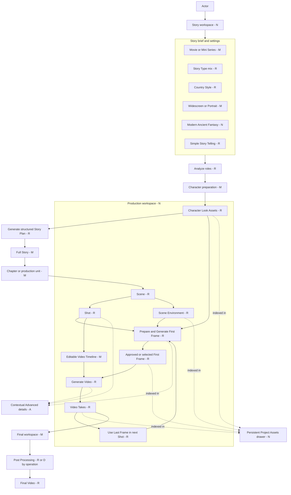

# Cinematic Studio Rewamp: Structure Reduction And Draw.io Mapping

Status: analysis and decision draft. No runtime implementation is authorized by
this document yet.

Primary role: Product Requirement Architect.
Review lenses: UX/UI Product Designer and Cinematic Experience Director. Reviews
were applied sequentially from repository evidence; they are not independent
agent reviews.

Owning capability: Cinematic Studio orchestration. Generation, Credits, Assets,
Character Profiles, Reference Processing and Post Processing retain their current
ownership.

Inputs reviewed:

- `cinematic-studio-simplified.drawio`
- `shot-example.md`
- current six-stage Cinematic requirement and Simple/Advanced requirements
- current React Cinematic route, components, schemas and state modules
- current Cinematic application/domain services, Generation compilers and Asset
  services

## 1. Executive Decision

The new experience should not rebuild Cinematic Studio as another independent
workflow. It should be a smaller presentation and command layer over the existing
Project, Story Plan, Scene, Shot, Asset, Take and Credit contracts.

The recommended visible structure is three workspaces:

1. **Story**: one brief, compact story settings, AI-organized story and Character
   preparation in the same workspace.
2. **Production**: Chapter/Scene/Shot hierarchy in one board. One Shot work item
   owns its First Frame, video direction, generation status and Takes.
3. **Final**: selected Takes, assembly, Post Processing, export and download.

`Project Assets` should be a persistent drawer available from all three
workspaces, not another stage. Advanced controls should become contextual details
for the selected Story, Scene or Shot. The current Advanced workflow remains
available during migration and is not deleted in the first release.

The key product change is therefore:

```text
Current: Setup -> Cast -> Story Plan -> Storyboard -> Produce -> Finish

Target:  Story -> Production -> Final
                       |
                       +-- persistent Project Assets
                       +-- contextual Advanced details
```

## 2. What Is Actually Too Complex Today

The repository already contains most required behavior. The complexity comes
from exposing internal production boundaries as separate user journeys.

Current indicators:

- Simple still has four visible stages: Setup, Cast, Storyboard and Finish.
- Advanced has six visible stages: Setup, Cast, Story Plan, Storyboard, Produce
  and Finish.
- Image generation and video generation are implemented as separate large
  surfaces even though the creator thinks of them as one Shot.
- Story hierarchy, Cast binding, Scene environment, First Frame, references,
  Takes and approval state are spread across stages and dialogs.
- `CinematicStageContent.tsx` is approximately 2,097 lines and owns several
  unrelated stage presentations.
- `CinematicDialogs.tsx` is approximately 897 lines and groups different editing
  responsibilities.
- The Cinematic frontend currently has 86 feature files, including 57 TSX
  component/test files. This is not itself a deletion target: many files protect
  real behavior. The important reduction is fewer concepts and context switches
  in the primary UI, followed by careful retirement of obsolete presentation code.

The following complexity must remain because it protects user work or money:

- immutable source and version fingerprints;
- provider capability and reference-count checks;
- price estimate, explicit consent and Credit settlement;
- queued/processing/failed/completed recovery;
- multiple Takes and explicit selected/approved Take;
- actor ownership and private media access;
- stale downstream detection after Story, Character, Scene or Shot changes.

These are system safeguards, not fields that a normal creator should have to
understand.

## 3. Target Information Architecture

### 3.1 Story workspace

Visible by default:

- story brief composer;
- format: Movie or Mini Series;
- Story Type/Genre, including multiple choices;
- Country Style;
- frame orientation: Widescreen or Portrait;
- story period: Modern, Ancient or Fantasy;
- primary action: `Prepare story`;
- AI result organized as Full Story, then Chapter/Scene/Shot outline;
- Character suggestions and readiness beside the story, not on another page.

Progressively disclosed:

- audience feeling, pacing, ending intent and creative direction;
- source story versions and AI proposal comparison;
- Beat-level and full cinematic direction fields;
- raw role analysis and technical readiness details.

Important internal sequence:

1. Save the brief and settings.
2. Analyze the smallest required visible Cast using the existing role-analysis
   operation.
3. Let the user bind or generate each required Character Look with explicit cost
   where generation is paid.
4. Generate the structured Story Plan after required Character authority is ready.
5. Present the output as one editable Story hierarchy rather than redirecting the
   user through a separate Story Plan stage.

This keeps current authority requirements honest without making the user learn
the internal sequence.

### 3.2 Production workspace

Use one organized hierarchy:

```text
Chapter or production unit
  Scene
    Scene environment
    Shot 1
      First Frame
      Video direction timeline
      Generate Video
      Takes
    Shot 2
      ...
```

One Shot work item represents one generated clip, as established by the existing
Simple authoring requirement. Its collapsed row shows only:

- Shot name and duration;
- concise event/action summary;
- First Frame thumbnail or selected continuity frame;
- video status and selected Take;
- the next available action.

Expanding a Shot reveals two adjacent production sections:

1. **First Frame**: prompt, Character Looks, Scene environment, optional previous
   video last frame, provider/model and Generate/Select/Approve actions.
2. **Video**: editable time badges and event text from `shot-example.md`, dialogue
   and sound, references, provider/model, estimate, Generate and Take review.

Advanced camera, lighting, blocking, performance, continuity, prohibitions and
compiled technical prompt remain available through `Details`. They are still
compiled automatically when hidden.

### 3.3 Final workspace

Visible by default:

- ordered selected Takes;
- Shots requiring a Take selection or regeneration;
- simple preview timeline;
- optional Post Processing operations;
- final estimate where an operation is billable;
- render/export and bulk clip download.

The Final workspace does not own provider calls or media bytes. It composes the
existing approved Take and Asset contracts.

### 3.4 Persistent Project Assets

`Project Assets` becomes a right drawer on desktop and a full-height sheet on
mobile/tablet. It is grouped by semantic role:

- Characters: Look Sheets and descriptions;
- Environments: generated/selected Scene images and descriptions;
- First Frames: generated, approved and extracted continuity frames;
- Clips: all Takes with selected/approved/stale/failed state;
- Final outputs.

The drawer is a read model over existing owner-scoped records. It must not create
a second media repository or store Base64 in browser state.

## 4. Target Diagram Aligned With The Draw.io

Legend: `R` reuse as-is or through the same public contract, `M` move/recompose,
`N` new presentation/read model, `A` Advanced-only, `D` deferred.



This diagram intentionally does not show Credits, Generation dispatch, reference
validation, fingerprints or task recovery as user stages. They remain mandatory
services behind each paid action.

## 5. Draw.io Node-To-System Mapping

| Draw.io node | Target location | Disposition | Existing owner to reuse | Required adjustment |
|---|---|---|---|---|
| Actor (`2`) | Whole workspace | Reuse | actor-scoped route and Query keys | No ownership change |
| Select Cinematic Style (`39`) | Story settings | Move/add | Series contracts and Setup draft | Add explicit Movie/Mini Series choice; define how it maps to current standalone Project/Series |
| Select Story Type (`43`) | Story settings | Reuse | `StoryIntentChoices`, story authoring JSON | Rename for plain language; retain 2-3 Genre choices |
| Select Country Style (`41`) | Story settings | Reuse | `storyCountryStyle`, story authoring JSON | Keep optional and show flag swatches |
| Resolution (`37`) | Story settings | Move/clarify | Setup platform/aspect and provider catalogs | Present Widescreen/Portrait as frame orientation; keep pixel resolution provider-specific at generation time |
| Simple Story Telling (`36`) | Story workspace | Reuse/recompose | `CinematicSetupForm`, enhancement and draft storage | Make it the dominant composer; move secondary fields into settings |
| Period of time | Story settings | New | Story setup/config/recipes | Add a configured `storyPeriod`; do not hard-code options in React |
| Set Characters (`67`) | Story workspace Character section | Move | current Cast actions and role slots | Replace separate mandatory stage in the new flow with readiness cards |
| AI Generate Process / LLM (`34`, `35`) | Background operation | Reuse | enhancement, role analysis and Story Plan services | Show one understandable progress sequence; do not create a parallel AI pipeline |
| Full Story (`53`) | Story result | Recompose | active Story Source and Story Plan versions | Add a readable synopsis/full-story projection without duplicating source data |
| Chapter Story (`70`) | Story hierarchy | Clarify/reuse | Series/Season/Chapter workspace | Decide whether Chapter means an episode Project, an Act, or an in-Project chapter |
| Scene (`74`) | Story and Production hierarchy | Reuse | existing Scene records | Display summary in Story and production controls in Production |
| Shot (`104`) | Production board | Reuse | existing Shot records/manual storyboard | One Shot work item equals one clip |
| Edit / Approve (`77`, `78`, `107`) | Inline hierarchy actions | Recompose | versioned save/approval commands | Use explicit approval only for immutable generation sources; ordinary text uses save/apply |
| Set Character Look Description (`79`) | Character details | Move | Cast dossier and generated Cast service | AI-prefill; user edits in Character details |
| Select Character for Story (`94`) | Character readiness cards | Reuse | Character picker and generated Look picker | Auto-suggest role binding, require explicit user selection/confirmation |
| Generate Character Look Sheet (`91`) | Character action | Reuse | `CharacterLookDialog`, `GeneratedCastDialog`, Generation/Credits | Keep estimate and consent; save result into Project Assets |
| Character Look Sheet & Description (`130`) | Project Assets / Characters | Recompose | current Cast Assignment and Look records | Add unified asset projection, no copied files |
| Generate Environment Scene (`115`) | Scene header in Production | Reuse | `SceneEnvironmentControl` and Scene environment service | Compact default state; dialog/details only when editing or generating |
| Environment Image & Description (`134`) | Project Assets / Environments | Recompose | approved Scene environment and gallery | Index by Scene and allow reuse with existing ownership checks |
| Prepare First Frame (`138`) | Shot / First Frame | Recompose | reference planner and storyboard prompt compiler | Run preparation/preflight behind one action and show only actionable findings |
| Generate First Frame (`145`) | Shot / First Frame | Reuse | Storyboard generation adapter/dialog and Generation | Embed a compact action; keep full dialog for details |
| First Frame (`150`) | Shot summary and Project Assets | Reuse | approved Storyboard source and Asset service | Show selected, stale and source status clearly |
| Generate Scene (`153`) | Shot orchestration | Rename/recompose | current Shot save, prompt compiler and Produce context | Avoid a second action named Generate Scene; Shot preparation should lead to Generate Video |
| Generate Video (`162`) | Shot / Video | Reuse | `CinematicProduceRuntime`, video packet and Generation facade | Embed compact controls and reuse current quote/submit lifecycle |
| Scene Video (`167`) | Shot Takes and Project Assets / Clips | Rename/recompose | video attempts, `VideoTakeList`, media review | Call these Takes/Clips; retain multiple outputs and selected Take |
| Use Last Frame from Previous Video (`172`) | Shot / First Frame continuity source | Reuse | `CinematicLastFrameService` and current command | Disable until previous Shot has an eligible approved Take; preserve fallback choices |
| Post Processing (`177`) | Final workspace | Reuse/defer | standalone Post Processing API and final assembly | Expose only implemented operations; no implied full suite |
| Final Video (`174`) | Final outputs | Reuse | timeline/export and clip bundle services | Build from selected current Takes and surface stale blockers |
| Project Asset (`128`) | Persistent drawer | New read model/UI | aggregate existing Cinematic/Asset/Generation records | Add one bounded actor-owned index; no new durable asset store |

## 6. Existing Frontend: Keep, Move, Replace Or Retire

### 6.1 Reuse in the new primary flow

| Existing module | New use |
|---|---|
| `CinematicSetupForm.tsx` | Reuse validation/draft behavior; extract the brief composer and compact settings instead of rendering the current full form unchanged |
| `StoryIntentChoices.tsx` | Story Type, audience feeling and pacing controls inside optional Story settings |
| `GeneratedCastDialog.tsx` and Profile `CharacterLookDialog` | Character generation/selection from readiness cards |
| `SceneEnvironmentControl.tsx` | Scene-level environment action and gallery in Production |
| `SimpleStoryboardWorkspace.tsx` | Starting orchestration for the Production board |
| `SimpleStoryboardRow.tsx` | Starting point for one Shot work item and editable timeline |
| `StoryboardShotDialog.tsx` | Keep advanced First Frame generation/review contract; expose a compact embedded adapter in the row |
| `CinematicProduceRuntime` | Keep quote/generate/status behavior; extract from `CinematicStageContent.tsx` into its own owner before broad reuse |
| `VideoTakeList.tsx` and `ProduceMediaReview.tsx` | Take history, selection, approval and central preview inside each Shot |
| `DialogueSoundEditor.tsx` | Video timeline details inside a Shot |
| `ClipBundleDownload.tsx` | Final workspace and optional Production toolbar |
| `ProjectCostSummary.tsx` | Persistent project cost summary, not a separate stage |
| shared `ProcessingSpinner`, Generation surfaces and Engine/Target panels | All generation states and provider selection |

### 6.2 Remove from the new primary experience, but retain during migration

| Current presentation | Target treatment | Why |
|---|---|---|
| `CinematicStageRail` in Simple | Remove from new primary UI | It exposes implementation phases instead of creator tasks |
| separate Story Plan page | Merge into Story | Full Story, hierarchy, edit and AI proposals belong together |
| separate Produce page | Merge into each Shot in Production | First Frame, direction, generation and Takes form one work item |
| separate Cast page | Merge into Story Character readiness | Character preparation is a dependency of Story planning, not a destination |
| global Simple/Advanced switch repeated in stages | Replace with contextual `Details` plus an Advanced workspace entry | A mode switch should not force users to understand two products |
| raw compiled prompt in normal UI | Advanced/admin/support only | It is diagnostic output, not an authoring requirement |
| repeated provider controls | Use Project defaults with per-action override | Reduces repeated decisions while preserving freedom |
| readiness dashboards before every stage | Inline next-action messages | Keep checks, remove the feeling of a compliance workflow |
| multiple Edit/Approve labels for text | Autosave or Save/Apply for drafts | Approval should mean immutable media/source selection only |

### 6.3 Code consolidation and extraction candidates

These are maintainability candidates, not authorization to delete files now.

1. Extract `StoryWorkspace`, `ProductionWorkspace`, `FinalWorkspace` and
   `CinematicProduceRuntime` from the 2,097-line `CinematicStageContent.tsx`.
   The remaining container should route data and callbacks only.
2. Split `CinematicDialogs.tsx` by responsibility: story proposal, role analysis,
   Beat details and Scene direction. This increases cohesion even if file count
   initially stays flat.
3. Consolidate `CinematicControlLevel` and `CinematicAuthoringModeHeader` behind
   one mode/details control contract if both still have active consumers.
4. Keep `SimpleStoryboardWorkspace` and `SimpleStoryboardRow` separate. They have
   valid board/session versus row ownership and should not be merged into another
   large file.
5. Keep provider preferences actor-scoped. A future shared Cinematic preferences
   module may own storyboard and video defaults, but only after storage-key and
   migration parity tests exist.
6. Do not merge prompt compilers merely to reduce file count. Storyboard still and
   video packets have different provider limits and reference authority.

No source module should be deleted until all current routes/imports/tests are
checked and the Advanced fallback no longer depends on it.

## 7. Existing Backend And Domain Reuse

No `RewampService`, second queue or second Project repository should be added.

| Capability | Existing canonical owner | Target use |
|---|---|---|
| Project commands | `CinematicApplicationService` | Remains the only public Cinematic application facade |
| Brief enhancement/roles | current enhancement and role-analysis services | Power `Prepare story` substeps |
| Structured plan | `CinematicStoryPlanService` | Produce Full Story/Scene/Shot structured result |
| hidden-field completion | `CinematicSimpleAuthoringService` | Complete Advanced direction when Simple fields are absent |
| manual Shot timeline | `CinematicManualStoryboard` | Validate editable time blocks and row changes |
| Series/Season/Chapter | `CinematicSeriesService` | Organize Mini Series without creating another hierarchy store |
| Character authority | Cast coverage, generated Cast and Character Look owners | Bind identities and Looks to roles |
| Scene image | `CinematicSceneEnvironment` | Generate/select reusable environment assets |
| First Frame | storyboard prompt/keyframe/source compatibility services | Compile, verify and approve a still source |
| Video | video packet/reference/take eligibility services | Quote, generate, recover and select Takes |
| Last frame | `CinematicLastFrameService` | Supply continuity source to the next Shot |
| Final assembly | timeline, video assets and clip bundle services | Preview, export and bulk download |
| Provider dispatch | Generation | Unchanged |
| Pricing/Credits | Credits | Unchanged and never hidden at consent time |

The AI/chat-like layer may propose structured mutations, but it must call these
owners. It must not directly edit JSON, call a provider or silently approve media.

## 8. What Must Be Added

### 8.1 New presentation modules

Recommended cohesive modules, subject to final naming during implementation:

- `StoryWorkspace`: brief, settings, AI progress, Full Story and Character
  readiness.
- `StoryHierarchy`: Chapter/Scene/Shot summaries with inline edit/apply.
- `ProductionBoard`: hierarchy, selection and bounded virtualization/pagination.
- `ShotWorkItem`: one clip row composed from existing First Frame, timeline,
  video and Take owners.
- `ProjectAssetDrawer`: bounded grouped projection of existing assets.
- `FinalWorkspace`: selected-Take sequence, Post Processing and export.
- `CinematicAssistantComposer`: optional plain-language command surface that
  returns a structured preview/diff before applying changes.

These are responsibility boundaries, not a request to create one file for every
small visual element.

### 8.2 New or clarified contracts

- project kind: Movie or Mini Series;
- story period configured by server JSON;
- explicit frame orientation separate from provider pixel resolution;
- readable Full Story projection tied to a Story Source/Plan version;
- Project Asset index/read model with type, owner, Scene/Shot binding, generation
  state, selected/approved state and stale reason;
- structured AI proposal/patch contract with affected entity IDs and preview;
- downstream impact projection before applying parent edits;
- workspace section projection for new navigation while preserving old deep links.

### 8.3 Do not add

- another Cinematic Project schema for the new UI;
- another Generation or Credit pipeline;
- a chat-only unstructured Story copy separate from current Story versions;
- duplicated Asset records for the drawer;
- automatic paid Character, image, video or Post Processing generation;
- silent approval, silent reference removal or silent Take replacement.

## 9. Change And Regeneration Rules

The new UI is simpler only if edits remain predictable.

| User changes | Keep | Mark for review/stale | Never do automatically |
|---|---|---|---|
| title or presentation-only summary | all media and Takes | nothing | regenerate |
| Genre/Country/period/story brief | historical versions and media | Story Plan and affected descendants | delete prior work |
| Character Look binding | old Looks and Takes | affected First Frames/videos | replace identity silently |
| Scene environment | old environment and generated media | future/affected First Frames | delete prior source |
| Shot text/timeline | First Frame if composition authority is unchanged | affected video packet/Takes | approve a new Take |
| selected First Frame | all attempts | dependent video Takes | submit paid video |
| selected Take | all Takes | final timeline/export | delete alternate Takes |

Before applying an AI rewrite, show scope such as `2 Scenes and 5 Shots will need
review`. Preserve old versions and offer undo/revert through existing versioned
contracts where supported.

## 10. Recommended Delivery Order

This order reduces duplicate work and protects currently usable behavior.

1. **Decision freeze and contract map**
   Resolve the questions in Section 13. Define Movie/Mini Series hierarchy,
   workspace routes, approval vocabulary and change-impact rules.
2. **Read-model and navigation compatibility**
   Add a three-workspace presentation projection while preserving current stage
   URLs and Advanced entry points. No generation behavior changes.
3. **Story workspace**
   Recompose current Setup, role analysis, Cast readiness and Story Plan result.
   Reuse current mutations and AI services.
4. **Production board shell**
   Recompose current Scene environment and Simple Shot rows. Keep existing
   Storyboard/Produce dialogs available as fallbacks.
5. **Shot work item**
   Embed compact First Frame, editable timeline, Generate Video and Takes. Extract
   the current Produce runtime from the stage monolith once, then reuse it.
6. **Project Asset drawer**
   Build a bounded owner-scoped read model over existing records. Do not migrate
   media storage.
7. **Final workspace**
   Recompose timeline, selected Takes, Post Processing availability, export and
   bulk download.
8. **Advanced preservation and migration UAT**
   Verify old Projects, Series, deep links, stale sources, multiple Takes, last
   frame, Credits and recovery in both presentations.
9. **Retirement gate**
   Only after UAT, remove obsolete Simple stage presentation and dead imports.
   Retain Advanced modules still in use and record measured file/LOC changes.

Do not begin by deleting the old stage rail or duplicating all six screens. Build
the new projection around canonical contracts, switch the default after parity,
then retire only unreachable presentation code.

## 11. Acceptance Criteria For The Future Implementation

1. A new creator can move from a short brief to the first Shot generation without
   navigating more than Story and Production.
2. The default Story view requires only the brief plus clearly chosen compact
   settings; all technical fields may be AI-completed and inspected later.
3. Full Story, Chapter/production unit, Scene and Shot are visible in one hierarchy.
4. One expanded Shot provides First Frame, video timeline, generation state and
   Takes without a route change.
5. Project Assets are reachable from Story, Production and Final and never expose
   another actor's media.
6. Existing Project IDs, Scene/Shot IDs, approved sources, Takes, Series membership
   and Credit records load unchanged.
7. Every paid action still shows an estimate and requires explicit consent.
8. Changing parent content preserves history and marks only affected descendants
   for review.
9. Existing last-frame continuity, multiple Takes, dialogue/sound, environment
   selection, bulk download and final export remain available.
10. Advanced fields and raw diagnostics remain reachable to authorized users but
    do not dominate the default UI.
11. Pending work uses the shared processing indicator; terminal failures stop
    loading and offer a clear retry/recovery action.
12. The layout is operable at approximately 390, 820 and 1440 pixels without
    clipped controls, nested cards or horizontal overflow.

## 12. Main Risks And Controls

| Risk | Control |
|---|---|
| A simpler UI accidentally bypasses approvals or Credits | Reuse existing application commands and quote/submit contracts unchanged |
| New flow forks Project data | Use one schema and one Project ID; presentation is a projection only |
| AI rewrite invalidates expensive media | Preview affected scope, preserve versions and regenerate only affected descendants |
| Asset drawer becomes another repository | Build a read model over current Asset/Generation/Cinematic records |
| Chapter terminology conflicts with current Series model | Resolve Question 2 before schema/UI work |
| Existing Advanced users lose controls | Keep Advanced route during migration and add parity tests |
| Large Project board becomes slow | Bound loaded Chapters/Scenes/Takes; virtualize only after a measured baseline |
| Recomposition merely moves a monolith | Keep workspace orchestration thin and reuse focused domain components |

## 13. Questions For Product Decision

Recommended answers are included to make review faster. These questions should be
resolved before implementation where marked **blocking**.

1. **Blocking: What does Mini Series mean in the Draw.io?**
   Recommended: a Series contains Seasons; each Chapter/Episode remains one current
   Cinematic Project. Do not store many full episodes inside one Project record.

2. **Blocking: What does `Chapter Story` mean for a Movie?**
   Recommended: show `Sequence` or `Act` for Movie and `Chapter/Episode` for Mini
   Series, while Scene and Shot remain the common production hierarchy.

3. **Blocking: Must every Shot have a First Frame?**
   Recommended: no. Allow generated/selected First Frame, previous-video last
   frame, Look-only and text-only when the chosen model supports them. The Shot row
   must show which source will be used before quoting.

4. **Should `Prepare story` generate the Full Story immediately after Characters
   are ready, or stop for confirmation after role analysis?**
   Recommended: stop only when Character selection or paid Look generation needs
   consent; otherwise continue text preparation and show progress in one place.

5. **Should the new Story workspace replace current Simple immediately or launch
   as a beta beside it?**
   Recommended: make it a guarded beta for existing Projects, default it only for
   new test Projects, then switch after migration UAT.

6. **Where should Advanced live?**
   Recommended: contextual `Details` for each Story/Scene/Shot plus one explicit
   `Open Advanced workspace` action. Avoid a global mode toggle on every section.

7. **Which actions require the word Approve?**
   Recommended: only immutable First Frame/source selection, selected video Take
   and final export source. Story text and directions use Save/Apply/Lock.

8. **Should Scene environment generation be automatic?**
   Recommended: AI prepares the prompt automatically, but image generation remains
   an explicit paid action. Reusing an existing Project environment is free and
   explicit.

9. **Should provider/model controls be visible by default?**
   Recommended: use Project defaults and show cost/quality; expose provider/model
   override in each Generate action. Never hide the actual submitted model in the
   confirmation.

10. **Should the AI surface be a real multi-turn chat or a command composer?**
    Recommended for phase one: command composer with structured preview, affected
    scope and Apply. Add durable chat history only after its ownership and value are
    proven.

11. **When an AI edit changes a Scene, may it add/remove/reorder Shots?**
    Recommended: only when the user explicitly selects structural rewrite. Normal
    enhancement edits fields in place and preserves IDs, assets and Takes.

12. **How should editable timeline badges behave?**
    Recommended: moving one boundary adjusts the adjacent boundary, preserves total
    Shot duration and blocks overlap/gaps unless the user explicitly changes total
    duration.

13. **Can one Scene contain multiple Shots in the new board?**
    Recommended: yes. One Shot still equals one clip; one Scene owns shared location,
    environment and continuity across its Shot children.

14. **Should Project Assets show all historical attempts or only current assets?**
    Recommended: current/selected assets by default, with a History filter for
    superseded, stale and failed attempts.

15. **What is the minimum Final workspace for the first pilot?**
    Recommended: ordered selected Takes, missing/stale warnings, rough preview,
    bulk clip download and current export. Expose only Post Processing operations
    that are actually implemented.

16. **Should Full Story be editable as prose, structured hierarchy, or both?**
    Recommended: readable prose summary plus structured Chapter/Scene/Shot data as
    the production source. Prose edits become a proposal and do not silently rewrite
    existing IDs or generated media.

17. **Should Character generation occur before or after Full Story review?**
    Recommended: role descriptions can be prepared first; paid Look generation or
    binding occurs before the production plan is finalized. This avoids generating
    unused Looks while keeping identity authority available for Shots.

18. **Do Movie and Mini Series share one duration selector?**
    Recommended: Movie uses total production duration; Mini Series uses per-Chapter
    duration plus an episode count/Season plan. This needs explicit pricing and
    workload wording before activation.

## 14. Out Of Scope For This Analysis

- source code implementation or deletion;
- provider or paid media UAT;
- changing Credit pricing;
- database migration;
- automatic whole-film generation;
- activating unimplemented Post Processing operations;
- modifying the user's original Draw.io file.
