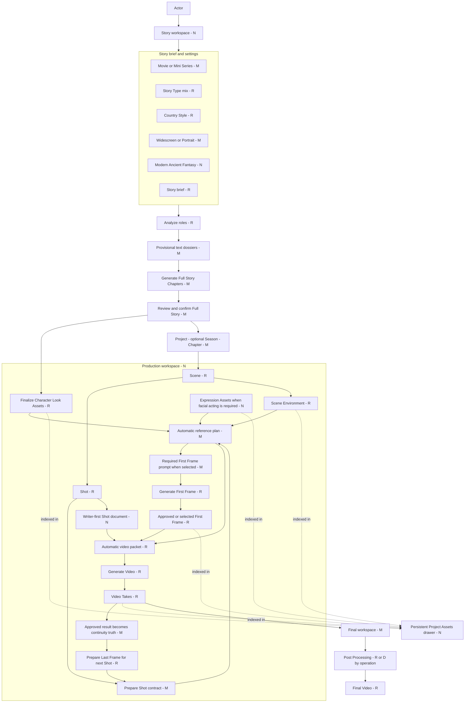

# Cinematic Studio Rewamp: Structure Reduction And Draw.io Mapping

Status: reconciled architecture inventory, 2026-09-19. Runtime work remains planned.
Start with [000-master.md](000-master.md). Requirements 002-010 own the detailed
contracts, UX, ordered tasks and acceptance checks; this file retains the original
repository inventory and Draw.io mapping. Section 13 records resolved decisions,
not an unresolved implementation gate. Original source files remain preserved.

Latest layout decision: 010 replaces all authoring presentation, while existing
Engine & Target Output, Render/results, Take controls, Shot Queue and Generation
Queue are protected. Earlier embedded-render sketches below are inventory guidance
only; the current flow opens existing Render from the writer and restores context.

Primary role: Product Requirement Architect.
Review lenses: UX/UI Product Designer and Cinematic Experience Director. Reviews
were applied sequentially from repository evidence; they are not independent
agent reviews.

Owning capability: Cinematic Studio orchestration. Generation, Credits, Assets,
Character Profiles, Reference Processing and Post Processing retain their current
ownership.

Inputs reviewed:

- `cinematic-studio-simplified.drawio`
- `shot-example.md`
- `period_mini_series_production_workflow.md`
- current six-stage Cinematic requirement and Simple/Advanced requirements
- current React Cinematic route, components, schemas and state modules
- current Cinematic application/domain services, Generation compilers and Asset
  services

## 1. Executive Decision

The new experience should not rebuild Cinematic Studio as another independent
workflow. It should be a smaller presentation and command layer over the existing
Project, Story Plan, Scene, Shot, Asset, Take and Credit contracts.

The recommended visible structure is three workspaces:

1. **Story**: one brief, compact story settings, AI-organized story and Character
   preparation in the same workspace.
2. **Production**: Chapter/Scene/Shot hierarchy in one board. One Shot work item
   owns its First Frame, video direction, generation status and Takes.
3. **Final**: selected Takes, assembly, Post Processing, export and download.

`Project Assets` should be a persistent drawer available from all three
workspaces, not another stage. The target has one writer-first authoring mode and
one canonical Shot document. Existing Simple/Advanced routes may resolve through
temporary migration adapters, but neither remains as a product mode after cutover.

The key product change is therefore:

```text
Current: Setup -> Cast -> Story Plan -> Storyboard -> Produce -> Finish

Target:  Story -> Production -> Final
                       |
                       +-- persistent Project Assets
                       +-- one timeline-oriented Shot document
```

## 2. What Is Actually Too Complex Today

The repository already contains most required behavior. The complexity comes
from exposing internal production boundaries as separate user journeys.

Indicators recorded during the original inventory (recount in P00 before claiming
implementation reduction):

- Simple still has four visible stages: Setup, Cast, Storyboard and Finish.
- Advanced has six visible stages: Setup, Cast, Story Plan, Storyboard, Produce
  and Finish.
- Image generation and video generation are implemented as separate large
  surfaces even though the creator thinks of them as one Shot.
- Story hierarchy, Cast binding, Scene environment, First Frame, references,
  Takes and approval state are spread across stages and dialogs.
- `CinematicStageContent.tsx` is approximately 2,097 lines and owns several
  unrelated stage presentations.
- `CinematicDialogs.tsx` is approximately 897 lines and groups different editing
  responsibilities.
- The Cinematic frontend currently has 86 feature files, including 57 TSX
  component/test files. This is not itself a deletion target: many files protect
  real behavior. The important reduction is fewer concepts and context switches
  in the primary UI, followed by careful retirement of obsolete presentation code.

The following complexity must remain because it protects user work or money:

- immutable source and version fingerprints;
- provider capability and reference-count checks;
- price estimate, explicit consent and Credit settlement;
- queued/processing/failed/completed recovery;
- multiple Takes and explicit selected/approved Take;
- actor ownership and private media access;
- stale downstream detection after Story, Character, Scene or Shot changes.

These are system safeguards, not fields that a normal creator should have to
understand.

## 3. Target Information Architecture

### 3.1 Story workspace

Visible by default:

- story brief composer;
- format: Movie or Mini Series;
- Story Type/Genre, including multiple choices;
- Country Style;
- frame orientation: Widescreen or Portrait;
- story period: Modern, Ancient or Fantasy;
- primary action: `Prepare story`;
- AI result organized as Full Story, then Chapter/Scene/Shot outline;
- Character suggestions and readiness beside the story, not on another page.

Progressively disclosed:

- audience feeling, pacing, ending intent and creative direction;
- source story versions and AI proposal comparison;
- Beat-level and full cinematic direction fields;
- raw role analysis and technical readiness details.

Important internal sequence:

1. Save the brief and settings.
2. Analyze the smallest required visible Cast using the existing role-analysis
   operation.
3. Prepare provisional text dossiers and the Full Story with editable Chapters.
   Text planning does not require paid images or finalized Looks.
4. Confirm the Full Story baseline, then finalize/reuse Character Looks and optional
   Expressions/Props. Generate Chapter Scenes and Scene Shots with explicit actions.
5. Present one editable Story hierarchy, with final visual authority required only
   at the relevant media action. See 003 for revision and proposal semantics.

Text dossiers guide story planning; finalized visual authority guides media.

### 3.2 Production workspace

Use one organized hierarchy:

```text
Project
  Season (optional)
    Chapter (one or more; directly under Project when no Season)
      Scene
        Scene environment
        Shot 1
          Optional First Frame
          Video direction timeline
          Generate Video
          Takes
        Shot 2
          ...
```

One Shot work item represents one generated clip. Its navigator row shows only:

- Shot name and duration;
- concise event/action summary;
- First Frame thumbnail or selected continuity frame;
- video status and selected Take;
- the next available action.

Selecting a Shot opens one writer-first editor followed by compact production tools:

1. **Shot document**: duration, Scene context, camera, chronological performance,
   dialogue/facial performance, audio, continuity and constraints in one text surface.
2. **References**: automatically resolved Looks, Expressions, Environment and Props.
3. **First Frame**: optional source/generation and previous-video last frame.
4. **Video and Takes**: provider/model, estimate, Generate and Take review.

Camera, lighting, blocking, performance, continuity and prohibitions are authored
inside the document, not separate fields. The compiled technical prompt is derived
automatically and is read-only for administrator/support roles.

#### 3.2.1 Automated Shot preparation

Every Shot must pass through one non-billable `Prepare Shot` projection before a
First Frame or video quote is submitted. This is not another user stage. It runs
when the Shot is opened or an authoritative input changes and produces one
reviewable readiness summary.

The preparation order is:

```text
Shot intent
  -> Director breakdown
  -> Continuity entry
  -> Automatic Character/Look reference plan
  -> Conditional Expression reference plan
  -> Environment/prop/period reference plan
  -> Required First Frame prompt when First Frame mode is selected
  -> First Frame preflight
  -> Video execution packet
  -> Provider/reference/prompt-budget preflight
```

The preparation projection validates/inherits existing direction. An explicit AI
Director operation may propose new creative direction; opening a Shot never invokes
an LLM. The Director breakdown covers:

1. Scene objective and Character objective.
2. Start emotion, visible emotional change and end emotion.
3. Start state, ordered action, end state and handoff to the next Shot.
4. Character blocking, gaze, screen direction and spatial relationship.
5. Camera intent motivated by the action, not decorative movement.
6. Dialogue, speaker visibility, voice direction and diegetic audio.
7. Romance, mystery or other Genre beat only when caused by the Story.
8. Period, architecture, prop, wardrobe, weather and lighting continuity.

The Shot UI shows the creative result as one readable, editable timeline document.
The complete technical packet is not another authoring surface.

#### 3.2.2 Automatic Character Look Sheet references

The system must build the Character reference plan automatically from the current
Shot rather than requiring the user to browse for the same Look Sheet each time.

1. Resolve only Characters visible in the Shot. Main/identity-bound Characters use
   Looks; background/supporting Looks remain optional, with repeat-use recommendations.
   Do not attach Scene Cast to an environment-only or object-only Shot.
2. Resolve each visible Character's explicit Shot Look first, then Scene, Chapter,
   then the approved Project default Look. Never select by similar filename, face
   appearance or latest generation alone.
3. Bind one identity authority per Character and keep Character-to-reference
   mapping explicit. Never blend or swap two Character Look Sheets.
4. Inject the Character's authored apparent age, hairstyle, body proportions,
   wardrobe and recurring accessories from the dossier. If age is missing, request
   it once at Character level; do not infer a precise age from an image.
5. Revalidate actor ownership, Asset availability, hash/version and stale status
   before estimate and again before submission.
6. Show the automatically attached references as compact chips/thumbnails with
   Character name, Look name and readiness. The user may replace an ambiguous Look
   before generation.
7. If the selected model cannot carry all required references, block the action
   and offer an eligible model, a First Frame identity-baking workflow or a Shot
   split. Never silently omit a Character reference.

Reference order must be explicit in the compiled prompt and request manifest:

- **First Frame generation:** Character Look Sheets, approved Scene environment
  and an eligible continuity composition source are assigned semantic roles.
  Qualified same-Character Expression references are added only for facially
  important Shots. The provider adapter may map physical slot order, but it must
  preserve the manifest and authority priority.
- **Composition-guided video:** Image 1 is the approved/selected composition. Image 2 onward
  are named Character Look Sheets and then optional same-Character Expression
  references when the provider supports those additional inputs. Composition does
  not imply literal `first_frame` transport; 005 preserves the adapter gate.
- **Single-image video model:** the First Frame is the only image input and must
  already contain the approved identities. Look Sheets remain authority evidence
  used to create/qualify that First Frame; they are not silently sent as unsupported
  inputs.
- **Look-only or text-only video:** references follow the selected model contract
  and the UI states clearly that no First Frame controls composition.

#### 3.2.3 Automatic Expression references

When a Shot depends on readable facial acting, the preparation step should add an
Expression reference for each affected visible Character. Expression authority is
separate from identity authority:

- the Character Look Sheet controls identity, apparent age, face proportions,
  hair, body and wardrobe;
- the Expression reference controls only the intended facial performance, gaze
  energy and visible emotional intensity;
- the current Shot still controls exact head direction, timing, blocking and the
  start-to-end emotional change.

An Expression reference is recommended automatically when all of these are true:

1. a Character's face is expected to be visible;
2. the framing can resolve facial detail, normally medium close-up or closer;
3. the Shot has an authored emotional target, reaction, dialogue beat, romance
   hold, fear/mystery recognition or other facially legible story change; and
4. an owner-authorized Expression Asset exists for that same Character, or an
   approved expression panel can be addressed from that Character's Look package.

Do not consume an Expression slot for a wide establishing Shot, rear view,
occluded face, environment/object insert or a Shot whose performance is carried by
body posture. If the provider cannot accept the extra reference, the system should
prefer baking the expression into the First Frame, or compile it as performance
direction, before recommending a different model. It must never drop identity
authority to make room for an Expression reference.

Automatic selection uses the nearest approved semantic match to the Shot's start
emotion and intensity. It must display the selected Character, expression label,
source Asset and role before submission. If no confident same-Character match
exists, show `Expression reference recommended` and let the user choose or proceed
with text direction; never attach another person's face or infer identity from an
unbound expression image.

For a still First Frame, the Expression reference targets the single visible
time-zero emotion. For video, emotional change remains temporal text direction;
an Expression image may guide the opening or key reaction only where the provider
supports it. A static expression must not freeze the face for the whole clip.

Expression Assets belong in Project Assets under their Character and reuse the
existing Reference Processing `expression` purpose. Cinematic Studio needs an
additive Character-to-Expression binding/read model; it must not copy third-party
identity, protected performance or unowned media.

#### 3.2.4 Required First Frame prompt

When `Generate First Frame` is selected, a nonempty compiled First Frame prompt is
mandatory. This requirement does **not** make a First Frame mandatory for every
Shot; Look-only and text-only video remain available when the selected model and
Shot contract support them.

The system should generate the initial prompt automatically from structured data,
then allow a concise user direction to override or supplement it. The compiled
prompt must describe the authored instant at time zero, before the main action
develops, and include:

- aspect ratio and photographic/render profile;
- each visible Character's name label, apparent age, identity/wardrobe authority
  and starting emotion, plus the assigned Expression reference role when present;
- exact body/head orientation, gaze, hand/prop contact and screen placement;
- action-ready pose without presenting the Character as a portrait;
- Scene geometry, approved environment, time, weather and spatial depth;
- period, architecture, material and prop constraints from the production bible;
- motivated light and camera/framing intent;
- continuity entry state and previous approved result when applicable;
- exclusions for unauthorized people, props, text, modern items, identity mixing
  and premature end-state action.

The First Frame preflight must detect missing authority, contradictory start/end
state, unavailable references, unsupported reference count, prompt limit and stale
inputs before opening the paid confirmation. Prompt optimization may remove
duplication and provider-irrelevant prose, but it must not remove identity, age,
wardrobe, contact, prop, period, camera, light or continuity authority.

Before approval, the review checklist covers identity, apparent age, hair,
wardrobe, period props, emotional expression, blocking, camera orientation,
environment, lighting, architecture and screen direction. Approval remains an
explicit user action.

#### 3.2.5 Automatic video packet and continuity handoff

After a First Frame is selected/approved, or after the user selects a supported
Look-only/text-only mode, the system compiles the video packet automatically:

1. Validate editable action intervals; holds and parallel actor/audio tracks are
   allowed, while contradictory actions on the same actor/prop need correction.
2. Carry the exact start state from the First Frame or selected continuity source.
3. Include one primary causal action, reactions, camera behavior and an exact end
   state that can hand off to the next Shot.
4. Add dialogue only inside a feasible interval. Include speaker, language,
   approximate age, vocal quality, pitch and emotional delivery.
5. Apply the production audio policy. The Period Mini Series profile defaults to
   no music and diegetic sound only; this is configurable and not a global rule for
   every Cinematic Project.
6. Apply Series/Project production-bible constraints such as architecture,
   recurring props, location spatial map, costume, weather and screen direction.
7. Compile provider-specific wording and compact it within the verified prompt
   budget without changing the approved event.
8. Show the actual ordered reference list, duration, provider/model, estimate and
   actionable warnings before the paid Generate action.

When a Take is selected and approved, its observed result becomes continuity
truth for downstream preparation. Observations come from user review or an explicit
supported analysis, not task status alone. Record available end-state evidence and
last-frame availability for the next Shot without inventing an observation.
It may suggest updated blocking, camera geography and prop state, but it must not
rewrite the approved next Shot or choose its source without the user applying the
proposal.

The result review rubric includes story action, emotion, face/identity, apparent
age, voice/speaker, dialogue timing, unwanted music, architecture, props, spatial
continuity and final movement. A usable dramatic variation may pass even when it
is not pixel-identical to the plan; the accepted Take, not the abandoned imagined
state, then drives the next Shot.

#### 3.2.6 Automation boundary

| May run automatically without Credit consent | Requires explicit user action | Must block and explain |
|---|---|---|
| derive readiness from saved Director breakdown | generate a paid Look Sheet | required main/identity-bound Character has no authoritative Look |
| attach approved Character Looks, qualified Expression references and Scene environment | replace an ambiguous Character Look or Expression reference | reference ownership, bytes or fingerprint cannot be verified |
| inject age, period, prop, architecture and audio policy | submit First Frame or video generation | selected model cannot carry required references |
| compile/deterministically compact image/video prompts | approve/select a First Frame or Take; request AI direction/rewrite | prompt remains over provider limit after safe compaction |
| check dialogue timing and prompt/reference limits | apply AI-proposed structural or continuity changes | invalid interval bounds or contradictory physical states; artistic timing is advisory |
| detect eligible previous Take/last frame | select previous last frame as current source | required source is stale, failed or unavailable |
| prepare quote inputs and show estimate | accept the quote and spend Credits | submitted provider/model/references differ from the quote |

No preparation event may dispatch a provider Job, spend Credits, approve an Asset,
replace a Take or remove an unsupported reference by itself.

### 3.3 Final workspace

Visible by default:

- ordered selected Takes;
- Shots requiring a Take selection or regeneration;
- simple preview timeline;
- optional Post Processing operations;
- final estimate where an operation is billable;
- render/export and bulk clip download.

The Final workspace does not own provider calls or media bytes. It composes the
existing approved Take and Asset contracts.

### 3.4 Persistent Project Assets

`Project Assets` becomes a right drawer on desktop and a full-height sheet on
mobile/tablet. It is grouped by semantic role:

- Characters: Look Sheets, descriptions and approved Expression references;
- Environments: generated/selected Scene images and descriptions;
- Hero Props: recurring story-critical objects and their states;
- First Frames: generated, approved and extracted continuity frames;
- Clips: all Takes with selected/approved/stale/failed state;
- Final outputs.

The drawer is a read model over existing owner-scoped records. It must not create
a second media repository or store Base64 in browser state.

## 4. Target Diagram Aligned With The Draw.io

Legend: `R` reuse as-is or through the same public contract, `M` move/recompose,
`N` new presentation/read model and `D` deferred.


```mermaid
flowchart TD
  U[Actor]
  U --> S[Story workspace - N]

  subgraph S1[Story brief and settings]
    F[Movie or Mini Series - M]
    G[Story Type mix - R]
    C[Country Style - R]
    O[Widescreen or Portrait - M]
    P[Modern Ancient Fantasy - N]
    B[Story brief - R]
  end

  S --> S1
  S1 --> AR[Analyze roles - R]
  AR --> CA[Provisional text dossiers - M]
  CA --> GP[Generate Full Story Chapters - M]
  GP --> FS[Review and confirm Full Story - M]
  FS --> CL[Finalize Character Look Assets - R]
  FS --> CH[Project - optional Season - Chapter - M]
  CH --> SC[Scene - R]
  SC --> SH[Shot - R]

  subgraph PW[Production workspace - N]
    SC --> ENV[Scene Environment - R]
    SH --> PS[Prepare Shot contract - M]
    CL --> RP[Automatic reference plan - M]
    EX[Expression Assets when facial acting is required - N] --> RP
    ENV --> RP
    PS --> RP
    RP --> FFP[Required First Frame prompt when selected - M]
    FFP --> FF[Generate First Frame - R]
    FF --> VF[Approved or selected First Frame - R]
    SH --> VD[Writer-first Shot document - N]
    VF --> VP[Automatic video packet - R]
    VD --> VP
    RP --> VP
    VP --> VG[Generate Video - R]
    VG --> TK[Video Takes - R]
    TK --> CT[Approved result becomes continuity truth - M]
    CT --> LF[Prepare Last Frame for next Shot - R]
    LF --> PS
  end

  PAD[Persistent Project Assets drawer - N]
  CL -. indexed in .-> PAD
  EX -. indexed in .-> PAD
  ENV -. indexed in .-> PAD
  VF -. indexed in .-> PAD
  TK -. indexed in .-> PAD

  TK --> FIN[Final workspace - M]
  FIN --> PP[Post Processing - R or D by operation]
  PP --> OUT[Final Video - R]
```

This diagram intentionally does not show Credits, Generation dispatch, reference
validation, fingerprints or task recovery as user stages. They remain mandatory
services behind each paid action.

## 5. Draw.io Node-To-System Mapping

| Draw.io node | Target location | Disposition | Existing owner to reuse | Required adjustment |
|---|---|---|---|---|
| Actor (`2`) | Whole workspace | Reuse | actor-scoped route and Query keys | No ownership change |
| Select Cinematic Style (`39`) | Story settings | Move/add | Series contracts and Setup draft | Movie/Mini Series share Project -> optional Season -> Chapter hierarchy; 002 owns compatibility |
| Select Story Type (`43`) | Story settings | Reuse | `StoryIntentChoices`, story authoring JSON | Rename for plain language; retain 2-3 Genre choices |
| Select Country Style (`41`) | Story settings | Reuse | `storyCountryStyle`, story authoring JSON | Keep optional and show flag swatches |
| Resolution (`37`) | Story settings | Move/clarify | Setup platform/aspect and provider catalogs | Present Widescreen/Portrait as frame orientation; keep pixel resolution provider-specific at generation time |
| Simple Story Telling (`36`) | Story workspace | Reuse/recompose | `CinematicSetupForm`, enhancement and draft storage | Make it the dominant composer; move secondary fields into settings |
| Period of time | Story settings | New | Story setup/config/recipes | Add a configured `storyPeriod`; do not hard-code options in React |
| Set Characters (`67`) | Story workspace Character section | Move | current Cast actions and role slots | Replace separate mandatory stage in the new flow with readiness cards |
| AI Generate Process / LLM (`34`, `35`) | Background operation | Reuse | enhancement, role analysis and Story Plan services | Show one understandable progress sequence; do not create a parallel AI pipeline |
| Full Story (`53`) | Story result | Recompose | active Story Source and Story Plan versions | Add a readable synopsis/full-story projection without duplicating source data |
| Chapter Story (`70`) | Story hierarchy | Reuse/extend | Series/Season/Chapter workspace | One user-facing Project contains Chapters; old Project records remain internal production units |
| Scene (`74`) | Story and Production hierarchy | Reuse | existing Scene records | Display summary in Story and production controls in Production |
| Shot (`104`) | Production board | Reuse | existing Shot records/manual storyboard | One Shot work item equals one clip; opening the Shot builds a non-billable preparation/readiness projection |
| Edit / Approve (`77`, `78`, `107`) | Inline hierarchy actions | Recompose | versioned save/approval commands | Use explicit approval only for immutable generation sources; ordinary text uses save/apply |
| Set Character Look Description (`79`) | Character details | Move | Cast dossier and generated Cast service | Provisional text before Full Story; finalize visual Look after story confirmation |
| Select Character for Story (`94`) | Character readiness cards | Reuse | Character picker and generated Look picker | Auto-suggest role binding, require explicit user selection/confirmation |
| Generate Character Look Sheet (`91`) | Character action | Reuse | `CharacterLookDialog`, `GeneratedCastDialog`, Generation/Credits | Keep estimate and consent; save result into Project Assets |
| Character Look Sheet & Description (`130`) | Project Assets / Characters | Recompose | current Cast Assignment, Look records and Reference Processing expression purpose | Add unified Look and optional same-Character Expression projection, no copied files |
| Generate Environment Scene (`115`) | Scene header in Production | Reuse | `SceneEnvironmentControl` and Scene environment service | One master view first; optional view/state pack, selected Shot view only |
| Environment Image & Description (`134`) | Project Assets / Environments | Recompose | approved Scene environment and gallery | Index by Scene and allow reuse with existing ownership checks |
| Prepare First Frame (`138`) | Shot / First Frame | Recompose | Cast/Look resolver, reference planner, production bible and storyboard prompt compiler | Automatically attach authoritative visible-Character Looks, Scene environment and eligible continuity evidence; compile the required First Frame prompt and preflight behind one action |
| Generate First Frame (`145`) | Shot writer -> existing image Render | Reuse | Storyboard generation adapter/dialog and Generation | Open protected Render from the current Shot; return to its document and selected source |
| First Frame (`150`) | Shot summary and Project Assets | Reuse | approved Storyboard source and Asset service | Show selected, stale and source status clearly |
| Generate Scene (`153`) | Shot orchestration | Rename/recompose | current Shot save, prompt compiler and Produce context | Avoid a second action named Generate Scene; Shot preparation should lead to Generate Video |
| Generate Video (`162`) | Shot writer -> existing video Render | Reuse | `CinematicProduceRuntime`, video packet and Generation facade | Compile the saved document; preserve existing Engine, player, Take actions, queues and quote/submit lifecycle |
| Scene Video (`167`) | Shot Takes and Project Assets / Clips | Rename/recompose | video attempts, `VideoTakeList`, media review | Call these Takes/Clips; retain multiple outputs and selected Take |
| Use Last Frame from Previous Video (`172`) | Shot / First Frame continuity source | Reuse | `CinematicLastFrameService` and current command | Prepare availability automatically after an eligible approved Take; disable until then and require explicit source selection |
| Post Processing (`177`) | Final workspace | Reuse/defer | standalone Post Processing API and final assembly | Expose only implemented operations; no implied full suite |
| Final Video (`174`) | Final outputs | Reuse | timeline/export and clip bundle services | Build from selected current Takes and surface stale blockers |
| Project Asset (`128`) | Persistent drawer | New read model/UI | aggregate existing Cinematic/Asset/Generation records | Add one bounded actor-owned index; no new durable asset store |

## 6. Existing Frontend: Keep, Move, Replace Or Retire

### 6.1 Reuse in the new primary flow

| Existing module | New use |
|---|---|
| `CinematicSetupForm.tsx` | Reuse validation/draft behavior; extract the brief composer and compact settings instead of rendering the current full form unchanged |
| `StoryIntentChoices.tsx` | Story Type, audience feeling and pacing controls inside optional Story settings |
| `GeneratedCastDialog.tsx` and Profile `CharacterLookDialog` | Character generation/selection from readiness cards |
| `SceneEnvironmentControl.tsx` | Scene-level environment action and gallery in Production |
| `SimpleStoryboardWorkspace.tsx` | Reuse proven Scene/Shot selection behavior while moving it into the one-mode writer workspace |
| `SimpleStoryboardRow.tsx` | Reuse concise Shot status behavior; retire Simple-specific presentation after replacement |
| `StoryboardShotDialog.tsx` | Reuse First Frame generation/review commands behind compact disclosures; do not retain the multi-tab attribute editor |
| `CinematicProduceRuntime` | Keep quote/generate/status behavior; extract from `CinematicStageContent.tsx` into its own owner before broad reuse |
| `VideoTakeList.tsx` and `ProduceMediaReview.tsx` | Take history, selection, approval and central preview inside each Shot |
| `DialogueSoundEditor.tsx` | Reuse validation/conversion rules where sound; dialogue is authored in the Shot document |
| `ClipBundleDownload.tsx` | Final workspace and optional Production toolbar |
| `ProjectCostSummary.tsx` | Persistent project cost summary, not a separate stage |
| shared `ProcessingSpinner`, Generation surfaces and Engine/Target panels | All generation states and provider selection |

### 6.2 Remove from the new primary experience, but retain during migration

| Current presentation | Target treatment | Why |
|---|---|---|
| `CinematicStageRail` in Simple | Remove from new primary UI | It exposes implementation phases instead of creator tasks |
| separate Story Plan page | Merge into Story | Full Story, hierarchy, edit and AI proposals belong together |
| separate Produce page | Merge into each Shot in Production | First Frame, direction, generation and Takes form one work item |
| separate Cast page | Merge into Story text dossiers and post-story Looks | Text Character preparation precedes story; final visual authority precedes media generation |
| global Simple/Advanced switch and branches | Remove after one-mode parity; old links become temporary adapters | The target has one product and one Shot authoring source |
| raw compiled prompt in normal UI | Administrator/support only | Expert authoring access alone does not grant diagnostic payload access |
| repeated provider controls | Use Project defaults with per-action override | Reduces repeated decisions while preserving freedom |
| readiness dashboards before every stage | Inline next-action messages | Keep checks, remove the feeling of a compliance workflow |
| multiple Edit/Approve labels for text | Autosave or Save/Apply for drafts | Approval should mean immutable media/source selection only |

### 6.3 Code consolidation and extraction candidates

These are maintainability candidates for the authorized implementation branch.
Retire only after replacement and consumer checks in 008; this delivery edits docs.

1. Extract `StoryWorkspace`, `ProductionWorkspace`, `FinalWorkspace` and
   `CinematicProduceRuntime` from the 2,097-line `CinematicStageContent.tsx`.
   The remaining container should route data and callbacks only.
2. Split `CinematicDialogs.tsx` by responsibility: story proposal, role analysis,
   Beat details and Scene direction. This increases cohesion even if file count
   initially stays flat.
3. Remove `CinematicControlLevel` and `CinematicAuthoringModeHeader` after verified
   consumers move to the writer workspace; do not create a replacement mode switch.
4. Preserve separate navigator/editor ownership where useful, but rename or replace
   Simple-specific modules after import and parity checks instead of carrying the
   obsolete product concept forward.
5. Keep provider preferences actor-scoped. A future shared Cinematic preferences
   module may own storyboard and video defaults, but only after storage-key and
   migration parity tests exist.
6. Do not merge prompt compilers merely to reduce file count. Storyboard still and
   video packets have different provider limits and reference authority.

No source module should be deleted until all current routes/imports/tests and
historical readers are checked and the writer replacement has parity.

## 7. Existing Backend And Domain Reuse

No `RewampService`, second queue or second Project repository should be added.

| Capability | Existing canonical owner | Target use |
|---|---|---|
| Project commands | `CinematicApplicationService` | Remains the only public Cinematic application facade |
| Brief enhancement/roles | current enhancement and role-analysis services | Power `Prepare story` substeps |
| Structured plan | `CinematicStoryPlanService` | Produce Full Story/Scene/Shot structured result |
| Shot document completion | existing text authoring services behind Generation | Propose one complete timeline document without creating a second truth |
| manual Shot timeline | `CinematicManualStoryboard` | Reuse interval rules as an internal parser/validator for the Shot document |
| Series/Season/Chapter | `CinematicSeriesService` | Organize Mini Series without creating another hierarchy store |
| Character authority | Cast coverage, generated Cast and Character Look owners | Bind identities and Looks to roles |
| Expression authority | Reference Processing `expression` purpose plus a new additive Cinematic Character binding | Guide facial performance only; never replace identity, age or wardrobe authority |
| Scene image | `CinematicSceneEnvironment` | Generate/select reusable environment assets |
| First Frame | storyboard prompt/keyframe/source compatibility services | Compile, verify and approve a still source |
| Video | video packet/reference/take eligibility services | Quote, generate, recover and select Takes |
| Last frame | `CinematicLastFrameService` | Supply continuity source to the next Shot |
| Final assembly | timeline, video assets and clip bundle services | Preview, export and bulk download |
| Provider dispatch | Generation | Unchanged |
| Pricing/Credits | Credits | Unchanged and never hidden at consent time |

The AI/chat-like layer may propose structured mutations, but it must call these
owners. It must not directly edit JSON, call a provider or silently approve media.

## 8. What Must Be Added

### 8.1 New presentation modules

Recommended cohesive modules, subject to final naming during implementation:

- `StoryWorkspace`: brief, settings, AI progress, Full Story and Character
  readiness.
- `StoryHierarchy`: Chapter/Scene/Shot summaries with inline edit/apply.
- `ProductionBoard`: hierarchy, selection and bounded virtualization/pagination.
- `ShotWorkItem`: one clip row composed from existing First Frame, timeline,
  video and Take owners.
- `ShotPreparationSummary`: Director breakdown, automatic Look/Expression/
  environment reference plan, prompt-budget status and the next actionable blocker.
- `ProjectAssetDrawer`: bounded grouped projection of existing assets.
- `FinalWorkspace`: selected-Take sequence, Post Processing and export.
- `CinematicAssistantComposer`: optional plain-language command surface that
  returns a structured preview/diff before applying changes.

These are responsibility boundaries, not a request to create one file for every
small visual element.

### 8.2 New or clarified contracts

- project kind: Movie or Mini Series;
- story period configured by server JSON;
- explicit frame orientation separate from provider pixel resolution;
- readable Full Story projection tied to a Story Source/Plan version;
- Project Asset index/read model with type, owner, Scene/Shot binding, generation
  state, selected/approved state and stale reason;
- structured AI proposal/patch contract with affected entity IDs and preview;
- additive Expression Asset binding with Character ID, semantic emotion label,
  intensity, source Asset/version, ownership evidence and allowed still/video role;
- a provider-neutral Shot preparation/readiness projection containing Director
  breakdown, ordered authority references, required First Frame prompt status,
  video packet status and actionable findings;
- configurable Production Profile/continuity bible for aspect, period,
  architecture/materials, recurring props, location map, audio policy and Genre
  direction. The Period Mini Series profile starts with 9:16 and no-music/
  diegetic-audio defaults without changing other Project types;
- downstream impact projection before applying parent edits;
- workspace section projection for new navigation while preserving old deep links.

### 8.3 Do not add

- another competing Cinematic persistence owner (additive root/Chapter contracts
  are explicitly planned in 002);
- another Generation or Credit pipeline;
- a chat-only unstructured Story copy separate from current Story versions;
- duplicated Asset records for the drawer;
- automatic paid Character, image, video or Post Processing generation;
- silent approval, silent reference removal or silent Take replacement.

## 9. Change And Regeneration Rules

The new UI is simpler only if edits remain predictable.

| User changes | Keep | Mark for review/stale | Never do automatically |
|---|---|---|---|
| title or presentation-only summary | all media and Takes | nothing | regenerate |
| Genre/Country/period/story brief | historical versions and media | Story Plan and affected descendants | delete prior work |
| Character Look binding | old Looks and Takes | affected First Frames/videos | replace identity silently |
| Character Expression binding | old Expression Assets and Takes | affected future First Frames/video packet | replace identity Look or regenerate automatically |
| Scene environment | old environment and generated media | future/affected First Frames | delete prior source |
| Shot text/timeline | First Frame if composition authority is unchanged | affected video packet/Takes | approve a new Take |
| selected First Frame | all attempts | dependent video Takes | submit paid video |
| selected Take | all Takes | final timeline/export | delete alternate Takes |

Before applying an AI rewrite, show scope such as `2 Scenes and 5 Shots will need
review`. Preserve old versions and offer undo/revert through existing versioned
contracts where supported.

## 10. Recommended Delivery Order

The detailed P00-P08 order and task gates in 007 supersede this original high-level
sequence. In particular hierarchy/config precede UI and asset contracts precede
Shot integration. This sequence is retained as context for the original mapping.

1. **Decision freeze and contract map**
   Apply confirmed decisions from 000/002. Define Movie/Mini Series hierarchy,
   workspace routes, approval vocabulary and change-impact rules.
2. **Read-model and navigation compatibility**
   Add a three-workspace presentation projection while preserving current stage
   URLs as temporary adapters. No generation behavior changes.
3. **Story workspace**
   Recompose current Setup, role analysis, Cast readiness and Story Plan result.
   Reuse current mutations and AI services.
4. **Production writer shell**
   Recompose current Scene/Shot selection around one timeline document. Keep
   existing Storyboard/Produce commands behind compatibility adapters only.
5. **Shot work item**
   Add versioned `shotDocument`, parser and non-billable Prepare Shot projection;
   automatic Character Look/Expression references; optional First Frame; automatic
   video packet; Generate Video and Takes. Extract only reusable generation/status
   behavior from the stage monolith; do not transplant the attribute-form UI.
6. **Project Asset drawer**
   Build a bounded owner-scoped read model over existing records. Do not migrate
   media storage.
7. **Final workspace**
   Recompose timeline, selected Takes, Post Processing availability, export and
   bulk download.
8. **Compatibility and migration UAT**
   Verify old Projects, Series, deep links, stale sources, multiple Takes, last
   frame, Credits and recovery against the one-mode replacement and adapters.
9. **Retirement gate**
   Only after UAT, remove obsolete Simple/Advanced presentation, attribute editors
   and dead imports. Retain required historical readers and record measured changes.

Do not begin by deleting the old stage rail or duplicating all six screens. Build
the new projection around canonical contracts, switch the default after parity,
then retire only unreachable presentation code.

## 11. Acceptance Criteria For The Future Implementation

1. A new creator can move from a short brief to the first Shot generation without
   navigating more than Story and Production.
2. The default Story view requires only the brief plus clearly chosen compact
   settings; all technical fields may be AI-completed and inspected later.
3. Full Story, Chapter/production unit, Scene and Shot are visible in one hierarchy.
4. One selected Shot provides a timeline document, optional First Frame, generation
   state and Takes without a route change or attribute form.
5. Project Assets are reachable from Story, Production and Final and never expose
   another actor's media.
6. Existing Project IDs, Scene/Shot IDs, approved sources, Takes, Series membership
   and Credit records load unchanged.
7. Every paid action still shows an estimate and requires explicit consent.
8. Changing parent content preserves history and marks only affected descendants
   for review.
9. Existing last-frame continuity, multiple Takes, dialogue/sound, environment
   selection, bulk download and final export remain available.
10. No Advanced authoring mode remains. Raw diagnostics are read-only and reachable
    only to administrator/support roles.
11. Pending work uses the shared processing indicator; terminal failures stop
    loading and offer a clear retry/recovery action.
12. The layout is operable at approximately 390, 820 and 1440 pixels without
    clipped controls, nested cards or horizontal overflow.
13. Opening a Shot resolves visible identity-bound Characters to explicit Looks;
    supporting/background Looks remain optional, and off-screen Cast is not attached.
14. A facially important Shot receives a same-Character Expression recommendation
    when an authorized match exists; identity authority always outranks expression.
15. First Frame generation cannot reach paid confirmation without a compiled,
    within-budget time-zero prompt and a visible ordered reference manifest.
16. Shot preparation never spends Credits, starts a provider Job, approves media
    or silently removes an unsupported reference.
17. An approved Take can supply continuity truth and last-frame availability to
    the next Shot without automatically rewriting or submitting that Shot.

## 12. Main Risks And Controls

| Risk | Control |
|---|---|
| A simpler UI accidentally bypasses approvals or Credits | Reuse existing application commands and quote/submit contracts unchanged |
| New flow forks Project data | Use one schema and one Project ID; presentation is a projection only |
| AI rewrite invalidates expensive media | Preview affected scope, preserve versions and regenerate only affected descendants |
| Asset drawer becomes another repository | Build a read model over current Asset/Generation/Cinematic records |
| Chapter terminology conflicts with current Series model | Implement 002 root/production-unit mapping before UI work |
| Removing old forms loses necessary functions | Map each function to document, reference, generation or Take ownership; retain adapters until parity tests pass |
| Large Project board becomes slow | Bound loaded Chapters/Scenes/Takes; virtualize only after a measured baseline |
| Recomposition merely moves a monolith | Keep workspace orchestration thin and reuse focused domain components |
| Expression image changes the Character's identity | Keep Look Sheet as higher authority, require same-Character binding and label Expression as performance-only |
| Automatic references exceed provider slots | Preflight against the selected model, preserve identity first and block or offer alternatives instead of dropping inputs |

## 13. Reconciled Decisions And Implementation Defaults

The original decision questions are closed or assigned explicit defaults in the
numbered requirements. Do not re-open them merely because old examples differ.

| Original topic | Current disposition |
|---|---|
| Mini Series and Movie hierarchy | One Project, optional Seasons, one or more Chapters; 002 |
| Character preparation order | Provisional text -> Full Story confirmation -> final Looks; 003 |
| Mandatory First Frame | Optional/recommended; customer selects Look-only or composition mode; 005 |
| Approval vocabulary | Save/Apply for edits, Confirm Story for baseline, explicit media selection/approval; 006 |
| Authoring mode | One writer-first Shot document; no Simple/Advanced mode; raw prompt restricted to administrator/support; 009 |
| Screen replacement boundary | Project entry through Shot writer redesigned; existing Engine, Render, Take actions and queues preserved; 010 |
| AI assistant | Scoped command/proposal/apply; structural rewrite requires explicit intent; 003 |
| Scene/Shot organization | One Scene shares continuous time/location; multiple Shot clips; 003 |
| Timeline behavior | Holds and parallel tracks allowed; valid bounds and causal consistency; 005 |
| Expressions | Optional same-Character 3x4 sheet with crop metadata; 004 |
| Environment | One master view is sufficient, optional additional consistent views; 004 |
| Background roles and Props | Background Looks optional; recurring story-critical Props supported; 004 |
| History | Configurable ten previous Full Story revisions; original source files retained; 003 |
| Default rollout and retirement | P00-P08 parity/migration gates with verified cleanup; 007-008 |

No unresolved question blocks beginning P00 after implementation authorization.
Runtime/provider uncertainty is handled by the named part's evidence gate, not by
inventing another mandatory customer step.

## 14. Out Of Scope For This Documentation Delivery

- source code implementation or deletion;
- provider or paid media UAT;
- changing Credit pricing;
- database migration;
- automatic whole-film generation;
- activating unimplemented Post Processing operations;
- modifying the user's original Draw.io file.
