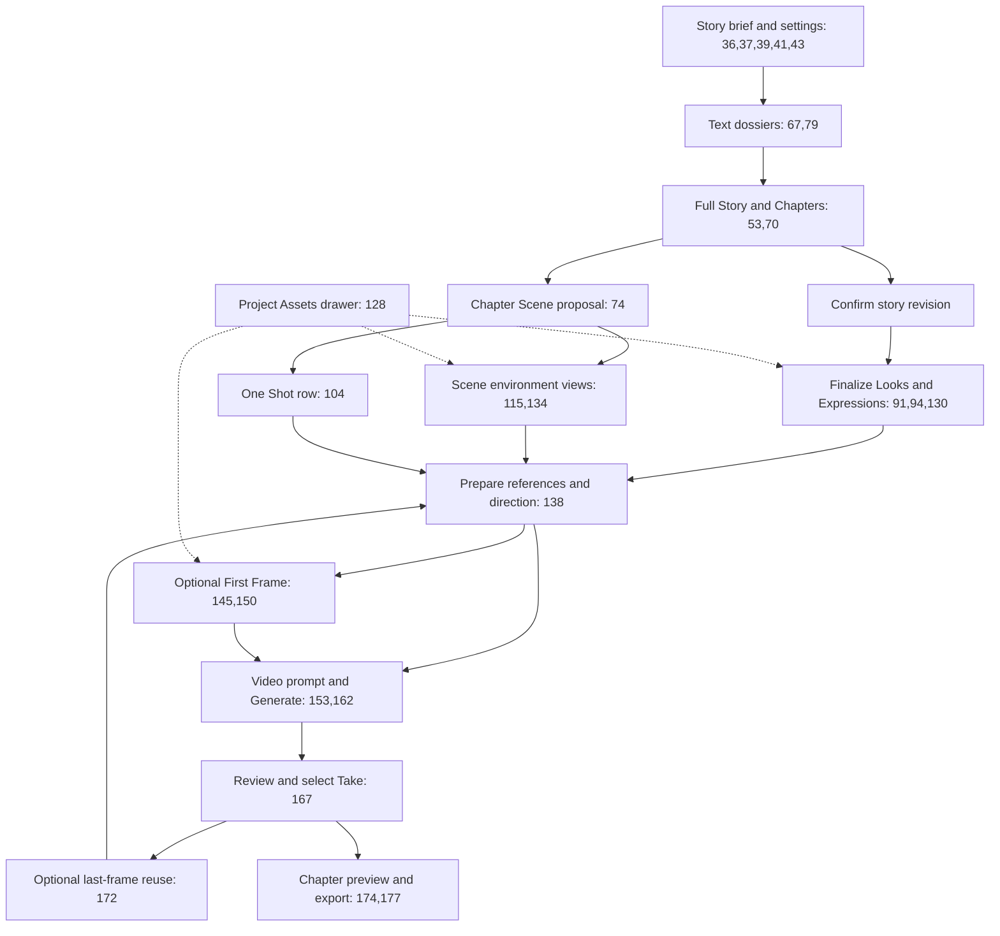

# 006 - UX/UI Workspaces And Interactions

2026-10-01 supersession: [017](017-project-characters-and-bulk-consent.md) now owns
the planned Project-level Story / Characters route destinations. Their buttons
use 75/25 widths, not a split content layout. Remove Character settings from writer
right panels; contextual Scene/Shot selectors remain. Earlier three-workspace and
embedded Character-management proposals below are historical where they conflict.
Engine, Render and Queue interiors remain protected. Implementation is pending.

Status: design specification, not implemented UI. Review lens: UX/UI Product
Designer applied sequentially; see [master](000-master.md) for review scope.
Uses the existing Momelo visual language, tokens and inspected brand references
under `requirements/008-implement-adjusment-ui/`.
The single-mode writer contract in
[009](009-single-mode-writer-shot-authoring.md) supersedes prior Simple/Advanced
and per-attribute Shot presentation.
The complete screen inventory and wireframes in
[010](010-complete-authoring-screen-redesign.md) extend this specification from
Project entry through Render. Existing Engine & Target Output, Render/result/Take
surfaces and queues are protected; their current layout wins over earlier inline
render proposals here. Only their context entry/return wrapper is redesigned.

## 1. User Goal And Navigation

Primary user: Thai creator making a short film or mini series, often moving between
story revisions and repeated Shot generation. The first screen is usable authoring,
not a landing page. The shortest path is brief -> story -> choose Looks -> first
Shot -> generate/review. Manual Shot creation remains available without AI planning.

Three stable workspace tabs: เรื่องราว / Story, สร้างฉาก / Production,
ผลงาน / Final. These are route tabs, not a stepper that prevents returning.
Project Assets is a toolbar drawer action available from every workspace.
Season selector appears only when Seasons are enabled; Chapter selector remains
compact even for Chapter 1. No separate Project navigation for each Chapter.

The diagram maps the user's Draw.io nodes to the proposed screen positions:



Original Draw.io is retained unchanged. Node 153 is presented as Video direction,
not another ambiguous Generate Scene button. Internal LLM nodes 34/35/119/120/146/
154/163 are operation status, never additional navigation destinations.

## 2. Story Workspace

Initial screen: brief composer, a compact line of format/genre/orientation controls,
optional story settings, and one primary Prepare Story action. Placeholder text
does not replace labels. Empty brief supports explicit AI creation.

After preparation, content becomes an organized readable Chapter list. Provisional
Character dossiers stay in a collapsible section within this workspace. They display
text, not empty image-generation cards. Confirm Story reveals Finalize Looks.
The original brief/settings remain editable through a compact section.

```text
Project name        Story | Production | Final        Assets   Activity
Chapter selector    [Season when enabled]             Settings
---------------------------------------------------------------------
Full Story                    | AI assistant (opened on demand)
Chapter 1 title   Expand       | Scope: selected Chapter
Readable prose                | Requested change
Chapter 2 title   Expand       | Preview change / Apply
+ Chapter                     |
---------------------------------------------------------------------
Characters (text drafts)       History 10        Confirm Story
```

Full Story Expand opens a distraction-free reading/editor surface with close/back
and saved state. Keep line length around 65-80 characters for Latin prose and
comfortable Thai wrapping; no fixed paragraph-height truncation in reading mode.

AI assistant is a scoped command panel, not a required chat timeline. It names
whether it changes Story, Chapter, Scene or Shot. Proposal view shows current and
proposed content plus affected scope; Apply updates data, Cancel retains current.
On mobile compare through tabs, not two narrow columns.

Chapter add/reorder/delete uses predictable controls; keyboard move actions accompany
dragging. Removing a Chapter with media archives after impact confirmation. Normal
text Save needs no repeated approval dialog. History Preview/Restore is explicit.

## 3. Production Workspace

Desktop uses a compact Scene/Shot navigator and one writer-first content pane. Scene
rows display title, location/time, Shot count and readiness. Selecting a Shot loads
one canonical timeline document; do not mount every editor/player for the film.

```text
Project        Story | Production | Final     Chapter 1      Assets
---------------------------------------------------------------------
Scenes / Shots   | Shot 3 title                           Saved
1 Flower shop   | ----------------------------------------------------
  Shot 1  Ready | [ timeline-oriented Shot writing surface           ]
  Shot 2  Done  | [ scene, camera, timed action, dialogue, audio      ]
  Shot 3  Draft | [ continuity and constraints in readable text       ]
+ Scene / Shot   | ----------------------------------------------------
                 | References   First Frame status
                 | Prepare First Frame              Open Video Render
```

Wireframe column widths are guidance, not fixed canvas dimensions. At desktop,
content uses `minmax(0, ...)` tracks. The writing surface is the dominant area and
loads one Shot at a time, preserving its saved data, cursor/scroll draft state and
actor-scoped selection when switching. Keep task state with its existing owner, not
with the mounted editor.

Clicking a Shot summary selects the whole item, not only its thumbnail. Structure it
as one semantic selection control with sibling reorder/menu actions; do not nest
buttons inside buttons. The selected Shot opens directly in the same editor instead
of a second edit dialog. Return focus to the originating control after drawers close.

References and optional First Frame status are compact operational summaries
below the document. Image/video generation and Take review open existing Render
with the same Shot context and a Back to Shot action. A new video-only Shot shows the reference mode and Look
thumbnails, not an unrelated selected image. Turning composition OFF retains its
image in the collapsed First Frame section and replaces the submitted-source preview
with the existing Look-only visual/icon treatment.

Video direction, Dialogue & Sound, facial performance and camera are prose sections
inside one timeline-oriented writing surface. Time markers receive readable visual
rhythm and line-specific validation. The 2026-09-25 update in 009 section 13 permits
Character/speaker mapping controls, a readable exchange projection and a separate
creator Video Prompt section. Dialogue text still has one script source; there are
no duplicate numeric action forms or expert attribute panels. Provider/model comes from defaults but has
an obvious override in the protected Engine & Target Output. Price and actual model
remain visible before submission in the existing Render screen.

The writer has distinct Prepare First Frame and Open Video Render actions. Neither
submits a generation request. Existing Render owns the estimated Generate command;
do not add a second submit button or rebuild its layout beneath the writer.

## 4. Reference Layout And Asset Drawer

Reference summary defaults collapsed for Video. Header shows count and mode; expanded
content uses ordered compact items: thumbnail, Character/asset name, role, and an
overflow menu with replace/remove where allowed. Full names wrap; job IDs belong
in optional metadata. Keep preview, name and actions in the same item.

Image source actions use existing generated chooser/upload controls. Put familiar
Browse/Choose icons with accessible names; remove is a small trailing icon, not a
separate full-width row. No card-inside-card layout. Avoid automatic full-resolution
downloads just to render a thumbnail.

Environment toolbar: selected thumbnail, view/state name, enabled switch, Choose,
Generate and optional Add View. A single view is sufficient. Additional-view controls
appear in its detail drawer; no mandatory four-image empty grid.

Project Assets drawer defaults to current assets and filters by semantic category.
Character expression panel selection shows the 3x4 parent and one active crop;
keyboard slot navigation and labelled crop coordinates are available. History filter
reveals alternatives, without mixing unrelated generated images into Look selection.

Close Assets restores focus to its invoking action and leaves the active Shot intact.
Only one modal/dialog surface is open at a time; child choosers replace drawer content
with a Back action instead of nested dialogs.

## 5. Take Review And Final

Preserve the current Render, Take and Final review controls. The behavior below is
a regression contract, not authorization to redesign their working presentation.

Each Take shows preview, creation time, duration, status/reason and selected-for-film
state. Preview does not approve. Use Take/Approve action is explicit; existing
eligibility and authorized overrides remain visible when applicable.
Changing Take remounts/reloads the shared player by stable source ID and stops the
previous audio. Completed media stays visible while a new attempt processes.

Final shows the selected Chapter's ordered clips, a primary preview and Download
Clips/current export actions. Missing clips link to the exact Shot. Successful export
shows its output in Project Assets and a download action. Partial exports say which
clips are included. Available post-processing appears as secondary tools.

## 6. Progressive Disclosure And States

| Surface/state | Visible behavior and next action |
|---|---|
| Empty Project | Composer and Prepare Story; no wall of readiness errors |
| Story preparing | Shared ProcessingSpinner and actual current operation; saved draft retained |
| Story proposal | Review current/proposed, affected scope, Apply/Cancel |
| Final Looks missing | Text dossier with Select/Generate; text authoring remains usable |
| Empty Scene | Add Shot / Generate Shots, environment optional |
| Valid manual Shot | Save/edit one Shot document and model-compatible generate without AI planning prerequisite |
| Advisory issue | Short inline recommendation; editable value; no artistic lock |
| Hard blocker | Specific reason beside disabled action and one direct repair action |
| Generation pending | Actual queue/processing state, shared indicator, no duplicate submit |
| Failed/rejected/interrupted | Last result and sources retained; error/retry/recheck; no spinner after terminal cutoff |
| Stale Take | Playable history, distinct approval reason, no disappearing media |
| Save conflict | Local draft retained; compare/reload choice |
| Unauthorized | No private asset/prompt payload; contextual unavailable state |
| Unsaved navigation | Preserve actor-scoped draft or request discard only when data would be lost |

There is no Details mode containing alternate camera/light/art/blocking fields.
Compiled technical prompt and low-level diagnostics are administrator/support-only,
read-only and server-authorized. No POC, qualification or internal architecture copy
appears in customer workflows.

## 7. Responsive, Theme And Accessibility Contract

| Width | Navigation and content | Action placement |
|---|---|---|
| ~1440px | Compact Scene/Shot navigator and centered writer surface; references/Takes use disclosures or drawers | Estimate and generation actions remain near the relevant output |
| ~820px | Navigator collapses; writer fills available width; operational sections stack below | One local action bar; no competing fixed footers |
| ~390px | Chapter/Scene/Shot selection uses a sheet; editor is full width; Assets/Takes use full-height sheets | 44px practical touch targets; sticky actions respect safe area and keyboard and never cover text |

Shared header/footer are owned by AppShell. Do not duplicate them in workspaces.
No horizontal page scrolling, clipped Thai text or sticky action covering content.
Use contain for reviewed images; fixed aspect media boxes with max-height constraints.
One scroll owner per pane; tabs/actions remain reachable without nested scroll traps.

Use current theme tokens (Momelo Neon, Pearl Editorial, Electric Studio), typography
and at most 8px repeated-item radii. Gradients are for primary actions. No hero,
decorative panels, nested cards or viewport-scaled fonts. Use Lucide icons and
tooltips for unfamiliar symbols. All labels use `react-i18next`; enabled Thai/English
keys/interpolations match. Disabled locales retain established catalog policy.

Keyboard supports tabs, disclosure, reorder, crop selection and dialog Escape/focus
return. Announce pending/error/save status through accessible status regions; do not
use color as the only state cue. Shared spinner respects reduced motion.

## 8. Component Reuse And UX Acceptance

| Existing component | Target reuse |
|---|---|
| `CinematicWorkspaceHeader`, `StoryIntentChoices`, `ThemeSelect` | Workspace/context selectors and authoring choices |
| `SimpleStoryboardWorkspace`, `SimpleStoryboardRow` | Reuse proven selection/status behavior only; remove Simple naming/presentation after the writer workspace owns it |
| `StoryboardShotWorkspace`, `StoryboardShotEditor` | Preserve actual Render regions; authoring edit entry returns to the new Shot document |
| `GenerationExperience`, `ProcessingSpinner` | Generation action/state/quote and shared feedback |
| `SceneEnvironmentControl`, generated Look/source controls | Environment and exact-category asset selection |
| `DialogueSoundEditor`, `ShotSequenceEditor` | Reuse validation/conversion rules where sound; retire separate form UI after `shotDocument` parity |
| `VideoTakeList`, `ProduceMediaReview`, shared player | Take status, selection and media preview |
| `ClipBundleDownload`, `ProjectCostSummary` | Chapter delivery and existing cost reporting |

- U01: A creator reaches the first clip using only Story and Production; blank
  brief and manual authoring are discoverable without technical fields.
- U02: Editing image/video/Take within one Shot requires no Plan/Produce route trip.
- U03: Each empty/pending/error/disabled/stale state has one clear next action and
  existing output remains visible through retries and switching.
- U04: All three widths, enabled locales, themes, keyboard/focus and reduced motion
  pass scoped browser review. Screenshots must be recorded during implementation.
- U05: Reference items align, labels stay readable, no nested dialogs or overlapping
  fixed bars; central preview follows the selected Shot and Take.
- U06: The completed Rewamp exposes no Simple/Advanced switch or attribute editor;
  the Shot document remains the dominant editable surface at all three widths.
- U07: Complete authoring redesign follows UX01-UX07 in 010 while Engine, Render,
  Takes and queues retain their existing presentation and behavior.
