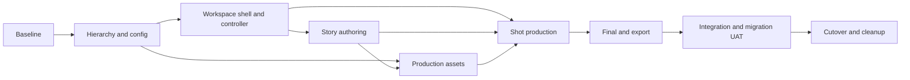

# 007 - Step-By-Step Implementation Plan

Latest scoped extension: [011](011-story-chapters-and-shared-characters.md) and
[task packet 012](tasks/012-story-chapter-character-integration.md) define 13 ordered
tasks for Chapter diagnosis, regeneration/revisions, AI Assist and shared Characters.
They extend P03/P04 and await implementation instruction; earlier evidence does not
verify this new scope.

Status: runtime implementation in progress. Verified task evidence is recorded in
Section 13; unlisted tasks remain Planned.
Owner: [master](000-master.md). Acceptance and evidence: [008](008-verification-migration-and-cleanup.md).
Screen scope: [010](010-complete-authoring-screen-redesign.md) redesigns authoring
end to end and protects existing Engine & Target Output, Render/results, Take
controls and queues. Its preservation boundary overrides earlier recomposition tasks.

Execution detail: [tasks/000-task-index.md](tasks/000-task-index.md) splits these 53
parent tasks into 60 child tasks across one foundation, nine screen packets and one
integration/cleanup packet. Use those packets for page-by-page implementation,
focused evidence and iterative feedback. Parent IDs and scope remain stable.

## 1. Execution Rules

Implement one cohesive task, run its focused checks, record evidence, then advance.
Each task below defines a bounded output; tests of adjacent unchanged behavior are
added only where the changed shared contract creates risk. Do not run a whole
provider suite, build or live generation after every prompt/UI edit.

Phase dependencies below describe final integrated milestones. They do not require
finishing an entire phase before a later page can be previewed or its independent
slice implemented. Each task packet names the minimum live contract dependencies
and where isolated fixture review is possible. Complete a parent only when all its
mapped child scope passes, including child portions spread across several pages.

Use one canonical facade, state contract and prompt compiler per existing owner.
Extract shared runtime once before both new screens and compatibility screens use
it. Add a focused internal module when it has a real owner; do not consolidate all
new behavior into `CinematicApplicationService` or a giant workspace component.

Runtime roles: owning Backend or UX implementer, QA for substantial parts, Cinematic
for continuity. Add financial/security review only on affected boundaries as required
by AGENTS. Planning's sequential review does not replace implementation QA.

## 2. Dependency Graph



After P01 contracts stabilize, asset server work and P02/P03 UI work can proceed
independently only with named file ownership. Do not run concurrent rewrites of
the application service, schemas, configuration loader or stage monolith.

## 3. P00 - Baseline And Verification Entry

Depends on: none. Owner: Cinematic/QA. Deliverable: repeatable comparison baseline.

| Task | Ordered work and concrete output | Focused verification |
|---|---|---|
| T00.1 | Inventory current routes, active imports, API methods, project schemas and relevant tests; record branch-local files/LOC and legacy module consumers. | Read-only inventory, no live data mutation |
| T00.2 | Extend existing cinematic fixtures with standalone/Series, multiple Takes, Look-only, natural/faceless/white source, failed recovery and archived Chapter cases. | Fixtures parse and preserve baseline IDs/lineage |
| T00.3 | Record canonical still/video quote/submit manifests using mocked providers and controlled fixtures. | Current reference/price/authority expectations |
| T00.4 | Add selectable `rewamp-*` groups to `scripts/test-cinematic-video.js`; one explicit `rewamp-all` aggregate; list planned groups without silently accepting unknown ones. | Help/unknown-group exit status; no live provider/process restarts |
| T00.5 | Record protected image/video Engine, Render/results, Take actions, both queues and Final states, plus load/request metrics for Chapter/Shot/Take switching. | R04 baseline at 390/820/1440; empty, completed, pending and failed states |

Gate: C01 baseline, V05/V06 historical regressions reproducible. No feature cutover.

## 4. P01 - Hierarchy, Configuration And Contracts

Depends on P00. Owners: Cinematic domain/repository + configuration; QA/security
review actor boundaries. Read 002 before implementation.

| Task | Ordered work and concrete output | Focused verification |
|---|---|---|
| T01.1 | Extend validated authoring configuration with workflow and asset policies; add safe manifest projection and schema version. | Invalid values rejected; saved false overrides preserved; no secrets projected |
| T01.2 | Define root/Chapter/Season DTOs and old-ID resolver; extend Series/repository contracts without moving media. | Standalone/Series/new root, nullable Season, stable productionUnit IDs |
| T01.3 | Implement atomic new-root/Chapter membership and versioned reorder/update commands through existing facade/routes. | Concurrent conflict, cross-actor denial, no partial membership |
| T01.4 | Implement bounded Chapter/detail/asset-binding projections; extend Zod/API contracts. | Cursor/filter count parity, no all-film payload |
| T01.5 | Implement dry-run/explicit upgrade with ID mapping, backup manifest and rerun reconciliation. Place script under existing scripts owner. | Fixture migration twice, invariant ID/hash comparison, rollback rehearsal |
| T01.6 | Define shared asset scope and the canonical versioned `shotDocument`/derived-projection lineage before Story revisions or asset UI are built. | One editable Shot truth; root/Chapter override resolution; revision evidence retention |

Gate: C01-C05. Snapshot/payload contract is stable for all subsequent parts.
Rollback: exposure OFF; legacy routes read additive records without data deletion.

## 5. P02 - Workspace Shell And Shared Runtime

Depends on P01. Owner: React Cinematic; UX/QA review. Read 006.

| Task | Ordered work and concrete output | Focused verification |
|---|---|---|
| T02.1 | Add Story/Production/Final route projection and Chapter/optional Season context; preserve old stage deep-link resolution. | New/old URL selects same root/Chapter/Scene/Shot |
| T02.2 | Extract protected Produce/Finish render composition and canonical quote/submit/task/Take behavior from `CinematicStageContent.tsx` without internal UI redesign. Redirect old authoring edit actions to the writer. | R04/R06; existing Produce tests, snapshots and quote/submit/task counts unchanged |
| T02.3 | Build the new compact project context header, selectors and Assets drawer shell; remove mode-dependent authoring navigation and version actor-scoped writer preferences. Preserve global header/Job Center. | R01/R05; actor switch clears private selection; role-gated read-only diagnostics |
| T02.4 | Build one Scene/Shot navigator and dominant writer workspace; one selected Shot opens one document editor. | Entire summary selects Shot; stable keys; no nested buttons or second edit dialog |
| T02.5 | Establish responsive writer layouts/sheets and all empty/loading/error states before production disclosures are added. | W01-W04/W10 at 390/820/1440, Thai/English, keyboard/focus and themes |
| T02.6 | Replace Cinematic Project list and New Project presentation per UX01-UX02, reusing list/create/draft commands and compact configured settings. | R01/R02; manual draft, resume, empty/error, title/brief retention and no generation on navigation |

Gate: U01-U07 and W01-W04/W10 shell criteria; protected R04 baseline retained. Old deep
links resolve as adapters to the same Shot during migration, not as a second editor.
Rename/remove mode-specific components only when their replacement consumers pass.

## 6. P03 - Story, Dossiers And Revisions

Depends on P01-P02. Owners: Cinematic authoring + existing Generation text entry.
Read 003. Runtime AI operations retain existing model/cost policy.

| Task | Ordered work and concrete output | Focused verification |
|---|---|---|
| T03.1 | Implement provisional text dossiers and optional/empty brief authoring; relax image dependencies only for story-text operations. | Story draft/confirm without Looks; media identity checks still work |
| T03.2 | Extend structured text recipes/contracts for Full Story and per-Chapter continuation; pass shared style/bible context. | Role analysis vs enhancement output, country/genre propagation, bounded chapters |
| T03.3 | Implement scoped proposal/apply with expected versions and structural-change preview. | Stale proposal refused; ordinary Enhance retains IDs and Takes |
| T03.4 | Implement Full Story active head plus configured previous-revision rotation and Restore with pinned evidence. | 10/11 boundary, custom limit, conflict, restore, media lineage intact |
| T03.5 | Build UX03-UX04 Chapter writer/navigator, text Character dossier, scoped proposal panel and History; confirm baseline then expose Finalize Looks. | R01/R03; manual/AI flow, return focus/draft, no required Cast-image stage |
| T03.6 | Extend Scene/Shot proposals with location/time grouping, dialogue-time target/exemptions, gaze and causal motion, returning one readable Shot document per Shot. | S04-S07 and W05 including long-dialogue and environment-only cases |
| T03.7 | Wire explicit interrupted-text-operation recovery using existing task ownership. | Re-entry does not duplicate AI calls or restart completed Chapters |

Gate: S01-S07 and milestone A. A user can prepare a coherent story without generating
any image. Automated verification uses mocked text outputs; creative quality needs UAT.

## 7. P04 - Project Assets, Looks, Expressions And Environment

Depends on P01 and P03's stable dossier/confirmed-story contract. Owner: Cinematic
bindings; Profiles/Assets/Reference Processing retain domain responsibilities.

| Task | Ordered work and concrete output | Focused verification |
|---|---|---|
| T04.1 | Add root shared-Look bindings, explicit override resolution and correct main/background rules; reuse generated/profile Look sources. | Same Character across Chapters; no category bleed or actor leak |
| T04.2 | Add expression template metadata and Character-bound parent sheet selection/generation via existing workflow. | Template 12 slots and same-Character authority; no generation on open |
| T04.3 | Implement deterministic crop derivatives through Assets, editable rectangles and reuse by source/transform identity. | Crop bounds/label gutters, malformed grids, ownership, no AI call |
| T04.4 | Extend `CinematicSceneEnvironment` and `SceneEnvironmentControl` to view/state packs, one-view default and explicit optional views. | One-view operation; state consistency; OFF retains source |
| T04.5 | Add Hero Prop bindings/state projection and action prompt inputs, reusing asset/image generation contracts. | Key/chest repeated state/holder; required prop capacity behavior |
| T04.6 | Build UX05 paged Project Assets with category-specific chooser reuse and safe thumbnails; route asset Generate actions into protected existing image Render. | R07; filter-before-pagination, original binding on return, bounded pages |
| T04.7 | Extend reference planner for ordered identity/expression/environment/prop intent with visible capacity fallback. | Count/order parity and direct-mode no-composition case |

Gate: A01-A06. No duplicate reference processing, image cache or durable media store.
Expression crop and environment multiview can be tested independently of paid images.

## 8. P05 - Unified Shot Production

Depends on P02-P04. Owner: Cinematic; Generation/References/Assets reused. Read 005.

| Task | Ordered work and concrete output | Focused verification |
|---|---|---|
| T05.1 | Implement tolerant Shot-document parser and deterministic Prepare Shot using existing lineage, compilers, reference planner and prompt-budget owner. Preserve unknown prose and keep projection non-editable. | W03-W06; no paid side effects; correct invalidation and warnings/blockers |
| T05.2 | Add the single timeline-oriented document editor, duration reconciliation, autosave/conflict recovery and explicit AI proposal/apply. Remove separate timeline/dialogue/expert forms from the new flow. | W01-W05; dialogue preserved, gaps/parallel tracks handled, save then quote |
| T05.3 | Connect the writer's First Frame summary, selection/previous-last-frame and treatments to existing image Render without redesigning its result, engine or queue. | R04/R07; existing source/last-frame tests; API mask failure preserves original |
| T05.4 | Connect composition ON/OFF and Look-only/direct mode to the actual adapter contract; adjust mode-specific prompts. | OFF removes composition and its approval gate; real first-frame gate unchanged |
| T05.5 | Compile compact video packet from the saved document projection with own-Look facial authority, temporal action, audio default and explicit lead-in/usable timing. | W06; actual final prompt budget, reference manifest and duration/estimate parity |
| T05.6 | Connect Open Video Render/Back to Shot using stable context and saved version; reuse existing Generate, quote/submit/recovery and Job Center behavior. | R05/R06; entry never submits, no duplicate task/charge, terminal cutoff and retained sources |
| T05.7 | Bind existing Take history/status, preview/approval and player to active render context without redesigning their UI. | R04/R06; reload history, Shot/Take switch, older eligibility and existing overrides |
| T05.8 | Complete UX06-UX08 writer/reference navigation and permission filtering; keep Engine/Render/queues outside authoring CSS scope. | R01-R09 and W07-W10; three widths, protected region parity and server role filtering |

Gate: V01-V06, W01-W10 and milestone B. First clip generated/reviewed by both
reference modes in authorized manual UAT; automated tests cannot prove face or motion
quality.

## 9. P06 - Chapter Final And Exports

Depends on P05. Owner: Cinematic timeline/Generation export contracts + Assets.

| Task | Ordered work and concrete output | Focused verification |
|---|---|---|
| T06.1 | Project selected Takes to Chapter timeline with usable ranges and missing/stale reasons. | Correct order/IDs; alternate preview does not change export selection |
| T06.2 | Reuse clip ZIP/bundle through Chapter scope and expose explicit alternatives only when supported. | Selected clips/manifest match; original bytes unchanged |
| T06.3 | Connect UX09 Final context to existing preview/timeline/download/export controls; add exact Shot return navigation without redesigning the existing render/review surface. | R10/R04; correct Shot return, protected controls and no unbounded media preload |
| T06.4 | Project existing post-processing availability into Final; keep unsupported operations absent. | Available/unavailable states; no new implied billing or auto-processing |

Gate: V07, Chapter-scoped UAT and existing export regression checks.

## 10. P07 - Integration, Migration And Pilot

Depends on P03-P06. Owner: QA; Backend/UX/Cinematic review where affected.

| Task | Ordered work and concrete output | Focused verification |
|---|---|---|
| T07.1 | Run explicit deduplicated `rewamp-all` against isolated fixtures; repair failures by owning part. | Evidence by acceptance ID, no provider calls/restarts |
| T07.2 | Rehearse migration/rollback on a copy of representative data; compare ID/hash/count manifest. | No missing Shots/Takes/approvals or unauthorized assets |
| T07.3 | Browser UAT of UX01-UX09 and old-link compatibility at three widths/locales/themes; compare protected surfaces to T00.5. | R01-R10; screenshots, keyboard/focus, draft round-trip and Render/Queue parity |
| T07.4 | With explicit paid-run consent, run one pilot Chapter with two Characters and a recurring prop across multiple Shots. | Composition + Looks and Looks-only, expression/environment, selected export |
| T07.5 | Compare request counts/payload/interaction timings to P00 and record retained limitations. | No repeated full-project reads or background recovery loop |

Gate: No unresolved critical functional regression; report model-quality limitations
separately from code pass/fail. Runtime cannot be declared complete from screenshots
alone or from a single successful provider clip.

## 11. P08 - Cutover And Cleanup

Depends on P07. Owner: Cinematic, reviewed by QA. Cleanup is authorized within the
branch after replacement evidence, with explicit candidates in 008.

| Task | Ordered work and concrete output | Focused verification |
|---|---|---|
| T08.1 | Switch configured default workspace and preserve tested old-link adapters. | New entry and old bookmarks resolve correctly |
| T08.2 | Remove obsolete authoring stage presentation, Simple/Advanced controls/branches, attribute editors and unused authoring CSS by verified consumer inventory. Exclude protected Engine, Render, Take, Queue and Final dependencies. | R09/W01/W09; active historical readers and protected modules intact |
| T08.3 | Retire compatibility logic only when no supported record/receipt needs it; retain model policies referenced by historical evidence. | Legacy fixtures/approved Takes still readable |
| T08.4 | Remove superseded fixture/test duplication only after moving assertions to the owning runner. | Acceptance coverage unchanged, unknown groups fail |
| T08.5 | Update architecture map, route ownership, requirement status and measured source file/LOC/module reduction. | Scoped diff, links, configuration docs and final evidence ledger |

Gate: milestone C. Rollback remains possible through tested Chapter compatibility
routes; no claim of an exact file reduction before measuring the actual diff.

## 12. Per-Task Evidence Template

```text
Task ID / owning acceptance IDs:
Status: Planned | In progress | Implemented awaiting verification | Verified | Deferred
Changed modules and canonical owner:
Behavior preserved / intentional replacement:
Configuration or schema version change:
Focused command and result:
Visual or manual evidence (when applicable):
Remaining gap and owner:
Rollback/compatibility note:
```

There are 53 tasks above. Unverified work remains Planned; existing evidence is
recorded below. Updated screen scope requires its new acceptance checks even when
earlier foundation checks passed. Update this count if task boundaries change. New cross-part scope must first
update its owning requirement, not appear as an undocumented side effect.

## 13. Implementation Evidence

### T00.4 - Focused Rewamp verification entry

Status: Verified. `scripts/test-cinematic-video.js` now exposes explicit
`rewamp-*`, `rewamp-ui` and `rewamp-all` groups. The prior `full` group retains its
original file set and does not silently expand to Rewamp tests. No live provider,
Credit mutation or worker restart is part of these groups.

### T01.1 - Validated workflow and asset configuration

Status: Verified foundation. `server/config/cinematicRewampConfiguration.js`
validates server-owned JSON policy, freezes it and publishes a safe fingerprinted
projection through `CinematicFieldManifestService`. React validates the same public
boundary. Focused evidence: `node --test test/cinematicRewampConfiguration.test.js`
passed 3 tests; Cinematic manifest/schema UI checks passed.

### T01.2 - Additive root and Chapter identity projection

Status: Verified foundation. `CinematicSeriesService` now presents standalone work
as one Chapter and exposes separate `productionProjectId`, `chapterId` and
`productionUnitId` without moving media or changing legacy IDs. Existing Series,
Season and Chapter persistence remains canonical. Focused evidence:
`node --test test/cinematicSeries.test.js` passed 7 tests including ownership,
version conflict, archive and legacy normalization.

### T02.1 - Three-workspace route projection

Status: Verified foundation. `CinematicWorkspaceNavigation` maps old stage URLs to
Story, Production and Final while preserving all old deep links. That implementation
still uses the prior Simple/Advanced presentation assumptions and is superseded by
009; its route projection is reusable, but mode filtering and the old rail must be
replaced through T02.3-T02.5 before cutover. Focused component and adjacent Series
controls passed 8 tests; TypeScript source check passed with incremental output
disabled.

Remaining P00-P02 work: fixtures/metrics, bounded commands and migration tooling,
shared runtime extraction, Assets shell, actor-scoped view preferences and visual
browser verification at 390/820/1440. P03 is in progress; P04-P08 remain Planned.

### T03.1 - Provisional text dossiers

Status: Verified foundation. With the Rewamp flag enabled, Story generation and
approval materialize stable role-bound `dossier` assignments from text role data
without requiring a Character Profile or Look. A dossier remains explicitly
`identityReady=false` with no Looks, so Storyboard/video production authority is
not weakened. Binding a real Character to the same role replaces the provisional
assignment instead of creating a competing role identity. With the flag disabled,
the prior approved multi-view Look gate remains unchanged. Focused evidence:
`rewamp-story` passed 15 tests; the adjacent Story Plan/Application suite passed
50 tests; Rewamp browser contract tests passed 5 tests.

Remaining P03 work: Full Story Chapter authoring, scoped proposal/apply, bounded
revision restore/rotation, dialogue and Scene/Shot planning extensions, recovery
and the Finalize Looks transition. P04-P08 remain Planned.
