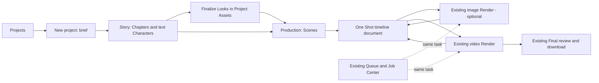

# 010 - Complete Authoring Screen Redesign

Status: design specified; replacement screens are not implemented by this document.
Updated: 2026-09-19. Owner: Cinematic Studio presentation.
Primary role: UX/UI Product Designer. Product Requirement Architect and Cinematic
Experience Director reviews applied sequentially; no independent-agent sign-off.

## 1. Design Decision And Boundaries

Redesign the Cinematic experience from its project entry screen through story,
Characters, Chapters, Scenes and Shot writing. Preserve the current Engine & Target
Output, Render/result surfaces and Queue experience. Redesign their entry and return
navigation, while retaining their internal presentation and operational behavior.

This specification supersedes the layout and embedding proposals in 001, 006 and
009 where they would redesign Render or Queue. It extends the one-mode writer
decision in 009; it does not restore Simple/Advanced or per-attribute Shot forms.
003-005 continue to own story, asset, generation and continuity rules.

Scope means Cinematic entry onward. Global Momelo navigation, Playground, shared
Generation UI, theme preferences and unrelated Studio screens are not redesigned.

| Surface | Decision |
|---|---|
| Project list and new-project entry | New presentation and navigation |
| Story brief, Chapter writing, text Character dossiers, AI proposal/history | New writer-oriented presentation |
| Assets, Look selection, Expressions, Environment and Props | New organization/selection presentation using existing owners |
| Scene organization and Shot writing | New one-mode document workspace |
| Shot render entry/return context | New compact context bridge |
| Engine & Target Output | Preserve image/video components and behavior |
| Image Render/results, video preview/compare/fullscreen and Take actions | Preserve existing presentation and behavior |
| Shot Queue, Generation Queue and header Job Center | Preserve existing presentation and behavior |
| Final preview/timeline/download/export controls | Preserve current implemented controls; new navigation/context wrapper only |

Preservation includes labels, defaults, model capability visibility, actions,
estimate, errors, disabled reasons, status, media inspection and responsive behavior.
An extracted file may move without a visual redesign; no copy of its workflow is
created. Avoid new broad CSS selectors that restyle these protected regions.

## 2. User And Shortest Paths

Primary user: a Thai creator who wants to write, inspect and refine a short film or
mini series. Frequent tasks are revising prose, adjusting one Shot, reusing a Look,
generating a new Take and returning to the correct place after reviewing it.



This is a route map, not a locked wizard. Manual authors may add Scenes/Shots and
write directly. Full Story confirmation enables final Look preparation as specified
in 003; optional planning AI is not a prerequisite for a valid manual Shot.

Persistent project tabs remain Story, Production and Final. Assets is a drawer
available from all three. Character and Scene editing are contextual destinations
inside those workspaces, not additional global stages. There is one authoring mode.

## 3. Screen Inventory

| ID | Destination | Dominant content | Primary action / next state |
|---|---|---|---|
| UX01 | Cinematic Projects | Recent owned projects, concise progress and resume destination | New Project / Open Project |
| UX02 | New Project | One large brief composer with compact initial choices | Create draft or explicit Prepare Story -> UX03 |
| UX03 | Full Story workspace | One Project-level Full Story with revision history | Save/Generate/Revise; Confirm reveals Generate Chapters |
| UX04 | Character dossier | One Character's editable text and relationships | Save dossier; after story confirmation select/generate Look |
| UX05 | Project Assets | Category-filtered Looks, Expressions, locations and Props | Select existing or open existing image Render |
| UX06 | Production Scene overview | Ordered Scenes, shared environment and Shot summaries | Add/Generate Shots -> UX07 |
| UX07 | Shot writer | One timeline-oriented plain-text document | Prepare First Frame or Open Video Render -> UX08 |
| UX08 | Render entry and return | Existing Render with active project/Chapter/Scene/Shot context | Existing Generate, Take preview/selection/approval; Back to Shot |
| UX09 | Final entry | Existing Chapter clip review/timeline and supported downloads | Existing download/export actions |

UX04/UX05 are panels/destinations within the project, not mandatory extra steps.
UX08/UX09 are integration boundaries: their existing working content is protected.

## 4. UX01 - Project Entry

```text
Cinematic Studio                                    + New project
------------------------------------------------------------------
Project                         Last edited       Progress     Open
[existing thumbnail] Rain ...  Today             3/8 clips      >
[existing thumbnail] Period... Yesterday         Story draft    >
------------------------------------------------------------------
```

Use a compact list of projects with stable row height and whole-row navigation.
An existing authorized image may be its thumbnail; projects without media use a
neutral icon. Never generate covers merely to populate the library. Show only
progress supported by actual records; do not invent a percentage for AI progress.

Open resumes the saved workspace and selected entity if accessible, otherwise its
nearest valid parent. New Project opens UX02. Rename/archive actions belong in a
row menu only where supported by the canonical command. No nested link/button.
List/search/sort pagination must extend the existing list API if needed, not load
all projects and assets into the browser. Search is not required for the first slice.

On mobile rows show name, resume context and one status; extra metadata wraps below.
Empty state keeps New Project visible. A load error offers Retry in the list area.

## 5. UX02 - New Project And Brief

```text
< Projects                         New project                 Saved
------------------------------------------------------------------
Project title

Story idea
[                                                                ]
[                    generous writing area                       ]
[                                                                ]

Movie / Mini series       Orientation
Genres (1-3, ordered; first is Primary)                 Settings
------------------------------------------------------------------
Create draft                                      Prepare story
```

The title may use an editable untitled default. Brief is optional for explicit AI
creation. Mini Series is the default while Movie remains available. Genre is an
ordered multi-choice of one to three values; the first remains Primary for scalar
compatibility while every selection reaches Story operations. Orientation is an
initial choice. Settings opens country style, period, audience feeling, pacing,
ending, target duration per Chapter up to 120 seconds and optional Season/Chapter
defaults using configured choices. Close restores focus and text.
No giant setup grid, readiness panel or Character image requirement precedes writing.

Create draft persists manual work and enters UX03 without calling AI. Prepare Story
invokes the existing text operation explicitly with its existing estimate/consent
behavior. It opens the saved story workspace, shows actual operation status and
retains completed work if interrupted. Re-entry never restarts preparation by itself.

## 6. UX03/UX04 - Story And Characters

```text
< Projects  Project name         Story | Production | Final    Assets
[Season if used]   Chapter 1                               Saved
------------------------------------------------------------------
Chapters                | Chapter title                 History
1 First encounter       | ------------------------------------------
2 A promise             | Readable Chapter prose
+ Chapter               | [ one broad writing surface             ]
                        | [ paragraphs with comfortable spacing   ]
Characters              |
Lalin                   | ------------------------------------------
Kin                     | Enhance                    Confirm story
+ Character             |
```

Story uses one document area for the selected Chapter. A compact outline supplies
Chapter order and selection. Season is optional and hidden when unused. Full Story
is a reading view of ordered Chapters, not a second separately editable copy.

Characters sit below the Chapter list. Selecting a Character opens a text dossier
in the same workspace or a focused drawer, with one prose description and essential
identity/name controls. It must distinguish draft text from finalized Look authority.
Saving a dossier returns to the same Chapter and scroll position. No automatic Look
regeneration follows a textual change.

Enhance opens one scoped proposal panel. Its heading names the selected Chapter or
Shot; original/proposed content and Apply/Cancel are clear. Analyze Roles presents
Character proposals instead of the identical prose-diff view. Only one AI panel is
open at a time. After Apply, return to the updated document with saved state.

History opens a compact version list and Preview/Restore using the 10-revision
policy in 003. Confirm Story records the current baseline and reveals Finalize Looks
near Characters. Authors may continue editing and see affected assets/Shot scope.

## 7. UX05 - Assets And Final Looks

Use a category list with one selected asset detail, not a wall of nested forms:

```text
Project Assets                                                Close
Characters | Environments | Props | Frames | Clips | Outputs
------------------------------------------------------------------
Lalin                   | [ selected Look: contain, full sheet ]
Kin                     | Look name               Selected
                        | Choose existing       Generate Look
                        | Expressions: [12-slot sheet / selected crop]
```

Characters remain named and identity-bound; attach a Look once at project scope and
show inherited use in Shots. Optional outfit overrides are selected from this same
library. Expression selection uses the parent sheet and chosen crop per 004, with
crop correction in one dedicated surface. Do not ask for 12 individual uploads.

Environments show one master view and optional additional views/states. Props show
only author-created recurring story objects. Scene-level Environment tools open this
same category with the current Scene context. Generated image selection stays
category-filtered and owner-authorized before pagination.

Generate Look/Expression/Environment/Prop opens the existing image Render workflow
with its compiled request. On return, select the result for the original binding
explicitly. A completed Job is not automatically approved or assigned to another Shot.

## 8. UX06 - Scene Organization

```text
Project / Chapter                         Story | Production | Final
------------------------------------------------------------------
Scenes                  | Scene 1: Flower shop
1 Flower shop           | Night, rain                     Environment
2 Morning               | [ readable Scene situation / purpose     ]
+ Scene                 | ------------------------------------------
                        | Shot 1   6s   Pot slips             Ready
                        | Shot 2   8s   Kin turns              Draft
                        | Shot 3   8s   Apology                Draft
                        | + Shot                         Generate Shots
```

Scene title, concise context and shared environment establish where the story takes
place. Scene prose is edited inline; camera changes remain Shots under the same
Scene. Generating Shots proposes documents for that Scene and shows the affected
scope before Apply. Adding one manual Shot opens a starter document immediately.

Shot summaries are navigation rows, not miniature editing forms. They show title,
duration, a short event summary and real status. Add/reorder works by keyboard as
well as pointer. Reordering retains stable IDs and marks affected continuity for
review through the existing owner; it never deletes Takes.

## 9. UX07 - Shot Writer

Updated 2026-09-25: [009 section 13](009-single-mode-writer-shot-authoring.md#13-character-dialogue-and-video-prompt-workspace-2026-09-25)
adds contextual Character/speaker controls and a separate creator Video Prompt.
These additions supersede the former prohibition on all speaker controls.

```text
< Scene 1          Shot 3: Apology                 Saved     Next >
------------------------------------------------------------------
Scene / Shots       | Scene and Characters: environment + named Looks
Shot 1              | Lalin [visible]    Kin [visible]    Voice summary
Shot 2              | ------------------------------------------------
Shot 3              | Script and performance       Duration: 8 seconds
                    | [0:00-0:02] Lalin looks up...
                    | [0:02-0:06] Lalin: "..."     Speaker: Lalin
                    | [0:06-0:08] Kin holds her gaze...
                    | Camera / sound / continuity in the same script
------------------------------------------------------------------
First Frame: selected                   Open image tools
Video Prompt [collapsed]: current       Prepare / Copy
                                        Open Video Render
```

The single document follows `Example/shot-example.txt` and 009. It contains Scene,
camera, timed performance, facial expression, dialogue and sound in readable text.
The script remains one source. Contextual Cast/speaker binding controls and a
readable dialogue projection are allowed; they do not duplicate spoken text in
independent fields. Voice baseline belongs to the shared Character and local
delivery/emotion belongs to the Shot. No camera/lighting attribute wall returns.
Section spacing and timing anchors create visual rhythm. An accessible plain-text
editor supports paste, undo/redo, text selection and Thai input-method composition.

Recognize both example-style `[0.0-1.5 sec]` and clock-style `[0:00-0:05]` markers.
Formatting is explicit and undoable. Typing must not reformat, jump the caret or
submit content. The author can write free prose; uncertain artistic interpretation
is advisory. Only actionable execution constraints block generation, never draft save.

The Character section shows Scene participants, their actual Looks, visible versus
off-screen status and missing-reference actions. Reference details open the actual
ordered binding summary with named thumbnails, including
automatic Looks and optional Expression/Environment/Props. It is collapsed by default.
First Frame status has Choose/Generate/Previous last frame and the existing use
switch; choosing OFF keeps the asset. Missing previous video explains why extraction
is unavailable. These actions use existing owners and the protected image Render.

Open Video Render saves or preserves the draft, prepares its saved version and opens
UX08 for this exact Shot. It does not submit a paid request. If preparation fails,
show the issue next to its text/reference action and keep the document recoverable.
No second Generate button outside the current Render's quoted command is added.
Video Prompt is a separate creator-readable generated projection with a directly
editable Shot-local override, source freshness and explicit reset/reconfirmation.
Raw technical diagnostics remain administrator/support-only, per 009 section 13.

## 10. UX08/UX09 - Protected Render, Queue And Final

Only the surrounding context bridge is new:

```text
< Back to Shot       Project / Chapter / Scene / Shot       Saved version
-----------------------------------------------------------------------
|                  EXISTING RENDER EXPERIENCE                          |
| Existing Shot Queue | Existing result/player | Engine & Target Output |
| Existing Take history, selection/approval, cost and Generate command  |
| Existing Generation Queue and header Job Center remain in place      |
-----------------------------------------------------------------------
```

The bridge passes root/production-project/Chapter/Scene/Shot IDs and saved document
version through canonical contracts. UI context cannot substitute for server source
validation. Distinguish the submitted version from a newer draft when they differ.
Back to Shot restores selection, draft, caret/scroll when available and focus.
Opening Render, Queue or a Take must never trigger submission or new paid generation.

Image Render keeps its actual result, engine, queue and actions. Video Render keeps
its preview/compare/fullscreen, references, Engine & Target Output, Take history,
approval, recovery and queue functions. The previous proposal to rebuild these as
miniature panels beneath the document is withdrawn. Existing Edit Shot entry points
return to UX07, so there is one authoring source.

Queue activity remains reachable from every workspace through the existing header
indicator. Changing Shot while a task runs changes the preview context; completion
updates the submitted Shot only. Return to a task via its existing IDs and owners.
Preserve both `ProduceShotQueue` and `GenerationQueueStatus`; they serve different
purposes and must not be merged during this redesign.

Final wraps the existing Chapter review/timeline, selected-Take and bulk download
functions. Preserve any existing final-render controls where available. Unimplemented
assembly/export capabilities remain unavailable; this design does not invent an
export service or claim an existing disabled action works.

## 11. Component Reuse And Replacement Boundary

Paths below are relative to `web/src/` and reflect inspected runtime consumers.

| Owner/component | Treatment |
|---|---|
| `features/cinematic/routes/CinematicStudioRoute.tsx` | Replace project-list/authoring composition; reuse API, actor and route contracts |
| `features/cinematic/components/CinematicSetupForm.tsx`, stage rail and mode controls | Replace authoring presentation with UX02-UX07; retire after parity |
| `features/cinematic/components/CinematicStageContent.tsx` | Extract protected Produce/Finish composition without a redesign; replace other authoring branches |
| `components/generation/EngineTargetPanel.tsx`, `VideoEngineTargetPanel.tsx`, `EngineTargetPanelFrame.tsx` | Protected existing image/video Engine & Target Output |
| `components/generation/GenerationExperience.tsx` | Reuse canonical generation and actual render regions; no duplicate controller |
| `components/generation/GenerationResultSurface.tsx` | Protected image result/inspection actions |
| `features/cinematic/components/produce/ProduceMediaReview.tsx` and shared media viewers | Protected video preview/compare/fullscreen |
| `features/cinematic/components/produce/VideoTakeList.tsx` | Protected Take status, selection and approval |
| `features/cinematic/components/produce/ProduceShotQueue.tsx` | Protected Render Shot navigation queue |
| `components/generation/GenerationQueueStatus.tsx` | Protected Generation queue |
| `features/generation/job-center/GenerationJobCenterIndicator.tsx` | Protected global process entry/status |
| Existing generated Look choosers, Scene environment and asset APIs | Reuse selection/mutation contracts in redesigned asset presentation |

`CinematicEngineTargetPanel.tsx` contains an internal qualification preview. It is
not the live Engine & Target Output implementation to clone for the replacement.
Current Produce uses `VideoEngineTargetPanel`; image Render uses
`GenerationExperience` with `EngineTargetPanel`.

## 12. Visual And Responsive Specification

Use Momelo tokens from `web/src/styles/tokens.css` and `themes.css`, plus Poppins
and Noto Sans Thai. Writer-oriented means hierarchy and reading space in the current
theme; it does not mean introducing a separate beige page or independent theme.

Authoring typography: 24px page title, 18-20px document title, 16px writing text with
1.7-1.85 line height, 12-14px metadata. Letter spacing is zero. Use a roughly 760px
maximum reading width on desktop, flexible down to available mobile width. Navigator
is approximately 224px where space permits. Spacing uses existing 8/16/24px rhythm.

Use unframed document sections with restrained separators. Cards are limited to
repeated assets/project items. Existing media uses real authorized thumbnails and
`contain` for inspection. Primary Momelo styling identifies the next explicit
command; all other commands are secondary/icon actions with accessible labels.

| Viewport | Authoring layout | Protected surfaces |
|---|---|---|
| 1440px | Navigator + readable document; optional one auxiliary panel when width allows | Render retains its current responsive layout |
| 820px | Navigator moves to sheet; one full-width document; asset/AI panels replace auxiliary pane | Existing tablet behavior retained |
| 390px | Compact project header, one editor, selectors in sheet; actions wrap above safe area | Existing mobile behavior retained; integration must not narrow or cover it |

One auxiliary panel at a time. An open mobile keyboard must not hide the caret behind
a sticky action bar. Dialog focus returns to the invoking control; Browser Back
restores the correct entity. Preserve draft work across navigation/refresh within
the existing actor-scoped persistence policy. Do not store image Base64 in drafts.
Thai and English are enabled; all new labels use existing locale ownership.

## 13. State And Feedback Inventory

| State | Visible outcome / next action |
|---|---|
| Empty library | New Project; no fabricated media |
| Empty Chapter/Scene/Shot | Writable document and explicit Add/Draft action |
| Saving/saved/offline/save failed | Compact real save status; draft retained; Retry where valid |
| Stale save/AI proposal | Keep local text; compare current version before Apply |
| Text generation pending | Existing shared spinner and operation name; completed text stays visible |
| Missing required Look | Link to exact Character in Assets; writing remains available |
| Advisory timing/continuity | Short actionable notice attached to relevant text, no artistic lock |
| Invalid execution input | Exact issue and edit target before Render submission |
| Render queued/running/failed/recovery | Existing protected status and recovery behavior |
| Completed/older Take | Existing media remains playable; selection/approval stay explicit |
| Unauthorized/missing entity | No private payload; nearest permitted parent and appropriate error |

No extra approval ritual for ordinary writing. Existing explicit paid commands and
media approval remain where they are. Formatting, navigation and draft save do not
call a generative provider.

## 14. Ordered Delivery And Review

The runnable-work breakdown lives in [tasks/000-task-index.md](tasks/000-task-index.md):
one packet per UX01-UX09 screen plus shared foundation and integration/cleanup.
Each packet lists small tasks, file ownership, minimum dependencies, focused checks
and a feedback log so screens can be implemented and adjusted one at a time.

1. Capture current Engine, image/video Render, both queues and Final integration
   baselines at 390/820/1440, including completed and failed work. Map CSS/imports.
2. Complete Shot document and hierarchy contracts from 002/009. Define a compact
   render entry/return context using existing stable IDs.
3. Build project entry and new-project composition (UX01-UX02).
4. Build Story/Chapter writer, text dossier, proposals and History (UX03-UX04).
5. Recompose Assets/Looks/Expressions/Environment/Props (UX05) over existing commands.
6. Build Scene overview and one Shot document editor (UX06-UX07).
7. Connect writer actions to protected Render/Queue and Final (UX08-UX09); verify
   return context, saved-version identity and no accidental generation on navigation.
8. Verify the complete manual and AI paths, then remove obsolete authoring forms,
   stage rails and mode branches. Keep Render, Engine and Queue dependencies intact.

Each slice has focused checks through 007/008. No runtime UI or browser validation
is claimed by this design delivery. Actual screens require visual evidence before
their implementation status becomes complete.

## 15. Acceptance

- R01: All UX01-UX07 authoring destinations use the new cohesive writer presentation;
  no Simple/Advanced choice or per-attribute Shot editor remains.
- R02: A manual author can create a Project, write a Shot, select references and open
  existing Render without mandatory AI planning or First Frame generation.
- R03: The AI path preserves text dossiers before Full Story confirmation, scoped
  proposals, configured revision history and post-story final Look preparation.
- R04: Image/video Engine & Target Output, Render controls, Take actions, Shot Queue,
  Generation Queue and Job Center match their recorded presentation/behavior baseline.
- R05: Render entry/return and browser navigation retain correct IDs, saved version,
  selection and recoverable draft; opening or returning never submits generation.
- R06: Changing Shot/Take while rendering cannot redirect a result or lose older Takes;
  estimates/submissions remain owned by the existing pipeline.
- R07: Required Look/Expression/Environment/Prop selection remains discoverable and
  authoring removes no existing last-frame, composition-OFF or reference function.
- R08: At 390/820/1440, Thai/English and existing themes, editor text and actions are
  readable/operable with keyboard and no overlap, horizontal overflow or focus trap.
- R09: Authoring cleanup has an explicit consumer inventory; protected Render/Queue
  modules, historical media/receipts and unrelated feature styles are preserved.
- R10: Final entry uses current supported review/download/export behavior, and new
  authoring navigation retains a direct route back to the affected Shot.

## 16. Design Delivery Evidence

Reviewed current Cinematic list/new-project/workspace routes, live image/video engine
consumers, Generation render regions, ProduceMediaReview and ProduceShotQueue.
Inspected the Momelo brand/layout references and current Thai/English locale manifest.
Reconciled 000, 001, 005-009 and the technical ownership master with this boundary.

Document checks: local Rewamp Markdown links resolve; implementation plan has 53
unique task rows; this design defines nine screen destinations and ten acceptance
IDs. Scoped whitespace/diff checks pass. Runtime UI, browser screenshots, paid media
generation and migration were not run as part of this design update.
