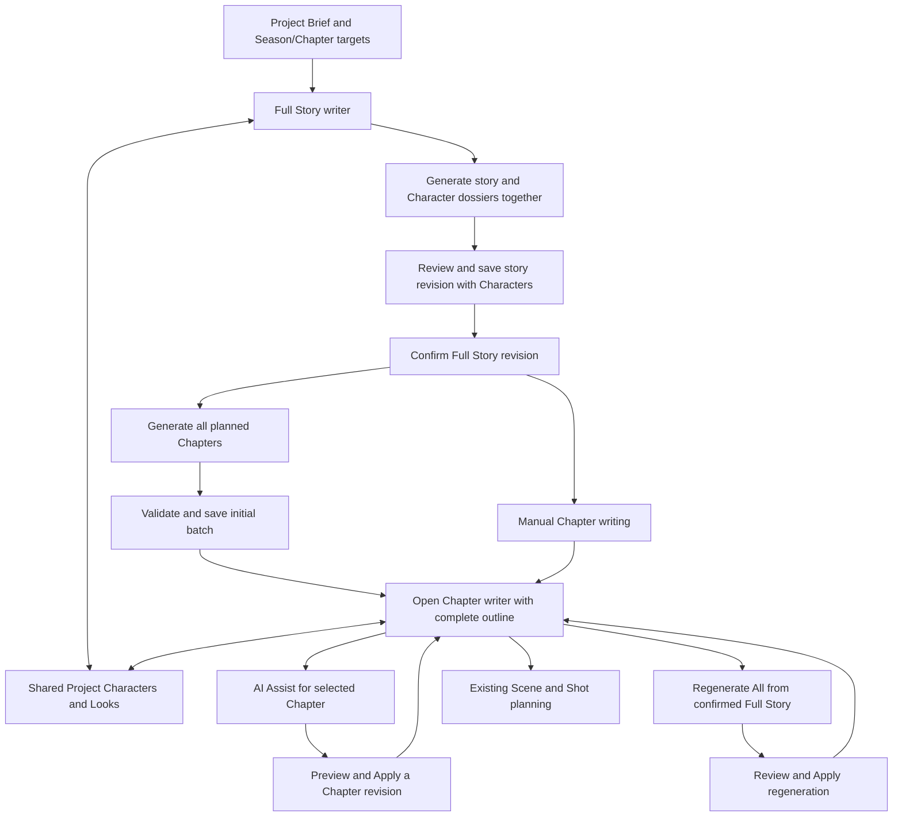

# 011 - Full Story, Chapter Revisions And Shared Characters

## 2026-09-26 Revision Instruction Validation

Status: implemented; focused verification passed. Selected-Chapter Revise with AI requires a non-whitespace
instruction, matching existing Full Story and Shot revision behavior. Disable the
button and guard the handler; API rejects empty/whitespace/non-string or oversized
revision instructions before provider dispatch. Preserve initial Full Story and
all-Chapter generation without an instruction, pending-proposal review, offline
and busy guards. A selected empty Chapter using the Revise action also requires
an instruction. Keep the existing 2,000-character bound.

Plan: update Chapter writer and canonical application validation; extend existing
UI/backend tests for empty, spaces-only and valid input, with provider-not-called
and all-Chapter generation regression assertions. Run only focused groups.

Pricing is documentation-only in
[commercial Phase2-22](../../019-implementation-commercial-feature-plan/Phase2-22-cinematic-writing-pricing.md).
No Credit charging is enabled by this UI/validation correction.

Evidence: `node scripts/test-cinematic-video.js rewamp-scene-layout-revision`
passed 2 backend + 12 UI checks (Chapter writer and Scene Looks only). The server
rejects missing, empty, whitespace, non-string and >2,000-character selected
instructions without calling the provider or changing the Project version;
initial all-Chapter generation still works. The UI permits nonempty instructions,
preserves Generate All and pending-proposal recovery. Existing Full Story and
Shot guards were inspected and left unchanged. TypeScript and scoped diff checks
passed. No live AI call, billing change, Project mutation or full-suite run.

## 2026-09-26 Scoped Follow-up: Cast Disclosure And Chapter Target Visibility

Owner: Cinematic authoring. Primary: Backend Platform Architect for diagnosis;
UX and QA reviews applied sequentially by the implementation agent.
Status: implemented and focused verification passed. No live generation or Project mutations are authorized by
this diagnostic correction.

Read-only evidence: `cineproj_1790353253960_tmn1f8d6` has a confirmed Full Story
of 33,148 characters, `setup.chapterCount = 1`, Seasons disabled, and
`chaptersPerSeason = [1]`. Its two applied all-Chapter proposals each contain one
Chapter; a further all-Chapter proposal with one Chapter is pending review.
`CinematicApplicationService.proposeChapters` derives an exact Chapter plan from
Setup, and `CinematicFullStoryService.proposeChapters` requires that exact count.
This is not lost Chapter output: a long story does not override the saved target.

Ordered tasks / acceptance:

1. Add an accessible, initially expanded Characters section toggle in the shared
   Full Story/Chapter panel. Preserve mounted form, voice and Look states when
   hidden. Header Add expands the section; failure feedback remains visible.
   Keep existing library, extraction, Look, selection and removal workflows.
2. Show the saved total Chapter target beside generation controls in Full Story
   and Chapter writer, clearly stating it comes from Setup rather than story
   length. Offer a return to the root Project Setup; do not silently edit counts,
   discard pending proposals, call AI or overwrite existing Chapters. Disable
   the shortcut while busy or with unsaved writer edits/Full Story proposals.
   Persisted Chapter proposals survive navigation and still require explicit review.
3. Extend existing writer tests for disclosure/state preservation, target display,
   root Setup navigation and existing pending-proposal protection. Run only the
   two affected component files plus a targeted Chapter-plan backend test if
   needed. Check affected responsive controls in isolated browser fixtures.

Recovery for this Project: review/discard the pending one-Chapter proposal,
change the Chapter target in root Setup, then explicitly Regenerate All Chapters
from confirmed Full Story and review/apply. No automatic story-length inference
or new generation-count policy is introduced.

Verification (2026-09-26):

- `node scripts/test-cinematic-video.js rewamp-cast-chapter-target`: 17 tests
  passed across the two existing writer test files. Includes disclosure/form
  retention, Add expansion, saved versus actual Chapter counts, root Setup
  navigation from a child, dirty-state protection and pending-proposal recovery.
  The group is also registered in the explicit `rewamp-all` aggregate, not run.
- `node --test --test-name-pattern="Full Story AI normalizes" test/cinematicFullStoryService.test.js`:
  1 existing backend test passed, including exact expected Chapter count.
- `node scripts/verify-cinematic-story-import.mjs --cast-target`: isolated
  TH/EN browser checks passed at 390/820/1440px for expanded/collapsed Cast and
  Chapter target controls. Screenshots under `%TEMP%/mpf-story-import-ui-8sLp32`;
  representative mobile Chapter and desktop collapsed Full Story inspected.
  Fixture responses use the public Series schema; no live API mutations.
- Nonincremental TypeScript check, new-key locale/interpolation parity and scoped
  `git diff --check` passed. No full suite, paid generation or runtime data edit.
- UX/QA applied sequentially with `review-product-ux` and
  `verify-release-regressions`; no independent reviewer execution claimed.

Changed owners: shared Character panel, Full Story/Chapter writer components and
tests, Cinematic route callback, scoped CSS, TH/EN catalogs, existing cinematic
test/browser runners and this requirement. No files moved, new storage/config
introduced, or server generation behavior changed. Live regeneration remains
user-driven UAT after choosing the desired Chapter count.

Status: Implemented and focused verification recorded on 2026-09-21. Deferred
follow-ups remain listed in task packet 012 and are not implied complete.
Owner: Cinematic Studio. Primary: Product Requirement Architect. UX review uses
`review-product-ux` and the UX/UI Product Designer charter, applied sequentially
by the same agent; no independent UX agent execution is claimed.
Execution: [task packet 012](tasks/012-story-chapter-character-integration.md).

## 1. Outcome And Precedence

Read the Full Story beside its Characters and Look Sheets, develop Chapters with
AI or manual writing, and introduce a Character from either page without losing
the writing context. Keep one Project-level Character library.

This document supersedes conflicting Story/Chapter and Character placement in
003, 004, 006, 010 and tasks 004-006 only for this scope:

- Full Story is one independent Project document; Chapters are separate documents.
- Chapter revisions are now explicitly included in revision rotation.
- Text dossiers remain sufficient to write and confirm a story. Existing or generated
  Looks are optional during writing; confirmation recommends finalization, not a
  gate preventing early visual exploration.
- Dossier and Look controls are shared contextual panels, not mandatory extra pages.
- Regeneration becomes an explicit proposal/review/apply operation on existing Chapters.
  The existing initial-create guard must not simply be removed.
- Engine, Render, Queue, media receipts and existing production IDs remain protected.

The 2026-09-21 revision replaces the Full Story tabs with separate sections,
requires Character dossiers with Full Story generation, and separates initial
Chapter creation from regeneration review. It restores the Setup Season/Chapter
inputs already required by 003. These rules take precedence over earlier UX and
task evidence; that historical evidence does not verify the revised behavior.

## 2. Observed Problem And Recovery

Current `chapterWorkStarted` indicates structural/content/production work, not proof
of completed AI generation. Two Chapter records can have empty prose. The reported
409 alone proves neither that prose was saved nor that it was lost.

First implementation task inspects the affected Project and its owner-scoped Series,
Full Story revisions, Chapter content, generation provenance and available operation
results. Classify each Chapter as empty, authored, generated, or production-only.
Recover only content backed by an authoritative saved result. Preserve IDs and
record the recovery source; never copy the Project Brief into missing Chapter prose.
If no saved content exists, show the empty state and offer Generate/Manual explicitly.
Do not auto-submit AI during inspection, page entry or error recovery.

## 3. User Flow



Full Story offers Continue Chapters whenever existing Chapter work is reachable,
including when the current Full Story revision is not confirmed. Confirmation gates
new AI Chapter generation, not access to existing work. Initial empty Chapter 1
is not evidence of successful generation. Initial generation saves all planned
Chapters and opens the first Chapter automatically. Regeneration requires review
and Apply; scoped AI Apply stays on the selected Chapter. Manual opens saved
authoring work without submitting AI or automatically displaying pending AI proposals.

## 4. Chapter Generation And Regeneration

Expose `Regenerate All Chapters from Full Story` on the Chapter page. Input is the
explicit confirmed Full Story revision, Project creative settings, duration per
Chapter, accepted Character dossiers and current Chapter structure. Optional user
instruction guides the rewrite. Show the source revision; if a newer draft exists,
offer returning to Full Story to confirm it or using the existing confirmed revision.

Initial `Generate Chapters` covers the complete configured Season/Chapter plan,
not only Chapter 1 and not a provider-chosen count below an arbitrary maximum.
Validate the result for complete count, order, Season assignment and usable prose,
then commit the initial batch atomically and navigate to the Chapter writer. The
outline lists every created Chapter; selecting the first is navigation only.
Reuse the canonical proposal validation/commit implementation inside the initial
command, without requiring another user Apply action when no authored/production
work exists. Recheck this condition at commit; concurrent work must not be overwritten.
Recover an already committed initial operation by returning its existing result.
If generation is incomplete, retain a recoverable result and report the missing
Chapters; do not report success or navigate to an apparently complete outline.

Existing Chapter work exposes `Continue Chapters` in Full Story. Explicit
regeneration belongs on the Chapter page and produces a persisted proposal.
Review shows
proposed order, title and prose, plus existing-to-proposed Chapter mapping. Use
stable IDs, never title equality or silent positional reassignment. For each item,
show update-existing or create-new. Unmatched existing Chapters are retained by
default; exclusion from the active outline must be an explicit review choice and
must leave their production work accessible. This requirement adds no hard delete.

Apply validates actor ownership, base Full Story revision, workspace/Chapter versions
and mapping uniqueness, then writes the whole accepted batch atomically. Every
updated Chapter receives a revision; new Chapters receive fresh stable IDs.
Preserve Scene/Shot/Take and approved-media snapshots; flag affected planning for
review. Cancel/failure leaves existing Chapters intact. Retry Apply is idempotent
for a proposal and cannot create duplicate Chapters or revisions.

Check existing work and input validity before AI dispatch. Keep ordinary create
and explicit regenerate distinct at the application contract. Persist operation
status/proposal through the existing text-operation owner. An interrupted operation
is recoverable or terminal with a bounded timeout, not an endless page spinner or
automatic resubmission. Work from another tab must produce a conflict with draft
retention and reload/compare, not overwrite.

## 5. Chapter AI Assist And Revisions

AI Assist takes the selected Chapter's saved base revision, current draft, instruction,
confirmed Full Story, relevant Characters and bounded adjacent-Chapter summaries.
Server-owned prompt budgeting preserves the instruction and selected Chapter before
optional context. Do not silently truncate dialogue or replace the full story.
The result contains proposed title/prose and optional Character suggestions.

Preview, edit, Apply or Discard the proposal. Apply changes only the selected Chapter.
Character proposals are accepted separately. Full Story and adjacent Chapters do
not change implicitly. Empty Chapters support Generate Chapter with contextual input.

Each Chapter has its own active revision plus ten previous revisions by default,
reusing `authoring.storyRevisionHistoryLimit`. Explicit Save, AI Apply, regeneration
Apply and Restore create revisions; typing, failed saves and identical retries do not.
Record parent revision, source, timestamp, source Full Story revision and proposal
provenance. Restore creates a new head. Production-pinned source evidence remains
available beyond the visible authoring rotation. Existing `chapterTitle/chapterStory`
remain compatible projections of the current head, not a second editable source.
Changing retention applies to future saves; no bulk deletion on configuration reload.

## 6. Shared Project Characters And Looks

One stable Project Character ID owns name, aliases, narrative role, text dossier,
relationships and selected Look references. Chapter usage links this ID to a Chapter;
it does not duplicate the dossier. Physical storage stays behind the Cinematic owner.
Reusable Profile/Look assets remain owned by their existing capabilities.

Full Story shows all Project Characters. Chapter shows linked Characters first and
allows selection from the same library. Add from Chapter creates or links a Character
and attaches its Chapter usage in one versioned command; Full Story sees it immediately.
Names may suggest possible duplicates but are not identity keys. Never merge copied
historical Cast assignments automatically by name. Record unresolved legacy mapping.

`Generate Full Story` returns both prose and structured provisional Character
dossiers in the same user operation. Each dossier includes a proposal-local ID,
name, aliases when known, narrative role, personality, objective, relationships,
and appearance/wardrobe notes when supported by the story. Validate Character
references and names against the returned story. Show these drafts immediately in
the Characters section; another Analyze action is not required to populate it.
This action creates text dossiers, not image-generation jobs or reusable Profiles.

Save/Apply the generated Full Story revision and its accepted Character changes
atomically through the Cinematic owner. Record the Character snapshot/mapping with
the revision so reload and history can explain which Characters belong to it.
Assign stable Project IDs on acceptance. Existing Characters and selected Looks
remain linked by ID; regeneration must not duplicate them or silently replace an
identity. Uncertain matches are offered for explicit create/link/update selection.
Discarding a proposal leaves saved story and Characters unchanged. Restoring old
story text must not silently rebind production Looks or resurrect removed bindings.

Character extraction is an explicit Analyze Characters action or suggestions returned
by a requested prose generation. It proposes create/link/update with mention evidence.
User acceptance establishes the library entry. No background AI calls on typing or
page entry. Missing or uncertain mentions do not silently remove existing bindings.

The shared panel supports text-only save, selecting existing Look Sheets and explicit
generation through the current media/quote flow. Display the actual selected image,
name and brief role, with full-sheet preview. Appearance changes mark the selected
Look for review without regenerating or replacing it automatically. Existing Shots
keep their pinned Look until explicitly rebound; new work uses the selected current Look.

Adding a Character does not rewrite Full Story. Offer a scoped Full Story AI proposal
when the author wants to incorporate the new role. Origin and Chapter usage remain
visible in the shared panel. Removal means unlink/archive with usage review when
referenced; immutable production evidence remains reachable.

Expose separate actions for `Change selected Character`, `Detach selected Character`
and `Remove from Project`. Detach removes the reusable Profile/Look association
while retaining the narrative dossier and its stable ID. Remove retires the Project
Character and updates Chapter usage links through the owning versioned command;
show affected usage when present. Neither action deletes the reusable library asset
or changes prose implicitly. Existing Shot references and media evidence remain
reachable. Chapter-only unlink removes only that Chapter's usage.

## 7. UX/UI Specification

Writer-first, one mode, readable Thai/English prose. Use Momelo tokens, typography,
zero letter spacing, restrained borders and at most 8px radii. No nested decorative
cards or explanatory technical prose in the product.

Desktop Full Story: document is the main column. The right rail contains separate
sibling sections in this order: `AI Assist`, `Characters`, then `Build Chapters`
when the current story is confirmed. They are not mutually exclusive tabs or cards
nested inside one enclosing card. Revision `History` remains a collapsible section
below the writing workspace. AI Assist and Characters are visible together. Before the
first story exists, show Generate Full Story and hide the revision-instruction
textbox. After generation, show the revision instruction when relevant to the draft.
Each Character row has a thumbnail or text avatar, name, role and accessible edit,
change/detach/remove actions. Selecting a Profile must not replace the story's
Character name with the library asset's display name. Asset and story names have
different roles. Add/Analyze remain explicit commands; Analyze is supplementary.
Character rows in the Full Story rail must remain compact and independently readable
after AI revision: reserve width for identity before actions, keep the name to one
ellipsis line, clamp the role preview to two natural lines, expose the complete role
as a native tooltip, and prevent Thai text or action buttons from overlapping adjacent
rows at supported widths.
Character rows in the Full Story rail must remain compact and independently readable
after AI revision: reserve width for identity before actions, keep the name to one
ellipsis line, clamp the role preview to two natural lines, expose the complete role
as a native tooltip, and prevent Thai text or action buttons from overlapping adjacent
rows at supported widths.

Desktop Chapter: compact left Chapter outline, central title/prose, right rail with
`AI Assist`, `Characters`, `History`. AI Assist is initially selected. The outline
shows empty/draft/generated/review-needed states rather than implying all entries
are completed. Header includes Back to Full Story and the regenerate action. Save
remains near the editor; Apply belongs to the proposal preview. No competing primary
Generate action while a proposal is under review.

```text
Full Story:  [Back to Brief] [Project title] [Save / Confirm / Continue]
            [                  Story text                ][AI Assist              ]
            [                                            ][Characters             ]
            [                                            ][Build Chapters         ]
            [History (collapsible, below workspace)                              ]
Chapter:    [Back to Full Story] [Chapter title] [Regenerate All]
            [Chapter outline][       Chapter text       ][Assist | Characters | History]
```

Full Story at tablet/mobile widths uses a single readable document column with
independent full-width sections, not tab-only access to AI Assist or Characters.
Keep the right-rail section order intact beneath the editor and place History after
the workspace; keep focus stable during generation. Chapter's
existing tools may use a controlled drawer. Mobile Chapter has a Chapter selector
and compact panel buttons;
open one full-width sheet at a time. Do not stack three narrow columns. Restore
selection, scroll and keyboard focus on closing a panel or returning from asset picking.
Dirty navigation saves successfully or offers stay/discard; failed save retains draft.

Use shared Button, yellow ProcessingSpinner, StatusNotice, Dialog/Sheet and current
asset selection/generation controls. All labels use existing locale catalogs. Tabs,
disclosures and dialogs support keyboard navigation, accessible names, focus return,
reduced motion and visible focus. Inspect 390/820/1440px, Thai/English and all themes.

| State | UI behavior |
|---|---|
| Loading workspace | Stable editor layout; pending status; Generate waits for known state |
| Workspace read failed | Retry; no false empty or successful-generation claim |
| Empty Chapter | Empty editor with Generate Chapter and manual writing |
| Existing work | Continue Chapters from Full Story; explicit regenerate inside Chapter |
| No confirmed Full Story | Writing/Continue work; generation links to confirmation |
| AI pending | Yellow spinner and real status; prevent duplicate submit; retain saved text |
| Initial Chapters saved | Open first Chapter; show every planned Chapter in the outline |
| Regeneration proposal ready | Preview and Apply/Discard, with scope and source revision |
| Manual with a pending proposal | Open saved text; offer explicit review separately, never auto-apply or auto-open |
| Failed/interrupted | Preserve content; bounded terminal/recovery state and explicit retry |
| Version conflict | Keep local draft/proposal; reload/compare before reapplying |
| Missing Look | Text avatar and create/select action; writing remains available |
| Look needs review | Keep selected image and offer review; no automatic generation |
| Unauthorized | No private content or mutations exposed |

## 8. Ownership, Configuration And Migration

Reuse `CinematicApplicationService`, `CinematicSeriesService`, existing Full Story
text service, `CinematicProjectRepository`, Series APIs and Zod response schemas.
Extend public application contracts for proposal/apply, per-Chapter history and
shared Characters. Keep provider dispatch, billing and asset operations with their
existing owners. Page components consume these contracts, not repositories.

`CinematicFullStoryWriter` and `CinematicChapterWriter` host shared Character and
revision presentation. Extract only genuinely shared preview/history behavior;
do not build separate Chapter AI or Look-generation pipelines. Query keys include
actor and canonical Project/Chapter IDs; invalidate only affected projections.
Never persist Base64 in authoring state. Paginate history and Character asset choices.

Use `server/config/cinematic/workflow-policy.v1.json` for authoring limits, retention
and context bounds. Reuse current 24 generated-Chapter maximum, 50,000-character
story bound and 2,000-character instruction bound where applicable; validate and
publish safe config to UI. Prompt recipes stay in `server/config/prompt-recipes/cinematic/`.
Provider capabilities, quotes and pricing stay with their owners, not this policy.

Migration is additive: seed a revision only from existing Chapter prose, preserve
IDs and legacy media, map copied Cast by proven lineage, keep unresolved bindings
readable and reviewable. Dry-run isolated fixture copies first. No live repair or
archive is implicit in migration. Rollback disables new authoring presentation while
maintaining legacy current-text projections and all referenced evidence.

## 9. Acceptance And Delivery Boundary

- SC01: Empty existing Chapters are accurately classified; recovery provenance is shown.
- SC02: Initial generation saves the complete batch and opens Chapters; regeneration
  preview/apply persists and reopens correctly.
- SC03: Chapter mapping changes retain all previous production work and stable identities.
- SC04: Chapter AI changes only its intended scope; failures/conflicts preserve drafts.
- SC05: Each Chapter rotates its own revisions and restores without losing media lineage.
- SC06: One Character added from either page appears in both with the same stable ID.
- SC07: Looks remain optional for prose; changing Looks never mutates old Shot evidence.
- SC08: Continue, panel navigation, loading, empty and recovery states work at all widths.
- SC09: Retry/actor/version checks prevent duplicate or cross-owner writes and AI resubmits.

Historical checks covered portions of SC01-SC09 under the 2026-09-20 behavior.
They do not close the new acceptance checks below. SC02 now means initial complete
generation/save/navigation plus explicit regeneration preview/apply. Character
Library selection validates and pins an
approved reusable Profile version through the existing Character Usage owner. The
Story Project keeps the canonical assignment; Chapter reads project selected stable
IDs into the compatibility Cast projection without persisting a duplicate dossier.

The following remain explicit follow-up scope and are not represented as complete:
Analyze Characters proposal/apply (SC-T10), selecting or generating a new Character
Look from this panel (SC-T11), recoverable status for provider interruption (remaining
SC-T04), and legacy copied-Cast lineage migration rehearsal (remaining SC-T08/T13).
Existing Looks are displayed and prose remains available without them. Live provider
UAT remains a separate explicit operation; isolated tests do not prove AI prose quality.

## 10. Setup Targets And Feedback Acceptance (2026-09-21)

Restore Season/Chapter inputs inside the existing optional Story settings section
of both New Project and the saved Project Brief composer. The hierarchy remains
Project -> optional Season -> Chapter -> Scene -> Shot.

- With Seasons off, edit the target total Chapter count.
- With Seasons on, edit the number of Seasons and a Chapter count for each Season.
  Show the derived total Chapter count; defaults and maximums come from server
  configuration. Do not interpret these inputs as the currently selected index.
- Keep target duration per Chapter at no more than 120 seconds. Pass the entire
  plan, including duration, into Full Story and initial Chapter generation.
- Target counts are planning settings; saving Setup does not generate prose or
  create placeholder Chapters for every planned slot. Existing mandatory legacy
  root/Chapter storage may remain an internal compatibility record.
- Persist targets in the canonical Setup DTO, server normalization and actor-scoped
  draft. Reopening the Project shows the same values. Existing Projects infer a
  non-destructive initial target from their saved structure/configuration.
- Changing targets or hiding Seasons never deletes existing Chapters. Regeneration
  review handles structural differences. A complete request must fit configured
  limits before provider dispatch; do not silently clamp or truncate it. If bounded
  internal batches are necessary, one user action coordinates the complete result
  and reports progress, with idempotency and no automatic paid replay.

Read-only feedback snapshot: Project `cineproj_1789887754253_6diarucv` currently
has one Full Story revision, one Cast entry, a single empty Chapter 1, and three
pending all-Chapter proposals containing 4, 4 and 3 Chapters. There are no Scenes
or Attempts. The Manual screen automatically reopens a pending proposal; this is
not evidence of applied Chapter prose. Reinspect before any subsequent reset.

The requested reset is limited to Chapter content/history/proposals and disposable
empty child records in this Project. Preserve the root ID, Brief, current Full Story
and revisions, Characters/Looks, settings and Season structure. A maintenance action
must verify owner, versions and production dependencies before mutation, use the
owning repository transaction, record a count-only before/after result, and preserve
unrelated Projects. Clear affected cached drafts/projections so old proposals do not
reappear. Do not remove records that gained production work since inspection.
The reset was executed after a second production-dependency check. It removed three
pending Chapter proposals and no revisions or child Projects; read-back preserved
the Brief, one Full Story revision, one active Character and all unrelated Projects.

| ID | Required result |
|---|---|
| SC10 | Full Story shows separate AI Assist, Characters and History sections at 390/820/1440px; pending/error/focus states remain usable in TH/EN and supported themes. |
| SC11 | One Full Story generation returns story plus dossiers; save persists their linked revision atomically; reload, retry, discard and uncertain identity matches do not duplicate or lose Characters. |
| SC12 | Change/detach/remove actions work after selection; detaching retains the narrative dossier, library assets survive, Chapter links update correctly and old production references remain reachable. |
| SC13 | Initial generation creates every configured Chapter across planned Seasons, saves once and navigates automatically; partial responses, concurrent edits and retries cannot create misleading success or duplicate Chapters. |
| SC14 | Manual makes no AI request and does not open pending proposals automatically; existing Chapters use Continue and explicit regeneration remains reviewable. |
| SC15 | Setup Season/Chapter targets survive save/reopen and reach both generation inputs; configured bounds and derived totals agree on client/server. |
| SC16 | The requested Project reset removes only its eligible Chapter data after reinspection; current Full Story, Brief, Characters and all unrelated data survive. |
| SC17 | Full Story and Chapter long-form structured responses use configured output and timeout budgets separate from short enhancement work. The provider adapter joins all structured text blocks, accepts one complete JSON code-fence envelope, reports provider truncation separately from malformed JSON, maps a local provider deadline to HTTP 504, and never logs or returns raw story content. No automatic provider retry occurs. Revising an existing Full Story requires a non-empty instruction in both the UI and server contract; initial generation from the Brief remains instruction-free. |

Implementation order, source ownership and focused evidence are recorded in packet
012. SC10-SC17 are implemented; live paid-provider quality remains outside this
verification and no paid generation was started.

## 11. Full Story Look And Layout Corrections (2026-09-25)

Owner: Cinematic authoring. Primary role: Product Requirement Architect; reviewers:
UX/UI Product Designer and QA Release Engineer. Skills: review-product-ux and
verify-release-regressions. This is a scoped correction to SC10 and the Character
Look integration owned by 004 section 8, not a new generation workflow.

Ordered implementation tasks:

1. FS-L01: Remove the independent `gpt-5-mini` wardrobe-text default. Resolve a
   non-empty `CINEMATIC_WARDROBE_SUGGESTION_MODEL` override first, then a non-empty
   `CINEMATIC_STORY_ENHANCEMENT_MODEL`, then the canonical Cinematic text-model JSON
   enhancement default. Update `.env.example` to inherit by default. Preserve
   explicit overrides, enablement, provider credentials, token/time budgets and
   image generation model selection. Do not automatically retry, change providers
   on access rejection, or claim that configuration proves provider entitlement.
2. FS-L02: Make each Character an identifiable repeated item with a bounded
   identity header and its own Looks/Voice disclosures. Preserve Add, library
   selection, detach/remove confirmation, Chapter selection, upload, generation,
   refresh, voice save, errors and pending states. Show empty Look state once;
   keep upload/generate/refresh as one responsive tool group. Restrict styling to
   this component and avoid new nested decorative cards or unrelated layout work.
3. FS-L03: Move the existing Generated Chapters list inside
   `.cinematic-full-story__document`, after story editing/save/confirmation.
   Retain Story Assistant and Build Chapters in the right rail, and preserve
   History, proposal review, initial generation navigation and existing chapter
   records. This replaces the old list placement below the overall workspace.
4. FS-L04: Run short targeted policy/service and UI test groups; inspect TH/EN
   Character and Full Story layouts at approximately 390/820/1440px. Use isolated
   browser fixtures with no paid generation or live-data mutation. Record evidence
   and any unverified provider behavior before closure.

Implementation owners: `server/config/cinematic-wardrobe-suggestion-policy.js`,
`CinematicSharedCharactersPanel.tsx`, `CinematicCharacterLooks.tsx`,
`CinematicFullStoryWriter.tsx`, and scoped rules in `web/src/styles/cinematic.css`.
Reuse existing test files and selectable groups in `scripts/test-cinematic-video.js`.
No new API, runtime data path, migration or ownership change is required.

Status: FS-L01--FS-L04 implemented and scoped verification passed. Live provider
access/quality remains explicit UAT; isolated tests cannot establish entitlement
to the configured model. Restart the backend after deploying the policy change;
an explicit environment model override remains authoritative.

Focused verification commands (no aggregate run required for this correction):

- `node scripts/test-cinematic-video.js rewamp-story-look-layout` runs only the
  wardrobe policy/service and Full Story/Character Looks component tests.
- `node scripts/verify-cinematic-shot-workspace.mjs --story-layout` uses isolated
  six-Character/three-Chapter fixtures; requires an existing Vite server at
  `CINEMATIC_WEB_ORIGIN` (default http://127.0.0.1:6502). It blocks external/API
  traffic other than mocked fixtures and never generates media or mutates a live
  project. Screenshots are written to a temporary directory.
- `rewamp-all` remains the explicit aggregate entry point for later UAT preparation;
  live provider UAT is separate and not triggered by either focused command.

Verification evidence:

- Focused runner: 5 backend policy/service + 15 UI tests passed (5.7 seconds).
  Coverage includes model precedence, whitespace overrides, no retry on access
  rejection, per-Character disclosures, one empty Look label, Chapter Character
  selection/Voice save, Chapter placement, Manual/Continue, and proposal failure.
- Browser fixture: TH/EN at 390/820/1440px in Default/Fashion/Creative themes;
  six Characters, empty and bound Looks, three Chapters. No page/Character overflow
  or row overlap; media loaded; voice remains editable. Screenshots saved under
  `%TEMP%/mpf-shot-workspace-S2kA5t`. Main and UX reviewed representative screenshots;
  independent QA reviewed the runner and samples and reran the focused test group.
- `node ../node_modules/typescript/bin/tsc --noEmit -p tsconfig.app.json` from
  `web/` passed; scoped `git diff --check` passed.
- Add/library/detach/remove handlers and remaining navigation branches were
  preserved and code-reviewed, not separately live-UAT exercised. No live provider
  call, paid generation, runtime data mutation, backend restart or full test suite
  was performed. Existing Vite servers were reused; production app-shell behavior
  and provider model entitlement are not proven by isolated component fixtures.

Files changed in this correction: `.env.example`,
`server/config/cinematic-wardrobe-suggestion-policy.js`,
`test/cinematicWardrobeSuggestionService.test.js`,
`web/src/features/cinematic/components/CinematicSharedCharactersPanel.tsx`,
`CinematicCharacterLooks.tsx`, `CinematicFullStoryWriter.tsx`, their existing
`CinematicCharacterLooks.test.tsx` and `CinematicFullStoryWriter.test.tsx`,
`web/src/styles/cinematic.css`, `scripts/test-cinematic-video.js`,
`scripts/verify-cinematic-shot-workspace.mjs`, and this requirement.
No files moved or added, no locale changes, and no runtime storage changes.
