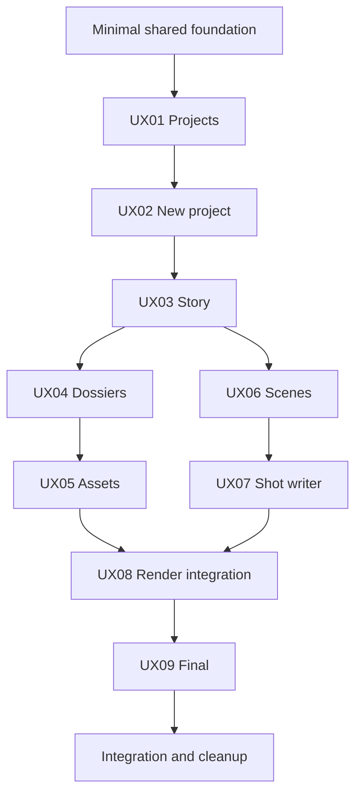

# Rewamp Screen Delivery Tasks

Status: page implementation in progress; UX01, UX02 and the corrected Project Brief
to Full Story UX03 slice are implemented. Detailed status is recorded in each packet.
Owner: Cinematic Studio. Primary role: Product Requirement Architect; UX review
applied sequentially. Updated: 2026-09-21.

## 1. How To Use This Folder

Work one screen at a time, deliver a usable slice, record feedback in its packet,
and revise that screen before moving on as directed. There is no requirement to
finish every backend phase before a screen can be inspected with isolated fixtures.
A fixture preview is not an implemented production workflow.

[007](../007-step-by-step-implementation-plan.md) retains its 53 parent tasks.
This folder decomposes that scope into 65 smaller tasks across 11 work packets:
one shared foundation, nine screen destinations and one integration/cleanup packet.
These are not 65 additional features. A parent is complete only when all its mapped
child scope and acceptance checks are satisfied. Existing verified foundations in
007 are reused; they are not reset to unimplemented or repeated unnecessarily.

Rules and UX remain owned by [000](../000-master.md),
[009](../009-single-mode-writer-shot-authoring.md) and
[010](../010-complete-authoring-screen-redesign.md). This folder owns execution
boundaries, task status, local review notes and evidence; it does not fork requirements.

## 2. Work Packets And Suggested Order

[012 Story file import](../012-story-file-import.md) owns the Setup `.md`/`.txt`
import slice, destination preview and Full Story character extraction. Its four
ordered tasks extend the existing New Project/Story writer ownership.

[012 Story/Chapter/Character integration](012-story-chapter-character-integration.md)
records the 13 original SC-T tasks and their partial implementation evidence for
[011](../011-story-chapters-and-shared-characters.md). The 2026-09-21 iteration adds
seven Planned tasks SC-F01-SC-F07: Setup Season/Chapter targets, Full Story plus
Characters, Character detach/remove, complete initial Chapter generation/navigation,
separate Full Story sections, scoped Chapter reset and focused verification.
It coordinates packets 001/003/004/005/006 without resetting completed RW tasks.
The new iteration is documentation-only and awaits implementation. Existing counts
below describe the original RW task set, not these follow-up tasks.

| Order | Packet | Screen | Tasks | First reviewable result |
|---|---|---|---|---|
| 0 | [001 Shared foundation](001-shared-foundation.md) | Shared | 8 | Protected baseline and minimal shell/contracts |
| 1 | [002 Project library](002-project-library.md) | UX01 | 4 | Open/resume an owned Project |
| 2 | [003 New project](003-new-project.md) | UX02 | 5 | Save a brief and create a manual draft |
| 3 | [004 Story writer](004-story-writer.md) | UX03 | 11 | Write, revise and confirm Full Story; then generate Chapters |
| 4 | [005 Character dossiers](005-character-dossiers.md) | UX04 | 4 | Edit text Characters and return to Chapter |
| 5 | [006 Project assets](006-project-assets.md) | UX05 | 7 | Select existing Looks and environment |
| 6 | [007 Scene overview](007-scene-overview.md) | UX06 | 5 | Add/select/reorder Scenes and Shots |
| 7 | [008 Shot writer](008-shot-writer.md) | UX07 | 7 | Edit one timeline document and save |
| 8 | [009 Render integration](009-render-integration.md) | UX08 | 5 | Writer -> existing Render -> same Shot |
| 9 | [010 Final integration](010-final-integration.md) | UX09 | 4 | Review/download current Chapter clips |
| 10 | [011 Integration and cleanup](011-integration-and-cleanup.md) | Cross-screen | 5 | End-to-end parity and obsolete authoring removal |

Start with RW00.01-RW00.03, then UX01. Finish later foundation contracts only when
their consumers need them. Visual iteration for a later screen can use agreed DTO
fixtures while an earlier screen is being refined. No incomplete fixture workflow
is exposed as a working production action.

## 3. Dependency And Parallel Work Rules



This is screen review order, not an all-or-nothing dependency on whole P00-P08
phases. For example, manually editing Scenes does not require Expression cropping.
Assets and Scene presentation can proceed separately once stable role/Scene IDs and
shared commands are agreed. Render compilation must wait for the actual Shot document
and reference contracts. Each packet states its narrower runtime prerequisite.

| Shared file area | Integration owner | Contributor rule |
|---|---|---|
| Cinematic routes/navigation/header | Packet 001 | Page owners provide component props and route/context changes; land wiring sequentially |
| Cinematic API/schema/domain facade and config loader | Packet 001 with owning backend capability | Agree additive DTO/command change first; no page-local API or direct repository path |
| `CinematicStageContent.tsx` protected extraction | Packet 009 | Other packets consume its public callbacks; do not concurrently extract it |
| `web/src/styles/cinematic.css` | Active page owner for a named authoring selector block | No global selector rewrites; serialize shared file edits |
| `client/i18n/locales/{th,en}/cinematic.json` | Active page owner for agreed page key prefixes | Maintain locale/interpolation parity; serialize overlapping changes |
| `scripts/test-cinematic-video.js` | Packet 001 registers groups; packet 011 verifies aggregate | Page owners add focused assertions; no competing runner |

File names proposed by a page task are provisional until current consumers are
inspected. Reuse current capability folders. Do not make a source directory merely
to mirror each documentation packet, or merge unrelated components to reduce count.

## 4. Non-Negotiable Shared Scope

- One authoring mode and one Shot document, with no per-attribute Shot forms.
- Engine & Target Output, Render/results, Take actions, Shot Queue, Generation Queue
  and Job Center keep their existing UI/behavior per 010.
- Keep existing Generation, References, Assets and Credits entry points. UI mocks
  must never dispatch real provider calls or mutate live project data.
- User work, older Takes, media, IDs and immutable receipts survive replacement.
- Configurable creative defaults/templates use server-owned JSON; provider limits
  and pricing use existing owners. UI labels remain in locale catalogs.
- A normal user sees no raw technical prompt or internal qualification copy.

## 5. Small Verification Groups

Extend `scripts/test-cinematic-video.js`, not a second runner. It currently has
`rewamp-config`, `rewamp-hierarchy`, `rewamp-story`, `rewamp-revisions`,
`rewamp-assets`, `rewamp-preparation`, `rewamp-production`, `rewamp-final`,
`rewamp-migration`, `rewamp-ui`, `rewamp-projects`, `rewamp-new-project` and
`rewamp-all`; current coverage is foundation
coverage, not proof that replacement pages exist.

Available focused selectors include `rewamp-full-story`, `rewamp-scenes` and
`rewamp-shots`. Remaining planned page selectors:
`rewamp-dossiers`,
`rewamp-assets-ui`, `rewamp-writer`, `rewamp-render-integration`, `rewamp-final-ui`.
They are unavailable until registered by RW00.07 with actual tests. Do not instruct
users to run a planned selector as though it exists. Inspect `--help` first.

Run one relevant page group and only affected contract groups after a cohesive
change. Use isolated fixtures, installed repository dependencies and mocked adapters.
Browser review uses the existing owning verification runner with intercepted APIs.
Record 390/820/1440, Thai/English, theme, keyboard/focus and state evidence for the
changed page. Existing protected regions need comparison when their host changes.
An explicit final `rewamp-all` deduplicates these checks, fails on errors, and never
starts paid generation, migrates live data or restarts workers. Live pilot is separate.

## 6. Page Iteration And Handoff

Task statuses: Planned, In progress, Implemented awaiting verification, Verified,
Blocked (name dependency) or Deferred (name follow-up). Writing a packet verifies
only planning. No page is marked complete from documentation or fixtures alone.

Each packet ends with a small feedback/evidence log. For each iteration record:

```text
Iteration/date and child task IDs:
Changed behavior and exact screen section:
Files and shared-contract changes:
Entry URL/entity fixture and next navigation:
Focused test command/result:
Screenshots at 390/820/1440 and any missing viewport:
User feedback / next adjustment:
Remaining dependency / protected-region regression:
Status:
```

Implemented Shot Writer visual verification is owned by
`scripts/verify-cinematic-rewamp-shots.mjs`. It is read-only, requires an owned
Project containing at least one Shot (or explicit Project/Shot environment IDs),
and does not invoke a provider or mutate Project data.

Do not require a new approval gate to continue authorized implementation. A page
can be delivered for iterative review while later work remains planned. A new user
instruction may redirect the next page or refine a completed page; preserve its
already working sibling behavior. Record future scope separately from a local fix.

## 7. Planning Validation

The Character Look -> Scene -> Shot delivery is owned by
[004 section 8](../004-production-assets-and-reference-planning.md#8-character-look-to-sceneshot-delivery-2026-09-25)
as LR01-LR04. It adds only shared Character Look tools, Scene Look selections and
Shot/First Frame/Render reference provenance to packets 005-009. Existing Engine,
Queue, historical media and one-mode writing remain protected. Focused runner:
`node scripts/test-cinematic-video.js rewamp-look-references`; isolated responsive
check: `node scripts/verify-cinematic-shot-workspace.mjs --looks`.

The 2026-09-25 Shot reconciliation is recorded in [008 Shot Writer](008-shot-writer.md)
as SD01-SD07, extending existing RW07/RW08 scope rather than replacing completed
Scene/First Frame work. [009 section 13](../009-single-mode-writer-shot-authoring.md#13-character-dialogue-and-video-prompt-workspace-2026-09-25)
owns the new Cast/speaker mapping, shared voice, readable exchange and separate
Video Prompt requirements. The initial runtime slice is implemented; task 008
records focused automated/browser evidence and remaining live-provider checks.

The 2026-09-22 iteration is tracked in
[013 Scene Environment and Shot First Frame](013-scene-environment-and-shot-first-frame.md).
It scopes UI reuse and the subsequent document-to-media preparation dependency
across packets 006-009; those packets retain their existing capability ownership.

Verified on 2026-09-19 and reconciled on 2026-09-20: 12 Markdown files (this index and 11 work packets), 65 unique
child task IDs, and all 53 existing parent task IDs covered with no unknown parent.
Local links resolve recursively, task handoff metadata/fenced blocks are valid, and
scoped whitespace checks pass. No runtime implementation, tests, provider requests
or live data changes were performed for this task breakdown.
