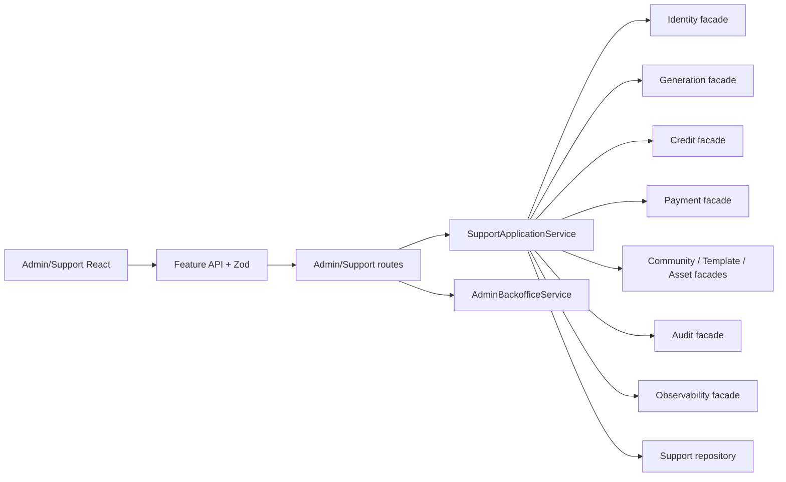

# Admin And Support Implementation Sequence, Data Durability And Rollout

**Status:** Requirement ready for implementation planning  
**Owner:** Support capability with Admin read models  
**Primary role:** Backend Platform Architect  
**Reviewers:** Commercial Financial Integrity, QA And Release Engineer  
**Skills:** `plan-database-migration`, `review-commercial-integrity`, `verify-release-regressions`  
**Implementation in this change:** None

## 1. Outcome

Implement Requirement 017 in dependency order without duplicating Identity,
Generation, Credits, Payments, Community, Templates, Assets, Audit or
Observability workflows. Read-only operations may ship before high-risk
commands, while financial and irreversible commands remain disabled until
durable transactional prerequisites pass.

This plan aligns with Commercial Phase2-03, Phase2-04, Phase2-07, Phase2-08 and
Phase2-18. It does not replace their owner contracts.

## 2. Current Readiness

| Capability | Current readiness for Requirement 017 | Implementation rule |
|---|---|---|
| Admin read models | Partial-ready | extend `AdminBackofficeService`; do not add parallel read facades |
| Staff identity | Development-only | current `admin`/`support` compatibility allowed only under Requirement 017-007 |
| Support Cases | Not implemented | create `SupportApplicationService` and owning repository contract |
| Observability/trace | Partial | extend sanitized correlation lookup and retention; no raw provider payload |
| Audit | Partial local | acceptable for development gates; production high-risk work requires durable append-only storage |
| Generation recovery | Partial | diagnose current Jobs; explicit cancel/recovery owner commands still required |
| Credits | Partial-high local | use `CreditApplicationService`; production mutation waits for SQL ledger transactions |
| Payments | Not implemented | finance payment commands stay unavailable until Phase2-08 |
| Templates | Partial-high | use Template owner lifecycle and version contracts |
| Assets/media lineage | Partial | complete moderation, derivative lineage and delivery authorization contracts |
| Community moderation | Existing partial | extend current owner command; do not duplicate moderation state |

No `Not implemented` capability may be represented as a working disabled-looking
button without an explicit prerequisite explanation or feature exposure policy.

## 3. Canonical Placement And Dependencies

```text
server/app/routes/adminRoutes.js             existing/extended read routes
server/app/routes/supportRoutes.js           Support HTTP translation
server/domain/admin/                         permission-aware read projections
server/domain/support/SupportApplicationService.js
server/domain/support/                       Case and command orchestration
server/repositories/support/                 repository contract + adapters
server/data/support/                         local development data only
web/src/features/admin/                      Operations/Admin routes
web/src/features/support/                    Case and Trace workflows
```

Dependency direction:



Support records intent, evidence, approval and owner operation. It never writes
another capability's repository.

## 4. Durable Support Data Model

### 4.1 Mutable aggregates

`support_cases`

```text
id text primary key
schema_version integer
version bigint
customer_user_id text
category / priority / status
owner_team / assignee_user_id
subject / sanitized_summary
customer_visible_status
financial_impact boolean
created_at / updated_at / resolved_at / closed_at
```

`support_commands`

```text
id text primary key
case_id text foreign key
command_type / target_capability / target_type / target_id
requested_by_user_id / reason_code / sanitized_reason
expected_target_version
risk_tier / approval_policy_snapshot
idempotency_key / dry_run_fingerprint
status / owner_operation_id
safe_result_summary / stable_error_code
financial_before_snapshot / financial_after_snapshot
reconciliation_status
version / created_at / updated_at / completed_at
```

Mutable records use optimistic `version`. Command reason and snapshots are
bounded; raw private prompt/media/provider payload is not stored.

### 4.2 Append-only records

```text
support_case_links
support_case_notes
support_note_redaction_events
support_approvals
support_command_events
audit_events
```

Notes are not silently overwritten. Redaction adds an event and preserves
authorized evidence. Approval requester and approver must differ when policy
requires two people.

### 4.3 Required uniqueness and indexes

- unique Support command idempotency scope;
- unique owner operation link where owner guarantees one operation;
- Case indexes by customer/status/priority/assignee/team/created time;
- Case Link index by capability/entity type/stable entity ID;
- Command indexes by Case/status/risk/target/created time;
- Approval index by command/status/expiry;
- Audit index by actor/Case/target/action/correlation/time;
- cursor lists use stable `(created_at, id)` or an explicitly documented sort.

Generated media bytes never enter PostgreSQL. Support records only authorized
Asset IDs and bounded evidence links.

## 5. Local And Production Adapter Policy

Local development may use:

```text
server/repositories/support/JsonSupportRepository.js
server/data/support/cases.json
server/data/support/case-links.json
server/data/support/case-notes.json
server/data/support/commands.json
server/data/support/approvals.json
```

All writes use the shared atomic JSON store through the owning repository. No
route or domain service hard-codes these paths.

Production requires PostgreSQL for Cases, Commands, Approvals, Audit and every
financially material operation. No production command relies on process memory.
Repository contract tests must pass against both adapters during migration.

## 6. Implementation Phases

### Phase 0 - Contract And Characterization Gate

1. inventory current Admin routes, services, repositories and tests;
2. record protected customer workflows from Requirement 017-006;
3. freeze role/permission and command identifiers from Requirement 017-007;
4. freeze API/Zod error and async-state vocabulary;
5. add feature exposure policy and no-op-disabled defaults;
6. capture current read endpoint performance with seeded MVP data.

Exit: no unknown writer or duplicate Admin/Support entry point remains.

### Phase A - Read-Only Operations

Implement:

- Operations shell/navigation;
- bounded Overview, User Search and Customer 360 summaries;
- sanitized Trace Lookup;
- read-only Finance and Content metadata where owner APIs exist;
- role-aware server authorization and Audit for sensitive reads;
- loading, empty, partial, stale, unauthorized and error states.

No Support mutation endpoint is exposed. This phase may use current local
adapters with explicit scale limits.

Exit: QA Gate A passes and customer runtime remains independent.

### Phase B - Durable Case Foundation

Implement:

- Support repository contract and local adapter;
- `SupportApplicationService` for Case creation, assignment, links, notes and
  lifecycle transitions;
- expected-version concurrency and idempotency;
- Case Inbox/Workspace and durable timeline;
- PostgreSQL tables/adapters before production staff rollout;
- append-only Audit and restart validation.

Exit: QA Gate B passes; Cases survive restart with actor isolation.

### Phase C - R1 Generation Recovery

Implement:

- owner Generation diagnosis, retry/cancel/recover contracts;
- command Preview and immutable dry-run;
- Support Command/Events and owner operation observation;
- unknown-outcome reconciliation and emergency command disable;
- persistent UI operation state and customer-safe resolution.

Credit changes still occur only through the Credit facade. No generic Job edit
endpoint is introduced.

Exit: QA Gate C and Phase2-18 orphan scenarios pass.

### Phase D - Content And Media Containment

Implement in owner order:

1. staff exact-ID/bounded Template and Asset search;
2. Asset derivative/placement lineage and delivery authorization;
3. Community/Template/Asset command Preview;
4. Quarantine/Restore/Disable reuse/Retire/Replace presentation;
5. cache invalidation, fail-closed reconciliation and restricted reveal Audit;
6. Content workspace UI.

Exit: QA Gate D passes for original, derivatives, public placements and reuse.

### Phase E - Financial Commands

Prerequisites:

- real authenticated staff roles and sessions;
- PostgreSQL Support Command/Approval/Audit;
- transactional Credit ledger and idempotency;
- Payment capability for payment commands;
- configured limits and two-person approval;
- exact reconciliation and Commercial review.

Then implement Finance Queue, refund, compensation, Credit reconciliation,
payment refund/reconciliation/webhook replay and durable receipts.

Exit: QA Gate E passes. No financial action ships on local JSON production
state.

### Phase F - Operational Hardening

- alerting for aging Cases, orphan Jobs, reconciliation and moderation failure;
- retention/archival jobs and legal hold;
- production-like pagination/load/restart/backup/restore drills;
- staff runbooks, customer-safe response templates and incident review;
- remove temporary `admin`/`support` compatibility grants after explicit roles
  are active.

## 7. Feature Exposure And Emergency Controls

Server-owned flags/configuration are required for:

```text
ADMIN_OPERATIONS_READ_ENABLED
SUPPORT_CASES_ENABLED
SUPPORT_GENERATION_COMMANDS_ENABLED
ADMIN_CONTENT_COMMANDS_ENABLED
ADMIN_RESTRICTED_MEDIA_REVEAL_ENABLED
ADMIN_FINANCIAL_COMMANDS_ENABLED
STAFF_ROLE_COMPATIBILITY_ENABLED       non-production migration only
```

Names may follow the existing feature exposure registry, but ownership and
behavior must remain equivalent. Disabling commands preserves read access,
existing Cases and in-flight reconciliation. The client cannot override server
exposure.

## 8. Migration And Cutover

Requirement 017 joins Commercial Phase2-03 Wave 1:

```text
Identity/Auth -> Audit/Idempotency -> Support Cases/Commands/Approvals
```

Per adapter cutover:

1. inventory source records/schema versions and writers;
2. backup and generate counts/checksums;
3. deterministic dry-run into staging schema;
4. validate IDs, Case relationships, versions and command uniqueness;
5. enter bounded maintenance/write-capture window;
6. import final delta and switch repository adapter;
7. smoke, restart and reconcile;
8. observe, then archive JSON read-only;
9. remove compatibility bridge at a named checkpoint.

Indefinite dual write is forbidden. Existing opaque IDs are preserved.

## 9. Retention, Privacy And Legal Hold

Before production, policy configuration must define retention classes for:

- Support Case and customer-visible communication;
- internal notes and redaction events;
- Command, Approval and Audit evidence;
- sanitized Observability traces;
- restricted reveal access events;
- payment/refund and financial records;
- quarantined media evidence and legal hold.

Exact durations require Product/Legal/Commercial approval and are not invented
in client code. Until approved, production deletion jobs remain disabled and
records are access-restricted. Legal hold prevents deletion but never restores
public visibility.

## 10. Performance And Capacity Bounds

- every list uses cursor pagination and configured maximum limit;
- exact ID lookup precedes partial search;
- Customer 360 returns bounded summaries and lazy sections;
- no request scans media bytes or all JSON/table rows;
- non-provider local read target starts at P95 under `300ms` with documented
  representative data;
- non-provider local mutation target starts at P95 under `500ms`, excluding
  intentional owner async work;
- Support application, owner command, provider and persistence duration are
  recorded separately;
- all caches/polling declare owner, key scope, invalidation, bound and terminal
  condition;
- restricted data is never cached under a cross-actor key.

Budgets are engineering targets and must be replaced by measured production-
like evidence before a public SLA.

## 11. Rollback And Recovery

### Before material commands

Disable the phase flag and roll back UI/API code while preserving read-only
data and Cases.

### After non-financial commands

Stop new commands, observe owner operation IDs, finish reconciliation and use
forward repair or an adapter rollback with all accepted writes exported.

### After financial commands

PostgreSQL ledger and Support records remain authoritative. Never restore stale
JSON balance or delete ledger history. Disable new commands, reconcile in-
flight operations and deploy compatible forward correction.

Unknown outcome is never resolved by blind retry.

## 12. Implementation Checklist

For each phase:

- name capability owner and canonical application entry point;
- identify existing modules/tests before creating files;
- update API and Zod contracts together;
- add permission, positive, negative, stale, replay and recovery tests first;
- preserve protected behavior inventory;
- implement shared UX states from Requirements 017-005/008;
- propagate request/correlation/Case/Command/owner-operation IDs;
- record performance baseline and bounded query behavior;
- run QA phase gate and retain evidence;
- document rollout, observation and rollback result;
- remove temporary compatibility code at its checkpoint.

## 13. Acceptance IDs

- `IMP-017-01`: implementation follows Phases 0-A-B-C-D-E-F without enabling a
  command before its owner/durability prerequisites.
- `IMP-017-02`: Support has one application facade and no foreign repository
  mutation.
- `IMP-017-03`: local and PostgreSQL adapters satisfy the same repository
  contracts during migration.
- `IMP-017-04`: Cases, Commands, Approvals and Audit survive restart and reject
  replay/concurrency conflicts safely.
- `IMP-017-05`: high-risk financial commands cannot run with mock roles,
  process memory or transactional JSON production state.
- `IMP-017-06`: feature disable preserves reads, evidence and in-flight
  reconciliation.
- `IMP-017-07`: retention/legal hold, pagination, performance and privacy bounds
  are configured before production exposure.
- `IMP-017-08`: migration reconciles counts, links, idempotency and financial
  state before source retirement.
- `IMP-017-09`: each phase has QA evidence and a tested rollback path.
