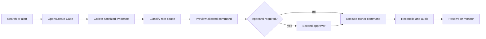

# Admin And Support Management MVP Master

**Status:** Reconciled with current Momelo capabilities on 2026-08-25; phased implementation ready
**Primary role:** Product And Requirement Architect
**Reviewers:** UX/UI Product Designer, Backend Platform Architect
**Skills:** `review-product-ux`, `plan-database-migration`
**Implementation in this change:** None

## 1. Outcome

Momelo shall provide authorized staff one auditable place to find a customer,
trace a request across Jobs and Credits, manage a support case, perform approved
recovery and explain the final financial outcome. Staff must never repair a
customer by editing JSON/database rows directly.

## 2. Current Baseline

The repository currently has:

- `server/domain/admin/AdminBackofficeService.js` for overview and read models;
- `server/domain/admin/AdminPolicyService.js` for current admin access;
- read endpoints for users, generations, community posts, ledgers and audit;
- Community moderation and a Credit adjustment command;
- Audit and Observability capabilities;
- Generation/Credit recovery concepts in Requirement 019 Commercial planning;
- durable Image/Video lifecycle projection through the Unified Generation Job
  Center, including restart recovery and actor-scoped resume;
- Gemini and ModelArk video provider tasks, video pricing, Credit settlement and
  provider diagnostics;
- Cinematic Project/Scene/Shot/attempt/export foundations and operational read
  projections;
- Community video publishing, Character attribution, Video library/profile
  discovery and durable poster reconciliation;
- versioned Attribute Catalog authoring/publication foundations;
- Admin Cinematic and Attribute routes in addition to the original compact
  Operations route.

These are foundations, not the final Support workflow. The MVP extends them;
it does not create alternate Credit, Generation or moderation implementations.

## 3. Scope

### Included

- role-based Admin and Support access;
- operational overview and bounded search;
- customer 360 summary with privacy controls;
- Support Case creation, assignment, notes, evidence and lifecycle;
- correlation/request/Job/Generation Group/Fashion Run lookup;
- payment, Credit reservation and ledger investigation;
- canonical retry, cancellation, refund, compensation and reconciliation
  commands;
- user status/session controls;
- Community moderation handoff;
- cross-status Template and media discovery, quarantine and restoration;
- audit, two-person approval for high-risk actions and reports;
- queues for unresolved financial, orphaned Job and provider incidents;
- one role-aware operational dashboard covering Image/Video Jobs, Cinematic,
  providers, media/poster reconciliation, Content, Attributes and configuration;
- versioned runtime configuration with draft, validation, manual/scheduled
  publication and rollback;
- bounded operations for durable Video tasks, Community video lineage and
  Character attribution;
- database-ready repository and projection contracts for every staff workflow.

### Deferred

- enterprise CRM, call center and live chat;
- tax, accounting general ledger and regulatory reporting;
- automated fraud scoring or chargeback representation;
- creator payout execution beyond the commercial requirements;
- arbitrary SQL console, unrestricted impersonation and bulk destructive tools.

## 4. Capability Model

| Capability | Owns | Support/Admin role |
|---|---|---|
| Admin | dashboards, policy-aware read models | compose summaries only |
| Support | cases, assignments, notes, command requests | canonical case workflow |
| Identity | users, sessions, roles, status | executes user/session commands |
| Observability | correlation and trace lookup | supplies sanitized evidence |
| Generation | Job diagnosis/recovery/cancellation | executes operation commands |
| Credits | accounts, reservations, ledger, adjustments | executes Credit commands |
| Payments | checkout, payment, refund/reconciliation | executes money commands |
| Community | public-post moderation and visibility | executes post moderation commands |
| Templates | Template lifecycle, versions and reuse eligibility | executes disable/restore commands |
| Assets | originals, derivatives, lineage and media quarantine | executes media moderation commands |
| Cinematic | Projects, Scenes, Shots, attempts, source continuity and exports | supplies bounded read models and owner recovery commands |
| Attribute Catalog | definitions, visual assets, validation and category releases | supplies draft/publish/rollback workflows |
| Admin Configuration | versioned provider capability and rate-card revisions | supplies validate/publish/schedule/rollback workflows |
| Generation Job Center | actor-scoped Image/Video activity projection and resume links | supplies read/navigation state only |
| Audit | append-only staff action evidence | records all material access/action |

Support may coordinate a case command through public facades. It may not mutate
foreign repositories.

## 5. Staff Roles

MVP roles are additive and least-privilege:

- `support_agent`: case/search, safe diagnosis, customer communication notes;
- `support_lead`: assignment, approved Generation recovery, small compensation;
- `finance_ops`: payment/refund/reconciliation, no content access by default;
- `moderator`: Community moderation, no financial mutation;
- `admin`: user/session/config oversight, no automatic finance approval;
- `configuration_publisher`: validate/publish/schedule/rollback approved runtime
  configuration, with no unrelated customer or financial access;
- `security_auditor`: read-only security/Audit review and no operational
  mutation;
- `super_admin`: emergency/bootstrap role; use is separately audited.

Role does not imply unrestricted access. Each command has an explicit policy,
reason and risk tier.

## 6. Core Flow



## 7. Case Lifecycle

```text
open -> triaged -> investigating -> action_pending
action_pending -> waiting_approval | executing
waiting_approval -> executing | rejected
executing -> monitoring | action_failed
monitoring -> resolved
any non-closed -> waiting_customer | escalated
resolved -> closed -> reopened
```

Every transition records actor, reason, timestamp and expected case version.

## 8. Requirement Set

- `001-admin-support-console-screen-and-function-contract.md`
- `002-admin-support-backend-api-and-data-contract.md`
- `003-admin-support-financial-security-and-validation.md`
- `004-template-content-and-media-moderation.md`
- `005-admin-support-ux-screen-state-and-notification-contract.md`
- `006-admin-support-qa-validation-and-release-gates.md`
- `007-permission-command-and-approval-matrix.md`
- `008-ux-wireframes-and-responsive-screen-blueprints.md`
- `009-implementation-sequence-data-durability-and-rollout.md`
- `010-versioned-runtime-configuration-and-video-rate-cards.md`
- `011-admin-operations-dashboard-and-shared-workspace.md`

Commercial recovery policy remains under Requirement 019. This set defines the
staff product and Support orchestration boundary.

## 8.1 Cross-Role Coordination Contract

- Requirement 018-001 owns route inventory and product functions.
- Requirement 018-005 owns information hierarchy, interaction, validation,
  Toast, durable async state, accessibility, responsive and theme behavior.
- Requirement 018-002 owns API, domain, repository, idempotency, concurrency and
  observability contracts required by those screens.
- Requirement 018-003 owns financial, approval, privacy and security invariants.
- Requirement 018-004 owns Template and Asset moderation/containment semantics.
- Requirement 018-006 owns acceptance traceability, protected behavior,
  evidence and phase release gates for every requirement in this set.
- Requirement 018-007 owns staff permission, command, risk and approval policy.
- Requirement 018-008 owns low-fidelity route layouts and responsive handoff.
- Requirement 018-009 owns capability readiness, durable data, implementation
  order, migration, feature exposure, rollout and rollback.
- Requirement 018-010 owns the reusable draft/validate/manual-or-scheduled
  publish/rollback lifecycle for frontend-affecting Admin configuration, with
  video capability and rate cards as its first adopter. Credits remains the
  pricing evaluator and Generation remains the provider-dispatch owner.
- Requirement 018-011 owns the Admin landing dashboard, current-capability
  coverage and the reusable staff workspace component contract.

Implementation may be phased, but a phase must not invent a local UI state or
mutation path that conflicts with these owners. UX and QA use the same stable
server error/status vocabulary; QA returns failed behavior to its owning
requirement rather than changing acceptance criteria.

## 8.2 Implementation Readiness

- Phase 0 characterization and Gate A read-only implementation may begin from
  Requirement 018-009.
- Case mutation begins only after the Support repository and lifecycle contract
  are implemented and pass Gate B.
- Generation, content and financial commands remain independently gated by
  their owner-capability and durability prerequisites.
- Runtime configuration bootstrap/parity work may proceed after Phase 0, but
  scheduled pricing publication remains blocked until transactional storage,
  authenticated publisher roles and Audit pass Requirement 018-010.
- Gate E financial commands are intentionally blocked until authenticated staff
  roles, PostgreSQL Support/Audit/Credit records, approval policy and Payment
  contracts are available.

## 9. Global Acceptance

- Staff can trace a billed failed request from one safe support reference.
- Staff cannot execute a command outside their role or without required case
  evidence.
- Retrying a command cannot double-refund, double-credit or duplicate a Job.
- Customer balance and case outcome reconcile to immutable records.
- Sensitive media/prompts are hidden unless explicitly required and authorized.
- Every material read/action appears in Audit with correlation and case ID.
- Existing customer workflows remain available when the Admin console is down.
- The Admin landing page identifies current Image/Video, Cinematic, provider,
  media/poster, Content, Attribute and configuration work without leaking
  unauthorized counts or creating duplicate lifecycle ownership.
- Staff complete common lookup and triage through exact-ID search, URL-backed
  filters and direct owner-workspace links without manual JSON/database edits.
- Shared Admin components unify layout, filter, status, evidence and command
  presentation while domain rules remain behind their canonical facades.
- Production access uses real staff authentication, least privilege, recent
  re-authentication for sensitive actions, independent approval where required
  and append-only Audit.
- Every local repository used by this requirement has a contract-tested
  PostgreSQL migration path with stable IDs, reconciliation, rollback and a
  named compatibility deletion gate.
