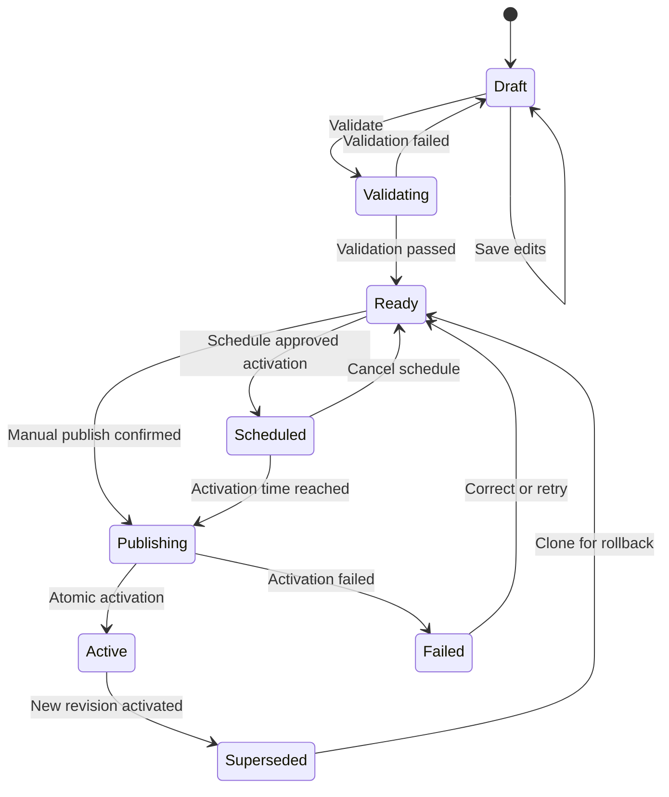

# Versioned Runtime Configuration And Video Rate Cards

**Status:** Shared publication lifecycle planned; existing provider controls are reused
**Owner:** Admin Configuration capability; Credits owns pricing evaluation  
**Primary role:** Product And Requirement Architect  
**Reviewers:** Commercial Financial Integrity, Backend Platform Architect  
**Skills:** `review-commercial-integrity`, `implement-generation-workflow`,
`verify-release-regressions` during implementation  
**Implementation in this change:** Requirement only

## Current Finance Adopter (2026-09-07)

[Admin Finance](../019-implementation-commercial-feature-plan/admin-finance/000-master.md)
is the next requested adopter across image, video and AI-text cost/retail rates.
It owns cost reporting, evidence and the Finance workspace; this requirement
continues to own the single draft/publication/schedule lifecycle. Existing
ProviderControlApplicationService/ProviderAvailabilityPolicyService already
own provider/model emergency controls and must not be rebuilt here.

FIN-002 refines announcement, provider-effective, scheduled and actual activation
dates, cost-only versus retail changes, due-but-delayed activation, and quote
versus execution-cost pinning. Apply those rules to Finance rate scopes without
requiring a qualified video operation to deliver image/text Finance. No runtime
rate or provider availability changes are authorized by this documentation.

FIN-006 additionally adopts this lifecycle for supplier billing-agreement and
service-binding metadata (prepaid/postpaid/hybrid). These are separate scopes
from rate revisions and trigger no external payment/account change. Finance
owns supplier funding events and period reports; this publisher owns only the
approved metadata revision/activation. Rate-specific quote blocking does not
apply to advisory funding metadata without an approved consumer dependency.

## 1. Outcome

Momelo shall let authorized Admin staff prepare, validate, review and activate
runtime configuration that affects customer-facing behavior without changing
the live application at edit time. Every material configuration edit is stored
as a draft revision. It becomes effective only through an explicit manual
publish or an approved scheduled activation.

Video provider capabilities and rate cards remain a detailed adopter of
this platform contract. Admin Finance extends it to image and AI-text pricing
and expense evidence as well. The same lifecycle shall be reusable for future
frontend-affecting configuration rather than each Admin screen implementing its
own draft/publish flags and timers.

## 2. Core Invariants

1. **Editing is never activation.** Save Draft cannot alter frontend controls,
   provider eligibility, quotes or active Jobs.
2. **One active immutable snapshot per scope.** A publish atomically activates
   a validated revision and preserves the previous snapshot.
3. **Manual or scheduled only.** Publish requires an explicit Admin command or
   an approved UTC activation instant.
4. **Accepted work is pinned.** Quotes and Jobs retain the configuration,
   qualification and rate-card versions accepted by the customer.
5. **Server authority.** The browser cannot choose an unpublished revision or
   submit authoritative rates.
6. **Audit and concurrency.** Every change, review, schedule, publish, cancel
   and rollback records actor, reason, diff, version and correlation ID.
7. **Rollback is forward history.** Restoring an old snapshot creates a new
   activation event; history is never rewritten.
8. **Owner evaluation remains separate.** Admin Configuration stores and
   publishes policy; Credits evaluates prices; Generation dispatches providers.

## 3. Scope

### 3.1 MVP scope

- Reusable runtime configuration revision and publication lifecycle.
- Admin video provider/model capability and exposure configuration.
- Provider-cost and retail Credit rate-card revisions, including image/video/
  AI-text through the Admin Finance adopter; provider billing dimensions remain
  owned by their reviewed schemas and calculators.
- Manual publish, scheduled publish, cancel schedule and rollback.
- Draft comparison, validation, impact preview and immutable history.
- Active public snapshot endpoint consumed by provider catalog/Credits.
- Exact version pinning in quotes and Jobs.
- Support read-only inspection and traceability.
- Emergency disable for unsafe or unavailable operations.

### 3.2 Deferred

- General-purpose arbitrary JSON editor.
- Direct provider secret management in the rate-card UI.
- Automatic provider-web-page scraping or unsupervised rate activation.
- Customer-specific negotiated pricing.
- Destructive deletion of revisions or Audit history.

## 4. Configuration Lifecycle



`Draft` and working `Ready` revisions use optimistic concurrency; a material
edit invalidates validation/approval. Editing scheduled content requires
cancelling its schedule and validating a replacement. `Active` and `Superseded`
revisions are immutable.

## 5. Universal Admin Publication Contract

Every Admin-managed setting that changes customer-facing availability,
behavior, price or policy shall declare:

```text
configurationType
configurationScope
schemaVersion
revisionId / revisionNumber
baseActiveRevisionId
status
payloadFingerprint
createdBy / updatedBy / reviewedBy
changeSummary / reasonCode
validationResultVersion
scheduledAtUtc
publishedAtUtc / publishedBy
supersedesRevisionId
optimisticVersion
```

The owning configuration schema defines payload fields. The publication
platform owns revision lifecycle, schedule execution, atomic activation,
history and Audit. It must not interpret business-specific rates itself.

### 5.1 Manual publish

1. Admin opens a Ready revision and reviews the active-versus-draft diff.
2. UI displays affected provider/model/operations and effective customer
   impact.
3. Admin enters a bounded reason and confirms Publish now.
4. Server revalidates permissions, expected version and payload.
5. Activation atomically switches the active pointer and appends Audit/history.
6. Relevant server caches invalidate by revision ID.
7. UI shows success Toast and the new Active badge/version.

### 5.2 Scheduled publish

- Schedule stores an absolute UTC instant and displays it in the staff locale
  with timezone.
- A past time, ambiguous value or overlapping incompatible schedule is rejected.
- Scheduling requires the same validation as manual publish.
- The durable activation worker is idempotent and restart-safe.
- Repeated worker delivery cannot publish twice.
- Editing a scheduled payload requires cancelling the schedule and producing a
  new validated revision.
- The UI shows countdown/effective time, scheduler health and cancellation.
- Preserve actual activation time separately from the scheduled target. A due
  rate scope must commit its approved activation or deny new dependent quotes
  with a scoped pending/error status; it must not silently serve an obsolete
  rate beyond the approved boundary. Accepted work/read/settlement remains
  available under pinned policy. FIN-002 owns the detailed conflict cases.

### 5.3 Rollback

Rollback selects a prior immutable snapshot, clones it into a new revision,
validates current schema/constraints and publishes it manually or by schedule.
Rollback does not mutate old quotes, Jobs or ledger records. Emergency response
may combine rollback with an operation disable, but each is separately audited.

## 6. Video Capability Configuration

Each provider/model/operation record includes:

```text
providerId / modelId / operation
displayTier
qualificationStatus / qualificationVersion
enabledForQuote / enabledForDispatch
durationsSeconds
resolutions / aspectRatios / audioModes
maxImageReferences / acceptedReferenceRoles
supportsCharacterIdentityPack
supportsFirstFrame / supportsLastFrame
providerRegion / serviceTier
effectivePolicyNotes
```

Capability values must be compatible with the provider adapter and Requirement
016-006. Admin may narrow a provider capability but may not claim an ability the
adapter/provider contract does not support. Qualification and commercial
exposure remain separate: a technically capable model is not customer-selectable
until qualified and actively published.

## 7. Video Rate-Card Contract

### 7.1 Provider-cost dimensions

```text
providerId / modelId / operation
providerRateVersion
billingUnit = output_second | completion_token | fixed_operation
currency
unitCost
resolution
audioMode
inputMediaMode
serviceTier / region
minimumBillableUnits
providerEffectiveFromUtc / providerEffectiveToUtc
sourceUrl / sourceReviewedAt
```

### 7.2 Retail policy dimensions

```text
pricingPolicyVersion
pricingFxVersion
operatingSafetyBufferRate
targetGrossMarginRate
creditsPerThb
roundingIncrement
minimumCredits
fundedAdjustmentPolicyId when applicable
```

Provider cost and retail policy are versioned separately but the published
video rate-card snapshot resolves both. Requirement 016-005 remains the
calculation authority. Admin does not store a hand-entered final total for every
possible duration unless the billing model itself is fixed-operation.

### 7.3 Validation

Before Ready/Scheduled/Active, validate:

- provider/model/operation exists in the server registry;
- exact operation is technically qualified or explicitly internal-only;
- all required billing dimensions are present and units are positive;
- resolution, audio, duration and reference dimensions are capability-valid;
- effective ranges do not overlap ambiguously for the same pricing key;
- expiry has a validated successor or the operation fails closed after expiry;
- currency/FX/policy versions exist;
- sample calculations match deterministic calculator fixtures;
- no active customer operation becomes unquotable without a visible impact
  warning and approved reason.

## 8. Frontend Consumption

Customer clients receive only a sanitized active snapshot:

```text
snapshotVersion
publishedAt
qualified enabled operations and capability controls
customer-facing quality tier and estimate inputs
```

Raw provider cost, margin and internal notes are never public. The client does
not receive draft/scheduled configuration. TanStack Query keys include active
snapshot version; publication invalidates the bounded provider/price catalog
cache. Existing open forms reconcile unsupported selections visibly rather than
silently substituting a model.

The quote endpoint reads the current active snapshot and returns the exact
versions used. The submission endpoint verifies the accepted quote rather than
re-resolving a new active price.

## 9. Admin UX

### 9.1 Information architecture

The Configuration workspace is linked from the Requirement 018-011 dashboard
and uses its shared Admin frame, filters, status, entity links and persistent
operation presentation. Revision schema, validation and publication remain
owned here; shared components do not evaluate price or activate a snapshot.

Add a permission-aware Admin workspace with:

1. **Active overview:** current version, effective time, provider operations,
   schedule and warnings.
2. **Draft editor:** provider/model filters, capability form, rate dimensions,
   source evidence and retail calculation preview.
3. **Validation and impact:** errors, warnings, sample quotes and affected
   frontend controls.
4. **Compare:** active versus draft field-level diff.
5. **Publish:** manual/scheduled choice, timezone, reason and confirmation.
6. **History:** immutable versions, actors, diffs, activation events and
   rollback action.

Pricing data is operational and dense: use tables/forms, not decorative cards.
Simple filters, stable columns and clear status badges take priority.

### 9.2 Permissions

- `admin`: create/edit drafts and validate.
- `pricing_publisher` or approved Admin compatibility role: publish/schedule/
  rollback.
- `support`: read-only active/history/quote diagnostics.
- ordinary user: no Admin endpoints.

Production publication supports separation of editor and publisher. If MVP
permits the same Admin for lower-risk actions, edit/publish remain distinct
audited commands with explicit confirmation. R4/two-person requirements from
018-007 cannot be waived by the shared role or this compatibility clause.

### 9.3 Validation and notifications

Field errors remain beside fields; cross-record conflicts appear in a summary
that focuses the first error. Toasts announce draft saved, validation complete,
scheduled, schedule cancelled, published, rollback created and failure. A
Toast never replaces the persistent revision status.

Required states include loading, empty, dirty, saving, validating, invalid,
ready, scheduled, publishing, active, failed, unauthorized and stale-version.

## 10. Emergency Disable

Safety/provider outage containment is distinct from ordinary publication.
Authorized Operations staff may immediately disable new quote/dispatch for an
exact provider/model/operation through an audited emergency command.

- It does not edit or delete the active rate card.
- It does not cancel or reprice accepted Jobs automatically.
- It requires reason, actor, timestamp and correlation ID.
- Frontend capability responses fail closed after bounded cache invalidation.
- Re-enable requires explicit reviewed action; it is not timer-based by
  default.
- In-flight Jobs follow Generation reconciliation and Credit settlement.

## 11. Domain, API And Placement

Canonical placement when implemented:

```text
server/domain/admin-configuration/
  RuntimeConfigurationApplicationService.js
  ConfigurationPublicationService.js
server/repositories/admin-configuration/
server/data/admin-configuration/              local development only
server/app/routes/adminConfigurationRoutes.js
web/src/features/admin/routes/
web/src/features/admin/api/
web/src/features/admin/schemas/
```

Credits consumes active video pricing through an injected/read-only
configuration contract. Generation consumes active capability/exposure through
its catalog contract. Neither reads Admin repository files directly.

Suggested operations:

```text
list revisions/history
create draft from active
patch draft with expectedVersion
validate draft
schedule publication
cancel schedule
publish now
create rollback draft
read sanitized active snapshot
emergency disable/enable exact operation
```

Routes translate HTTP and delegate to one application facade. All Admin routes
use server actor roles, Zod-equivalent validation boundary, stable errors and
Audit.

## 12. Persistence And Migration

Local JSON may support development gates through the shared atomic store, but
production scheduled publication and financial rate history require durable
transactional storage before launch.

Relational entities:

```text
runtime_configuration_sets
runtime_configuration_revisions
runtime_configuration_publications
runtime_configuration_schedules
runtime_configuration_validation_events
runtime_configuration_emergency_controls
audit_events
```

Required uniqueness includes one active revision per configuration scope, one
pending schedule per scope unless explicitly supported, idempotent publication
command and non-overlapping active rate keys. Optimistic version prevents lost
updates.

Migration from static config:

1. inventory current provider/rate sources and checksums;
2. import them as immutable bootstrap revision `1`;
3. validate deterministic sample quotes against current calculators;
4. activate bootstrap snapshot without changing customer behavior;
5. switch read paths behind a feature flag;
6. compare old/new quote results in shadow mode;
7. enable Admin draft/publish only after parity;
8. remove direct static writers at a named checkpoint.

Indefinite dual write is forbidden.

## 13. Observability And Support

Record bounded structured events for draft save, validation, schedule, publish,
rollback, emergency control, cache invalidation and quote snapshot resolution.
Events include configuration scope/revision, actor, correlation, latency and
safe result; they exclude secrets and raw private prompts.

Support can resolve from quote or Job ID to:

```text
active snapshot version at quote time
provider rate and retail policy versions
capability/qualification versions
published actor/time/reason
emergency state at submit time
settlement calculation fingerprint
```

Support cannot edit or publish configuration.

## 14. Implementation Sequence

1. Characterize static provider/pricing readers and protect quote fixtures.
2. Implement revision repository and application facade behind disabled flags.
3. Import static config as bootstrap active revision and prove parity.
4. Implement validation/diff/history read paths.
5. Implement manual publication with atomic active pointer and cache invalidation.
6. Integrate Credits and Generation read-only active snapshot consumers.
7. Add Admin draft editor and manual publish UX.
8. Add durable scheduler, cancel and restart/idempotency evidence.
9. Add rollback and emergency operation controls.
10. Migrate to transactional database before production pricing publication.

Do not start with a visual Admin editor that writes static files directly.

## 15. Acceptance And Release Gates

- `CFG-01`: Save Draft does not change frontend catalog or quotes.
- `CFG-02`: only a validated Ready revision can be manually/scheduled published.
- `CFG-03`: activation atomically replaces one active snapshot and is audited.
- `CFG-04`: scheduled activation fires once across process restart and repeated
  worker delivery.
- `CFG-05`: accepted quote/Job retains old versions after later publication.
- `CFG-06`: overlapping/expired/invalid rates fail validation or fail closed.
- `CFG-07`: deterministic sample calculations match Requirement 016-005.
- `CFG-08`: stale editor version cannot overwrite another Admin's change.
- `CFG-09`: rollback creates a new revision and preserves complete history.
- `CFG-10`: emergency disable blocks new quote/dispatch without mutating ledger
  or accepted Jobs.
- `CFG-11`: support is read-only and ordinary users receive forbidden.
- `CFG-12`: public snapshot contains no provider costs, margins or internal
  notes.
- `CFG-13`: image pricing/provider behavior remains unchanged during video
  adoption.
  Explicit image Finance adoption has its own parity and approved-publication
  gate; it must not modify untargeted provider/workflow behavior.
- `CFG-14`: database backup/restore, scheduler restart and cache invalidation
  evidence pass before production.
- `CFG-15`: all Admin states pass keyboard, responsive, theme and i18n review.

## 16. Launch Blockers

- authenticated staff roles and Audit are production-ready;
- active revision/publication storage is transactional and restart-safe;
- Credits ledger, quote and settlement pin configuration versions;
- each enabled adopter has reviewed pricing/usage coverage; video-specific
  activation additionally requires qualification under Requirement 016-006,
  but this is not a blocker for the image/text Finance adopter;
- Commercial approves retail policy and source evidence;
- QA passes replay, stale edit, schedule, rollback, expiry and emergency tests.
