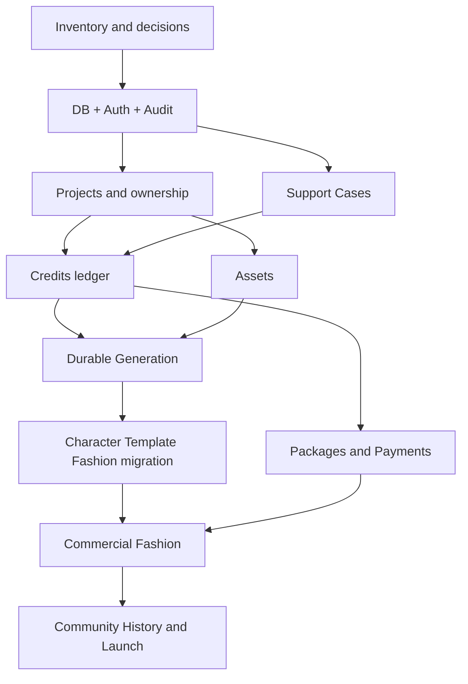

# Phase 2-20 Current-State Reconciliation And Execution Plan

**Status:** Requirement ready; implementation pending
**Updated:** 2026-08-15
**Primary role:** Commercial Financial Integrity
**Reviewers:** Backend Platform Architect, QA And Release Engineer
**Skills:** `review-commercial-integrity`, `plan-database-migration`

## 1. Purpose

This file reconciles Phase2-00 through Phase2-19 with the current Momelo code.
It does not replace each domain requirement. It determines what to reuse, what
must be adapted, and the safest implementation order without rebuilding local
MVP behavior.

## 2. Current-State Classification

| Capability | Classification | Next commercial work |
|---|---|---|
| React shell/routes/themes/i18n | Reuse | authenticated entitlements and operations routes |
| Generation application service | Reuse and adapt adapter | durable Job/Attempt/Worker/outbox |
| provider registry/adapters | Reuse | Worker-only dispatch and video qualification later |
| Credits lifecycle | Reuse and migrate | PostgreSQL transactions and reconciliation |
| Asset metadata/reference upload | Reuse and migrate | private Cloud Storage and signed access |
| Character Profiles | Reuse and migrate | production privacy/version constraints |
| Template/Pose Proxy | Reuse and migrate | durable preparation, Asset/Job linkage |
| Fashion Blueprint | Reuse | Project/Product and production adapters |
| Scene Builder/Studio | Reuse | commercial authorization/entitlements only |
| Admin read models | Reuse and extend | Support Case-oriented operations |
| Projects | Build once | canonical owner/membership aggregate |
| Authentication | Build | production actor/session/roles |
| Payments | Build | package/purchase/provider event/refund/reconcile |
| Support Cases | Build | one orchestration path from diagnosis to recovery |
| Database/Cloud Tasks/Cloud Storage | Build adapters | capability-by-capability cutover |

## 3. Protected Existing Behavior

Commercial implementation must preserve:

- actor-scoped React state/query isolation;
- Character Profile version and reuse/privacy rules;
- Template publication, preparation, use-session and usage pricing;
- Fashion quote/run separation and locked estimate validation;
- Generation Group output-count behavior and terminal polling;
- Credit estimate/reserve/capture/refund/idempotency;
- shared result loader/grid/viewer, queue, Credit dialog and Toast behavior;
- provider capability catalog as the only UI model-support source;
- local MVP workflows while non-production adapters remain enabled.

Adapter parity tests protect these contracts before each cutover.

## 4. Ordered Execution

### Step 0 - Decisions and inventory

- confirm GCP topology, payment provider, data region and legal retention;
- run Phase2-03 Wave 0 inventory and schema-readiness exceptions;
- freeze stable actor, Project, Asset, Job, ledger and Support IDs/contracts;
- inventory direct JSON/local-file/process Queue dependencies;
- establish staging, secrets, Terraform and CI migration gates.

Do not implement checkout or broad database tables before this gate.

### Step 1 - Secure platform foundation

- PostgreSQL migration framework, pool, transactions and adapter contracts;
- real users/credentials/sessions/roles and fail-closed production actor;
- Audit/idempotency and Support Case foundation;
- one authenticated owner-scoped record vertical slice;
- repository contract suites against JSON/PostgreSQL.

### Step 2 - Projects and private ownership

- canonical Project/member aggregate;
- migrate Collections into owner/default Projects by approved mapping;
- enforce Project/owner checks at application facades;
- add server-owned module exposure/entitlement metadata.

### Step 3 - Financial foundation

- migrate Credit account/quote/reservation/ledger/billable-operation records;
- add concurrency, row locks and exact reconciliation;
- expose Support financial read/command path with approvals;
- keep checkout disabled until zero-difference migration and recovery tests pass.

### Step 4 - Assets and durable Generation

- copy/verify private files to Cloud Storage and switch Asset adapter;
- persist Group/Job/Attempt/Event/Result/outbox and Cloud Task identifiers;
- move provider dispatch to Worker;
- prove restart, duplicate task, provider error and orphan reconciliation;
- prove quote -> reservation -> durable Job -> Asset -> capture.

### Step 5 - Commercial product aggregates

- migrate Character, Template, Pose Proxy and Fashion data by Phase2-03 Wave 4;
- add Product catalog and Project links without changing Fashion plan/quote/run
  entry points;
- implement approval/regeneration/refund policy through existing owners;
- keep unqualified quality tiers hidden.

### Step 6 - Packages and payments

- versioned packages/prices and server quote confirmation;
- payment provider checkout and signed/idempotent webhook ingestion;
- purchase/Credit grant/refund reconciliation;
- staff finance queues and Case commands;
- one-time Credit packs only for first paid MVP.

### Step 7 - Discovery/history and launch

- migrate Community/Comparisons/History projections last;
- rebuild derived aggregates from authoritative records;
- backup/restore, load, security/privacy, alert and incident drills;
- legal copy, retention, refund policy and Support staffing;
- controlled beta then public launch.

Subscriptions remain deferred until one-time paid usage and margin evidence is
stable.

## 5. Dependency Graph

## 6. Implementation Checkpoints

At every step:

1. identify capability owner and public facade;
2. add or confirm repository contract;
3. add production adapter without changing callers;
4. build migration dry-run and reconciliation;
5. add positive, actor, duplicate, failure, recovery and rollback tests;
6. cut over in staging;
7. observe and remove the compatibility path at its named gate;
8. update status in Phase2-00 and the owning phase.

## 7. Prohibited Shortcuts

- no new commercial Generation, Fashion or Credit service wrapping the same
  workflow;
- no route-level SQL, provider call or balance mutation;
- no permanent dual write;
- no all-at-once JSON migration;
- no payment acceptance before durable ledger/Job recovery;
- no Admin generic database editor or silent impersonation;
- no production local files, mock actor, JSON transactional state or
  process-only Queue.

## 8. Release Evidence

- infrastructure and configuration fail-closed evidence;
- repository adapter parity and migration checksum reports;
- actor/cross-user authorization matrix;
- ledger/payment/Job exact reconciliation;
- restart, duplicate webhook/task and provider-failure recovery;
- private Asset signed-access/expiry tests;
- Support Case/approval/audit runbook evidence;
- backup restore and rollback/forward-repair drill;
- p95/API/Queue/provider/storage timing and capacity report;
- manual customer journey from registration to paid approved export.

## 9. Current Recommendation

Start with Phase2-01 inventory plus Phase2-03 Wave 0/1 and Phase2-04. Do not
start by migrating Community/history or by implementing payment screens. The
first milestone is an authenticated user writing one owner-scoped PostgreSQL
record with durable Audit and Support context. The second is one financially
reconcilable, restart-safe Generation operation.
