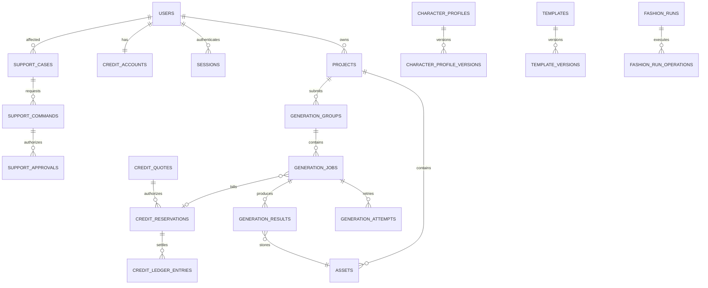

# Phase 2-03 Database Architecture And JSON Migration

**Status:** Bounded source review updated; measured inventory, DDL and cutover pending
**Updated:** 2026-09-07
**Primary role:** Backend Platform Architect
**Reviewers:** Commercial Financial Integrity, QA And Release Engineer
**Skills:** `plan-database-migration`, `review-commercial-integrity`
**Goal:** Replace transactional JSON/process-local persistence with PostgreSQL
adapters in dependency-ordered, reconcilable capability waves.

## 1. Decision Summary

The schema is **not ready for one-shot implementation**. Several local domain
records have mature lifecycle and identifiers, but production identity,
commercial Projects, Payments, production Support persistence, durable Job attempts, object storage and
cross-capability transaction boundaries are incomplete.

The correct plan is:

1. freeze common conventions and build the migration/database foundation;
2. implement the Identity/Authorization/Audit slice, then adapt existing Support;
3. add commercial Project ownership and migrate financial records before payment;
4. migrate Assets and durable Generation orchestration;
5. migrate Character/Template/Fashion and inventory the other existing owners;
6. migrate Collections, Comparison and Community source records, then rebuild
   their derived views and History. These capabilities are not all projections.

Do not migrate all JSON before authentication. Do not add authentication against
mock/JSON-owned production records. Implement a secure vertical slice after the
foundation, then move one capability at a time.

## 2. Current Persistence Inventory

Source review dated 2026-09-07; this is not a completed Wave 0 data inventory.
See Phase2-21 for canonical source evidence. No counts, hashes, orphan report,
database migration or production adapter parity run is claimed here.

| Capability | Current source | Current contract maturity | Production concern |
|---|---|---|---|
| Identity | `server/data/identity/mockUsers.json` | mock actor/user records | no credentials, sessions, roles or real tenant boundary |
| Credits | `server/data/credits/database.json` | estimate/reserve/capture/refund and ledger IDs are mature | one large JSON mutation boundary; no DB concurrency/locking |
| Generation | history/groups and Video Provider Task JSON plus process image Queue | group/Job/Task IDs and shared Job Center exist | local Task persistence is not cross-process worker/lease/outbox durability |
| Assets | `server/data/assets/assets.json`, local files | Asset metadata/ownership exists | private object storage, checksums and lifecycle incomplete |
| Character Profiles | profiles/versions/looks/usage events | version, approved Look and usage lineage exist | relational constraints, Look/version and publication links need freeze |
| Templates | templates/versions/sessions/usage events | mature local lifecycle | version/use/proxy foreign keys and retention need freeze |
| Pose Proxy | pose proxy JSON and generated files | explicit preparation lifecycle | durable Job/Asset linkage required |
| Fashion | quotes/runs JSON | quote/run/operation concepts exist | immutable quote-operation-job-ledger relations need constraints |
| Collections | collections JSON | local owner-scoped aggregate | Project relationship and pagination need production contract |
| Community | posts/characters/engagement JSON | broad local feature set | public snapshot/privacy and denormalized counters need separation |
| Comparisons | comparisons JSON | local product feature | ownership/result links and retention need normalization |
| Audit | audit log JSON | append-oriented events exist | tamper resistance, retention and indexed lookup required |
| Observability | process/request telemetry | IDs exist | durable trace store and retention incomplete |
| Admin/Support | SupportCaseService/SupportCaseRepository, notes/links/versioned updates and Audit | local lifecycle exists | real staff identity, durable storage, approval and recovery boundaries pending |
| Provider controls/configuration | `server/repositories/admin-configuration/` | provider/model/workflow overrides and versions exist | durable policy authority, Audit and cross-process invalidation |
| Reference Processing | `server/domain/reference-processing/` | reference authority and processing contracts exist | classify cache vs source, Asset/Job links and retention before cutover |
| Cinematic | `server/repositories/cinematic/` | Project/Cast/Scene/Shot/Storyboard/Produce/Finish exist | pinned versions, attempts, media and snapshot relationships need separate mapping |
| Payments | none | not ready | provider event, purchase/refund/reconciliation absent |
| Commercial Projects | no generic workspace aggregate | not ready | do not confuse with or replace existing Cinematic Projects |

Whole-file mutation/scan and the process-local JSON mutex create concurrency
and scaling risks; this review does not quantify current latency or file sizes.
Measure them during inventory before claiming performance gains. Provider GCS
handoff already supports signed delivery/checksums but is not the general Asset
storage migration.

## 3. Schema Readiness Matrix

Grades mean readiness to author production DDL, not feature completion.

| Domain | Grade | Ready contracts | Required before DDL freeze |
|---|---|---|---|
| common IDs/timestamps | Partial | stable prefixed opaque IDs | timezone/version/deletion conventions |
| Identity/Auth | Not ready | mock user IDs and actor context | credential/session/role/security-event lifecycle |
| Projects | Not ready | owner IDs used in domains | Project/member/status contract |
| Audit/Idempotency | Partial | audit events and per-domain keys | global event envelope, retention, uniqueness scope |
| Support | Partial | implemented Case/Link/Note lifecycle; planned Command/Approval contracts in Requirements 018-002/007/009 | separate existing data from planned commands; staff Identity FKs, retention and transactional audit |
| Credits | Partial-high | account/reservation/ledger lifecycle | SQL transaction boundaries, entry taxonomy and expiry |
| Pricing/Payments | Not ready | local pricing snapshots | package/price/purchase/payment/refund/provider-event model |
| Assets | Partial | Asset IDs, owner and metadata | object version/checksum/derivative/retention model |
| Generation | Partial | Group/Job/result identifiers and statuses | Attempt/event/lease/outbox/durable Queue contract |
| Character Profiles | Partial-high | Profile/Version/usage lineage | canonical face/identity pack and visibility FK rules |
| Templates/Pose Proxy | Partial-high | Template Version/use session/proxy lifecycle | immutable publication/version and Asset/Job constraints |
| Fashion | Partial-high | quote/run/item/operation concepts | operation settlement and Product/Project relations |
| Collections | Partial | owner and item lists | Project ownership, item union and order constraints |
| Community | Partial | post/public snapshot/engagement IDs | source snapshot, moderation and aggregate consistency |
| Comparisons | Partial | set/result/vote concepts | Generation/result ownership and retention |
| Cinematic | Partial | Project/Scene/Shot, Cast/Look binding and approved media | pinned version/attempt FK rules and compatibility with commercial workspace |
| Reference Processing | Partial | owned references and processing metadata | rebuildable cache vs authoritative asset classification |
| Admin configuration | Partial | override versions, events and provider policy | transactional audit, durable publication and multi-process cache invalidation |

No domain graded `Not ready` may receive final production DDL until its owning
requirement resolves the missing contracts. `Partial-high` still requires DDL,
adapter and reconciliation review.

## 4. Database Conventions

### 4.1 Technology

- PostgreSQL on Cloud SQL in production.
- Explicit versioned migrations committed to source control.
- Connection pool and transaction helper owned by server infrastructure.
- Local development uses PostgreSQL for adapter parity; JSON remains an
  intentional development/migration source until cutover.

### 4.2 Identifiers

- Preserve existing opaque prefixed IDs as `text` primary/public IDs during
  migration. Do not regenerate IDs and break links.
- Never derive authorization, entity type or creation time only from ID text.
- New ID generation remains application-owned and collision-tested.
- Migration map records source file, source ID, destination table/ID and status.

### 4.3 Common columns

Mutable aggregates normally include:

```text
id text primary key
owner_user_id text nullable only by explicit policy
schema_version integer not null
version bigint not null
created_at timestamptz not null
updated_at timestamptz not null
archived_at/deleted_at timestamptz nullable
```

Append-only events use occurrence/record timestamps and no update/delete path.
Soft delete is not automatic; each capability defines archive/retention.

### 4.4 Data types

- money: integer minor units + ISO currency;
- Credits: integer units;
- timestamps: UTC `timestamptz`;
- duration: integer milliseconds;
- checksums/fingerprints: normalized text/binary with algorithm;
- JSONB: bounded immutable provider/config snapshots only, not queryable core
  ownership, money, status or relationships;
- generated media bytes: private object storage, never PostgreSQL.

### 4.5 Constraints

- Foreign keys for authoritative relationships.
- Unique idempotency keys within explicit owner/operation scope.
- Check constraints for non-negative amounts and legal state values where
  stable.
- Optimistic `version` for mutable aggregates.
- Partial uniqueness for one active reservation/session/approved version where
  required.
- Append-only financial/audit tables deny update/delete to application role.

## 5. Target Schema By Capability

Core authoritative relationships:



### 5.1 Foundation, Identity And Support

```text
users
user_credentials
sessions
email_verification_tokens
password_reset_tokens
roles
user_roles
security_events
audit_events
idempotency_records
support_cases
support_case_links
support_case_notes
support_commands
support_approvals
```

`users.id` preserves current actor IDs. Credentials and raw session/reset tokens
are never imported from mock data. Bootstrap users require a controlled account
claim/reset flow.
Mock identity rows must not become active real accounts or staff grants without
an approved claim/bootstrap policy. Full Support Command/Approval implementation
is not a prerequisite for the first authenticated owner-record test.

### 5.2 Projects And Access

```text
projects
project_members
module_entitlements
collections
collection_items
```

One Project owner ships first; membership schema remains valid for later teams.
Records that predate Projects may use a deterministic private migration Project
per owner only after Product approves the mapping.

### 5.3 Assets

```text
assets
asset_objects
asset_derivatives
asset_links
asset_access_events (bounded/audited cases only)
```

Asset rows identify object key, media role, mime, dimensions/duration, checksum,
owner, source and retention. Signed URLs are not stored.

### 5.4 Generation

```text
generation_groups
generation_jobs
generation_attempts
generation_events
generation_results
video_provider_tasks
job_leases
outbox_events
```

History becomes a query/read model over authoritative Job/Result records. It is
not migrated as one opaque history table without classification.

### 5.5 Credits And Payments

```text
credit_accounts
credit_quotes
credit_reservations
credit_ledger_entries
billable_operations
packages
price_versions
purchases
payments
payment_provider_events
payment_refunds
reconciliation_runs
```

Account is a projection; ledger is authoritative. Provider event IDs and
idempotency are unique. Money and Credit records are related but not conflated.

### 5.6 Character, Template And Fashion

```text
character_profiles
character_profile_versions
character_identity_packs
character_looks
character_usage_events
templates
template_versions
template_use_sessions
template_usage_events
template_pose_proxies
fashion_quotes
fashion_runs
fashion_run_operations
fashion_product_items
products
product_variants
```

Public Community posts reference immutable/sanitized source snapshots rather
than becoming the owner of Character or Template source records.

### 5.7 Discovery And Community

```text
community_posts
community_post_media
moderation_events
engagement_events
engagement_daily_aggregates
reactions
remix_events
comparisons
comparison_slots
comparison_votes
```

Counters are rebuildable projections. Events and source ownership remain
authoritative.

### 5.8 Additional Existing Owners

These are inventory/DDL work packages, not already-approved table designs:

- Cinematic Projects, Cast and pinned Character/Look versions, Story Plans,
  Scenes/Shots, approved keyframes, Produce attempts and Finish snapshots.
  Preserve `cineproj_*` IDs; link a commercial workspace only by approved mapping.
- Reference Processing source metadata and Asset lineage; rebuildable caches
  need explicit invalidation/retention rather than blind JSONB import.
- Admin provider/model/workflow overrides, policy versions/events and Audit;
  identify other configuration/catalog runtime writers in Wave 0.

Attach each owner to a reviewed wave before enabling that capability in
production. Never silently leave a live JSON writer outside the migration map.

### 5.9 Proposed Finance Adopter

[Admin Finance](admin-finance/000-master.md) adds cost observations/components,
append-only adjustments, reconciliation links and derived reporting. These are
planned contracts, not existing tables or a DDL-ready financial subsystem.
FIN-001 maps source policy/usage/quote fields; FIN-003 separates expense evidence
from Credit/Payment authority and defines missing-data treatment.
FIN-006 adds supplier accounts, effective service bindings, funding pools/lots,
cash events and settlement allocations; prepaid funding is not another customer
wallet or a duplicate usage expense. FIN-007 adds monthly/yearly/as-of reporting
projections, with cash dates separate from usage periods and boundary balances.

Reuse the Admin Configuration revision/publication/schedule tables from Backend
018-010, with normalized rate dimensions and fixed-decimal unit rates. Do not
create a second Finance scheduler or price history. Financial units/FX precision,
event uniqueness, evidence retention and authorizations must be reviewed before
DDL. Realized revenue/profit is not inferred from mock Credit data.
Supplier billing-agreement versions also use the shared configuration revisions;
switching the local metadata does not perform an external billing-plan change.

Read-only local reporting may precede cutover. Production publication follows
Identity/Audit and transactional configuration storage; durable cost event
capture follows the relevant Generation/AI workflow event dependencies in
Wave 3/4. Payment-derived receipts join only after Wave 5. Track each dependency
explicitly rather than blocking the read-only Finance view on all migrations.

## 6. Dependency-Ordered Migration Waves

### Wave 0 - Inventory and contract freeze

1. Enumerate repository contracts, files, schema versions and direct path reads.
2. Produce per-file counts, IDs, relationship/orphan report and checksums.
3. Classify transactional source, event log, projection, configuration and
   generated file.
4. Resolve the next slice's `Not ready` contracts before its DDL freeze; retain
   named later-wave decisions without blocking Identity on Product or payment.
5. Freeze common DDL/ID/time/retention conventions and ADRs.

Exit: dry-run inventory is reproducible and no unknown writer remains.

### Wave 1 - Database, Identity, Audit and Support foundation

1. migration framework, pool, transaction/unit-of-work and health checks;
2. users, credentials, sessions, roles and security events;
3. audit/idempotency for Identity, followed by existing Support Case data and
   staff identity mapping; Command/Approval tables follow their reviewed scope;
4. authenticated actor vertical slice to one owner-scoped record;
5. production fail-closed for mock actor.

First checkpoint: real session -> actor -> owner-scoped record and Audit, with
mock injection denied. Wave exit additionally requires migrated staff actions
to be durable/audited. Do not wait for the full recovery console to prove login.

### Wave 2 - Projects and Credits

1. Projects/membership and Product-approved owner migration mapping; plan
   Collection links here, keeping its full source migration in Wave 6;
2. Credit quotes/accounts/reservations/ledger/billable operations;
3. exact per-user balance, reservation and ledger reconciliation;
4. concurrency/idempotency tests and Support financial read path.

Exit: no paid operation until Wave 2 passes zero-difference reconciliation.

### Wave 3 - Assets and durable Generation

1. copy/verify private objects to Cloud Storage and migrate Asset metadata;
2. Generation Groups/Jobs/Attempts/Results, Video Provider Tasks/events/outbox;
3. Cloud Tasks worker, leases and restart recovery;
4. one authenticated quote -> reserve -> Job -> Asset -> capture vertical path.

Exit: accepted work survives API/Worker restart and can be diagnosed.

### Wave 4 - Character, Template, Pose Proxy and Fashion

Migrate in dependency order: Character/Version/identity packs/Looks, Template/Version,
Pose Proxy, use sessions/events, Fashion quotes/runs/items/operations. Validate
every Asset, Job, user, Project and ledger relation.

Map Reference Processing alongside Assets/Template preparation. Schedule
Cinematic aggregate adapters after their Identity/Asset/Character/Job
dependencies, or keep that capability off production until its own cutover.
Existing approved images must not be regenerated as part of migration.
Provider-control persistence and invalidation must pass before any enabled
multi-process provider dispatch, even when remaining catalog work is later.

Exit: current Fashion MVP runs on production adapters without alternate paths.

### Wave 5 - Payments and packages

Payment schema may be authored earlier, but checkout is enabled only after
Waves 1-3 and the Credit ledger pass. Import no invented payment history from
mock Credit grants.

Exit: a payment provider event grants/refunds Credits exactly once and
reconciles through Support/Finance queues.

### Wave 6 - Collections, Comparisons, Community sources and History projections

Migrate owner collections and comparison source records, then public Community
snapshots/events. Rebuild derived counts, thumbnails and History views from
authoritative rows where possible.

Exit: no customer-facing transactional JSON writer remains.
This exit applies to the enabled production scope. A capability explicitly
deferred from migration must be disabled there, not silently served from JSON.

## 7. Per-Capability Cutover Runbook

Every wave/capability follows:

```text
freeze inventory
-> backup source and object manifest
-> create destination migration version
-> deterministic dry-run into staging schema
-> validate counts, relationships and domain invariants
-> resolve exception report
-> maintenance or bounded write-capture window
-> final incremental import
-> switch repository adapter
-> smoke and reconciliation
-> observation window
-> make JSON read-only archive
-> delete compatibility bridge at checkpoint
```

### Dual-write rule

Indefinite dual write is forbidden. If traffic makes a short bridge necessary,
the owning requirement must name source/destination authority, write order and
failure behavior, parity metric/alert, maximum duration, rollback/cut-forward
decision point and deletion checkpoint.

## 8. Reconciliation

Migration reports are checksummed and include:

- source/destination counts by entity and lifecycle state;
- duplicate/missing/invalid IDs;
- parent-child and owner/project orphans;
- per-user Credit available/reserved/ledger totals;
- quote/reservation/Job/result settlement links;
- Asset metadata/object checksum/file-missing results;
- Character/Template version and usage lineage;
- collection order/membership and public snapshot links;
- rejected records with stable reason and disposition;
- migration version, code revision, actor and timestamps.

Financial difference must be zero or resolved by an approved compensating entry
before cutover. Dropping or coercing a bad record silently is forbidden.

## 9. Rollback And Forward Recovery

### Before authoritative DB writes

Rollback may restore the prior app and JSON backup after validating no new DB
transactions were accepted.

### After non-financial DB cutover

Pause writes, reconcile the capture window and either switch back with all new
writes exported, or fix forward. The decision is recorded.

### After first financial/paid DB write

PostgreSQL remains authoritative for financial records. Do not restore stale
JSON balances. Roll back application code through compatible migrations and use
audited compensating/forward-repair commands.

Destructive down migrations are prohibited in the release window.

## 10. Performance And Capacity

Before index tuning, establish representative row/payload baselines. Initial
required indexes follow actual queries:

- owner/status/created cursor lists;
- Job group/status/lease and provider request ID;
- ledger user/created, reservation/job and idempotency;
- case customer/status/assignee/created and linked reference;
- Asset owner/checksum/source and object key;
- Profile/Template owner/status/current version;
- Community visibility/status/created and source snapshot.

Define pool limits, statement timeouts, pagination maximums, slow-query logging,
retention/partition candidates and storage growth alerts before beta. Do not add
caches to hide unbounded queries.

## 11. Migration Tooling

Migration scripts belong under `scripts/` and depend on repository/export
contracts, not HTTP routes. Tooling must support:

- `inventory`, `dry-run`, `migrate`, `reconcile`, `resume`, `report`;
- explicit environment and migration version;
- checkpoint/resume without duplication;
- read-only source mode and no secret output;
- fail-fast on unknown schema version;
- deterministic fixtures for CI adapter parity.

## 12. Acceptance Gates

- Repository contract suites pass against JSON and PostgreSQL adapters during
  each transition.
- Production fails closed with mock actor, JSON transactional adapter, local
  durable media or process-only Queue.
- Re-running any migration wave creates no duplicate rows/ledger entries.
- Ownership, actor isolation and foreign keys reject cross-user links.
- Credit/account/ledger/reservation reconciliation is exact.
- Restart, duplicate callback, orphan recovery and rollback drills pass.
- Cloud SQL backup/restore is demonstrated before private beta.
- Compatibility writers are removed after their observation gate.

## 13. Decisions Still Required

- exact migration framework/ORM/query builder after a small proof, not before;
- RPO/RTO and data retention by capability;
- production region, Cloud SQL sizing and connection strategy;
- customer account claim process for mock users;
- legal retention for payment, Audit, Support and deleted accounts;
- maintenance-window tolerance versus temporary write capture.

These decisions must be resolved in Phase2-01/04/17 before the relevant wave;
they do not justify a parallel architecture.
