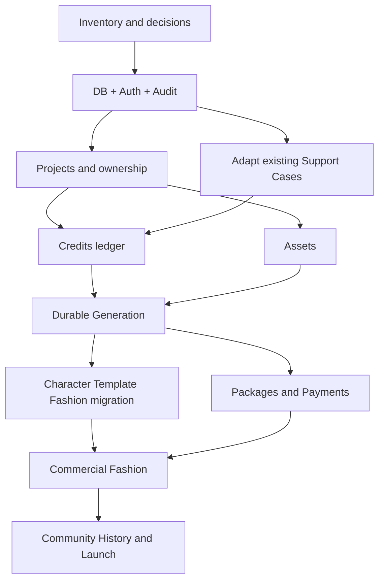

# Phase 2-20 Current-State Reconciliation And Execution Plan

**Status:** Source-reconciled execution plan; production implementation/cutovers pending
**Updated:** 2026-09-07
**Primary role:** Product And Requirement Architect (documentation reconciliation)
**Reviewers:** Backend Platform Architect, QA And Release Engineer
**Skills:** `plan-database-migration`; financial implementation additionally requires `review-commercial-integrity`

## 1. Purpose

This file reconciles Phase2-00 through Phase2-19 with the current Momelo code.
It does not replace each domain requirement. It determines what to reuse, what
must be adapted, and the safest implementation order without rebuilding local
MVP behavior.

Evidence is recorded in [Phase2-21](Phase2-21-current-source-baseline-and-gap-register.md).
Source inspection is not a completed Wave 0 inventory or production test pass.
Backend/security and QA perspectives are applied sequentially in this review,
not claimed as independent certification.

## 2. Current-State Classification

| Capability | Classification | Next commercial work |
|---|---|---|
| React shell/routes/themes/i18n | Reuse | authenticated entitlements and operations routes |
| Generation application service | Reuse and adapt adapter | durable Job/Attempt/Worker/outbox |
| provider registry/adapters and master controls | Reuse | durable dispatch and cross-process policy enforcement; pending video qualification stays separate |
| Credits lifecycle | Reuse and migrate | PostgreSQL transactions and reconciliation |
| Asset metadata/reference upload and provider GCS | Reuse and migrate | general private storage cutover and retention, not recreation of provider handoff |
| Character Profiles | Reuse and migrate | production privacy/version constraints |
| Template/Pose Proxy | Reuse and migrate | durable preparation, Asset/Job linkage |
| Fashion Blueprint | Reuse | Project/Product and production adapters |
| Scene Builder/Studio | Reuse | commercial authorization/entitlements only |
| Admin read models and local Support Cases | Reuse and extend | durable staff identity, approvals and recovery |
| Commercial Projects | Build once | generic workspace ownership; preserve distinct Cinematic Projects |
| Authentication | Build | production actor/session/roles |
| Payments | Build | package/purchase/provider event/refund/reconcile |
| Reference Processing | Reuse and classify | Asset lineage/cache retention; no second authority planner |
| Cinematic Studio | Reuse and map | preserve approved Shot/keyframe/Look/attempt data; independently gate production exposure |
| Database/Cloud Tasks/general Asset storage | Build or extend adapters | capability-by-capability cutover; provider-specific GCS is already present |

## 3. Protected Existing Behavior

Commercial implementation must preserve:

- actor-scoped React state/query isolation;
- Character Profile version and reuse/privacy rules;
- Template publication, preparation, use-session and usage pricing;
- Fashion quote/run separation and locked estimate validation;
- Generation Group output-count behavior and terminal polling;
- Credit estimate/reserve/capture/refund/idempotency;
- shared result loader/grid/viewer, queue, Credit dialog and Toast behavior;
- provider capability catalog as the only UI model-support source;
- local MVP workflows while non-production adapters remain enabled;
- Template Character optional/Outfit required policy, locked pose/scene,
  private derived prompts, no derived reusable-template publication and no
  duplicate image share;
- user-accepted Character previews and Template-to-Scene Builder handoff;
- provider/model master disablement, per-workflow capability constraints and
  saved actor-scoped provider preferences;
- current Comparison sets/history navigation and authoritative result linkage.

Adapter parity tests protect these contracts before each cutover.

## 4. Ordered Execution

### Step 0 - Decisions and inventory

- retain GCP topology; decide local database/auth implementation before coding;
- decide region, retention and provisioning budget before cloud deployment;
  gateway/tax/refund decisions belong before payments, not before local login;
- run Phase2-03 Wave 0 inventory and schema-readiness exceptions;
- freeze stable actor, Project, Asset, Job, ledger and Support IDs/contracts;
- inventory direct JSON/local-file/process Queue dependencies;
- plan staging, secrets, Terraform and CI gates; cloud provisioning is a
  separate approval, not a side effect of requirement reconciliation.

Do not implement checkout or broad database tables before this gate.

### Step 1 - Secure platform foundation

- PostgreSQL migration framework, pool, transactions and adapter contracts;
- real users/credentials/sessions/roles and fail-closed production actor;
- Audit/idempotency for the first Identity slice; then adapt existing Support
  Case persistence and staff identity without rebuilding its local lifecycle;
- one authenticated owner-scoped record vertical slice;
- repository contract suites against JSON/PostgreSQL.

### Step 2 - Projects and private ownership

- canonical Project/member aggregate;
- define approved Collection-to-workspace mapping; full Collection migration
  remains Wave 6, with no forced standalone UI change in this step;
- enforce Project/owner checks at application facades;
- extend existing server feature/provider policy with authenticated exposure;
  purchased entitlements are a distinct later billing concern.

### Step 3 - Financial foundation

- migrate Credit account/quote/reservation/ledger/billable-operation records;
- add concurrency, row locks and exact reconciliation;
- expose Support financial read/command path with approvals;
- keep checkout disabled until zero-difference migration and recovery tests pass.

### Step 4 - Assets and durable Generation

- copy/verify private files to Cloud Storage and switch Asset adapter;
- persist Group/Job/Attempt/Event/Result, Video Provider Tasks/outbox and Cloud Task identifiers;
- move provider dispatch to Worker;
- prove restart, duplicate task, provider error and orphan reconciliation;
- prove quote -> reservation -> durable Job -> Asset -> capture.
- migrate provider-control authority and invalidation before multi-process
  dispatch; configuration disablement must not disappear on worker restart.

### Step 5 - Commercial product aggregates

- migrate Character/Looks, Template, Pose Proxy and Fashion by Phase2-03 Wave 4;
- classify Reference Processing and map existing Cinematic data to dependency
  waves; any unmigrated capability stays off production, not on JSON fallback;
- add Product catalog and Project links without changing Fashion plan/quote/run
  entry points;
- implement approval/regeneration/refund policy through existing owners;
- keep unqualified quality tiers hidden.

### Step 6 - Packages and payments

- versioned packages/prices and server quote confirmation;
- payment provider checkout and signed/idempotent webhook ingestion;
- purchase/Credit grant/refund reconciliation;
- staff finance queues and Case commands;
- one-time Credit packs only for first paid MVP.

### Step 7 - Discovery/history and launch

- migrate Collection/Comparison/Community authoritative source records, then
  rebuild their aggregates and History views; preserve ordering and lineage;
- rebuild derived aggregates from authoritative records;
- backup/restore, load, security/privacy, alert and incident drills;
- legal copy, retention, refund policy and Support staffing;
- controlled beta then public launch.

Subscriptions remain deferred until one-time paid usage and margin evidence is
stable.

## 5. Dependency Graph

## 6. Implementation Checkpoints

At every step:

1. identify capability owner and public facade;
2. add or confirm repository contract;
3. add production adapter without changing callers;
4. build migration dry-run and reconciliation;
5. add positive, actor, duplicate, failure, recovery and rollback tests;
6. cut over in staging;
7. observe and remove the compatibility path at its named gate;
8. update status in Phase2-00 and the owning phase.

## 7. Prohibited Shortcuts

- no new commercial Generation, Fashion or Credit service wrapping the same
  workflow;
- no route-level SQL, provider call or balance mutation;
- no permanent dual write;
- no all-at-once JSON migration;
- no payment acceptance before durable ledger/Job recovery;
- no Admin generic database editor or silent impersonation;
- no production local files, mock actor, JSON transactional state or
  process-only Queue.

## 8. Release Evidence

- infrastructure and configuration fail-closed evidence;
- repository adapter parity and migration checksum reports;
- actor/cross-user authorization matrix;
- ledger/payment/Job exact reconciliation;
- restart, duplicate webhook/task and provider-failure recovery;
- private Asset signed-access/expiry tests;
- Support Case/approval/audit runbook evidence;
- backup restore and rollback/forward-repair drill;
- p95/API/Queue/provider/storage timing and capacity report;
- manual customer journey from registration to paid approved export.

## 9. Current Recommendation

Start with Phase2-01 inventory plus Phase2-03 Wave 0/1 and Phase2-04. Do not
start by migrating Community/history or by implementing payment screens. The
first milestone is an authenticated user writing one owner-scoped PostgreSQL
record with durable Audit. Full Support recovery is not a prerequisite for this
first milestone. The second is one financially
reconcilable, restart-safe Generation operation.

## 10. Small Implementation Tasks And Verification

Task status below is **pending implementation**, not a claim that this review
created a database, migration script or login endpoint.

| Task | Scope and exit artifact | Focused verification |
|---|---|---|
| F0.1 | Enumerate owners, writers, schema versions and source classes | Read-only inventory fixture, unknown-writer failure |
| F0.2 | Counts/hash/ID/orphan and ownership report; backup manifest | Deterministic rerun, missing file/duplicate ID exceptions |
| F0.3 | Choose migration/DB tooling, auth/session approach and account-claim policy | Reviewed decisions; no broad schema or cloud purchase |
| F1.1 | Pool/migration/transaction infrastructure in canonical server folders | Disposable local PostgreSQL migration and transaction rollback |
| F1.2 | Identity/session/token/Audit repository contracts and adapters | Unique email/identity policy, token hashing/expiry, atomic Audit |
| F1.3 | Server auth entry points and trusted actor resolution | CSRF, session revoke, mock-header/query rejection and owner denial |
| F1.4 | Existing ActorProvider and account UI integration | Login/logout/expiry, private cache clearing, desktop/tablet/mobile |
| F1.5 | One durable owner-scoped record and restart proof | Two-account isolation; no provider call, payment or media regeneration |
| F1.6 | Existing Support Case data and staff-role mapping | Case version/note/link parity, audited access; recovery commands later |
| F2.1 | Generic Project contract and approved legacy mapping | Existing Cinematic/Collection IDs and standalone flow unchanged |
| F2.2 | Credit source taxonomy and adapter transaction boundaries | Zero-difference ledger/reservation reconciliation, duplicate/concurrent use |
| F3.1 | General Asset adapter and original-object transfer | Original byte/hash parity, private delivery/expiry and missing objects |
| F3.2 | Durable dispatch, Tasks/leases/outbox and provider-control state | Duplicate/restart/ambiguous-provider-submit recovery with mocked provider |
| F4+ | Continue capability waves from Phase2-03 | One owner at a time; payments only after required durability gates |

### Wave Crosswalk

Execution Steps 0/1 map to database Waves 0/1. Steps 2 and 3 split Wave 2
(Projects and Credits); Step 4 maps to Wave 3; Steps 5/6/7 map to Waves 4/5/6.
Collection mapping is designed early, but Collection source cutover is Wave 6.
Earlier enabled production consumers must use reviewed adapters or remain
disabled until their dependencies migrate; no paid path may depend on a live
JSON writer. Any exception needs a bounded compatibility plan and exit gate.

### Test Script Contract

- During implementation add focused tests under `test/` next to owning suites.
  Run only the affected group and known adjacent regressions at each task.
- Reuse existing scripts where their scope matches. Planned aggregate runner:
  `scripts/test-commercial-foundation.bat` (not created in this docs-only task).
- The runner must offer `inventory`, `identity`, `ownership`, `credits`,
  `assets`, `jobs`, `support` and explicit `all` groups, fail nonzero, and print
  which group failed. Add groups incrementally when their tests exist; missing
  required groups must not silently pass a release run.
- Tests use isolated fixtures and disposable DB/schema. Refuse live runtime
  data writes, production databases and paid provider/payment requests by
  default. No cleanup may target user data.
- `all` is for an explicit broader integration/UAT or production-build gate,
  not every small edit. Manual UAT and production backup/restore drills retain
  separate evidence; a passing unit runner does not replace them.
- Record command, result, environment and unverified gaps before closing a
  task. This requirement update itself requires document/link/diff checks only.
