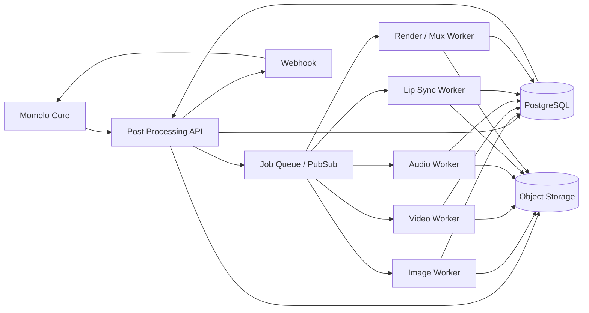

# Momelo Post Processing Service
## Implementation Plan — Image, Video & Audio Enhancement

**Status:** Proposed Architecture  
**Version:** 0.1  
**Updated:** 2026-09-08  
**Purpose:** สร้าง Post Processing Service แยกจาก Momelo Core เพื่อให้ระบบสามารถปรับปรุงภาพ วิดีโอ และเสียงหลัง Generation ได้ โดย Momelo เรียกใช้งานผ่าน API

> Delivery reconciliation, 2026-09-08: the
> [form and export requirements](../../016-cinematic-studio/character-look-sheet-generation/form-and-export/000-master.md)
> scope the initial work to bounded CPU document/Comparison composition and
> configurable branding on explicit Download. Assets owns that facade in the
> current application. This broader GPU/async/cloud proposal remains deferred;
> it does not authorize a second Generation, Character or Credit lifecycle.
> Original media and Seedance transport remain unchanged. Workers may report
> cost/usage; authoritative customer Credit conversion belongs to Momelo's
> server-side Credits capability, never the browser.

---

## 1. Executive Summary

Momelo ควรแยกงาน Post Processing ออกจากระบบ Generation หลักเป็น service อิสระ เพื่อให้สามารถ:

- เปลี่ยน model / algorithm ได้โดยไม่กระทบ Momelo Core
- Scale GPU worker ตามประเภทงานได้อิสระ
- คิดต้นทุนและ credit ตาม compute จริงได้ง่าย
- รองรับ provider หรือ model ใหม่ในอนาคต
- Retry เฉพาะขั้นตอนที่เสีย โดยไม่ต้อง generate asset ใหม่
- ใช้ service เดียวกับ asset ที่สร้างจากหลาย provider
- แยก lifecycle ของ Image / Video / Audio processing อย่างชัดเจน

ชื่อ working name:

`momelo-post-processing-service`

Architecture หลักควรเป็น **Async Job-Based API** ไม่ควรให้ Momelo เปิด HTTP request ค้างไว้จน GPU ทำงานเสร็จ

---

# 2. Scope

## 2.1 Image Processing

รองรับ:

1. Image Upscale
2. Face Restoration
3. Image Enhancement Pipeline
4. Auto enhancement preset
5. Metadata / quality analysis
6. Output format conversion

Initial models:

- Real-ESRGAN — image super-resolution
- GFPGAN — face restoration

---

## 2.2 Video Processing

รองรับ:

1. Video Upscale
2. Video frame enhancement
3. Frame interpolation
4. FPS conversion
5. Video re-encode
6. Audio preservation
7. Optional dialogue replacement
8. Optional lip-sync repair

Initial models:

- RealBasicVSR — video super-resolution
- RIFE / rife-ncnn-vulkan — frame interpolation
- FFmpeg — decode, encode, mux, tempo, audio mixing
- MuseTalk — optional lip-sync repair

---

## 2.3 Audio Processing

รองรับสอง workflow หลัก

### A. Replace Voice

เปลี่ยนเสียงของ speaker หนึ่งคนหรือหลายคน โดยยังรักษา:

- video เดิม
- background ambience
- music
- sound effects
- dialogue ของ speaker อื่น

ตัวอย่าง:

```text
Speaker A / Nara → Replace ทั้งหมด
Speaker B / Ken  → Keep Original
Speaker C        → Keep Original
```

### B. Repair Dialogue

แก้เฉพาะคำหรือประโยคที่ผิด เช่น:

```text
Original:
"วันนี้เราไปเที่ยวเชียงไหมกัน"

Corrected:
"วันนี้เราไปเที่ยวเชียงใหม่กัน"
```

ระบบสร้างเสียงเฉพาะช่วงดังกล่าว แล้วนำกลับไป mix กับเสียงเดิม

---

# 3. High-Level Architecture



หลักสำคัญ:

- API layer ไม่ทำ AI inference
- GPU workload อยู่ใน Worker
- Input / Output media อยู่ใน Object Storage
- Queue ใช้ dispatch job
- PostgreSQL เก็บ job metadata และ usage
- Momelo รับสถานะผ่าน polling หรือ webhook
- ทุก model ถูกอ้างผ่าน Model Registry

---

# 4. Recommended Infrastructure

เนื่องจาก Momelo สามารถ deploy บน cloud ได้หลายแบบ ควรให้ service เป็น cloud-neutral ในระดับ application แต่มี reference deployment สำหรับ Google Cloud

## 4.1 Reference Deployment — Google Cloud

```text
Internet / Momelo
       │
       ▼
Cloud Run
Post Processing API
       │
       ├──────── Cloud SQL PostgreSQL
       │
       ├──────── Cloud Storage
       │
       ├──────── Secret Manager
       │
       └──────── Pub/Sub
                    │
                    ▼
              GPU Worker Pool
               GKE Standard
                    │
        ┌───────────┼─────────────┐
        ▼           ▼             ▼
      Image       Video         Audio
      Worker      Worker        Worker
```

Recommended components:

| Layer | Recommended |
|---|---|
| API | Python + FastAPI |
| API Runtime | Cloud Run |
| Queue | Google Cloud Pub/Sub |
| Metadata DB | PostgreSQL / Cloud SQL |
| Object Storage | Google Cloud Storage |
| GPU Runtime | GKE Standard GPU Node Pools |
| Model Storage | GCS + local node cache |
| Container Registry | Artifact Registry |
| Secrets | Secret Manager |
| Monitoring | OpenTelemetry + Cloud Monitoring |
| Logs | Structured JSON logs |
| Media Processing | FFmpeg / ffprobe |
| Container | Docker |
| Infrastructure as Code | Terraform |
| CI/CD | GitHub Actions / Cloud Build |

Cloud Run เหมาะกับ API stateless ส่วน GPU workloads ควรอยู่ worker pool แยก เพื่อควบคุม GPU scheduling และ warm model ได้ง่ายกว่า

---

# 5. Repository Structure

Recommended monorepo structure:

```text
momelo-post-processing/
│
├── apps/
│   ├── api/
│   │   ├── routes/
│   │   ├── services/
│   │   ├── auth/
│   │   └── main.py
│   │
│   ├── worker-image/
│   ├── worker-video/
│   ├── worker-audio/
│   ├── worker-lipsync/
│   └── worker-render/
│
├── libs/
│   ├── contracts/
│   ├── storage/
│   ├── queue/
│   ├── media/
│   ├── billing/
│   ├── models/
│   └── observability/
│
├── model-registry/
│   └── models.yaml
│
├── infra/
│   ├── terraform/
│   │   ├── dev/
│   │   ├── staging/
│   │   └── production/
│   └── kubernetes/
│
├── docker/
│   ├── image-worker.Dockerfile
│   ├── video-worker.Dockerfile
│   ├── audio-worker.Dockerfile
│   └── lipsync-worker.Dockerfile
│
├── tests/
│   ├── integration/
│   ├── performance/
│   └── golden-media/
│
└── docs/
```

---

# 6. API Design

Base path:

```text
/api/v1
```

---

## 6.1 Capability API

```http
GET /api/v1/capabilities
```

ใช้ให้ Momelo ถามว่า service ปัจจุบันรองรับอะไร

Example response:

```json
{
  "image": {
    "upscale": ["2x", "4x"],
    "face_restore": true
  },
  "video": {
    "upscale": true,
    "frame_interpolation": true,
    "target_fps": [24, 30, 48, 60],
    "lip_sync": true
  },
  "audio": {
    "transcription": true,
    "speaker_diarization": true,
    "replace_voice": true,
    "repair_dialogue": true
  }
}
```

---

# 7. Asset Upload / Download

Media ไม่ควรส่ง binary ผ่าน Post Processing API โดยตรง

ควรใช้ Object Storage และ Signed URL

Flow:

```text
Momelo
  │
  ├── POST /assets/upload-url
  │
  ▼
Signed Upload URL
  │
  ▼
Upload directly to Object Storage
  │
  ▼
POST /jobs
```

## Path

```http
POST /api/v1/assets/upload-url
```

Request:

```json
{
  "filename": "scene-001.mp4",
  "mime_type": "video/mp4",
  "size_bytes": 12500820
}
```

Response:

```json
{
  "asset_id": "ast_01K...",
  "upload_url": "SIGNED_URL",
  "expires_at": "2026-09-08T10:10:00Z"
}
```

Recommended: V4 Signed URL และ short expiry

---

# 8. Unified Job API

## Create Job

```http
POST /api/v1/jobs
```

General request:

```json
{
  "operation": "video.enhance",
  "input": {
    "asset_id": "ast_01K..."
  },
  "options": {},
  "billing_context": {
    "workspace_id": "ws_001",
    "user_id": "usr_001",
    "project_id": "prj_001"
  },
  "webhook": {
    "url": "https://momelo.app/api/post-processing/callback"
  }
}
```

Response:

```json
{
  "job_id": "job_01K...",
  "status": "queued",
  "estimated_usage": {
    "unit": "credit",
    "min": 8,
    "max": 12
  }
}
```

---

## Get Job

```http
GET /api/v1/jobs/{job_id}
```

Response:

```json
{
  "job_id": "job_01K...",
  "operation": "video.enhance",
  "status": "processing",
  "progress": 63,
  "current_stage": "video_upscale",
  "created_at": "2026-09-08T10:00:00Z",
  "started_at": "2026-09-08T10:00:04Z"
}
```

---

## Cancel Job

```http
POST /api/v1/jobs/{job_id}/cancel
```

---

## Retry Job

```http
POST /api/v1/jobs/{job_id}/retry
```

ควร retry จาก stage ที่ fail ได้ถ้า intermediate artifact ยังอยู่

---

# 9. Job Status

Standard state machine:

```text
created
  ↓
queued
  ↓
preprocessing
  ↓
processing
  ↓
postprocessing
  ↓
uploading
  ↓
completed
```

Failure states:

```text
failed
cancelled
expired
```

แต่ละ job ต้องมี:

```text
progress
current_stage
error_code
error_message
retryable
```

---

# 10. Image Processing

## 10.1 Image Upscale

Path:

```http
POST /api/v1/image/upscale
```

หรือใช้ unified:

```json
{
  "operation": "image.upscale",
  "input": {
    "asset_id": "ast_image_001"
  },
  "options": {
    "scale": 2,
    "model": "auto",
    "face_restore": true,
    "output_format": "webp",
    "quality": 95
  }
}
```

Recommended flow:

```text
Input
 ↓
Media validation
 ↓
Image analysis
 ↓
Real-ESRGAN
 ↓
Optional Face Detection
 ↓
GFPGAN
 ↓
Color / format normalization
 ↓
Output
```

---

## 10.2 Image Output Schema

```json
{
  "asset": {
    "asset_id": "ast_output_001",
    "mime_type": "image/webp",
    "width": 2048,
    "height": 3072,
    "size_bytes": 4812210,
    "download_url": "SIGNED_URL"
  },
  "processing": {
    "scale": 2,
    "models": [
      {
        "name": "Real-ESRGAN",
        "version": "..."
      },
      {
        "name": "GFPGAN",
        "version": "..."
      }
    ]
  }
}
```

---

# 11. Video Processing

## 11.1 Video Enhance

```http
POST /api/v1/video/enhance
```

Request:

```json
{
  "input": {
    "asset_id": "ast_video_001"
  },
  "options": {
    "upscale": {
      "enabled": true,
      "target": "1080p",
      "model": "realbasicvsr"
    },
    "frame_interpolation": {
      "enabled": true,
      "target_fps": 60
    },
    "audio": {
      "preserve": true
    },
    "output": {
      "container": "mp4",
      "video_codec": "h264",
      "audio_codec": "aac"
    }
  }
}
```

---

## 11.2 Video Pipeline

```text
Input MP4
   │
   ▼
ffprobe
   │
   ├── resolution
   ├── fps
   ├── duration
   ├── codec
   └── audio streams
   │
   ▼
Decode Frames
   │
   ▼
RealBasicVSR
   │
   ▼
Optional RIFE
   │
   ▼
Encode Video
   │
   ▼
Mux Original / Processed Audio
   │
   ▼
Output MP4
```

---

# 12. Audio Analysis Pipeline

ก่อน Replace หรือ Repair ต้อง Analyze ก่อน

Path:

```http
POST /api/v1/audio/analyze
```

Input:

```json
{
  "asset_id": "ast_video_001",
  "options": {
    "transcribe": true,
    "word_timestamps": true,
    "speaker_diarization": true,
    "separate_background": true,
    "language": "th"
  }
}
```

Pipeline:

```text
Video
  │
  ▼
FFmpeg Extract Audio
  │
  ├───────────────┐
  ▼               ▼
Speech STT      Source Separation
WhisperX       Demucs / provider adapter
  │               │
  ▼               ├── vocal/dialogue
Word Timing        └── background
  │
  ▼
Speaker Diarization
pyannote.audio
  │
  ▼
Speaker Segments
```

---

# 13. Multi-Speaker Schema

ระบบไม่ควรยึดเพศเป็น identifier

ใช้:

```text
speaker_00
speaker_01
speaker_02
```

แล้วให้ Momelo map กับ Character

Example:

```json
{
  "speakers": [
    {
      "speaker_id": "spk_00",
      "character_id": "char_nara",
      "voice_id": "voice_nara"
    },
    {
      "speaker_id": "spk_01",
      "character_id": "char_ken",
      "voice_id": "voice_ken"
    }
  ]
}
```

Diarization มีหน้าที่ตอบ:

> ใครพูดช่วงไหน

Character mapping มีหน้าที่ตอบ:

> speaker คนนี้คือ character ใด

ไม่ควรใช้ gender classification เป็น primary logic

---

# 14. Transcript Schema

```json
{
  "language": "th",
  "duration_ms": 6830,
  "segments": [
    {
      "segment_id": "seg_001",
      "speaker_id": "spk_00",
      "start_ms": 0,
      "end_ms": 2180,
      "text": "เราไปกันเลยไหม",
      "confidence": 0.93,
      "words": [
        {
          "text": "เรา",
          "start_ms": 120,
          "end_ms": 420,
          "confidence": 0.96
        }
      ]
    },
    {
      "segment_id": "seg_002",
      "speaker_id": "spk_01",
      "start_ms": 2240,
      "end_ms": 3910,
      "text": "โอเค ไปกัน",
      "confidence": 0.95
    }
  ]
}
```

---

# 15. Voice Asset

Voice ควรเป็น asset แยกจาก character

```http
POST /api/v1/voices
```

Input:

```json
{
  "name": "Nara Voice",
  "reference_asset_id": "ast_voice_001",
  "language": "th",
  "character_id": "char_nara",
  "consent": {
    "confirmed": true,
    "source": "user_upload",
    "confirmed_at": "2026-09-08T10:00:00Z"
  }
}
```

Internal Voice Schema:

```json
{
  "voice_id": "voice_001",
  "owner_workspace_id": "ws_001",
  "character_id": "char_nara",
  "language": "th",
  "status": "ready",
  "embedding_uri": "private://voices/voice_001/embedding.bin",
  "reference_asset_id": "ast_voice_001",
  "model_profile": {
    "provider": "openvoice",
    "version": "v2"
  }
}
```

Voice embedding ต้องเป็น private asset และห้าม expose ผ่าน public URL

---

# 16. Replace Voice

Path:

```http
POST /api/v1/audio/replace-voice
```

Example:

```json
{
  "input": {
    "asset_id": "ast_video_001",
    "analysis_id": "analysis_001"
  },
  "speaker_map": [
    {
      "speaker_id": "spk_00",
      "voice_id": "voice_nara",
      "replace": true
    },
    {
      "speaker_id": "spk_01",
      "replace": false
    }
  ],
  "options": {
    "preserve_background": true,
    "timing_policy": "match_original",
    "lip_sync": false
  }
}
```

Pipeline:

```text
Original Video
      │
      ▼
Audio Separation
      │
      ├──── Background
      │
      ▼
Speaker Timeline
      │
      ▼
Replace Selected Speaker
      │
      ▼
TTS / Voice Conversion
      │
      ▼
Duration Matching
      │
      ▼
Mix with Background
      │
      ▼
Mux into Video
```

---

# 17. Repair Dialogue

Path:

```http
POST /api/v1/audio/repair-dialogue
```

Request:

```json
{
  "input": {
    "asset_id": "ast_video_001",
    "analysis_id": "analysis_001"
  },
  "repairs": [
    {
      "segment_id": "seg_004",
      "speaker_id": "spk_00",
      "voice_id": "voice_nara",
      "corrected_text": "วันนี้เราไปเที่ยวเชียงใหม่กันค่ะ"
    }
  ],
  "options": {
    "preserve_background": true,
    "timing_policy": "match_original",
    "crossfade_ms": 80,
    "lip_sync": false
  }
}
```

Repair pipeline:

```text
Selected Segment
      │
      ▼
Corrected Text
      │
      ▼
Voice Generation
      │
      ▼
Duration Compare
      │
      ├── close enough → use directly
      │
      └── mismatch → tempo / rate adjustment
      │
      ▼
Crossfade
      │
      ▼
Replace Original Dialogue Segment
      │
      ▼
Mix Background
```

---

# 18. Timing Policy

Supported:

```text
natural
match_original
fit_segment
```

### natural

ไม่ force duration ให้เท่าของเดิม

### match_original

พยายาม generate ด้วย speech-rate ใกล้ duration เดิมก่อน

### fit_segment

force output ให้เข้าในช่วงเวลาเดิม

Recommended logic:

```text
difference <= 5%     → no adjustment
difference <= 15%    → speech-rate adjustment
difference <= 25%    → generate retry + rate adjustment
difference > 25%     → warn user / lip-sync recommended
```

ค่าข้างต้นเป็น initial product heuristic ต้อง benchmark ก่อน production

---

# 19. Lip Sync Repair

Optional path:

```http
POST /api/v1/video/lip-sync
```

Use case:

- dialogue ถูกเปลี่ยนมาก
- duration เปลี่ยน
- mouth shape เดิมไม่ตรงเสียงใหม่

Initial candidate:

`MuseTalk`

Request:

```json
{
  "input": {
    "asset_id": "ast_video_001"
  },
  "audio_asset_id": "ast_audio_repaired",
  "segments": [
    {
      "start_ms": 2000,
      "end_ms": 5200,
      "face_track_id": "face_001"
    }
  ]
}
```

ควรทำเฉพาะช่วงที่ต้องแก้ ไม่ควร render ทั้ง video หากไม่จำเป็น

---

# 20. Core Technology Stack

## Backend

```text
Python 3.11+
FastAPI
Pydantic
SQLAlchemy
Alembic
PostgreSQL
```

## AI / GPU

```text
PyTorch
CUDA
Real-ESRGAN
GFPGAN
RealBasicVSR
RIFE
WhisperX
pyannote.audio
OpenVoice
GPT-SoVITS adapter
MuseTalk
```

## Media

```text
FFmpeg
ffprobe
libav-compatible codecs
```

## Infrastructure

```text
Docker
Kubernetes
Terraform
Google Cloud Pub/Sub
Google Cloud Storage
Cloud SQL
Secret Manager
OpenTelemetry
```

---

# 21. Model Adapter Interface

Momelo ไม่ควรเรียก model package ตรงๆ

ทุก model ควรอยู่หลัง adapter

Example:

```python
class ImageUpscaler:
    def process(self, input_path, options):
        ...

class VideoUpscaler:
    def process(self, input_path, options):
        ...

class SpeechRecognizer:
    def transcribe(self, audio_path, options):
        ...

class SpeakerDiarizer:
    def diarize(self, audio_path, options):
        ...

class VoiceGenerator:
    def generate(self, text, voice_profile, options):
        ...

class LipSyncProcessor:
    def process(self, video, audio, segments):
        ...
```

ทำให้เปลี่ยน model ได้ เช่น:

```text
VoiceGenerator
   ├── OpenVoiceAdapter
   ├── GPTSoVITSAdapter
   └── FutureThaiTTSAdapter
```

โดยไม่กระทบ API contract

---

# 22. Model Registry

ต้องมี Model Registry ตั้งแต่เริ่มต้น

```yaml
- id: real-esrgan
  version: "..."
  capability: image_upscale
  code_license: BSD-3-Clause
  weights_license: VERIFY
  commercial_allowed: true
  source: https://github.com/xinntao/Real-ESRGAN
  checksum: "sha256:..."

- id: gfpgan
  version: "..."
  capability: face_restore
  code_license: Apache-2.0
  weights_license: VERIFY
  commercial_allowed: true
  source: https://github.com/TencentARC/GFPGAN
```

Fields required:

```text
model_id
model_version
model_hash
source_url
code_license
weights_license
dataset_restriction
commercial_allowed
approved_at
approved_by
```

**Important:** code license, model-weight license และ dataset restriction ต้องตรวจแยกกัน

---

# 23. Initial Model Matrix

| Capability | Candidate | Role | Code License / Note |
|---|---|---|---|
| Image upscale | Real-ESRGAN | 2x / 4x | BSD-3-Clause upstream |
| Face restore | GFPGAN | Face restoration | Apache-2.0 |
| Video upscale | RealBasicVSR | Temporal video SR | Apache-2.0 |
| Frame interpolation | rife-ncnn-vulkan | FPS interpolation | MIT |
| Speech recognition | WhisperX | STT + word timing | BSD-2-Clause |
| Speaker diarization | pyannote.audio | Speaker separation timeline | MIT framework; model terms must be checked |
| Audio source separation | Demucs | Vocal/background separation | MIT; original Meta repo archived |
| Voice cloning / conversion | OpenVoice V2 | Voice identity transfer | MIT; official project states commercial use allowed |
| Advanced voice | GPT-SoVITS | Alternative voice engine | MIT code; verify every model/checkpoint used |
| Lip sync | MuseTalk | Audio-driven lip sync | MIT code; project states trained model usable commercially; verify dependencies |

---

# 24. Thai Voice Strategy

OpenVoice V2 upstream ระบุ native support หลักสำหรับ:

- English
- Spanish
- French
- Chinese
- Japanese
- Korean

ดังนั้นภาษาไทยต้อง benchmark แยกก่อน production

อย่าให้ API ผูกกับ OpenVoice โดยตรง

Recommended:

```text
Voice Provider Router
       │
       ├── OpenVoice
       ├── GPT-SoVITS
       └── Thai Voice Provider / Future Model
```

Benchmark criteria:

```text
Thai pronunciation accuracy
tone accuracy
character voice similarity
naturalness
emotion retention
duration controllability
GPU speed
VRAM
commercial license
```

---

# 25. Job Data Schema

Recommended database entities:

```text
assets
jobs
job_stages
job_outputs
model_runs
usage_records
voices
voice_consents
audio_analyses
speakers
transcript_segments
dialogue_repairs
webhook_deliveries
```

---

## jobs

```text
id
workspace_id
user_id
project_id
operation
status
progress
current_stage
input_asset_id
options_json
created_at
started_at
completed_at
error_code
error_message
idempotency_key
```

---

## model_runs

```text
id
job_id
model_id
model_version
device_type
gpu_seconds
cpu_seconds
peak_vram_mb
input_units
output_units
started_at
completed_at
```

---

## usage_records

```text
id
job_id
workspace_id
operation
gpu_seconds
cpu_seconds
input_megapixels
output_megapixels
video_seconds
audio_seconds
storage_bytes
egress_bytes
raw_cost
loaded_cost
credits
created_at
```

นี่เป็นข้อมูลสำคัญสำหรับ pricing ในอนาคต

---

# 26. Input Validation

ทุก job ต้องตรวจ:

### Image

```text
mime type
width
height
pixel count
alpha channel
file size
corruption
```

### Video

```text
container
codec
resolution
fps
duration
bitrate
frame count
audio track
rotation metadata
```

### Audio

```text
sample rate
channels
duration
codec
clipping
silence
```

ใช้ `ffprobe` เป็น media metadata source หลักสำหรับ video/audio

---

# 27. Error Codes

Example:

```text
INVALID_ASSET
UNSUPPORTED_FORMAT
ASSET_NOT_FOUND
MODEL_NOT_AVAILABLE
MODEL_LICENSE_BLOCKED
INPUT_TOO_LARGE
GPU_OUT_OF_MEMORY
PROCESSING_TIMEOUT
AUDIO_NO_SPEECH
SPEAKER_NOT_FOUND
VOICE_NOT_READY
VOICE_LANGUAGE_UNSUPPORTED
DIARIZATION_FAILED
TRANSCRIPTION_FAILED
LIPSYNC_FAILED
OUTPUT_UPLOAD_FAILED
CANCELLED
```

Error response:

```json
{
  "error": {
    "code": "VOICE_LANGUAGE_UNSUPPORTED",
    "message": "Selected voice model cannot reliably process Thai.",
    "retryable": false
  }
}
```

---

# 28. Idempotency

Momelo อาจ retry request จาก network timeout

ทุก create operation ควรรองรับ:

```http
Idempotency-Key: <uuid>
```

หาก key เดิมถูกเรียกซ้ำ:

- ห้ามสร้าง GPU job ซ้ำ
- คืน job_id เดิม

นี่ช่วยป้องกัน credit ถูกหักซ้ำ

---

# 29. Webhook

Momelo สามารถ polling ได้ แต่ production ควรมี webhook

Events:

```text
job.started
job.progress
job.completed
job.failed
job.cancelled
```

Payload:

```json
{
  "event": "job.completed",
  "job_id": "job_001",
  "timestamp": "2026-09-08T10:20:00Z",
  "output": {
    "asset_id": "ast_output_001"
  },
  "usage": {
    "credits": 12
  }
}
```

Webhook ต้อง sign ด้วย HMAC

Header:

```text
X-Momelo-Signature
X-Momelo-Timestamp
```

---

# 30. Pricing Model

อย่าคิดต้นทุน Post Processing แบบ flat ต่อ request

ควรแยก **Internal Compute Cost** ออกจาก **Momelo Credit Price**

## 30.1 Raw Cost

```text
raw_cost =
    gpu_seconds × gpu_second_rate
  + cpu_seconds × cpu_second_rate
  + storage_gb_day × storage_rate
  + egress_gb × egress_rate
  + external_api_cost
```

---

## 30.2 Loaded Cost

เพิ่ม cost ที่เกิดจริงแต่ไม่ได้อยู่ใน inference ตรงๆ

```text
loaded_cost =
    raw_cost
    × (1 + infrastructure_overhead)
    × (1 + retry_reserve)
```

Suggested fields:

```text
infrastructure_overhead = 10–20%
retry_reserve = 5–15%
```

ค่าจริงต้องหาโดย benchmark + billing data

---

## 30.3 Selling Price

```text
sell_price =
    loaded_cost / (1 - target_gross_margin)
```

ตัวอย่าง:

```text
target margin 40% → cost / 0.60
target margin 50% → cost / 0.50
target margin 60% → cost / 0.40
```

---

## 30.4 Convert to Momelo Credits

สมมติ Momelo กำหนด:

```text
1 Momelo Credit = configurable monetary value
```

Formula:

```text
credits =
ceil(
    sell_price / credit_value
)
```

ห้าม hard-code credit value ใน worker

ควรให้ Billing Service หรือ configuration เป็นเจ้าของค่า

---

# 31. User-Friendly Billing Units

แม้ backend จะคิด GPU seconds แต่ UI ไม่ควรแสดง GPU seconds

ควรแสดงแบบ:

| Function | User Billing Unit |
|---|---|
| Image Upscale | per image + megapixel tier |
| Face Enhance | per detected/processed image |
| Video Upscale | per video second × resolution tier |
| Frame Interpolation | per video second × target FPS factor |
| Audio Analysis | per audio minute |
| Voice Replace | per generated dialogue second |
| Dialogue Repair | per repaired dialogue second |
| Lip Sync | per processed face-second |

---

# 32. Suggested Usage Formula by Function

## Image Upscale

```text
units =
input_megapixels
× upscale_factor
× model_factor
```

Example model factors:

```text
2x upscale → factor A
4x upscale → factor B
face restore → + face_factor
```

อย่ากำหนด A/B จนกว่าจะ benchmark จริง

---

## Video Upscale

```text
units =
duration_seconds
× resolution_factor
× upscale_factor
× model_factor
```

Example resolution factor concept:

```text
<= 480p   = 0.5
720p      = 1.0
1080p     = 2.0
4K        = 4.0+
```

ค่าจริงต้อง derive จาก GPU benchmark

---

## Frame Interpolation

```text
units =
duration_seconds
× output_fps / input_fps
× interpolation_factor
```

---

## Audio Analysis

```text
units =
duration_minutes
× (
  transcription_factor
  + diarization_factor
  + separation_factor
)
```

---

## Voice Replace

ควรคิดเฉพาะช่วง speech ที่ generate ใหม่ ไม่ใช่ความยาว video ทั้งหมด

```text
units =
generated_dialogue_seconds
× voice_model_factor
```

---

## Dialogue Repair

```text
units =
repaired_dialogue_seconds
× voice_model_factor
+ fixed_segment_overhead
```

ข้อดีคือแก้คำผิด 2 วินาทีจะถูกกว่า replace คลิป 30 วินาที

---

## Lip Sync

```text
units =
processed_face_seconds
× lipsync_model_factor
```

อย่าคิดจาก video duration ทั้งหมดถ้าแก้เฉพาะบางช่วง

---

# 33. Price Estimation API

Momelo ควรถามราคาก่อน submit

```http
POST /api/v1/pricing/estimate
```

Request:

```json
{
  "operation": "video.enhance",
  "input": {
    "asset_id": "ast_video_001"
  },
  "options": {
    "target": "1080p",
    "target_fps": 60
  }
}
```

Response:

```json
{
  "estimate_id": "est_001",
  "credits": {
    "min": 12,
    "max": 16
  },
  "expires_at": "2026-09-08T10:15:00Z",
  "breakdown": {
    "video_upscale": 9,
    "frame_interpolation": 5
  }
}
```

Final charge ใช้ actual usage หรือ capped estimate ตาม product policy

---

# 34. Recommended Charging Policy

สำหรับ UX ของ Momelo:

### Before processing

แสดง:

```text
Estimated: 12–16 credits
```

Reserve:

```text
16 credits
```

### After processing

Actual:

```text
14 credits
```

ระบบ charge 14 และ release 2

ข้อดี:

- ไม่มี negative balance กลาง job
- user เห็นราคาโดยประมาณก่อนเริ่ม
- ต้นทุน service ไม่หลุดเมื่อ input ใหญ่กว่าที่คิด

---

# 35. GPU Scheduling

แยก queue ตาม workload:

```text
queue.image.fast
queue.image.heavy

queue.video.upscale
queue.video.interpolate

queue.audio.analysis
queue.audio.voice

queue.video.lipsync
```

Worker แต่ละประเภท scale แยกกัน

ไม่ควรให้ RealBasicVSR job ยาวๆ block Image Upscale

---

# 36. GPU Worker Profiles

ตั้ง profile จาก benchmark ไม่ใช่ผูกกับ GPU รุ่นเดียว

Example:

```text
GPU_SMALL
GPU_MEDIUM
GPU_LARGE
```

Model Registry ระบุ:

```text
minimum_vram
recommended_vram
batch_support
precision
```

Example:

```yaml
model: realbasicvsr
minimum_vram_mb: ...
recommended_vram_mb: ...
preferred_precision: fp16
```

Scheduler เลือก worker จาก profile

---

# 37. Model Warm Cache

Model weight มีขนาดใหญ่และ startup แพง

ควรมี:

```text
Node Local Model Cache
```

Flow:

```text
Worker Start
  ↓
Check local cache
  ↓
missing?
  ├── yes → Download from protected model bucket
  └── no  → Load
```

ห้าม download model จาก public GitHub ทุก job

ต้อง pin:

```text
version
commit
checksum
```

---

# 38. Security

## Authentication

Momelo → Post Processing Service

Recommended:

```text
Service-to-Service JWT
or
OAuth2 service credential
```

ห้ามใช้ public static API key เพียงอย่างเดียวใน production

---

## Media Access

- Private object storage
- short-lived signed URLs
- no public bucket
- output signed URL
- temporary artifacts auto-expire

---

## Voice Security

Voice reference และ voice embedding มีความเสี่ยงสูงกว่าสื่อทั่วไป

Requirement:

- explicit user consent
- owner/workspace binding
- encrypted storage
- delete endpoint
- no reuse across users
- no training reuse unless explicit opt-in
- audit trail
- prevent arbitrary cross-workspace voice access

---

# 39. Recommended Data Retention

ควร configurable ตาม environment และ product policy

Example starting policy:

```text
Temporary frame files      → delete immediately after completion
Intermediate audio stems   → short TTL
Model cache                → retained
Input copy                 → configurable
Output asset               → controlled by Momelo asset lifecycle
Voice embedding            → until user deletes voice
Logs                       → never contain raw media payload
```

อย่าใส่ raw signed URL เต็มๆ ลง application log

---

# 40. Observability

ทุก job ควร record:

```text
queue_wait_ms
preprocess_ms
inference_ms
postprocess_ms
upload_ms
gpu_seconds
peak_vram
input_resolution
output_resolution
video_duration
audio_duration
model_version
failure_stage
retry_count
```

Dashboard:

```text
Jobs/hour
Success rate
p50/p95 queue delay
GPU utilization
GPU cost/hour
Cost/job
Credits/job
Gross margin
Retry rate
OOM rate
Model latency
```

---

# 41. Quality Metrics

## Image

```text
output resolution
face restore applied
artifact detection
processing time
```

ควรมี golden-image regression test เพื่อป้องกัน model update แล้วภาพแย่ลง

---

## Video

```text
temporal flicker
frame count
FPS correctness
audio/video sync drift
encode integrity
```

---

## Audio

```text
ASR confidence
speaker count
speaker overlap ratio
voice similarity
duration mismatch
clipping
audio sync drift
```

---

# 42. Difficult Audio Cases

ต้องออกแบบ fallback สำหรับ:

### Overlapping speech

speaker สองคนพูดพร้อมกัน

Action:

```text
mark overlap=true
```

และไม่ auto repair ถ้า confidence ต่ำ

### Music over dialogue

ใช้ source separation ก่อน STT

### Very short phrase

voice cloning อาจไม่ stable

### Noise

เพิ่ม preprocess / denoise adapter

### Unknown speaker

ให้ user map speaker manually

---

# 43. Speaker Mapping UX Contract

Backend response:

```json
{
  "speaker_id": "spk_00",
  "total_speech_ms": 8200,
  "segment_count": 5,
  "sample_asset_id": "ast_spk_preview"
}
```

Momelo UI:

```text
Speaker 1 [Play]
Character: [ Nara ▼ ]

Speaker 2 [Play]
Character: [ Ken ▼ ]

Speaker 3 [Play]
Character: [ Shopkeeper ▼ ]
```

เมื่อ user map แล้ว ค่อย save:

```text
speaker_id → character_id → voice_id
```

---

# 44. Commercial License Gate

ก่อน model ใดถูกเปิด production:

```text
Code License Checked
Model Weight License Checked
Checkpoint License Checked
Dataset Restriction Checked
Commercial Allowed Checked
Attribution Requirement Checked
Dependency License Checked
```

CI/CD ควรอ่าน Model Registry และ block model ที่:

```text
commercial_allowed != true
```

---

# 45. Functional Requirements

## FR-IMG-001

ระบบต้องสามารถ upscale image อย่างน้อย 2x

## FR-IMG-002

ระบบต้องสามารถเปิด/ปิด face restoration ได้

## FR-VID-001

ระบบต้องสามารถ upscale video โดยรักษา audio track

## FR-VID-002

ระบบต้องสามารถเปลี่ยน FPS ด้วย frame interpolation

## FR-AUD-001

ระบบต้อง transcribe speech พร้อม timestamp

## FR-AUD-002

ระบบต้องแยก speaker อย่างน้อยหลาย speaker ในคลิปเดียว

## FR-AUD-003

ระบบต้อง map speaker กับ Momelo Character ได้

## FR-AUD-004

ระบบต้อง replace voice เฉพาะ selected speaker ได้

## FR-AUD-005

ระบบต้อง repair เฉพาะ selected dialogue segment ได้

## FR-AUD-006

ระบบต้อง preserve background audio

## FR-AUD-007

ระบบต้องปรับ duration ของ generated speech ให้ใกล้ original segment

## FR-VID-003

ระบบต้องรองรับ optional lip-sync repair

## FR-BILL-001

ทุก GPU inference ต้องสร้าง usage record

## FR-BILL-002

ระบบต้อง estimate credit ก่อนเริ่ม job

## FR-BILL-003

ระบบต้องไม่ double-charge เมื่อ request ถูก retry

---

# 46. Non-Functional Requirements

## Reliability

- job retry
- stage retry
- idempotency
- output checksum
- model version pinning

## Scalability

- worker autoscaling
- separate workload queues
- no GPU workload in API service

## Maintainability

- model adapter interface
- unified job contract
- model registry
- infrastructure as code

## Security

- private storage
- signed media access
- voice consent
- tenant isolation
- secret management

## Auditability

ทุก output ต้องย้อนกลับได้ว่า:

```text
input asset
model
model version
options
timestamp
job
user/workspace
```

---

# 47. Suggested MVP

## Phase 1 — Image + Basic Video

Implement:

```text
Image Upscale
Face Restore
Video Upscale
Frame Interpolation
FFmpeg render
Job API
Queue
Usage Meter
Pricing Estimate
```

Models:

```text
Real-ESRGAN
GFPGAN
RealBasicVSR
RIFE
```

---

# 48. Phase 2 — Audio Analysis

Implement:

```text
Audio extraction
Speech transcription
Word timestamp
Speaker diarization
Speaker mapping
Background separation
```

Models:

```text
WhisperX
pyannote.audio
Demucs-compatible SourceSeparationAdapter
```

---

# 49. Phase 3 — Voice Replace + Repair

Implement:

```text
Voice Asset
Voice enrollment
Replace speaker
Repair dialogue
Timing matching
Audio mixing
```

Use provider abstraction:

```text
VoiceGenerator
```

Benchmark:

```text
OpenVoice V2
GPT-SoVITS
Thai-focused candidate
```

ก่อนเลือก default

---

# 50. Phase 4 — Advanced Video Repair

Implement:

```text
Lip sync repair
Face tracking
Selective segment processing
automatic dialogue quality detection
automatic repair suggestions
```

Candidate:

```text
MuseTalk
```

---

# 51. Recommended Implementation Order

```text
1. Core Job API
2. Asset + Signed URL
3. Queue
4. Usage Meter
5. Image Worker
6. Video Worker
7. Pricing Estimate
8. Audio Analyze Worker
9. Speaker Mapping
10. Voice Asset
11. Replace Voice
12. Dialogue Repair
13. Lip Sync
14. Auto Quality Analysis
```

เหตุผลคือ Billing / Job / Asset เป็น foundation ที่ทุก module ใช้ร่วมกัน

---

# 52. First Benchmark Dataset

ก่อนตั้งราคาจริง ควรสร้าง benchmark media set

## Image

```text
512x768
1024x1536
2048x3072

portrait
fashion
product
indoor
outdoor
```

## Video

```text
5 sec
10 sec
30 sec

480p
720p
1080p

24fps
30fps
```

## Audio

```text
1 speaker
2 speakers
3 speakers
background music
market noise
overlapping speech
Thai male
Thai female
```

---

# 53. Benchmark Record

ทุก test เก็บ:

```json
{
  "model": "realbasicvsr",
  "gpu": "GPU_PROFILE",
  "input": {
    "duration_sec": 10,
    "width": 1280,
    "height": 720,
    "fps": 30
  },
  "output": {
    "width": 1920,
    "height": 1080
  },
  "gpu_seconds": 0,
  "peak_vram_mb": 0,
  "wall_time_ms": 0,
  "quality_score": null
}
```

หลังได้ benchmark จริง จึงกำหนด:

```text
resolution_factor
model_factor
credit_factor
minimum_charge
```

---

# 54. Definition of Done for First Production Version

Service พร้อมเชื่อม Momelo เมื่อ:

- [ ] Job API stable
- [ ] async queue working
- [ ] signed upload/download
- [ ] image upscale production-ready
- [ ] face restoration production-ready
- [ ] video upscale production-ready
- [ ] frame interpolation production-ready
- [ ] usage metering
- [ ] estimate pricing
- [ ] idempotency
- [ ] retry handling
- [ ] model registry
- [ ] commercial license review
- [ ] structured logs
- [ ] metrics dashboard
- [ ] staging benchmark
- [ ] integration test with Momelo
- [ ] tenant isolation verified
- [ ] voice consent design completed before voice production rollout

Audio Replace / Repair สามารถ release เป็น Phase ถัดไปโดยไม่เปลี่ยน Core API Architecture

---

# 55. Key Architectural Decisions

## Decision 1

**Post Processing ต้องเป็น independent service**

Momelo Core ไม่ควร import AI models โดยตรง

## Decision 2

**ทุก heavy processing เป็น async job**

Momelo submit → job id → webhook/poll

## Decision 3

**Media ผ่าน Object Storage**

ไม่ stream media file ใหญ่ผ่าน API application server

## Decision 4

**Model ทุกตัวอยู่หลัง Adapter**

สามารถเปลี่ยน provider/model ได้

## Decision 5

**คิดต้นทุนจาก actual usage**

Momelo Credits service converts authoritative usage/cost evidence into the
versioned customer Credit quote and settlement. UI displays those values only;
workers and the browser must not own Credit conversion or ledger mutations.

## Decision 6

**Speaker != Gender**

ใช้ speaker diarization และ map ไป Character

## Decision 7

**Repair คิดเฉพาะส่วนที่แก้**

ประหยัดต้นทุนกว่า regenerate video

## Decision 8

**Commercial license เป็น production gate**

ตรวจทั้ง code + weights + dependencies ไม่ใช่ดูแค่ GitHub repository license

---

# 56. References

แหล่งข้อมูลด้านล่างเป็น official project repositories / official documentation และไม่ใช้ Wikipedia

### Image

Real-ESRGAN  
https://github.com/xinntao/Real-ESRGAN

Real-ESRGAN NCNN Vulkan  
https://github.com/xinntao/Real-ESRGAN-ncnn-vulkan

GFPGAN  
https://github.com/TencentARC/GFPGAN

### Video

RealBasicVSR  
https://github.com/ckkelvinchan/RealBasicVSR

RIFE NCNN Vulkan  
https://github.com/nihui/rife-ncnn-vulkan

MuseTalk  
https://github.com/TMElyralab/MuseTalk

### Speech / Audio

WhisperX  
https://github.com/m-bain/whisperX

pyannote.audio  
https://github.com/pyannote/pyannote-audio

Demucs  
https://github.com/facebookresearch/demucs

OpenVoice  
https://github.com/myshell-ai/OpenVoice

GPT-SoVITS  
https://github.com/RVC-Boss/GPT-SoVITS

### Media Processing

FFmpeg Documentation  
https://ffmpeg.org/documentation.html

FFmpeg Filters  
https://ffmpeg.org/ffmpeg-filters.html

### Google Cloud

Cloud Run  
https://cloud.google.com/run/docs

Google Cloud Pub/Sub  
https://cloud.google.com/pubsub/docs

Google Cloud Storage Signed URLs  
https://cloud.google.com/storage/docs/access-control/signed-urls

GKE GPU Workloads  
https://cloud.google.com/kubernetes-engine/docs/how-to/gpus

Secret Manager  
https://cloud.google.com/secret-manager/docs

---

# 57. License Notes Verified During Drafting

ณ วันที่จัดทำเอกสาร:

- Real-ESRGAN upstream repository ใช้ BSD-3-Clause
- Real-ESRGAN NCNN Vulkan implementation ใช้ MIT
- GFPGAN ระบุ Apache License 2.0
- RealBasicVSR repository ระบุ Apache-2.0
- rife-ncnn-vulkan ใช้ MIT
- WhisperX official repository ระบุ BSD-2-Clause
- pyannote.audio framework ใช้ MIT แต่ pretrained model/checkpoint ต้องตรวจ terms แยก
- Demucs repository ระบุ MIT และ original Meta repository ถูก archive แล้ว
- OpenVoice official repository ระบุ V1/V2 เป็น MIT และอนุญาต commercial use
- MuseTalk ระบุ code เป็น MIT และ trained model ใช้ commercial ได้ แต่ dependencies ต้องตรวจแยก
- GPT-SoVITS code ใช้ MIT; pretrained model/checkpoint/dependency ที่ deploy จริงต้องผ่าน license gate

**หมายเหตุ:** รายการนี้ไม่ใช่ legal advice และต้อง pin version/checkpoint พร้อมตรวจ license อีกครั้งก่อน production deployment ทุกครั้ง
