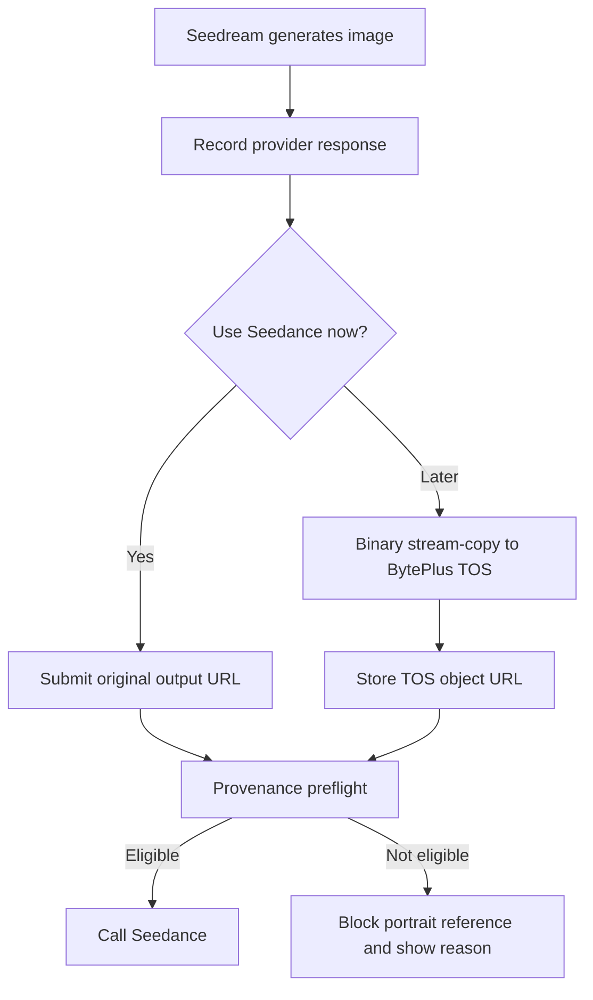

# Seedream → Seedance: Trusted Character Reference Implementation Plan

**Audience:** Momelo AI / backend development team  
**Purpose:** preserve the provenance of AI-generated character images so they can be submitted to Seedance 2.x as portrait reference images when the provider accepts them.

> Amendment 2026-09-07: the active Playground POC follows requirement 009 and
> admits every currently cataloged Seedream 5.0 variant (Lite and Pro), for both
> T2I and I2I outputs. The Lite-only statements below are retained as the earlier
> research snapshot and are not the current runtime policy. Same account,
> original URL/bytes, provider timestamp, 30-day age and server ownership checks
> remain mandatory. This expansion is not a provider qualification claim.

## 1. Scope and provider constraint

ModelArk's portrait-video documentation states that the original, face-containing outputs from supported models may be reused with Seedance 2.5 and Seedance 2.0 series within 30 days. Its current table explicitly lists **Seedream 5.0 Lite text-to-image** as an eligible image-output route. It also requires ModelArk output, the same account, the original unedited output, and warns that compression or forwarding may invalidate trust verification.

This plan must therefore treat provider trust as a **conditional capability**, not a permanent property of an image. The final authority is the Seedance API response.

**Out of scope**

- Real-person onboarding, consent verification, or the ModelArk real-human Asset Library flow.
- Attempting to bypass input moderation.
- Claiming that all Seedream versions or image-to-image outputs are trusted. The application must only mark a source as eligible when the recorded provider model and generation mode match the currently documented rules.

## 2. Target workflow



## 3. Non-negotiable handling rules

1. **Immediate use:** submit the original Seedream output URL returned by ModelArk as `content[].image_url.url`. Do not Base64 encode it and do not re-upload it to an Asset Library.
2. **Longer retention:** copy the original response body to BytePlus TOS as an opaque binary stream. No image decoder, resize, crop, watermarking, format conversion, optimisation, canvas rendering, or metadata rewrite is allowed in the trusted path.
3. **No shared image processors:** the trusted path must bypass Sharp, ImageMagick, browser canvas, CDN transformations, thumbnail services, EXIF stripping, and virus-processing systems that rewrite files.
4. **Same account:** the ModelArk API key used by Seedance must belong to the same ModelArk account that created the Seedream output.
5. **30-day gate:** calculate expiry from the provider response's generation timestamp, not the signed URL expiry.
6. **Runtime result wins:** if Seedance returns `InputImageSensitiveContentDetected.PrivacyInformation`, stop automatic retries for that image and set its provider trust status to `rejected`.

## 4. Data model

Store the source image separately from rendered application variants.

```ts
type CharacterReferenceSource = {
  id: string;
  characterId: string;

  // Provider provenance captured at generation time
  provider: 'byteplus-modelark';
  model: string; // Example: seedream-5-0-260128
  generationMode: 'text_to_image' | 'image_to_image' | 'unknown';
  modelAccountId: string; // Internal non-secret account identifier
  providerRequestId?: string;
  providerTaskId?: string;
  createdAt: string; // Provider generation timestamp, ISO-8601 UTC

  // Original, never rewritten
  originalOutputUrl: string;
  originalContentType: string;
  originalBytes?: number;
  originalSha256?: string;

  // Optional durable raw copy
  tosObjectKey?: string;
  tosSignedReadUrl?: string;
  tosSha256?: string;

  // Decision state, recomputed before every video request
  trustEligibility: 'candidate' | 'eligible' | 'ineligible' | 'expired' | 'rejected';
  trustReason?: string;
  trustExpiresAt?: string;
  lastPreflightAt?: string;
};
```

Keep separate tables/objects for `previewUrl`, `thumbnailUrl`, and edited storyboard images. They are presentation assets and must never replace `originalOutputUrl` in a trusted request.

## 5. Seedream output capture

After every Seedream generation:

1. Persist the provider request/task ID, model ID, creation time, model account identity, output URL, MIME type, and output SHA-256 where available.
2. Classify eligibility only from recorded facts. Example initial rule:

```ts
const isDocumentedTrustedSource =
  source.provider === 'byteplus-modelark' &&
  source.model === 'seedream-5-0-260128' &&
  source.generationMode === 'text_to_image';
```

3. Set `trustExpiresAt = createdAt + 30 days` only when the source matches the documented route. For every other model/mode, set `trustEligibility = 'candidate'` or `ineligible`; never assume eligibility from the visual appearance.
4. Queue the raw TOS copy while the original provider URL is still readable. Current provider image URLs are short-lived, so this should happen immediately after a successful generation.

## 6. Raw stream-copy to BytePlus TOS

### 6.1 Required behavior

The server performs this operation. It does not send the file through the browser or frontend.

```text
GET original ModelArk output URL
  → response body as stream
  → PUT same stream to a presigned BytePlus TOS object URL
```

The upload is a storage copy, not an image transformation. Preserve the original filename extension and `Content-Type`. Record source and destination SHA-256 and only mark `tosCopyVerified` if they match.

### 6.2 Node.js reference implementation

```ts
export async function copyOriginalToTos(
  originalUrl: string,
  tosPresignedPutUrl: string,
) {
  const source = await fetch(originalUrl);
  if (!source.ok || !source.body) {
    throw new Error(`Cannot read original ModelArk output: ${source.status}`);
  }

  const contentType = source.headers.get('content-type') ?? 'application/octet-stream';

  const destination = await fetch(tosPresignedPutUrl, {
    method: 'PUT',
    headers: { 'Content-Type': contentType },
    body: source.body,
    duplex: 'half', // Node.js fetch streaming request body
  });

  if (!destination.ok) {
    throw new Error(`TOS copy failed: ${destination.status}`);
  }
}
```

Use the TOS SDK or S3-compatible `PutObject` instead of a presigned PUT if the backend already holds tightly scoped TOS credentials. The implementation requirement remains the same: stream source bytes directly to the destination and do not materialize/re-encode the image.

### 6.3 Integrity verification

For a strict implementation, calculate SHA-256 while streaming to TOS, then download/HEAD the stored object according to the storage SDK's integrity feature and compare hashes. If the checksum cannot be verified, keep the object but mark it `unverified`; do not present it as trusted.

## 7. Seedance provenance preflight

Run immediately before the `POST /api/v3/contents/generations/tasks` call.

```ts
function preflightPortraitReference(source: CharacterReferenceSource, seedanceAccountId: string) {
  if (source.modelAccountId !== seedanceAccountId) {
    return { ok: false, code: 'CROSS_ACCOUNT_SOURCE' };
  }
  if (new Date() > new Date(source.trustExpiresAt ?? 0)) {
    return { ok: false, code: 'TRUST_WINDOW_EXPIRED' };
  }
  if (source.trustEligibility !== 'eligible') {
    return { ok: false, code: 'UNSUPPORTED_OR_UNVERIFIED_SOURCE' };
  }
  if (!source.originalOutputUrl && !source.tosSignedReadUrl) {
    return { ok: false, code: 'NO_ORIGINAL_REFERENCE_URL' };
  }
  return { ok: true };
}
```

Select the URL using this priority:

1. `originalOutputUrl`, while still usable.
2. `tosSignedReadUrl`, only after raw-copy integrity is verified.
3. Do not fall back to an edited asset, a GCS derivative, Base64, thumbnail, or screenshot.

When preflight fails, the UI should explain the specific reason and offer a compliant next action: regenerate a supported character keyframe, select a preset digital character, or use a non-portrait workflow.

## 8. Seedance request contract

The reference remains an ordinary `image_url` item. It is **not** an `asset://` URL for this AI-character workflow.

```json
{
  "model": "dreamina-seedance-2-5-260628",
  "content": [
    { "type": "text", "text": "<approved video prompt>" },
    {
      "type": "image_url",
      "image_url": { "url": "<original-or-verified-TOS-signed-URL>" },
      "role": "reference_image"
    }
  ],
  "ratio": "9:16",
  "duration": 6
}
```

For a storyboard plus character-look-sheet request, preflight **every** face-containing reference image. One untrusted image can reject the complete request. In the user example, this means validating both `content[1]` and `content[2]` independently.

## 9. Error handling and observability

| Event | Action | Retry policy |
|---|---|---|
| Original output URL unavailable | Mark copy failed; regenerate a new source image | Regenerate, do not modify old file |
| TOS raw copy error | Preserve source metadata and retry the storage copy while original URL lives | Bounded transport retry |
| SHA mismatch / changed MIME type | Mark unverified and block trusted route | No automatic retry with altered file |
| Seedance privacy input error | Set `trustEligibility = rejected`; save provider request ID and offending content index | No prompt-only retry |
| Output safety moderation failure | Keep source eligibility unchanged; record video-task failure separately | Follow provider task retry policy only if transient |

Log these non-secret fields: `characterId`, source ID, model, generation mode, source account ID, timestamps, SHA-256, selected reference URL type (`original` or `tos`), Seedance model, HTTP status, provider request ID, error code, and `content[]` index.

Never log API keys or full signed URLs. Redact query strings before application logging.

## 10. Suggested rollout

### Phase 1 — Provenance record and direct URL use

- Persist required Seedream metadata and original output URL.
- Use the original URL directly for immediate Seedance generation.
- Add preflight and clear UI statuses: `Eligible`, `Expires on`, `Needs regeneration`, and `Provider rejected`.

### Phase 2 — BytePlus TOS preservation

- Provision a private TOS bucket and least-privilege object-write/read access.
- Implement background raw stream-copy, checksum verification, and short-lived signed read URLs.
- Store original and TOS locations separately.

### Phase 3 — Production guardrails

- Disable portrait-video submission when preflight fails.
- Add operational dashboard: eligible references, copy failures, expiration rate, and Seedance input-rejection rate by model/mode.
- Add a support export containing source IDs, timestamps, model/mode, hashes, and BytePlus request IDs.

## 11. Acceptance tests

1. A Seedream 5.0 Lite text-to-image output created under the same ModelArk account can be sent immediately to Seedance through its original URL.
2. The same output is stream-copied to TOS without an image-processing dependency in the execution path.
3. Original and TOS SHA-256 values match before the TOS URL becomes selectable.
4. A source older than 30 days is blocked before any Seedance API request is sent.
5. A source with a different account, edited derivative, thumbnail, or Base64 reference is blocked from the trusted portrait route.
6. When the provider returns `InputImageSensitiveContentDetected.PrivacyInformation`, the system records the failing content index and does not enqueue repeated identical calls.
7. If the provider later changes supported model/mode rules, a configuration update changes eligibility without a code deployment.

## References

- BytePlus ModelArk, [Create portrait videos with Dreamina Seedance models](https://docs.byteplus.com/en/docs/ModelArk/2608626) — trusted-output scope, 30-day validity, same-account/original-output requirements, and handling considerations.
- BytePlus ModelArk, [Seedream 5.0 Pro tutorial](https://docs.byteplus.com/en/docs/ModelArk/2582774) — Seedream model IDs, output formats, input limits, and image output retention.
- BytePlus Torch Object Storage, [Uploading objects](https://docs.byteplus.com/en/docs/tos/docs-uploading-a-file) and [PutObject](https://docs.byteplus.com/en/docs/tos/reference-putobject) — object upload capability.
- BytePlus Torch Object Storage, [Amazon S3 protocol compatibility](https://docs.byteplus.com/en/docs/tos/docs-compatibility-with-amazon-s3) — S3-compatible `PutObject` option.
