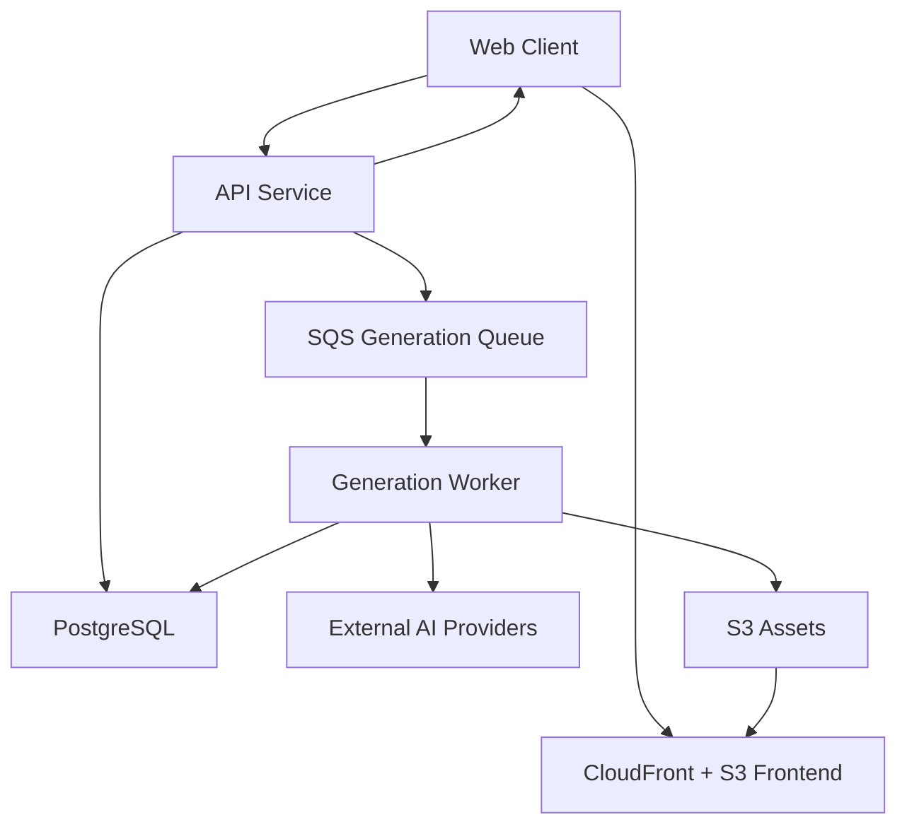
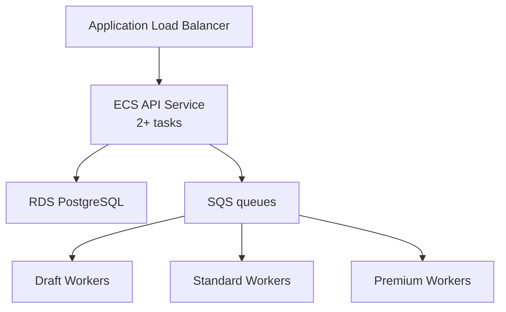
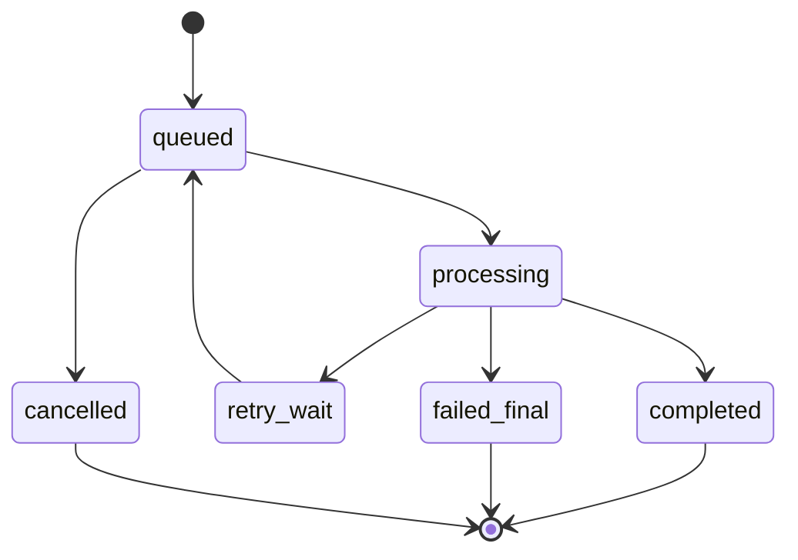
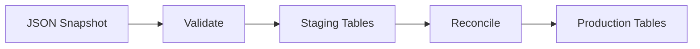

# Infrastructure Baseline and AWS Migration Plan

> สถานะ: Initial implementation specification  
> ปรับปรุงล่าสุด: 24 กรกฎาคม 2026  
> เป้าหมายระบบ: AI Image Generation Platform / ModelPromptForge  
> กลุ่มผู้อ่าน: Software Engineer, DevOps, SRE และ AI Coding Agent

## 1. วัตถุประสงค์

เอกสารนี้กำหนดโครงสร้างเริ่มต้นสำหรับย้ายระบบจาก `localhost` ไป AWS โดยมีเป้าหมายดังนี้

1. เปิดใช้งาน Production ระยะแรกได้โดยไม่ลงทุนเกินความจำเป็นสำหรับผู้ใช้ประมาณ 20 คน/วัน
2. แยกงานสร้างภาพออกจาก HTTP request ด้วย asynchronous job queue
3. ย้ายข้อมูลจาก JSON ไป PostgreSQL อย่างตรวจสอบและ rollback ได้
4. เก็บไฟล์ภาพใน Object Storage แทน Database หรือ local disk
5. รองรับการขยายเป็น ECS Fargate และ EKS ใน Phase 2–3 โดยไม่ต้องเปลี่ยน business contract
6. กำหนด security, backup, monitoring, cost guardrails และ acceptance criteria ก่อนเปิด Production

เอกสารนี้เป็น infrastructure baseline ไม่ใช่คำสั่งให้เปิด AWS Service ทุกตัวทันที ผู้ implement ต้องเปิดเฉพาะบริการของ Phase ปัจจุบัน

## 2. ข้อมูลที่ AI ต้องตรวจจาก Repository ก่อน Implement

workspace ที่ใช้จัดทำเอกสารยังไม่มี source code และ `AGENTS.md` ดังนั้น AI Coding Agent ต้องตรวจข้อมูลต่อไปนี้จาก repository เวอร์ชันล่าสุดก่อนแก้โค้ด:

- Runtime และ framework จริงของ Frontend/API
- คำสั่ง build, start, test และ migration
- รูปแบบ JSON และ schema version ปัจจุบัน
- วิธี login/authentication ปัจจุบัน
- Credit, Payment, Generation และ Asset lifecycle
- Provider adapters ที่มีอยู่จริง
- Environment variables เดิม
- Dockerfile, reverse proxy และ deployment configuration เดิม
- กติกาใน `AGENTS.md` และ architecture source of truth ของโครงการ

หากข้อมูลใน repository ขัดกับเอกสารนี้ ให้หยุดเฉพาะส่วนที่ขัดกันและเสนอ migration decision record ห้ามเดา schema หรือเปลี่ยน authentication/payment flow โดยพลการ

## 3. หลักการ Architecture ที่ห้ามเปลี่ยนระหว่าง Phase

### 3.1 Stable contracts

- Client ขอสร้างภาพผ่าน API และได้รับ `202 Accepted` พร้อม `job_id`
- API ไม่เปิด HTTP connection รอ AI Provider สร้างภาพ
- API ทำ validation, authorization, idempotency และ reserve credit ก่อน enqueue
- Queue message เก็บเฉพาะ identifier และ routing metadata ขนาดเล็ก
- Worker อ่านรายละเอียดงานจาก PostgreSQL
- Worker จำกัด concurrency แยกตาม Provider/Model
- รูปจริงเก็บใน S3; PostgreSQL เก็บ object key และ metadata
- Credit ใช้ immutable ledger; ห้ามแก้ balance โดยไม่มี ledger entry
- ทุก external side effect ต้องรองรับ retry โดยไม่สร้างภาพ/หักเครดิต/คืนเงินซ้ำ
- Application ต้องไม่พึ่ง local filesystem แบบถาวร
- Infrastructure configuration ต้องสร้างซ้ำได้ด้วย Infrastructure as Code

Amazon SQS Standard เป็นระบบ `at-least-once delivery` และอาจส่งข้อความซ้ำหรือสลับลำดับได้ ดังนั้น worker ต้อง idempotent ตั้งแต่ Phase 1 ไม่ใช่เพิ่มภายหลัง ([AWS: SQS Standard queues](https://docs.aws.amazon.com/AWSSimpleQueueService/latest/SQSDeveloperGuide/standard-queues.html), [AWS: at-least-once delivery](https://docs.aws.amazon.com/AWSSimpleQueueService/latest/SQSDeveloperGuide/standard-queues-at-least-once-delivery.html))

### 3.2 Non-goals ของ Phase 1

- ไม่ทำ Kubernetes/EKS
- ไม่ทำ active-active multi-region
- ไม่ทำ multi-cloud database
- ไม่ใช้ Redis หาก PostgreSQL และ application rate limit ยังเพียงพอ
- ไม่ใช้ WebSocket หาก polling 3–5 วินาทีรองรับ UX ได้
- ไม่เก็บ image binary หรือ Base64 ใน PostgreSQL/SQS
- ไม่สร้าง microservice จำนวนมาก
- ไม่ใช้ NAT Gateway หาก architecture เริ่มต้นหลีกเลี่ยงได้

## 4. Phase Overview

| Phase | เป้าหมาย | ปริมาณใช้งานโดยประมาณ | Compute | Database | Availability |
|---|---|---:|---|---|---|
| Phase 1: Pilot | ใช้งานจริงแบบประหยัด | ~20 DAU, peak ต่ำ | Lightsail Container/Instance หรือ ECS ขนาดเล็ก 1 ชุด | PostgreSQL managed แบบ Single-AZ | Backup + manual recovery |
| Phase 2: Growth | แยก API/Worker และ autoscale | ~100–3,000 DAU หรือ queue เริ่มสะสม | ECS Fargate + ALB | RDS PostgreSQL Single-AZ → Multi-AZ | Multi-task, automated scaling |
| Phase 3: Scale | รองรับงานจำนวนมาก/หลายทีม | หลายพัน DAU หรือ sustained high throughput | EKS หรือ ECS บน EC2/Fargate ตามต้นทุน | RDS/Aurora Multi-AZ + proxy/replica | HA, controlled failover, advanced delivery |

จำนวน DAU เป็นเพียงตัวช่วย ไม่ใช่ trigger หลัก การเลื่อน Phase ต้องอ้างอิง metric, reliability และต้นทุนในหัวข้อ 15

## 5. Target Architecture



### 5.1 Request flow

1. Client ขอ presigned upload URL สำหรับ source image
2. Client upload โดยตรงไป S3
3. Client เรียก `POST /v1/generations` พร้อม `Idempotency-Key`
4. API ตรวจ user, quota, model availability และ input asset ownership
5. API เปิด transaction เพื่อ reserve credit และสร้าง `generation_job`
6. หลัง transaction สำเร็จ API ส่ง message เข้า SQS
7. API คืน `202` พร้อม `job_id`, `status_url` และเวลารอโดยประมาณ
8. Worker claim job ด้วย conditional state transition
9. Worker เรียก Provider ตาม capacity/rate limit
10. Worker stream/download ผลลัพธ์ไป S3 และสร้าง asset metadata
11. Worker finalize credit หรือ release reservation เมื่อ fail
12. Client poll `GET /v1/generations/{job_id}` ทุก 3–5 วินาที

S3 presigned URL ให้สิทธิ์ upload/download แบบจำกัดเวลาโดยไม่ต้องมอบ AWS credential ให้ Client ([AWS: presigned URLs](https://docs.aws.amazon.com/AmazonS3/latest/userguide/using-presigned-url.html), [AWS: presigned uploads](https://docs.aws.amazon.com/AmazonS3/latest/userguide/PresignedUrlUploadObject.html))

## 6. Phase 1 — Pilot / Minimum Production

### 6.1 Service mapping

| Component | Service | Required |
|---|---|---:|
| Frontend static build | S3 + CloudFront | Yes |
| API + Worker | Lightsail Container/Instance หรือ ECS ขนาดเล็ก | Yes |
| Database | Managed PostgreSQL Single-AZ | Yes |
| Job queue | SQS Standard + DLQ | Yes |
| Uploads/results | Private S3 bucket | Yes |
| Container registry | ECR | หาก deploy container |
| Authentication | Auth เดิมหรือ Cognito | ตามระบบเดิม |
| Secrets | Secrets Manager หรือ SSM Parameter Store | Yes |
| Logs/alarms | CloudWatch แบบจำกัด retention | Yes |
| DNS/TLS | Route 53/ผู้ให้บริการ DNS เดิม + ACM | Yes |
| ALB, Redis, RDS Proxy, WAF, EKS | ยังไม่เปิด | No |

### 6.2 Initial sizing

- API: 1 instance/task, 0.5–1 vCPU, RAM 1–2 GB
- Worker: process แยกจาก API แม้เริ่มอยู่ compute เดียวกัน
- Worker concurrency: เริ่ม `1–2` ต่อ Provider แล้วปรับจาก provider limits
- PostgreSQL: smallest practical managed plan, encrypted, daily backup
- SQS long polling: `WaitTimeSeconds=20`
- Message payload target: ต่ำกว่า 16 KB
- CloudWatch log retention: 7–14 วัน
- S3 temporary lifecycle: 1–7 วัน
- Generated result retention: 30–90 วันตาม product policy

### 6.3 Process isolation

ถึง Phase 1 จะใช้เครื่องเดียว ให้มี entrypoint แยก:

```text
app-api      -> HTTP API only
app-worker   -> SQS consumer only
app-migrate  -> one-off database migration
```

ห้ามให้ API process เริ่ม worker ภายใน process เดียวกัน เพราะจะ scale/deploy แยกใน Phase 2 ได้ยาก

### 6.4 Phase 1 cost guardrail

- Infrastructure target: ประมาณ 1,200–2,000 บาท/เดือน ไม่รวม AI API, payment fee, email และ domain
- ตั้ง AWS Budget alerts ที่ 50%, 80% และ 100% ของงบ
- ตั้ง daily provider spending ceiling ใน application
- ห้ามเปิด ALB, NAT Gateway, Multi-AZ, Redis หรือ RDS Proxy โดยไม่มี Architecture Decision Record (ADR)
- Tag ทุก resource: `project`, `environment`, `owner`, `cost-center`, `managed-by`

ตัวเลขข้างต้นเป็น budget envelope ไม่ใช่ AWS quotation ต้องตรวจราคาจริงใน AWS Pricing Calculator ตาม Region และวันที่ deploy

## 7. Phase 2 — Growth / Production-ready

### 7.1 Trigger

เข้าสู่ Phase 2 เมื่อเกิดข้อใดข้อหนึ่งต่อเนื่อง:

- API CPU หรือ memory เกิน 70% ใน peak window
- p95 API latency เกิน 500 ms โดยไม่นับเวลา generate
- queue oldest message เกิน SLA มากกว่า 3 ครั้ง/สัปดาห์
- ต้อง deploy API โดยไม่หยุด Worker
- ต้องมีอย่างน้อย 2 API replicas เพื่อ availability
- database connection usage เกิน 70% ของ limit
- รายได้รองรับ fixed cost ของ ALB/RDS/ECS

### 7.2 Service changes



- ย้าย API ไป ECS Fargate หลัง ALB
- แยก Worker ECS Service ตาม workload/priority
- ย้าย database ไป RDS PostgreSQL หาก Phase 1 ใช้ Lightsail database
- เปิด Multi-AZ เมื่อ downtime cost สูงกว่าค่า redundancy
- เพิ่ม RDS Proxy เมื่อ connection churn หรือ autoscaling ทำให้ connection เกือบเต็ม
- เพิ่ม WAF เมื่อ public exposure/abuse เพิ่มขึ้น
- เพิ่ม Redis เฉพาะกรณีมี use case วัดผลแล้ว เช่น distributed rate limit หรือ hot cache
- ใช้ CloudFront สำหรับ private asset delivery ผ่าน signed URL/cookie

RDS Proxy ช่วย pool/reuse connection และรับมือ connection surge แต่ควรเพิ่มเมื่อมีปัญหาจริงเพราะเป็นต้นทุนอีกส่วน ([AWS: RDS Proxy](https://docs.aws.amazon.com/AmazonRDS/latest/UserGuide/rds-proxy.html))

### 7.3 Autoscaling

API scaling:

- Minimum tasks: 2
- Scale out จาก ALB request count, CPU, memory และ p95 latency
- Scale in แบบ conservative เพื่อไม่ตัด request ที่กำลังทำงาน

Worker scaling:

```text
backlog_per_worker = visible_queue_messages / max(running_workers, 1)

desired_workers = min(
  ceil(visible_queue_messages / target_backlog_per_worker),
  provider_concurrency_limit,
  application_cost_limit,
  configured_max_workers
)
```

อย่า scale Worker จาก CPU เพียงอย่างเดียว เพราะงานส่วนมากรอ network/provider AWS แนะนำ queue backlog per task เป็น metric สำหรับ target tracking ([AWS: target tracking with SQS backlog per task](https://docs.aws.amazon.com/autoscaling/application/userguide/application-auto-scaling-target-tracking-metric-math.html), [AWS: ECS service auto scaling](https://docs.aws.amazon.com/AmazonECS/latest/developerguide/capacity-autoscaling-best-practice.html))

## 8. Phase 3 — High Scale / Platform Infrastructure

### 8.1 Trigger

พิจารณา EKS หรือ platform orchestration ขั้นสูงเมื่อ:

- มี independently deployable services มากกว่า 10–15 services
- มี DevOps/SRE รับผิดชอบ cluster lifecycle
- ต้องใช้ GPU/self-hosted model หรือ node pool หลายประเภท
- ต้อง scale worker จาก external metrics ด้วย KEDA
- ต้องใช้ Argo CD/GitOps, service mesh หรือ policy engine
- ค่า Fargate สูงกว่า EC2/Spot อย่างมีนัยสำคัญจากข้อมูลจริง
- ต้องแยก tenant/workload isolation ระดับ namespace/node

หาก ECS ยังตอบโจทย์และราคาดี ไม่จำเป็นต้องย้ายไป EKS

### 8.2 Phase 3 components

- EKS managed control plane หรือ ECS capacity providers
- KEDA/HPA scale จาก SQS backlog และ provider capacity
- Cluster Autoscaler/Karpenter สำหรับ node scaling
- Separate node pools: API, general worker, image processing, optional GPU
- RDS/Aurora PostgreSQL Multi-AZ
- RDS Proxy/PgBouncer
- Read replica สำหรับ reporting ที่ไม่ต้องอ่านข้อมูลล่าสุดทันที
- EventBridge/EventBridge Pipes สำหรับ event integration เมื่อจำเป็น
- Blue/green หรือ canary deployment
- Centralized tracing และ SLO dashboards
- Cross-account environments: development, staging, production
- Disaster recovery backup copy ไป Region ที่สองตาม RPO/RTO

### 8.3 Multi-region boundary

ไม่ทำ active-active database เป็นค่าเริ่มต้น Phase 3 ให้เริ่มด้วย:

- Primary Region: Region ที่เลือกจาก service availability, latency, compliance และราคา
- Secondary Region: backup/restore และ infrastructure definition
- Replicate เฉพาะ artifact/backup ที่จำเป็น
- ทดสอบ restore อย่างน้อยรายไตรมาส

## 9. Queue and Worker Specification

### 9.1 Queue layout

Phase 1:

```text
generation-jobs
generation-jobs-dlq
```

Phase 2+:

```text
generation-draft
generation-standard
generation-premium
generation-dlq
image-postprocess
webhook-delivery
```

### 9.2 Message contract

```json
{
  "schema_version": 1,
  "message_id": "uuid",
  "job_id": "uuid",
  "tenant_id": "uuid",
  "priority": "standard",
  "provider_hint": "auto",
  "created_at": "ISO-8601",
  "trace_id": "string"
}
```

ห้ามใส่ prompt เต็ม, secret, source image, Base64 หรือ provider credential ใน message

### 9.3 Worker rules

1. อ่าน job แล้ว lock ด้วย atomic state transition เช่น `queued -> processing`
2. ถ้า job `completed` หรือ `failed_final` แล้ว ให้ acknowledge message โดยไม่ทำ side effect
3. ใช้ unique constraint/idempotency record ต่อ provider attempt
4. extend visibility timeout หากงานนานกว่าที่คาด
5. retry เฉพาะ transient errors: timeout, 429, provider 5xx
6. exponential backoff + jitter
7. ไม่ retry validation error, blocked content หรือ insufficient credit
8. หลังเกิน `maxReceiveCount` ส่ง DLQ
9. delete SQS message หลัง database commit สำเร็จเท่านั้น
10. บันทึก provider request ID, latency, cost estimate และ normalized error code

SQS visibility timeout ต้องสัมพันธ์กับเวลาประมวลผล; หากหมดเวลาก่อนลบ message งานจะกลับมาให้ consumer อื่นรับได้ ([AWS: visibility timeout](https://docs.aws.amazon.com/AWSSimpleQueueService/latest/SQSDeveloperGuide/sqs-visibility-timeout.html)) ส่วน DLQ ใช้แยกงานที่ประมวลผลไม่สำเร็จเพื่อวิเคราะห์และ redrive อย่างควบคุม ([AWS: dead-letter queues](https://docs.aws.amazon.com/AWSSimpleQueueService/latest/SQSDeveloperGuide/sqs-dead-letter-queues.html))

## 10. PostgreSQL Data Design

### 10.1 Core tables

```text
users
auth_accounts
projects
assets
generation_jobs
generation_attempts
provider_models
provider_capacity
credit_accounts
credit_ledger
credit_reservations
payments
templates
template_versions
audit_events
outbox_events
schema_migrations
```

### 10.2 Data rules

- ใช้ UUID/ULID เป็น public-safe identifier
- Monetary/credit amount ใช้ integer smallest unit หรือ `NUMERIC`; ห้ามใช้ floating point
- `credit_ledger` เป็น append-only
- เก็บ prompt snapshot/options แบบ provider-neutral ใน `JSONB`
- เก็บ provider raw response เฉพาะข้อมูลที่จำเป็นและต้อง redact secret/PII
- ใช้ foreign key และ unique constraint ป้องกัน duplicate
- ทุก table สำคัญมี `created_at`, `updated_at`; financial ledger ห้าม overwrite
- ใช้ transaction สำหรับ reserve/finalize/release credit
- ใช้ transactional outbox ป้องกันกรณี DB commit สำเร็จแต่ enqueue/event publish ล้มเหลว

### 10.3 Job state machine



State transition ทุกครั้งต้องเป็น conditional update และมี audit timestamp ห้ามให้ worker สองตัว finalize job เดียวกัน

## 11. JSON-to-PostgreSQL Migration

### 11.1 Migration strategy



### 11.2 Required scripts

```text
scripts/migration/
  inspect-json.*
  validate-json.*
  import-staging.*
  reconcile.*
  promote.*
  rollback.*
```

### 11.3 Runbook

1. สำรอง JSON ต้นฉบับและคำนวณ SHA-256
2. บันทึก record counts, user counts และ credit totals
3. เพิ่ม `schema_version` หรือสร้าง mapping สำหรับไฟล์ที่ไม่มี version
4. Validate required fields/type/references
5. Import เข้า staging tables ด้วย `migration_run_id`
6. Map legacy ID ไป new ID แบบ deterministic และเก็บ mapping table
7. ตรวจ orphan, duplicate, invalid enum และ negative balance
8. Reconcile จำนวน records และยอด credit ก่อน/หลัง
9. ทดลองบน staging environment ด้วย production-like snapshot
10. เปิด maintenance/read-only window สำหรับ final delta
11. Promote ภายใน transaction หรือเป็น batch ที่ resume ได้
12. ทำ smoke test แล้วจึงสลับ application ให้ใช้ PostgreSQL
13. เก็บ JSON read-only ตาม retention policy

### 11.4 Migration requirements

- รันซ้ำได้โดยไม่สร้างข้อมูลซ้ำ
- resume จาก checkpoint ได้
- มี dry-run mode
- log ไม่มี prompt/PII/secret แบบเต็ม
- rollback application version และ database change ได้
- schema migration ต้อง backward-compatible อย่างน้อยหนึ่ง deployment
- ห้ามลบ JSON ต้นฉบับทันทีหลัง cutover

## 12. S3 Asset Design

### 12.1 Buckets

แนะนำแยกตาม environment และ access boundary:

```text
{project}-{env}-frontend
{project}-{env}-assets
{project}-{env}-logs-or-backups   # เพิ่มเมื่อจำเป็น
```

ห้ามใช้ production bucket ร่วมกับ development

### 12.2 Object keys

```text
uploads/{tenant_id}/{user_id}/{asset_id}/original
generations/{tenant_id}/{job_id}/{asset_id}/result.webp
generations/{tenant_id}/{job_id}/{asset_id}/thumbnail.webp
templates/{template_id}/{version_id}/preview.webp
temporary/{job_id}/{artifact_id}
```

ห้ามใช้ email, ชื่อบุคคล หรือ prompt เป็นส่วนของ object key

### 12.3 Security and lifecycle

- Block Public Access ทุก assets bucket
- ใช้ presigned URL อายุสั้น
- ตรวจ MIME type, size, magic bytes และ malware policy หลัง upload
- จำกัด file size และ pixel dimensions ก่อนประมวลผล
- เปิด default server-side encryption
- เปิด versioning เฉพาะ bucket/object class ที่ต้องกู้คืนจาก overwrite
- lifecycle ลบ temporary files และ abort incomplete multipart uploads
- CloudFront ต้องไม่เปิด origin S3 แบบ public

S3 เข้ารหัส object ใหม่ที่อัปโหลดโดย default ด้วย server-side encryption และ S3 Lifecycle สามารถย้ายหรือลบ object ตามอายุได้ ([AWS: S3 default encryption](https://docs.aws.amazon.com/AmazonS3/latest/userguide/UsingServerSideEncryption.html), [AWS: S3 Lifecycle](https://docs.aws.amazon.com/AmazonS3/latest/userguide/object-lifecycle-mgmt.html)) Versioning ช่วยกู้คืนจากการ overwrite หรือ application error แต่เพิ่ม storage cost จึงควรเปิดอย่างมีนโยบาย ([AWS: S3 Versioning](https://docs.aws.amazon.com/AmazonS3/latest/userguide/Versioning.html))

## 13. Security Baseline

- ใช้ IAM role สำหรับ workload; ห้ามฝัง AWS access key ใน image/repository
- Secrets อยู่ใน Secrets Manager/SSM และ rotate ได้
- แยก secret ของ dev/staging/prod
- least privilege ต่อ bucket prefix, queue และ secret
- TLS ทุก public endpoint
- database ไม่ public; จำกัด network access เท่าที่ architecture รองรับ
- redact token, password, API key, presigned URL และ sensitive prompt จาก logs
- Admin action ต้องมี authorization และ audit log
- Credit adjustment/payment callback ต้อง verify signature และ idempotency
- Rate limit แยก anonymous/user/admin/provider callback
- dependency/container scanning ใน CI
- สำรองและทดสอบ restore; backup ที่ restore ไม่ได้ถือว่าไม่มี backup
- กำหนด data retention/deletion policy สำหรับรูปผู้ใช้และ PII

## 14. Observability and Operations

### 14.1 Structured log fields

```text
timestamp
level
service
environment
trace_id
request_id
job_id
user_id_hash
provider
model
attempt
duration_ms
normalized_error_code
```

ห้าม log source image, Base64, API key, payment secret หรือ prompt เต็มโดย default

### 14.2 Metrics

API:

- request count/error rate
- p50/p95/p99 latency
- active requests
- CPU/memory
- database connection usage

Queue/Worker:

- visible messages
- oldest message age
- in-flight messages
- jobs completed/failed/retried
- generation latency by provider/model
- provider 429/5xx
- DLQ message count
- cost estimate per job/day

Storage/Database:

- S3 bytes/object count
- temporary deletion failures
- DB CPU/storage/connections
- backup status
- slow query count

AWS ระบุ `ApproximateNumberOfMessagesVisible` เป็น metric สำคัญสำหรับตรวจ backlog และควรติดตาม empty receives เพื่อปรับ polling/cost ([AWS: SQS CloudWatch metrics](https://docs.aws.amazon.com/AWSSimpleQueueService/latest/SQSDeveloperGuide/sqs-available-cloudwatch-metrics.html))

### 14.3 Initial alerts

- API 5xx > 2% นาน 5 นาที
- p95 API latency > 1 วินาที นาน 10 นาที
- oldest queue message > product SLA
- DLQ count > 0
- provider error > 10% นาน 5 นาที
- DB connections > 70%
- DB storage free < 20%
- backup failed
- daily AI provider spend > configured limit
- AWS monthly budget 50/80/100%

## 15. Phase Promotion Gates

### Phase 1 → Phase 2

ต้องมีหลักฐานอย่างน้อยหนึ่งด้านและผ่าน readiness ทั้งหมด:

| Gate | Pass condition |
|---|---|
| Load | มี sustained load หรือ queue backlog เกิน Phase 1 capacity |
| Reliability | ต้องมี multi-task/HA ตาม business SLA |
| Cost | รายได้/งบรองรับ fixed managed-service cost |
| Deployment | API และ Worker ต้อง deploy/scale แยก |
| Database | backup restore test ผ่าน และ migration ไป RDS ซ้อมแล้ว |
| Operations | dashboard, alerts, runbook และ owner พร้อม |

### Phase 2 → Phase 3

| Gate | Pass condition |
|---|---|
| Complexity | ECS limitation เกิดจริง ไม่ใช่คาดเดา |
| Team | มีผู้ดูแล Kubernetes/on-call |
| Economics | cost comparison EKS/EC2/Spot ดีกว่าอย่างมีนัยสำคัญ |
| Workload | ต้องใช้ GPU/node pools/external metric scaling |
| Reliability | กำหนด SLO, RPO, RTO และ DR test แล้ว |
| Security | multi-account/network/policy model ได้รับ review |

## 16. Infrastructure as Code Structure

ใช้ Terraform หรือ AWS CDK อย่างใดอย่างหนึ่งตามมาตรฐาน repository ห้าม mix โดยไม่มีเหตุผล

```text
infrastructure/
  README.md
  modules/
    networking/
    frontend/
    assets/
    queue/
    database/
    compute/
    observability/
    security/
  environments/
    dev/
    staging/
    production/
  policies/
  scripts/
    deploy/
    smoke-test/
    backup-restore/
    migration/
```

ข้อกำหนด:

- State ของ IaC ต้อง remote, encrypted และ lock ได้ก่อน Production
- ห้าม hardcode account ID, secret, domain หรือ environment-specific values
- `plan` ใน Pull Request; `apply` เฉพาะ protected workflow
- Pin provider/module versions
- resource names และ tags เป็น deterministic
- destroy protection สำหรับ production database/assets
- output ห้ามพิมพ์ secret

## 17. CI/CD Deployment Order

1. Lint, unit test, dependency/security scan
2. Build immutable container image
3. Tag ด้วย commit SHA; ห้าม deploy `latest`
4. Apply backward-compatible database migration ด้วย one-off task
5. Deploy API
6. Run API smoke test
7. Deploy Worker
8. Run end-to-end test ด้วย test provider/quota
9. Verify queue, DB, S3 และ credit reconciliation
10. Promote release หรือ rollback application
11. ทำ destructive schema cleanup ใน release ถัดไปเท่านั้น

## 18. Local Development Compatibility

Local development ควรใช้ interface เดียวกับ Production:

```text
PostgreSQL        -> Docker Compose local
S3 API            -> LocalStack/MinIO หรือ AWS dev bucket
SQS API           -> LocalStack หรือ AWS dev queue
Secrets           -> local .env ที่ไม่ commit
AI Providers      -> mock adapter หรือ sandbox account
```

Business code ต้องเรียกผ่าน interfaces:

```text
AssetStore
JobQueue
GenerationProvider
CreditLedger
PaymentGateway
NotificationService
```

ห้ามเขียนเงื่อนไข `if production then AWS else JSON` กระจายใน business logic ให้เลือก adapter จาก composition/configuration layer

## 19. Implementation Work Packages for AI Coding Agent

### WP-01 Repository assessment

- อ่าน `AGENTS.md`, README และ architecture requirements
- สร้าง current-state diagram
- inventory JSON/files/env vars
- ระบุ gaps เทียบเอกสารนี้
- ผลลัพธ์: assessment + ADR ที่ต้องตัดสินใจ

### WP-02 Container and configuration

- สร้าง production Dockerfile แบบ non-root
- แยก API/Worker/Migrate entrypoint
- health/readiness endpoints
- validate environment variables ตอน startup
- graceful shutdown

### WP-03 PostgreSQL and migration

- schema/migrations
- ledger/job/outbox constraints
- JSON import dry run
- reconciliation report
- rollback/retry tests

### WP-04 S3 assets

- presigned upload/download
- asset ownership validation
- metadata persistence
- lifecycle policy
- file validation and delete workflow

### WP-05 SQS jobs

- message schema/version
- producer/outbox dispatcher
- idempotent consumer
- retry, visibility extension, DLQ
- provider concurrency limiter

### WP-06 AWS Phase 1

- IaC dev/staging/prod variables
- S3/CloudFront, SQS/DLQ, database, compute, secrets, logs
- budget/tag policy
- deployment and rollback runbook

### WP-07 Verification

- load test API enqueue path
- duplicate-message test
- provider timeout/429 test
- DB/S3/SQS failure injection
- backup restore drill
- credit reconciliation test

AI ต้อง implement ทีละ Work Package และรอผล test/decision ที่เป็น dependency ห้ามสร้าง Phase 2–3 resources ใน Phase 1; Phase 2–3 ในเอกสารนี้เป็น compatibility target

## 20. Phase 1 Acceptance Criteria

- [ ] Fresh AWS environment สร้างได้จาก IaC
- [ ] Frontend เปิดผ่าน HTTPS
- [ ] API ตอบ health check และไม่เปิดเผย secret
- [ ] `POST /generations` คืน `202 + job_id`
- [ ] duplicate request ด้วย Idempotency-Key เดิมไม่หักเครดิตซ้ำ
- [ ] duplicate SQS message ไม่สร้างผลลัพธ์/ledger ซ้ำ
- [ ] รูป upload/download ผ่าน presigned URL และ assets bucket ไม่ public
- [ ] process restart แล้ว job ไม่สูญหาย
- [ ] failed jobs เข้า retry/DLQ ตาม policy
- [ ] credit reserve/finalize/release reconcile เป็นศูนย์
- [ ] JSON migration count/checksum/credit totals ผ่าน
- [ ] backup restore ทดสอบใน staging สำเร็จ
- [ ] log ไม่มี secret/Base64/PII ที่ห้าม
- [ ] budget alert และ operational alerts ทดสอบแล้ว
- [ ] rollback application version ได้
- [ ] runbook ระบุ owner และวิธีรับมือ provider outage

## 21. Backup, RPO and RTO Baseline

Phase 1 proposal:

- Database automated backup: daily
- Backup retention: 7–14 วัน
- RPO target: ไม่เกิน 24 ชั่วโมง จนกว่าจะกำหนดธุรกิจใหม่
- RTO target: 4–8 ชั่วโมง
- JSON migration source: เก็บ immutable/read-only ตาม retention
- IaC and application: source control
- S3: lifecycle/versioning ตาม asset class
- Restore test: ก่อน Production และอย่างน้อยรายไตรมาส

RDS automated backups รองรับ point-in-time recovery ภายในช่วง retention ที่กำหนด ([AWS: RDS automated backups](https://docs.aws.amazon.com/AmazonRDS/latest/UserGuide/USER_WorkingWithAutomatedBackups.html)) เมื่อ Phase 2 ต้องการ high availability ให้พิจารณา Multi-AZ ซึ่งมี standby สำหรับ failover; standby ของ Multi-AZ DB instance แบบหนึ่ง standby ไม่ได้มีไว้รับ read traffic ([AWS: RDS Multi-AZ](https://docs.aws.amazon.com/AmazonRDS/latest/UserGuide/Concepts.MultiAZ.html))

## 22. Open Decisions Before Production

ต้องตอบและบันทึกเป็น ADR:

1. AWS Region หลักและ service availability ณ วันที่ deploy
2. Runtime/framework จริงและ container strategy
3. Phase 1 compute: Lightsail หรือ ECS
4. PostgreSQL provider/size และ migration downtime
5. Authentication: ระบบเดิมหรือ Cognito
6. Asset retention แยกตาม package
7. Credit reservation expiry และ refund behavior
8. Provider concurrency/rate limit ต่อ account/model
9. Maximum upload size, supported MIME และ moderation flow
10. SLA เวลารอ Draft/Standard/Premium
11. RPO/RTO ที่ธุรกิจยอมรับ
12. งบ Infrastructure และ AI provider ceiling
13. PII/data residency/กฎหมายที่เกี่ยวข้อง
14. Domain/DNS ownership
15. ผู้รับผิดชอบ incident, billing และ security alert

## 23. Official References

- [Amazon SQS Developer Guide](https://docs.aws.amazon.com/AWSSimpleQueueService/latest/SQSDeveloperGuide/welcome.html)
- [Amazon SQS Standard queue delivery behavior](https://docs.aws.amazon.com/AWSSimpleQueueService/latest/SQSDeveloperGuide/standard-queues-at-least-once-delivery.html)
- [Amazon SQS visibility timeout](https://docs.aws.amazon.com/AWSSimpleQueueService/latest/SQSDeveloperGuide/sqs-visibility-timeout.html)
- [Amazon SQS dead-letter queues](https://docs.aws.amazon.com/AWSSimpleQueueService/latest/SQSDeveloperGuide/sqs-dead-letter-queues.html)
- [Amazon S3 presigned URLs](https://docs.aws.amazon.com/AmazonS3/latest/userguide/using-presigned-url.html)
- [Amazon S3 Lifecycle](https://docs.aws.amazon.com/AmazonS3/latest/userguide/object-lifecycle-mgmt.html)
- [Amazon ECS service auto scaling](https://docs.aws.amazon.com/AmazonECS/latest/developerguide/capacity-autoscaling-best-practice.html)
- [Amazon RDS automated backups](https://docs.aws.amazon.com/AmazonRDS/latest/UserGuide/USER_WorkingWithAutomatedBackups.html)
- [Amazon RDS Multi-AZ deployments](https://docs.aws.amazon.com/AmazonRDS/latest/UserGuide/Concepts.MultiAZ.html)
- [Amazon RDS Proxy](https://docs.aws.amazon.com/AmazonRDS/latest/UserGuide/rds-proxy.html)

