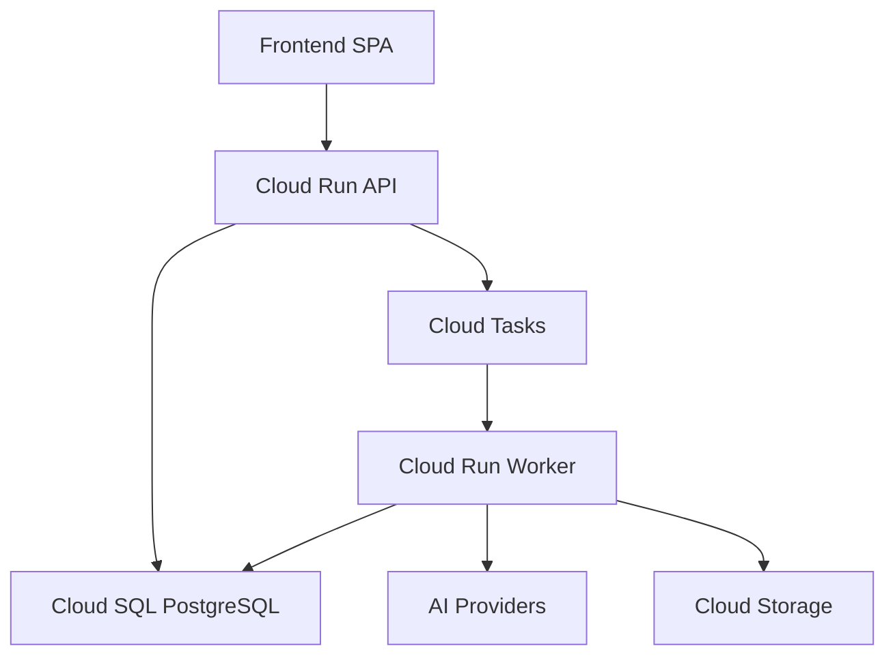
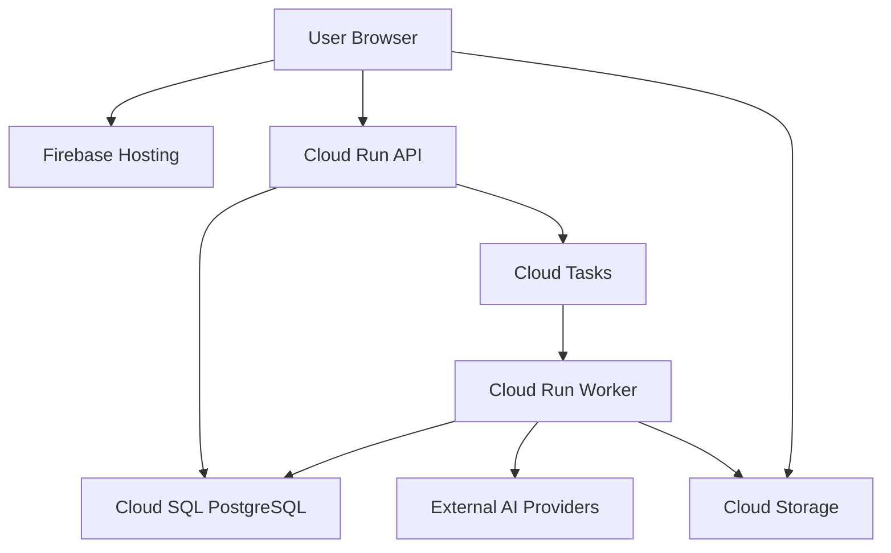
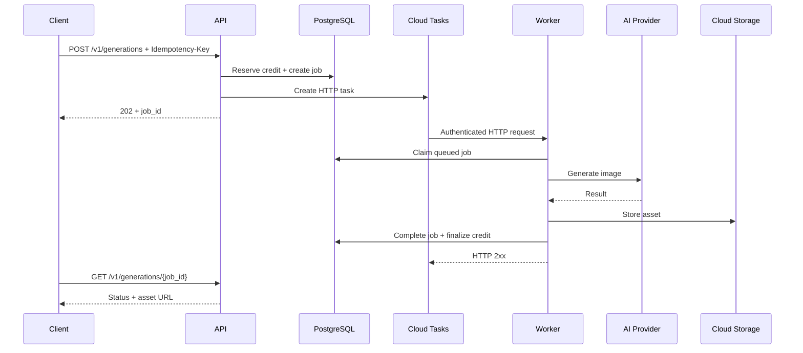
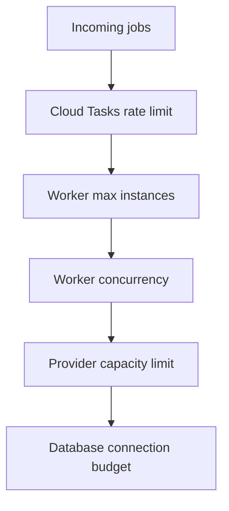
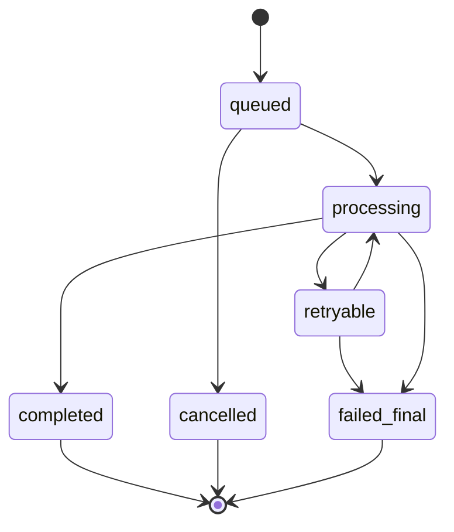
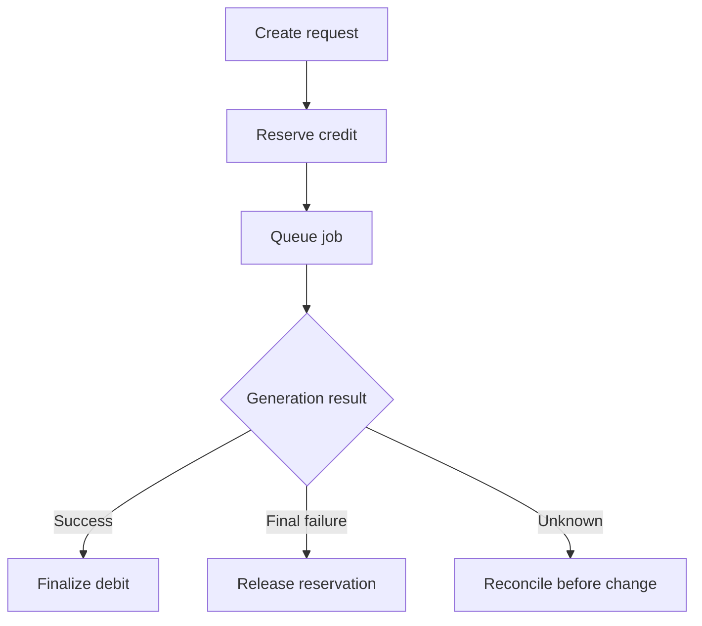
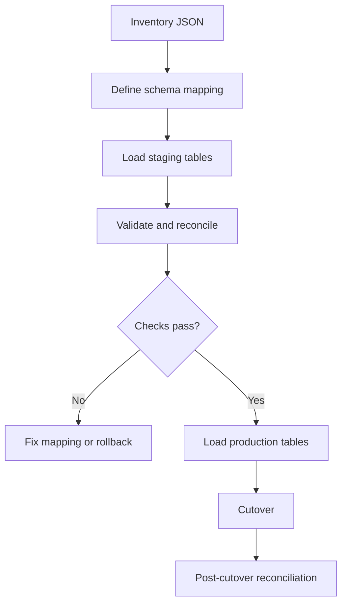

# ModelPromptForge — Google Cloud Infrastructure & Scaling Specification

> สถานะ: Production implementation baseline  
> เวอร์ชัน: 2.0  
> ปรับปรุงล่าสุด: 26 กรกฎาคม 2026  
> เป้าหมาย: AI Image Generation Platform สำหรับผู้ใช้เริ่มต้นประมาณ 20 คน/วัน และรองรับการขยายถึงอย่างน้อย 4,000 generation transactions/วัน  
> กลุ่มผู้อ่าน: Product Owner, Software Engineer, DevOps/SRE และ AI Coding Agent

---

## 0. Executive Summary

เอกสารนี้กำหนดสถาปัตยกรรม Google Cloud สำหรับย้าย ModelPromptForge จากเครื่อง Development ไป Production โดยไม่ต้องรื้อ business logic เมื่อระบบเติบโต

สถาปัตยกรรมที่เลือกสำหรับ MVP คือ:

| Component | Google Cloud service | เหตุผล |
|---|---|---|
| Frontend React/Vite | Firebase Hosting | เหมาะกับ static SPA, มี CDN/TLS และไม่ต้องเปิด Load Balancer สำหรับ MVP |
| Backend API | Cloud Run Service | Container แบบ stateless, scale to zero และ autoscale ได้ |
| Generation Worker | Cloud Run Service แยกจาก API | รับ HTTP task, ตั้ง concurrency และ scale แยกจาก API |
| Generation Queue | Cloud Tasks | ควบคุม dispatch rate, concurrent dispatch และ retry ตามข้อจำกัด AI Provider |
| Domain events | Pub/Sub — เปิดเมื่อมี use case | ใช้ fan-out event เช่น notification/analytics ไม่ใช้เป็น generation job queue หลักใน MVP |
| Database | Cloud SQL for PostgreSQL | Source of truth สำหรับ user, order, credit, job และ asset metadata |
| Image storage | Cloud Storage | เก็บ source/result images; Database เก็บเฉพาะ object key และ metadata |
| Container registry | Artifact Registry | เก็บ immutable container images |
| Secrets | Secret Manager | ไม่ฝัง secret ใน source, image หรือ frontend |
| Monitoring | Cloud Logging, Monitoring, Error Reporting | Logs, metrics, alert และ incident diagnosis |
| Infrastructure | Terraform | สร้าง environment ซ้ำได้และตรวจสอบการเปลี่ยนแปลงได้ |

ข้อสรุปด้าน Capacity:

- 100, 1,000 และ 4,000 transactions/วันยังรองรับได้ด้วย Cloud Run + Cloud Tasks + Cloud SQL
- ไม่จำเป็นต้องย้ายไป GKE เพียงเพราะถึง 4,000 transactions/วัน
- คอขวดที่ต้องควบคุมก่อนคือ AI Provider quota, งานช่วงพีก, Database connections, retry และต้นทุน AI
- Phase 1 ต้องวาง idempotency, credit reservation และ provider concurrency limit ให้ถูกต้องตั้งแต่ต้น

---

## 1. Scope และเป้าหมาย

### 1.1 เป้าหมาย

1. เปิด Production สำหรับ Pilot โดยใช้ต้นทุนเท่าที่จำเป็น
2. แยก Frontend, API, Worker, Database และ Object Storage ให้ deploy/scale แยกกันได้
3. API ตอบกลับเร็วโดยไม่รอ AI Provider สร้างภาพจนเสร็จ
4. ป้องกันการสร้างภาพซ้ำหรือหักเครดิตซ้ำเมื่อเกิด retry
5. ย้ายข้อมูล JSON ไป PostgreSQL ด้วยกระบวนการที่ validate และ rollback ได้
6. รองรับ 100 → 1,000 → 4,000 generation transactions/วันด้วยการปรับ configuration และ sizing
7. กำหนด security, backup, observability, cost guardrails และ go-live criteria
8. ให้ Software Engineer หรือ AI Coding Agent นำไปแตกงานและ implement ต่อได้

### 1.2 Non-goals ของ MVP

- ไม่ใช้ GKE/Kubernetes
- ไม่ทำ active-active multi-region
- ไม่ทำ multi-cloud database
- ไม่ใช้ Memorystore/Redis หาก PostgreSQL และ application rate limit ยังเพียงพอ
- ไม่ใช้ Pub/Sub แทน Cloud Tasks สำหรับ generation queue โดยไม่มี ADR
- ไม่ใช้ WebSocket หาก polling 3–5 วินาทีเพียงพอต่อ UX
- ไม่เก็บ image binary หรือ Base64 ใน PostgreSQL หรือ Cloud Tasks
- ไม่เปิด External Application Load Balancer, Cloud CDN, Cloud Armor หรือ Cloud NAT โดยไม่มีความจำเป็นที่วัดผลได้
- ไม่สร้าง microservices จำนวนมากใน MVP

### 1.3 คำจำกัดความ

ในเอกสารนี้:

- `transaction` หมายถึง generation job หนึ่งงาน ไม่ใช่ payment transaction
- `API` หมายถึง Backend HTTP API
- `Worker` หมายถึง Cloud Run Service ที่รับ Task ผ่าน authenticated HTTP
- `Provider` หมายถึง AI image provider ภายนอก
- `Asset` หมายถึง source image, temporary file หรือ generated result
- `Ledger` หมายถึง immutable credit transaction records

---

## 2. Repository Assessment ก่อน Implement

ผู้ implement ต้องตรวจ repository เวอร์ชันล่าสุดก่อนแก้โค้ด:

- `AGENTS.md` และข้อกำหนดเฉพาะ repository
- Runtime และ framework จริงของ Frontend/API
- คำสั่ง `build`, `start`, `test`, `lint` และ database migration
- Frontend ปัจจุบันถูก serve จาก Backend หรือใช้ Vite dev server
- โครงสร้าง JSON, schema version และข้อมูลจริงที่ต้อง migrate
- Authentication และ session/token flow
- Credit, Payment, Generation และ Asset lifecycle
- Provider adapters, retry behavior และ provider quota ที่มีอยู่
- Environment variables เดิม
- Dockerfile, CI/CD และ deployment files
- Test coverage และ acceptance tests ที่มีอยู่

หาก repository ขัดกับเอกสารนี้:

1. หยุดเฉพาะส่วนที่ขัดกัน
2. สรุปผลกระทบ
3. เสนอ Architecture Decision Record (ADR)
4. ห้ามเดา schema, payment flow หรือ authentication behavior

---

## 3. Architecture Principles ที่ต้องคงไว้ทุก Phase

### 3.1 Stable contracts

- Client สร้างงานผ่าน API และได้รับ `202 Accepted` พร้อม `job_id`
- API ไม่เปิด HTTP connection รอ AI Provider
- API ทำ validation, authorization, idempotency และ credit reservation ก่อน enqueue
- Queue payload มีเฉพาะ identifier และ routing metadata ขนาดเล็ก
- Worker อ่าน job detail จาก PostgreSQL
- Worker จำกัด concurrency แยกตาม Provider/Model
- Generated file เก็บใน Cloud Storage; PostgreSQL เก็บ object key และ metadata
- Credit ใช้ immutable ledger; ห้ามปรับ balance โดยไม่มี ledger entry
- ทุก external side effect ต้อง retry ได้โดยไม่สร้างภาพหรือหักเครดิตซ้ำ
- Application ต้องไม่พึ่ง local filesystem แบบถาวร
- API ต้อง stateless เพื่อให้ Cloud Run scale ได้
- Infrastructure ต้องสร้างซ้ำได้ด้วย Terraform

### 3.2 Separation of concerns



Frontend ห้าม:

- เชื่อม PostgreSQL โดยตรง
- มี provider API key
- มี database credential
- เชื่อถือค่า credit หรือราคา calculation จาก client

API รับผิดชอบ:

- Authentication/authorization
- Validation
- Price quotation
- Credit reservation
- Job creation
- Task enqueue
- Status/query endpoints
- Signed upload/download authorization

Worker รับผิดชอบ:

- Claim job
- Provider routing
- Provider rate-limit/capacity checks
- Retry classification
- Asset persistence
- Credit finalize/release
- Job completion/failure

### 3.3 Region baseline

Phase 1 ให้ใช้ Region เดียวกันสำหรับ Cloud Run, Cloud Tasks, Cloud SQL, Cloud Storage และ Artifact Registry เพื่อลด latency, egress และ operational complexity

ค่าเริ่มต้นที่แนะนำ:

```text
Primary region: asia-southeast1 (Singapore)
```

เหตุผลคือบริการหลักต้องมีพร้อมใน Region เดียวกัน โดยเฉพาะ Cloud SQL ผู้ implement ต้องตรวจ service availability และราคาอีกครั้งในวัน deploy หากต้องการใช้ Bangkok Region ห้ามแยก Cloud Run อยู่ Bangkok แต่ Cloud SQL อยู่ Singapore โดยไม่มี latency test และ ADR

---

## 4. Deployment Model: Development กับ Production

### 4.1 Environment mapping

| Component | Development | Production |
|---|---|---|
| Frontend | Vite Dev Server `localhost:5173` | `dist/` บน Firebase Hosting |
| API | Node.js `localhost:3000` | Cloud Run API |
| Worker | Local process/mock task | Cloud Run Worker |
| Queue | Emulator/mock adapter | Cloud Tasks |
| PostgreSQL | Docker Compose/local | Cloud SQL PostgreSQL |
| Assets | Local emulator/temp folder | Private Cloud Storage |
| Secrets | `.env` ที่ไม่ commit | Secret Manager |

### 4.2 Backend entry point

โค้ด `app.listen()` ใช้ต่อใน Cloud Run ได้:

```js
const { createApp } = await import('./app/createApp.js');

const PORT = Number(process.env.PORT || 3000);
const HOST = process.env.HOST || '0.0.0.0';

const app = createApp();

app.listen(PORT, HOST, () => {
  console.log(`Server running on ${HOST}:${PORT}`);
});
```

ข้อกำหนด:

- Container ต้องรับ port จาก `PORT`
- ต้อง listen ที่ `0.0.0.0`
- `createApp()` ไม่ควรผูกกับ frontend build path
- ต้องมี `/health/live` และ `/health/ready`
- ห้ามเริ่ม Worker consumer ภายใน API process

### 4.3 Recommended monorepo

```text
project/
├── frontend/
│   ├── src/
│   ├── public/
│   ├── vite.config.js
│   ├── firebase.json
│   └── package.json
├── backend/
│   ├── src/
│   │   ├── app/
│   │   ├── api/
│   │   ├── domain/
│   │   ├── worker/
│   │   ├── providers/
│   │   ├── persistence/
│   │   └── server.js
│   ├── Dockerfile
│   └── package.json
├── database/
│   ├── migrations/
│   ├── seeds/
│   └── scripts/
├── infrastructure/
│   ├── modules/
│   └── environments/
└── docs/
    └── adr/
```

Repository เดียวกันไม่ได้หมายความว่าต้อง deploy ไปที่เดียวกัน:

- Frontend build เฉพาะ `frontend/dist/`
- API และ Worker ใช้ container image เดียวกันได้ แต่ใช้คนละ entry point
- Database migration รันผ่าน Cloud Run Job หรือ protected CI step

### 4.4 Frontend environment

`frontend/.env.development`

```env
VITE_API_BASE_URL=http://localhost:3000
```

`frontend/.env.production`

```env
VITE_API_BASE_URL=https://api.example.com
```

ห้ามใส่ secret ในตัวแปร `VITE_*` เพราะค่าจะถูกฝังใน JavaScript bundle

---

## 5. Phase Overview

| Phase | Target | Transactions/day | Compute | Queue | Database |
|---|---|---:|---|---|---|
| Phase 1: Pilot | เปิดใช้งานจริงแบบประหยัด | 20–100 | Cloud Run API + Worker | Cloud Tasks queue เดียว | Cloud SQL Zonal |
| Phase 2: Growth | รองรับยอดเพิ่มและ peak | 100–1,000 | เพิ่ม max instances | แยก queue ตาม Provider/Priority เมื่อจำเป็น | เพิ่ม vCPU/RAM/pool |
| Phase 3: Scale | Production สำคัญและ 4,000+/วัน | 1,000–4,000+ | Cloud Run autoscale หลาย Worker | หลาย queue + provider capacity control | Cloud SQL HA |
| Phase 4: Specialized | งานซับซ้อน/GPU/self-host | วัดจาก workload | Cloud Run หรือ GKE/Compute Engine | Tasks + Pub/Sub events | HA + replica/pool |

จำนวน transactions/วันเป็นเพียงตัวช่วย การเปลี่ยน Phase ต้องพิจารณา peak concurrency, queue delay, provider quota, database load, reliability และรายได้

---

## 6. Target Production Architecture



หมายเหตุ: Browser เข้าถึง Cloud Storage เฉพาะผ่าน Signed URL ที่ API ออกให้หลังตรวจสิทธิ์แล้ว

### 6.1 Generation request flow



### 6.2 Upload flow

1. Client ขอ Signed URL จาก API
2. API ตรวจ user, file type, size limit และ ownership scope
3. API สร้าง asset record สถานะ `pending_upload`
4. Client upload โดยตรงไป private Cloud Storage bucket
5. Client แจ้ง upload completed หรือ API ตรวจ object metadata
6. API เปลี่ยน asset เป็น `available`
7. Generation job อ้างอิง `asset_id` ไม่ใช่ raw public URL

### 6.3 Frontend hosting

MVP ใช้ Firebase Hosting เพราะ:

- รองรับ static/SPA
- มี global CDN และ TLS
- ไม่ต้องเปิด External Application Load Balancer เพียงเพื่อใช้ Cloud CDN กับ GCS
- รองรับ rewrite สำหรับ SPA routes

ตัวอย่าง `firebase.json`:

```json
{
  "hosting": {
    "public": "dist",
    "ignore": ["firebase.json", "**/.*", "**/node_modules/**"],
    "rewrites": [
      {
        "source": "**",
        "destination": "/index.html"
      }
    ],
    "headers": [
      {
        "source": "/index.html",
        "headers": [
          {
            "key": "Cache-Control",
            "value": "no-cache"
          }
        ]
      },
      {
        "source": "/assets/**",
        "headers": [
          {
            "key": "Cache-Control",
            "value": "public,max-age=31536000,immutable"
          }
        ]
      }
    ]
  }
}
```

---

## 7. Phase 1 — Pilot Configuration

### 7.1 Required services

| Component | Configuration baseline |
|---|---|
| Firebase Hosting | SPA static build, custom domain, TLS |
| Cloud Run API | 1 vCPU, 512 MiB–1 GiB, request-based billing |
| Cloud Run Worker | 1 vCPU, 1 GiB, concurrency 1–2 |
| Cloud Tasks | `generation-standard` queue |
| Cloud SQL | PostgreSQL, zonal/single instance, automated backup |
| Cloud Storage | private source/result buckets หรือ bucket เดียวแยก prefix |
| Artifact Registry | Docker repository |
| Secret Manager | provider/database/payment secrets |
| Logging/Monitoring | structured logs, metrics, alerts |
| Terraform state | dedicated private GCS bucket |

### 7.2 Starting configuration

| Setting | API | Worker |
|---|---:|---:|
| vCPU | 1 | 1 |
| Memory | 512 MiB–1 GiB | 1 GiB |
| Concurrency | 20–40 | 1–2 |
| Minimum instances | 0 | 0 |
| Maximum instances | 2–3 | 2–3 |
| Request timeout | 30–60 sec | มากกว่า provider timeout โดยมี safety margin |
| CPU allocation | request-based | request-based ขณะรับ Cloud Task |

Worker ต้องเป็น HTTP request handler ไม่ใช่ background pull process ที่รอ queue ตลอดเวลา

### 7.3 Cloud Tasks initial queue

```text
Queue: generation-standard
max_dispatches_per_second: 1
max_concurrent_dispatches: 2
max_attempts: 5
min_backoff: 10s
max_backoff: 300s
max_doublings: 5
```

ค่าจริงต้องไม่สูงกว่า Provider quota และต้องเผื่อ manual/admin jobs

### 7.4 Cost guardrails

- ตั้ง Billing Budget alerts ที่ 50%, 80% และ 100%
- ตั้ง Cloud Run `max instances` ทุก service
- จำกัด log volume และ retention
- ตั้ง lifecycle สำหรับ temporary assets
- ตั้ง application daily provider-spending ceiling
- แจ้งเตือนเมื่อ retry rate หรือ provider cost/job สูงผิดปกติ
- ห้ามเปิด Load Balancer, Cloud CDN, Cloud Armor, Cloud NAT, Memorystore หรือ Cloud SQL HA โดยไม่มี ADR

งบ Infrastructure สำหรับ Pilot ประเมินเบื้องต้นประมาณ 700–1,400 บาท/เดือน หาก Cloud Run scale to zero และไม่มี Load Balancer แต่ไม่ใช่ใบเสนอราคา ต้นทุนจริงขึ้นกับ Cloud SQL edition/size, storage, backup, logs, egress, Region, VAT และอัตราแลกเปลี่ยน ผู้ deploy ต้องตรวจ Google Cloud Pricing Calculator ในวันเปิดระบบ

---

## 8. Scaling Plan: 100 → 1,000 → 4,000 Transactions/Day

สมมุติ:

- 1 transaction = 1 generation job
- ระยะเวลาสร้างเฉลี่ย = 90 วินาที
- งานกระจายในช่วงใช้งาน 12 ชั่วโมง

| Volume | Average arrival rate | Estimated active jobs | Peak 5× active jobs |
|---:|---:|---:|---:|
| 100/day | 0.0023 jobs/sec | <1 | 1–2 |
| 1,000/day | 0.023 jobs/sec | 2–3 | 10–12 |
| 4,000/day | 0.093 jobs/sec | 8–10 | 40–45 |

สูตรประมาณ:

```text
Active concurrency ≈ arrival rate × average job duration
```

ตัวเลขนี้ใช้วาง baseline เท่านั้น ต้องเก็บค่า p50/p95 job duration จริงแยกตาม Provider/Model

### 8.1 Recommended tuning range

| Setting | 100/day | 1,000/day | 4,000/day |
|---|---:|---:|---:|
| API concurrency | 20–40 | 40–80 | 40–80 |
| API max instances | 2–3 | 5–10 | 10–20 |
| Worker concurrency | 1–2 | 1–3 | 1–5 |
| Worker max instances | 2–3 | 5–10 | 10–30 |
| Task concurrent dispatch | 2–3 | 5–10 | 10–30 |
| PostgreSQL | smallest tested | 1–2 vCPU | 2–4 vCPU เริ่มต้นตาม metrics |
| Database HA | ไม่จำเป็นสำหรับ Pilot | พิจารณาตาม SLA | แนะนำสำหรับ critical production |
| Queue layout | 1 queue | อาจแยก Premium | แยก Provider/Priority ตาม quota |

อย่านำตัวเลขไปตั้ง production โดยไม่ทำ load test เพราะ provider latency, image size และ code behavior มีผลมากกว่าจำนวนรายวัน

### 8.2 Capacity control hierarchy



ค่าทุกชั้นต้องสอดคล้องกัน การเพิ่ม Worker โดยไม่เพิ่ม Provider quota จะทำให้เกิด 429 และ retry storm

### 8.3 When to add queues

เริ่มต้น:

```text
generation-standard
```

เมื่อโต:

```text
generation-draft
generation-selling
generation-premium
generation-provider-openai
generation-provider-google
generation-provider-seedream
```

หลักการ:

- แยก queue เมื่อมี quota, SLA, priority หรือ failure domain ต่างกันจริง
- ไม่แยก queue ตามทุก model ตั้งแต่ MVP
- ห้ามใช้ priority จาก client โดยไม่ตรวจ entitlement ฝั่ง API

### 8.4 GKE decision

4,000 transactions/วันไม่ใช่ trigger ให้ย้าย GKE อัตโนมัติ ให้พิจารณา GKE เมื่อ:

- มี services ที่ deploy แยกกันจำนวนมาก
- ต้องใช้ self-hosted model/GPU หรือ specialized node pools
- ต้อง scale ด้วย custom external metrics ที่ Cloud Run/Tasks ตอบไม่ได้
- ต้องการ workload isolation ระดับ cluster/namespace
- มีทีม DevOps/SRE ดูแล cluster lifecycle
- ค่าใช้จ่ายที่วัดจริงแสดงว่า GKE/Compute Engine คุ้มกว่า Cloud Run

---

## 9. Cloud Tasks and Worker Specification

### 9.1 Why Cloud Tasks

Generation job เป็น one-job/one-handler workload ที่ต้องควบคุม:

- Dispatch rate
- Concurrent dispatch
- HTTP target
- Retry attempts/backoff
- Provider capacity
- Scheduled retry

Pub/Sub เหมาะกว่าเมื่อ event หนึ่งต้อง fan-out ไปหลาย subscribers เช่น:

- `generation.completed`
- Notification
- Analytics
- Audit pipeline
- Webhook delivery

### 9.2 Task contract

```json
{
  "schema_version": 1,
  "task_id": "uuid",
  "job_id": "uuid",
  "tenant_id": "uuid",
  "priority": "standard",
  "provider_hint": "auto",
  "created_at": "2026-07-26T00:00:00Z",
  "trace_id": "string"
}
```

ห้ามใส่:

- Prompt เต็ม
- Base64
- Source image binary
- Provider credential
- Signed URL
- Payment data
- Sensitive personal data

### 9.3 Authentication

- Cloud Tasks เรียก Worker ด้วย OIDC token จาก dedicated service account
- Worker ไม่เปิด public unauthenticated access
- Worker ตรวจ audience/identity ตาม Cloud Run IAM
- Task creator service account มีสิทธิ์ enqueue เฉพาะ queue ที่กำหนด
- Worker service account มีสิทธิ์เฉพาะ Cloud SQL, GCS และ secrets ที่ต้องใช้

### 9.4 Worker algorithm

```text
1. Validate task schema and authentication
2. Load job from PostgreSQL
3. If terminal state -> return 2xx
4. Atomically claim queued/retryable job
5. Check provider capacity and attempt record
6. Call provider with provider idempotency key when supported
7. Persist result to Cloud Storage
8. Commit asset + job completion + credit finalization
9. Return HTTP 2xx only after commit succeeds
```

### 9.5 Retry rules

Retry:

- Network timeout
- Provider 429
- Provider 5xx
- Temporary storage/database connectivity error

Do not retry automatically:

- Invalid input
- Unsupported format
- Content policy rejection
- Insufficient credit
- User-cancelled job
- Authentication/authorization error

Retry safety:

- ทุก attempt มี unique `provider_attempt_id`
- ตรวจ terminal job state ก่อนเรียก Provider
- ใช้ `idempotency_key` กับ Provider เมื่อรองรับ
- Persist provider request ID
- หากผลลัพธ์สำเร็จแต่ DB commit ไม่แน่นอน ให้ reconcile ก่อนเรียก Provider ซ้ำ

### 9.6 Cloud Tasks terminal failure

Cloud Tasks ไม่มี DLQ แบบ SQS สำหรับ HTTP task flow จึงต้องมี application-level terminal failure handling:

- เมื่อเกิน retry policy ให้ task หยุด retry
- Monitoring alert จาก task failure/retry metrics
- Reconciliation job ค้นหา `processing/retryable` ที่ค้างเกิน threshold
- Admin action: retry, cancel, refund/release หรือ mark failed
- เก็บ failure reason และ attempts ใน PostgreSQL

ห้ามกล่าวว่า Cloud Tasks มี DLQ โดยตรงใน acceptance criteria

---

## 10. Database Design

### 10.1 Core tables

| Table | Purpose |
|---|---|
| `users` | User identity/profile/status |
| `tenants` | Workspace/account boundary ถ้ามี |
| `credit_wallets` | Cached current balance/version |
| `credit_ledger` | Immutable credit debit/credit entries |
| `credit_reservations` | Hold credit ระหว่าง job |
| `generation_jobs` | Source of truth ของ generation lifecycle |
| `generation_attempts` | Provider attempts และ request IDs |
| `assets` | GCS object key, owner, status และ metadata |
| `orders` | Credit purchase orders |
| `payments` | Payment gateway transactions |
| `idempotency_keys` | ป้องกัน duplicate commands |
| `outbox_events` | Reliable post-commit task/event publishing |
| `audit_logs` | Admin/security audit trail |

### 10.2 Required constraints

- `credit_ledger` append-only ใน application
- Unique `(wallet_id, reference_type, reference_id, entry_type)`
- Unique `(tenant_id, idempotency_key, operation)`
- Unique provider request ID เมื่อ Provider รับประกัน uniqueness
- Asset ownership ต้องอ้าง user/tenant
- Monetary/credit amount ใช้ integer minor unit ห้ามใช้ floating point
- ทุก table สำคัญมี `created_at`, `updated_at`
- Soft delete ใช้เฉพาะ entity ที่ต้อง audit
- Database migration ต้อง version-controlled

### 10.3 Job state machine



Allowed transitions ต้องบังคับด้วย service method และ conditional SQL update เช่น:

```sql
UPDATE generation_jobs
SET status = 'processing',
    started_at = NOW(),
    version = version + 1
WHERE id = $1
  AND status IN ('queued', 'retryable');
```

ถ้า affected rows = 0 ให้ Worker โหลด state ใหม่และไม่เรียก Provider ซ้ำ

### 10.4 Credit reservation



ข้อกำหนด:

- Reserve credit และ create job อยู่ใน transaction เดียวกัน
- Finalize/release ต้อง idempotent
- ห้ามหักเครดิตจาก Browser
- Admin adjustment ต้องสร้าง ledger entry พร้อม actor/reason
- Balance cache ต้อง reconcile กับ ledger ได้

### 10.5 Database connections

Cloud Run autoscaling อาจสร้าง database connections จำนวนมาก:

```text
Total potential connections
= API max instances × API pool size
+ Worker max instances × Worker pool size
+ migration/admin reserve
```

Phase 1 baseline:

- API pool: 2–5 connections/instance
- Worker pool: 1–2 connections/instance
- Connection acquisition timeout
- Idle timeout
- Transaction timeout
- Reserve capacity สำหรับ migration/admin

เพิ่ม pooler/connector เมื่อวัดพบ connection churn หรือ usage สูง ห้ามเพิ่ม max instances โดยไม่คำนวณ connection budget

---

## 11. Reliable Enqueue and Outbox

ปัญหา dual-write:

1. Database commit สำเร็จ แต่สร้าง Cloud Task ไม่สำเร็จ → job ค้าง
2. สร้าง Cloud Task สำเร็จ แต่ response หลุด → client retry และเกิด duplicate

แนวทาง:

- Transaction สร้าง `generation_job`, credit reservation และ `outbox_event`
- Outbox dispatcher สร้าง Cloud Task
- หลังสำเร็จ mark outbox `published_at`
- Task name deterministic จาก `job_id` เมื่อเหมาะสม
- Reconciliation ตรวจ unpublished outbox

MVP สามารถ enqueue หลัง commit โดยตรงได้หากมี scheduled reconciliation ที่เชื่อถือได้ แต่ production baseline ที่แนะนำคือ transactional outbox

---

## 12. JSON-to-PostgreSQL Migration

### 12.1 Strategy



### 12.2 Required scripts

```text
database/scripts/
├── inventory-json.js
├── validate-json.js
├── import-staging.js
├── reconcile-staging.js
├── promote-production.js
├── verify-production.js
└── rollback-cutover.js
```

### 12.3 Runbook

1. Backup JSON และ checksum
2. Freeze schema-changing writes หรือเปิด maintenance window
3. Run inventory: record count, IDs, timestamps, null/invalid values
4. Import เข้า staging tables
5. Validate referential integrity และ totals
6. Reconcile credit balances กับ ledger
7. Promote เข้า production tables ใน transaction/batches
8. Switch application read path
9. Verify API และ sampled records
10. Switch write path
11. Run post-cutover reconciliation
12. เก็บ rollback window ตาม policy

### 12.4 Acceptance checks

- Record count ตรงตาม mapping rules
- ไม่มี duplicate primary/business keys
- Credit total และ user balance reconcile
- Asset references resolve
- Invalid records มี quarantine report
- Timestamp/timezone conversion ถูกต้อง
- Migration rerun ได้โดยไม่สร้างข้อมูลซ้ำ
- Rollback ผ่านการทดสอบก่อน Production

---

## 13. Cloud Storage Asset Design

### 13.1 Buckets

แนะนำแยกตาม environment:

```text
{project}-{env}-assets
{project}-{env}-backups
{project}-{env}-terraform-state
```

Firebase Hosting จัดการ frontend deployment ไม่ต้องใช้ public frontend bucket ของ application เองใน MVP

### 13.2 Object keys

```text
tenants/{tenant_id}/users/{user_id}/source/{asset_id}/original.{ext}
tenants/{tenant_id}/jobs/{job_id}/results/{asset_id}.{ext}
tenants/{tenant_id}/jobs/{job_id}/temporary/{object_id}
```

ห้ามใส่:

- Email
- ชื่อจริง
- Prompt
- Provider API key
- Sequential guessable public identifier

### 13.3 Security

- เปิด Public Access Prevention
- ใช้ Uniform bucket-level access
- Signed URL อายุสั้น
- ตรวจ ownership ก่อนออก Signed URL
- จำกัด content type และ upload size
- Service account least privilege
- เปิด audit logs ตาม risk/cost policy
- Encryption at rest ใช้ Google-managed encryption เป็น baseline; CMEK เมื่อมี compliance requirement

### 13.4 Lifecycle

ตัวอย่าง policy เชิงธุรกิจ:

| Asset type | Suggested retention |
|---|---:|
| Incomplete/temporary upload | 1–7 วัน |
| Failed job temporary file | 1–7 วัน |
| Generated result | 30–90 วัน หรือตามแพ็กเกจ |
| User-deleted asset | soft-delete window ตาม policy |
| Backup/export | 7–30 วันตาม RPO/compliance |

Retention ต้องสอดคล้องกับ Privacy Policy, Terms, refund/dispute และ user deletion workflow

---

## 14. Security Baseline

### 14.1 Identity and IAM

- แยก Service Account: API, Worker, Migration, CI/CD
- ห้ามใช้ long-lived service account JSON key ถ้าหลีกเลี่ยงได้
- CI/CD ใช้ Workload Identity Federation
- Grant สิทธิ์ระดับ resource ที่จำเป็น
- แยก dev/staging/prod เป็นคนละ Project เมื่อเข้าสู่ Production จริง
- Admin access ใช้ MFA และกลุ่มสิทธิ์

### 14.2 Secrets

- Secrets อยู่ Secret Manager
- ห้าม commit `.env.production`
- ห้ามฝัง secret ใน container image
- แยก provider secret ตาม environment
- Rotate secret และบันทึก owner/expiry
- Logs ต้อง redact token, API key, cookie, signed URL และ payment data

### 14.3 Network and HTTP

- TLS ทุก public endpoint
- CORS allowlist เฉพาะ frontend origin
- Rate limit login, upload URL, generation และ payment callback
- ตรวจ webhook signature และ replay protection
- Security headers: CSP, HSTS, `X-Content-Type-Options`, referrer policy
- Cloud Run Worker ต้อง authenticated
- API public endpoint ต้องตรวจ auth ทุก protected route

ตัวอย่าง CORS:

```js
app.use(cors({
  origin: process.env.FRONTEND_ORIGIN,
  credentials: true
}));
```

### 14.4 Data and privacy

- Classify prompt/source images ว่าเป็น user content
- ระบุ retention และ deletion SLA
- ไม่ log prompt เต็มเป็นค่าเริ่มต้น
- มี audit trail สำหรับ admin credit/payment action
- Backup deletion และ legal retention ต้องกำหนดก่อน go-live
- signed URL ต้องอายุสั้นและไม่ปรากฏใน analytics/logs

---

## 15. Observability and Operations

### 15.1 Structured log fields

```json
{
  "severity": "INFO",
  "service": "generation-worker",
  "environment": "production",
  "trace_id": "string",
  "request_id": "uuid",
  "job_id": "uuid",
  "tenant_id": "uuid",
  "provider": "string",
  "model": "string",
  "attempt": 1,
  "duration_ms": 1234,
  "outcome": "success"
}
```

ห้าม log:

- Access/refresh tokens
- Provider API keys
- Database credentials
- Full signed URLs
- Full payment payload
- Full prompt/source image โดยไม่มี explicit secure-debug workflow

### 15.2 Required metrics

API:

- Request count
- 4xx/5xx rate
- p50/p95/p99 latency
- Cloud Run instance count
- Cold-start impact

Queue:

- Task creation errors
- Dispatch count
- Retry count
- Queue depth/oldest pending approximation
- Execution latency

Worker:

- Job duration by Provider/Model
- Success/failure/retry rate
- Provider 429/5xx rate
- Active jobs
- Cost/job

Database:

- CPU/memory/storage
- Active/max connections
- Query latency
- Slow queries
- Lock/deadlock
- Backup status

Business:

- Credit reserved/finalized/released
- Ledger reconciliation difference
- Generation cost/revenue/margin
- Failed jobs awaiting admin action

### 15.3 Initial alerts

| Alert | Initial condition |
|---|---|
| API 5xx | >2–5% ต่อ 5 นาที |
| API p95 | >500 ms ต่อเนื่อง ไม่รวม generation |
| Worker failure | เกิน baseline หรือ >5% |
| Provider 429 | เกิดซ้ำต่อเนื่อง |
| Queue delay | เกิน product SLA |
| DB connections | >70% ของ connection budget |
| DB storage | >70% |
| Backup failure | ครั้งใดครั้งหนึ่ง |
| Credit mismatch | ค่าไม่เท่ากับ 0 |
| Budget | 50%, 80%, 100% |

Threshold ต้องปรับหลังมี production baseline 2–4 สัปดาห์

### 15.4 Runbooks

ต้องมีอย่างน้อย:

- Provider outage/429 storm
- Queue backlog
- Database connection exhaustion
- Cloud SQL fail/restore
- Credit mismatch
- Payment webhook replay/failure
- Asset upload failure
- Compromised provider key
- Rollback deployment

---

## 16. Backup, RPO and RTO

### 16.1 Phase 1

- Cloud SQL automated backup: daily
- Point-in-time recovery: เปิดหากงบและ edition รองรับ
- Backup retention: 7–14 วัน
- RPO target: ≤24 ชั่วโมง
- RTO target: 4–8 ชั่วโมง
- Restore test: ก่อน go-live และอย่างน้อยรายไตรมาส

### 16.2 Critical Production

- Cloud SQL HA regional configuration
- PITR และ transaction log retention ตาม requirement
- RPO/RTO ลดลงตาม business impact
- Restore drill และ failover test
- Export สำรองไม่ควรแทน automated backup/PITR

Cloud SQL HA เพิ่ม primary/standby ต่าง zone และมีต้นทุนสูงกว่า standalone จึงเปิดตาม SLA และ business criticality ไม่ใช่จำนวน transactions อย่างเดียว

---

## 17. Infrastructure as Code

### 17.1 Terraform structure

```text
infrastructure/
├── README.md
├── modules/
│   ├── project-services/
│   ├── service-accounts/
│   ├── artifact-registry/
│   ├── cloud-run-api/
│   ├── cloud-run-worker/
│   ├── cloud-tasks/
│   ├── cloud-sql/
│   ├── cloud-storage/
│   ├── secret-manager/
│   ├── monitoring/
│   └── budgets/
└── environments/
    ├── development/
    ├── staging/
    └── production/
```

### 17.2 IaC rules

- Remote state อยู่ private GCS bucket
- เปิด object versioning สำหรับ state bucket
- Terraform plan ใน Pull Request
- Apply ผ่าน protected workflow
- ห้ามใส่ secret value ใน Terraform state หากหลีกเลี่ยงได้
- Labels: `project`, `environment`, `owner`, `cost-center`, `managed-by`
- Resource names ห้ามเปลี่ยนโดยไม่ตรวจ replacement impact
- Production deletion protection สำหรับ Cloud SQL และ critical storage

---

## 18. CI/CD

### 18.1 Pipeline

1. Lint/unit test
2. Dependency/security scan
3. Build immutable container image
4. Push Artifact Registry ด้วย commit SHA
5. Terraform plan/apply ตาม environment
6. Run database migration ผ่าน Cloud Run Job/protected step
7. Deploy API revision
8. Smoke test API
9. Deploy Worker revision
10. Deploy Firebase Hosting
11. End-to-end generation test
12. Verify queue, database, storage และ credit reconciliation

### 18.2 Deployment safety

- Container image ห้ามใช้ `latest` เป็น production source of truth
- Migration ต้อง backward-compatible ใน rolling deployment
- ใช้ expand → migrate → contract สำหรับ destructive schema change
- Cloud Run revision rollback ต้องทดสอบ
- Worker revision ต้องไม่ทำให้ in-flight task สูญหาย
- Payment webhook compatibility ต้องอยู่ข้าม deployment ได้

---

## 19. API and Worker Interface Baseline

### 19.1 API endpoints

```text
POST   /v1/uploads
POST   /v1/uploads/{asset_id}/complete
POST   /v1/generations
GET    /v1/generations/{job_id}
POST   /v1/generations/{job_id}/cancel
GET    /v1/assets/{asset_id}/download
GET    /health/live
GET    /health/ready
```

### 19.2 Create generation

Request:

```http
POST /v1/generations
Authorization: Bearer <token>
Idempotency-Key: <uuid>
Content-Type: application/json
```

```json
{
  "template_id": "uuid",
  "input_asset_ids": ["uuid"],
  "parameters": {},
  "quality_tier": "selling"
}
```

Response:

```http
HTTP/1.1 202 Accepted
```

```json
{
  "job_id": "uuid",
  "status": "queued",
  "status_url": "/v1/generations/uuid",
  "credit_reserved": 12
}
```

### 19.3 Internal Worker endpoint

```text
POST /internal/tasks/generations
```

ข้อกำหนด:

- รับเฉพาะ authenticated Cloud Tasks
- Response 2xx เมื่อ task สำเร็จหรือ job อยู่ terminal state แล้ว
- Response 429/5xx เฉพาะกรณีที่ต้องการ retry
- Validation/permanent error ต้อง persist final state แล้วตอบ 2xx เพื่อหยุด retry

---

## 20. Implementation Work Packages

### WP-01 Repository assessment

Deliverables:

- Runtime/build/test inventory
- Current architecture map
- JSON schema inventory
- Environment variable inventory
- Gap list เทียบเอกสารนี้
- ADR ที่ต้องตัดสินใจ

Acceptance:

- ไม่มี assumption ที่ยังไม่ยืนยันใน payment, credit และ auth

### WP-02 Frontend deployment separation

Deliverables:

- Vite production build
- `VITE_API_BASE_URL`
- Firebase configuration
- SPA routing/cache headers
- CORS configuration

Acceptance:

- Frontend deploy แยกจาก Backend
- ไม่มี secret ใน bundle
- Refresh nested route ไม่ 404

### WP-03 Container and Cloud Run

Deliverables:

- Production Dockerfile
- API/Worker entry points
- Health endpoints
- Graceful shutdown
- Cloud Run Terraform modules

Acceptance:

- API และ Worker deploy/scale แยกกัน
- Container listen ที่ `0.0.0.0:$PORT`

### WP-04 PostgreSQL and migration

Deliverables:

- Migrations
- Repository/data-access layer
- Connection pool configuration
- JSON import/reconcile/rollback scripts

Acceptance:

- Migration rerun ได้
- Credit reconciliation ผ่าน
- Rollback tested

### WP-05 Credit ledger and idempotency

Deliverables:

- Immutable ledger
- Reservation/finalize/release
- Idempotency store
- Admin adjustment audit

Acceptance:

- Duplicate API request ไม่ reserve ซ้ำ
- Duplicate Worker call ไม่ generate/debit ซ้ำ

### WP-06 Cloud Storage assets

Deliverables:

- Private bucket
- Object key strategy
- Signed URL endpoints
- Ownership checks
- Lifecycle rules

Acceptance:

- Bucket ไม่ public
- Unauthorized user ดาวน์โหลด asset คนอื่นไม่ได้

### WP-07 Cloud Tasks worker

Deliverables:

- Queue Terraform
- OIDC task authentication
- Worker handler
- Retry classification
- Provider capacity manager
- Reconciliation process

Acceptance:

- Rate limit ป้องกัน Provider overload
- Task retry ไม่สร้างภาพซ้ำ
- Terminal failure มี admin/reconcile path

### WP-08 Observability and cost

Deliverables:

- Structured logs
- Dashboards
- Alerts
- Budget alerts
- Provider cost metrics
- Runbooks

Acceptance:

- Trace job จาก API → Task → Worker → Provider ได้
- Alert สำคัญผ่านการทดสอบ

### WP-09 CI/CD and IaC

Deliverables:

- Terraform environments
- Build/deploy workflow
- Immutable image tagging
- Migration step
- Rollback procedure

Acceptance:

- Fresh staging environment สร้างซ้ำได้
- Production apply ถูกป้องกัน

### WP-10 Load, failure and recovery test

Deliverables:

- 100/1,000/4,000 daily-volume test model
- Peak concurrency test
- Provider 429/5xx simulation
- DB connection exhaustion test
- Restore drill
- Credit reconciliation report

Acceptance:

- ระบบรักษา job/credit correctness ภายใต้ retry และ partial failure

---

## 21. Phase Promotion Gates

### Phase 1 → Phase 2

เข้า Phase 2 เมื่อเกิดข้อใดข้อหนึ่งต่อเนื่อง:

- API p95 >500 ms โดยไม่รวม generation
- Queue delay เกิน SLA มากกว่า 3 ครั้ง/สัปดาห์
- Database connection usage >70%
- Provider 429 เกิดจาก dispatch สูงเกิน quota
- ต้องแยก Premium SLA
- Minimum instance ช่วย UX และรายได้รองรับ fixed cost

Actions:

- Tune API/Worker max instances
- แยก queue ตาม Provider/Priority
- เพิ่ม Cloud SQL CPU/RAM
- ปรับ connection pool
- เพิ่ม minimum API instances หาก cold start กระทบ UX

### Phase 2 → Critical Production

Trigger:

- Downtime มีผลต่อรายได้หรือ SLA ชัดเจน
- 1,000–4,000+ transactions/วันและ peak สูง
- Cloud SQL single-zone ไม่ผ่าน business continuity requirement
- ต้องการ failover อัตโนมัติ

Actions:

- Cloud SQL HA
- Restore/failover drill
- Formal on-call/runbooks
- Staging load test
- Provider multi-route/fallback policy

### Critical Production → Specialized Infrastructure

Trigger:

- Self-hosted model/GPU
- Services จำนวนมากและต้องการ cluster controls
- Cloud Run economics แพงกว่าทางเลือกจากข้อมูลจริง
- ต้อง custom scheduling/isolation

Action:

- Evaluate Cloud Run GPU, GKE หรือ Compute Engine ด้วย ADR และ cost benchmark

---

## 22. Acceptance Criteria ก่อน Go-live

### Architecture

- [ ] Frontend deploy บน Firebase Hosting
- [ ] API และ Worker เป็น Cloud Run คนละ Service
- [ ] API ไม่รอ AI Provider
- [ ] Cloud Tasks เรียก Worker ด้วย authenticated HTTP
- [ ] Cloud SQL, Cloud Run, Tasks และ Storage อยู่ Region strategy เดียวกัน

### Correctness

- [ ] `POST /v1/generations` คืน `202 + job_id`
- [ ] Duplicate `Idempotency-Key` คืนผลเดิม
- [ ] Duplicate task ไม่ generate/debit ซ้ำ
- [ ] Credit reserve/finalize/release reconcile
- [ ] Invalid/permanent failure ไม่ retry ไม่สิ้นสุด
- [ ] Task ที่ค้างถูก reconcile ได้

### Data

- [ ] JSON migration validation ผ่าน
- [ ] Database constraints และ migrations อยู่ใน version control
- [ ] Cloud Storage assets bucket ไม่ public
- [ ] Signed URL ownership/expiry test ผ่าน
- [ ] Backup และ restore test ผ่าน

### Security

- [ ] ไม่มี secret ใน Git, frontend bundle หรือ image
- [ ] IAM least privilege review ผ่าน
- [ ] CORS allowlist ถูกต้อง
- [ ] Payment webhook signature/replay protection ผ่าน
- [ ] Sensitive logs ถูก redact

### Operations

- [ ] Dashboards และ alerts พร้อมใช้งาน
- [ ] Billing budgets ตั้งค่าแล้ว
- [ ] Cloud Run max instances ทุก Service
- [ ] Provider capacity limits ตั้งค่าแล้ว
- [ ] Rollback runbook ผ่านการทดสอบ
- [ ] On-call/admin รู้วิธี retry/refund/reconcile

---

## 23. Go-live Checklist

### ก่อน Deploy

- [ ] ตัดสินใจ Region และบันทึก ADR
- [ ] ยืนยัน Cloud SQL sizing และ backup policy
- [ ] ยืนยัน provider quotas
- [ ] ยืนยัน retention policy ของ source/result images
- [ ] ยืนยัน RPO/RTO
- [ ] ยืนยัน credit/refund behavior
- [ ] ยืนยัน custom domains และ DNS ownership

### Deploy

- [ ] Apply Terraform
- [ ] Push container image ด้วย commit SHA
- [ ] Run migration
- [ ] Deploy API
- [ ] Deploy Worker
- [ ] Deploy Firebase Hosting
- [ ] Smoke test
- [ ] End-to-end generation test
- [ ] Payment test/sandbox callback

### หลัง Deploy

- [ ] ตรวจ logs/metrics/alerts
- [ ] ตรวจ Cloud Tasks retry
- [ ] ตรวจ credit ledger
- [ ] ตรวจ asset access
- [ ] ตรวจ budget alert
- [ ] บันทึก actual baseline cost และ performance

---

## 24. Open Decisions

ต้องสรุปเป็น ADR ก่อน Production:

1. Primary Region: Singapore หรือ Bangkok เมื่อบริการครบและผ่าน test
2. Cloud SQL edition/machine size ที่ผ่าน load test
3. Authentication provider และ session strategy
4. Credit expiry/refund policy
5. Asset retention แยกตามแพ็กเกจ
6. Provider timeout/retry/fallback policy
7. Premium queue/SLA
8. RPO/RTO ที่ธุรกิจยอมรับ
9. Firebase Hosting domain กับ API domain
10. Transactional outbox ใน MVP หรือเพิ่มก่อน public launch
11. วิธี notify completion: polling, SSE หรือ notification event
12. Data classification และ deletion SLA

---

## 25. Official References

เอกสารนี้อ้างอิงเอกสารทางการ ไม่ใช้แหล่งข้อมูลที่ผู้ใช้ทั่วไปแก้ไขได้:

### Frontend

- [Firebase Hosting](https://firebase.google.com/docs/hosting)
- [Firebase Hosting configuration](https://firebase.google.com/docs/hosting/full-config)
- [Vite environment variables and modes](https://vite.dev/guide/env-and-mode)

### Cloud Run

- [Cloud Run documentation](https://cloud.google.com/run/docs)
- [Cloud Run maximum concurrency](https://cloud.google.com/run/docs/about-concurrency)
- [Configure Cloud Run concurrency](https://cloud.google.com/run/docs/configuring/concurrency)
- [Cloud Run maximum instances](https://cloud.google.com/run/docs/configuring/max-instances)
- [Cloud Run autoscaling](https://cloud.google.com/run/docs/about-instance-autoscaling)
- [Cloud Run container runtime contract](https://cloud.google.com/run/docs/container-contract)
- [Cloud Run Jobs](https://cloud.google.com/run/docs/create-jobs)
- [Cloud Run pricing](https://cloud.google.com/run/pricing)

### Queue and messaging

- [Choosing Cloud Tasks or Pub/Sub](https://cloud.google.com/tasks/docs/comp-pub-sub)
- [Cloud Tasks queue configuration, limits and retries](https://cloud.google.com/tasks/docs/configuring-queues)
- [Cloud Tasks quotas and limits](https://cloud.google.com/tasks/docs/quotas)
- [Cloud Tasks with authenticated HTTP targets](https://cloud.google.com/tasks/docs/creating-http-target-tasks)
- [Pub/Sub documentation](https://cloud.google.com/pubsub/docs)

### Database

- [Cloud SQL for PostgreSQL](https://cloud.google.com/sql/docs/postgres)
- [Cloud SQL connection management](https://cloud.google.com/sql/docs/postgres/manage-connections)
- [Cloud SQL high availability](https://cloud.google.com/sql/docs/postgres/high-availability)
- [Cloud SQL backups](https://cloud.google.com/sql/docs/postgres/backup-recovery/backups)
- [Cloud SQL locations](https://cloud.google.com/sql/docs/postgres/locations)

### Storage and security

- [Cloud Storage signed URLs](https://cloud.google.com/storage/docs/access-control/signed-urls)
- [Cloud Storage lifecycle management](https://cloud.google.com/storage/docs/lifecycle)
- [Cloud Storage public access prevention](https://cloud.google.com/storage/docs/public-access-prevention)
- [Secret Manager](https://cloud.google.com/secret-manager/docs)
- [IAM best practices](https://cloud.google.com/iam/docs/using-iam-securely)
- [Workload Identity Federation](https://cloud.google.com/iam/docs/workload-identity-federation)

### Operations and cost

- [Cloud Monitoring documentation](https://cloud.google.com/monitoring/docs)
- [Cloud Logging documentation](https://cloud.google.com/logging/docs)
- [Cloud Billing budgets and alerts](https://cloud.google.com/billing/docs/how-to/budgets)
- [Google Cloud Pricing Calculator](https://cloud.google.com/products/calculator)

---

## Appendix A — Recommended Environment Variables

API:

```env
NODE_ENV=production
PORT=8080
HOST=0.0.0.0
FRONTEND_ORIGIN=https://app.example.com
DATABASE_URL=<from-secret-manager>
GCP_PROJECT_ID=project-id
GCP_REGION=asia-southeast1
GCS_ASSETS_BUCKET=project-production-assets
CLOUD_TASKS_QUEUE=generation-standard
CLOUD_TASKS_WORKER_URL=https://worker-url/internal/tasks/generations
CLOUD_TASKS_SERVICE_ACCOUNT=tasks-invoker@project.iam.gserviceaccount.com
```

Worker:

```env
NODE_ENV=production
PORT=8080
HOST=0.0.0.0
DATABASE_URL=<from-secret-manager>
GCP_PROJECT_ID=project-id
GCP_REGION=asia-southeast1
GCS_ASSETS_BUCKET=project-production-assets
PROVIDER_TIMEOUT_MS=120000
PROVIDER_MAX_ATTEMPTS=3
```

Secret values ห้ามใส่ตรงใน Terraform variables, Git หรือ frontend environment

---

## Appendix B — Recommended ADRs

```text
docs/adr/
├── 0001-gcp-primary-region.md
├── 0002-firebase-hosting-for-mvp.md
├── 0003-cloud-tasks-generation-queue.md
├── 0004-cloud-sql-sizing-and-ha.md
├── 0005-credit-reservation-and-ledger.md
├── 0006-asset-retention.md
├── 0007-provider-routing-and-capacity.md
└── 0008-transactional-outbox.md
```

---

## Appendix C — Final Decision

สำหรับ ModelPromptForge ให้เริ่มด้วย:

```text
Firebase Hosting
    + Cloud Run API
    + Cloud Tasks
    + Cloud Run Worker
    + Cloud SQL PostgreSQL
    + Cloud Storage
    + Artifact Registry
    + Secret Manager
    + Cloud Logging/Monitoring
```

โครงนี้เหมาะกับทีมขนาดเล็กและสามารถขยายถึง 4,000 transactions/วันได้โดยไม่เปลี่ยน business contracts หรือย้าย platform เพียงปรับ queue rate, max instances, Worker concurrency, provider capacity และ Cloud SQL sizing ตาม metrics จริง
