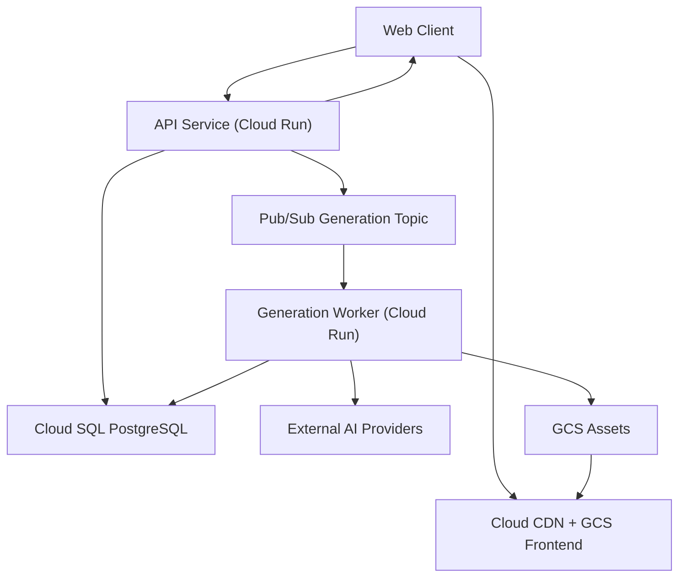
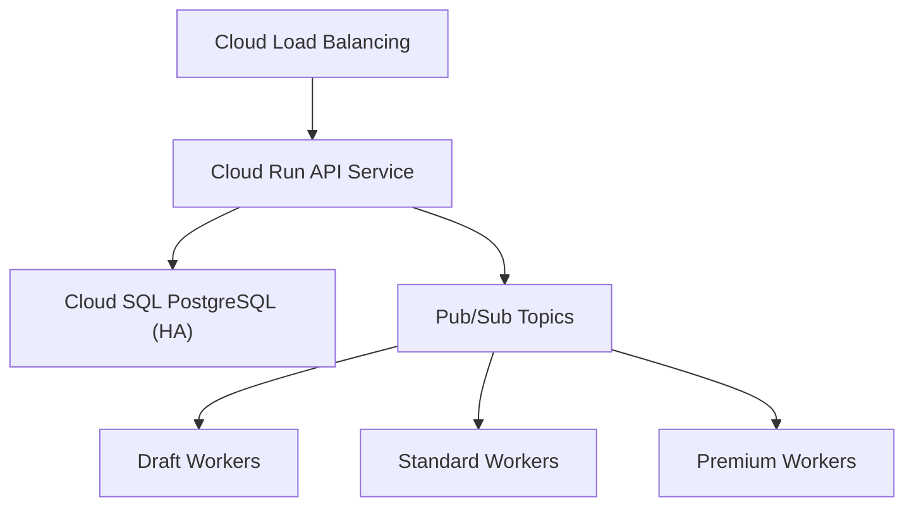

จัดทำเอกสารที่อัปเดตสถาปัตยกรรมและการตั้งค่าต่างๆ จาก AWS เปลี่ยนเป็น Google Cloud Platform (GCP) ให้เรียบร้อยแล้วค่ะ โดยปรับแก้ชื่อ Service และเครื่องมือต่างๆ ให้ตรงกับ Ecosystem ของ Google Cloud อย่างครบถ้วนค่ะ

# Infrastructure Baseline and Google Cloud Migration Plan

> สถานะ: Initial implementation specification  
> ปรับปรุงล่าสุด: 24 กรกฎาคม 2026  
> เป้าหมายระบบ: AI Image Generation Platform / ModelPromptForge  
> กลุ่มผู้อ่าน: Software Engineer, DevOps, SRE และ AI Coding Agent

## 1. วัตถุประสงค์

เอกสารนี้กำหนดโครงสร้างเริ่มต้นสำหรับย้ายระบบจาก `localhost` ไป Google Cloud (GCP) โดยมีเป้าหมายดังนี้

1. เปิดใช้งาน Production ระยะแรกได้โดยไม่ลงทุนเกินความจำเป็นสำหรับผู้ใช้ประมาณ 20 คน/วัน
2. แยกงานสร้างภาพออกจาก HTTP request ด้วย asynchronous job queue
3. ย้ายข้อมูลจาก JSON ไป PostgreSQL อย่างตรวจสอบและ rollback ได้
4. เก็บไฟล์ภาพใน Object Storage แทน Database หรือ local disk
5. รองรับการขยายเป็น Cloud Run แบบเต็มรูปแบบ และ GKE (Google Kubernetes Engine) ใน Phase 2–3 โดยไม่ต้องเปลี่ยน business contract
6. กำหนด security, backup, monitoring, cost guardrails และ acceptance criteria ก่อนเปิด Production

เอกสารนี้เป็น infrastructure baseline ไม่ใช่คำสั่งให้เปิด GCP Service ทุกตัวทันที ผู้ implement ต้องเปิดเฉพาะบริการของ Phase ปัจจุบัน

## 2. ข้อมูลที่ AI ต้องตรวจจาก Repository ก่อน Implement

workspace ที่ใช้จัดทำเอกสารยังไม่มี source code และ `AGENTS.md` ดังนั้น AI Coding Agent ต้องตรวจข้อมูลต่อไปนี้จาก repository เวอร์ชันล่าสุดก่อนแก้โค้ด:

- Runtime และ framework จริงของ Frontend/API
- คำสั่ง build, start, test และ migration
- รูปแบบ JSON และ schema version ปัจจุบัน
- วิธี login/authentication ปัจจุบัน
- Credit, Payment, Generation และ Asset lifecycle
- Provider adapters ที่มีอยู่จริง
- Environment variables เดิม
- Dockerfile, reverse proxy และ deployment configuration เดิม
- กติกาใน `AGENTS.md` และ architecture source of truth ของโครงการ

หากข้อมูลใน repository ขัดกับเอกสารนี้ ให้หยุดเฉพาะส่วนที่ขัดกันและเสนอ migration decision record ห้ามเดา schema หรือเปลี่ยน authentication/payment flow โดยพลการ

## 3. หลักการ Architecture ที่ห้ามเปลี่ยนระหว่าง Phase

### 3.1 Stable contracts

- Client ขอสร้างภาพผ่าน API และได้รับ `202 Accepted` พร้อม `job_id`
- API ไม่เปิด HTTP connection รอ AI Provider สร้างภาพ
- API ทำ validation, authorization, idempotency และ reserve credit ก่อน enqueue
- Queue message เก็บเฉพาะ identifier และ routing metadata ขนาดเล็ก
- Worker อ่านรายละเอียดงานจาก PostgreSQL
- Worker จำกัด concurrency แยกตาม Provider/Model
- รูปจริงเก็บใน Cloud Storage (GCS); PostgreSQL เก็บ object key และ metadata
- Credit ใช้ immutable ledger; ห้ามแก้ balance โดยไม่มี ledger entry
- ทุก external side effect ต้องรองรับ retry โดยไม่สร้างภาพ/หักเครดิต/คืนเงินซ้ำ
- Application ต้องไม่พึ่ง local filesystem แบบถาวร
- Infrastructure configuration ต้องสร้างซ้ำได้ด้วย Infrastructure as Code (Terraform)

Google Cloud Pub/Sub เป็นระบบ `at-least-once delivery` และอาจส่งข้อความซ้ำหรือสลับลำดับได้ ดังนั้น worker ต้อง idempotent ตั้งแต่ Phase 1 ไม่ใช่เพิ่มภายหลัง 

### 3.2 Non-goals ของ Phase 1

- ไม่ทำ Kubernetes/GKE
- ไม่ทำ active-active multi-region
- ไม่ทำ multi-cloud database
- ไม่ใช้ Memorystore (Redis) หาก PostgreSQL และ application rate limit ยังเพียงพอ
- ไม่ใช้ WebSocket หาก polling 3–5 วินาทีรองรับ UX ได้
- ไม่เก็บ image binary หรือ Base64 ใน PostgreSQL/Pub/Sub
- ไม่สร้าง microservice จำนวนมาก
- ไม่ใช้ Cloud NAT หาก architecture เริ่มต้นหลีกเลี่ยงได้

## 4. Phase Overview

| Phase | เป้าหมาย | ปริมาณใช้งานโดยประมาณ | Compute | Database | Availability |
|---|---|---:|---|---|---|
| Phase 1: Pilot | ใช้งานจริงแบบประหยัด | 20 | Cloud Run 1 ชุด (Scale to Zero) | Cloud SQL PostgreSQL แบบ Zonal | Backup + manual recovery |
| Phase 2: Growth | แยก API/Worker และ autoscale | 100–3,000 | Cloud Run + Cloud Load Balancing | Cloud SQL PostgreSQL HA (Regional) | Multi-task, automated scaling |
| Phase 3: Scale | รองรับงานจำนวนมาก/หลายทีม | 5,000+ | GKE (Google Kubernetes Engine) | Cloud SQL HA + pgBouncer/Replica | HA, controlled failover, advanced delivery |

จำนวน ปริมาณใช้งานโดยประมาณ เป็นเพียงตัวช่วย ไม่ใช่ trigger หลัก การเลื่อน Phase ต้องอ้างอิง metric, reliability และต้นทุนในหัวข้อ 15

## 5. Target Architecture



### 5.1 Request flow

1. Client ขอ Signed URL สำหรับ upload source image
2. Client upload โดยตรงไป GCS
3. Client เรียก `POST /v1/generations` พร้อม `Idempotency-Key`
4. API ตรวจ user, quota, model availability และ input asset ownership
5. API เปิด transaction เพื่อ reserve credit และสร้าง `generation_job`
6. หลัง transaction สำเร็จ API ส่ง message เข้า Pub/Sub
7. API คืน `202` พร้อม `job_id`, `status_url` และเวลารอโดยประมาณ
8. Worker รับ job ด้วย pull subscription และ conditional state transition
9. Worker เรียก Provider ตาม capacity/rate limit
10. Worker stream/download ผลลัพธ์ไป GCS และสร้าง asset metadata
11. Worker finalize credit หรือ release reservation เมื่อ fail
12. Client poll `GET /v1/generations/{job_id}` ทุก 3–5 วินาที

GCS Signed URL ให้สิทธิ์ upload/download แบบจำกัดเวลาโดยไม่ต้องมอบ GCP credential ให้ Client

## 6. Phase 1 — Pilot / Minimum Production

### 6.1 Service mapping

| Component | Service | Required |
| --- | --- | --- |
| Frontend static build | Cloud Storage (GCS) + Cloud CDN | Yes |
| API + Worker | Cloud Run (แยกรันคนละ Service) | Yes |
| Database | Cloud SQL for PostgreSQL (Zonal) | Yes |
| Job queue | Cloud Pub/Sub + Dead-letter topics | Yes |
| Uploads/results | Private GCS bucket | Yes |
| Container registry | Artifact Registry | Yes |
| Authentication | Auth เดิมหรือ Identity Platform | ตามระบบเดิม |
| Secrets | Secret Manager | Yes |
| Logs/alarms | Cloud Logging / Cloud Monitoring | Yes |
| DNS/TLS | Cloud DNS / ผู้ให้บริการ DNS เดิม + Google-managed SSL | Yes |
| Load Balancing, Redis, WAF, GKE | ยังไม่เปิด | No |

### 6.2 Initial sizing

* API: Cloud Run, 1 vCPU, RAM 1–2 GB, Concurrency 80
* Worker: Cloud Run service แยกจาก API, เปิดใช้ CPU always allocated หากมี background processing
* Worker concurrency: เริ่ม `1–2` ต่อ Provider แล้วปรับจาก provider limits
* PostgreSQL: db-f1-micro หรือ custom เล็กสุดที่ใช้งานได้, daily backup
* Pub/Sub: Retention 1-3 วัน
* Message payload target: ต่ำกว่า 16 KB
* Cloud Logging retention: 7–14 วัน
* GCS temporary lifecycle: 1–7 วัน
* Generated result retention: 30–90 วันตาม product policy

### 6.3 Process isolation

ให้แยก Cloud Run เป็น 2 Services อย่างชัดเจน:

```text
cloud-run-api      -> HTTP API (Web service)
cloud-run-worker   -> Pub/Sub Push/Pull consumer (Worker service)
app-migrate        -> Cloud Run job สำหรับ one-off database migration

```

ห้ามให้ API process เริ่ม worker ภายใน process เดียวกัน เพราะจะ scale/deploy แยกใน Phase 2 ได้ยาก

### 6.4 Phase 1 cost guardrail

* Infrastructure target: ประมาณ 1,200–2,000 บาท/เดือน ไม่รวม AI API, payment fee, email และ domain
* ตั้ง Cloud Billing budgets alerts ที่ 50%, 80% และ 100% ของงบ
* ตั้ง daily provider spending ceiling ใน application
* ห้ามเปิด Cloud Load Balancing, Cloud NAT, Cloud SQL HA, Memorystore หรือ WAF (Cloud Armor) โดยไม่มี Architecture Decision Record (ADR)
* Tag (Labels) ทุก resource: `project`, `environment`, `owner`, `cost-center`, `managed-by`

ตัวเลขข้างต้นเป็น budget envelope ไม่ใช่ GCP quotation ต้องตรวจราคาจริงใน Google Cloud Pricing Calculator ตาม Region และวันที่ deploy

## 7. Phase 2 — Growth / Production-ready

### 7.1 Trigger

เข้าสู่ Phase 2 เมื่อเกิดข้อใดข้อหนึ่งต่อเนื่อง:

* API CPU หรือ memory เกิน 70% ใน peak window
* p95 API latency เกิน 500 ms โดยไม่นับเวลา generate
* Pub/Sub oldest unacked message เกิน SLA มากกว่า 3 ครั้ง/สัปดาห์
* database connection usage เกิน 70% ของ limit
* รายได้รองรับ fixed cost ของ Load Balancer / Cloud SQL HA

### 7.2 Service changes



* เพิ่ม Cloud Load Balancing วางไว้หน้า Cloud Run API
* แยก Worker Cloud Run Service ตาม workload/priority
* ย้าย database ไป Cloud SQL แบบ High Availability (Regional)
* เพิ่ม Cloud SQL Auth Proxy หรือ pgBouncer เมื่อ connection churn หรือ autoscaling ทำให้ connection เกือบเต็ม
* เพิ่ม Cloud Armor (WAF) เมื่อ public exposure/abuse เพิ่มขึ้น
* เพิ่ม Memorystore (Redis) เฉพาะกรณีมี use case วัดผลแล้ว เช่น distributed rate limit หรือ hot cache

### 7.3 Autoscaling

API scaling (Cloud Run):

* Minimum instances: 1-2
* Cloud Run จะจัดการ Scale out ให้ตาม Concurrency/CPU อัตโนมัติ

Worker scaling:
ใช้ความสามารถการตั้งค่า Max Instances ของ Cloud Run Worker หรือพิจารณาใช้ KEDA (ถ้าขยับไป GKE) โดยอ้างอิงจาก Pub/Sub `num_undelivered_messages`

## 8. Phase 3 — High Scale / Platform Infrastructure

### 8.1 Trigger

พิจารณา GKE (Google Kubernetes Engine) เมื่อ:

* มี independently deployable services มากกว่า 10–15 services
* มี DevOps/SRE รับผิดชอบ cluster lifecycle
* ต้องใช้ GPU/self-hosted model หรือ node pool หลายประเภท
* ต้อง scale worker จาก external metrics ด้วย KEDA แบบละเอียด
* ค่าใช้จ่าย Cloud Run สูงกว่า Compute Engine/Spot VM อย่างมีนัยสำคัญ
* ต้องแยก tenant/workload isolation ระดับ namespace/node

หาก Cloud Run ยังตอบโจทย์และราคาดี ไม่จำเป็นต้องย้ายไป GKE

### 8.2 Phase 3 components

* GKE Autopilot หรือ Standard cluster
* KEDA/HPA scale จาก Pub/Sub backlog และ provider capacity
* Separate node pools: API, general worker, image processing, optional GPU
* Cloud SQL PostgreSQL HA + Read Replicas
* Eventarc สำหรับ event integration เมื่อจำเป็น
* Centralized tracing และ SLO dashboards (Cloud Trace / Cloud Profiler)
* Cross-project environments: development, staging, production

## 9. Queue and Worker Specification

### 9.1 Queue layout

Phase 1 (Pub/Sub Topics):

```text
generation-jobs-topic
generation-jobs-dlq-topic

```

### 9.2 Message contract

```json
{
  "schema_version": 1,
  "message_id": "uuid",
  "job_id": "uuid",
  "tenant_id": "uuid",
  "priority": "standard",
  "provider_hint": "auto",
  "created_at": "ISO-8601",
  "trace_id": "string"
}

```

ห้ามใส่ prompt เต็ม, secret, source image, Base64 หรือ provider credential ใน message

### 9.3 Worker rules

1. อ่าน job แล้ว lock ด้วย atomic state transition เช่น `queued -> processing`
2. ถ้า job `completed` หรือ `failed_final` แล้ว ให้ acknowledge message (ack) ทันที
3. ใช้ unique constraint/idempotency record ต่อ provider attempt
4. ยืดเวลา ack deadline (extend lease) หากงานนานกว่าที่คาด
5. retry เฉพาะ transient errors: timeout, 429, provider 5xx
6. exponential backoff + jitter
7. ไม่ retry validation error, blocked content หรือ insufficient credit
8. หลังเกิน maximum delivery attempts ส่งลง DLQ
9. ack Pub/Sub message หลัง database commit สำเร็จเท่านั้น

## 10. PostgreSQL Data Design

*(ใช้โครงสร้างตารางและกฏการจัดการข้อมูลเหมือนเอกสารตั้งต้น)*

## 11. JSON-to-PostgreSQL Migration

*(ใช้กลยุทธ์ Reconcile และ Staging Tables เหมือนเอกสารตั้งต้น)*

## 12. GCS Asset Design

### 12.1 Buckets

แนะนำแยกตาม environment และ access boundary:

```text
{project}-{env}-frontend
{project}-{env}-assets
{project}-{env}-logs-or-backups   # เพิ่มเมื่อจำเป็น

```

ห้ามใช้ production bucket ร่วมกับ development

### 12.2 Object keys

*(ใช้ Path โครงสร้างเหมือนเอกสารตั้งต้น)*

### 12.3 Security and lifecycle

* ปิด Public Access ทุก assets bucket ยกเว้น Frontend
* ใช้ GCS Signed URL อายุสั้นสำหรับการอัปโหลดและดาวน์โหลด
* เปิด Google-managed encryption keys (GMEK) เป็นค่าเริ่มต้น
* เปิด Object Versioning เฉพาะ bucket/object class ที่ต้องกู้คืนจาก overwrite
* Object Lifecycle Management ลบ temporary files และ abort incomplete multipart uploads

## 13. Security Baseline

* ใช้ Google Cloud Service Account (IAM) สำหรับ workload; ห้ามฝัง Service Account Key (JSON) ใน image/repository โดยตรง (ใช้ Workload Identity)
* Secrets อยู่ใน Secret Manager
* แยก secret ของ dev/staging/prod ผ่าน IAM Policies หรือต่าง Project
* TLS ทุก public endpoint (จัดการโดย Cloud Run / Cloud Load Balancing)
* redact token, password, API key, signed URL และ sensitive prompt จาก logs

## 14. Observability and Operations

### 14.1 Structured log fields

*(เก็บข้อมูลตามเอกสารตั้งต้น)*

### 14.2 Metrics

API:

* request count/error rate
* p50/p95/p99 latency

Queue/Worker (Pub/Sub):

* `num_undelivered_messages` (Backlog size)
* `oldest_unacked_message_age`
* DLQ message count

## 15. Phase Promotion Gates

*(ประเมินตาม Gate เดิมของเอกสารตั้งต้น)*

## 16. Infrastructure as Code Structure

ใช้ Terraform เป็นเครื่องมือหลัก

```text
infrastructure/
  README.md
  modules/
    networking/
    frontend/
    assets/
    pubsub/
    database/
    cloudrun/
    observability/
    security/
  environments/
    dev/
    staging/
    production/

```

* State ของ IaC ต้องเก็บไว้ใน GCS Backend พร้อมเปิด state locking
* `plan` ใน Pull Request; `apply` เฉพาะ protected workflow

## 17. CI/CD Deployment Order

1. Lint, unit test, dependency/security scan
2. Build immutable container image
3. Push image ขึ้น Artifact Registry พร้อม Tag ด้วย commit SHA
4. Apply database migration ด้วย Cloud Run Job (one-off task)
5. Deploy API ไปยัง Cloud Run
6. Run API smoke test
7. Deploy Worker ไปยัง Cloud Run
8. Run end-to-end test
9. Verify queue, DB, GCS และ credit reconciliation

## 18. Local Development Compatibility

Local development ควรใช้ interface เดียวกับ Production:

```text
PostgreSQL        -> Docker Compose local
GCS API           -> GCP Storage Emulator
Pub/Sub API       -> GCP Pub/Sub Emulator
Secrets           -> local .env ที่ไม่ commit
AI Providers      -> mock adapter หรือ sandbox account

```

## 19. Implementation Work Packages for AI Coding Agent

*(ยึดตาม WP-01 ถึง WP-07 ตามเอกสารตั้งต้น แต่เปลี่ยนเป้าหมายเป็น GCP Components)*

## 20. Phase 1 Acceptance Criteria

* [ ] Fresh GCP environment สร้างได้จาก Terraform
* [ ] Frontend เปิดผ่าน HTTPS (Cloud CDN / GCS)
* [ ] `POST /generations` คืน `202 + job_id`
* [ ] duplicate Pub/Sub message ไม่สร้างผลลัพธ์ซ้ำ
* [ ] รูป upload/download ผ่าน Signed URL และ assets bucket ไม่ public
* [ ] failed jobs เข้า DLQ ตาม policy
* [ ] budget alert ของ Cloud Billing พร้อมทำงาน

## 21. Backup, RPO and RTO Baseline

* Database automated backup: daily (จัดการโดย Cloud SQL)
* Backup retention: 7–14 วัน
* RPO target: ไม่เกิน 24 ชั่วโมง
* RTO target: 4–8 ชั่วโมง
* Restore test: ก่อน Production และอย่างน้อยรายไตรมาส

## 22. Open Decisions Before Production

*(ใช้ชุดคำถามตัดสินใจตามเอกสารตั้งต้น เพื่อสรุปเป็น ADR)*

## 23. Official References

* [Google Cloud Pub/Sub Documentation](https://cloud.google.com/pubsub/docs)
* [Google Cloud Storage (GCS) Signed URLs](https://cloud.google.com/storage/docs/access-control/signed-urls)
* [Google Cloud Storage Object Lifecycle Management](https://cloud.google.com/storage/docs/lifecycle)
* [Google Cloud Run Documentation](https://cloud.google.com/run/docs)
* [Google Cloud SQL for PostgreSQL](https://cloud.google.com/sql/docs/postgres)
* [Google Cloud IAM and Workload Identity](https://cloud.google.com/iam/docs)

```

```